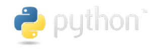
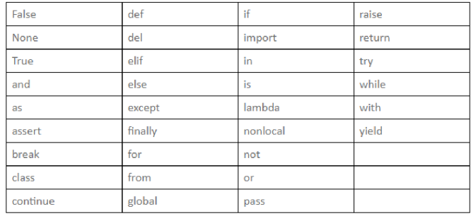

# 为什么选择Python

## Python 简史

​	1989 年，荷兰人 Guido van Rossum发明了一种面向对象的解释型高级编程语言，将其命名为 Python（Python单词的本义是蟒蛇），标志如下图所示：



​	1991年，Python 的第一个公开发行版问世。从 2004 年开始，Python 的使用率呈线性增长，逐渐受到编程者的欢迎和喜爱。2010 年，Python 荣膺 TIOBE 2010 年度语言桂冠；2017-2021 年，在 IEEE Spectrum 发布的年度编程语言排行榜中，Python 已经夺得五连霸。

## Python 版本

​	Python 自发布以来，主要有三个版本：1994年发布的 Python 1.0 版本(已过时)、2000年发布的 Python 2.0 版本(到 2022年1月份已经更新到 2.7.18)和 2008年发布的 3.0 版本(2022年1月份已经更新到 3.10.1 版本)。

>   注意：我们使用的Python版本为 3.8.10。
>

## Python 特点

​	Python 的设计哲学为 优雅、明确、简单。一直以来 Python 始终贯彻着这一理念，以至于现在网络上流传着“人生苦短，我用 Python”的说法，充分说明了 Python 有着语法简洁、容易学习、开发速度快和应用范围广等特点。

​	Python 是一种扩充性强的编程语言。它具有丰富和强大的库，能够把使用其他语言制作的各种模块(尤其是C/C++语言)很轻松地联结在一起，所以 Python 常被称为 胶水 语言。

​	一般来说，Python的主要特点体现如下：

​		易于学习 Python有相对较少的关键字，结构简单，明确定义的语法，学习起来简单便捷。易于阅读 Python代码定义和编码结构的清晰明了。

​		易于维护 Python的成功在于它的源代码是相当容易维护的。

​		强大的标准库 Python的最大的优势之一是丰富的库，跨平台的，在UNIX，Windows和Macintosh兼容很好。

​		互动模式：互动模式的支持，您可以从终端输入执行代码并获得结果的语言，互动的测试和调试代码片断。

​		可移植：基于其开放源代码的特性，Python已经被移植（也就是使其工作）到许多平台。可扩展：例如一些运行很快的关键代码、或是一些不愿开放的算法，可以使用C或C++完成关键程序功能，然后从你的Python程序中对其进行调用。

​		数据库：Python提供所有主要的商业数据库的接口。

​		GUI编程：Python支持GUI可以创建和移植到许多系统调用。

​		可嵌入: 你可以将Python嵌入到C/C++程序，让你的程序的用户获得"脚本化"的能力。

## Python 应用领域

​	Python 作为一种功能强大的编程语言，因其简单易学而受到很多开发者的青睐。Python 的应用域概括起来主要有以下几个方面：

​		应用程序开发：拥有脚本编写、软件开发等标配能力。

​		AI人工智能：机器学习、神经网络、深度学习等方面得到广泛的支持和应用。

​		数据分析：大数据行业的基石。

​		自动化：自动化办公、运维工程师首选的编程语言。

​		云计算：拥有成功案例 OpenStack 与 Rackspce 合作的云计算管理平台。

​		网络爬虫：大数据行业获取数据的核心工具。

​		Web 开发：完善的框架支持，开发速度快。

​		游戏开发：简单、高效、代码少。

​	总而言之，Python 是一个高层次的结合了解释性、编译性、互动性和面向对象的脚本语言。Python 的设计具有很强的可读性，相比其他语言它具有特色语法结构。对初级程序员而言，简单亲和，具有良好的上手能力，而且Python它支持广泛的应用程序开发，可以说它能支持你所有能想到的应用开发。

# Python的安装和IDE的选择

## 	1、Python的安装

​			

## 	2、VSCODE和pyChram


## 	3、IDE的安装


# Python 语言基础

## 	注释

​		注释是指在代码中添加的标注性的文字，旨在告诉别人你的代码要实现什么功能，从而帮助程序员更好地阅读代码。注释的内容将被 Python 解释器忽略，并不会在执行结果中体现出来。在 Python 中，通常包括 3 种类型的注释，分别是单行注释、多行注释和中文编码声明注释。这些注释在 Pycharm 中的效果如图所示。

```python
#!/usr/bin/python3
# -*- coding: UTF-8 -*-

x = int(input("请输入x的值: ").strip())  # 输入变量x
y = int(input("请输入y的值: ").strip())  # 输入变量y
# 定义函数：实现计算两个数的和
def add(x, y):
 z = x + y
 # 输出显示
 print(f'{x} + {y} = {z}')
 return z
# 调用函数
add(x, y)
```

​	注意：如果三引号作为语句的一部分出现，那么就不是注释，而是字符串，这一点一定要注意区分。如下面所示的代码即为字符串：

``` python
print('''请在控制台输出您的姓名、年龄、以及电话号码:''')

name = """彭于晏"""
```

## 	缩进

​		缩进是Python的灵魂，据说是因为Python的作者不喜欢大括号，所以才发明了Python。严格的缩进使得Python的代码显得非常精简并且有层次，同时在Python世界里，对待代码的缩进要十分小心，如果没有正确地使用缩进，代码所做的事情可能和我们的期望相差甚远，还有一点需要注意的是：缩进不要混用 Tab 和空格。

​		Python的冒号 ’:‘ 通常需要和缩进配套使用，在PyCharm里面， 在正确的位置输入冒号(:)，Pycharm会自动在下一行进行缩进。例如：if和else语句后边加上冒号(:)，然后按下回车键，第二行开始的代码也会自动进行缩进，智能的IDE能够帮我们处理一些基本的缩进，但不能保证在编写代码时不出现错误，因此我们要学会熟练地使用格式化代码，下面展示了简单的示例。

```python
#!/usr/bin/python3
# -*- coding: UTF-8 -*-
x = int(input("请输入x的值: ").strip())  # 输入变量x
y = int(input("请输入y的值: ").strip())  # 输入变量y
if x > y:
 print('x 大于 y')
elif x < y:
 print('x 小于 y')
else:
 print('x 等于 y')
```

## 	命名规范

​		命名规范在编写代码中起到很重要的作用，虽然不遵循命名规范，程序也可以运行，但是使用命名规范可以更加直观地了解代码所代表的含义。下面介绍 Python 中常用的一些命名规范。

-   模块名尽量短小，并且使用全部小写字母，可以使用下划线分隔多个字母。例如，gm、game_reg、ybf_course都是推荐使用的模块名称。
-   包名尽量短小，并且使用全部小写字母，不推荐使用下划线。例如，com.youbafu、cn.ybf、cn.ybf.books 都是推荐使用的包名称，而 com_youbafu 就不推荐的。
-   类名采用单词首字母的大写形式(即 Pascal 风格)。例如，定义一个借书类，可以命名为 BorrowBook。
-   模块内部的类采用下划线 _ +Pascal 风格的类名组成。例如，在 BorrowBook 类中的内部类，可以使用 _BorrowBook 命名。
-   函数、类的属性和方法的命名规则同模块类似，也是全部采用小写字母，多个字母间用下划线 _ 分隔。
-   常量命名时采用全部大写字母，可以使用下划线。在 Python 中没有类似于其他语言中 const 关键字来定义常量。使用双下划线 __ 开头的实例变量或方法是类私有的。

## 	关键字

​		Python中的关键字是已经被赋予特定意义的一些单词，在开发程序时，不可以把这些关键字作为变量、函数、类、模块和其他对象的名称来使用。在下图看到的 if 和 and 就是关键字。Python 语言中的关键字如下表所示。



## 	标识符

​		标识符可以简单地理解为是一个名字，比如每个人都有自己的名字，它主要用来标识变量、函数、类、模块和其他对象的名称。Python 语言的标识符命名规则如下：

1.   由字母（汉字）、下划线 _ 和数字组成，并且第一个字符不能是数字。
2.   不能使用 Python 中的关键字，来看看示例：

```python
# 以下是合法的标识符：
USERID
name
model2
youbafu_age
彭于晏
# 以下是不合法的标识符：
52youbafu  # 以数字开头
try  # Python 中的关键字
$money # 不能使用特殊符号$
```

3.   区分字母大小写：在 Python 中，标识符中的字母是严格区分大小写的，两个同样的单词，如果大小写的格式不一样，所代表的意义是完全不同的。例如，下面的 3 个变量是完全独立、毫无关系的，就像 3 个长得比较像的人，彼此之间都是独立的个体：

	number = 0 # 全部小写

     Number = 1 # 部分大写

     NUMBER = 2 # 全部大写

4.   Python 中以双下划线开头的标识符有特殊意义，一般应避免使用相似的标识符：

      以双下划线开头的标识符 (如 __add) 表示类的私有成员。

      以双下划线开头和结尾的是 Python 里专用的标识，例如，' ____init()____' 表示构造函数。

     

     ## 	变量

     ​		在程序的世界里，我们为一个数值起名字的时候，它将会存储在内存中，我们把这块内存称为变量(variable)。在大多数语言中，把这种行为称为 “给变量赋值” 或 “把值存储在变量中”。不过在Python世界里，变量就是一个名字，通过这个名字，就可以找到我们想到的东西。
     
     为变量赋值是通过等号 = 来实现（注意是一个等号 = ）。语法格式为：
     
     变量名 = value
     
     变量为什么不叫“恒量”而叫“变量”？正是因为它是可变的！来看看下面的示例：
     
     x = 3
     
     x = 5
     
     z = x + 6
     
     print(z)
     
     \# 结果: 11
     
     ​	这个例子先创建一个变量，名字叫x，给它初始化赋值为3，然后又给它赋值为5（此时3就被5替换掉）；接下来创建另外一个变量z，它的值是变量x和6的和。
     
     ​	刚刚我们说到了 Python 是一种动态类型的语言，也就是说，不仅是变量的值是可以发生变化的，连变量的类型可以随时变化。
     
     ​	举个栗子：创建变量 nickname，并赋值为字符串 彭于晏，然后输出该变量的类型，可以看到该变量为字符串类型，再将变量赋值为数值 1024，并输出该变量的类型，可以看到该变量为整型。
     
     nickname = '彭于晏'
     
     print(nickname, type(nickname))
     
     nickname = 666
     
     print(nickname, type(nickname))
     
     \# 结果如下：
     
     彭于晏 <class 'str'>
     
     666 <class 'int'>
     
     在 Python 语言中，使用内置函数 type() 可以返回变量类型。
     
     敲黑板，重点来了：
     
     •  等号（=）是赋值的意思，左边是名字，右边是值，不能写反了。
     
     •  在使用变量之前，需要对其先赋值。
     
     •  变量名可以包括字母、数字、下画线，但变量名不能以数字开头,不能使用 Python 中的关键字。
     
     ​	•  字母可以是大写或小写，但大、小写是不同的。也就是说，a和A对于Python来说是完全不同的两个名字。
     
     ​	•  对变量的命名要符合标识符规范，首选有意义的单词作为变量名，即见名知意，作为一名有趣的程序员，来点中文名也蛮有趣的。
     
     # Python 易犯的错误
     
     ​	虽然说 Python 相比于其他语言，它的语法比较简单易学，但是不注意细节一个不小心，就会掉进语法错误的坑里面去。
     
     今天就给大家来讲几个平常非常容易掉“坑”的地方。
     
     ## 	1、缩进问题
     
     ​			和其他语言的语法最大的不同就是，Python 不能用括号来表示语句块，也不能用开始或结束标志符来表示，而是靠缩进来区分代码块的。
     
     常见的错误用法：
     
     ### 	第一种
     
     ```python
     print('你好')
      print('世界')
     # 错误是第二个缩进会导致两个print语句是包含和被包含的关系，但他们两者是属于同一个代码块的，所以应该写成：
     print('你好')
     print('世界')
     ```
     
     ### 第二种
     
     ```python
     flag = True
     if flag:
      print("彭于晏")
      print("该上课了！")
     # 错误是第二个print语句的的缩进，改正的方法有两种。
     # 一是如果两个 print 语句是属于同一代码块的，应该改正为：
     flag = True
     if flag:
      print("彭于晏")
      print("该上课了！")
     # 二是如果第三行的 print 语句是和 if 语句是同一级的，则改正为：
     flag = True
     if flag:
      print("彭于晏")
     print("该上课了！")
     ```
     
     ### 第三种
     
     ​	在Python 3 中，缩进的时候，不能 Tab 和空格混用，每个缩进层次应该选择只使用 Tab 或者只使用空格。
     
     
     
     ## 2、忘记写冒号
     
     ​	在 if、elif、else、for、while、class、def 语句后面忘记添加 “ : ”
     
     ```python
     x = 6
     if x == 6
      print("Hello, 判断语句没写: ")
     def func()
      print('函数定义没写: - -!')
     ```
     
     ## 3、使中文符号
     
     ​	刚刚说了没写冒号 : 程序会出现错误，可有的同学说，我明明写了：的，为什么也会有错误呢，这个时候就要检查一下是不是你切换到了中文输入法并输入了‘：’，因为中文的冒号在程序中是运行通不过的。
     
     ```python
     x = 6
     if x == 6：
      print("Hello, 判断语句使用了中文冒号： ")
     def func()：
      print('函数定义使用了中文冒号： - -!')
     ```
     
     ## 4、变量没有定义
     
     ```python
     if age > 18:
      print("你已经成年了，嗨起来吧") 
     # 变量 age 使用前并没有对其进行定义，会导致：“NameError: name 'age' is not defined.”# 改进如下
     age = 20
     if age > 18:
      print("你已经成年了，嗨起来吧")
     ```
     
     ## 5、用 “=” 做等值比较
     
     ```python
     animal = 'dog'
     if animal = 'cat':
      print("这是一只猫")
     if animal = 'dog':
      print("这是一条狗")
     # 等值比较用 = 是错误的，应该改为 == 
     animal = 'dog'
     if animal == 'cat':
      print("这是一只猫")
     if animal == 'dog':
      print("这是一条狗")
     ```
     
     ## 6、字符串非字符串连接
     
     ```python
     num = 1
     string = '2'
     和 = num + string
     # 数字类型和字符串类型相加 在Python 中是不可以的
     # 应该改成
     num = 1
     string = '2'
     和 = num + int(string)
     # 或者
     num = 1
     string = '2'
     和 = str(num) + string
     # 大家可以自己尝试运行两段代码，看看有什么不一样
     ```
     
     

