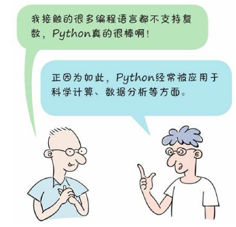
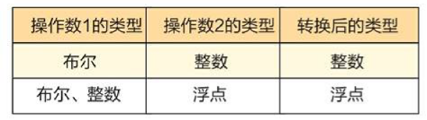
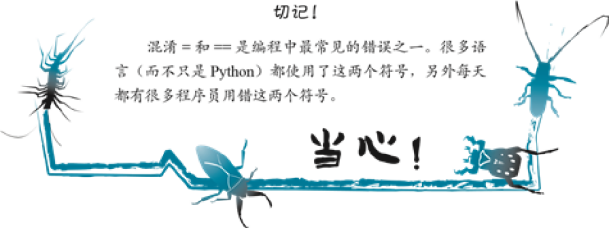
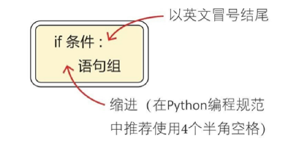
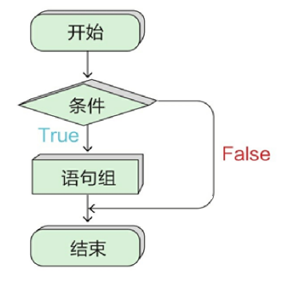
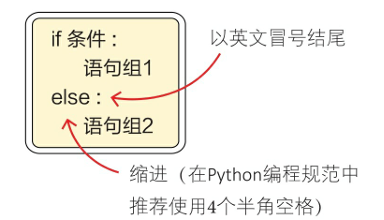
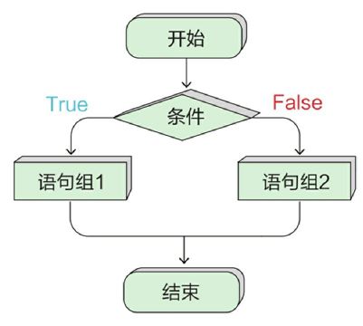
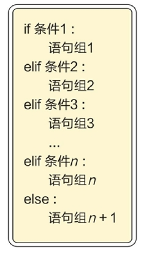
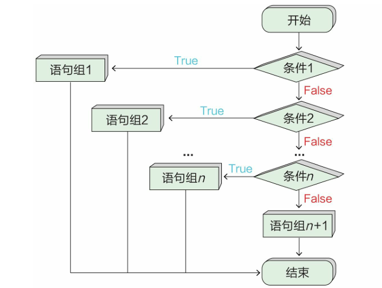

# 数值类型

上一堂课我们学习了Python变量的定义不需要指定类型，让Python的变量看起来更像是名字标签，想贴哪儿就贴哪儿。通过这个标签，就可以轻易找到变量在内存中对应的存放位置。但这绝不是说Python就没有数据类型这回事儿，大家应该还记得字符串和非字符串运算的"大坑"。

虽然Python在变量定义的时候不需要显示指定类型，但是在内存中存储的数据是有具体类型的，只是这个工作Python悄悄完成了，我们感觉不到而已。例如在内存中：一个人的姓名是字符串类型、年龄是数值类型，婚姻状况是布尔类型。这里的字符串类型、数值类型、布尔类型都是 Python 语言中提供的基本数据类型。

我们先来学习Python的数值类型，Python数值类型有4种：

​	int (整数类型)

​	float (浮点类型)

​	complex (复数类型)

​	bool (布尔类型)

注意:布尔类型也是数值类型，事实上布尔类型是整数类型的一种。

## 整型

整型就是平时所见的整数，用来表示整数数值，即没有小数部分的数值。

Python3 的整型已经与长整型进行了无缝结合，现在 Python3 的整型类的长度不受限制，具体能到多大，就看大家电脑的配置了，因为最大只受所在计算机硬件的限制。所以，在 Python3 中可以很容易地进行大数运算。

```python
# 有个小宝宝今年3岁，马上就过年了，过完年小宝宝就4岁了，我们来温习一下变量并计算一下
小宝宝年龄 = 3
小宝宝年龄 = 小宝宝年龄 + 1
print(f'过完年小宝宝就 {小宝宝年龄} 岁啦')  # 别急这种输出方式马上就会讲到


# 天文学家保守估计，宇宙中的星系数量可能会达到1万亿个。而保守估计，每一个星系当中有1000万亿颗恒星，算一算目前人类观测到的宇宙里大概有多少颗恒星？
# 这在以前是需要写算法去实现的！但是在Python中，so easy。
宇宙恒星数量 = 10000000000123 * 10000000000000456 
print(f'目前人类观测到宇宙的恒星数量大概有 {宇宙恒星数量} 颗')
```

\#运行结果

过完年小宝宝就 4 岁啦
目前人类观测到宇宙的恒星数量大概有 100000000001234560000000056088 颗

>注意：Python中整数类型(int)包括十进制整数、八进制整数、十六进制整数和二进制整数，简单说就是一个整数有不同的表示方式，我们习惯性的使用十进制的整数，而在计算机中所有的数据都是用二进制（0和1）表示。

## 浮点型

​	浮点型就是平时所说的小数，例如，圆周率3.14就是一个浮点型数据，再例如地球到太阳的距离约1.5亿千米，也是一个浮点型。Python中 区分整型和浮点型的唯一方式，就是看有没有小数点。

​	谈到浮点型，就不得不说一下E记法。E记法也就是平时所说的科学计数法，用于表示特别大和特别小的数。打个比方，如果给Python提供一个非常极端的数据，那么它可能会采用E记法来表示。

```python
# 足球世界里 梅西身价： 7000万欧元， 中国武磊：400万欧元， 梅西值多少个武磊 - -梅西身价 = 7000.0
武磊身价 = 400.0
梅西值多少个武磊 = 梅西身价 / 武磊身价
print(f'梅西值 {梅西值多少个武磊} 个武磊')
# 地球到太阳距离大概1.5亿公里，大概多少微米呢，用浮点数表示一下地日距离 = 1.5 * 100000000 * 1000 * 1000000
print(f'地日距离大约 {地日距离} 微米')
# 运行结果
梅西值 17.5 个武磊
地日距离大约 1.5e+16 微米
```

1.5e+16（大写的E或小写的e都可以）。

​	其实大家应该已经发现了，这个E的意思是指数，指底数为10，E后边的数字就是10的多少次幂（如果实在不懂好像也没什么关系！）。

## 复数类型

整数和浮点数（小数）在数学中被统称为实数。与实数对应的是复数。

​	复数在数学中被表示为：a+bi，其中a被称为实部，b被称为虚部，i 被称为虚数单位。复数在数学、理论物理学和电气工程等方面应用广泛，例如向量就可以使用复数表示。



Python 中的复数与数学中的复数的形式完全一致，都是由实部和虚部组成，并且使用 j 或 J 表示虚部。当表示一个复数时，可以将实部和虚部相加，例如，一个复数，实部为 3.14，虚部为 12.5j，则这个复数为 3.14+12.5j。

我们平时使用复数的场景很少，大家了解一下就可以了。

## 布尔类型

人们常说“小孩才分对错，大人只看利弊”，计算机却一直坚持是非分明。在Python中，布尔类型主要用来表示真值或假值，，标识符 True 和 False 被解释为布尔值。另外，Python 中的布尔值可以转换为数值，True 表示 1， False 为 0（Python 中的布尔类型的值可以进行数值运算，例False+1 的结果为 1，把布尔类型当成 1 和 0 来参与运算这种做法是不妥的，容易引起代码的混乱，最好不要这么用！）。

​	在Python中，所有的对象都可以进行真值测试。其中，只有下面列出的几种情况得到的值为假，其他对象在 if 或者 while 语句中都表现为真：

​		False 或 None。

​		数值中的零，包括 0、0.0、虚数 0j。

​		空序列，包括字符串、空元组、空列表、空字典。

​		自定义对象的实例，该对象的 bool() 方法返回 False，或者 len() 方法返回 0。

例如，1 + 1 > 3，我们都知道是错的，Python也知道：

```python
# 小宝宝说 1 加 1 等于 3, 一起来看一下是否正确？
x = 1 + 1 > 3  # 这里涉及到计算赋值 和 操作符的优先级，稍后会讲到
y = 1 + 1 == 2
print(f'小宝宝说 1 + 1 > 3 : {x}')
print(f'我说 1 + 1 = 2 : {y}')
# 结果:
小宝宝说 1 + 1 > 3 : False
我说 1 + 1 = 2 : True
```

## 数值类型的相互转换

很多数值类型的数据都可以被转换为布尔值，那么数值类型是否也可以相互转换呢？

​	Python中的很多数据类型都可以相互转换，但是具体情况比较复杂，本章重点介绍数值类型之间的相互转换。

​	在Python的数值类型中，除复数外，其他三种数值类型如整数、浮点和布尔都可以相互转换，分为隐式类型的转换和显式类型的转换。

### 	隐式类型的转换

​	数字之间可以进行数学计算，在进行数学计算时若数值类型不同，则会发生隐式类型的转换，规则如下图所示：



来一起看看示例：

```python
结果 = 1 + True # 布尔值True被转换成整数

print(f'1 + True = {结果}')

结果 = 1.0 + 1  # 整数1被转换成浮点数

print(f'1.0 + 1 = {结果}')

结果 = 1.0 + True   # 布尔值True被转换成浮点数

print(f'1.0 + True = {结果}')

结果 = 1.0 + 1 + True # 整数1和布尔值True都被转换成浮点数

print(f'1.0 + 1 + True = {结果}')

\# 运行结果

1 + True = 2

1.0 + 1 = 2.0

1.0 + True = 2.0

1.0 + 1 + True = 3.0
```


### 显式类型的转换


Python 的显示转换实际上并没有把一个东西从一种类型“转换”成另一种类型。它只是由原来的东西创建一个新东西，而且这个新东西正是你想要的类型。int()、float()、bool()函数可以指定把数据从一种类型转换为另一种类型。

一起来看示例：

```python
结果 = int(1.0) + 1
print(f'int(1.0) + 1 = {结果}')
结果 = int(6.6)
print(f'int(6.6) = {结果}')
x = int(False)
y = int(True)
print(f'int(False) = {x}, int(True) = {y}')
结果 = float(6)
print(f'float(6) = {结果}')
x = float(False)
y = float(True)
print(f'float(False) = {x}\nfloat(True) = {y}')
a = bool(0)
b = bool(0.0)
c = bool(2)
d = bool(6.6)
print(f'bool(0) = {a}\n bool(0.0) = {b}\n bool(2) = {c}\n bool(6.6) = {d}')
# 运行结果
int(1.0) + 1 = 2
int(6.6) = 6
int(False) = 0, int(True) = 1
float(6) = 6.0
float(False) = 0.0
float(True) = 1.0
 bool(0) = False
 bool(0.0) = False
 bool(2) = True
 bool(6.6) = True
```

# 运算符

刚刚我们学习了Python的数值类型，有了数据，我们就可以通过运算符把它们连接起来，形成表达式，进而通过表达式进行运算，最后得到一个结果，大家有没有发现这和小学学过的数学运算非常的相似，没错，原理是一样的。

## 算术操作符

​	Python的算术操作符基本上和大家知道的数学运算符一样，但也有些不一样，来看看都有哪些算术操作符：

 \+ -  * / % ** //

前面四个就不用介绍了，加、减、乘、除，大家都懂，接下来让我们一个个来学习Python的运算符。

以下假设变量 a=10，变量 b=21，运算结果如下表所示：

| 运算符 | 描述                                             | 实例                    |
| ------ | ------------------------------------------------ | ----------------------- |
| +      | 加 -- 两个对象相加                               | a + b 输出结果 31       |
| -      | 减 -- 得到负数或是一个数减去另一个数             | a - b 输出结果 -11      |
| *      | 乘 -- 两个数相乘或是返回一个被重复若干次的字符串 | a * b 输出结果 210      |
| /      | 除 -- x 除以 y                                   | b / a 输出结果 2.1      |
| %      | 取模 -- 返回除法的余数                           | b % a 输出结果 1        |
| **     | 幂 -- 返回x的y次幂                               | a**b 为10的21次方       |
| //     | 取整除 -- 向下取接近商的整数                     | 9 // 2 = 4 -9 // 2 = -5 |

看示例：

```python
# 算术操作符 ( +  -  *  /)就不演示了大家可以自行尝试  一起来看看：  ( %  **  // ) x = 15 % 6
print("15 % 6 的值为：", x)
x = 3 ** 4
print("3 ** 4 的值为：", x)
x = 16 // 7
print("16 // 7 的值为：", x)
# 运行结果
15 % 6 的值为： 3
3 ** 4 的值为： 81
16 // 7 的值为： 2
```

## 赋值运算符

以下假设变量a为 2，变量b为 3：

| 运算符 | 描述                                                         | 实例                                                         |
| ------ | ------------------------------------------------------------ | ------------------------------------------------------------ |
| =      | 简单的赋值运算符                                             | c = a + b 将 a + b 的运算结果赋值为 c                        |
| +=     | 加法赋值运算符                                               | c += a 等效于 c = c + a                                      |
| -=     | 减法赋值运算符                                               | c -= a 等效于 c = c - a                                      |
| *=     | 乘法赋值运算符                                               | c *= a 等效于 c = c * a                                      |
| /=     | 除法赋值运算符                                               | c /= a 等效于 c = c / a                                      |
| %=     | 取模赋值运算符                                               | c %= a 等效于 c = c % a                                      |
| **=    | 幂赋值运算符                                                 | c = a 等效于 c = c a                                         |
| //=    | 取整除赋值运算符                                             | c //= a 等效于 c = c // a                                    |
| :=     | 海象运算符，可在表达式内部为变量赋值。Python3.8 版本新增运算符。 | 在这个示例中，赋值表达式可以避免调用 len() 两次: if (n := len(a)) > 10:  print(f"List is too long ({n} elements, expected <= 10)") |

看示例：

```python
a = 5
y = 23
y += a
print(y)
y *= a
print(y)
y %= a
print(y)
#运行结果  注意：y的值是一直在变化的
28
140
0
```

## 比较运算符

以下假设变量a为10，变量b为20：

| 运算符 | 描述                                                         | 实例               |
| ------ | ------------------------------------------------------------ | ------------------ |
| ==     | 等于 -- 比较对象的值是否相等                                 | a == b 返回False。 |
| !=     | 不等于 -- 比较两个对象的值是否不相等                         | a != b 返回 True。 |
| >      | 大于 -- 返回x是否大于y                                       | a > b 返回 False。 |
| <      | 小于 -- 判断x是否小于y。比较运算符返回1表示真，返回0表示假。 这分别与特殊的变量True和False等价。注意，这些变量名的大写。 | a < b 返回 True。  |
| >=     | 大于等于 -- 返回x是否大于等于y。                             | a >= b 返回False。 |
| <=     | 小于等于 -- 返回x是否小于等于y。                             | a <= b 返回 True。 |

看示例：

```python
print("8 == 13 : ", a == b)
print("8 != 13 : ", a != b)
print("8 > 13 : ", a > b)
print("8 < 13 : ", a < b)
#运行结果
8 == 13 :  False
8 != 13 :  True
8 > 13 :  False
8 < 13 :  True
```



## 逻辑运算符

Python语言支持逻辑运算符，以下假设变量 a 为 0, b为 1:

| 运算符 | 逻辑表达式 | 描述                                                         | 实例                   |
| ------ | ---------- | ------------------------------------------------------------ | ---------------------- |
| and    | x and y    | 布尔"与"  当x 和 y 都为 True 时返回 True，否则返回False      | a and b 返回 False。   |
| or     | x or y     | 布尔"或"  当 x 和 y 都为 False 时返回 False，否则返回True    | a or b 返回 True。     |
| not    | not x      | 布尔"非" 把 not 理解为杠精，一定要反着来 x 为 True 返回 False， x 为 False 返回 True。 | not(a and b) 返回False |

示例：

```python
x = True
y = False
print("True and False : ", x and y)
print("True or False : ", x or y)
print("not False : ", not y)
print("not True : ", not x)
#运行结果
True and False :  False
True or False :  True
not False :  True
not True :  False
```

## 优先级问题

当一个表达式存在多个运算符的时候，可能出现以下情况：

加法运算符说：“我先到的，我先计算！”

乘法运算符说：“哥我运算一次够你翻几个圈了，哥先来！”
减法运算符说：“你糊涂了，我现在被当成负号使用，没有我，你们再努力，结果也是得到相反的数！”

除法运算符这时候默默地说：“抢吧抢吧，我除以零，大家同归于尽！”

​	为了防止以上矛盾的出现，我们规定了运算符的优先级，当多个运算符同时出现在一个表达式的时候，严格按照优先级规定的级别来进行运算。

先乘、除，后加、减，如有括号先运行括号里边的。没错，从小学我们就学到了运算符优先级的精髓，在编程中也是这么继承下来的。不用刻意去背。当然，在适当的地方加上括号强调一下优先级，我觉得会是更好的方案。

以下表格列出了从最高到最低优先级的所有运算符：

| 优先级 | 运算符                                 | 描述                                 |
| ------ | -------------------------------------- | ------------------------------------ |
| 1      | ()                                     | 小括号                               |
| 2      | **                                     | 算术运算符（指数 ）                  |
| 3      | ~                                      | 位运算（位反）                       |
| 4      | +, -                                   | 算术运算符（正负号）                 |
| 5      | *, /, %, //                            | 算术运算符（乘，除，求余数和取整除） |
| 6      | +, -                                   | 算术运算符（加、减）                 |
| 7      | >>, <<                                 | 位运算（右移，左移）                 |
| 8      | &                                      | 位运算（位与）                       |
| 9      | ^                                      | 位运算（位异或）                     |
| 10     | \|                                     | 位运算（位或）                       |
| 11     | <=， <， > ， >=，== ， !=             | 比较运算符                           |
| 12     | =， %=， /=， //=， -=， +=， *= ，**= | 赋值运算符                           |
| 13     | not                                    | 逻辑运算符（逻辑非）                 |
| 14     | and or                                 | 逻辑运算符（逻辑与、逻辑或）         |

以下实例演示了Python所有运算符优先级的操作：

```python
结果 = (2 + 3) * 5 - 80 / 2 ** 3
print("(2 + 3) * 5 - 80  / 2 ** 3 运算结果为：", 结果)
# 运行结果
(2 + 3) * 5 - 80  / 2 ** 3 运算结果为： 15.0
```

运算步骤如下：

1.   5 * 5 - 80 / 2 ** 3
2.   5 * 5 - 80 / 8
3.   25 - 80 / 8
4.   25 - 10.0
5.   15.0

# 分支语句

我们在前面写的代码中大都是一些简单的语句，所写的代码相当于一个命令清单，Python会从上到下的进行执行，一条道走到黑，我们要想把程序设计得更聪明点——比如可以根据不同的条件执行不同的任务，这就是条件分支，学习流程控制方面最基础的条件分支语句 if。

​	如何控制程序的流程，使得程序具有“判断能力”，就像人脑一样能够分析问题呢？ 首先要分析问题可能存在的各种不同情况，通过对不同情况的判断，让程序根据不同的情况做出相应的处理。

比如：现在我们要准备编写一个猜数字游戏，游戏的逻辑流程是：

1.   首先在游戏中随机生成一个0到10的数字。
2.   提示用户在控制台输入一个数值去和生成的数字进行比较，如果两个数值相等表示猜对，输出“鸿	运当头，恭喜恭喜”。
3.   输入的数值比生成的数值大的情况输出：“不好意思，您猜大了”，相反则输出：“您猜的有点小”。

来一起看个具体情况：

​	 假设随机生成的数是7，用户输入3，程序输出 “您猜的有点小”；如果用户输入9，程序输出 “不好意思，您猜大了“。

​	要想完成这个简单的游戏，我们就需要学习使用条件语句 if 结合刚刚学过的比较运算符（>）、小于号（<）以及等于号（==）。

​	Python 条件语句是通过一条或多条语句的执行结果（True 或者 False）来决定执行的代码块，我们先来看看 if 结构的语法，如下图：



if 结构执行流程如下图：



学习了 if 语句，猜数字游戏写起来：

```python
import random
谜底数字 = random.randint(0, 10)
输入的字符串 = input("我设了个数字，你来猜猜看:")
猜测数字 = int(输入的字符串)
if 猜测数字 == 谜底数字:
 print("鸿运当头，恭喜恭喜：")
if 猜测数字 > 谜底数字:
 print("不好意思，您猜大了，谜底数字是:", 谜底数字)
if 猜测数字 < 谜底数字:
 print("您猜的有点小，谜底数字是:", 谜底数字)
```

上面的程序虽然实现了对情况的判断，但是显得有点木讷呆板，怎么改进呢，来学习一下 if -else 结构，语法如下图：



if-else 结构执行流程如下图：



我们来尝试改进一下猜数字游戏：

``` python
import random
谜底数字 = random.randint(0, 10)
输入的字符串 = input("我设了个数字，你来猜猜看:")
猜测数字 = int(输入的字符串)
if 猜测数字 == 谜底数字:
 print("鸿运当头，恭喜恭喜：")
if 猜测数字 > 谜底数字:
 print("不好意思，您猜大了，谜底数字是:", 谜底数字)
else:
 print("您猜的有点小，谜底数字是:", 谜底数字)
```

if-else 结构在处理只有两种条件的情况下非常的方便，像我们猜数字游戏有三种情况的时候可以使用 if 嵌套，所谓 if 嵌套就是在 if 或 else 语句组里面再假如if-else 结构，语法如下：

```python
if 条件表达式1:

 if 条件表达式2：

 语句块1

 else:

 语句块2

else:

 if 条件表达式3:

 语句块3

 else:

 语句块4
```

利用 if 嵌套我们可以对猜数字游戏进行改进：

``` python
 import random
谜底数字 = random.randint(0, 10)
输入的字符串 = input("我设了个数字，你来猜猜看:")
猜测数字 = int(输入的字符串)
if 猜测数字 == 谜底数字:
 print("鸿运当头，恭喜恭喜：")
else: 
 if 猜测数字 > 谜底数字:
 print("不好意思，您猜大了，谜底数字是:", 谜底数字)
 else:
 print("您猜的有点小，谜底数字是:", 谜底数字)
```

对于猜测数字游戏这种会出现3种的条件的情形下，除了可以使用 if 嵌套还可以使用 if-elif-else 结构（可以理解为是 if 嵌套的缩写模式） ，使用语法如下图：

面对猜测数字会出现3种的条件的情形下，该请出 if-elif-else 结构了，使用语法如下图：



 if-elif-else 结构执行流程：



有了 if-elif-else 我们再来对猜数字游戏进行改进。

```python
import random
谜底数字 = random.randint(0, 10)
输入的字符串 = input("我设了个数字，你来猜猜看:")
猜测数字 = int(输入的字符串)
if 猜测数字 == 谜底数字:
 print("鸿运当头，恭喜恭喜：")
elif 猜测数字 > 谜底数字:
 print("不好意思，您猜大了，谜底数字是:", 谜底数字)
else:
 print("您猜的有点小，谜底数字是:", 谜底数字)
```

这样我们就完成了猜数字游戏，使用if-elif-else结构让程序代码的逻辑清晰易读。

​	上面学习了条件分支语句的三种结构，条件分支通常会结合比较运算和逻辑运算结合使用，在程序中应用频率非常的高。在使用过程中有一些需要注意的点。

分支语句使用注意：
	1、每个条件后面要使用冒号 :，表示接下来是满足条件后要执行的语句块。

​	2、使用缩进来划分语句块，相同缩进数的语句在一起组成一个语句块。