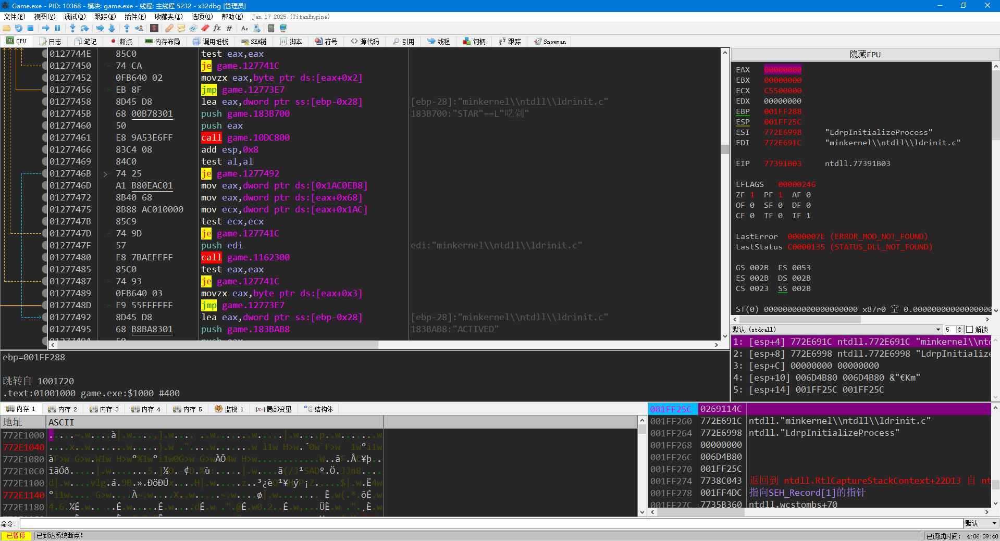

## 认识*X64DBG*

u它是一款WINDOWS平台上的调试器

u它是一款开源、免费的调试器

它是一款功能强大的动态反汇编调试器

**X64DBG**相对于**OllyDBG**

u支持架构：Ollydbg仅支持x86架构，而x64dbg支持x86和x64架构

u开放性：x64dbg是开源项目，而Ollydbg是闭源软件

u插件生态：x64dbg的插件系统更加完善，更多；而Ollydbg的插件系统相对较少。

u功能比较：x64dbg具有更多的高级功能，如内存映射，数据跟踪，反汇编和代码绘图等，而Ollydbg则相对较少

**课程介绍**

u基本调试操作；断点，跟踪，内存观察等

u命令与脚本；操作命令详解与脚本编译执行

u插件使用与编写；插件的使用及编写入门

**X64DBG环境部署**

官网：https://x64dbg.com/

下载地址：https://github.com/x64dbg/x64dbg/releases/tag/snapshot

软件界面：

