### 为什么学习16位汇编？

​       16位操作指令最多能够操作两个字节，且更能够体现出与硬件的交互。16位下的指令和32位汇编的指令差不多。16位汇编的指令在32位一样使用.要学好汇编必须要了解一点点硬件知识,16汇编是直接操作硬件,32位汇编指令跟硬件隔离了


### 硬件运行机制

#### 1. 为什么计算机的操作数据的单位是二进制？

​        字节是内存操作的最小单位,但是**位**才是计算机操作的最小单位


•电子器件二极管

•正向加电则通，反向加电则不同

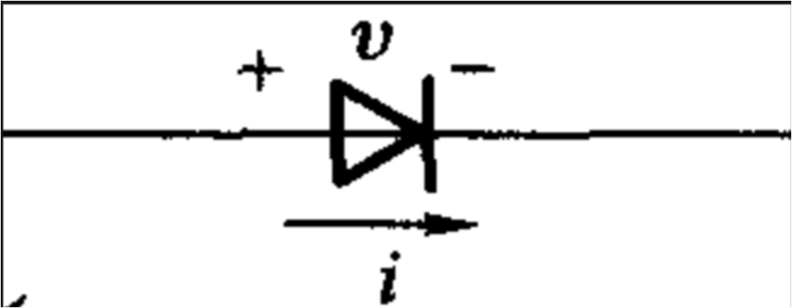

•门电路

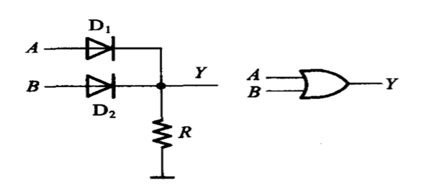


#### 

-   因为二进制是最简单的计算，所以二进制的计算非常快，CPU的处理是通过算术/逻辑 单元 **ALU** 来处理数据的。

例如：

-   \+ 可以通过位于运算获取结果。


​     **用法：**

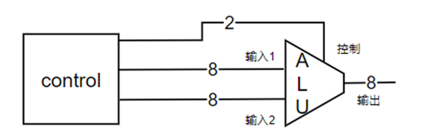

算术运算的结果是通过位运算得到得

##### 加法

​             结果   进位

0 + 1 = 	1     	 0

0 + 0 = 	0   	 0

1 + 0 = 	1   	 0

1 + 1 = 	0   	 1 

结果 - 异或

进位 - 位与

##### 减法     

加补码

##### 乘法

3 * 5 = 3 * （4 + 1） = 3*4 + 3*1 = 3 <<  2 + 3

##### 除法

情况比较复杂


​                          机器码                       助记符

7f+12        000111111100010010      add  7f,  12 

45&36      10 0100010100110110     and   45,  36


#### 2. 算术/逻辑 单元（ALU）

所有的数学运算都可以由位运算组成。那么更高级的数学运算也可以通过简单的位运算计算。所以将常用运算封装成一个器件，称之为单元。


#### 3. 机器码

**类似于1111110000010101010B，可以用来控制硬件的二进制数据，叫做机器码、**


#### 4. 助记符

**二进制值难记，每种功能的二进制控制码取一个容易记住的名字，叫做助记符，也称之为指令。**

**00B - add    +     加法**

**01B - sub     -     减法**

**10B - and    &    与运算**

**11B - xor     ^    异或运算**


#### 5. 汇编

**助记符硬件不能识别，需要将其转换成对应的的机器码，这个过程叫做汇编。(助记符转机器码)**


### 微机系统硬件组成


#### 概述

##### 1. 一个硬件系统都有什么？

● 一个系统不可能由一个硬件单独完成，所以划分处多个硬件模块，然后由一个模块居中调度。称作CPU。

##### 2. CPU如何与其他硬件做交互？	

● I/O桥    所有的硬件模块连接到I/O桥，由I/O桥负责辅助cpu与哪一个硬件模块连接。

● 总线

##### 3. cpu如何去选择不同的硬件模块？

● 位多路复用器


**CPU**：一个系统不可能由一个硬件单独完成，所以划分多个硬件模块，然后由一个硬件模块居中调度

**cpu的主要工作**:1.算术运算;2.读写,即从一个硬件中读写至另一个硬件中。


•总线   cpu有8位数据/地址线，ram是个256byte的存储器。


控制线用来表明操作类型   00  设置地址   01  读    10  写     11 保留

例如:  将 45 写入 地址  7f     

1.    在控制线上 加  00  (设置地址),并将  7f 设置到  数据地址线
2.  ram收到指令将地址调到7f 
3.  在控制线上 加 10 (写),并将 45 设置到  数据地址线 
4.  ram收到指令将 45 设置到之前写的地址上

读跟写差不多,但是如果要改地址,必须重新开始

#### 8086逻辑图


引脚复用:  引脚用来当地址用,又用来当数据用,  AD引脚数决定是多少位cpu

​                  A    address  地址    寻址  范围 (0-2^20    1M)

​                  D    data       数据     传输数据(16位  2个字节  1个字)

#### 余量


### 计算机系统组成

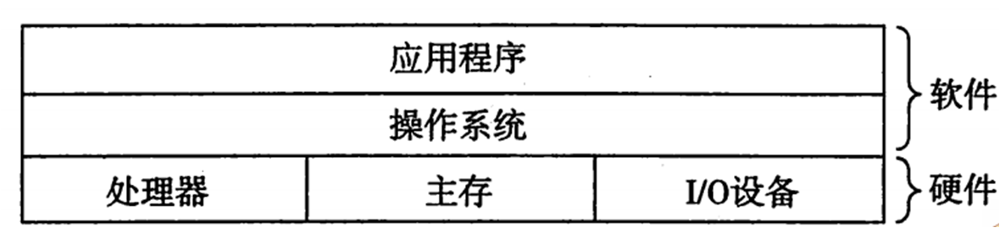


从编写完以下代码到屏幕显示字符中间发生了什么？

\#include <stdio.h>

int main()

{

printf(“hello world\n”);

}

##### •编译

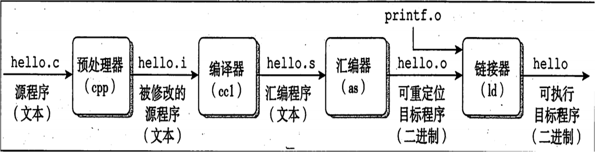

##### •加载可执行文件

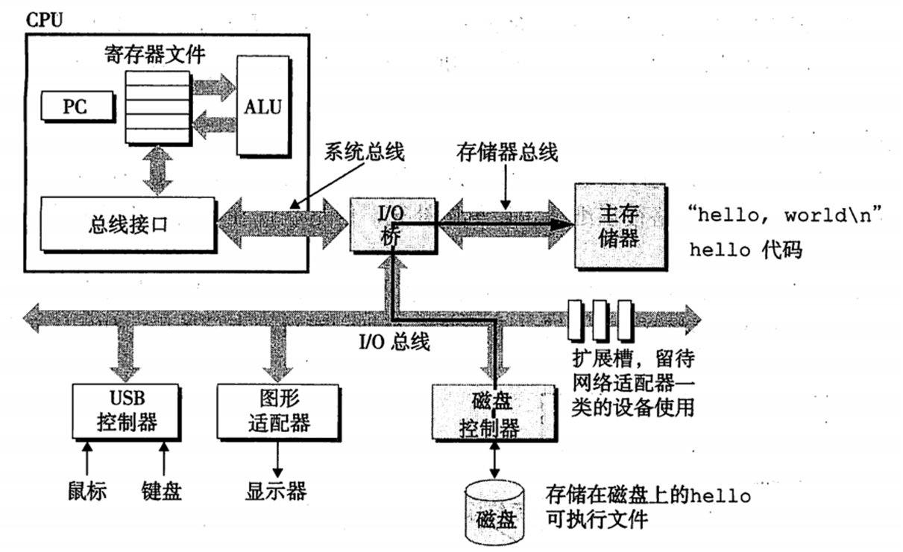

##### •执行


### 8086cpu组织结构


#### 8086cpu内部有2个模块组成

##### •EU部件

执行部件（excution unit）

译码

执行指令


##### •BIU部件

总线接口部件（bus interface unit）

取指令

读取数据

写入数据

#### 8086cpu将指令的执行分成多个模块，有什么好处？

目的: 让硬件的利用率最大

•流水线:   可以多个部件同时工作，提高硬件的利用率，从而提高效率。

1.取指令

2.译码

3.取数据

4.执行

5.存储结果

1，2，4是必须的。


流水线并不是越深越好,否则一旦出现分支转移,其后果将会很恶劣


#### 寄存器

cpu的“局部变量”


### debug的使用

#### 配置环境

\1. XP系统

2.dosbox  (推荐)        [https://www.dosbox.com](https://www.dosbox.com/)

3.msdos player

4.dosbox-x (推荐)      [https://dosbox-x.com](https://dosbox-x.com/)


##### 使用 vscode


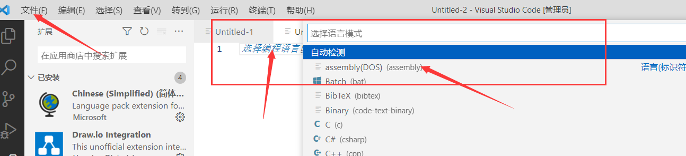


注意:  选择使用的汇编工具必须是  MASM   ,   TASM 是 linux 的 语言,  dos环境建议使用   dosbox-x


dosbox-x 也可以直接在官网下载


因为这个是模拟的,所以无法访问本地磁盘,可以映射某个文件夹让他当c盘去用


##### 使用dosbox-x

没改动配置文件的情况下：

粘贴和复制：   shif + f6

挂载： 


改动配置文件的情况：   dosbox-x.conf

取消粘贴的修饰符：


挂载：

```cpp
mount C: G:\asm16
C:
```

#### 使用方法


##### 基本DOS命令：

```cpp
#cd\ ——首先要用cd\ 退回到根目录C>下
#dir ——显示文件列表
#md hb ——建立hb子目录
#cd hb ——进入hb子目录
#copy d:\dos\masm.exe c:\hb ——将D盘dos目录下的masm.exe拷贝到C盘hb目录下
#copy d:\dos\link.exe c:\hb ——将D盘dos目录下的link.exe拷贝到C盘hb目录下
#cd .. ——退回到上一级目录
#del \hb\masm.exe ——删除hb子目录中的某文件
#rd hb ——删除hb子目录（子目录中的所有文件必须先删除）
#e：——进入e盘
#cls ——清屏
#type——显示文本文件内容（如type c:\hb\abc.asm）
```

##### DosBox常用指令

**[range] =    [startaddr] [endaddr]   或者   [startaddr]**

| 指令                     | 作用                             | 用法                                                         |
| ------------------------ | -------------------------------- | ------------------------------------------------------------ |
| **？**                   | **帮助文档**                     | **-？**                                                      |
| **U**                    | **反汇编（把机器码变成助记符）** | **-u，-u****[range]**                                        |
| **A**                    | **输入汇编指令**                 | **a [addr]**                                                 |
| **R**                    | **查看和修改寄存器**             | **r [reg]**                                                  |
| **D**                    | **查看内存单元**                 | **d [range]**                                                |
| **E**                    | **修改内存单元**                 | **e addr**                                                   |
| **G**                    | **直接运行**                     | **相当于 F5**                                                |
| **T**                    | **单步步入**                     | **相当于 F11**                                               |
| **P**                    | **单步步过**                     | **相当于 F10**                                               |
| **写入文件（n，cx，w）** | **将内存数据保存到文件**         | **-n "文件名"****-r  cx    20 (字节数)****-w   开始地址（没有默认为100）** |
| **Q**                    | **退出**                         |                                                              |


a 后面如果跟地址，代表从该地址开始写汇编代码，不跟则默认从ip地址开始写，写完一行按回车确认，全部写完空行回车 


R 后面跟寄存器代表可以修改寄存器的值


e后面跟地址代表修改该处内存的值，按空格 表示 继续修改后面的，按回车表示修改结束


e addr [val1     逗号|空格   val2    逗号|空格     val3 。。。]


e addr "字符串"

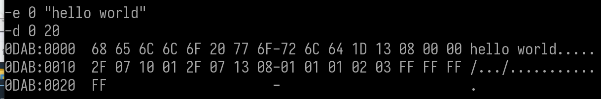


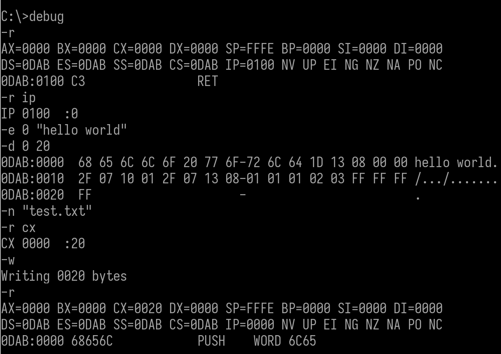


注意： 保存数据是从 地址 100 开始的，跟ip地址的值无关,如果要向指定开始位置,w 后面加 开始地址

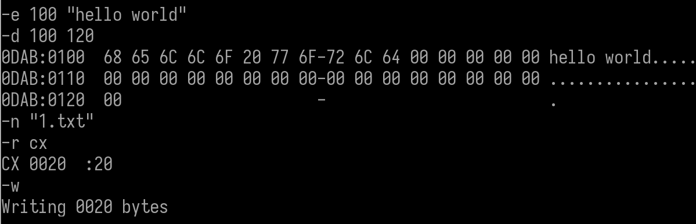


### 标志寄存器

常用的是 ZF  和  DF


#### 条件标志：

-   **CF 进位标志：**用于反映运算是否产生进位或借位。如果运算结果的最高位产生一个进位或借位，则CF置1，否则置0。运算结果的最高位包括字操作的第15位和字节操作的第7位。移位指令也会将操作数的最高位或最低位移入CF。
-   **PF 奇偶标志：**用于反映运算结果低8位中“1”的个数。“1”的个数为偶数，则PF置1，否则置0。
-   **AF** **辅助进位标志****：**算数操作结果的第三位（从0开始计数）如果产生了进位或者借位则将其置为1，否则置为0，常在BCD(binary-codedecimal)算术运算中被使用。
-   **ZF 零标志：**用于判断结果是否为0。运算结果0，ZF置1，否则置0。
-   **SF 符号标志：**用于反映运算结果的符号，运算结果为负，SF置1，否则置0。因为有符号数采用补码的形式表示，所以SF与运算结果的最高位相同。
-   **OF 溢出标志：**反映有符号数加减运算是否溢出。如果运算结果超过了8位或者16位有符号数的表示范围，则OF置1，否则置0。

#### 控制标志：

-   **TF 跟踪标志：**当TF被设置为1时，CPU进入单步模式，所谓单步模式就是CPU在每执行一步指令后都产生一个单步中断。主要用于程序的调试。8086/8088中没有专门用来置位和清零TF的命令，需要用其他办法。
-   **IF 中断标志：**决定CPU是否响应外部可屏蔽中断请求。IF为1时，CPU允许响应外部的可屏蔽中断请求。
-   **DF 方向标志：**决定串操作指令执行时有关指针寄存器调整方向。当DF为1时，串操作指令按递减方式改变有关存储器指针值，每次操作后使SI、DI递减。

#### CF 进位标志

```cpp
当运算结果的最高有效位有进位（加法）或借位（减法）时设置。
进位标志置1，即CF = 1；否则CF = 0
用途：用于表示两个无符号数高低。
举例：
3AH + 7CH＝B6H，     没有进位：CF = 0     NC
AAH + 7CH＝（1）26H，有进位：  CF = 1     CY
```

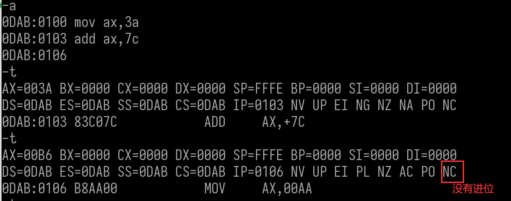


#### 零标志ZF

```cpp
若运算结果为0则ZF=1，否则ZF=0。
用途：用于表示两个无符号数高低。
举例：
3AH + 7CH＝B6H，结果不是零：   ZF = 0    ZR
84H + 7CH＝（1）00H, 结果是零：ZF = 1    NZ
```


#### 溢出标志OF

溢出只发生在  正数+正数     负数+负数    负数- 正数     正数-负数  的情况

```cpp
使用该标志位判断运算结果是否溢出。（当将操作数作为有符号数时）
加法：若同符号数相加，结果的符号与之相反则OF=1，否则OF置0。
减法：被减数与减数异号，而结果的符号与减数相同则OF=1，否则置0。
发生了溢出，说明了运算结果不可信。
3AH + 7CH＝B6H，     产生溢出：OF = 1     OV
AAH + 7CH＝（1）26H, 没有溢出：OF = 0     NV
```

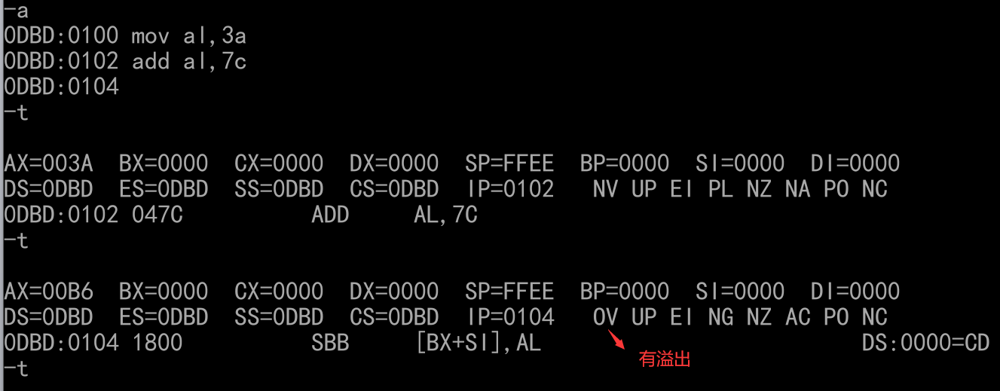

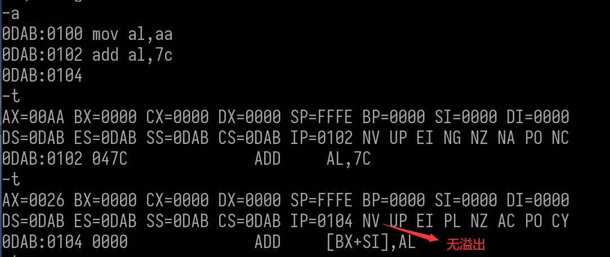

##### 进位和溢出

```cpp
进位CF 针对的是无符号数运算，溢出OF 针对的是有符号数运算。
当看成无符号数，则关注CF标志，看成有符号数，则关注OF标志。

cpu运算时,不管数据是有符号还是无符号,它运算完,会当作有符号数设置 CF 位,也会当作无符号数设置 of 位,即2个操作位都会设置, 至于最后看哪个位要根据我们的业务逻辑自己去选择
```

#### 符号标志SF

```cpp
运算结果最高位为1，SF为1，否则为0。
有符号数据用最高有效位表示数据的符号，最高有效位是符号标志的状态。
举例：
3AH + 7CH＝B6H，     最高位D7＝1:   SF = 1    NG
84H + 7CH＝（1）00H, 最高位D7＝0:   SF = 0    PL
```


#### 奇偶标志位PF

```cpp
当运算结果（指低8位）中1的个数为偶数时，PF置1，否则置0。
作用：该标志位主要用于检测数据在传输过程中的错误。
举例：
3AH + 7CH＝B6H＝10110110B
结果中有5个1，是奇数：PF = 0   PO

3AH + 7AH＝B6H＝10110100B
结果中有4个1，是偶数：PF = 1   PE
```


#### 辅助进位标志位AF

```cpp
表示一个字节的低4位是否有进位和借位。运算时D3位（低半字节）有进位或借位时，AF = 1；否则AF = 0。

处理器内部使用，用于十进制算术运算调整指令中，用户一般不必关心

3AH + 7CH＝B6H，D3有进位：AF = 1    AC
31H + 71H＝A2H，D3无进位：AF = 0    NA
```

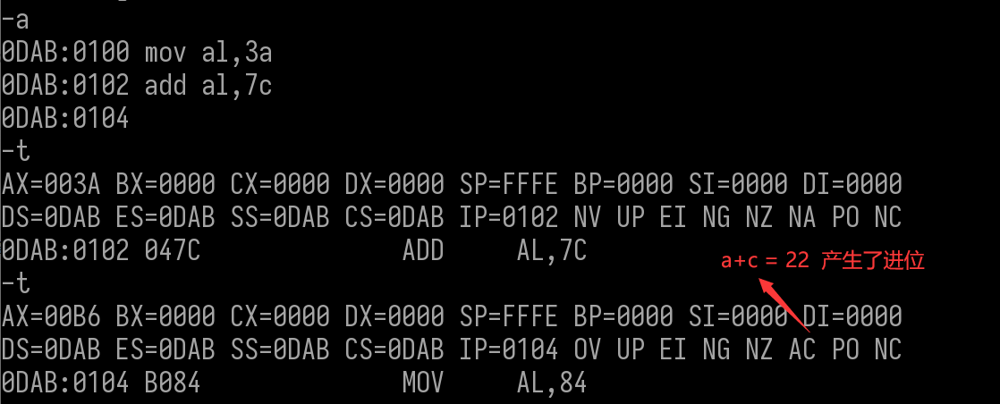


#### 标志位状态总结

| **.标志位** | **标志名称**     | **FLASE** | **TURE** |
| ----------- | ---------------- | --------- | -------- |
| **OF**      | **溢出标志**     | **NV**    | **OV**   |
| **DF**      | **方向标志**     | **UP**    | **DN**   |
| **IF**      | **中断标志**     | **DI**    | **EI**   |
| **SF**      | **符号标志**     | **PL**    | **NG**   |
| **ZF**      | **零标志**       | **NZ**    | **ZR**   |
| **AF**      | **辅助进位标志** | **NA**    | **AC**   |
| **PF**      | **奇偶标志**     | **PO**    | **PE**   |
| **CF**      | **进位标志**     | **NC**    | **CY**   |


在 debug中顺序

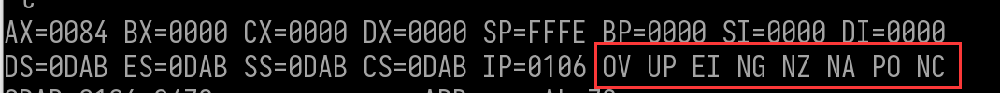

OF[溢出 ]     DF[方向]     IF[中断]     SF[符号]     ZF[零]     AF[辅助进位]     PF[奇偶]     CF[进位]


