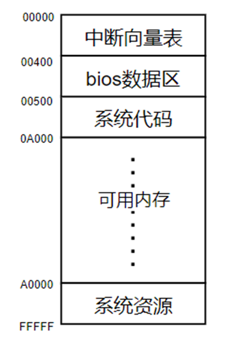
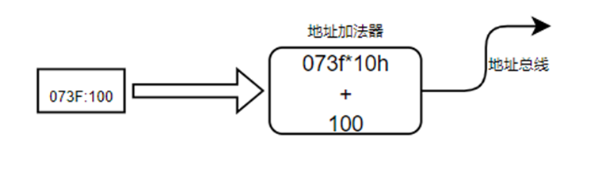
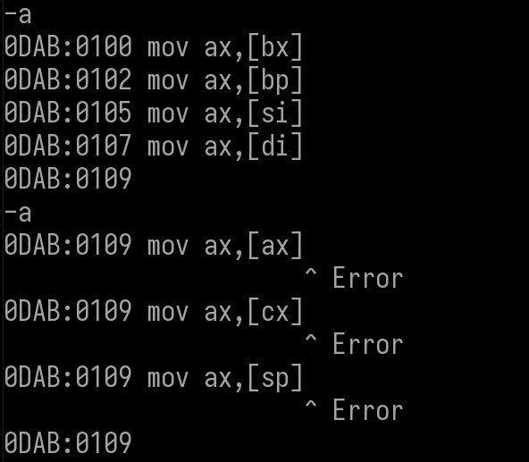
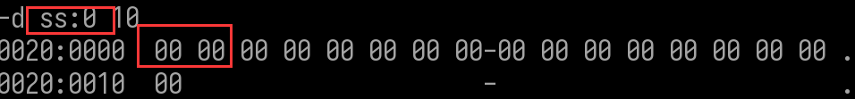

### 分段

-   问题1       8086是16位cpu，最多可以访问（寻址）多大内存？                   

-   -   运算器一次最多处理16位的数据。

-   -   地址寄存器的最大宽度为16位。
    -   访问的最大内存为：216 = 64K 即 0000 - FFFF。

-   问题2    8086允许最大内存1M，如何实现访问（寻址）到所有内存？         

-   -   8086CPU有20位地址总线，可以传输20位地址，达到1M寻址能力，但8086CPU是16位构造。
    -   8086CPU采用一种在内部使用两个16位地址合成的方式来形成一个20位的物理地址。
    -   段基址的低四位不保存,只要前面16位,第四位通过段偏移得到,因此段基址的低四位必须全部为0,即与16字节对齐

#### 分段寻址

-   -   将内存划分成多段，通过**段基址+段偏移**的方式访问
    -   

-   计算方式

-   -   **内存地址=段基址\*10h+段偏移**
    -   **因为低四位被舍弃了,变成了段偏移 所以需要 \*10**

-   例子：
-   名词

-   -   **1. 段基址+段偏移** 的方式一般写作 **段地址：段偏移，**称作**逻辑地址**
    -   **2. 偏移地址**称作**EA**  effective address
    -   **3.** 通过逻辑地址计算出来的内存地址称作**物理地址**

#### 内存分布


-   段与段之间重叠1M内存最多可以划分多少个段？

-   -   1M/16byte =  2^20 / 2^4 =  2^16 =   65535

-   段与段之间不重叠1M内存最多可以划分多少个段？

-   -   1M/64k =  2^20 / 2^16 = 2^4  =  16

#### 段划分的原则

-   段大小可以不是64K。一般我们分段根据需要来划分,但一般不会是64K,因此这样分段就太少,不一定够用
-   段与段之间不要有重叠。

##### 注意：

-   内存分段 8086不会管分配，dos系统不会管分配，内存分段靠自己。

-   问题

​            一个物理地址是否只能由一个逻辑地址表示？  如:  10284  

-   -   不是:  一个物理地址可以由任意个逻辑地址表示。10284 可以根据分段和偏移组合  如   1028+4 , 1020 + 84 , 1000+284

-   问题

​          物理地址为074f6，可以表示成 ____:0012吗？

-   -   不行,  74f6 - 0012 = 74e4 ,没有与16字节对齐,无法设成段偏移
    -   

-   虽然一个物理地址可以由多个逻辑地址表示，但基于分段原则，一般编程中不会碰到。

#### 可用内存

-   -   **dos**系统值编程，应用程序可用内存约600K
    -   

dos系统里面的值是可以随便修改的 ,修改里面的值可能导致系统崩溃,例如中断向量表里面存放的是系统的api,修改里面的值,会导致系统无法调用API 


### 段寄存器

-   8086中，段基址都是存储在段寄存器中，段偏移可以用立即数或者通用寄存器指明。


mov 一般用的是 DS


初始  DS   ES  SS  CS 四个段寄存器值 是一样的,称为四段合一

#### 对段寄存器的值进行修改

1.  对CS进行修改,执行  u  和  a  指令 发现段基址变成了 CS的值


但是如果自己指定了段基址,则使用自己设置的,如果没有设置段基址只设置了段偏移就把  CS 的值当做段基址, 段基址和段偏移都不设置级就接着上次的


1.  对DS进行修改,执行  d  和  e  指令 发现段基址变成了 CS的值

同理:如果自己指定了段基址,则使用自己设置的,如果没有设置段基址只设置了段偏移就把  DS 的值当做段基址, 段基址和段偏移都不设置级就接着上次的


#### 段超越：

-   8086寻址方式中，有一些默认段寄存器的情况。例如，如果用BP作为基址寻址的单元，则可表明此单元位于SS段；如果用BX作为基址寻址的单元，则可表明此单元位于DS段。但在某些特例下，需要进行段超越寻址，应使用段属性前缀。
-   例

-   -   MOV CX,ES:[BX]
    -   这条指令是把ES段中的偏移地址为BX的单元中的字送CX，而不是到DS段去寻址。
    -   无论用BX，SI，DI或者BP作为间接寄存器，都允许段超越。


-   问题      1M的内存寻址需要多少根引脚？

​      20 根 ,     那么 cpu, 寄存器都是16位的,每次算术运算都是16位,那么如何通过 16 位 寄存器去给 20根 引脚赋值呢,答案是通过专门器件  地址加法器实现的

#### 地址加法器

8086有20根地址线，16根数据线，其中数据线与地址线的低16位复用。内部通过**地址加法器**计算地址。




地址加法器位于接口部件,对于cpu来说 是设外的 


### 寻址

指令中用于说明操作数所在的方式称为寻址方式。 16位汇编主要的是7种 32位汇编是8种

1.  立即寻址
2.  寄存器寻址
3.  直接寻址
4.  寄存器间接寻址
5.  寄存器相对寻址
6.  基址变址寻址
7.  基址变址相对寻址

问题:操作数的值可以存储在哪里？

  寄存器 ,  内存(内存数据区)

#### 立即寻址

##### 说明: 

操作数的值存储在指令中的方式称作立即寻址。

汇编中整数常量称作立即数。

立即数可以是8位数，也可以是16位数。

##### 示例

```
MOV AL, 80H  ;     将8位立即数80H送入AL寄存器
MOV AX, 1234H;     将16位立即数1234H送入AX寄存器
```


立即寻址取指令把操作数 和操作数取完之后就知道要干什么事了,就可以完整的去执行了

这里只需要  取指令   译码    执行 3个步骤


取指令是从 cs寄存器中取  cs(1000)作为基址,ip作为下一条指令的 段偏移,组合起来就是下一条指令的物理地址 , 注意,指令缓冲队列,最多可以取6个字节

##### 注意：

1.  16位立即数不能传送给8位寄存器 `MOV AL,7788; Error`
2.  8位立即数给16位寄存器传送值,将会自动扩展立即数为16位,前面用00填充 `MOV AX,45; 汇编码：MOV AX,0045`

#### 寄存器寻址

##### 说明

操作数的值存储在寄存器的寻址方式称作寄存器寻址。

寄存器包括通用寄存器，段寄存器。IP 和 XX 不能用作寻址，他们有特殊的用途。

 示例 

```
MOV CL, DL     将dl的值送入cl 
MOV AX, BX     将bx的值送入ax
```


##### 注意

1.   段寄存器之间不能赋值。`MOV DS,CS; Error  MOV AX,CS;正确`
2.  指令指针寄存器不能用作寻址。

#### 直接寻址

##### 说明

操作数值在内存中，机器码中存储16位段内偏移的寻址方式称作直接寻址。(默认:DS寄存器作为段基址)

##### 示例

```
MOV AL, [1064H]    取出段偏移为1064(默认段基址是DS)的地址的数据,将值赋值给 al

在汇编中 [] 代表从该地址 取内容
```


段偏移放在内部暂存器是因为他即将参与地址运算,因此放在离地址加法器越近越好,8位不能直接赋值给16位,会有移位操作

##### 注意

1.  **立即数存内存需要指定长度。**
2.  **内存和寄存器之间的赋值不用指定宽度**，因为寄存器本身有宽度，直接通过寄存器的宽度，推导出内存的，如果给立即数，指定就不明确。

1.  1.  `MOV [2000],65; Error`
    2.  `MOV [2000],6655; Error`
    3.  `MOV byte ptr[2000],65; 正确，指定宽度`
    4.  `MOV word ptr[2000],6655;正确，指定操作word宽度`
    5.  `MOV byte ptr[2000],6655; Error`

1.  **不能从内存到内存**，除了串操作指令【特殊，使用的寄存器固定，操作的时候就操作固定的两个寄存器】

#### 寄存器间接寻址

##### 说明

a.操作数值在内存中，段内偏移存储在寄存器中的寻址方式称作寄存器间接寻址。

b.间接寻址的寄存器有BX, BP, SI, DI,其他的不能用。

c.段内偏移值存储在寄存器中，而不是直接的常数。CPU先拿出寄存器中段内偏移，再相加。


##### 

##### 

##### 

上面几张图可以看出  bx为0时 ,是以 DS 寄存器的值作为段基址的, bp为0时,是以SS 寄存器为段基址,同理可以验证 DI,SI 也是以  DS 寄存器的值作为段基址的

##### 示例

```
MOV  AX, [SI]  ;   将SI中的值作为段内偏移，DS作为默认段基址, 从内存中取出数据赋值AX
MOV [BX], AL   ;   将BX中的值作为段内偏移，DS作为默认段基址, 把AL中的值赋值给对应内存
```


##### 注意

1.  段寄存器的 默认 基址寄存器是可以修改的  称为 **段超越**

格式:       指定基址的寄存器 :  [ 段偏移寄存器 ]


#### 寄存器相对寻址

##### 说明

a.操作数值在内存中，段内偏移存储由[**寄存器+立即数**]计算得来的的寻址方式称作寄存器相对寻址。

b.寄存器相对寻址的寄存器有BX, BP, SI, DI。

c.寄存器相对寻址的立即数可以是8位，可以是16位的。


##### 示例

```
MOV [SI + 10H],AX;       将AX的值 传入 段偏移为 SI + 10H 的地址
MOV CX,[BX+COUNT];  COUNT 是一个立即数    将 段偏移为 BX+COUNT 的地址的内容赋值给寄存器 CX
```


##### 注意   

**[寄存器+立即数]** **可以写成**  **立即数[寄存器],****但不可以写成**  **[寄存器]立即数**

1000[SI]  =   [SI + 1000 ]  = [SI][1000] 但是不可以写成  [SI]1000


#### 基址变址寻址

##### 说明

a.操作数值在内存中，段内偏移由[**基址寄存器+变址寄存器**]计算得来的寻址方式称作基址变址寻址。

b.可用做基址的寄存器有BX, BP。

c. BX默认DS段，BP默认SS段。

d.可用作变址的寄存器有SI, DI。


##### 示例

```
MOV  [BX+DI], AX    将寄存器 AX 中的值 传入 段偏移为BX+DI,默认段基址是DS 的地址的内存中  
MOV  CX, [BP+SI]    将 段偏移为BP+SI,默认段基址是 SS 的地址的内存中的值赋值给 CX
```


##### 注意

1.  搭配时B (BP,BX) 和 I (SI,DI) 可以搭配 但是  B (BP,BX)  与 B (BP,BX) ,  I (SI,DI) 与  I (SI,DI) 不能搭配,无法确定段基址,计算物理地址时段基址由 B (BP,BX) 决定 BP是SS ,BX 是DS
2.  [**基址寄存器+变址寄存器**]  =  [**基址寄存器**][**变址寄存器**]  

#### 基址变址相对寻址

##### 说明

a.操作数值在内存中，段内偏移由[**基址寄存器+变址寄存器+偏移常量**]计算得来的寻址方式称作基址变址寻址。

b.可用做基址的寄存器有BX, BP。

c. BX默认DS段，BP默认SS段。

d.可用作变址的寄存器有SI, DI。

e.可用作常量的数值可以是8位，可以是16位。


##### 示例

```
MOV  AX, [BX+DI+1200H]    
将 段偏移为BX+DI+1200H,默认段基址是 DS 的地址的内存中的值赋值给寄存器AX

MOV [BP+SI+200H], CX      
将寄存器CX中的值 传入 段偏移为BP+SI+200H,默认段基址是SS 的地址的内存中 
```

##### 

##### 注意

[**基址寄存器+变址寄存器+偏移常量**]  =  **偏移常量[基址寄存器][变址寄存器]**

**基址寄存器是  B (BP,BX) 变址寄存器 是  I (SI,DI)**

#### 注意

**以下操作不存在**

1.内存到内存,只能先内存到寄存器,再由寄存器到内存

2.段寄存器到内存

3.内存到段寄存器


### 机器码

#### 指令的组成


-   指令由操作码和操作数两部分组成。
-   操作码说明计算机要执行哪种操作，如传送，运算，移位、跳转等操作，它是指令不可缺少的部分。
-   操作数是指令的参与者，既各种操作的对象
-   有些指令不需要操作数，通常的指令都是一个或两个操作数，也有个别指令是3个操作数甚至4个操作数。

 

-   指令系统设计了很多操作数的来源
-   寻找操作数的过程就是操作数的寻址
-   操作数采取哪一种寻址方式，会影响机器运行的速度和效率


#### 机器码的组成


#### 机器码分析

问题：

1.  内存中存储的是机器码，是一些16进制的数字，计算机是如何知道 多长的十六进制数字是代表一段执行机器码的？
2.  如何知道机器码有多长？
3.  如何知道操作数和源操作数的？


操作码	操作数1，操作数2；注释

-   操作数2，称为源操作数 src，它表示参与指令操作的一个对象
-   操作数1，称为目的操作数dest，它不仅可以作为指令操作的对象，还可以用来存放指令操作的结果
-   分号后的内容是对指令的解释

MOV dest,src; dest <- src

给出如下代码，分析机器码


##### 16位寄存器到16位寄存器

```
目的操作数不变,改变源操作数 

  逻辑地址   机器码    操作符   操作数   机器码                src dest
0DAB:0100    89C0     MOV     AX,AX    89C0    100010001 11  000 000       
0DAB:0102    89D8     MOV     AX,BX    89D8    100010001 11  011 000
0DAB:0104    89D0     MOV     AX,DX    89D0    100010001 11  010 000
0DAB:0106    89E8     MOV     AX,BP    89E8    100010001 11  101 000
0DAB:0108    89F0     MOV     AX,SI    89F0    100010001 11  110 000
0DAB:010A    89F8     MOV     AX,DI    89F8    100010001 11  111 000
0DAB:010C    89E0     MOV     AX,SP    89E0    100010001 11  100 000
0DAB:010E    89C8     MOV     AX,CX    89C8    100010001 11  001 000
源操作数不变,改变目的操作数       
0DAB:0110    89C3     MOV     BX,AX    89C3    100010001 11  000 011    
0DAB:0112    89C1     MOV     CX,AX    89C1    100010001 11  000 001   
0DAB:0114    89C2     MOV     DX,AX    89C2    100010001 11  000 002
0DAB:0116    89C6     MOV     SI,AX    89C6    100010001 11  000 110
0DAB:0118    89C7     MOV     DI,AX    89C7    100010001 11  000 111
0DAB:011A    89C4     MOV     SP,AX    89C4    100010001 11  000 100
0DAB:011C    89C5     MOV     BP,AX    89C5    100010001 11  000 101
```

如上可以得出结论：

16位寄存器是按位存储的 

-   **ax - 000、  cx - 001、 dx - 010、 bx - 011、sp - 100、 bp - 101、 si - 110、 di - 111** 

16位寄存器中AX累加器)  的速度是最快的,其次是CX计数器),因为是一个8个word的数组,

AX只需要取数组地址 base , CX 只需要 base + sizeof(world),其他的还需要需要计算乘法

base + i * sizeof(world)

验证

```
mov bx, sp 89 11 100 011 -> 89 E3 
mov sp, si 89 11 110 100 -> 89 F4
mov dx, sp 89 11 100 010 -> 89 E2
```


##### 8位寄存器到8位寄存器

```
mov si, di
1000 1001 1111 1110 89fe
  逻辑地址   机器码    操作符   操作数   机器码                 src   dest
0DAB:012E   88C7      MOV     BH,AL    88C7    10001000  11   000    111
0DAB:0130   88E7      MOV     BH,AH    88E7    10001000  11   100    111           
0DAB:0122   88DF      MOV     BH,BL    88DF    10001000  11   011    111
0DAB:0124   88FF      MOV     BH,BH    88FF    10001000  11   111    111
0DAB:0126   88CF      MOV     BH,CL    88CF    10001000  11   001    111
0DAB:0128   88EF      MOV     BH,CH    88EF    10001000  11   101    111
0DAB:012A   88D7      MOV     BH,DL    88D7    10001000  11   010    111
0DAB:012C   88F7      MOV     BH,DH    88F7    10001000  11   110    111

```

如上可得出结论：

8位寄存器也是按照位来存储的，分别如下：

**al - 000、 cl - 001、 dl - 010、 bl - 011、 ah - 100、 ch - 101、 dh - 110、 bh - 111**


##### 各种指令对比

```
89FE          MOV     SI,DI 1000 1001
88FE          MOV     DH,BH 1000 1000
机器码        操作符   操作数          1000 10 d w mod rrr rrr/mmm   
89C3          MOV     BX,AX           1000 10 0 1 11   000 011
89CB          MOV     BX,CX           1000 10 0 1 11   001 011
89D3          MOV     BX,DX           1000 10 0 1 11   010 011
89DB          MOV     BX,BX           1000 10 0 1 11   011 011
89E3          MOV     BX,SP           1000 10 0 1 11   100 011
89EB          MOV     BX,BP           1000 10 0 1 11   101 011
89F3          MOV     BX,SI           1000 10 0 1 11   110 011
89FB          MOV     BX,DI           1000 10 0 1 11   111 011
88C7          MOV     BH,AL           1000 10 0 0 11   000 111
88E7          MOV     BH,AH           1000 10 0 0 11   100 111
88DF          MOV     BH,BL           1000 10 0 0 11   011 111
88FF          MOV     BH,BH           1000 10 0 0 11   111 111
88CF          MOV     BH,CL           1000 10 0 0 11   001 111
88EF          MOV     BH,CH           1000 10 0 0 11   101 111
88D7          MOV     BH,DL           1000 10 0 0 11   010 111
88F7          MOV     BH,DH           1000 10 0 0 11   110 111
    
                                      1000 10 d w mod rrr rrr/mmm    
8B07          MOV     AX,[BX]         1000 10 1 1 00   000 111		
8B05          MOV     AX,[DI]         1000 10 1 1 00   000 101
8B03          MOV     AX,[BP+DI]      1000 10 1 1 00   000 011
8B00          MOV     AX,[BX+SI]      1000 10 1 1 00   000 000
8B4212        MOV     AX,[BP+SI+12]   1000 10 1 1 01   000 010 disp8
8B825634      MOV     AX,[BP+SI+3456] 1000 10 1 1 10   000 010 disp16
8A825634      MOV     AL,[BP+SI+3456] 1000 10 1 0 10   000 010 disp16
8B817856      MOV     AX,[BX+DI+5678] 1000 10 1 1 10   000 001 disp16
89817856      MOV     [BX+DI+5678],AX 1000 10 0 1 10   000 001 disp16 
```

如上可得出结论：


前面6位是操作码  

d：代表源操作数是寄存器还是内存

-   0：从寄存器里面取值
-   1：从内存里面取值

w：目的操作数宽度


mod：模式

-   11：寄存器到寄存器
-   10：DISP 16位
-   01：DISP 8 位
-   00：内存到寄存器，没有偏移


### 作业：

1.   课程作业:  16为反汇编引擎。

1.  实现以下指令的汇编和反汇编    r16: 16位寄存器  r8:8位寄存器   imm8: 8位立即数

​       imm16 : 16位立即数     [EA] 寄存器做偏移

```
机器码   操作吗   操作数         d w mod src  des      mov r16, r16
89D8     MOV     AX,BX   100010 0 1 11  011  000   
89C8     MOV     AX,CX   100010 0 1 11  001  000
89D0     MOV     AX,DX   100010 0 1 11  010  000
89C6     MOV     SI,AX   100010 0 1 11  000  110
89C7     MOV     DI,AX   100010 0 1 11  000  111
89C5     MOV     BP,AX   100010 0 1 11  000  101
89C3     MOV     BX,AX   100010 0 1 11  000  011 
                                                    mov r8, r8
88E0     MOV     AL,AH   100010 0 0 11  100  000
88F8     MOV     AL,BH   100010 0 0 11  111  000
88D8     MOV     AL,BL   100010 0 0 11  011  000
88C5     MOV     CH,AL   100010 0 0 11  000  101
88C1     MOV     CL,AL   100010 0 0 11  000  001
88C6     MOV     DH,AL   100010 0 0 11  000  110
88C2     MOV     DL,AL   100010 0 0 11  000  010


                                                    mov r16,[EA]
8B46     MOV     AX,[BP] 100010 1 1 01  000  110 
8B07     MOV     AX,[BX] 100010 1 1 00  000  111
8B05     MOV     AX,[DI] 100010 1 1 00  000  101
8B04     MOV     AX,[SI] 100010 1 1 00  000  100
    
         MOV     AX,[1234]
         MOV     BX,[1234]
         MOV     CX,[12]
         MOV     DX,[12]

                                                    mov r8,[EA]

8A46     MOV     AL,[BP]  100010 1 0 01  000 110 
8A07     MOV     AL,[BX]  100010 1 0 00  000 111
8A05     MOV     AL,[DI]  100010 1 0 00  000 101
8A04     MOV     AL,[SI]  100010 1 0 00  000 100
    
         MOV     AL,[1234]
         MOV     BH,[1234]
         MOV     CH,[12]
         MOV     DL,[12]
                                                    mov [EA],r16
8946     MOV     [BP],AX  100010 0 1 01  000 110  
8907     MOV     [BX],AX  100010 0 1 00  000 111
8905     MOV     [DI],AX  100010 0 1 00  000 101
8904     MOV     [SI],AX  100010 0 1 00  000 100
        
         MOV     [1234],AX
         MOV     [1234],BX
         MOV     [12],CX
         MOV     [12],DX
    
                                                    mov [EA], r8
8846     MOV     [BP],AX  100010 0 0 01  000 110       
8807     MOV     [BX],AL  100010 0 0 00  000 111
8805     MOV     [DI],AL  100010 0 0 00  000 101
8804     MOV     [SI],AL  100010 0 0 00  000 100
    
         MOV     [1234],AL
         MOV     [1234],BH
         MOV     [12],CH
         MOV     [12],DL
                                                   mov r8, imm8
B412     MOV     AH,12    10110 1 0 0 0001 0002    
B012     MOV     AL,12    10110 0 0 0 0001 0002
B712     MOV     BH,12    10110 1 1 1 0001 0002
B312     MOV     BL,12    10110 0 1 1 0001 0002
B512     MOV     CH,12    10110 1 0 1 0001 0002
B112     MOV     CL,12    10110 0 0 1 0001 0002
B612     MOV     DH,12    10110 1 1 0 0001 0002
B212     MOV     DL,12    10110 0 1 0 0001 0002
    
                                                   mov r16, imm16
B83412   MOV     AX,1234  10111 000 0011 0100 0001 0010  
BB3412   MOV     BX,1234  10111 010 0011 0100 0001 0010
B93412   MOV     CX,1234  10111 001 0011 0100 0001 0010
BA3412   MOV     DX,1234  10111 010 0011 0100 0001 0010
BD3412   MOV     BP,1234  10111 101 0011 0100 0001 0010
BB3412   MOV     BX,1234  10111 011 0011 0100 0001 0010
BE3412   MOV     SI,1234  10111 110 0011 0100 0001 0010
BF3412   MOV     DI,1234  10111 111 0011 0100 0001 0010

mov [EA], imm8

mov [EA], imm16
```

