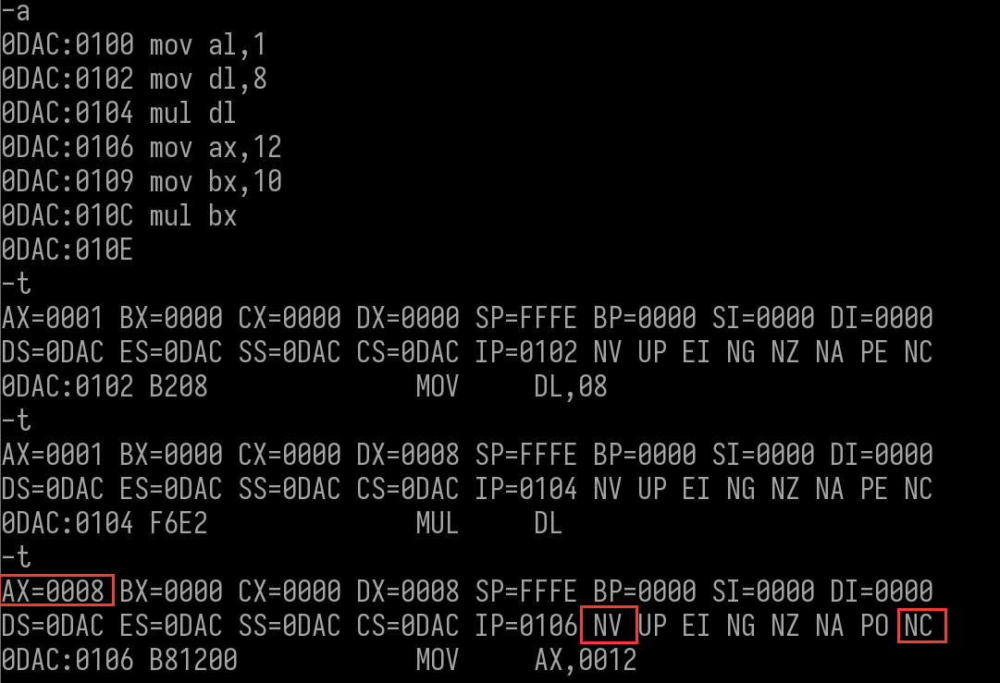
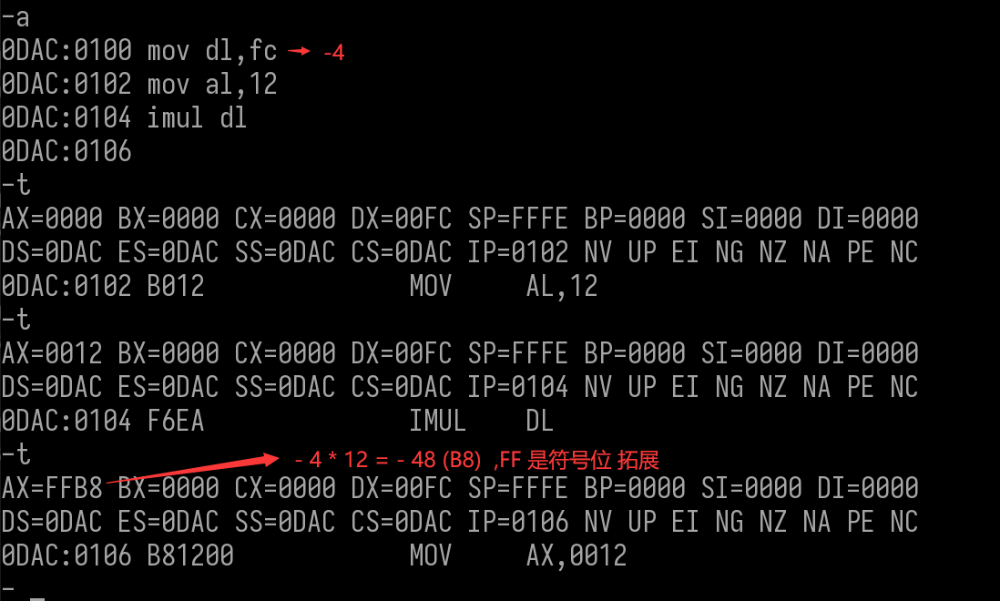
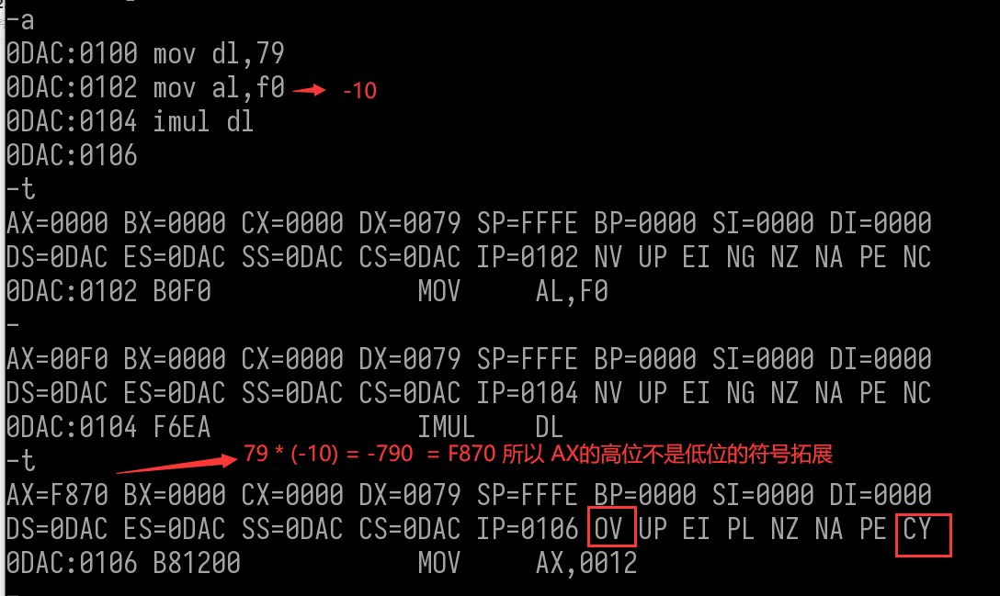
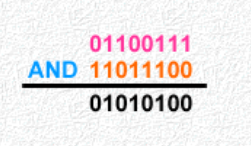
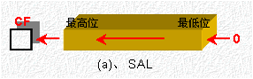
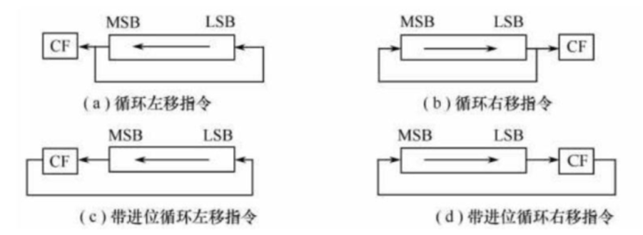

乘法和除法指令用的不多,因为效率很低

 比较指令CMP (compare) 

•格式：CMP  OPD，OPS

•功能：(OPD) — (OPS),跟减法指令很像,但是不存结果

•说明：目的操作数减去源操作数，然后根据结果设置标志位，但该结果并不存入目的地址。

•影响标志位：AF、CF、OF、PF、SF 、 ZF

• 作用：一般的后面跟一条条件转移指令，根据比较结果转向不同的程序分支，用于处理OPD和OPS大小比较的不同情况。

 操作 

跟一个比自己大的数比较, 结果看标志位  CF(借位/进位) 和  ZF (是否为0)

0DAC:0100

AX,69

MOV

0DAC:0103

CMP AX,96

0DAC:0106

DI-00000

AX-000 BX-0000 CX-0000 DX-0000 SP-FFFFE BP-0000 SI-0000 DI-000

SS-ODAC CS-0DAC IP-0100 NV UP EI NG NZ NA PE NC

DS-ODAC ES-ODAC SS

AX,0069

0DAC:0100 B86900

MOV

AX-0069 BX-000 CX

DX-000 SP-FFFE BP-0000 SI-000 DI-0000

CX-0000

CS-0DAC IP-0103 NV UP EI NZ

SS-ODAC

NAPENC

DS-ODAC ES-ODAC

AX,0096

CMP

3D9600

0DAC:01033

AX-0069 BX-0000 CX-0000 DX-000 SP-FFFFE BP-000 SI-000

00 SI-0000 DI-000

DS-ODAC ES-0DAC SS-0DAC CS-ODAC IP-0106 NV UP EI NG INZI

PO CY

NA

[BX+SI],AL

0DAC:0106 000

ADD

69-96产生借位,结果不

为0


跟一个比自己小的数比较, 结果看标志位 SF(符号) 和  ZF (是否为0)

ODAC:0100

MOV AX,69

CMP AX,45

10DAC:0103

IODAC:0106

AX-0069 BX-0000 CX-0000 DX-0000 SP-FFFE BP-0000 SI-0000 DI-0000

DS-ODAC ES-0DAC SS-ODAC CS-0DAC IP-0103 NV UP EI NG NZ NA PEINN

ENC

0DAC:0103 83F845

AX,+45

CMP

-T

AX-0069 BX-0000 CX-0000 DX-0000 SP-FFFE BP-0000 SI-(000 DI-0000

SS-ODAC CS-ODAC IP-0106 NV UP EI PL NZ NA

NAPENC

DS-ODAC ES-ODAC

[BX+SI],AL

ODAC:0106 000

ADD


69 - 45  不产生借位,结果是正数,不为0.


跟一个与自己相等的数比较, 结果看标志位  ZF (是否为0)

-0DAC:0100 MOV AX,

0DAC:0103

CMP AX,69

20DAC:0106

-T

IAX-0069 BX-0000 CX-000 DX-0000 SP-FFFE BP-0000 SI-0000 DI-00000

C SS-ODAC CS-0DAC IP-0103 NV UP EI NG NZ NA PE

JA PE NC

UDS-ODAC ES-ODAC S

AX,+69

0DAC:0103 83F869

CMP

AX-0069 BX-000

0000-ID

CX-0000 D

00 DX-000 SP-FFFE BP-0000 SI-1000

SS-0DAC CS-0DAC IP-0106 NV UP EI PL ZR

ES-ODAC

ZR

DS-ODAC

PE NC

NA

DS:0000-C

[BX+SI],AL

20DAC:0106

0000

ADD


69-69 结果为0,不为负数,不产生借位


 乘法 

计算机的乘法指令分为无符号乘法指令和有符号乘法指令。

它们的唯一区别就在于： 数据的最高位是作为“数值”参与运算，还是作为“符号位”参与运算。

功能：指令的功能是把显式操作数和隐含操作数相乘，并把乘积存入相应的寄存器中。

   

 无符号乘法     MUL  

格式：MUL Reg/Mem

MUL r8/m8;   AX <- AL x r8/m8 ;如果源操作数是字节，则与AL相乘，结果存入AX（如果不满，则会覆写高位为00）

MUL r16/m16; DX.AX <- AX x r16/m16; 如果源操作数是字，则与AX相乘，结果高位放入DX，低位放入AX

功能：显式操作数*隐含操作数(看成无符号数)。

影响标志位：CF和OF。

| 位数 | 隐含的被乘数 | 乘积的存放位置 | 举例    |
| ---- | ------------ | -------------- | ------- |
| 8位  | AL           | AX             | MUL BL  |
| 16位 | AX           | DX-AX          | MUL BX  |
| 32位 | EAX          | EDX-EAX        | MUL ECX |

DX 存高位   AX 存低位

影响标志位：CF 和 OF ; 	 利用CF和OF判断成绩的高位是否有效。

两种标志位情况：

**●**要么CF = OF = 1；

○8位：说明结果超过了8位

○16位：说明结果超过了16位

**●**要么CF = OF = 0

○8位：都能存下

○16位：都能存下

8位 * 8位  结果 最多为 16位

16位 * 16位  结果最多为 32 位 

 代码 

99X88

5148

5148

HEX

DEC

20,808


ODAC:0100

AL,99

MOV

DL, 88

ODAC:0102

MOV

0DAC:0104

IP

MUL

乘数不能是立即数

ODAC:0106

MUL 55

ERROR

ODAC:0106

AX-0099 BX-0000 CX-0000 DX-0000 SP-FFFE BP-0000 SI-00000 DI-0000

IP-0102 NV UP EI NG NZ NA PE NC

DS-ODAC ES-ODAC SS-ODAC

CS-ODAC

DL, 88

0DAC:0102 B288

MOV

AX-0099 BX-0000 CX-0000 DX-0088 SP-FFFE BP-0000 SI-00000 DI-0000

DS-ODAC ES-ODAC SS-ODAC CS-0DAC IP-0104 NV UP EI NG NG NA PE NC

ODAC:0104 F6E2

DL

MUL

99 * 88

AX-5148 BX-000 CX-0000 DX-0088 SF

8 SPFFFE BP-000 SI-0000 DI-0000

IP-0106 OV UP EI NG NZ NA PO CY

DS-ODAC ES-ODAC SS-ODAC CS-ODAC

DS:0000:

WORD PTR [000],1122

ODAC:0106 C7

MOV

C70600002211


8位 * 8位 结果超过了8 位 , 所以 标志位 CF 和 标志位 OF 的值都为1  ( OV CY )


1122X2233

249 EDC6

HEX

249 EDC6


MOV AX,2233

0DAC:0100

0DAC:0103

WORD PTR[0],1122

MOV

0DAC:0109 MUL

PTR[0]

WORD

0DAC:010D

IAX-2233 BX-000 CX-0000 DX-0000 SP-FFFE BP-0000 SI-0000 DI-0000

DS-0DAC ES-0DAC SS-0DAC CS-0DAC IP-0103 NV UP EI NG NZ NA PE NC

DS:0000-20CD

WORD PTR [0000],1122

0DAC:0103 C70600002211

MOV

AX-2233 BX-0000 CX-0000 DX-0000 SP-FFFE BP-0000 SI-0000 DI-0000

AC ES-ODAC SS-ODAC CS-0DAC IP-0109 NV UP EI NG NZ NA PE NC

DS-ODAC

WORD PTR [000]

DS:0000-1122

MUL

0DAC:0109 F726000

DX-0249

AX-EDC6

BX-0000  CX-000

SP-FFFE BP-000 SI-0000 DI-0000

SS-ODAC CS-0DAC IP-010D OV UP EI NG NZ NA PE CY

DS-ODAC

ES-ODAC

SP,[BP+SI]

SS:00001122

XOR

0DAC:010D

3322

1122 * 2233 - 249EDC6


DX存结果的高位,AX存结果的低位 ,16位 * 16位 结果超过了16 位 , 所以 标志位 CF 和 标志位 OF 的值都为1 ( OV CY )


如果  8位 * 8位 结果不超过8位 , 16位 * 16 位结果不超过16位,  标志位 CF 和 标志位 OF 的值都为0 ( NV   NC )

0DAC:0100

AL,1

MOV

0DAC:0102

DL,8

MOV

TP

0DAC:0104

MUL

ODAC:0106

AX,12

MOV

IODAC:0109

BX,10

MOV

IODAC:010C

MUL

BX

ODAC:010E

AX-0001

DX-000 SPFFFE BP-0000 SI-000 DI-0000

BX-0000 CX-0000

ES-ODAC SS-ODAC

CS-ODAC IP-0102 NV UP EI NZ NA PE NC

DS-ODAC

MOV

DL, 08

0DAC:0102 B208

BX-0000 CX-0000 DX-0008 SP-FFFE BP-0000 SI-0000 DI-00000

AX-0001

DS-ODAC ES-ODAC SS-0DAC CS-0DAC IP-0104 NV UP EI NG NZ NA PE NC

MUL

DL

ODAC:0104 F6E2

BX-0000 CX-0000 D

DX-0008 SP-FFFE BP-0000 SI-000 DI-0000

AX-0008

ES-ODAC SS-0DAC CS-0DAC IP-0106

NV UP EI NG NZ NA POI

O NC

DS-ODAC

MOV

AX,0012

B81200

0DAC:0106




CX-0000 DX-0008 SP-FFFE BP-000 SI-0000 DI-0000

AX-0008 BX-000

DS-ODAC

ES-ODAC SS-ODAC CS-ODAC IP-0106 NV UP EI NG NZ NA PRE

A PO NC

0DAC:0106 B81200

AX,0012

MOV

IAX-0012 BX-000 CX-0000 DX-008 SP-FFFFE BP-0000 SI-0000 DI-0000

SS-ODAC CS-ODAC IP-0109 NV UP EI NG NZ NA PO NC

DS-ODAC ES-ODAC

BX,0010

0DAC:0109 BB1000

MOV

-T

SI-00000 DI-0000

IAX-0012 BX-0010 CX-000 DX-0008 SP-FFFE BP-000 S3

DS-ODAC ES-ODAC SS-ODAC CS-ODAC

IP-010C NV UP EI NG NZ NA PO NC

ODAC:010C F7E3

BX

MUL

-T

AX-0120 BX-0010 CX-000

SP-FFFE BP-000 SI-0000 DI-0000

DX-0000

IDS-ODAC ES-ODAC SS-ODAC CS-ODAC IP-010E NVLUP EI NG NZ NA PE NCL

DH,BH

AND

ODAC:010E 22F7


  有符号乘法   IMUL   

格式：IMUL  Reg/Mem

​           IMUL Reg, Imm ;80286+ 

​           IMUL Reg, Reg, Imm ;80286+ 

​          IMUL Reg, Reg/Mem ;80386+ 

MUL r8/m8;   AX <- AL x r8/m8 ;如果源操作数是字节，则与AL相乘，结果存入AX（如果不满，则会覆写高位为00）

UL r16/m16;DX.AX <- AX x r16/m16; 如果源操作数是字，则与AX相乘，结果高位放入DX，低位放入AX

功能：有符号数相乘。

如果相乘，最高位是符号位，则需要将高位补上符号位。

MOV al,fe

MOV bl,10

IMUL bl; 结果：AX:FFE0;相乘后，最高位需要填上补码的符号位。

影响的标志位：

两种标志位情况：

●如果乘积的高位是低位的符号扩展，则CF = OF = 0，否则CF = OF = 1


​         符号拓展 :  -4  用8位表示是  FC 16位表示 是 FFFC ,其中,16位表示的高8位 FF 其实是对低位的符号拓展,高字节全部为1,这种就称为高位是低位的符号扩展

 代码 

0DAC:0100

DL, FC

MOV

0DAC:0102

AL,12

MOV

ODAC:0104

TP

IMUL

ODAC:0106

SP-FFFE

AX-000 BX-0000 CX-0000

BP-0000 SI-000 DI-0000

DX-00FC

DS-0DAC ES-0DAC SS-0DAC CS-0DAC IP-0102 NV UP EI NG NZ NA PE NC

AL,12

0DAC:0102 B012

MOV

AX-0012 BX-000

CX-000 DX-00FC SP-FFFFE BP-000 SI-0000 DI-0000

DS-0DAC ES-0DAC SS-0DAC CS-0DAC IP-0104 NV UP EI NG NZ NA PE NC

IMUL

L

ODAC:0104 F6EA

-4*12--48(B8),FF是符号位拓展

AX-FFB8 BX-0000 CX-000 DX-00FC SP-FFFFE BP-0000 SI-0000 DI-0000

IP0106 NV UP EI NG NZ NA PE NC

DS-ODAC ES-ODAC

SS-ODAC CS-ODAC

AX,0012

MOV

ODAC:0106

B81200




程序员

NEGATE( 790)

F870

HEX

F870


DL,79

0DAC:0100

MOV

0DAC:0102

AL.F0

MOV

10

TP

0DAC:0104

IMUL

0DAC:0106

IAX-000 BX-0000 CX-0000 DX-0079 SP-FFFE BP-0000 SI-0000 DI-0000

SS-ODAC CS

CS-ODAC IP-0102 NV UP EI NZ NA PE NC

DS-ODAC ES-ODAC

ODAC:0102 B0F0

AL, F0

MOV

DI-0000

0000-IS

AX-00F0 BX-000 CX-0000 DX-0079 SP-FFFE BP-0000

ES-0DAC SS-ODAC CS-0DAC IP-0104 NV UP EI NG NZ NA PE NC

DS-ODAC

IMUL

DL

ODAC:0104 F6EA

-790:F870所以AX的高位不是低位的符号拓展

79* (-10) 三 -790

-T

CX-000 DX-0079 SPFFFFE

BP:0000 SI-000 DI-000

AX-F870 BX-000

EI PL NZ NA PE CY

UP

OV

CS-0DAC IP-0106

ES-ODAC SS-ODAC

DS-ODAC

0DAC:0106

AX,0012

MOV

B81200



此时不是拓展,所以标志位OF,CF都是1,意思是结果超过了乘数位数


注意：

1在输入汇编操作数的时候，计算机并不知道输入的是有符号还是无符号数，是通过操作指令决定的，如上。IMUL决定操作数是有符号数。计算结果后最高位补上符号位1。


 除法 

除法也分为无符号除法和有符号除法。

除法指令的被除数是隐含操作数，除数在指令中显式地写出来。CPU会根据除数是8位、16位，还是32位，来自动选用被除数AX、DX-AX，还是EDX-EAX。

格式：DIV Reg/Mem

功能：

| 除数位数 | 隐含的被除数 | 商   | 余数 | 举例     |
| -------- | ------------ | ---- | ---- | -------- |
| 8位      | AX           | AL   | AH   | DIV  BH  |
| 16位     | DX-AX        | AX   | DX   | DIV  BX  |
| 32位     | EDX-EAX      | EAX  | EDX  | DIV  ECX |

16位  DX 存高字节 AX 存低字节

 无符号除法指令 DIV 

指令的格式：DIV  Reg/Mem指令的功能是用显式操作数去除隐含操作数(都作为无符号数)。

影响的标志位：指令对标志位的影响无定义。

未定义：指令执行后这些标志是任意的，不可预测的。

没有影响：指令执行后不改变标志状态

 操作 

45X4F+1D

1568


ODAC:0100 MOV AX,1568

0DAC:0103 MOV DL,45

0DAC:0105

DIV DL

0DAC:0107

AX-1568 BX-0000 CX-0000 DX-0000 SP-FFFFE BP-0000 SI-0000 DI-000

 ES-0DAC SS-ODAC CS-0DAC IP-0103 NV UP EI NG NZ NA PE NC

DS-ODAC

0DAC:0103 B245

DL,45

MOV

AX-1568 BX-0000 CX-0000 DX-0045 SP-FFFE BP-0000 SI-0000 DI-0000

DS-0DAC ES-0DAC SS-0DAC CS-0DAC IP-0105 NV UP EI NG NZ NA PE NC

DIV

DL

0DAC:0105 F6F2

4F * 45 + 1D 三 1568

-1D4F

BX-000 CX-0000 DX-0045

SP-FFFE

BP-000 SI-0000 DI-000

CS-ODAC

IP-0107 NV UP EI PL NZ NA PO C

DS-ODAC

PO CY

SS-ODAC

-ODAC

商00

0DAC:余数7

AL,[BX+SI]

ADC


 有符号除法 IDIV 

•格式：

​    IDIV   Reg/Mem

•功能：

 影响标志位：AF、CF、OF、PF、SF和ZF。

 操作 

ODAC:0100 MOV AX,-4

0DAC:0103 MOV DL,4

ODAC:0105 IDIV DL

0DAC:0107

-T

AXFFFC BX-0000 C)

30 CX-000 DX-000 SP-FFFFE BP-0000 SI-0000 DI-00000

DS-ODAC ES-ODAC SS-ODAC CS-ODAC

IP-0103 NV UP EI NG NZ NA PE NC

0DAC:0103 B204

DL,04

MOV

-T

AX-FFFC BX-0000 CX-0000 DX-0004 SP-FFFFE BP-000 SI-0000 DI-0000

DS-ODAC ES-ODAC SS-ODAC CS-0DAC IP-0105 NV UP EI NG NZ NA PE

A PE NC

IDIV

ODAC:0105 F6FA

-4 / 4 - 1 (FF)

BX-0000 CX-0000 DX-0004 SP-FFFE BP-0000 SI-0000 DI-0000

AX+00FF

DS-ODAC ES-ODAC SS-ODAC CS-0DAC IP-0107 NV UP EI PL ZR NA PE NC

AL,[BX+SI]

ADC

DS:0000-CD

0DAC:0107 1200


注意：

**1**除法指令功能是用显式操作数去除隐含操作数，可得到商和余数。当除数为0，或商超出数据类型所能表示的范围时，系统会自动产生0号中断。

2效果：代码段寄存器值修改为F000，代码执行跳转到F000段里去。F000:0 

 除法溢出 

•被除数远大于除数时，所得的商就有可能超出它所能表达的范围。

•idiv除法溢出：

​     –字节除时商不在-128～127范围内，或者在字除时商不在-32768～32767范围内。

•div除法溢出：

–8位除法运算结果大于8位，16位除法运算结果大于16位。

举例：ax = FFFF，bl = FF，div bl

结果：相当于FFFF / FF = 101 ，此时AH显然放不下，所以商溢出了。

0DAC:0100

MOV A

AX,1568

0DAC:0103

DL,1

MOV

0DAC:0105

DIV DL

0DAC:0107

BX-0000 CX-0000 DX-0000 SP-FFE BP-00000 SI-0000 DI-00000

AX1568BX-0E

DS-0DAC ES-0DAC SS-0DAC CS-0DAC IP-0103 NV UP EI NG NZ NA PE NC

DL, 01

0DAC:0103 B201

MOV

IAX-1568 BX-000 CX-0000 DX-0001 SP-FFFE BP-0000 SI-0000 DI-0000

DS-0DAC ES-0DAC SS-0DAC CS-0DAC IP-0105

NV UP EI NG NZ NA PE NC

0DAC:0105

DIV

F6F2

DL

SPFFF8 BP-0000 SI-000 DI-0000

AX-1568 BX-000 CX-0000 DX-0001

IP-1DB6 NV UP DI NG NZ NA PE NC

DS-ODAC ES-ODAC

SS-0DAC CS-0814

PTR CS:[54CA],3381

CS:54CA-3390

2EC706CA548133

MOV

0814:1DB6

WORD


1568/1 结果 al 放不下 , 看结果好像没溢出,但是看代码地址可以看出已经不是我们的代码地址了,已经跳走了(抛异常 除0中断),已经崩了


 符号拓展指令 

 说明 

•符号扩展：用一个操作数的符号位（即最高位）形成另一个操作数。

•结果：后一个操作数各位是0(正数)或者是1(负数)。

•符号扩展不改变数据大小。

拓展的高位填充符号位 正数填充0,负数填充1

 将字节转换成字指令  CBW 

–语句格式：CBW(convert byte to word)

–功能：将AL中的符号扩展至AH中, 操作数是隐含且固定的。

8位扩展到 16 位

 将字转换成双字指令  CWD 

–语句格式：CWD

–功能：将AX中的符号扩展至DX中, 操作数是隐含且固定的

16位扩展到 32 位

 操作 

 6正数拓展    拓展的高位填充0 

-A

IDAC:0100

AL,20

MOV

0DAC:0102

CBW

0DAC:0103 CWD

0DAC:0104

IAX-0020 BX-000 CX-0000 DX-0000 SP-FFFE BP-0000 SI-0000 DI-0000

AC IP-0102 NV UP EI NG NA PE NC

ES-ODAC SS-ODAC CS-ODAC I

DS-ODAC

0DAC:0102

CBW

86

-T

IAX-0020 BX-000 CX-000 DX-0000 SP-FFFE BP-000 900 9

800 SI-000 DI-000

Y UP EI NG NZ NA PE NC

CS-0DAC IP-0103 NV UP

DS-ODAC ES-ODAC

ACSS-ODAC

0DAC:0103 99

CWD

-T

IAX-0020 BX-000 CX-0000 DX-0000 SP-FFFE BP-0000 SI-0000 DI-0000

DS-0DAC ES-0DAC SS-0DAC CS-0DAC IP-0104 NV UP EI NG NZ NA PE NC

IS, SI

10DAC:0104 01F6

ADD


 6负数拓展     拓展的高位填充1 

0DAC:0100

AL,-2

MOV

-FE

10DAC:0102

CBW

0DAC:0103

CWD

0DAC:0104

AX-00FE

BX-0000 CX-0000 DX-0000 SP-FFFE BP-0000 SI-0000 DI-00000

G NZ NA PE NC

DS-ODAC ES-ODAC SS-ODAC CS-0DAC IP-0102 NV UP EI NG NG N

CBW

98

0DAC:0102

-T

E

AX

BX-0000 CX-0000 DX-0000 SP-FFFE BP-0000 SI-00000 DI-0000

CS-ODAC IP-0103 NV UP EI NG NZ NA PE NC

ES-ODAC

SS-ODAC

DS-ODAC

0DAC:0103 99

CWD

SPFFFE BP-0000 SI-000

DX:

AX-FFFE BX-000 CX-000 D2

FFFF

DI-0000

DS-ODAC ES-ODAC SS-ODAC CS-0DAC IP-0104 NV UP EI NG NZ NA PE N

E NC

ADD

0DAC:0104 01F6

IS, SI


用法:   word  跟  字节 要做乘法 ,要先把 字节拓展成 word

  位操作类指令 

 逻辑运算 

逻辑运算指令是另一组重要的指令，它包括：逻辑与([AND](https://www.yuque.com/dumuchenglin-lkzo5/iv45q8/ky82gp#AND))、逻辑或([OR](https://www.yuque.com/dumuchenglin-lkzo5/iv45q8/ky82gp#OR))、逻辑非([NOT](https://www.yuque.com/dumuchenglin-lkzo5/iv45q8/ky82gp#NOT))和异或指令([XOR](https://www.yuque.com/dumuchenglin-lkzo5/iv45q8/ky82gp#XOR))，逻辑运算指令也是经常使用的指令。

| 指令 | 格式         | 意义             | 影响标志位          |
| ---- | ------------ | ---------------- | ------------------- |
| AND  | AND DST,SRC  | 按位与 &         | SF, ZF, PF, OF=CF=0 |
| OR   | OR   DST,SRC | 按位或 \|        | SF, ZF, PF, OF=CF=0 |
| XOR  | XOR DST,SRC  | 按位异或^        | SF, ZF, PF, OF=CF=0 |
| NOT  | NOT SRC      | 按位取反~        | 不影响              |
| TEST | TEST DST,SRC | 按位与，不存结果 | SF, ZF, PF, OF=CF=0 |

逻辑运算的应用场景：

**1**如果要将目的操作数中某些位清0，用AND，称之为屏蔽。

**2**将目的操作数中某些位置1，用OR

**3**测试目的操作数中某一位或则某几位是否为0或1，而目的操作数不变，用TEST。

**4**TEST 与CMP 的区别，前者是测试以为或几位，后者测试整个字节/字/双字，是否相等。所以时钟周期CMP的好TEST。

**5**操作数自身作或、与运算，结果不变，还是自身。

**6**XOR AX，AX将AX置0，比MOV AX，0更高效。位运算快。


 逻辑与  AND(Logical AND Instruction) 

​    同1为1,其他为0

●指令的格式：AND Reg/Mem, Reg/Mem/Imm

●受影响的标志位：CF(0)、OF(0)、PF、SF和ZF(AF无定义)

●指令的功能：把源操作数中的每位二进制与目的操作数中的相应二进制进行逻辑“与操作”，操作结果存入目标操作数中。

●应用场景：去除某风格。将风格与掩码做与运算。掩码为该风格位的取反。

●示例：已知(BH)=67H，要求把其的第0、1和5位置为0。

○可以构造一个立即数，其第0、1和5位的值为0，其它位的值为1，该立即数即为：0DCH或11011100B，然后用指令"AND BH, 0DCH"来实现此功能

○

01100111

AND

11011100

01010100




●TEST 可以判断风格。

 逻辑或  OR(Logical OR Instruction) 

​     同0为0,其他为1

●指令的格式：OR Reg/Mem, Reg/Mem/Imm

●受影响的标志位：CF(0)、OF(0)、PF、SF和ZF(AF无定义)

●指令的功能：把源操作数中的每位二进制与目的操作数中的相应二进制进行逻辑"或操作"，操作结果存入目标操作数中。

 逻辑非  not 

   1为0,0为1

●指令的格式：NOT   Reg/Mem

● 受影响的标志位：无

 逻辑异或：XOR 

​     相同为1,不同为0

●指令的格式：XORReg/Mem, Reg/Mem/Imm

●受影响的标志位：CF(0)、OF(0)、PF、SF和ZF (AF无定义)

 按位与  TEST指令  

●格式：TEST Reg/Mem，Reg/Mem/Imm

●作用：执行AND，但是不影响目的操作数。就影响标志位，和CMP类似。

●影响的标志位：CF(0)、OF(0)、PF、SF和ZF（AF无定义）

●例子：  判断 AX 是不是0      TEST  AX，AX  

 操作 

C:\>DEBUG

ODAC:0100

MOV AX,ABAB

0DAC:0103

DX, CCCC

MOV

ODAC:0106

AX,DX

AND

ODAC:0108 OR AX,1111

ODAC:010B

B XOR WORD PTR[0],A

AX

ODAC:010F NOT WORD PTR[0]

ODAC:0113 OR WORD PTR[0].2323

ERROR

ODAC:0113 OR WORD PTR[0],2323

ODAC:0119

SPFFFFE BP-0000 SI-000 DI-0000

AX-ABAB BX-000 CX-000 DX-0000 SP

DS-0DAC ES-0DAC SS-0DAC CS-0DAC IP-0103 NV UP EI NG NZ NA PE NC

0DAC:0103 BACCC

MOV

DX, CCC

AX-ABAB BX-000 CX-0000 DX-CCC SPFFFE BPE BE

E BP-000 SI-0000 DI-000

CS-ODAC

IP-0106 NV UP EI NG NZ NA PE NC

DS-ODAC ES-ODAC SS-ODAC

AX,DX

0DAC:0106 21D0

AND


AX,DX

AND

ODAC:0106 21D0

AX-8888 BX-0000 CX-000 DX-CCCCCC SP-FFFE BP-0000 SI-0000 DI-0000

DS-ODAC ES-0DAC SS-0DAC CS-0DAC IP-0108 NV UP EI NG NZ NA PE NG

0DAC:0108 0D111

OR

AX,1111

AX-9999 BX-0000 CX-0000 DX-CCCC SP-FFFE BP-0000 SI-0000 DI-00000

DS-ODAC ES-ODAC SS-ODAC CS-0DAC IP-010B NV UP UP EI NG NZ NA PE NC

[0000], AX

DS:0000-20CD

ODAC:010B 31060000

XOR

AX-9999 BX-0000 CX-0000 DX-CCCCC SP-FFFE BP-0000 SI-0000 DI-0000

DS-ODAC ES-ODAC SS-0DAC CS-0DAC IP-010F NV UP EI NG NG NA PO NC

DS:0000-B954

WORD PTR [000]

ODAC:010F F7160000

NOT

AX-9999 BX-0000 CX-0000 DX-CCCCC SP-FFFFE BP-0000 SI-0000 DI-000

DS-ODAC ES-ODAC SS-ODAC CS-0DAC IP-0113 NV UP EI NG NZ NA PO NG

WORD PTR [000],2323

DS:0000-46AB

OR

ODAC:0113 810E0002323


WORD PTR [0000],2323

DS:000046AB

0DAC:0113 810E0002323

OR

AX-9999 BX-0000 CX-0000 DX-CCCC SP-FFFE BP-0000 SI-00000 DI-000

DS-0DAC ES-0DAC SS-0DAC CS-ODAC IP-0119 NV UP EI PL NZ NA PO NC


```
abab 1010 1011 1010 1011 
cccc 1100 1100 1100 1100
   & 1000 1000 1000 1000  8888
1111 0001 0001 0001 0001
   | 1001 1001 1001 1001  9999
20cd 0010 0000 1100 1101
   ^ 1011 1001 0101 0100  b954
   ~ 0100 0110 1010 1011  46ab
2323 0010 0011 0010 0011
   | 0110 0111 1010 1011  67ab
```

#### 移位

​    位运算技巧 : https://blog.csdn.net/haskei/article/details/53010674

​                           https://blog.csdn.net/qq_37772475/article/details/104500916

-   移位操作指令是一组经常使用的指令，它包括算术移位、逻辑移位、双精度移位、循环移位和带进位的循环移位等五大类。
-   移位指令都有指定移动二进制位数的操作数，**该操作数可以是立即数或****CL的值****。**在8086中，**该立即数只能为1，但在其后的CPU中，该立即数可以是1··31之内的数**

###### 移位指令概览

**1. SHL  r/m ,imm/cl            2. SHR  r/m ,imm/cl**

**3. SAL  r/m ,imm/cl            4. SAR  r/m ,imm/cl**

**5. SHL  r/m ,imm/cl            6. SHR  r/m ,imm/cl**

**7. SAL  r/m ,imm/cl             8. SAR  r/m ,imm/cl**

| X代表 | 含义                       |
| ----- | -------------------------- |
| H     | 逻辑移位(logical)          |
| A     | 算术移位(arithmetic)       |
| O     | 循环移位(Rotate)           |
| C     | 带进位的循环移位     carry |

##### 算术移位  和 逻辑移位

都分 左移 L 和 右移 R

算术左移和逻辑左移的功能一模一样

算术右移 和 逻辑右移的区别是  算术右移高位补符号位(正数补0,负数补1) ,逻辑右移高位是补 0 


###### 算术左移SAL   算术右移SAR

**它们的指令格式如下：**

**格式：**`**SAL/SAR Reg/Mem, CL/Imm**` 

**作用：**

-   SAL把目的操作数的低位向高位移，空出的低位补0； 

-   SAR把目的操作数的高位向低位移，空出的高位用最高位(符号位)填补

**受影响的标志位：CF、OF、PF、SF和ZF(AF无定义)。**

SAL：把目的操作数的低位向高位移，空出的低位补0,移出来的最后一位 进 CF；

SAR：把目的操作数的高位向低位移，空出的高位用最高位(符号位)填补,移出来的最后一位 进 CF。可用于有符号位除法(除 2 的 n次幂)




###### 逻辑左移 SHL    逻辑右移 SHR

**原理：**逻辑左移/右移指令只有它们的移位方向不同，移位后空出的位都补**0**。

**受影响的标志位**：CF、OF、PF、SF和ZF(AF无定义)

**指令格式**：`SHL/SHR Reg/Mem, 1/CL`

SHL：把目的操作数的低位向高位移，空出的低位补0,移出来的最后一位 进 CF；

SHR：把目的操作数的高位向低位移，空出的高位用最高位(符号位)填补,移出来的最后一位 进 CF。


###### 操作


##### 循环移位  和   带进位循环移位

循环左移/右移指令只是移位方向不同，它们移出的位不仅要进入CF，而且还要填补空出的位




###### 循环左移 ROL    循环右移 ROR

**指令格式：**`ROL/ROR Reg/Mem, 1/CLs`

 **作用：**

​       循环左移/右移指令只是移位方向不同，它们移出的位不仅要进入CF，而且还要填补空出的位

**受影响的标志位：**CF和OF


###### 带进位循环左移 RCL   带进位循环右移 RCR

   带进位的循环左移／右移指令只有移位的方向不同，它们都用原CF的值填补空出的位，移出的位再进入CF。

 **指令格式：**`RCL/RCR Reg/Mem, 1/CLs`

**作用：**

  带进位的循环左移／右移指令只有移位的方向不同，它们都用原CF的值填补空出的位，移出的位再进入CF。

**受影响的标志位：**CF和OF


### 作业

**无分支求绝对值**

```
int y ;
y = x >> 31 ;
return (x^y)-y ;    //or: (x+y)^y
```


```
mov ax,-7
mov cx,ax
sar cx,15
xor ax,cx
sub ax,cx
    
 或者 
    
mov ax,-7
mov cx,ax
sar cx,15
add ax,cx
xor ax,cx  

或者

mov ax, -7
cwd
xor ax, dx
sub ax, dx
```

**无分之求三目运算**

1.reg == 8 ? 13:7

```
mov ax,8
sub ax,8
neg ax
sbb ax,ax		
and ax,6		//这里是差值
mov bx,D	    //这里是较大的数
sub bx,ax

mov ax,ff
sub ax,8
neg ax
sbb ax,ax		
and ax,6		
mov bx,D	
sub bx,ax
```

```
mov ax,4
sub ax,4
neg ax
sbb ax,ax
and ax,5      //这里5是差值
add ax,6      //这里是较小的数


mov ax,FF
sub ax,4
neg ax
sbb ax,ax		
and ax,5		
add ax,6
```


