### asm基础语法

#### 1. 环境配置

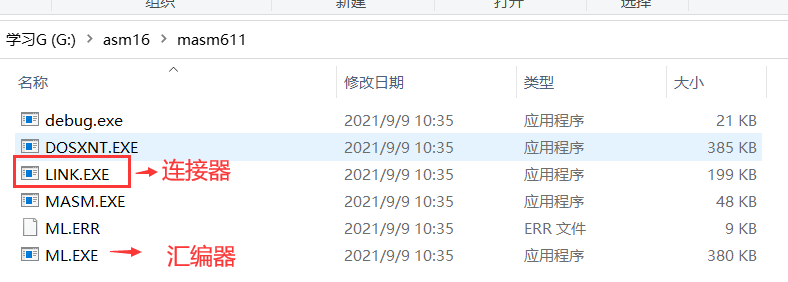

##### xp环境配置

1.拷贝masm615到指定目录

2.将masm615目录添加进环境变量

3.在cmd中输入ml，可以识别即配置成功


##### dosbox环境配置

1.拷贝masm611到指定目录

2.将masm611所在目录添挂载进dosbox

3.将masm611目录在dosbox中添加进环境变量

4.在cmd中输入ml，可以识别即配置成功


##### window10 环境配置

masm615  是  32位程序的(可以在xp系统上用)       因此要用   masm611

1.把文件复制到 dosbox-x 挂载的文件目录下

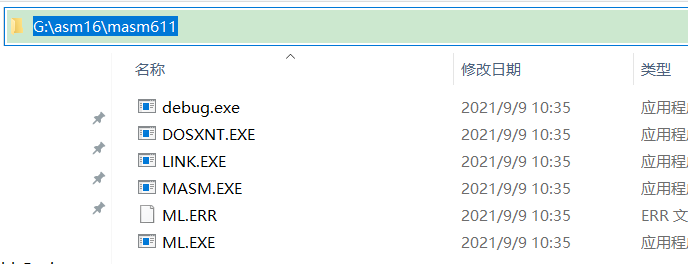


这样比较麻烦,所以可以把路径放入环境变量,在放入配置文件     set path=%path%;c:\masm611\


 

#### 2. 入口和段

##### 入口

```
CODE segment                                                 

START:                                

	mov ax, ax                                

CODE ends     

//表示标号  START  的第一行代码就是程序起点                                                     

end START    
```

##### 段

1.  一个程序必须至少有一个段
2.  一个程序中可以定义多个段

1.  段不能嵌套
2.  段可以重名，重名的段会被编译到同一块内存中
3.  一般代码和数据是放在不同段内，一般有个代码段，一个数据段，一个栈段

格式:  

​    段名 segment 

​    ends 段名

```
TEST0 segment
    mov cx, cx
TEST0 ends

CODE segment
    mov dx, dx
CODE ends

CODE segment
    mov bx, bx 
CODE ends


CODE segment

START:
    mov ax, ax
CODE ends

end START
```

#### 注释

​     汇编中使用分号( ; )来标注行注释，只有行注释，没有块注释

```
;这里是注释

mov ax, bx ;这里是注释
```

#### 常量

#####     整数

1.整数可以支持多个进制

2.数值必须以数字开头，如果**非数字，前面必须加0  (如  abcH  必须写成  0abcH)**

3.负数前面可以加减号（-）


##### 字符

1.  字符可以用单引号(‘)或双引号(””)

mov byte ptr [bx], '$'

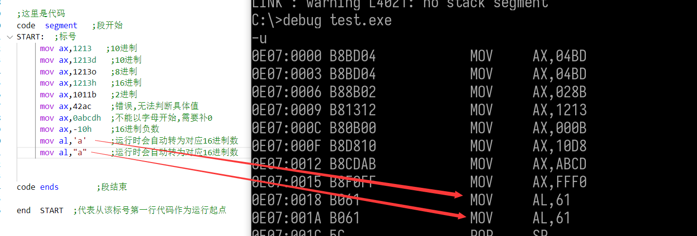

#### 5. 变量

##### 整形

1.整数可以支持多个类型

2.整数可以有多个初值，未初始化的值用问号(?)表示

3.变量一般定义在一个单独的段中

```cpp
变量名    类型    初始值
val        dd      5566h 
```


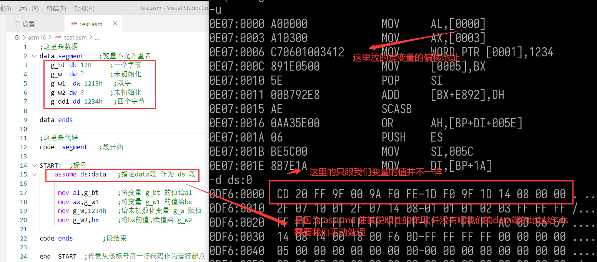

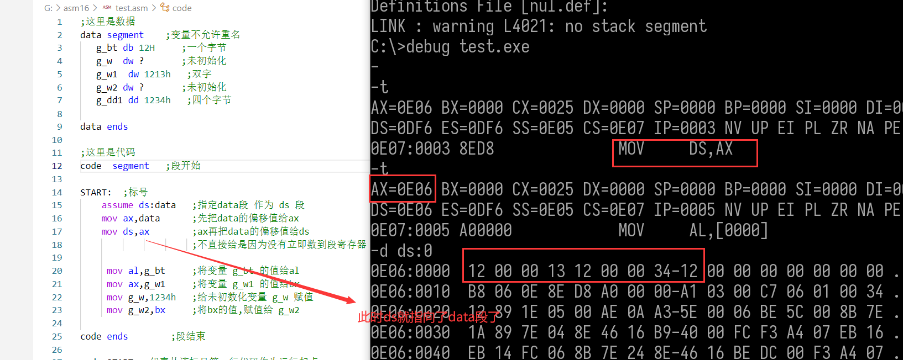

##### 字符串

1.字符串都可以用单引号(‘)或双引号(””),单引号和双引号作用一样

2.字符串一般以美元符$结尾

g_sz db "hello world$"; 16位汇编中以美元符结尾


##### 数组

```
;这里是数据
data segment    ;变量不允许重名 
   g_ary  dw  12,13,14,15,16,17  ;长度等于你定义的个数
   g_ary1 dw  16 dup(55h)        ;表示定义了一个长度16,初始值都是55的数组 
   g_ary2 dw  66h,4 dup(8888h),9999h,3 dup(7777h)

   g_bt db 12H     ;一个字节
   g_w  dw ?       ;未初始化
   g_w1  dw 1213h   ;双字
   g_w2 dw ?       ;未初始化
   g_dd1 dd 1234h   ;四个字节
   g_sz db "hello world $" ;汇编不会自动帮你加'\0'

data ends

;这里是代码
code  segment   ;段开始
 
START:  ;标号
    assume ds:data   ;指定data段 作为 ds 段
    mov ax,data      ;先把data的偏移值给ax
    mov ds,ax        ;ax再把data的偏移值给ds
                     ;不直接给是因为没有立即数到段寄存器
    
     mov al,g_bt     ;将变量 g_bt 的值给al
     mov ax,g_w1     ;将变量 g_w1 的值给bx
     mov g_w,1234h   ;给未初数化变量 g_w 赋值
     mov g_w2,bx     ;将bx的值,赋值给 g_w2
     

code ends        ;段结束

end  START  ;代表从该标号第一行代码作为运行起点
```

 格式： 

​     名字 类型 值1[,值2][,值2][,值2][,值2]

​     名字 类型 数量 dup (初值)[,数量 dup (初值)][,值]

 示例

​     g_db   db 78h, 96h, 43h;后面跟初始化的值

​     g_ary  db 256 dup(0), 128 dup(11h);重复256个0，再跟重复128个1


dup中如果不想给初值,可以直接写 ?


###### 赋值

```
 g_ary  dw  12 dup(0)    


;给数组元素赋值
lea bx , g_ary  ;获取 g_ary 的偏移地址,即第一个元素的地址
mov  word ptr [bx + 2 * 2],10h ; word是数组元素类型 2*2 是 元素下标 * 元素大小 
                               ; 计算元素偏移值 , 10H 是要赋值的值
                                    
```

###### 取值

```
g_ary  dw  12 dup(0)    


;取出数组指定元素的值
lea bx , g_ary  ;获取 g_ary 的偏移地址,即第一个元素的地址
mov  ax,word ptr [bx + 2 * 2] ; word是数组元素类型 2 * 2 是 元素下标 * 元素大小 
                              ; 计算元素偏移值 
```

##### 属性

masm提供了很多伪指令，可以获取变量的大小和地址，称之为变量的属性。


```
;这里是数据
data segment    ;变量不允许重名 
   g_ary  dw  12 dup(0) 
   ; 如果 g_ary  dw  888h,12 dup(0)  那么属性就是以g_ary dw 888h来算
   g_bt   db  11h
 
data ends

;这里是代码
code  segment   ;段开始
 
START:  ;标号
    assume ds:data   ;指定data段 作为 ds 段
    mov ax,data      ;先把data的偏移值给ax
    mov ds,ax        ;ax再把data的偏移值给ds
                     ;不直接给是因为没有立即数到段寄存器
    
    mov ax, set    g_bt   ;把变量g_bt的段基址给 ax
    mov ax, size   g_bt   ;将变量g_bt的大小给 ax
    mov ax, type   g_bt   ;将变量g_bt的元素类型大小给 ax
    mov ax, length g_bt   ;将变量g_bt的元素个数给 ax

    mov ax, size   g_ary  ;将变量g_ary的大小给 ax
    mov ax, type   g_ary  ;将变量g_ary的元素类型大小给 ax
    mov ax, length g_ary  ;将变量g_ary的元素个数给 ax
    
     ;给数组元素赋值
     lea bx , g_ary  ;获取 g_ary 的偏移地址,即第一个元素的地址
     mov  word ptr [bx + 2 * 2],10h ; word是数组元素类型 2*2 是 元素下标 * 元素大小 
                                    ; 计算元素偏移值 , 10H 是要赋值的值

code ends        ;段结束

end  START  ;代表从该标号第一行代码作为运行起点
```


##### 堆栈

stack关键字让程序在被加载的时候指定ss、bp和sp 。

使用数组为栈设置大小

```
;栈段
stack segment  stack   ; segment 后面跟关键字  stack ,说明这是一个栈段
   db  256 dup(1)
stack ends

;这里是数据
data segment    ;变量不允许重名 
   g_ary  dw  12 dup(0)
   g_bt   db  11h
 

data ends

;这里是代码
code  segment   ;段开始
 
START:  ;标号
    assume ds:data   ;指定data段 作为 ds 段
    mov ax,data      ;先把data的偏移值给ax
    mov ds,ax        ;ax再把data的偏移值给ds
                     ;不直接给是因为没有立即数到段寄存器
    
    mov ax, seg    g_bt   ;把变量g_bt的段基址给 ax
    mov ax, size   g_bt   ;将变量g_bt的大小给 ax
    mov ax, type   g_bt   ;将变量g_bt的元素类型大小给 ax
    mov ax, length g_bt   ;将变量g_bt的元素个数给 ax

    mov ax, size   g_ary  ;将变量g_ary的大小给 ax
    mov ax, type   g_ary  ;将变量g_ary的元素类型大小给 ax
    mov ax, length g_ary  ;将变量g_ary的元素个数给 ax

code ends        ;段结束

end  START  ;代表从该标号第一行代码作为运行起点
```


#### 6. 调用dos功能号

##### 功能号

1.dos系统提供的功能（API），通过21号中断来调用

2.每个功能都有一个编号，通过AH指定功能号

3.每个功能的参数查看手册

[📎指令字典2005II.zip](https://www.yuque.com/attachments/yuque/0/2022/zip/27242010/1652372237477-6a2b0f69-f677-4fb8-a552-e004e86d0550.zip)


用的最多的是21号 中断


###### 程序结束


使用方法:     将功能编号 给 al  在 调用 int  21

```
;mov ah,4CH    ;程序结束
    ;mov al,00     ;返回值 类似于 return 0 
    
    mov ax,4C00H  ; 上面2条指令合成一条  
    int 21h   ;使用21号中断
```

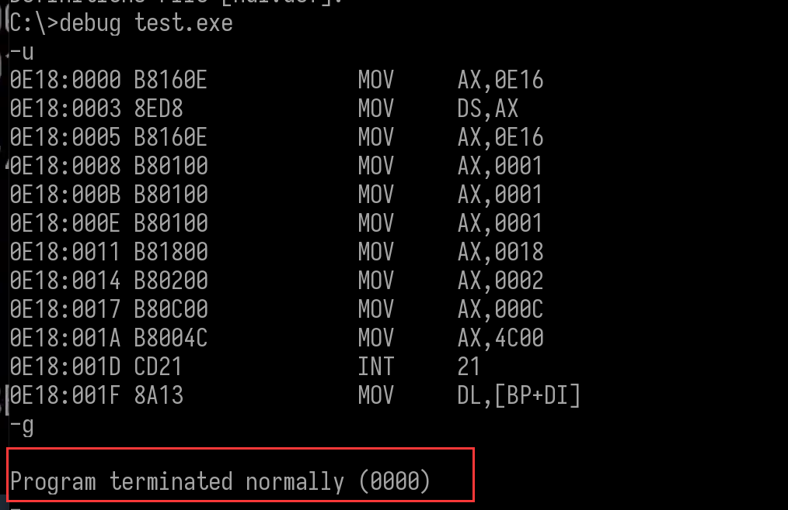


 6输出一个字符串 

DS:减一串地址

显示字符串

60

$'结束字符串


```
;栈段
stack segment  stack   ; segment 后面跟关键字  stack ,说明这是一个栈段
   db  256 dup(1)
stack ends

;这里是数据
data segment    ;变量不允许重名 
    g_sz db "hello world",0dh,0ah,"$"   ;用于输出的字符串 0dh \r  0ah \n
data ends

;这里是代码
code  segment   ;段开始
 
START:  ;标号
    assume ds:data   ;指定data段 作为 ds 段
    mov ax,data      ;先把data的偏移值给ax
    mov ds,ax        ;ax再把data的偏移值给ds
                     ;不直接给是因为没有立即数到段寄存器
   
   lea dx,g_sz           ;获取字符串 g_sz 的首地址
   ;mov dx, offset  g_sz  ;获取字符串 g_sz 的段偏移值,即首地址跟上面效果一样

   mov ah,9   ; 将功能编号给ah
   int 21H     ;调用21号中断

    ;mov ah,4CH    ;程序结束
    ;mov al,00     ;返回值 类似于 return 0 
    
    mov ax,4C00H  ; 上面2条指令合成一条  
    int 21h   ;使用21号中断

code ends        ;段结束

end  START  ;代表从该标号第一行代码作为运行起点
```


###### 输入字符串


```
;栈段
stack segment  stack   ; segment 后面跟关键字  stack ,说明这是一个栈段
   db  256 dup(1)
stack ends

;这里是数据
data segment    ;变量不允许重名 
  g_sz db 32 dup(0)   ;用于输入的字符串
data ends

;这里是代码
code  segment   ;段开始
 
START:  ;标号
    assume ds:data   ;指定data段 作为 ds 段
    mov ax,data      ;先把data的偏移值给ax
    mov ds,ax        ;ax再把data的偏移值给ds
                     ;不直接给是因为没有立即数到段寄存器
   
   lea dx,g_sz           ;获取字符串 g_sz 的首地址
   ;mov dx, offset  g_sz  ;获取字符串 g_sz 的段偏移值,即首地址跟上面效果一样
  
   mov byte ptr [bx],size  g_sz  ;把字符串大小给  byte ptr [bx]
   mov dx,bx                     ;把地址给 dx 

   mov ah,0aH   ; 将功能编号给ah
   int 21H     ;调用21号中断

    ;mov ah,4CH    ;程序结束
    ;mov al,00     ;返回值 类似于 return 0 
    
    mov ax,4C00H  ; 上面2条指令合成一条  
    int 21h   ;使用21号中断

code ends        ;段结束

end  START  ;代表从该标号第一行代码作为运行起点
```


##### 中断

1.中断是由cpu提供的流程跳转指令，类似函数调用

2.在00:00位置存储着一个双字数组，大小为256，称作中断向量表

3.数组元素为逻辑地址**段基址****:****段偏移**

4.int n的意思是从第n个元素获取地址，然后跳转执行


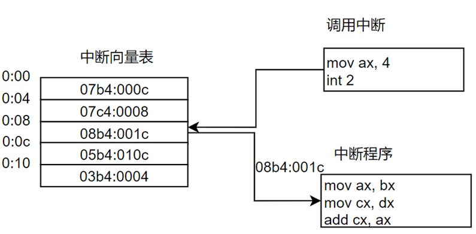


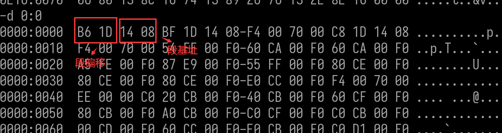

#### 总结

每一个文件 以 **end** 作结尾,每个文件至少有一个段,程序的入口点用标号 ,标号名放在end后面.多个文件只能有一个标号放在end后面,一个段里面可以定义变量,可以写代码,但是一般我们会把,代码,数据,栈分开,放在不同段里面

#### 示例:

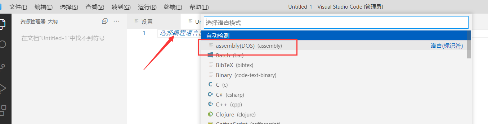

```
code  segment   ;段开始

START:  ;标号
  mov  ax,ax 
  mov  ax,ax 
  mov  ax,ax 

code ends        ;段结束

end  START  ;代表从标号  START 的第一行代码作为运行起点
```

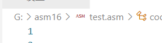 注意文件要放在挂在的文件中


###### 编译


###### 链接


###### 调试


###### 编译链接脚本

```
● 编译+调试 脚本
  ml/c %1.asm
  link %1.obj
  debug %1.exe
    
文件后缀要改成 .bat ,而且要跟文件同目录
```


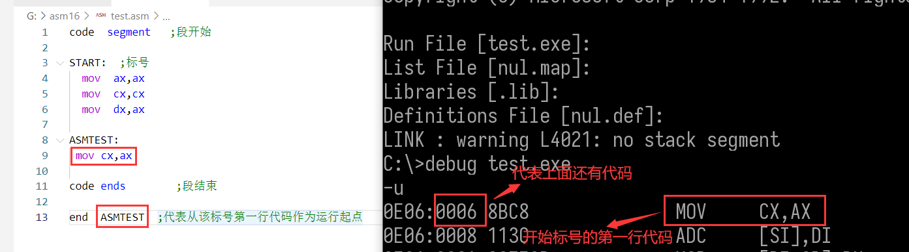


### 串操作

• 串传送MOVS（move string）

• 串存储STOS（store string）

• 串读取LODS（load string）

• 串比较CMPS

• 串扫描SCAS（scan string）


 串传送MOVS（move string） 

​    把字节或字操作数从主存的源地址传送至目的地址

 （1）MOVSB 

​     作用：字节 串传送：ES:[DI]←DS:[SI] （ SI←SI±1，DI←DI±1 ）

​                从 DS:[SI] 取一个字节 存到  ES:[DI]

 （2）MOVSW 

​      作用：字  串传送：ES:[DI]←DS:[SI]（SI←SI±2，DI←DI±2）

​                 从 DS:[SI] 取一个字 存到  ES:[DI]

 （3）MOVSD 

​         作用：双字串 传送：ES:[EDI]←DS:[ESI]（SI←SI±4，DI←DI±4）

​                     从 DS:[SI] 取一个双字 存到  ES:[DI]

举例：

​     memcpy

```
;栈段
stack segment  stack   ; segment 后面跟关键字  stack ,说明这是一个栈段
   db  256 dup(1)
stack ends

;这里是数据
data segment    ;变量不允许重名 

  g_sz db "hello world",0dh,0ah,"$"   
  g_sz1 db 32 dup(0)   ;用于输入的字符串
data ends

;这里是代码
code  segment   ;段开始
 
START:  ;标号
   assume ds:data   ;指定data段 作为 ds 段
   mov ax,data      ;先把data的偏移值给ax
   mov ds,ax        ;ax再把data的偏移值给ds
                    ;不直接给是因为没有立即数到段寄存器
                    
   lea si,g_sz       ;获取字符串 g_sz 的首地址
   lea di,g_sz1      ;获取字符串 g_sz1 的首地址
 
   mov ax,ds        ;因为是从 ES:[DI]←DS:[SI],所以把 es  设成ds 
   mov es,ax
   movsb            ;从DS:[SI]拷贝一个字节数据到ES:[DI]
   movsb            ;从DS:[SI]拷贝一个字节数据到ES:[DI]
   movsb            ;从DS:[SI]拷贝一个字节数据到ES:[DI]
   movsb
   movsb
   movsb

   ;mov ah,4CH    ;程序结束
   ;mov al,00     ;返回值 类似于 return 0 
    
   mov ax,4C00H  ; 上面2条指令合成一条  
   int 21h   ;使用21号中断

code ends        ;段结束

end  START  ;代表从该标号第一行代码作为运行起点
```


 串存储STOS（store string） 

  把AL或AX数据传送至目的地址

 （1）STOSB 

​          作用：字节串存储 ES:[DI]←AL    DI←DI±1

​          把Al中的值给   ES:[DI]

 （2）STOSW 

  作用：字串存储：ES:[DI]←AX    DI←DI±2

​      把AX 中的值给   ES:[DI]   

 （3） STOSD 

​     作用：双字串存储：ES:[EDI]←EAX   DI←DI±4

​      把 EAX   中的值给  ES:[EDI]

举例：

​      memset

```
;栈段
stack segment  stack   ; segment 后面跟关键字  stack ,说明这是一个栈段
   db  256 dup(1)
stack ends

;这里是数据
data segment    ;变量不允许重名 

  g_sz db "hello world",0dh,0ah,"$"   
  g_sz1 db 32 dup(0)   ;用于输入的字符串
data ends

;这里是代码
code  segment   ;段开始
 
START:  ;标号
   assume ds:data   ;指定data段 作为 ds 段
   mov ax,data      ;先把data的偏移值给ax
   mov ds,ax        ;ax再把data的偏移值给ds
                    ;不直接给是因为没有立即数到段寄存器

   mov ax,ds         
   mov es,ax

   mov al,66h
   lea di,g_sz1      ;获取字符串 g_sz 的首地址
   stosb             ;将 al (66H),依次赋值给 g_sz1 开始的 各个字节 
   stosb 
   stosb
   stosb

   ;mov ah,4CH    ;程序结束
   ;mov al,00     ;返回值 类似于 return 0 
    
   mov ax,4C00H  ; 上面2条指令合成一条  
   int 21h   ;使用21号中断

code ends        ;段结束

end  START  ;代表从该标号第一行代码作为运行起点
```

#### 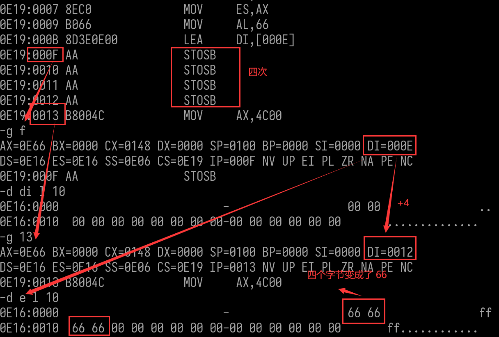

#### 

#### 串读取LODS（load string）

​       把指定主存单元的数据传送给AL或AX

##### （1）LODSB

​     作用：字节串读取 AL←DS:[SI]（SI←SI±1）    

​    从  DS:[SI]  读取一个字节 给 al

##### （2）LODSW

​       作用：字串读取 AX←DS:[SI] （SI←SI±2）

##### （3）LODSD

​      作用：双字串读取 EAX← DS:[ESI] （SI←SI±4）

```
;栈段
stack segment  stack   ; segment 后面跟关键字  stack ,说明这是一个栈段
   db  256 dup(1)
stack ends

;这里是数据
data segment    ;变量不允许重名 

  g_sz db "hello world",0dh,0ah,"$"   
  g_sz1 db 32 dup(0)   ;用于输入的字符串
  g_sz2 db "hi$" 
data ends

;这里是代码
code  segment   ;段开始
 
START:  ;标号
   assume ds:data   ;指定data段 作为 ds 段
   mov ax,data      ;先把data的偏移值给ax
   mov ds,ax        ;ax再把data的偏移值给ds
                    ;不直接给是因为没有立即数到段寄存器

   mov ax,ds         
   mov es,ax

   mov al,0
   lea si,g_sz      ;获取字符串 g_sz 的首地址
   lodsb
   lodsb
   lodsb

   mov ax,4C00H  ; 上面2条指令合成一条  
   int 21h   ;使用21号中断

code ends        ;段结束
end  START  ;代表从该标号第一行代码作为运行起点
```


#### 串比较CMPS

将主存中的源操作数减去至目的操作数，以便设置标志，进而比较两操作数之间的关系

##### （1）CMPSB

作用：字节串比较：DS:[SI]－ES:[DI]（ SI←SI±1，DI←DI±1 ）

##### （2）CMPSW

作用：字串比较：DS:[SI]－ES:[DI]（SI←SI±2，DI←DI±2）

##### （3）CMPSD

作用：双字串比较：DS:[ESI]－ES:[EDI] （ SI←SI±4，DI←DI±4 ）

举例：

strstr

```
;栈段
stack segment  stack   ; segment 后面跟关键字  stack ,说明这是一个栈段
   db  256 dup(1)
stack ends

;这里是数据
data segment    ;变量不允许重名 

  g_sz db "hello world",0dh,0ah,"$"   
  g_sz1 db 32 dup(0)   ;用于输入的字符串
  g_sz2 db "hi$" 
data ends

;这里是代码
code  segment   ;段开始
 
START:  ;标号
   assume ds:data   ;指定data段 作为 ds 段
   mov ax,data      ;先把data的偏移值给ax
   mov ds,ax        ;ax再把data的偏移值给ds
                    ;不直接给是因为没有立即数到段寄存器

   mov ax,ds         
   mov es,ax

   lea si,g_sz      ;获取字符串 g_sz 的首地址
   lea di,g_sz2      ;获取字符串 g_sz2 的首地址
   cmpsb
   cmpsb

 
   mov ax,4C00H  ; 上面2条指令合成一条  
   int 21h   ;使用21号中断

code ends        ;段结束

end  START  ;代表从该标号第一行代码作为运行起点
```


#### 串扫描SCAS（scan string）

•作用：将**AL/AX**减去至目的操作数，以便设置标志，进而比较AL/AX与操作数之间的关系

​             一般用来找某个字符,确定字符串长度 ,例如 16asm 字符串以 "$" 结束 , 那我们从字符串开始,到找到 '$'

Di 的 值  ,就是字符串长度, 或者判断字符串中是否有某个字符,或者字符串中某个字符的下标

##### （1）SCASB 

作用：字节串扫描：AL－ES:[DI]（DI←DI±1）

##### （2）SCASW

作用：字串扫描：AX－ES:[DI]（DI←DI±2）

##### （3） SCASD

作用：字串扫描：EAX－ES:[EDI]（DI←DI±4）

举例：strlen

```
;栈段
stack segment  stack   ; segment 后面跟关键字  stack ,说明这是一个栈段
   db  256 dup(1)
stack ends

;这里是数据
data segment    ;变量不允许重名 

  g_sz db "hello world",0dh,0ah,"$"   
  g_sz1 db 32 dup(0)   ;用于输入的字符串
  g_sz2 db "hi$" 
data ends

;这里是代码
code  segment   ;段开始
 
START:  ;标号
   assume ds:data   ;指定data段 作为 ds 段
   mov ax,data      ;先把data的偏移值给ax
   mov ds,ax        ;ax再把data的偏移值给ds
                    ;不直接给是因为没有立即数到段寄存器

   mov ax,ds         
   mov es,ax

   mov al,'l'
   lea di,g_sz      ;获取字符串 g_sz 的首地址
  
   scasb
   scasb
   scasb
   scasb

    
   mov ax,4C00H  ; 上面2条指令合成一条  
   int 21h   ;使用21号中断

code ends        ;段结束
end  START  ;代表从该标号第一行代码作为运行起点
```


#### 重复前缀指令

只能用于串操作指令

串操作指令执行一次，仅对数据串中的一个字节或字进行操作。

串操作指令前，都可以加一个重复前缀，实现串操作的重复执行。重复次数隐含在**CX**寄存器中。

重复前缀分2类，3条指令：

配合不影响标志的 MOVS、STOS（和LODS）指令的 REP 前缀

配合影响标志的 CMPS 和 SCAS 指令的 REPZ 和 REPNZ 前缀


##### 无条件重复前缀指令REP

每执行一次串指令，CX减1，直到CX＝0，重复执行结束。

理解为：当数据串没有结束（CX≠0），则继续传送。

举例：

REP  LODS/LODSB/LODSW/LODSD

REP  STOS/STOSB/STOSW/STOSD

REP  MOVS/MOVSB/MOVSW/MOVSD

```
;栈段
stack segment  stack   ; segment 后面跟关键字  stack ,说明这是一个栈段
   db  256 dup(1)
stack ends

;这里是数据
data segment    ;变量不允许重名 

  g_sz db "hello world",0dh,0ah,"$"   
  g_sz1 db 32 dup(0)   ;用于输入的字符串
  g_sz2 db "hi$" 
data ends

;这里是代码
code  segment   ;段开始
 
START:  ;标号
   assume ds:data   ;指定data段 作为 ds 段
   mov ax,data      ;先把data的偏移值给ax
   mov ds,ax        ;ax再把data的偏移值给ds
                    ;不直接给是因为没有立即数到段寄存器

   mov ax,ds         
   mov es,ax


   lea si,g_sz      ;获取字符串 g_sz 的首地址
   lea di,g_sz1     ;获取字符串 g_sz1 的首地址
   mov cx, offset g_sz1 - offset g_sz  ;计算字符串 g_sz 长度
   
   rep movsb    ;将 字符串g_sz的内容 全部拷贝到  g_sz1 , cx等于 g_sz 长度


   mov ax,4C00H  ; 上面2条指令合成一条  
   int 21h   ;使用21号中断

code ends        ;段结束
end  START  ;代表从该标号第一行代码作为运行起点
```


##### 条件重复前缀指令REPZ

​    每执行一次串指令，CX减1。

​    **并判断ZF是否为0。**

​    只要CX＝0或ZF＝0，重复执行结束。

•理解：当数据串没有结束（CX≠0），并且串相等（ZF＝1），则继续比较。

•举例：

​     REPE/REPZ      SCAS/SCASB/SCASW/SCASD

​     REPE/REPZ      CMPS/CMPSB/CMPSW/CMPSD

作用: 比较2个字符串是否一样 ,如果CF 等于0 就代表一样

```
;栈段
stack segment  stack   ; segment 后面跟关键字  stack ,说明这是一个栈段
   db  256 dup(1)
stack ends

;这里是数据
data segment    ;变量不允许重名 

  g_sz db "hello world",0dh,0ah,"$"   
  g_sz1 db 32 dup(0)   ;用于输入的字符串
  g_sz2 db "hello$" 
  g_sz3 db "hello world",0dh,0ah,"$" 
data ends

;这里是代码
code  segment   ;段开始
 
START:  ;标号
   assume ds:data   ;指定data段 作为 ds 段
   mov ax,data      ;先把data的偏移值给ax
   mov ds,ax        ;ax再把data的偏移值给ds
                    ;不直接给是因为没有立即数到段寄存器

   mov ax,ds         
   mov es,ax


   lea si,g_sz      ;获取字符串 g_sz 的首地址
   lea di,g_sz2     ;获取字符串 g_sz2 的首地址
   mov cx, offset g_sz1 - offset g_sz  ;计算字符串 g_sz 长度
   
   repz cmpsb    ;ZF位是0 或者 CX = 0 结束 

   lea si,g_sz      ;获取字符串 g_sz 的首地址
   lea di,g_sz3     ;获取字符串 g_sz2 的首地址
   mov cx, offset g_sz1 - offset g_sz  ;计算字符串 g_sz 长度
   repz cmpsb    ;ZF位是0 或者 CX = 0 结束 


   mov ax,4C00H  ; 上面2条指令合成一条  
   int 21h   ;使用21号中断

code ends        ;段结束
end  START  ;代表从该标号第一行代码作为运行起点
```

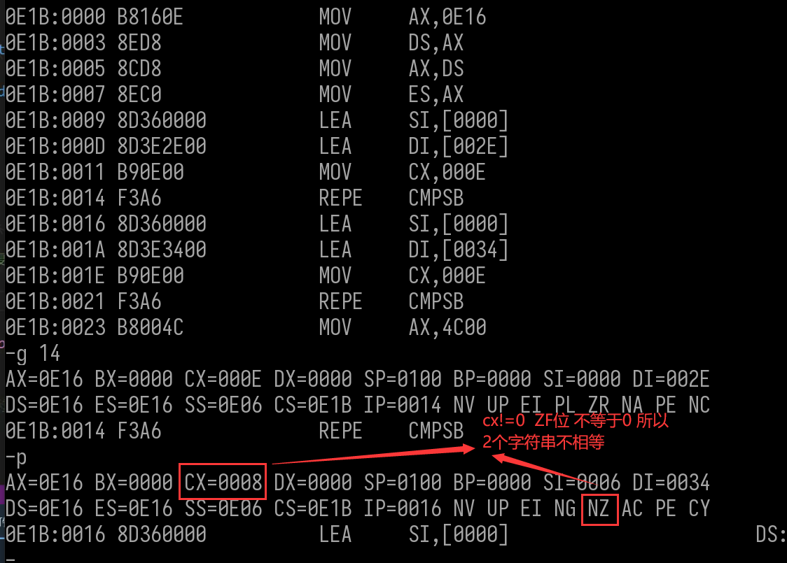


##### 条件重复前缀指令REPNZ

每执行一次串指令，CX减1。

​         **并判断ZF是否为1**。

​        只要CX＝0 或  ZF＝1，重复执行结束。

•理解：当数据串没有结束（CX≠0），并且串不相等（ZF＝0），则继续比较。

•举例：

​      REPNE/REPNZ  SCAS/SCASB/SCASW/SCASD

​      REPNE/REPNZ   CMPS/CMPSB/CMPSW/CMPSD


### 作业

#### 1、SCASB指令的作用是什么？叙述指令REPE  SCASB指令所完成的功能。

​         将**AL/AX**减去至目的操作数，以便设置标志，进而比较AL/AX与操作数之间的关系

​        REPE  SCASB : 可以用来找某个字符,确定字符串长度 ,例如 16asm 字符串以 "$" 结束 , 那我们从字符串开始,到找到 '$'  Di 的 值  ,就是字符串长度, 或者判断字符串中是否有某个字符,或者字符串中某个字符的下标


#### 2、指令REPNE  SCASB结束执行的条件是什么？

​       数据传中的字符 和 al 中的值相等 或者 cx 值为0


#### 3、REP前缀的作用是什么？能用指令REP LODSB读取DS:SI所指内存中的每个字符来进行处理吗？若不能，请说明原因。

​        重复执行串操作      不行,al中的值会被后面的覆盖


#### 4、 从键盘读入任意字符串（不超过255），并输出字符串长度和字符串内容

```
;从键盘读入任意字符串（不超过255），并输出字符串长度和字符串内容
;这里是数据
data segment    ;变量不允许重名 
  g_w dw   0     ;记录循环次数
  g_sz1 db 6 dup('$')     ;用于输出长度的字符串
  g_sz db 255 dup('$')   ;用于输入的字符串
  g_Number db "0","1","2","3","4","5","6","7","8","9","A","B","C","D","E","F" ; 数字数组
data ends

;这里是代码
code  segment   ;段开始
 
START:  ;标号
    assume ds:data   ;指定data段 作为 ds 段
    mov ax,data      ;先把data的偏移值给ax
    mov ds,ax        ;ax再把data的偏移值给ds
    mov es,ax        ;不直接给是因为没有立即数到段寄存器
                            

   lea bx,g_sz           ;获取字符串 g_sz 的首地址
   mov word ptr [bx],size  g_sz  ;把字符串大小给  byte ptr [bx]
   mov dx,bx                     ;把地址给 dx 
  ;输入字符串
   mov ah,0aH   ; 将功能编号给ah
   int 21H     ;调用21号中断

   mov ax,0
   mov al,byte ptr[g_sz+1] 
   mov si,ax
   mov word ptr [g_sz+2+si],0d0aH   ;添加字符串后加'\r\n'

   lea dx,g_sz           ;获取字符串 g_sz 的首地址
   add dx,2
   ;输出字符传串
   mov ah,9   ; 将功能编号给ah
   int 21H     ;调用21号中断

    ;将长度给g_sz1
    ;把DX清0 
    mov dx,0
    mov dl,byte ptr[g_sz+1] 
    ;然后取出低四位去数组里找到对应的存储
    mov cl,4
    shr dx,cl;右移四位得到低四位

    mov si,dx
    mov cl,g_Number[si] ;把数组第bx个元素给cx寄存器
    ;然后把cl里的值给输出数字的字符串
    mov byte ptr [g_sz1] ,cl

    ;开始取第二位
    mov dx,0;
    mov dl,byte ptr[bx+1] 
    mov cl,12
    shl dx,cl
    shr dx,cl
    mov si,dx
    mov cl,g_Number[si] ;把数组第bx个元素给cx寄存器

    ;然后把cl里的值给输出数字的字符串
    mov byte ptr [g_sz1+1] ,cl
    mov word ptr [g_sz1+2],0d0aH   ;添加字符串后加'\r\n'

    lea dx,g_sz1           ;获取字符串 g_sz 的首地址
    ;输出字符传串
    mov ah,9   ; 将功能编号给ah
    int 21H     ;调用21号中断


 EXIT:  
    mov ax,4C00H  ; 上面2条指令合成一条  
    int 21h   ;使用21号中断

code ends        ;段结束
end  START  ;代表从该标号第一行代码作为运行起点
```

#### 5、 从键盘读入任意字符串（不超过255)，以第一个字母为文件名，将字符串存入文件。

```
data segment

g_sz db 255 dup("$")
g_szfileName  db 'a.txt', 0

data ends

;这里是代码
CODE segment

START:
    assume ds:data
    mov ax, data
    mov ds, ax
    
    ;输入字符串
    lea bx, g_sz     ;获取字符串首地址
	mov byte ptr [bx], size g_sz   ;存储字符串大小
	mov dx, bx
	mov ah, 0ah       ;调用输入文件功能
    int 21h
	
    ;创建文件
	lea bx, g_sz        ;获取字符串首地址
	mov cl, [bx+2]      ;获取字符串的第一个字符
	mov g_szfileName, cl        ;将字符串的第一个字符给文件名
	mov dx, offset g_szfileName ;获取文件名首地址
	mov cx, 0           ;文件属性 0 即可
	mov ah, 3ch         ;调用创建文件功能
	int 21h		        

    ;写文件    DS:DX=数据缓冲区地址   BX=文件代号（创建文件后ax的值）    CX=写入的字节数

	lea dx, [g_sz+2]	;获取字符串开始地址 前面2字节是 总大小 和 实际大小
	mov bx, ax      
	lea si, g_sz
	mov cl, [si+1]      ;获取字符串实际大小 首地址 +1  

	mov ah, 40h         ;调用写文件功能  
	int 21h		       
	
	mov ah, 3eh
	int 21h		;关闭文件


	mov ax, 4c00h
	int 21h
        
CODE ends
end START
```

#### 6、 从键盘读入文件名，打开文件（不超过255），显示文件内容

```
data segment
g_sz db 255 dup("$")
g_szFileName db 255 dup("0")
data ends

;这里是代码
CODE segment

START:
    assume ds:data
    mov ax, data
    mov ds, ax

    ;输入字符串
    lea bx, g_szFileName     ;获取字符串首地址
	mov byte ptr [bx], size g_szFileName   ;存储字符串大小
	mov dx, bx
	mov ah, 0ah            ;调用输入文件功能
    int 21h

    ;清除输入的回车
    mov ax,0
    mov al,byte ptr [g_szFileName+1]
    mov si,ax
    mov byte ptr [si+g_szFileName+2],0   ;添加字符串后加0


    ;打开文件 DS:DX=文件名地址  AL=0 读  =1 写  =3 读/写
	lea dx, g_szfileName        ;获取字符串首地址
    add dx,2
	mov al, 0h           ;文件属性 0 读  1 写  3 读/写
	mov ah, 3dh         ;调用创建文件功能
	int 21h	


    ;读文件    DS:DX=数据缓冲区地址   BX=文件代号（创建文件后ax的值）    CX=读取的字节数
    lea dx, g_sz  ;字符串缓冲区
    mov bx, ax 
    mov cl, 255   ; 读取字符的长度
    mov ah, 3fh
    int 21h    ;读入字符串内容
	
	mov ah, 3eh
	int 21h		        ;关闭文件

    lea dx,g_sz           ;获取字符串 g_sz 的首地址
    ;输出字符传串
    mov ah,09H   ; 将功能编号给ah
    int 21H     ;调用21号中断


	mov ax, 4c00h
	int 21h
        
CODE ends
end START
```

#### 7、从键盘输入文件名，查找指定文件（不超过255）中是否含有字母B。


```
data segment
g_IsHave db "Is Have",0dh,0ah,"$" ;存在B
g_IsNotHave db "No Have",0dh,0ah,"$";不存在B
g_sz db 255 dup("$")
g_szFileName db 255 dup("0")
data ends

;这里是代码
CODE segment
START:
    assume ds:data
    mov ax, data
    mov ds, ax

    ;输入字符串
    lea bx, g_szFileName     ;获取字符串首地址
	mov byte ptr [bx], size g_szFileName   ;存储字符串大小
	mov dx, bx
	mov ah, 0ah            ;调用输入文件功能
    int 21h

    ;清除输入的回车
    mov ax,0
    mov al,byte ptr [g_szFileName+1]
    mov si,ax
    mov byte ptr [si+g_szFileName+2],0   ;添加字符串后加0


    ;打开文件 DS:DX=文件名地址  AL=0 读  =1 写  =3 读/写
	lea dx, g_szfileName        ;获取字符串首地址
    add dx,2
	mov al, 0h           ;文件属性 0 读  1 写  3 读/写
	mov ah, 3dh         ;调用创建文件功能
	int 21h	


    ;读文件    DS:DX=数据缓冲区地址   BX=文件代号（创建文件后ax的值）    CX=读取的字节数
    lea dx, g_sz  ;字符串缓冲区
    mov bx, ax 
    mov cl, 255   ; 读取字符的长度
    mov ah, 3fh
    int 21h    ;读入字符串内容

	
	mov ah, 3eh
	int 21h		        ;关闭文件

    mov al,'b'
    lea di,g_sz      ;获取字符串 g_sz 的首地址
    
    
    REPNZ scasb    ;串扫描,cx=0 或则 zf = 1 停止

    ; zf =1 时跳转
    jz  LEABEL2    ;扫描过后判断zf状态是否为1 ,不判断cf是防止最后一个是b

    ;输出字符串  g_szNEqu
    lea dx,g_IsNotHave
    mov ah,09H
    int 21H

 EXIT:  
    mov ax,4C00H  ; 上面2条指令合成一条  
    int 21h   ;使用21号中断

LEABEL2:
    ;输出字符串  g_szEqu
    lea dx,g_IsHave
    mov ah,09H
    int 21H
    jmp EXIT
 	     
CODE ends
end START
```

#### 8、从键盘读入文件名，打开文件（不超过255），输出文件中字符的个数。


```
data segment
g_dwLength  dw ?   ;字符串长度
g_szLength db 8 dup('$')     ;用于输出长度的字符串
g_szEnter db 0dh,0aH,'$'    ;回车换行
g_Number db "0","1","2","3","4","5","6","7","8","9","A","B","C","D","E","F" ; 数字数组
g_sz db 255 dup("$")
g_szFileName db 255 dup("0")
data ends

;这里是代码
CODE segment
START:
    assume ds:data
    mov ax, data
    mov ds, ax

    ;输入字符串
    lea bx, g_szFileName     ;获取字符串首地址
	mov byte ptr [bx], size g_szFileName   ;存储字符串大小
	mov dx, bx
	mov ah, 0ah            ;调用输入文件功能
    int 21h

    ;清除输入的回车
    mov ax,0
    mov al,byte ptr [g_szFileName+1]
    mov si,ax
    mov byte ptr [si+g_szFileName+2],0   ;添加字符串后加0


    ;打开文件 DS:DX=文件名地址  AL=0 读  =1 写  =3 读/写
	lea dx, g_szfileName        ;获取字符串首地址
    add dx,2
	mov al, 0h           ;文件属性 0 读  1 写  3 读/写
	mov ah, 3dh         ;调用创建文件功能
	int 21h	


    ;读文件    DS:DX=数据缓冲区地址   BX=文件代号（创建文件后ax的值）    CX=读取的字节数
    lea dx, g_sz  ;字符串缓冲区
    mov bx, ax 
    mov cl, 255   ; 读取字符的长度
    mov ah, 3fh
    int 21h       ;读入字符串内容
   
    mov g_dwLength,ax  ;保存读取文件长度
	
	mov ah, 3eh
	int 21h		        ;关闭文件

    ;调一下回车
    lea dx,g_szEnter           ;获取字符串 g_szEnter 的首地址
    ;输出字符传串
    mov ah,9   ; 将功能编号给ah
    int 21H     ;调用21号中断


    ;将长度给g_szLength
    ;把DX清0 
    mov dx,g_dwLength
    ;然后取出低四位去数组里找到对应的存储
    mov cl,4
    shr dx,cl;右移四位得到低四位

    mov si,dx
    mov cl,g_Number[si] ;把数组第bx个元素给cx寄存器
    ;然后把cl里的值给输出数字的字符串
    mov byte ptr [g_szLength] ,cl

    ;开始取第二位
    mov dx,g_dwLength;
    mov cl,12
    shl dx,cl
    shr dx,cl
    mov si,dx
    mov cl,g_Number[si] ;把数组第bx个元素给cx寄存器

    ;然后把cl里的值给输出数字的字符串
    mov byte ptr [g_szLength+1] ,cl
    mov word ptr [g_szLength+2],0d0aH   ;添加字符串后加'\r\n'

    lea dx,g_szLength           ;获取字符串 g_sz 的首地址
    ;输出字符传串
    mov ah,9   ; 将功能编号给ah
    int 21H     ;调用21号中断

 EXIT:  
    mov ax,4C00H  ; 上面2条指令合成一条  
    int 21h   ;使用21号中断
     
CODE ends
end START
```

#### 9、 程序中定义一个数组（不超过255），从键盘输入一个字符和长度，将数组中输入长度的部分设置成输入的字符。

```
;程序中定义一个数组（不超过255），从键盘输入一个字符和长度，将数组中输入
;长度的部分设置成输入的字符。


data segment
  g_sz_input db 4 dup(0),0ah,0dh,'$'
  g_length db 4 dup(0),0ah,0dh,'$'
  g_sz db 255 dup(0)

  g_szInputLength db 'please input length',0ah,0dh,'$'
  g_szInputChar db 'please input char',0ah,0dh,'$'
  g_szEnther db  0ah,0dh,'$'
data ends

;这里是代码
CODE segment

START:
    assume ds:data
    mov ax, data
    mov ds, ax
    
    lea bx, g_szInputChar
	mov dx, bx
	mov ah, 09h
    int 21h	

    lea bx, g_sz_input
	mov byte ptr [bx], size g_sz_input
	mov dx, bx
	mov ah, 0ah
    int 21h						;输入字符
	
    lea bx, g_szInputLength
	mov dx, bx
	mov ah, 09h
    int 21h	

	lea bx, g_length
	mov byte ptr [bx], size g_length
	mov dx, bx
	mov ah, 0ah
    int 21h						;输入长度
	
    
    ;需要把对应字符串转为字符,尚未实现
    ;思路根据长度取出字符串,根据字符在数组中的值在字符数组偏移值求索引(即在数组中的下班)
    
    
    
	mov ax, 0
	mov bx, 0
	mov si, 0
	mov al, [g_length+2]
	mov bl, [g_sz_input+2]
	mov si, ax
	mov [g_sz+si], bl			;将字符赋值到相应位置
	

	mov ax, 4c00h
	int 21h
        
CODE ends

end START
```

