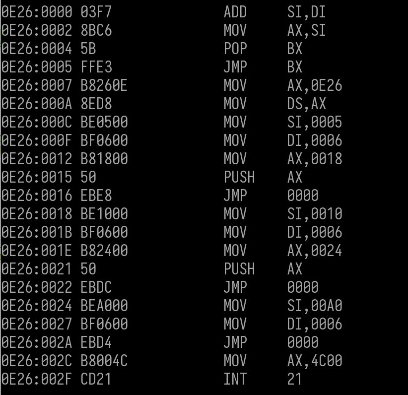
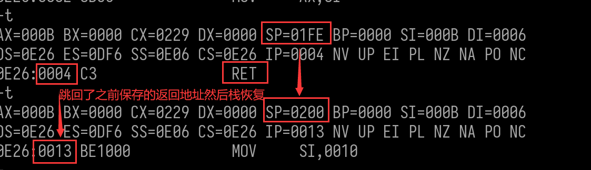
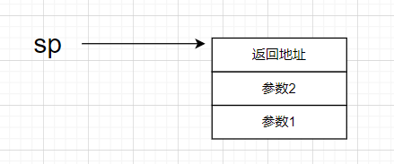
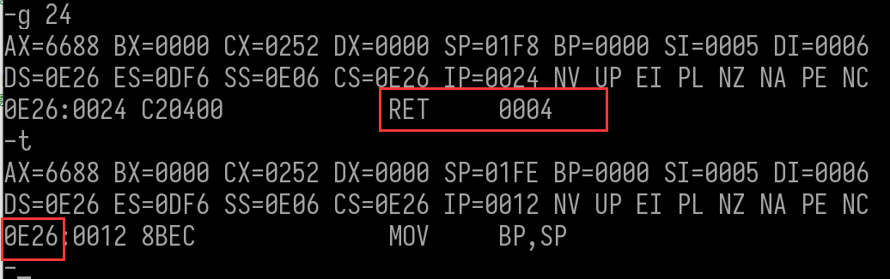
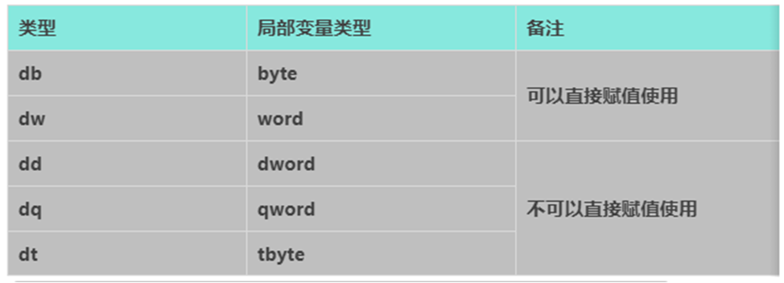
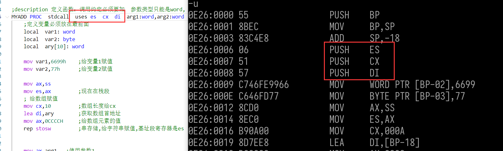
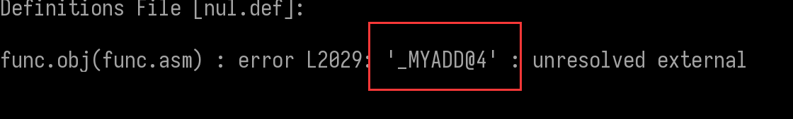

### 函数结构

#### 函数结构的演变

函数的结构并不是随随便便就出来的而是解决了很多问题之后,大家统一认为那个结构是最好的一种方式

例如:模拟函数实现2个数相加


##### 不用函数实现两个数相加  

```
;这是栈段
stack segment stack
  db 512 dup(0)
stack  ends

;这是数据段
data segment

data ends

;这里是代码
CODE segment
START:
    assume ds:data
    mov ax, data
    mov ds, ax
    
    
    mov si,5H
    mov di,6H    
    add si,di

    mov si,10H
    mov di,6H    
    add si,di
    
    mov si,0A0h
    mov di,6H   
    add si,di
    
    mov ax,4C00H  ; 带参数返回的退出  
    int 21h   ;使用21号中断
     
CODE ends
end START
```

##### 模拟函数实现

```
;这是栈段
stack segment stack
   db 512 dup(0)
stack  ends

;这是数据段
data segment

data ends

MYADD:
 add si,di
 mov ax,si

;这里是代码
CODE segment
START:
    assume ds:data
    mov ax, data
    mov ds, ax
    
    
    mov si,5H
    mov di,6H    
    jmp  MYADD

    mov si,10H
    mov di,6H    
   
    
    mov si,0A0h
    mov di,6H   
    jmp  MYADD
    
    mov ax,4C00H  ; 带参数返回的退出  
    int 21h   ;使用21号中断
     
CODE ends
end START
```

此时跳过去了,但函数无法返回,如果使用 jmp返回,那么其他地方调用就还是没法返回 而且无法重复的调用,那如何让他正确返回呢  , 解决办法是 jmp 跳转的地址不固定,把它存起,要跳转的时候再把它取出来, 存的地址如果用全局变量保存,可需要的变量过多,而且不确定,最好的方法是用栈保存 


###### 普通的 函数跳转与返回

```
;这是栈段
stack segment stack
   db 512 dup(0)
stack  ends

;这是数据段
data segment

data ends


;这里是代码
CODE segment


MYADD:
  add si,di
  mov ax,si
  ;jmp  MYADD
  pop bx     ;取出函数返回地址
  jmp bx     ;跳转到指定的地址

START:
    assume ds:data
    mov ax, data
    mov ds, ax
    
    mov si,5H
    mov di,6H 
    mov ax, MYRET
    push ax     ;将返回地址入栈 ,不直接用 push  MYRET 是不能直接push立即数,需要用寄存器中转
    jmp  MYADD  ;跳转到函数
 
MYRET: 

    mov si,10H
    mov di,6H    
    ;jmp  MYADD
    mov ax, MYRET1
    push ax     ;将返回地址入栈 ,不直接用 push  MYRET1 是不能直接push立即数,需要用寄存器中转 
    jmp  MYADD  ;跳转到函数
    
MYRET1:    

    mov si,0A0h
    mov di,6H   
    jmp  MYADD
    
    mov ax,4C00H  ; 带参数返回的退出  
    int 21h   ;使用21号中断
     
CODE ends
end START
```




 6汇编关键字 的 函数跳转与返回 

这样每次我们跳转前都需要 将返回地址入栈 , 再进行跳转, .函数返回时 需要先将地址出栈 ,再跳转.比较麻烦,因此汇编提供了相同功能的指令 call

```
;这是栈段
stack segment stack
   db 512 dup(0)
stack  ends

;这是数据段
data segment

data ends


;这里是代码
CODE segment


MYADD:
  add si,di
  mov ax,si
  ;jmp  MYADD
  
  ;pop bx     ;取出函数返回地址
  ;jmp bx     ;跳转到指定的地址
 
  ret    ;等同于上面注释2行代码,返回地址出栈,跳转
  

START:
    assume ds:data
    mov ax, data
    mov ds, ax
    
    mov si,5H
    mov di,6H 
       
    ;mov ax, MYRET
    ;push ax     ;将返回地址入栈 ,不直接用 push  MYRET 是不能直接push立即数,需要用寄存器中转
    ;jmp  MYADD  ;跳转到函数
;MYRET: 
    
   call  MYADD   ;等能等同于上面注释的5行代码,取地址,入栈,跳转

    mov si,10H
    mov di,6H   
        
       
    ;jmp  MYADD
    ;mov ax, MYRET1
    ;push ax     ;将返回地址入栈 ,不直接用 push  MYRET1 是不能直接push立即数,需要用寄存器中转 
    ;jmp  MYADD  ;跳转到函数   
;MYRET1:    
    
    call  MYADD    ;等能等同于上面注释的5行代码,取地址,入栈,跳转 

    mov si,0A0h
    mov di,6H   
    jmp  MYADD
    
    mov ax,4C00H  ; 带参数返回的退出 
    int 21h   ;使用21号中断
     
CODE ends
end START
```




###### 参数

上面的 参数使用 si 和  di  传递的参数  ,但是如果参数多的话,寄存器可能不够使用,而且如果之前 si 和 di 保存了其他数据,我们需要先进行保存,用完之后再恢复,寄存器用的越多,那么使用发之前存的就越多,用完之后恢复的也就越多,所以传参尽量也不用寄存器 而是用栈,用的时候再到栈里面去拿出来



```
;这是栈段
stack segment stack
   db 512 dup(0)
stack  ends

;这是数据段
data segment

data ends


;这里是代码
CODE segment


MYADD:
 
  mov bp,sp
  mov si,[bp+2]   ;第二个参数
  mov di,[bp+4]   ;第一个参数
   
  add si,di
  mov ax,si
  ;jmp  MYADD
  
  ;pop bx     ;取出函数返回地址
  ;jmp bx     ;跳转到指定的地址
 
  ret    ;等同于上面注释2行代码,返回地址出栈,跳转
  

START:
    assume ds:data
    mov ax, data
    mov ds, ax
    

    mov si,5H
    mov di,6H 

    push  di   
    push  si   
    ;mov ax, MYRET
    ;push ax     ;将返回地址入栈 ,不直接用 push  MYRET 是不能直接push立即数,需要用寄存器中转
    ;jmp  MYADD  ;跳转到函数
;MYRET: 
    

   call  MYADD   ;等能等同于上面注释的5行代码,取地址,入栈,跳转

    mov si,10H
    mov di,6H   
    
    ;jmp  MYADD
    ;mov ax, MYRET1
    ;push ax     ;将返回地址入栈 ,不直接用 push  MYRET1 是不能直接push立即数,需要用寄存器中转 
    ;jmp  MYADD  ;跳转到函数   
;MYRET1:    
    
    call  MYADD    ;等能等同于上面注释的5行代码,取地址,入栈,跳转 

    mov si,0A0h
    mov di,6H   
    jmp  MYADD
    
    mov ax,4C00H  ; 带参数返回的退出 
    int 21h   ;使用21号中断
     
CODE ends
end START
```


此是运行结果结果是正确的,但是栈顶确实错误的,没有平栈,因此需要需要平参数的栈

1.  由调用方平栈      调用函数后    add   sp ,  入栈参数总长度      cdecel    c调用约定
2.  由被调用方平栈     ret    入栈参数总长度      stdcall   标准调用约定 


###### 保存和恢复寄存器环境

当我们调用函数时,函数如果使用了我们之前保存数据的寄存器,那么函数是用之后,我们保存的数据将会丢失,因此函数在使用寄存器之前,需要先保存寄存器数据,使用之后再恢复,但是调用者并不知道函数用到了哪些寄存器,因此这件事需要函数内部来实现,但是函数自己保存寄存器环境好之后有一个问题,就是参数取值问题,解决方法是 bp,sp分离,

通过bp取参数,这样不管sp如何变化,bp的值是不变的,此时bp将无法在干其他事了,因此 bp又称为 栈帧指针

注意:  ax 不需要保存,因为所有函数 ax默认当做返回值,因此任何函数都有可能修改 ax


```
;这是栈段
stack segment stack
   db 512 dup(0)
stack  ends

;这是数据段
data segment

data ends

;这里是代码
CODE segment

MYADD:
  ;保存寄存器环境
  push bp
  mov bp,sp   ;sp,bp分离 
  push si
  push di

  mov bp,sp
  mov si,[bp+4]   ;第二个参数
  mov di,[bp+6]   ;第一个参数
   
  add si,di
  mov ax,si    ;ax 不保存,是因为用来当返回值

  ;恢复寄存器环境,注意出栈和入栈顺序想反
  pop di
  pop si
  pop bp

  ;jmp  MYADD
  
  ;pop bx     ;取出函数返回地址
  ;jmp bx     ;跳转到指定的地址
 
  ret 4   ;等同于上面注释2行代码,返回地址出栈,跳转  ,后面跟数字表示返回后再出栈四个字节(入栈参数总长度)
          ; stdcall     标准调用约定
  

START:
    assume ds:data
    mov ax, data
    mov ds, ax
    

    mov si,5H
    mov di,6H 

    push  di   
    push  si   
    ;mov ax, MYRET
    ;push ax     ;将返回地址入栈 ,不直接用 push  MYRET 是不能直接push立即数,需要用寄存器中转
    ;jmp  MYADD  ;跳转到函数
;MYRET: 

   call MYADD    ;等能等同于上面注释的4行代码,取地址,入栈,跳转
   ;add sp,4      ;平参数的栈 2个参数的总长度位四字节   c调用约定平栈  cdecel
    
    mov ax,4C00H  ; 带参数返回的退出  
    int 21h   ;使用21号中断
     
CODE ends
end START
```


###### 局部变量

局部变量需要自己去栈上申请,一般在保存bp环境之后 ,保存其他寄存器环境之前,  不放在 保存所有寄存器之后的是为了访问更加方便


```
;这是栈段
stack segment stack
   db 512 dup(0)
stack  ends

;这是数据段
data segment

data ends


;这里是代码
CODE segment


MYADD:
  ;保存寄存器环境
  push bp
  mov bp,sp   ;sp,bp分离 
  
  ;申请局部变量空间
  sub sp,4   ;申请4字节的局部变量空间

  push si
  push di

  ;局部变量赋值
  mov word ptr[bp-2],1122h 
  mov word ptr[bp-4],5566h 

  mov bp,sp
  mov si,[bp+4]   ;第二个参数
  mov di,[bp+6]   ;第一个参数
   
  add si,di
  mov ax,si

  ;恢复寄存器环境,注意出栈和入栈顺序想反
  pop di
  pop si

  ;add sp,4  ;释放局部空间,释放大小和申请大小必须一致
  mov sp,bp  ;释放局部空间
  
  pop bp

  ;jmp  MYADD
  
  ;pop bx     ;取出函数返回地址
  ;jmp bx     ;跳转到指定的地址
 
  ret 4   ;等同于上面注释2行代码,返回地址出栈,跳转  ,后面跟数字表示返回后再出栈四个字节(入栈参数总长度)
          ; stdcall     标准调用约定
  

START:
    assume ds:data
    mov ax, data
    mov ds, ax
    

    mov si,5H
    mov di,6H 

    push  di   
    push  si   
    ;mov ax, MYRET
    ;push ax     ;将返回地址入栈 ,不直接用 push  MYRET 是不能直接push立即数,需要用寄存器中转
    ;jmp  MYADD  ;跳转到函数
;MYRET: 

   call MYADD    ;等能等同于上面注释的4行代码,取地址,入栈,跳转
   ;add sp,4      ;平参数的栈 2个参数的总长度位四字节   c调用约定平栈  cdecel


    
    mov ax,4C00H  ; 带参数返回的退出
    int 21h   ;使用21号中断
     
CODE ends
end START
```


##### 函数执行流程

1.  参数入栈
2.  返回地址入栈，跳转到函数
3.  保存栈帧指针  ( bp)
4.  申请局部变量空间
5.  保存寄存器环境
6.  执行函数功能
7.  恢复寄存器环境
8.  释放局部变量空间
9.  恢复栈帧指针  ( bp)
10.  弹出返回地址，返回[平栈]
11.  [平栈]

##### 函数调用相关指令

| **指令（可选）**                               | **说明**         | **功能**                                            |
| ---------------------------------------------- | ---------------- | --------------------------------------------------- |
| **call (near ptr) 标号**                       | **段内直接调用** | **push 返回地址****jmp 标号**                       |
| **call Reg****call near ptr \| word ptr [EA]** | **段内间接调用** | **push 返回地址****jmp 函数地址**                   |
| **call far ptr 标号****call dword ptr [EA]**   | **段间调用**     | **push 返回地址****push CS 基地址****jmp 函数地址** |
| **ret (n)**                                    | **段内返回**     | **pop ip****add sp，n**                             |
| **retf(n)**                                    | **段间返回**     | **pop  ip****pop cs****add sp，n**                  |

段间调用不仅 ip 会被修改  cs 也会被修改,   此时调用函数需要用   call  far ptr  函数    返回要用  retf

否则返回的实在函数的 段内，并没有返回调用 的 段




如果返回是  retf  那么在段内 调用 还是要用     call  far ptr  函数

```
;这是栈段
stack segment stack
   db 512 dup(0)
stack  ends

;这是数据段
data segment

data ends

;这里是代码
CODE segment

MYADD:
  ;保存寄存器环境
  push bp
  mov bp,sp   ;sp,bp分离 
  
  ;申请局部变量空间
  sub sp,4   ;申请4字节的局部变量空间

  push si
  push di

  ;局部变量赋值
  mov word ptr[bp-2],1122h 
  mov word ptr[bp-4],5566h 

  mov bp,sp
  mov si,[bp+4]   ;第二个参数
  mov di,[bp+6]   ;第一个参数
   
  add si,di
  mov ax,si

  ;恢复寄存器环境,注意出栈和入栈顺序想反
  pop di
  pop si

  add sp,4  ;释放局部空间,释放大小和申请大小必须一致
  pop bp

  ;jmp  MYADD
  
  ;pop bx     ;取出函数返回地址
  ;jmp bx     ;跳转到指定的地址
 
  retf 4   ;等同于上面注释2行代码,返回地址出栈,跳转  ,后面跟数字表示返回后再出栈四个字节(入栈参数总长度)
          ; stdcall     标准调用约定

START:
    assume ds:data
    mov ax, data
    mov ds, ax
    

    mov si,5H
    mov di,6H 

    push  di   
    push  si   


   call far ptr MYADD    ;等能等同于上面注释的4行代码,取地址,入栈,跳转
   ;add sp,4      ;平参数的栈 2个参数的总长度位四字节   c调用约定平栈  cdecel

    mov si,9H
    mov di,6H 
   call far ptr MYADD    ;等能等同于上面注释的4行代码,取地址,入栈,跳转
   ;add sp,4      ;平参数的栈 2个参数的总长度位四字节   c调用约定平栈  cdecel
    
    mov ax,4C00H  ; 带参数返回的退出  
    int 21h   ;使用21号中断
     
CODE ends
end START
```

### masm函数语法

#### 函数语法

中括号代表可选,即可以有,也可以没有

**函数名  proc  [距离]**  **调用约定**   **[uses reg1 reg2..]  [参数:word, 参数名:word..]**

​        **local 变量:word**

​        **local 变量:word**

   

​       **ret     ;注意不加ret程序编译链接并不会报错,因此需要自己注意**

**函数名 endp**

#### 距离

| 距离关键字 | 说明                                                  | 段内使用                                      | 段间使用                                   |
| ---------- | ----------------------------------------------------- | --------------------------------------------- | ------------------------------------------ |
| near       | 函数只能段内的调用 函数使用ret返回调用时ip入栈        |                                               |                                            |
| far        | 段内段间都可使用函数使用retf 返回调用时ip 和cs 都入栈 | **ret 变为 retf****call 前自动压入cs 机器码** | **ret 变为 retf****call 自动压入基址和ip** |

#### 调用约定

**有参数就需要加调用约定,没有就不需要**

| 调用约定关键字 | 说明       |                                         |
| -------------- | ---------- | --------------------------------------- |
| C              | 调用方平栈 | 注意：不会做平栈安全检查                |
| stdcall        | 被调方平栈 | 不需要自己平栈，call 自动生成平栈机器码 |

#### 局部变量



#### 示例

TestProc  PROC    far   stdcall   uses bx dx si di    arg1:word

​     local btVal:byte

​     ret

TestProc ENDP

##### 参数

只能是 word

```
;这是栈段
stack segment stack
   db 512 dup(0)
stack  ends

;这是数据段
data segment

data ends

;这里是代码
CODE segment

;description 定义函数：调用约定必须要加  参数类型只能是word
MYADD PROC  stdcall  arg1:word,arg2:word,arg3:word
    
    mov ax,arg1   ;使用参数1
    add ax,arg2   ;使用参数2

    ret    ;如果是  stdcall 调用约定,后面不需要跟变量长度,系统会自动处理,
           ;而且系统会自动根据距离判断 是 ret 还是 retf
    
    
MYADD ENDP

START:
    assume ds:data
    mov ax, data
    mov ds, ax

    mov si,5
    mov si,6
    
    ;参数入栈  参数入栈数量跟函数参数数量必须一样,否则会破坏栈平衡
    push si
    push si
    push di


    call MYADD ;调用函数
    
    mov ax,4C00H  ; 带参数返回的退出
    int 21h   ;使用21号中断
     
CODE ends
end START
```


注意: 如果函数 定义 距离是far ,那么调用时候也要加, 但返回是可以用 ret ,系统会自动判断 使用  ret 还是 retf,而且压栈数量跟参数数量必须一样,不然会破坏栈平衡,系统并不会帮你检查参数个数

##### 局部变量

```
;这是栈段
stack segment stack
   db 512 dup(0)
stack  ends

;这是数据段
data segment

data ends

;这里是代码
CODE segment

;description 定义函数：调用约定必须要加  参数类型只能是word,
MYADD PROC  stdcall  arg1:word,arg2:word
    ;定义变量必须放在最前面
    local  var1: word
    local  var2: byte
    local  ary[10]: word

    ;使用局部变量
    mov var1,6699h    ;给变量1赋值
    mov var2,77h      ;给变量2赋值

    mov ax,ss
    mov es,ax         ;现在在栈段
    ; 给数组赋值
    mov cx,10         ;数组长度给cx     
    lea di,ary        ;获取数组首地址
    mov ax,0CCCCH     ;给数组元素的值
    rep stosb         ;串存储,给字符串赋值,基址段寄存器是es

    
    mov ax,arg1   ;使用参数1
    add ax,arg2   ;使用参数2

    ret    ;如果是  stdcall 调用约定,后面不需要跟变量长度,系统会自动处理
MYADD ENDP

START:
    assume ds:data
    mov ax, data
    mov ds, ax

    mov si,5
    mov si,6
    
    ;参数入栈
    push si
    push di


    call MYADD ;调用函数
    
    mov ax,4C00H  ; 上面2条指令合成一条  
    int 21h   ;使用21号中断
     
CODE ends
end START
```


##### 寄存器

关键字  uses




#### invoke伪指令

**invoke 函数名, 参数1， 参数2， 参数3** 

##### 说明

1.会生成参数入栈代码

2.如果是c调用约定，会生成平栈代码

3.如果是局部变量取地址，需要使用addr伪指令

4.使用addr的时候，注意ax的使用


```
;这是栈段
stack segment stack
   db 512 dup(0)
stack  ends

;这是数据段
data segment

data ends

;这里是代码
CODE segment

;description 定义函数：调用约定必须要加  参数类型只能是word,
MYADD PROC far stdcall  uses es  cx  di  arg1:word,arg2:word
    ;定义变量必须放在最前面
    local  var1: word
    local  var2: byte
    local  ary[10]: word

    mov var1,6699h    ;给变量1赋值
    mov var2,77h      ;给变量2赋值

    mov ax,ss
    mov es,ax         ;现在在栈段
    ; 给数组赋值
    mov cx,10         ;数组长度给cx     
    lea di,ary        ;获取数组首地址
    mov ax,0CCCCH     ;给数组元素的值
    rep stosw         ;串存储,给字符串赋值,基址段寄存器是es

    
    mov ax,arg1   ;使用参数1
    add ax,arg2   ;使用参数2

    ret    ;如果是  stdcall 调用约定,后面不需要跟变量长度,系统会自动处理
MYADD ENDP

START:
    assume ds:data
    mov ax, data
    mov ds, ax

    mov si,5
    mov si,6
    
    ;参数入栈
    ;push si
    ;push si
    ;push di
    ;call far ptr MYADD ;调用函数
    ;add sp 4   ;c调用约定的话调用方平栈
    
    invoke MYADD,5,6      ; invoke 会检查参数个数,而且如果是C调用约定,也会自动帮你平栈
                          ;也会自动帮你判断是 far 还是 near

    mov ax,4C00H  ; 上面2条指令合成一条  
    int 21h   ;使用21号中断
     
CODE ends
end START
```


##### 关键字 addr    传局部变量的地址

**addr 用于局部变量**   **只能用于**  **invoke  传局部变量的地址,不能用于其他地方**

offset 是其他地方都可以用,例如取全局变量,取函数的段偏移  

```
;堆栈
stack_seg segment stack
    db 512 dup(0)
stack_seg ends

;代码
code_seg segment

;交换2个函数的值  地址也是 word 类型
Swap proc stdcall uses bx si di  pVal1:word, pVal2:word

    ;取内容
    mov bx, pVal1
    mov ax, [bx]

    mov si, pVal2
    mov di, [si]

    ;交换值
    mov [bx], di
    mov [si], ax

    ret
Swap endp

;一般我们在定义局部变量时会加 @ ,非必须,是为了增加可读性
;调用交换函数,交换2个函变量的值,调用函数时,传参需要传地址
MyTest PROC stdcall arg0:word
    local @nVal1:word
    local @nVal2:word

    mov @nVal1, 1122h
    mov @nVal2, 8899h

    ;临时改一下段基址,因为上面函数里bx,si,di的段基址是 ds
    push ds
    mov ax, ss
    mov ds, ax 

    ;这种是错误的  offset 是求段偏移,因此  @nVal1,@nVal2 是在ss段,无法确定其段偏移
    ;invoke Swap, offset  @nVal1, offset @nVal2


    ;lea ax, @nVal1
    ;push ax 
    ;lea ax, @nVal2
    ;push ax
    ;call Swap

    ;addr 就是取 变量的地址 跟上面代码作用一样
    ;注意用到了 ax,如果 ax里面存储了值,到这里将会丢失
    invoke Swap, addr  @nVal1, addr @nVal2
    pop ds  
    ret
MyTest ENDP


START:
    mov si, 5
    mov di, 6

    invoke MyTest, 9

    mov ax, 4c00h;
    int 21h
code_seg ends

end START
```

#### 函数声明

函数名   proto   距离   调用约定   参数列表 

示例

`Fun1 proto far c pAddr:word`

当我们用2个文件时,一个文件调用另一个文件就需要,函数声明和 实现


汇编中 声明文件(头文件) 以后缀 .inc 结尾  ,实现还是以 .asm 结尾  每一个asm文件必须有一个 end,但是只有一个文件 end 后面跟 开始标号   ,程序只能有一个入口点

**主程序**

```
;包头文件
include math.inc 

;这是栈段
stack segment stack
   db 512 dup(0)
stack  ends

;这是数据段
data segment

data ends

;这里是代码
CODE segment

START:
    assume ds:data
    mov ax, data
    mov ds, ax

    mov si,5
    mov si,6
   
    invoke MYADD,5,6        ; invoke 会检查参数个数,而且如果是 C 调用约定,也会自动帮你平栈
                             ;也会自动帮你判断是 far 还是 near

    mov ax,4C00H  ; 上面2条指令合成一条  
    int 21h   ;使用21号中断
     
CODE ends
end START
```

函数头文件,声明文件  math.inc     

```
;声明中给函数内部使用的是不需要的 ,例如 uses 是不能有的,参数名可有可无
;MYADD PROC far stdcall  uses es  cx  di  arg1:word,arg2:word

MYADD proto far stdcall   :word,:word
```


 函数实现文件   math.asm

```
MATHCODE segment

;description 定义函数：调用约定必须要加  参数类型只能是word,
MYADD PROC far stdcall  uses es  cx  di  arg1:word,arg2:word
    ;定义变量必须放在最前面
    local  var1: word
    local  var2: byte
    local  ary[10]: word

    mov var1,6699h    ;给变量1赋值
    mov var2,77h      ;给变量2赋值

    mov ax,ss
    mov es,ax         ;现在在栈段
    ; 给数组赋值
    mov cx,10         ;数组长度给cx     
    lea di,ary        ;获取数组首地址
    mov ax,0CCCCH     ;给数组元素的值
    rep stosw         ;串存储,给字符串赋值,基址段寄存器是es

    
    mov ax,arg1   ;使用参数1
    add ax,arg2   ;使用参数2

    ret    ;如果是  stdcall 调用约定,后面不需要跟变量长度,系统会自动处理
MYADD ENDP

MATHCODE ends
end
```

运行程序



找不到实现,因此此时编译时候要将实现文件一起编译


### 作业

#### 实现以下函数, 并提交测试代码

##### strcpy

```
;实现以下函数, 并提交测试代码strcpy, strcat, strstr, memcpy, memset, memcmp ,puts, putchar, getline, getchar

;堆栈
stack_seg segment stack
    db 512 dup(0)
stack_seg ends

;数据段
data_seg segment 
   g_szSrc  db "hello  world",'$',0dh,0ah,'$'
   g_szDsc  db 255 dup('$');  
   gszEnter db 0dh,0ah,'$';
data_seg ends

;代码
code_seg segment

;实现  strcpy
strcpy proc stdcall uses ds si di  pSrc:word,pDsc:word

   mov ax,ds        ;因为是从 ES:[DI]←DS:[SI],所以把 es  设成ds 
   mov es,ax
   mov si,pSrc
   mov di,pDsc
LEABELLOOP:
    ;拷贝字符
    movsb
    cmp byte ptr [si],'$'
    loopnz LEABELLOOP  
    ret
strcpy endp

START:
    assume ds:data_seg
    mov ax, data_seg
    mov ds, ax  

    invoke strcpy,offset g_szSrc,offset g_szDsc     

 
    mov ax,0
    lea dx,g_szDsc      ;获取字符串 g_szDsc 的首地址
    ;输出字符传串
    mov ah,9   ; 将功能编号给ah
    int 21H     ;调用21号中断

    mov ax,0
    lea dx,gszEnter      ;获取字符串 g_szDsc 的首地址
    ;输出字符传串
    mov ah,9   ; 将功能编号给ah
    int 21H     ;调用21号中断
                         
    mov ax, 4c00h;
    int 21h
code_seg ends

end START
```

##### strcat

```
;实现以下函数, 并提交测试代码strcpy, strcat, strstr, memcpy, memset, memcmp ,puts, putchar, getline, getchar

;堆栈
stack_seg segment stack
    db 512 dup(0)
stack_seg ends

;数据段
data_seg segment 
   g_szSrc  db "hello world!",'$'
   g_szDsc  db "hello world",100 dup('$');  
   gszEnter db 0dh,0ah,'$';
data_seg ends

;代码
code_seg segment

;实现  strlength
strlength proc stdcall uses bx si cx  pSrc:word

   mov si,pSrc
   mov cx,255
   mov bx,0
LEABELLOOP1:
    LODSB
    add bx,1
    cmp al,'$'
    loopnz LEABELLOOP1  
    mov ax,0
    mov ax,bx
    sub ax,1
    ret
strlength endp


;实现  strcat
strcat proc stdcall uses ds si di  pSrc:word,pDsc:word

   mov ax,ds        ;因为是从 ES:[DI]←DS:[SI],所以把 es  设成ds 
   mov es,ax
   mov si,pSrc
   mov di,pDsc

   invoke strlength,di
   add di,ax
LEABELLOOP:
    movsb
    cmp byte ptr [si],'$'
    loopnz LEABELLOOP  
    ret
strcat endp

START:
    assume ds:data_seg
    mov ax, data_seg
    mov ds, ax  
  

    invoke strcat,offset g_szSrc,offset g_szDsc     

 
   mov ax,0
   lea dx,g_szDsc      ;获取字符串 g_szDsc 的首地址
   ;输出字符传串
   mov ah,9   ; 将功能编号给ah
   int 21H     ;调用21号中断

   mov ax,0
   lea dx,gszEnter      ;获取字符串 g_szDsc 的首地址
   ;输出字符传串
   mov ah,9   ; 将功能编号给ah
   int 21H     ;调用21号中断
                         
    mov ax, 4c00h;
    int 21h
code_seg ends

end START
```

##### strstr

```
;strstr 字符串查找   返回值  -1  不是字串  1是字串 
    MyStrstr PROC far stdcall uses si di bx cx pSrc:word,pDes:word

        mov si,pSrc;0158
        mov di,pDes ;00f7

        ;保存一下每个串的起始位置 好像也可以不保存,直接用参数?
        mov bx,si      
        mov cx,di 
        ;串比较
    STRSTR:
        cmp byte ptr[di],"$"
        jz STRSTROK ;子串到结尾了就是比完了
        cmp byte ptr[si],"$" ;判断是否到结尾了
        jz STRSTREND ;到结尾了就退出
        cmpsb
        jz STRSTR ;相等跳上去继续比较后面的
            add bx,1
            mov si,bx;不相等从后面开始比较
            mov di,cx;子串则是重新开始
            jmp STRSTR
    STRSTREND:
        mov ax,0ffffh ;返回ffff 也就是没找到
        jmp ENDRET
    STRSTROK:
        mov ax,1 ;因为bx里存的是si每次比较的开头
        jmp ENDRET
    ENDRET:
        ret
    MyStrstr ENDP
```

##### memcpy

```
;实现以下函数, 并提交测试代码strcpy, strcat, strstr, memcpy, memset, memcmp ,puts, putchar, getline, getchar

;堆栈
stack_seg segment stack
    db 512 dup(0)
stack_seg ends

;数据段
data_seg segment 
   g_szSrc  db "hello world!",'$'
   g_szDsc  db  100 dup('$');  
   gszEnter db 0dh,0ah,'$';
data_seg ends

;代码
code_seg segment

;实现  strlength
strlength proc stdcall uses bx si cx  pSrc:word

   mov si,pSrc
   mov cx,255
   mov bx,0
LEABELLOOP1:
    LODSB
    add bx,1
    cmp al,'$'
    loopnz LEABELLOOP1  
    mov ax,0
    mov ax,bx
    sub ax,1
    ret
strlength endp


;实现  memcpy
memcpy proc stdcall uses ds si di  pSrc:word,pDsc:word,nLength:word

   mov ax,ds        ;因为是从 ES:[DI]←DS:[SI],所以把 es  设成ds 
   mov es,ax
   mov si,pSrc
   mov di,pDsc
 
LEABELLOOP:
    movsb
    dec nLength
    cmp nLength,0
    loopnz LEABELLOOP  
    ret
memcpy endp

START:
    assume ds:data_seg
    mov ax, data_seg
    mov ds, ax  
  
    invoke memcpy,offset g_szSrc,offset g_szDsc,8H     

   mov ax,0
   lea dx,g_szDsc      ;获取字符串 g_szDsc 的首地址
   ;输出字符传串
   mov ah,9   ; 将功能编号给ah
   int 21H     ;调用21号中断

   mov ax,0
   lea dx,gszEnter      ;获取字符串 g_szDsc 的首地址
   ;输出字符传串
   mov ah,9   ; 将功能编号给ah
   int 21H     ;调用21号中断
                         
    mov ax, 4c00h;
    int 21h
code_seg ends

end START
```

##### memset

```
;实现以下函数, 并提交测试代码strcpy, strcat, strstr, memcpy, memset, memcmp ,puts, putchar, getline, getchar

;堆栈
stack_seg segment stack
    db 512 dup(0)
stack_seg ends

;数据段
data_seg segment 
   g_szSrc  db "hello world!",'$'
   g_szDsc  db  100 dup('$');  
   gszEnter db 0dh,0ah,'$';
data_seg ends

;代码
code_seg segment

;实现  strlength
strlength proc stdcall uses bx si cx  pSrc:word

   mov si,pSrc
   mov cx,255
   mov bx,0
LEABELLOOP1:
    LODSB
    add bx,1
    cmp al,'$'
    loopnz LEABELLOOP1  
    mov ax,0
    mov ax,bx
    sub ax,1
    ret
strlength endp


;实现  memset
memset proc stdcall uses ds si di  pDsc:word,nVal:word,nLength:word

   mov ax,ds        ;因为是从 ES:[DI]←DS:[SI],所以把 es  设成ds 
   mov es,ax

   mov di,pDsc
   mov ax,nVal
LEABELLOOP:
    STOSW
    dec nLength
    cmp nLength,0
    loopnz LEABELLOOP  
    ret
memset endp

START:
    assume ds:data_seg
    mov ax, data_seg
    mov ds, ax  
  
   invoke memset,offset g_szSrc,3030H,10H     

   mov ax,0
   lea dx,g_szDsc      ;获取字符串 g_szDsc 的首地址
   ;输出字符传串
   mov ah,9   ; 将功能编号给ah
   int 21H     ;调用21号中断

   mov ax,0
   lea dx,gszEnter      ;获取字符串 g_szDsc 的首地址
   ;输出字符传串
   mov ah,9   ; 将功能编号给ah
   int 21H     ;调用21号中断
                         
    mov ax, 4c00h;
    int 21h
code_seg ends

end START
```

##### memcmp

```
;实现以下函数, 并提交测试代码strcpy, strcat, strstr, memcpy, memset, memcmp ,puts, putchar, getline, getchar

;堆栈
stack_seg segment stack
    db 512 dup(0)
stack_seg ends

;数据段
data_seg segment 
   g_szSrc  db "hello world!",'$'
   g_szDsc  db "hellaworld",100 dup('$');  
   g_szEnter db 0dh,0ah,'$';

data_seg ends

;代码
code_seg segment

;实现  strlength
strlength proc stdcall uses bx si cx  pSrc:word

   mov si,pSrc
   mov cx,255
   mov bx,0
LEABELLOOP1:
    LODSB
    add bx,1
    cmp al,'$'
    loopnz LEABELLOOP1  
    mov ax,0
    mov ax,bx
    sub ax,1
    ret
strlength endp

;输出字符串
inputstr proc stdcall uses dx  pSrc:word
   mov ax,0
   mov dx,pSrc      ;获取字符串 g_szDsc 的首地址
   ;输出字符传串
   mov ah,9   ; 将功能编号给ah
   int 21H     ;调用21号中断
   ret
inputstr endp


;实现  memset
memcmp proc stdcall uses ds si di cx pSrc:word,pDsc:word,nLength:word

   mov ax,ds        ;因为是从 ES:[DI]←DS:[SI],所以把 es  设成ds 
   mov es,ax

   mov di,pDsc
   mov si,pSrc
   mov cx,nLength
   REPZ  CMPSB  
   ;等于
   jz  LEABEL1
   ;大于
   ja  LEABEL2
   ;小于
   jb  LEABEL3

LEABEL1:
  mov ax,0
  jmp memcmpend
LEABEL2:
  mov ax,1
  jmp memcmpend
LEABEL3:
  mov ax,0FFFFH
  jmp memcmpend

memcmpend:
   
   ret
memcmp endp

START:
    assume ds:data_seg
    mov ax, data_seg
    mov ds, ax  
  
   invoke memcmp,offset g_szSrc,offset g_szDsc,10H     
                   
    mov ax, 4c00h;
    int 21h
code_seg ends

end START
```

##### puts

```
;实现以下函数, 并提交测试代码strcpy, strcat, strstr, memcpy, memset, memcmp ,puts, putchar, getline, getchar

;堆栈
stack_seg segment stack
    db 512 dup(0)
stack_seg ends

;数据段
data_seg segment 
   g_szSrc  db "hello world!",'$'
   g_szDsc  db "hello",100 dup('$');  
   g_szEnter db 0dh,0ah,'$';
   g_szEqual db  "Result si equal",0dh,0ah,'$';
   g_szGreate db "Result si greate",0dh,0ah,'$';
   g_szLess   db "Result si less",0dh,0ah,'$';
data_seg ends

;代码
code_seg segment

;实现  strlength
strlength proc stdcall uses bx si cx  pSrc:word

   mov si,pSrc
   mov cx,255
   mov bx,0
LEABELLOOP1:
    LODSB
    add bx,1
    cmp al,'$'
    loopnz LEABELLOOP1  
    mov ax,0
    mov ax,bx
    sub ax,1
    ret
strlength endp

;输出字符串
puts proc stdcall uses dx  pSrc:word
   mov ax,0
   mov dx,pSrc      
   mov ah,9   ; 将功能编号给ah
   int 21H     ;调用21号中断
                         

   mov ax,0
   lea dx,g_szEnter    
   ;输出字符传串
   mov ah,9   ; 将功能编号给ah
   int 21H     ;调用21号中断

   ;输出字符传串
   mov ah,9   ; 将功能编号给ah
   int 21H     ;调用21号中断

   ret
puts endp


START:
    assume ds:data_seg
    mov ax, data_seg
    mov ds, ax  
  
   invoke puts,offset g_szSrc  

                         
    mov ax, 4c00h;
    int 21h
code_seg ends

end START
```

##### putchar

```
;实现以下函数, 并提交测试代码strcpy, strcat, strstr, memcpy, memset, memcmp ,puts, putchar, getline, getchar

;堆栈
stack_seg segment stack
    db 512 dup(0)
stack_seg ends

;数据段
data_seg segment 
   g_szSrc  db "hello world!",'$'
   g_szDsc  db "hello",100 dup('$');  
   g_szEnter db 0dh,0ah,'$';
   g_char dw 'A'
   g_szInputChar db '$','$',0dh,0ah,'$'
data_seg ends

;代码
code_seg segment

;实现  strlength
strlength proc stdcall uses bx si cx  pSrc:word

   mov si,pSrc
   mov cx,255
   mov bx,0
LEABELLOOP1:
    LODSB
    add bx,1
    cmp al,'$'
    loopnz LEABELLOOP1  
    mov ax,0
    mov ax,bx
    sub ax,1
    ret
strlength endp

;输出字符
putchar proc stdcall uses dx si  char:word


   mov ax,0
   lea si, g_szInputChar
   mov ax,char
   mov word ptr [si],ax   
   
   mov ax,0
   lea dx,g_szInputChar    
   ;输出字符传串
   mov ah,9   ; 将功能编号给ah
   int 21H     ;调用21号中断

   ret
putchar endp


START:
    assume ds:data_seg
    mov ax, data_seg
    mov ds, ax  
  
   invoke putchar,g_char  

                         
    mov ax, 4c00h;
    int 21h
code_seg ends

end START
```

##### getline

```
;实现以下函数, 并提交测试代码strcpy, strcat, strstr, memcpy, memset, memcmp ,puts, putchar, getline, getchar

;堆栈
stack_seg segment stack
    db 512 dup(0)
stack_seg ends

;数据段
data_seg segment 
   g_szInput  db  255 dup('$'); 
   g_szEnter  db  0dh,0ah,'$';
data_seg ends

;代码
code_seg segment

;实现  strlength
getline proc stdcall uses bx si cx ds
   local  nLength: word

   lea bx,ds:g_szInput           ;获取字符串的首地址

   mov dx,bx                     ;把地址给 dx 
   ;输入字符串
   mov ah,0aH   ; 将功能编号给ah
   int 21H     ;调用21号中断

   lea dx,ds:g_szEnter    
   ;输出字符传串
   mov ah,9   ; 将功能编号给ah
   int 21H     ;调用21号中断
   ret
getline endp

START:
    assume ds:data_seg
    mov ax, data_seg
    mov ds, ax  
  
   invoke getline

   mov ax,0
   lea dx,g_szInput  
   add dx,2  
   ;输出字符传串
   mov ah,9   ; 将功能编号给ah
   int 21H     ;调用21号中断

    mov ax, 4c00h;
    int 21h
code_seg ends

end START
```

