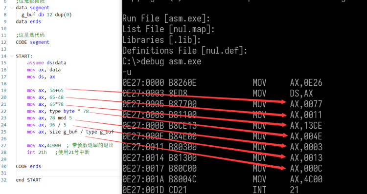
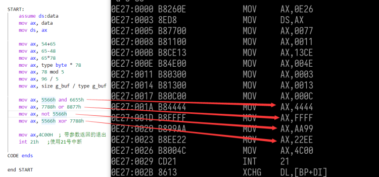
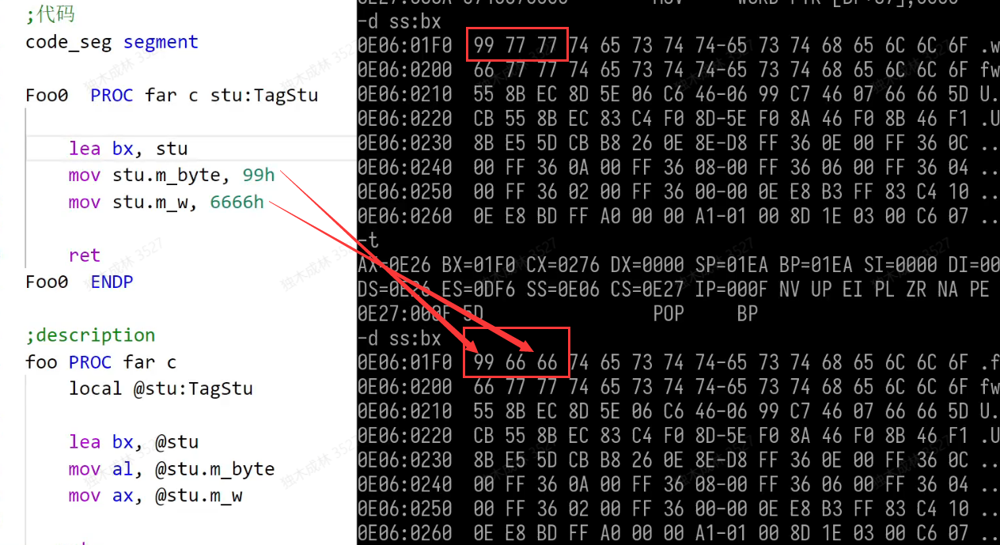
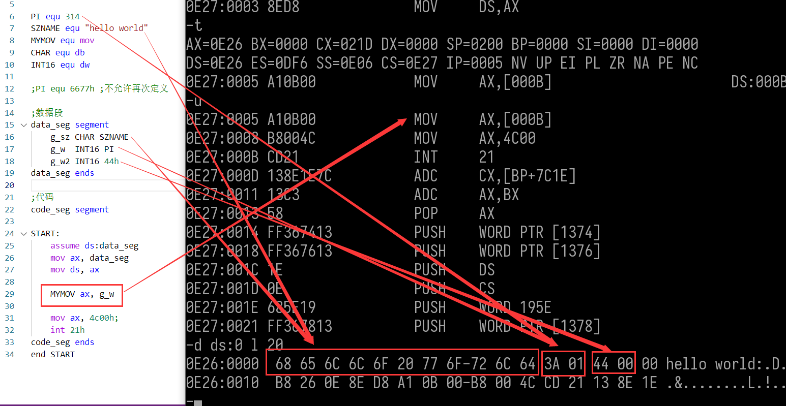
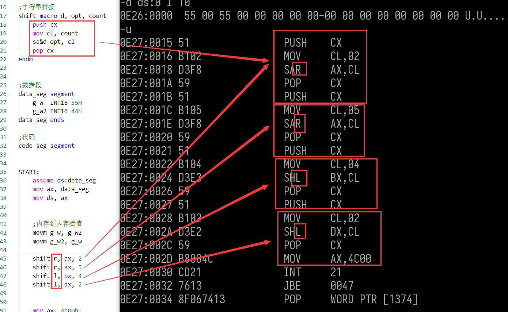
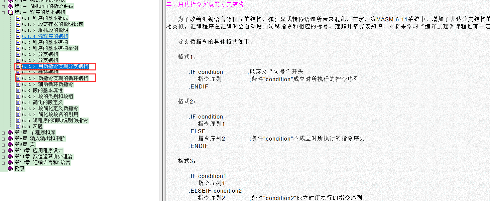

宏汇编在文件中是当做关键字的,但是在bug中运行时并没有这些指令,这些关键词被称为伪指令,cpu并不认识他们,需要经过编译器转化成 cpu认识的代码,但是他多我们写代码帮助又很大

 表达式 

表达式中的求值是在程序链接时完成的，所以表达式中的各值必须是在汇编或链接期就能确定，也就是 说不能将寄存器或者变量运⽤于表达式。

 算术表达式 

| 运算符 | 意义 | 例⼦          |
| ------ | ---- | ------------- |
| +      | 加   | 65 + 32       |
| -      | 减   | size val - 54 |
| *      | 乘   | 23h * 65h     |
| /      | 除   | 98 / 45       |
| mod    | 取模 | 99 mod 65     |

```
mov ax, 54+65
mov ax, 65-48
mov ax, 65*78
mov ax, type byte * 78
mov ax, 78 mod 5
mov ax, 96 / 5
mov ax, size g_buf / type g_buf

;mov ax,bx+7   ;这个是错的,因为编译器无法得到结果,不知道bx的值
```




 逻辑运算符 

逻辑运算即位运算，逻辑运算符与对应的指令助记符单词是相同的，当它们出现在操作码部分时是指 令，出现在操作数时是逻辑运算符 

| 运算符 | 意义     |
| ------ | -------- |
| and    | 位与     |
| or     | 位或     |
| not    | 按位取反 |
| xor    | 异或     |

```
mov ax, 5566h and 6655h
mov ax, 7788h or 8877h
mov ax, not 5566h
mov ax, 5566h xor 7788h
```




 关系运算符 

关系运算符的结果，如果结果为真，则所有位都置为1，即FFFF；否则所有位都置为0，即 .

| 运算符 | 英⽂                  | 意义         |
| ------ | --------------------- | ------------ |
| EQ     | equal                 | 等于	==   |
| NE     | not equal             | 不等于	!= |
| GT     | greater than          | ⼤于	>    |
| LT     | less than             | ⼩于	<    |
| GE     | greater than or equal | ⼤于等于 >=  |
| LE     | less than or equal    | ⼩于等于 <=  |

```
mov bx,88 eq 88    ;bx= 0FFFFh   因为结果为ture
 mov bx,88 ne 88    ;bx= 0000h    因为结果为flase
 mov bx,88 ge 88    ;bx= 0FFFFh   因为结果为ture
```


### 标号

#### 匿名标号  @@

-   @@是匿名标号
-   @b 向上查找最近的@@， b是back
-   @f  向下查找最近的@@ ，f是front

一般我们用 jmp 跳转你需要有标号,而且标号名必须唯一 ,但是如果 标号名是   @@ ,那么就可以重复,跳转用  @b 或  @f  , @@  的 跳转距离在段内是 没有限制的


#### 调整偏移量指令  ORG

格式 ORG 偏移值

此指令后的下⼀个变量或指令从 偏移值 开始存放,即把一个变量或者指令放在指定的偏移内,可以提前,也可以延后

```
;这是栈段
stack segment stack
  db 512 dup(0)
stack  ends

;这是数据段
data segment
  g_buf db "hello world"

  org  20 
  g_buf1 db "hello world"  ;表示 g_buf1 会从段偏移20的地方开始存放

  org  0    
  g_buf2 db "111111"     ;表示 g_buf2 会从段偏移0的地方开始存放,回覆盖 g_buf的数据

data ends

;这里是代码
CODE segment

START:
    assume ds:data
    mov ax, data
    mov ds, ax
    
    
    org 20h
    mov ax,4C00H  ; 带参数返回的退出   ;此处代码从20H 处开始存放,后面指令依次后推
    int 21h   ;使用21号中断
     
CODE ends

end START
```


#### 当前地址指令$

-   $伪指令代表当前指令或变量的地址
-   常⽤于计算缓冲区⻓度和获取当前ip值
-   可与 ORG 配合使⽤

 ```
 data_seg segment
   g_buf dw 10h dup(0)
   g_len dw $ - offset g_buf  ;获取上⾯的g_buf的⻓度
   org $ + 10h                ;下⼀个变量从当前地址+10h的偏移开始存放
   g_w dw 65h
       
 data_seg ends
 
 CODE segment
 
 START:
 
  org 100h
  mov ax, 5566h and 6655h ;此指令从代码段偏移100h开始存放
  mov ax, $ ;获取 本条指令的地址
  mov ax, $+4;获取 本条指令的地址+4
  mov ax, 4c00h
  int 21h
      
 CODE ends
 ```

### 结构体   struc

#### 格式

结构体名 struc

​             ;这⾥定义结构体成员

结构体名 ends


结构体使⽤<>来初始化

结构体可以通过变量名和寄存器来访问成员

结构体可以在定义时候初始化,也可以在后面初始化

结构作为局部变量无法赋初值

```
;定义结构体
Point struc
    m_wX dw 0
    m_wY dw 0
Point ends

;关键字  struc,可以在定义时候赋初值
TagStu struc
    m_byte db 0
    m_w    dw 5656h
    m_ary  db 8 dup(0)
    m_sz   db "hello"
    m_pt   Point <>      ;结构体里面嵌套结构体
TagStu ends

;堆栈
stack_seg segment stack
    db 512 dup(0)
stack_seg ends

;数据段
data_seg segment
    g_stu TagStu <66h, 7777h, "testtest", "66", <11h, 22h>>   ;初始化结构体
    g_ary Point 12 dup(<11h, 22h>)                            ;定义结构体数组
data_seg ends

;代码
code_seg segment

;结构体传参,直接传对象，它会将结构提对象入栈，每次入栈2字节（推荐用指针）
Foo0  PROC far c stu:TagStu
    lea bx, stu

    mov stu.m_byte, 99h     ;修改结构体成员的值
    mov stu.m_w, 6666h      ;修改结构体成员的值

    ret    
Foo0  ENDP

;结构体传参,传对象指针,通过指针访问必须借助寄存器,不能直接用指针
Foo1 PROC far c pStu:ptr TagStu

    ;mov ax, [pStu]m_w   ;指针，不能直接点使用,必须通过寄存器
    
    mov bx, pStu         ;将结构体指针赋值给bx

    ;通过结构体指针访问结构体成员
    assume bx:ptr TagStu     ;将bx解释为 TagStu 结构体指针，类似强转
    mov ax, [bx].m_w         ;通过结构体指针访问成员 
    assume bx:nothing        ;将bx 的 解释方式转回默认 

    ret    
Foo1 ENDP

;结构体作为局部变量,局部变量无法赋初值
foo PROC far c 
    local @stu:TagStu   ;变量类型直接是结构体类型

    lea bx, @stu         ;获取变量的偏移地址
    mov al, @stu.m_byte  ;访问变量成员
    mov ax, @stu.m_w     ;访问变量成员

   ret 
foo ENDP

START:
    assume ds:data_seg
    mov ax, data_seg
    mov ds, ax

    mov ax, g_stu.m_pt.m_wX   ;访问结构体内 结构体的的成员

    invoke Foo1, offset g_stu  ;结构体指针作为函数参数 

    invoke Foo0, g_stu         ;结构体对象作为函数参数
 
    invoke foo                 ;结构体作为局部变量

    mov al, g_stu.m_byte      ;访问结构体成员 
    mov ax, g_stu.m_w         ;访问结构体成员
    lea bx, g_stu.m_ary       ;获取结构体成员的偏移地址
    mov byte ptr [bx], 'a'    ;修改结构体成员的值

    mov ax, 4c00h;
    int 21h
code_seg ends
end START
```




### 宏

#### equ语句

作用：用来定义宏


 不可以重命名

 可⽤于常量和表达式

 可⽤于字符串

 可⽤于指令名，给指令取别名

 可⽤于类型，给类型取别名

 可⽤于操作数

```
;是无参宏，没有参数

;堆栈
stack_seg segment stack
    db 512 dup(0)
stack_seg ends

PI equ 314                  ;常量
SZNAME equ "hello world"    ;字符串
MYMOV equ mov               ;指令名
CHAR equ db                 ;类型
INT16 equ dw                ;类型

;PI equ 6677h ;不允许再次定义

;数据段
data_seg segment
    g_sz CHAR SZNAME
    g_w  INT16 PI
    g_w2 INT16 44h
data_seg ends

;代码
code_seg segment

START:
    assume ds:data_seg
    mov ax, data_seg
    mov ds, ax

    MYMOV ax, g_w

    mov ax, 4c00h;
    int 21h
code_seg ends
end START
```




#### =语句

   可以被修改

  只能⽤于常数

```
COUNT2 = 100h   ;后跟数值
COUNT2 = 200h   ;可以再次赋值

;szTest = "hello world"  ;错误,不能用于字符串,只能用于立即数(常量)

mov ax, COUNT2


;可以用来提高可读性

MYFUNC:
nX = 2
nY = 4
    push bp
    mov bp, sp
    sub sp, 10

    mov [bp-nX], ax
    mov [bp-nY], ax

    mov sp, bp
    pop bp
    ret
```

#### macro语句

######    格式

宏名 macro [参数1][,参数2]...

​       宏体

endm


宏会在使⽤的地⽅展开

宏可以带参数

字符串拼接使⽤&

```
;堆栈
stack_seg segment stack
    db 512 dup(0)
stack_seg ends


CHAR equ db 
INT16 equ dw

;内存到内存赋值宏
movm macro val1, val2
    push val1
    pop val2
endm

;字符串拼接
shift macro d, opt, count
    push cx
    mov cl, count
    sa&d opt, cl
    pop cx
endm


;数据段
data_seg segment
    g_w  INT16 55H
    g_w2 INT16 44h
data_seg ends

;代码
code_seg segment


START:
    assume ds:data_seg
    mov ax, data_seg
    mov ds, ax

    
    ;内存到内存赋值
    movm g_w, g_w2
    movm g_w2, g_w

    shift r, ax, 2
    shift r, ax, 5
    shift l, bx, 4
    shift l, dx, 2


    mov ax, 4c00h;
    int 21h
code_seg ends

end START
```




### 多文件编译

#### 1.源文件

-   源文件后缀名为asm
-   每个源文件末尾需要有end

#### 2.头文件

-   汇编头文件后缀名为inc

-   头文件包含  include xxx.inc

-   头文件防重复包含

    ```
    ifndef SECOND_1
    SECOND_1 equ 1
    	Func1 proto far stdcall arg1 : word, arg2 : word
        extern g_dw : word
    endif
    ```

    

#### 3.函数使用

函数在源文件定义，在头文件中声明即可。

#### 4.全局变量

全局变量在定义文件中必须使用public指明此变量为全局public变量名

全局变量在使用文件中必须使用extern 指明此变量来自外部文件 extern 变量:类型

```
ifndef HEADER_INC    ;防止重复包含
HEADER_INC equ 1

   extern g_w:word  ;声明明 g_w 是来自外部的全局变量

endif
```

```
public g_w    ;指名 g_w 是全局变量 ,不然默认本文件内才能使用(文件作用域)

data_seg segment
    g_w dw 0
data_seg ends

end
```

#### 5.编译

```
ml /c xx.asm yy.asm
link xx.obj yy.obj
或
ml *.asm
```

### 伪指定实现分支,循环



#### 分支

格式

格式1：

.IF condition　　　　;以英文“句号”开头  　 ;条件"condition"成立时所执行的指令序列

　 指令序列　　　

.ENDIF


格式2：

.IF condition    　;条件"condition"不成立时所执行的指令序列

　 指令序列1

.ELSE

　 指令序列2　　　

.ENDIF


格式3：

.IF condition1

　 指令序列1

.ELSEIF condition2      ;条件"condition2"成立时所执行的指令序列

　 指令序列2　　　　

.ENDIF


其中：条件表达式“condition”的书写方式与C语言中条件表达式的书写方式相似，也可用括号来组成复杂的条件表达式。


条件表达式中可用的操作符有：==(等于)、!=(不等)、>(大于)、>=(大于等于)、<(小于)、<=(小于等于)、&(位操作与)、!(逻辑非)、&&(逻辑与)、||(逻辑或)等。

```
;堆栈
stack_seg segment stack
    db 512 dup(0)
stack_seg ends

;数据段
data_seg segment

data_seg ends

;代码
code_seg segment

START:
    assume ds:data_seg
    mov ax, data_seg
    mov ds, ax

    mov g_w, 8

    .if ax >= bx
        xor ax, ax
    .elseif ax <= bx
        xor bx, bx
    .else 
        xor cx, cx
    .endif

    mov ax, 4c00h;
    int 21h
code_seg ends

end START
```

1、WHILE型循环伪指令

.WHILE  condition    ;条件"condition”成立时所执行的指令序列
　　循环体的指令序列　　　　
.ENDW

其中：.ENDW与前面的.WHILE相匹配，它标志着其循环体到此结束。

如果条件表达式“condition”在循环开始时，就为“假”(false)，那么，该循环体一次也不会被执行。

2、REPEAT型循环伪指令

 .REPEAT
　 循环体的指令序列
.UNTIL condition  .REPEAT
　 循环体的指令序列
.UNTILCXZ [condition] 

REPEAT型循环在执行完循环体后，才判定逻辑表达式condition的值。若该表达式的值为真，则终止该循环，并将执行伪指令.UNTIL[CXZ]后面的指令，否则，将向上跳转到伪指令.REPEAT之后的指令，为继续执行其循环体作准备


 循环终止 break 和继续 continue 


(1)、终止循环伪指令
.BREAK

.BREAK  .IF condition

该伪指令用来终止包含它的最内层循环。前者是无条件终止循环，后者是仅当逻辑表达式condition为真时，才终止循环。
 .WHILE  1 .REPEAT 
         …
 .BREAK .IF condition
…
 …
.BREAK .IF condition
…

ENDW .UNTIL　0 

对于以上二个循环，如果没有指令来终止循环的话，它们都将进入死循环状态，但如果在该层循环体内，存在伪指令“.BREAK .IF condition”的话，那么，当逻辑表达式condition为真时，该循环就会被终止了。

(2)、循环继续伪指令

.CONTINUE
.CONTINUE　.IF condition

