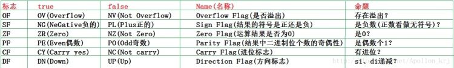

**寄存器**

### 8086CPU有14个寄存器 

它们的名称为：

**AX、BX、CX、DX、****SI、DI、SP、BP****、** **IP****、****CS、DS、ES****、****SS、****PSW****。**

8086CPU所有的寄存器都是16位的，可以存放两个字节。

AX、BX、CX、DX 通常用来存放一般性数据被称为通用寄存器。

8086上一代CPU中的寄存器都是8位的；

为保证兼容性，这四个寄存器都可以分为两个独立的8位寄存器使用。

H 高位 （8-15） L低位 （0-7）

AX可以分为AH和AL；

BX可以分为BH和BL；

CX可以分为CH和CL；

DX可以分为DH和DL；

#### 1.通用寄存器（AX,BX,CX,DX）

这四个寄存器可以拆分为：高位和低位两部分，当做两个八位寄存器来使用

AX：临时存储，参与乘除法的运算

BX：存储偏移地址来访问内存地址空间

CX：条件转移指令的条件 或 循环语句的判断条件

DX：辅助AX,作临时存储，参与乘除法的运算

#### 2.段寄存器（CS,DS,SS,ES）

8086CPU不支持将数据直接送入段寄存器的操作

CS：代码段寄存器，存储指令的段地址

DS：数据段寄存器，通常用来存放要访问数据的段地址

SS：栈段寄存器，存储栈的段地址

ES：附加段寄存器

IP：指令指针寄存器，用来存储当前指令的偏移地址

CS:IP 指向当前要执行的指令

SP：存放栈的偏移地址

SS:SP 就是指向当前栈的栈顶元素

SI 和 DI 是8086CPU 中和 bx 功能相近的寄存器，si 和 di 不能分成两个 8 位寄存器来使用，用来存储偏移地址

在 8086CPU 中，只有（bx,si,di,bp）这4寄存器可以进行内存单元的寻址

BP：当没有显性的给出段地址，而使用 bp 时，段地址默认在 ss 中

其他没有显性的给出段地址的，均默认在 ds 中

#### 3.标志寄存器

PSW 三个作用：

(1). 用来存储相关指令的某些执行结果；

(2). 用来为CPU执行相关指令提供行为依据；

(3). 用来控制CPU的相关工作方式；

8086 有14个16位寄存器，这14个寄存器按其用途可分为(1)通用寄存器、(2)指令指针、(3)标志寄存器和(4)段寄存器等4类。

1.通用寄存器有8个, 又可以分成2组,一组是数据寄存器(4个),另一组是指针寄存器及变址寄存器(4个).

数据寄存器分为:

AH&AL＝AX(accumulator)：累加寄存器，常用于运算;在乘除等指令中指定用来存放操作数,另外,所有的I/O指令都使用这一寄存器与外界设备传送数据.

BH&BL＝BX(base)：基址寄存器，常用于地址索引；

CH&CL＝CX(count)：计数寄存器，常用于计数；常用于保存计算值,如在移位指令,循环(loop)和串处理指令中用作隐含的计数器.

DH&DL＝DX(data)：数据寄存器，常用于数据传递。

他们的特点是,这4个16位的寄存器可以分为高8位: AH, BH, CH, DH.以及低八位：AL,BL,CL,DL。这2组8位寄存器可以分别寻址，并单独使用。

另一组是指针寄存器和变址寄存器，包括：

SP（Stack Pointer）：堆栈指针，与SS配合使用，可指向目前的堆栈位置；

BP（Base Pointer）：基址指针寄存器，可用作SS的一个相对基址位置；

SI（Source Index）：源变址寄存器可用来存放相对于DS段之源变址指针；

DI（Destination Index）：目的变址寄存器，可用来存放相对于 ES 段之目的变址指针。

这4个16位寄存器只能按16位进行存取操作，主要用来形成操作数的地址，用于堆栈操作和变址运算中计算操作数的有效地址。

2.指令指针IP(Instruction Pointer)

指令指针IP是一个16位专用寄存器，它指向当前需要取出的指令字节，当BIU从内存中取出一个指令字节后，IP就自动加1，指向下一个指令字节。注意，IP指向的是指令地址的段内地址偏移量，又称偏移地址(Offset Address)或有效地址(EA，Effective Address)。

3.标志寄存器FR(Flag Register)

8086有一个18位的标志寄存器FR，在FR中有意义的有9位，其中6位是状态位，3位是控制位。

**OF**： 溢出标志位OF用于反映有符号数加减运算所得结果是否溢出。如果运算结果超过当前运算位数所能表示的范围，则称为溢出，OF的值被置为1，否则，OF的值被清为0。

**DF**：方向标志DF位用来决定在串操作指令执行时有关指针寄存器发生调整的方向。 

**IF**：中断允许标志IF位用来决定CPU是否响应CPU外部的可屏蔽中断发出的中断请求。但不管该标志为何值，CPU都必须响应CPU外部的不可屏蔽中断所发出的中断请求，以及CPU内部产生的中断请求。具体规定如下： 

(1)、当IF=1时，CPU可以响应CPU外部的可屏蔽中断发出的中断请求； 

(2)、当IF=0时，CPU不响应CPU外部的可屏蔽中断发出的中断请求。 

**TF**：跟踪标志TF。该标志可用于程序调试。TF标志没有专门的指令来设置或清楚。

（1）如果TF=1，则CPU处于单步执行指令的工作方式，此时每执行完一条指令，就显示CPU内各个寄存器的当前值及CPU将要执行的下一条指令。

（2）如果TF=0，则处于连续工作模式。

**SF**：符号标志SF用来反映运算结果的符号位，它与运算结果的最高位相同。在微机系统中，有符号数采用补码表示法，所以，SF也就反映运算结果的正负号。运算结果为正数时，SF的值为0，否则其值为1。 

**ZF**： 零标志ZF用来反映运算结果是否为0。如果运算结果为0，则其值为1，否则其值为0。在判断运算结果是否为0时，可使用此标志位。 

**AF**：下列情况下，辅助进位标志AF的值被置为1，否则其值为0： 

(1)、在字操作时，发生低字节向高字节进位或借位时； 

(2)、在字节操作时，发生低4位向高4位进位或借位时。 

**PF**：奇偶标志PF用于反映运算结果中“1”的个数的奇偶性。如果“1”的个数为偶数，则PF的值为1，否则其值为0。 

**CF**：进位标志CF主要用来反映运算是否产生进位或借位。如果运算结果的最高位产生了一个进位或借位，那么，其值为1，否则其值为0。) 

#### 4.段寄存器(Segment Register)

为了运用所有的内存空间，8086设定了四个段寄存器，专门用来保存段地址：

CS（Code Segment）：代码段寄存器；

DS（Data Segment）：数据段寄存器；

SS（Stack Segment）：堆栈段寄存器；

ES（Extra Segment）：附加段寄存器。

# 寄存器汇总

  

### 通用寄存器

 数据寄存器

| 寄存器 | 描述              | 说明                                                         |
| ------ | ----------------- | ------------------------------------------------------------ |
| EAX    | 累加器Accumulator | 扩展累加寄存器（在乘/除法中被自动调用）Accumulator常用作函数的返回值 |
| EBX    | 基址Base          | 基址寄存器，DS 段中的数据指针。                              |
| ECX    | 计数Count         | 常用作 循环计数器，在字符串和循环操作中常用，在循环指令（LOOP）或串操作中，ECX 用来进行循环计数，每执行一次循环，ECX 都会被CPU 自动减一。thiscall 用来保存this指针传参 |
| EDX    | 数据Data          | 常用作  是数据寄存器，用来存放8字长的高32位                  |

指针寄存器

| 寄存器 | 描述                                | 说明                                                         |
| ---- | ----------------------------------- | ------------------------------------------------------------ |
| ESP  | 堆栈指针寄存器 Extend Stack Pointer | SS 段中堆栈指针，专用指向堆栈 栈顶指针，ESP 用来寻址堆栈上的数据 |
| EBP  | 基址指针寄存器Extend Base Pointer   | SS 段中堆栈内数据指针，指向最上面一个栈帧的栈顶的底部，表示数据在堆栈段中的基地址 |

变址寄存器

| 寄存器 | 描述                             | 说明                                                         |
| ------ | -------------------------------- | ------------------------------------------------------------ |
| ESI    | 源变址 Extend Source             | 扩展源指针（由高速内存数据传送指令使用），字符串操作源指针   |
| EDI    | 目的变址Extend Destination Index | 扩展目的指针（由高速内存数据传送指令使用），字符串操作目标指针 |

### 指令指针寄存器

EIP 指令寄存器EIP是对8086/80286指令指针寄存器的32位扩展，它包含着待执行指令的32位偏移量，该值总是相对CS所代表的段基址而言的。指令指针（总是指向下一条要执行的指令地址），不做他用；计算机通过CS：IP寄存器来控制指令序列的执行流程；IP寄存器是一个专用寄存器，不能直接赋值修改；IP 它与代码段寄存器 CS联用，永远存储着即将执行的指令的地址，每执行完一条指令，CPU都会根据CS:IP找到下一条指令，同时IP被赋值为再下一条指令的地址

### 标志寄存器

标志状态

| 寄存器 | 描述                             | 说明                                                         |
| ------ | -------------------------------- | ------------------------------------------------------------ |
| OF     | 溢出标志Overflow Flag            | 当我们讨论溢出时，讨论的是有符号数；若算数运算的结果有溢出，则OF置1主要针对有符号：以8位数为例，8位的范围是（-128~+127）如果运算结果超出这个范围，就产生了溢出，有溢出，说明有符号数 的运算结果不正确。 |
| CF     | 进位标志Carry Flag               | 当我们讨论进位时，讨论的是无符号数；当运算结果的最高有效位有进位（加法）或借位（减法）是，进位标志位置1；主要针对无符号(无符号位)：8位计算 进位作为临时第九位使用；8位存不下，就进位 |
| ZF     | 零标志Zero Flag                  | ZF=1：运算结果为0ZF=0：运算结果不为0                         |
| SF     | 符号标志Sign Flag                | 运算结果最高位为1，则SF=1,否则SF=0有符号数据用最高位表示符号，所以最高有效位就是符号标志的状态 |
| AF     | 辅助进位标志Auxiliary Carry Flag | 运算时低半字节由进位或借位时，AF=1                           |
| PF     | 奇偶标志Parity Flag              | 当运算结果最低8位中1的个数是偶数或0时 PF=1                   |

控制标志

| 寄存器 | 描述                          | 说明                                                         |
| ------ | ----------------------------- | ------------------------------------------------------------ |
| IF     | 中断标志Interrupt-enable Flag | 用于控制i外部可屏蔽中断是否可以被处理器响应IF=1  允许中断；IF=0 禁止中断 |
| TF     | 陷阱标志Trap Flag             | TF=1：用于调试单步操作   TF=0：处理正常工作                  |
| DF     | 方向标志Direction Flag        | 1.用于串操作指令，控制地址ide变化方向；CLD  Clear Direction 用于复位方向标志  执行后 DF=1 |

### 段寄存器

 

| 寄存器 | 描述                | 说明                                                         |
| ------ | ------------------- | ------------------------------------------------------------ |
| CS     | 代码段Code Segment  | 存放当前正在运行的程序代码所在段的段基址，表示当前使用的指令代码可以从该段寄存器指定的存储器段中取得，相应的偏移量则由IP提供。 |
| SS     | 堆栈段Stack Segment | 指出当前堆栈的底部地址，即存放堆栈段的段基址。               |
| DS     | 数据段Data Segment  | 指明数据段的起始地址                                         |
| ES     | 附加段Extra Segment | 指出当前程序使用附加数据段的段基址，该段是串操作指令中目的串所在的段。 |
| FS     | 辅助段80386 新增    | FS寄存器指向当前活动线程的TEB结构FS:[0x30] 指向PEB结构相关资料：https://bbs.pediy.com/thread-159935.htm |
| GS     | 辅助段80386 新增    |                                                              |

### 系统表寄存器

| 寄存器 | 描述                                                  | 说明                                                         |
| ------ | ----------------------------------------------------- | ------------------------------------------------------------ |
| GDTR   | 全局描述符表寄存器Global Descriptor Table Register    | 保存GDT的地址，在Windbg 可“r gdtr”查看GDT的地址              |
| LDTR   | 局部描述符表寄存器Local Descriptor Table Register     | 保存LDT的地址                                                |
| IDTR   | 中断描述符表寄存器Interrupt Descriptor Table Register | 保存IDT的地址 在Windbg 可“r idtr”查看GDT的地址               |
| TR     | 任务状态寄存器Task-State Register                     | TSS 资料：https://blog.csdn.net/chen1540524015/article/details/74075252 |

### 控制寄存器

| 寄存器 | 说明                                                         |
| ------ | ------------------------------------------------------------ |
| CR0    | CR0中各位含义如下：**PE（Protection Enable）保护模式允许，PE=0表示CPU工作在实模式，PE=1表示CPU工作在保护模式**MP（Monitor Coprocessor）监控协处理器，MP=1表示协处理器在工作，MP=0表示协处理器未工作。EM（Emulation）协处理器仿真，当MP=0，EM=1时，表示正在使用软件仿真协处理器工作。TS（Task Switched）任务转换，每当进行任务转换时，TS=1，任务转换完毕，TS=0。TS=1时不允许协处理器工作。 以上 4个定义从80286开始，下面的2个定义从80386开始存在ET（Extension Type）处理器扩展类型，反映了所扩展的协处理器的类型，ET=0为80287，ET=1为80387。**PG（Paging）页式管理机制使能，PG=1时页式管理机制工作，否则不工作。**从80486开始又增加了如下位定义。NE（Numeric Error）数值异常中断控制，NE=1时，如果运行协处理器指令发生故障，则用异常中断处理，NE=0时，则用外部中断处理。WP（Write Protect）写保护，当WP=1时，对只读页面进行写操作会产生页故障。AM（Alignment Mask）对齐标志，AM=1时，允许对齐检查，AM=0时不允许，关于对齐，在EFLAGS的AC标志时介绍过，在80486以后的CPU中，CPU进行对齐检查需要满足三个条件，AC=1、AM=1并且当前特权级为3。NW（Not Write-through）和CD（Cache Disable），这两个标志都是用来控制CPU内部的CACHE的，当NW=0且CD=0时，CACHE使能，其它的组合说起来比较复杂，如果有读者真的想搞清楚的话，可以参阅《Intel? 64 and IA-32 Architectures》中的“Software Developer’s Manual Volume 3A”这一册，在第10章对这两个标志的各种组合有比较详细的说明。 |
| CR1    | 保留                                                         |
| CR2    | CR2存放引起**缺页异常的线性地址**，只有在PG=1时，CR2才有效，当页故障处理程序被激活时，压入页故障处理程序堆栈中的错误码提供页故障的状态信息。 |
| CR3    | 保存 页目录表的基址（**DirBase**）                           |
| CR4    | CR4是从Pentium CPU开始出现的。 VME（Virtual-8086 Mode Extensions）虚拟8086方式扩展，VME=1允许使用虚拟8086扩展模式，否则只能使用80386/80486的虚拟8086模式。PVI（Protected-Mode Virtual Interrupts）保护模式虚拟中断，PVI=1时，在保护模式下支持虚拟中断标志VIF(EFLAGS中)，PVI=0则不支持虚拟中断标志。TSD（Time Stamp Disable）时间戳禁止，TSD=1时，允许在特权级为0的程序中执行RDTSC指令（读时间戳计数指令），TSD=0时，允许任何特权级执行RDTSC指令。DE（Debugging Extensions）调试扩展，PSE（Page Size Extensions）页大小扩展，PSE=1时，页大小可以扩展到2M或4M，PSE=0时，页大小只能是4K.PAE（Physical Address Extension）物理地址扩展，PAE=1时，页物理地址可以扩展到36bits以上，PAE=0时只能用32bits的物理地址。MCE（Machine-Check Enable）硬件检查使能，Pentium以后的CPU有一种硬件检测功能，MCE=1时允许使用该功能。PGE（Page Global Enable）全局页使能，PGE=1时，允许使用全局页，PGE=0时禁止使用全局页。PCE（Performance-Monitoring Counter Enable）性能监视计数器使能，当PCE=1时，允许在任何保护级下执行RDPMC指令，PCE=0时，只有特权级0的程序可以执行RDPMC指令。OSFXSR（Operating System Support for FXSAVE and FXRSTOR instructions）OSXMMEXCPT（Operating System Support for Unmasked SIMD Floating-Point Exceptions）VMXE（VMX-Enable Bit）VMX使能位，VMXE=1时，允许VMX操作。SMXE（SMX-Enable Bit）SMX使能位，SMXE=1时，允许SMX操作。OSXSAVE（XSAVE and Processor Extended States-Enable Bit） |

### 调试寄存器

| 寄存器  | 说明                                                    |
| ------- | ------------------------------------------------------- |
| DR0~DR3 | 分别设置4个硬件断点的线性地址                           |
| DR4~DR5 | 保留                                                    |
| DR6     | 断点状态寄存器                                          |
| DR7     | 断点控制寄存器（包括断点类型、断点长度，断点开放/禁止） |

### 测试寄存器

| 寄存器  | 说明           |
| ------- | -------------- |
| TR0~TR2 | 保留           |
| TR3~TR5 | 用作CACHE测试  |
| TR6     | 命令测试寄存器 |
| TR7     | 测试数据寄存器 |

### 特殊模块寄存器 **MSR**

|                                                      |                   | 说明                                                         |
| ---------------------------------------------------- | ----------------- | ------------------------------------------------------------ |
| 特殊执行的支持                                       | WRMSR  特权写命令 | ecx存放序号，执行完后数据放置在eax中                         |
| 处理器特性和处理器模式支持                           | RDMER特权读命令   | eax存放数据，ecx存放序号，执行后eax 写入到相应寄存器         |
| 功耗与温控管理、机器检查、调试扩展支持、性能监视计数 |                   | MSR寄存器的雏形开始于Intel 80386和80486处理器，到Intel Pentium处理器的时候，Intel就正式引入RDMSR和WRMSR两个指令用于读和写MSR寄存器，每个MSR寄存器都会有一个相应的ID，即MSR Index，或者也叫作MSR寄存器地址，当执行RDMSR或者WRMSR指令的时候，只要提供MSR Index就能让CPU知道目标MSR寄存器。这些MSR寄存器的编号（MSR Index）、名字及其各个数据区域的定义可以在Intel x86架构手册”Intel 64 and IA-32 Architectures Software Developer's Manual"的Volume 4中找到。 |
