### 环境配置

#### masm32下载

​       官网：http://www.masm32.com/

#### 安装

  

成功标志


#### 环境配置：

-   -   将masm32下的bin目录添加到path
    -   新建include，将masm32目录下的inclcude目录添加进去
    -   新建lib，将masm32目录下的lib目录添加进去

  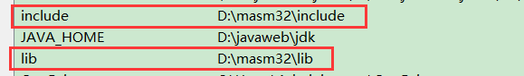

#####     测试代码

```
.386
.model flat, stdcall
option casemap:none

include windows.inc
include user32.inc

includelib user32.lib
 
.data
g_sz db "hello world", 0
.code
START:
invoke MessageBoxA, NULL, offset g_sz, NULL, MB_OK
end START
```

编译链接后可以生成可执行文件就带配置成功

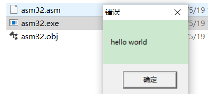

##### 编译链接：

###### 1. 编译

​          ml /c /coff %1.asm（coff--PE）

​         ml默认⽣成的⽂件格式是16位的，通过 /coff 32位程序的可执⾏⽂件格式来指定32位的格式

###### 2. 链接

​       link /subsystem:windows %1.obj

​       通过 /subsystem 来指定⼦系统， windows 是窗⼝程序， console 是控制台程序

##### 编译脚本 build.bat：

```
@echo off
set include=D:\masm32\include
set lib=D:\masm32\lib
set path=D:\masm32\bin;D:\OllyICE_1.10

del D:\OllyICE_1.10\udd\*.udd

ml /c /coff %1.asm
if errorlevel 1 goto err

link /subsystem:windows %1.obj
if errorlevel 1 goto err

OllyICE.exe %1.exe

:err
```

或者

```
ml /c /coff  %1.asm

link /subsystem:windows %1..obj

D:\OllyICE_1.10\OllyICE.exe %1.exe

pause
```

##### 代码在scode高亮


### 16位与32位汇编的区别

#### 1.源文件格式

-   **文件头固定三件套：**

-   ```
    .386					; 表示使用的是386的是指令集
    .model flat, stdcall	; 指明内存模型和调用约定
    option casemap:NONE		; 其它选项，和ml或link的命令选项等价，32位汇编一般只用casemap-NONE
    ```

    -   **msdn宏汇编官网：**https://docs.microsoft.com/en-us/cpp/assembler/masm/directives-reference?view=msvc-160

    -   -   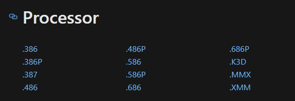

    -   -   -   8086和286都是16位的，从386开始是32位，后缀+P的指可以使用跳转指令的（适用于面向内核）。

    -   -   
        -   casemap 最好只设 NONE   设all可能导致部分头文件没法用
        -   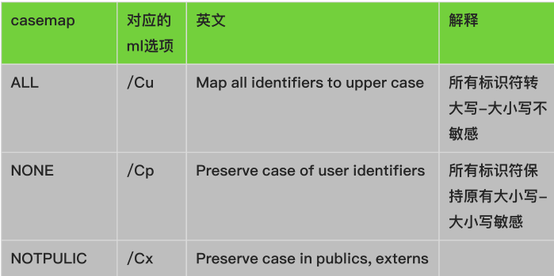

    -   **分段：**32位汇编取消 了分段，改用**内存属性**来划分，称作节(section)、内存区或内存块。

    -   -   编写时每种类型可以定义多个，编译期会自动被同类归置

    

```
.386					; 表示使用的是386的是指令集,最低版本,也可以用更高版本,常用386
.model flat, stdcall	; 指明内存模型和调用约定  只有c或者 stdcall
option casemap:NONE		; 其它选项，和ml或link的命令选项等价，32位汇编一般只用casemap-NONE

.data
    g_sz db "hello world", 0
.data
    g_sz0 db "hello world", 0

.data?
    g_sz dw ?

.const
    g_sz1 db "test test", 0

.code

START:
end START
```

#### 寄存器

##### 寄存器长度


32位 扩充了 8 个通用寄存器 和2个 ip 一次 flag 寄存器 ,  扩充成了32位,, 低16位仍然保留原来的名字, 高16位没有名字,要访问需要自己移位 , 段寄存器没有扩充且其功能发生了改变

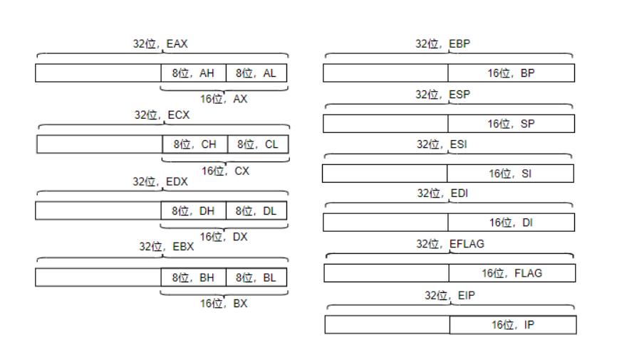

##### 寄存器组

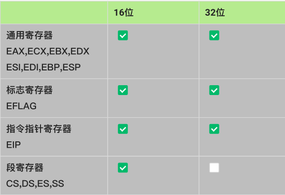

#### 调试

32位汇编调试⼀般使⽤OD或者x64dbg，前者可以到看雪下载，后者可以到官⽹下载，两者建议都下

载


##### OD(OllICE)  

目前只能调试32位程序

https://tool.pediy.com/      看雪官网

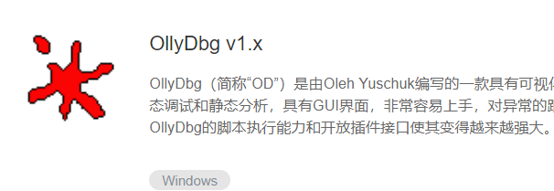


解压密码:  pediy.com

使用方式,

1.  把  exe 文件拖进去
2.  点击菜单

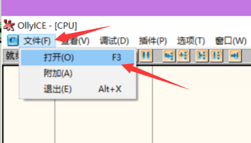 

1.  附近进程 :   调试正在运行的
2.  右键用  ollyice 打开

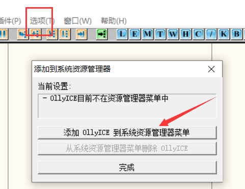

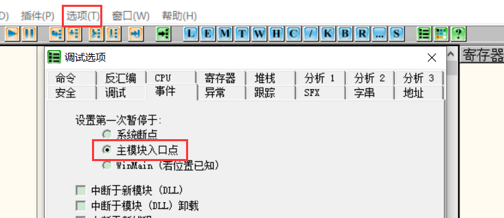


鼠标点击有时候高亮不准是因此你改动了代码,但是软件保存了上次的调试信息,删除即可


删除上次调试保存的信息

1.  删除该文件里面的文件 


1.  通过OD去删,删除要先退出调试,删完在重新调试,否则内存里仍然还有数据

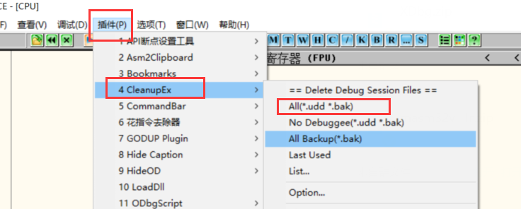


##### X32Debug

可以调试64位程序

官网: https://x64dbg.com/

x32dbg   调32位      x64dbg  调 64位

##### 调试快捷键

x32dbg 和 OD 的使用方式基本相同,包括快捷键


**F4：运行到光标处。**

**esp: 回到栈顶**

**+/-   查看 下一步/上一步  运行的代码**

**菜单  查看断点可以查看所有的断点**


#### 指令补充

串操作现在支持一次四个字节的操作(26位只支持最高2字节)

-   8086所有指令在32位保持原有功能不变，操作数长度扩充到32位。


movsx：高位补0，低位补1。

movzx：全部补0。


#### 寻址

-   相对于16位汇编，32位寻址的变化：

-   -   1.在基址寻址和基址变址寻址两种寻址操作上面更加宽松：

-   -   -   基址寄存器：通用寄存器都可用作基址寄存器；
        -   变址寄存器：除ESP外都可以用作变址寄存器。
        -   *当基址为EBP或ESP时，访问的是栈上的数据。

-   -   2.同时增加了比例因子寻址：变址寄存器 × 比例因子(1、2、4、8)，便于遍历不同长度的数组。

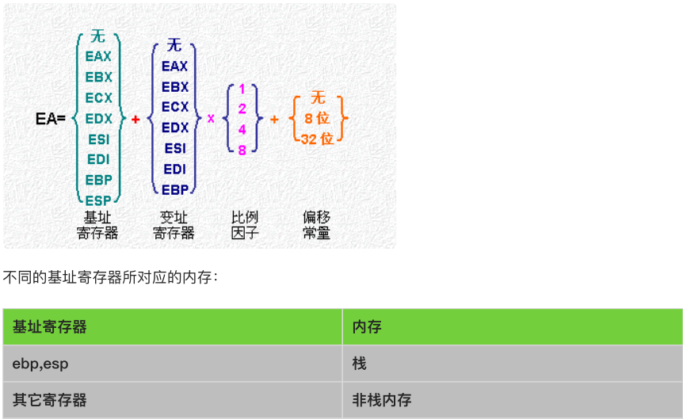

```
.386
.model flat, stdcall
option casemap:NONE

include windows.inc
include user32.inc
includelib user32.lib
.data
    g_szTitle db "hello world", 0 
.data
    g_sz db "hello world", 0 
    g_sz0 db "hello world", 0 
    g_ary dw 1111h,2222h,3333h,4444h,5555h
.data?
    g_dw dw ?
.const
    g_sz1 db "test test",0
.code

START:
    mov eax,offset g_ary
    xor ecx,ecx
    mov bx,[eax+ecx*type g_ary]
    inc ecx
    mov bx,[eax+ecx*type g_ary]
    inc ecx
    mov bx,[eax+ecx*type g_ary]
    inc ecx
    mov bx,[eax+ecx*type g_ary]

    mov eax,offset g_sz
    mov ebx,offset g_sz0
    mov edx,offset g_sz1
    mov ecx,offset g_dw
    mov byte ptr [eax],'a'

    mov esi,1
    mov byte ptr [eax+esi],'b'
    
    mov edx,offset g_sz1
    mov byte ptr [edx+esi+1],'c'

    ;invoke MessageBoxA, NULL, offset g_szTitle, NULL, MB_OK
end START
```

### 调用API，弹MessageBox代码示例

```
.386                  ; 表示使用的是386的是指令集
.model flat, stdcall  ; 指明内存模型和调用约定
option casemap:NONE   ; 其它选项，和ml或link的命令选项等价，32位汇编一般只用casemap-NONE

include windows.inc 
include user32.inc 
include kernel32.inc 


includelib user32.lib 
includelib kernel32.lib 

.data
    g_szText db "hello world", 0
    g_szTitle db "cr42 asm32", 0
    
.code
START:
    invoke MessageBoxA, NULL, offset g_szText, offset g_szTitle, MB_OK
    invoke ExitProcess, 0
end START
```

### 汇编版的第一个窗口

SDK 版弹窗

```
#include <windows.h>


void ShowErrMsg();
 

LRESULT CALLBACK CR42WindowProc(HWND hwnd,      // handle to window
  UINT uMsg,      // message identifier
  WPARAM wParam,  // first message parameter
  LPARAM lParam   // second message parameter
)
{
  switch (uMsg)
  {
  case WM_LBUTTONDOWN:
  {
    WORD wX = LOWORD(lParam);
    WORD xY = HIWORD(lParam);

    char szBuf[MAXBYTE] = {0};
    wsprintf(szBuf, "x:%d y:%d", wX, xY);
    MessageBox(hwnd, szBuf, NULL, MB_OK);

    return 0;
  }
  case WM_CLOSE:
  {
    int nRet = MessageBox(hwnd, "亲，是否要关闭窗口!", NULL, MB_OKCANCEL);
    if (nRet == IDOK)
    {
      DestroyWindow(hwnd);//销毁窗口
    }
    return 0;
  }
  case WM_DESTROY://窗口已经被销毁
    PostQuitMessage(0);
    return 0;
  }

  return DefWindowProc(hwnd, uMsg, wParam, lParam); //自己不想处理的消息，交给系统默认处理即可
}

int WINAPI WinMain(HINSTANCE hInstance,      // handle to current instance
  HINSTANCE hPrevInstance,  // handle to previous instance
  LPSTR lpCmdLine,          // command line
  int nCmdShow              // show state
)
{
  WNDCLASS wc;
  wc.style = CS_HREDRAW | CS_VREDRAW;//窗口风格
  wc.lpfnWndProc = CR42WindowProc;//函数
  wc.cbClsExtra = 0;//窗口类对象额外内存大小，一般不用
  wc.cbWndExtra = 0;//窗口实例对象额外内存大小，一般不用
  wc.hInstance = hInstance;//实例句柄
  wc.hIcon = NULL;//没有图标
  wc.hCursor = NULL;//没有光标
  wc.hbrBackground = (HBRUSH)(COLOR_ACTIVEBORDER + 1);//背景颜色
  wc.lpszMenuName = NULL;//没有菜单
  wc.lpszClassName = "cr42 class";//窗口类的类名
  ATOM nRet = RegisterClass(&wc);
  if (nRet == 0)
  {
    MessageBox(NULL, "注册窗口类失败！", NULL, MB_OK);
    return 0;
  }
  //wc.lpszClassName = "cr42 class2";//窗口类的类名
  //nRet = RegisterClass(&wc);
  //if (nRet == 0)
  //{
  //  ShowErrMsg();
  //}
  //DWORD dwErr = GetLastError();

  //创建窗口实例
  HWND hWnd = CreateWindow("cr42 class", //窗口类类名
    "我的第一个窗口",
    WS_OVERLAPPEDWINDOW,//重叠窗口
    CW_USEDEFAULT, CW_USEDEFAULT, CW_USEDEFAULT, CW_USEDEFAULT,//坐标和尺寸大小
    NULL,//父窗口，没有
    NULL,//菜单，没有
    hInstance,
    NULL);//参数，暂时不用
  if (hWnd == NULL)
  {
    ShowErrMsg();
    return 0;
  }

  //3 显示窗口
  ShowWindow(hWnd, SW_SHOW);//正常显示窗口

  //4. 更新窗口
  UpdateWindow(hWnd);

  // WM_MOUSEMOVE
  //WM_KEYDOWN

  //消息循环
  MSG msg;
  while (GetMessage(&msg, NULL, 0, 0))
  {
    //CR42WindowProc(msg.hwnd, msg.message, msg.wParam, msg.lParam);
    DispatchMessage(&msg);
  }

#if 0
  DWORD dw = CS_HREDRAW | CS_VREDRAW; //多种风格组合
  if (dw & CS_HREDRAW)//判断风格
  {
  }
  dw = dw & (~CS_HREDRAW); //取消风格

#endif // 位运算在SDK中广泛应用
  return 0;
}

void ShowErrMsg()
{
  LPVOID lpMsgBuf;
  FormatMessage(
    FORMAT_MESSAGE_ALLOCATE_BUFFER |
    FORMAT_MESSAGE_FROM_SYSTEM |
    FORMAT_MESSAGE_IGNORE_INSERTS,
    NULL,
    GetLastError(),
    MAKELANGID(LANG_NEUTRAL, SUBLANG_DEFAULT), // Default language
    (LPTSTR)&lpMsgBuf,
    0,
    NULL
  );
  // Process any inserts in lpMsgBuf.
  // ...
  // Display the string.
  MessageBox(NULL, (LPCTSTR)lpMsgBuf, "Error", MB_OK | MB_ICONINFORMATION);
  // Free the buffer.
  LocalFree(lpMsgBuf);
}

```

ASM32 版

查找变量定义 或者  函数的文件或库


```
.386                  ; 表示使用的是386的是指令集
.model flat, stdcall  ; 指明内存模型和调用约定
option casemap:NONE   ; 其它选项，和ml或link的命令选项等价，32位汇编一般只用casemap-NONE

include windows.inc 
include user32.inc 
include kernel32.inc 


includelib user32.lib 
includelib kernel32.lib 

.data
    g_szClassName db "cr42asm32Class", 0
    g_szTitle db "这个是我的第一个汇编窗口", 0
.code

; 过程函数
WindowProc PROC stdcall hWnd:HWND, uMsg:UINT, wParam:WPARAM, lParam:LPARAM

     .IF uMsg == WM_CLOSE
        invoke PostQuitMessage, 0    ;退出
    .ENDIF

    invoke DefWindowProc, hWnd, uMsg, wParam, lParam
    ret
WindowProc ENDP

;函数入口    
WinMain Proc hInstance:HINSTANCE
    local @wc:WNDCLASS     ;窗口类
    local @hWnd:HWND       ;窗口句柄
    local @msg:MSG         ;消息队列

    ;sdk注册窗口类
    ;WNDCLASS wc;
    ;wc.style = CS_HREDRAW | CS_VREDRAW;//窗口风格
    ;wc.lpfnWndProc = CR42WindowProc;   //函数
    ;wc.cbClsExtra = 0;      //窗口类对象额外内存大小，一般不用
    ;wc.cbWndExtra = 0;    //窗口实例对象额外内存大小，一般不用
    ;wc.hInstance = hInstance;  //实例句柄
    ;wc.hIcon = NULL;    //没有图标
    ;wc.hCursor = NULL;   //没有光标
    ;wc.hbrBackground = (HBRUSH)(COLOR_ACTIVEBORDER + 1);//背景颜色
    ;wc.lpszMenuName = NULL;//没有菜单
    ;wc.lpszClassName = "cr42 class";//窗口类的类名
    ;ATOM nRet = RegisterClass(&wc);
    ;if (nRet == 0)
    ;{
      ; return 0;
    ;}


    ; 注册窗口类
    mov @wc.style, CS_VREDRAW or CS_HREDRAW
    mov @wc.lpfnWndProc, offset WindowProc
    mov @wc.cbClsExtra,0 
    mov @wc.cbWndExtra, 0
    push hInstance
    pop @wc.hInstance
    ;设置图标
   
    invoke LoadIcon,NULL,IDI_APPLICATION
    mov @wc.hIcon,eax
    
    ;设置光标
    invoke LoadCursor,NULL,IDC_ARROW   
    mov @wc.hCursor,eax
    
    mov @wc.hbrBackground, COLOR_WINDOW+1
    mov @wc.lpszMenuName,NULL
    mov @wc.lpszClassName, offset g_szClassName 
    invoke RegisterClassA, addr @wc
    .IF eax == 0
        ret
    .ENDIF

    ; HWND hWnd = CreateWindow("cr42 class", //窗口类类名
    ; "我的第一个窗口",
    ; WS_OVERLAPPEDWINDOW,//重叠窗口
    ; CW_USEDEFAULT, CW_USEDEFAULT, CW_USEDEFAULT, CW_USEDEFAULT,//坐标和尺寸大小
    ; NULL,//父窗口，没有
    ; NULL,//菜单，没有
    ; hInstance,
    ; NULL);//参数，暂时不用
    ;if (hWnd == NULL)
    ;{
    ;  return 0;
    ;}

    ; 创建窗口示例   返回值  eax 窗口句柄
    invoke CreateWindowExA, 
        0, 
        offset g_szClassName, 
        offset g_szTitle, 
        WS_OVERLAPPEDWINDOW or WS_VISIBLE,
        CW_USEDEFAULT, CW_USEDEFAULT,CW_USEDEFAULT,CW_USEDEFAULT,
        NULL, NULL, hInstance, NULL
    .IF eax == NULL
        ret
    .ENDIF 
    mov  @hWnd,eax

    ;ShowWindow(hWnd, SW_SHOW);   ;显示窗口
    ;UpdateWindow(hWnd);          ;更新窗口
    
    ;显示窗口
    invoke ShowWindow, @hWnd,SW_SHOW
    ;更新窗口
    invoke UpdateWindow,@hWnd

     ;MSG msg;
     ;while (GetMessage(&msg, NULL, 0, 0))
     ;{
     ;  TranslateMessage(&msg);
     ;  DispatchMessage(&msg);
     ;}


    ; 消息循环
    .WHILE TRUE
        invoke GetMessage, addr @msg, NULL, 0, 0
        .IF eax == 0
           .break
        .ENDIF 
        invoke TranslateMessage, addr @msg
        invoke DispatchMessage, addr @msg
    .ENDW
    
    ret 
WinMain endp

START:
    invoke GetModuleHandleA, NULL  ;获取实例句柄
    invoke WinMain, eax            ;调用入口函数

    invoke ExitProcess, 0          ;退出程序
end START
```

### 作业

在窗口中间实时显示当前时间

```
  g_szFormat db ' 当前时间:%d-%02d-%02d %02d:%02d:%02d ',0
    
.code


; 过程函数
WindowProc PROC stdcall hWnd:HWND, uMsg:UINT, wParam:WPARAM, lParam:LPARAM
    local @ps:PAINTSTRUCT     
    local @hDc:HDC       
    local @rcClient:RECT        
    local @sys:SYSTEMTIME

    .IF uMsg == WM_CLOSE
        invoke PostQuitMessage, 0    ;退出

    .ELSEIF  uMsg == WM_TIMER
        
        invoke  InvalidateRect,hWnd,NULL,TRUE
        invoke  UpdateWindow,hWnd

    .ELSEIF  uMsg == WM_PAINT
        invoke  BeginPaint,hWnd,addr @ps
        mov @hDc,eax
        invoke  GetClientRect,hWnd,addr @rcClient
        
        ;获取系统当前时间
        invoke 	GetLocalTime,addr @sys
        ;格式化时间,倒着来的 先秒,后分钟...最后年
        ;SYSTEMTIME 的成员是 wrod,要转成 dword 在传参
        movzx	eax,@sys.wSecond     ;将 @sys.wSecond 的值拓展成dword  
        push	eax                  ;将 @sys.wSecond 的值入栈
        movzx	eax,@sys.wMinute
        push	eax
        movzx	eax,@sys.wHour
        push	eax
        movzx	eax,@sys.wDay
        push	eax
        movzx	eax,@sys.wMonth
        push	eax
        movzx	eax,@sys.wYear
        push	eax
        push	offset g_szFormat
        push	offset g_szBuffer
        invoke 	wsprintf

        ;invoke  wsprintf,offset g_szTime,offset g_szFormat,@sys.wYear,@sys.wMonth,@sys.wDay,@sys.wHour,@sys.wMinute,@sys.wSecond
        ;画图
        invoke  DrawText, @hDc,offset g_szBuffer,30,addr @rcClient,DT_CENTER or DT_VCENTER or DT_SINGLELINE
        invoke  EndPaint,hWnd,addr @ps
    .ENDIF   

   ;case WM_TIMER:
   ;{
   ;    InvalidateRect(hwnd, NULL, TRUE);
   ;    UpdateWindow(hwnd);//有无效区调用过程函数，没有无效区，什么事都不做
   ;}
   ;case WM_PAINT:
   ;{
   ;    PAINTSTRUCT ps;
   ;    HDC hDc = BeginPaint(hwnd, &ps);//获取窗口的DC

   ;    RECT rcClient;
   ;    GetClientRect(hwnd, &rcClient); //获取客户区矩形

   ;    char szBuff[100] = "";
   ;    SYSTEMTIME sys;
   ;    GetLocalTime(&sys);
   ;    wsprintf(szBuff,"%4d-%02d-%02d %02d:%02d:%02d", sys.wYear, sys.wMonth, sys.wDay, sys.wHour, sys.wMinute, sys.wSecond);     
   ;    DrawText(hDc, szBuff, strlen(szBuff), &rcClient,DT_CENTER|DT_VCENTER|DT_SINGLELINE);
   ;    EndPaint(hwnd, &ps);//释放BeginPaint申请的资源
   ;}

    invoke DefWindowProc, hWnd, uMsg, wParam, lParam
    ret
WindowProc ENDP

;函数入口    
WinMain Proc hInstance:HINSTANCE
    local @wc:WNDCLASS     ;窗口类
    local @hWnd:HWND       ;窗口句柄
    local @msg:MSG         ;消息队列

    ;sdk注册窗口类
    ;WNDCLASS wc;
    ;wc.style = CS_HREDRAW | CS_VREDRAW;//窗口风格
    ;wc.lpfnWndProc = CR42WindowProc;   //函数
    ;wc.cbClsExtra = 0;      //窗口类对象额外内存大小，一般不用
    ;wc.cbWndExtra = 0;    //窗口实例对象额外内存大小，一般不用
    ;wc.hInstance = hInstance;  //实例句柄
    ;wc.hIcon = NULL;    //没有图标
    ;wc.hCursor = NULL;   //没有光标
    ;wc.hbrBackground = (HBRUSH)(COLOR_ACTIVEBORDER + 1);//背景颜色
    ;wc.lpszMenuName = NULL;//没有菜单
    ;wc.lpszClassName = "cr42 class";//窗口类的类名
    ;ATOM nRet = RegisterClass(&wc);
    ;if (nRet == 0)
    ;{
      ; return 0;
    ;}


    ; 注册窗口类
    mov @wc.style, CS_VREDRAW or CS_HREDRAW
    mov @wc.lpfnWndProc, offset WindowProc
    mov @wc.cbClsExtra,0 
    mov @wc.cbWndExtra, 0
    push hInstance
    pop @wc.hInstance
    ;设置图标
   
    invoke LoadIcon,NULL,IDI_APPLICATION
    mov @wc.hIcon,eax
    
    ;设置光标
    invoke LoadCursor,NULL,IDC_ARROW   
    mov @wc.hCursor,eax
    
    mov @wc.hbrBackground, COLOR_WINDOW+1
    mov @wc.lpszMenuName,NULL
    mov @wc.lpszClassName, offset g_szClassName 
    invoke RegisterClassA, addr @wc
    .IF eax == 0
        ret
    .ENDIF

    ;sdk 窗口实例化
    ; HWND hWnd = CreateWindow("cr42 class", //窗口类类名
    ; "我的第一个窗口",
    ; WS_OVERLAPPEDWINDOW,//重叠窗口
    ; CW_USEDEFAULT, CW_USEDEFAULT, CW_USEDEFAULT, CW_USEDEFAULT,//坐标和尺寸大小
    ; NULL,//父窗口，没有
    ; NULL,//菜单，没有
    ; hInstance,
    ; NULL);//参数，暂时不用
    ;if (hWnd == NULL)
    ;{
    ;  return 0;
    ;}

    ; 创建窗口示例   返回值  eax 窗口句柄
    invoke CreateWindowExA, 
        0, 
        offset g_szClassName, 
        offset g_szTitle, 
        WS_OVERLAPPEDWINDOW or WS_VISIBLE,
        CW_USEDEFAULT, CW_USEDEFAULT,CW_USEDEFAULT,CW_USEDEFAULT,
        NULL, NULL, hInstance, NULL
    .IF eax == NULL
        ret
    .ENDIF 
    mov  @hWnd,eax

    ;sdk更新显示窗口
    ;ShowWindow(hWnd, SW_SHOW);   ;显示窗口
    ;UpdateWindow(hWnd);          ;更新窗口
    
    ;显示窗口
    invoke ShowWindow, @hWnd,SW_SHOW
    ;更新窗口
    invoke UpdateWindow,@hWnd

    ;SetTimer(hWnd, 0x9527, 500, NULL); //开启定时器

    ;开启定时器
    invoke SetTimer,@hWnd, 0027H, 100, NULL

    ;MSG msg;
    ;while (GetMessage(&msg, NULL, 0, 0))
    ;{
    ;  TranslateMessage(&msg);
    ;  DispatchMessage(&msg);
    ;}
    

    ; 消息循环
    .WHILE TRUE
        invoke GetMessage, addr @msg, NULL, 0, 0
        .IF eax == 0
           .break
        .ENDIF 
        invoke TranslateMessage, addr @msg
        invoke DispatchMessage, addr @msg
    .ENDW
    
    ret 
WinMain endp

START:
    invoke GetModuleHandleA, NULL  ;获取实例句柄
    invoke WinMain, eax            ;调用入口函数

    invoke ExitProcess, 0          ;退出程序
end START
```

