### 汇编使用资源

汇编使用资源的方式和C的一样,也是把资源文件 rc 编译成  **res** 再链接进去,汇编没有自己的资源编辑器,需要借助  vc6.0或者 vs

主要是把  头文件 .h 转化为对应的 .inc

#### 使用vc6.0建立资源文件

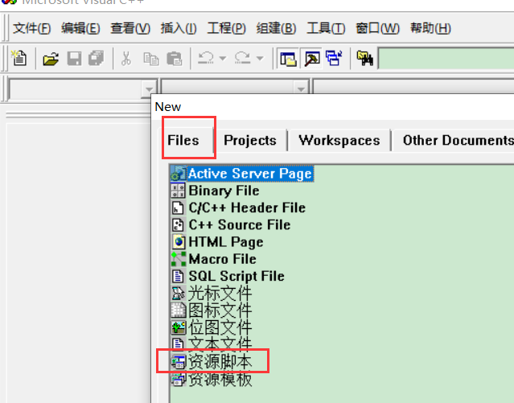


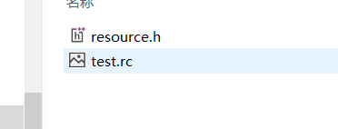


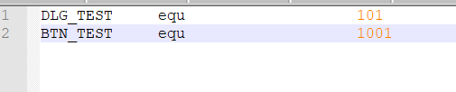


#### 用vs建立资源文件

1.  新建一个桌面向导

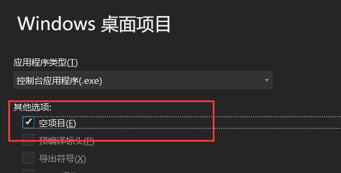

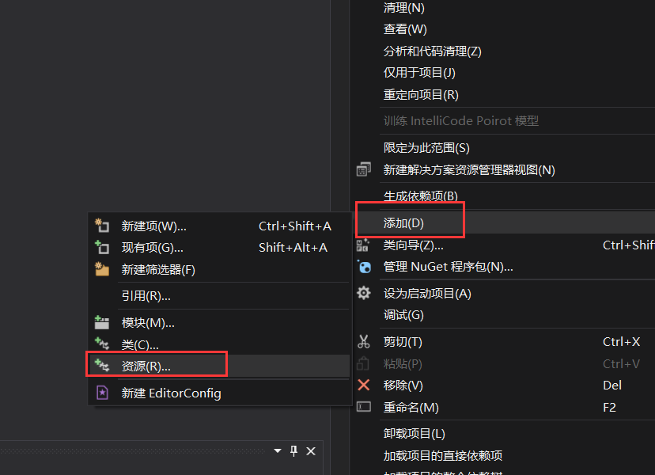

生成文件之后,再打开 rc 文件,生成为


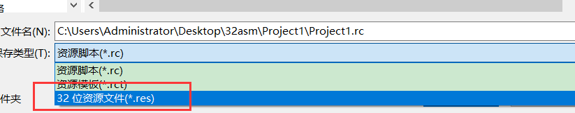

编译链接文件时要讲资源文件加进去

```
ml /c /coff %1.asm
if errorlevel 1 goto err
rc %1.rc   ;如果用的是是vs自己生成的 res文件,就不需要
if errorlevel 1 goto err
link /subsystem:windows %1.obj %1.res
if errorlevel 1 goto err
OllyICE.exe %1.exe
:err
pause
```

 

汇编代码

```
.386
.model flat, stdcall
option casemap:none

include windows.inc
include user32.inc
include kernel32.inc

;引入资源的头文件
include resource.inc

includelib user32.lib
includelib kernel32.lib

.data


.code

;打开窗口的过程函数
DialogProc proc  hwndDlg:HWND,    uMsg:UINT,   wParam:WPARAM,  lParam:LPARAM
    .IF uMsg == WM_COMMAND
        mov eax, wParam
        .IF ax == BTN_TEST
            ;调用弹窗的函数
            invoke MessageBox, NULL, NULL, NULL, MB_OK
        .ENDIF
    .ELSEIF uMsg == WM_CLOSE
        invoke EndDialog, hwndDlg, 0
    .ENDIF

    mov eax, FALSE  ;返回结果
    ret
DialogProc endp


WinMain proc hInstance:HINSTANCE 
    
    ;打开窗口函数  实例句柄必须给,不然找不到资源 
    invoke DialogBoxParam, hInstance, DLG_TEST, NULL, offset DialogProc, 0

    ret
WinMain endp


START:
    invoke GetModuleHandle, NULL
    invoke WinMain, eax
    invoke ExitProcess, 0

end START
```

### 使用C库

#### 动态库使用

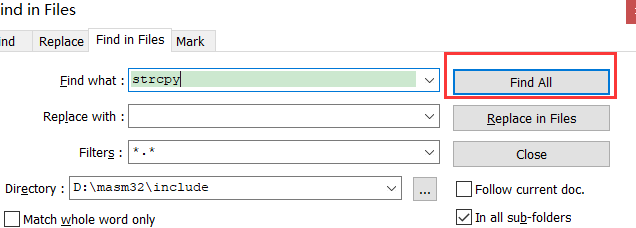

可以看出,C库函数声明 在 msvcrt.inc中  并在前面加  crt_

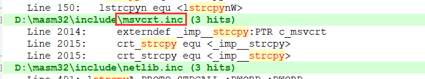


```
.386
.model flat, stdcall
option casemap:none

include windows.inc
include user32.inc
include kernel32.inc

include msvcrt.inc   ;c库头文件

includelib user32.lib
includelib kernel32.lib

includelib msvcrt.lib  ;c库实现文件


.data
    g_szFmt db "%s %d %08X", 0dh, 0ah, 0
    g_sz db "这是测试", 0
    
.code
main proc C

    invoke printf, offset g_szFmt, offset g_sz, 4096, 4096
    ;invoke strlen, offset g_sz
    
    ret
main endp


START:
    invoke main
    invoke ExitProcess, 0
end START
```

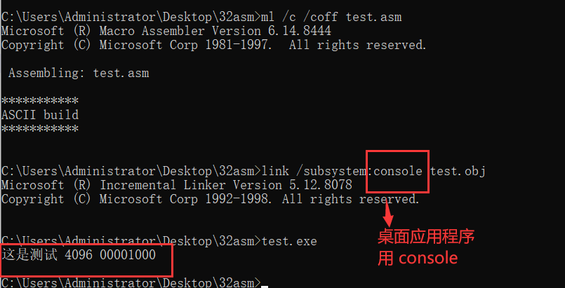


 静态库使用 

```
.386
.model flat, stdcall
option casemap:none

include windows.inc
include user32.inc
include kernel32.inc

includelib user32.lib
includelib kernel32.lib

includelib libc.lib    ;C库的静态库

public main           ;使用静态库必用要有 main函数

printf PROTO C :VARARG     ; 函数声明 VARARG  变参类型
strlen PROTO C :DWORD      ; 函数声明

.data
    g_szFmt db "%s %d %08X", 0dh, 0ah, 0
    g_sz db "这是测试", 0
    
.code
main proc C   ;调用约定必须是c

    invoke strlen, offset g_sz    ;调用c库函数
    
    ret
main endp


START:
    invoke main   ;调用main函数
    invoke ExitProcess, 0
end START
```

### 汇编和C的互调

```
ml /c /coff test.asm

link /subsystem:console test.obj
link /subsystem:windows test.obj
```

#### 使用obj文件

从语法上来将,c和汇编的语法是相互不兼容的,所以想在源码上进行相互间的调用是不可能的事情, 所以只能退而求其次 使用obj文件, 把 c 的 obj文件给汇编去用,把 汇编的 obj 文件 给 c 去用

##### c调用汇编的 obj文件

```
.386
.model flat, stdcall
option casemap:none

include windows.inc
include user32.inc
include kernel32.inc

includelib user32.lib
includelib kernel32.lib


.data
    g_szFmt db "%s %d %08X", 0dh, 0ah, 0
    g_sz db "这是测试", 0
    
.code

TestFunc PROC  sz:dword
    invoke MessageBox,NULL,sz,offset  g_sz,MB_OK  ;调用弹窗,显示传入的字符串
    ret
TestFunc ENDP

;防止程序把  START 当做程序入口,直接退出程序
;START:
    ;invoke ExitProcess,0   ;退出程序
;end START

end  
```

查看 生成的obj 文件, 我们的 函数的名字

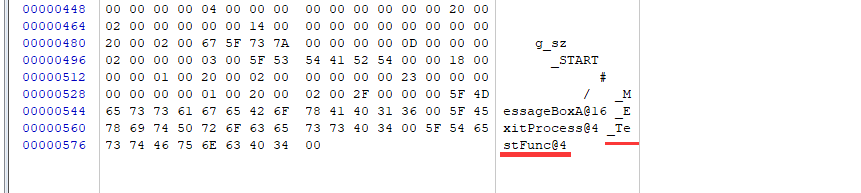

调用  

1.  新建一个 32位的桌面应用程序


1.  把obj文件复制到工程目录下
2.  再导入.bobj文件


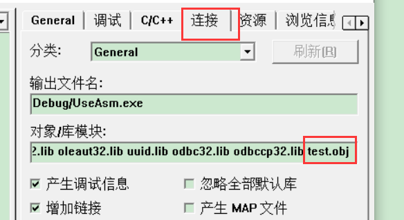

1.  去掉预编译头

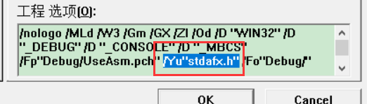

```
extern "C" void __stdcall TestFunc(char* sz);   //对函数进行声明,注意调用约定


int main(int argc, char* argv[])
{
  
  TestFunc("你好");   //调用汇编obj里面的函数

  printf("Hello World!\n");
  return 0;
}

```

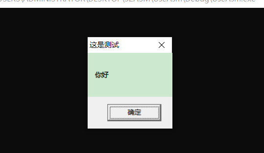


##### 用vs调用 汇编obj

````
.386
.model flat, stdcall
option casemap:none

include windows.inc
include user32.inc
include kernel32.inc

includelib user32.lib
includelib kernel32.lib

Func proto c sz:DWORD  ;将函数声明改成汇编形式

.data
    g_szFmt db "%s %d %08X", 0dh, 0ah, 0
    g_sz db "这是测试", 0
    
.code

TestFunc PROC  sz:dword
    invoke MessageBox,NULL,sz,offset  g_sz,MB_OK
    ret
TestFunc ENDP

end


````

把汇编生成的 obj 文件 放入项目


 汇编使用C语言的 obj 

1新建一个c的源文件


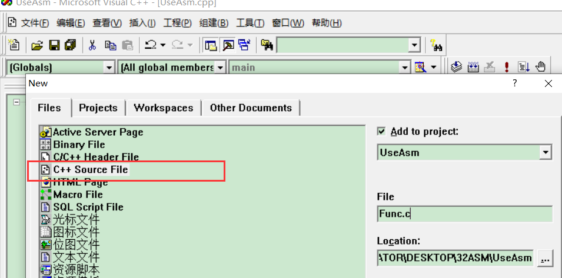


2取消预编译头


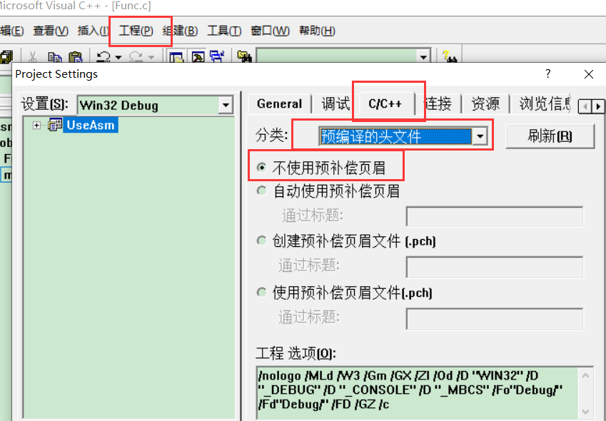

```
#include <windows.h>

void Func(char* sz)
{

  MessageBox(NULL,sz,"这是c函数",MB_OK);
}
```


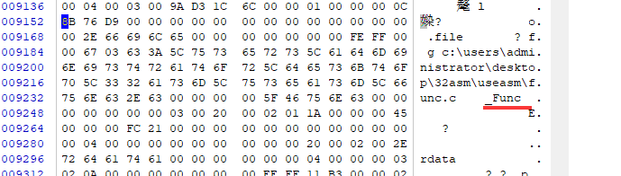

把 obj文件放到汇编代码同目录

```
.386
.model flat, stdcall
option casemap:none

include windows.inc
include user32.inc
include kernel32.inc

includelib user32.lib
includelib kernel32.lib


Func proto c sz:DWORD  ;将函数声明改成汇编形式


.data
    g_szFmt db "%s %d %08X", 0dh, 0ah, 0
    g_sz db "这是测试", 0
    
.code

;调用 c 的obj文件必须有,虽然没什么用
main proc c
    ret
main endp

TestFunc PROC  sz:dword
    invoke MessageBox,NULL,sz,offset  g_sz,MB_OK
    ret
TestFunc ENDP

START:
    invoke Func, offset g_sz
    invoke ExitProcess,0   ;退出程序
end START


```


解决办法,把 vs 或者vc6的 lib 加入环境变量 


###### 汇编使用  vs 的 obj

在vs项目中添加一个   Func.c 文件 代码如下,生成解决方案

```
#include <windows.h>

void Func(char* sz)
{

    MessageBox(NULL, sz, "这是c函数", MB_OK);
}
```

把obj文件放到同目录

```
.386
.model flat, stdcall
option casemap:none

include windows.inc
include user32.inc
include kernel32.inc

includelib user32.lib
includelib kernel32.lib

Func proto c sz:DWORD  ;将函数声明改成汇编形式

.data
    g_szFmt db "%s %d %08X", 0dh, 0ah, 0
    g_sz db "这是测试", 0
    
.code

;调用 c 的obj文件必须有,虽然没什么用
main proc c
    ret
main endp

TestFunc PROC  sz:dword
    invoke MessageBox,NULL,sz,offset  g_sz,MB_OK
    ret
TestFunc ENDP

START:
    invoke Func, offset g_sz
    invoke ExitProcess,0   ;退出程序
end START

```

此时去编译链接项目 会有一大堆 外部符号找不到, 这些 库是vs 的 ,解决办法是把这些库加进来,或者使用 vs 的命令提示符.很麻烦,还要关掉一堆的检查,最好的方法使用dll


#### 使用dll

dll的接口是很标准的,从dll出现为止,基本没变过

##### 汇编使用 C 的 dll

1.  用vs创建一个动态链接库

    ```
    // dllmain.cpp : 定义 DLL 应用程序的入口点。
    #include "pch.h"
    
    
    #include <windows.h>
    
    extern "C" void Func(char* sz)   //声明函数和调用约定
    {
    
        MessageBoxA(NULL, sz, "这是c函数", MB_OK);
    }
    
    
    
    BOOL APIENTRY DllMain(HMODULE hModule,
        DWORD  ul_reason_for_call,
        LPVOID lpReserved
    )
    {
        switch (ul_reason_for_call)
        {
        case DLL_PROCESS_ATTACH:
        case DLL_THREAD_ATTACH:
        case DLL_THREAD_DETACH:
        case DLL_PROCESS_DETACH:
            break;
        }
        return TRUE;
    }
    
    ```

    导出函数

    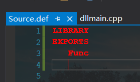

    把生成 的  dll  和 lib 文件  放到汇编同目录下

    ```
    .386
    .model flat, stdcall
    option casemap:none
    
    include windows.inc
    include user32.inc
    include kernel32.inc
    
    includelib  MyDll.lib ;导入lib库
    
    includelib user32.lib
    includelib kernel32.lib
    
    Func proto c sz:DWORD  ;将函数声明改成汇编形式
    
    .data
        g_szFmt db "%s %d %08X", 0dh, 0ah, 0
        g_sz db "这是测试", 0
        
    .code
    
    ;调用 c 的obj文件必须有,虽然没什么用
    main proc c
        ret
    main endp
    
    TestFunc PROC  sz:dword
        invoke MessageBox,NULL,sz,offset  g_sz,MB_OK
        ret
    TestFunc ENDP
    
    START:
        invoke Func, offset g_sz
        invoke ExitProcess,0   ;退出程序
    end START
    ```

    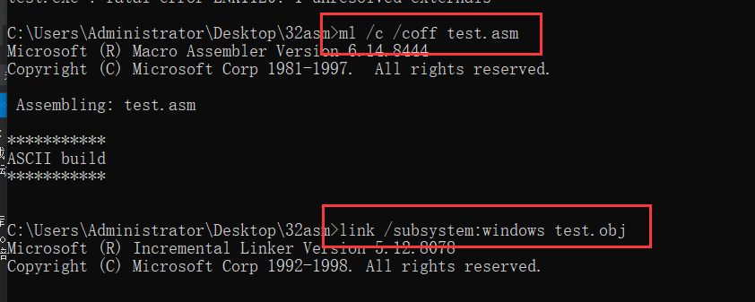

    

    ##### C使用汇编的DLL

    汇编也可以写成dll    .注意字符集

    ```
    .386
    .model flat, stdcall
    option casemap:none
    
    include windows.inc
    include user32.inc
    include kernel32.inc
    
    includelib user32.lib
    includelib kernel32.lib
    
    .data
        g_sz db "这是测试", 0
    
    .code 
    TestFunc proc sz:DWORD
        invoke MessageBox, NULL, sz, offset g_sz, MB_OK 
        ret
    TestFunc endp
    
    ; dll 必须要有 DllMain 
    DllMain proc hinstDLL:HINSTANCE,  fdwReason:DWORD, lpvReserved:LPVOID
    
        mov eax, TRUE
        ret
    DllMain endp
    
    end DllMain   ;DllMain一般作为函数入口点
    
    ```

    

新建一个def 文件导出函数


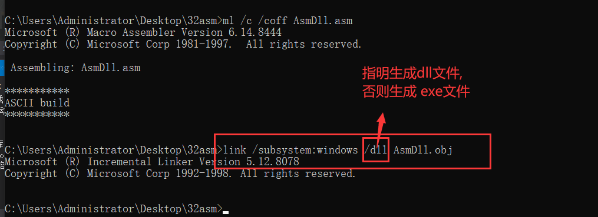


此时dll中并没有导出函数,因为没有告诉链接器去用它


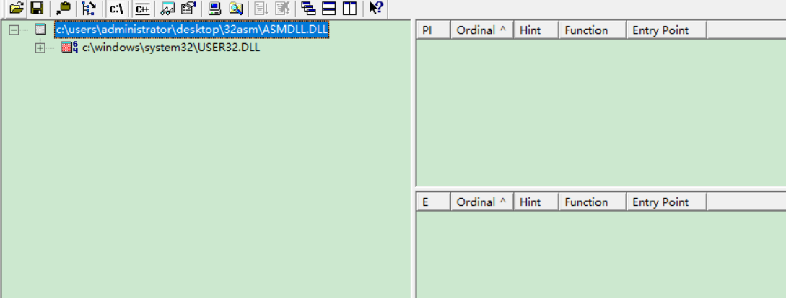


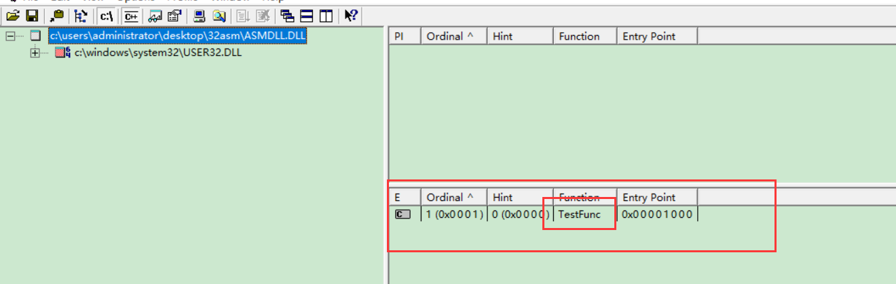


这个dll就可以给 c程序用了

把 生成 的 dll 和lib 放到正确位置 

```
#include "framework.h"
#include "Project2.h"


#pragma comment(lib, "asmdll.lib")  使用生成的 lib库
extern "C" void __stdcall TestFunc(char* sz);


int APIENTRY wWinMain(_In_ HINSTANCE hInstance,
    _In_opt_ HINSTANCE hPrevInstance,
    _In_ LPWSTR    lpCmdLine,
    _In_ int       nCmdShow)
{
    TestFunc((char*)"你好");
}

```

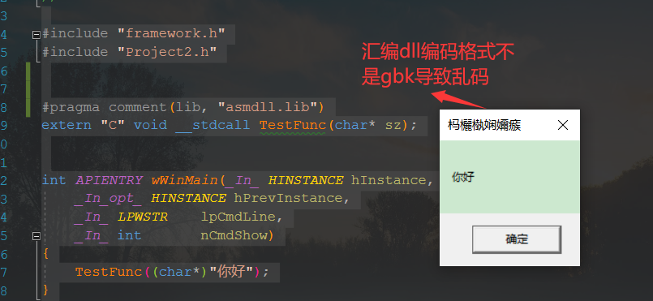

### 内联汇编

#### 内联

在c,c++中写汇编代码  ,在内联汇编中,宏汇编是无法使用的,但是部分伪指令是可以用的,而且只有 32位程序可以写,64位程序是无法内联汇编的

当我们想把某个函数注入到对方进程里面,这样就要求我们的代码是纯汇编的,因为一旦用到vs的代码,vs就会加一堆检查

格式:   关键字    __asm

```
 __asm         mov eax, eax
  __asm        mov eax, n
  __asm {
        mov eax, n0
        mov n0, 10

        push MB_OK
        push sz
        push NULL
        push NULL
        call MessageBoxA

        mov eax, size n
        mov eax, length n
        mov eax, offset wWinMain
    }


```


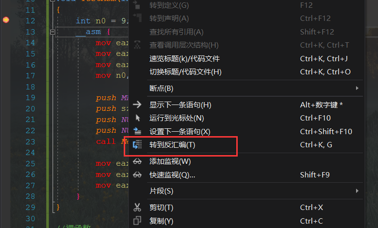

```
// Project2.cpp : 定义应用程序的入口点。
//

#include "framework.h"
#include "Project2.h"
#pragma comment(lib, "asmdll.lib")
extern "C" void __stdcall TestFunc(char* sz);


void TestAsm(int n, char* sz)
{
    int n0 = 9;
    __asm {
        mov eax, eax
        mov eax, n
        mov eax, n0
        mov n0, 10

        push MB_OK
        push sz
        push NULL
        push NULL
        call MessageBoxA   //汇编里面调函数  ,宏汇编是无法使用的

        //使用伪指令
        mov eax, size n
        mov eax, length n
        mov eax, offset wWinMain
    }
}

//裸函数
__declspec(naked) void Test(int n, char* sz)
{
    //裸函数申请栈空间
    __asm
    {
        push ebp
        mov ebp, esp
        sub esp, 0x40
    }

    ;裸函数不允许初始化变量
    int n0;
    float f0;
    n0 = 9;
    f0 = 3.14f;
    if (n0 == n)
    {
        MessageBoxA(NULL, NULL, NULL, NULL);
    }

    __asm
    {
        mov esp, ebp
        pop ebp
        ret
    }
}

int APIENTRY wWinMain(_In_ HINSTANCE hInstance,
    _In_opt_ HINSTANCE hPrevInstance,
    _In_ LPWSTR    lpCmdLine,
    _In_ int       nCmdShow)
{
    Test(99, (char*)"hello world");
    TestAsm(99, (char*)"hello world");
    //TestFunc((char*)"你好");
    return 0;
}
```

#### 裸函数    __declspec(naked) 

正常一个空函数什么都不写.都回会有一些初数化操作,但是如果不要,可以声明 它是一个裸函数,就不会帮其生成代码,需要自己去生成

```
//裸函数
__declspec(naked) void Test(int n, char* sz)
{
    __asm
    {
        push ebp
        mov ebp, esp
        sub esp, 0x40
    }

    int n0;
    float f0;
    n0 = 9;
    f0 = 3.14f;
    if (n0 == n)
    {
        MessageBoxA(NULL, NULL, NULL, NULL);
    }

    __asm
    {
        mov esp, ebp
        pop ebp
        ret
    }
}
```

### 作业

#### 汇编版俄罗斯方块

[📎汇编版俄罗斯方块.zip](./汇编版俄罗斯方块.zip)