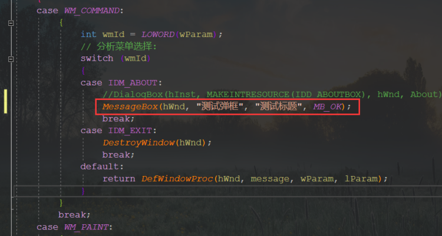
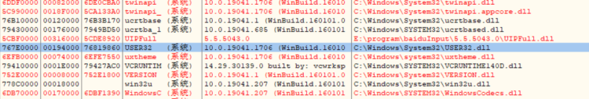
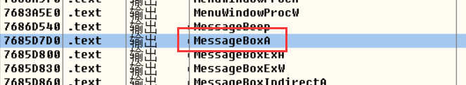
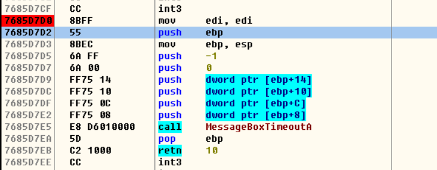
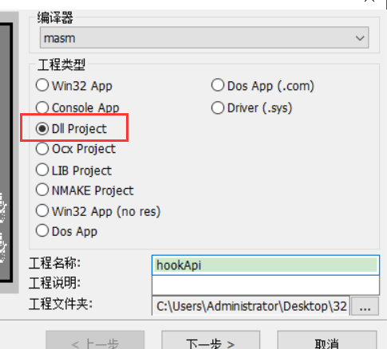
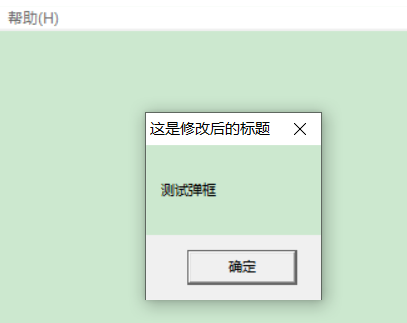
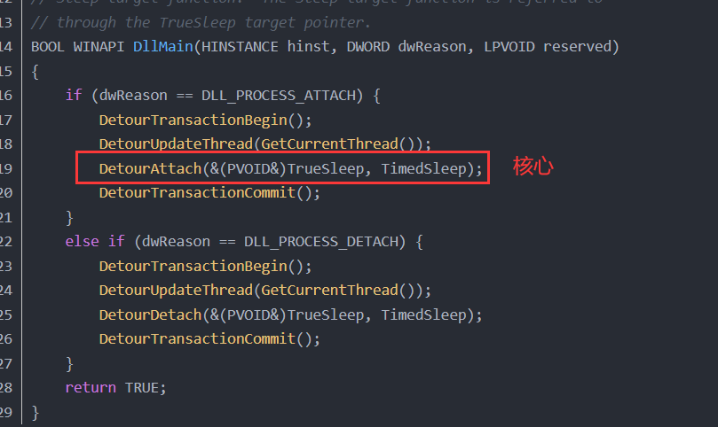

api  hook 称为 api 钩子,也称为 内联apihook 

我们程序使用时,有时候需要获得程序的一些其他信息,例如,网络发包是获得包数据,打开文件时,获得文件信息等,这是,我们就可以给这些api下个钩子,当他操作时可以把它的数据抓下来,保存

钩子类似起监控作用

 网络,文件,注册表自己实现需要进内核


 API  Hook 

简介：API Hook 是通过拦截 Api 的调用，使其流程转移到我们指定的地方，同时为了保持原有程序的健壮性，需要执行完我们流程后再转移会自身的流程。

原理：修改api函数入口的地方，让他调转到我们函数入口点。API在入口处特意留了位置。

汇编思路：jmp 地址 -> 我们代码 -> ret返回 jmp 下一条地址继续执行。

使用场景：

1通常为某api 的功能做扩展或则改变api所

2为大型程序打补丁，拦截api并成功跳转

3执行api前修改api的参数


 实现api hook 

创建一个桌面应用程序


把点击关于的弹窗改成  MessageBox 

 





接下来我们需要实现改变  MessageBox   的标题,实际就是改 api 的参数那么就需要修改   MessageBox    的代码


查看  MessageBox    在 debug 模式中 是无法 通过 MessageBox   的 api 直接 找到的,因为 有跳表,但是可以在  user32中招










但是我们修改代码不能修改它由原本自己功能的代码,需要先跳走,实现我们的代码再跳回来,那问题是在那里跳呢?

一个 jmp 的 机器码是 5个字节,一般是不能随便选位置,否则的话可能会覆盖其他代码,还可能截断其他指令

我们一般放在下图位置


上面3条指令,有一条是没用的 (第一条),而且加起来就是5个字节,而且很多api 开头都是这3条指令,刚好一条 jmp

这3条指令功能是固定的,我们恢复的时候也很简单


综上所述:想实现 api hook


思路：修改messagebox api 的执行流程，观察messagebox 的汇编代码如下。

我们都知道，每个进程都有自己的地址空间，指针的值表示的是自己的地址空间，进程不能创建一个指针来引用属于其他进程的内存。所以首选DLL的，而不是远程线程注入代码。因为一旦DLL进入另一个地址空间，那么我们就可以在这个进程中为所欲为。选择线程代码注入的话。需要重定位API ，且如果注入的代码需要调用其他api，还要单独计算重定位。

jmp 偏移的计算：跳转到的目标地址 - 当前地址  - 5（API开头的位置）


流程：

1将 dll 注入到目标程序。执行DLL函数的功能，DLL功能如下：

2获取MessageBox 地址，修改MessageBox入口地址为jmp + 偏移 ---》自定义代码

3保存系统函数入口处的代码

4替换掉进程中的而系统函数入口指向我们的函数

5当系统函数被调用，立即跳转到我们的函数

6我们的函数处理

7恢复系统函数入口的代码

8调用原来的系统函数

9再修改系统函数入口指向我们的函数 ->返回


代码实现:



```
.386
.model flat, stdcall  ;32 bit memory model
option casemap :none  ;case sensitive

;include HookApi.inc

include windows.inc
include kernel32.inc
include user32.inc
include Comctl32.inc
include shell32.inc
include msvcrt.inc

includelib kernel32.lib
includelib user32.lib
includelib Comctl32.lib
includelib shell32.lib
includelib msvcrt.lib


.data 
    g_szUser32       db "user32",0          ; 用于根据模块名获取模块地址
    g_szMessageBoxA  db "MessageBoxA",0     ; 用于根据函数名获取函数地址
    g_dwAddrMsgBox   dd  0                  ; MessageBox地址
    
    g_szNewTitel     db  "这是修改后的标题",0 
 
.code

MYMESSAGE:   ;这块代码是调用MessageBox 时才执行
   ;修改标题
   
   mov dword ptr [esp+ 0CH], offset g_szNewTitel ;把原先标题位置的值换成新标题的位置
   
   ;执行原来代码
   
   mov edi,edi
   push ebp
   mov ebp,esp
   
   ;跳回去
   mov eax,g_dwAddrMsgBox
   add eax,5  ;上面3条指令长度
   jmp eax


InstallHook  proc   ;这块代码是加载dll时就执行
  LOCAL @dwOldProc:DWORD   ;修改之前的内存属性

  ;获取MessageBox地址,用过 user32 动态获取
  invoke   GetModuleHandle,offset g_szUser32  ;根据模块名获取模块地址
   
  invoke   GetProcAddress,eax,offset  g_szMessageBoxA  ;获取模块中指定函数名的地址
  mov  g_dwAddrMsgBox,eax   ;保存函数地址
  
  ;添加 jmp 到自己代码
  ;获取跳转偏移
  mov ebx,offset  MYMESSAGE  ;要跳转的目标地址
  sub ebx,g_dwAddrMsgBox     ;获取 到标地址的偏移
  sub ebx,5                  ;减去jmp指定的长度(下一条指令地址)
  
 
  ;修改内存属性
  invoke VirtualProtect, g_dwAddrMsgBox, 1, PAGE_EXECUTE_READWRITE, addr @dwOldProc
    
  ;修改指令
  mov  eax, g_dwAddrMsgBox   
  ;改指令位跳转指令
  mov byte ptr [eax],0e9H   ;jmp 
  mov dword ptr [eax+1 ],ebx   ;偏移值
  
  ;还原内存属性
  invoke VirtualProtect, g_dwAddrMsgBox, 1, @dwOldProc, addr @dwOldProc
  
  ret
InstallHook  endp


DllMain proc hinstDLL:HINSTANCE,  fdwReason:DWORD, lpvReserved:LPVOID
    
    .if fdwReason == DLL_PROCESS_ATTACH    ;如果dll被映射
      ;安装 dll
      invoke InstallHook
      
    .endif

    mov eax, TRUE
    ret
DllMain endp

end DllMain
```

调试程序,发现原来的3行代码已经变成了   jmp  了





 Hook注意点 

1写DLL的时候千万不要忘记 返回TRUE，否则DLL会加载失败

2因为MessageBox加载到进程中是属于代码段，可读，不可写，需要修改内存属性。

●计算注入代码偏移，以便正确拿到注入代码中携带的变量
●保存寄存器环境
●执行覆盖的指令
●跳转回覆盖指令的下一条指令


 API重入 

当我们我们需要调用 hook 后 的 api的话 ,会产生    调  api  ---  调 hook  --- 调 api -- 调hook

无限套娃的情况,  导致栈空间 或者 内存空间 被撑爆

例如: 上面代码,我自在自己代码中 调 MessageBox ,就会出现


 解决上面问题有3种方法 

  1.自己调之前先把之前修改的代码恢复,调完之后再修改 

自己使用前 先卸载 hook  ,使用后在安装

```
.386
.model flat, stdcall  ;32 bit memory model
option casemap :none  ;case sensitive

;include HookApi.inc

include windows.inc
include kernel32.inc
include user32.inc
include Comctl32.inc
include shell32.inc
include msvcrt.inc

includelib kernel32.lib
includelib user32.lib
includelib Comctl32.lib
includelib shell32.lib
includelib msvcrt.lib

InstallHook  proto
UninstallHook  proto

.data 
    g_szUser32       db "user32",0          ; 用于根据模块名获取模块地址
    g_szMessageBoxA  db "MessageBoxA",0     ; 用于根据函数名获取函数地址
    g_dwAddrMsgBox   dd  0                  ; MessageBox地址
    
    g_szNewTitel     db  "这是修改后的标题",0 
    
    g_szTitel        db  "重入",0   
    g_szTxt          db  "这这是重入弹窗",0 
 
.code

MYMESSAGE:   ;这块代码是调用MessageBox 时才执行
   ;修改标题
   
   mov dword ptr [esp+ 0CH], offset g_szNewTitel ;把原先标题位置的值换成新标题的位置
   
   
   invoke  UninstallHook  ;卸载hook
   invoke  MessageBoxA,NULL,offset g_szTxt,offset g_szTitel ,MB_OK
   invoke InstallHook    ;安装hook
   ;执行原来代码
   mov edi,edi
   push ebp
   mov ebp,esp
   
   ;跳回去
   mov eax,g_dwAddrMsgBox
   add eax,5  ;上面3条指令长度
   jmp eax


InstallHook  proc  uses ebx ;这块代码是加载dll时就执行
  LOCAL @dwOldProc:DWORD   ;修改之前的内存属性

  ;获取MessageBox地址,用过 user32 动态获取
  invoke   GetModuleHandle,offset g_szUser32  ;根据模块名获取模块地址
   
  invoke   GetProcAddress,eax,offset  g_szMessageBoxA  ;获取模块中指定函数名的地址
  mov  g_dwAddrMsgBox,eax   ;保存函数地址
  
  ;添加 jmp 到自己代码
  ;获取跳转偏移
  mov ebx,offset  MYMESSAGE  ;要跳转的目标地址
  sub ebx,g_dwAddrMsgBox     ;获取 到标地址的偏移
  sub ebx,5                  ;减去jmp指定的长度(下一条指令地址)
  
 
  ;修改内存属性
  invoke VirtualProtect, g_dwAddrMsgBox, 1, PAGE_EXECUTE_READWRITE, addr @dwOldProc
    
  ;修改指令
  mov  eax, g_dwAddrMsgBox   
  ;改指令位跳转指令
  mov byte ptr [eax],0e9H   ;jmp 
  mov dword ptr [eax+1 ],ebx   ;偏移值
  
  ;还原内存属性
  invoke VirtualProtect, g_dwAddrMsgBox, 1, @dwOldProc, addr @dwOldProc
  
  ret
InstallHook  endp


UninstallHook  proc   ;卸载hook,还原之前修改的3行代码
  LOCAL @dwOldProc:DWORD   ;修改之前的内存属性
 
    ;修改内存属性
    invoke VirtualProtect, g_dwAddrMsgBox, 1, PAGE_EXECUTE_READWRITE, addr @dwOldProc
    
    ;还原指令
    ;8B FF 55 8B EC
    mov eax, g_dwAddrMsgBox
    mov byte ptr [eax], 08Bh
    mov byte ptr [eax+1], 0FFh
    mov byte ptr [eax+2], 055h
    mov byte ptr [eax+3], 08Bh
    mov byte ptr [eax+4], 0ECh
    
    ;还原内存属性
    invoke VirtualProtect, g_dwAddrMsgBox, 1, @dwOldProc, addr @dwOldProc
    
    ret
  
  ret
UninstallHook  endp


DllMain proc hinstDLL:HINSTANCE,  fdwReason:DWORD, lpvReserved:LPVOID
    
    .if fdwReason == DLL_PROCESS_ATTACH    ;如果dll被映射
      ;安装 dll
      invoke InstallHook
      
    .endif

    mov eax, TRUE
    ret
DllMain endp


end DllMain

```

##### 2. 加状态标记(推荐)

自己调用前先把状态改成 true,用完之后就改成  false 

```
.386
.model flat, stdcall  ;32 bit memory model
option casemap :none  ;case sensitive

;include HookApi.inc

include windows.inc
include kernel32.inc
include user32.inc
include Comctl32.inc
include shell32.inc
include msvcrt.inc

includelib kernel32.lib
includelib user32.lib
includelib Comctl32.lib
includelib shell32.lib
includelib msvcrt.lib

InstallHook  proto

.data 
    g_szUser32       db "user32",0          ; 用于根据模块名获取模块地址
    g_szMessageBoxA  db "MessageBoxA",0     ; 用于根据函数名获取函数地址
    g_dwAddrMsgBox   dd  0                  ; MessageBox地址
    
    g_szNewTitel     db  "这是修改后的标题",0 
    
    g_szTitel        db  "重入",0   
    g_szTxt          db  "这这是重入弹窗",0 
    
    g_bIsSelfCall    db  FALSE     ;判断是否自己调用
 
.code

MYMESSAGE:   ;这块代码是调用MessageBox 时才执行
   ;修改标题
    
   .if !g_bIsSelfCall
     mov g_bIsSelfCall,TRUE
     
     mov dword ptr [esp+ 0CH], offset g_szNewTitel ;把原先标题位置的值换成新标题的位置
     ;这下面可以放我们自己的api
     invoke  MessageBoxA,NULL,offset g_szTxt,offset g_szTitel ,MB_OK
   
     mov g_bIsSelfCall,FALSE
   .endif


   ;执行原来代码
   mov edi,edi
   push ebp
   mov ebp,esp
   
   ;跳回去
   mov eax,g_dwAddrMsgBox
   add eax,5  ;上面3条指令长度
   jmp eax


InstallHook  proc  uses ebx ;这块代码是加载dll时就执行
  LOCAL @dwOldProc:DWORD   ;修改之前的内存属性

  ;获取MessageBox地址,用过 user32 动态获取
  invoke   GetModuleHandle,offset g_szUser32  ;根据模块名获取模块地址
   
  invoke   GetProcAddress,eax,offset  g_szMessageBoxA  ;获取模块中指定函数名的地址
  mov  g_dwAddrMsgBox,eax   ;保存函数地址
  
  ;添加 jmp 到自己代码
  ;获取跳转偏移
  mov ebx,offset  MYMESSAGE  ;要跳转的目标地址
  sub ebx,g_dwAddrMsgBox     ;获取 到标地址的偏移
  sub ebx,5                  ;减去jmp指定的长度(下一条指令地址)
  
 
  ;修改内存属性
  invoke VirtualProtect, g_dwAddrMsgBox, 1, PAGE_EXECUTE_READWRITE, addr @dwOldProc
    
  ;修改指令
  mov  eax, g_dwAddrMsgBox   
  ;改指令位跳转指令
  mov byte ptr [eax],0e9H   ;jmp 
  mov dword ptr [eax+1 ],ebx   ;偏移值
  
  ;还原内存属性
  invoke VirtualProtect, g_dwAddrMsgBox, 1, @dwOldProc, addr @dwOldProc
  
  ret
InstallHook  endp


DllMain proc hinstDLL:HINSTANCE,  fdwReason:DWORD, lpvReserved:LPVOID
    
    .if fdwReason == DLL_PROCESS_ATTACH    ;如果dll被映射
      ;安装 dll
      invoke InstallHook
      
    .endif

    mov eax, TRUE
    ret
DllMain endp


end DllMain

```

##### 3.自己调的话 第二次 就不执行 自己调的函数,绕过 直接执行下面的 或者直接执行下面的代码,因为那里才是 真正入口 

```
.386
.model flat, stdcall  ;32 bit memory model
option casemap :none  ;case sensitive

;include HookApi.inc

include windows.inc
include kernel32.inc
include user32.inc
include Comctl32.inc
include shell32.inc
include msvcrt.inc

includelib kernel32.lib
includelib user32.lib
includelib Comctl32.lib
includelib shell32.lib
includelib msvcrt.lib

InstallHook  proto

.data 
    g_szUser32       db "user32",0          ; 用于根据模块名获取模块地址
    g_szMessageBoxA  db "MessageBoxA",0     ; 用于根据函数名获取函数地址
    g_dwAddrMsgBox   dd  0                  ; MessageBox地址
    
    g_szNewTitel     db  "这是修改后的标题",0 
    
    g_szTitel        db  "重入",0   
    g_szTxt          db  "这这是重入弹窗",0 
    

.code

;我们自己的MessageBox

MYMESSAGE:
    push MB_OK
    push offset g_szTitel
    push offset g_szTxt
    push NULL
    call NWEMSGBOX
    ;.....
    ;.....
    ;修改标题
    mov dword ptr [esp+0ch], offset g_szNewTitel
    
NWEMSGBOX:   ;这块代码是调用MessageBox 时才执行
 

   ;执行原来代码
   mov edi,edi
   push ebp
   mov ebp,esp
   
   ;跳回去
   mov eax,g_dwAddrMsgBox
   add eax,5  ;上面3条指令长度
   jmp eax


InstallHook  proc  uses ebx ;这块代码是加载dll时就执行
  LOCAL @dwOldProc:DWORD   ;修改之前的内存属性

  ;获取MessageBox地址,用过 user32 动态获取
  invoke   GetModuleHandle,offset g_szUser32  ;根据模块名获取模块地址
   
  invoke   GetProcAddress,eax,offset  g_szMessageBoxA  ;获取模块中指定函数名的地址
  mov  g_dwAddrMsgBox,eax   ;保存函数地址
  
  ;添加 jmp 到自己代码
  ;获取跳转偏移
  mov ebx,offset  MYMESSAGE  ;要跳转的目标地址
  sub ebx,g_dwAddrMsgBox     ;获取 到标地址的偏移
  sub ebx,5                  ;减去jmp指定的长度(下一条指令地址)
  
 
  ;修改内存属性
  invoke VirtualProtect, g_dwAddrMsgBox, 1, PAGE_EXECUTE_READWRITE, addr @dwOldProc
    
  ;修改指令
  mov  eax, g_dwAddrMsgBox   
  ;改指令位跳转指令
  mov byte ptr [eax],0e9H   ;jmp 
  mov dword ptr [eax+1 ],ebx   ;偏移值
  
  ;还原内存属性
  invoke VirtualProtect, g_dwAddrMsgBox, 1, @dwOldProc, addr @dwOldProc
  
  ret
InstallHook  endp


DllMain proc hinstDLL:HINSTANCE,  fdwReason:DWORD, lpvReserved:LPVOID
    
    .if fdwReason == DLL_PROCESS_ATTACH    ;如果dll被映射
      ;安装 dll
      invoke InstallHook
      
    .endif

    mov eax, TRUE
    ret
DllMain endp


end DllMain
```

**detours**

微软自己有一套 hook api 的库   

https://blog.csdn.net/fuhanghang/article/details/118309429




**frida**

[https://blog.csdn.net/qq_41179280/article/details/112467196?spm=1001.2101.3001.6650.1&utm_medium=distribute.pc_relevant.none-task-blog-2%7Edefault%7ECTRLIST%7Edefault-1-112467196-blog-116140693.pc_relevant_default&depth_1-utm_source=distribute.pc_relevant.none-task-blog-2%7Edefault%7ECTRLIST%7Edefault-1-112467196-blog-116140693.pc_relevant_default&utm_relevant_index=2](https://blog.csdn.net/qq_41179280/article/details/112467196?spm=1001.2101.3001.6650.1&utm_medium=distribute.pc_relevant.none-task-blog-2~default~CTRLIST~default-1-112467196-blog-116140693.pc_relevant_default&depth_1-utm_source=distribute.pc_relevant.none-task-blog-2~default~CTRLIST~default-1-112467196-blog-116140693.pc_relevant_default&utm_relevant_index=2)


### 作业

#### 1. 使用apihook，记录notepad操作的所有文件的文件名。

```
.386
.model flat, stdcall  ;32 bit memory model
option casemap :none  ;case sensitive

;include HookApi.inc

include windows.inc
include kernel32.inc
include user32.inc
include Comctl32.inc
include shell32.inc
include msvcrt.inc

includelib kernel32.lib
includelib user32.lib
includelib Comctl32.lib
includelib shell32.lib
includelib msvcrt.lib

InstallHook  proto

.data 
    g_szKernelbase     db "Kernelbase",0    ; 用于根据模块名获取模块地址
    g_szCreateFileW    db "CreateFileW",0   ; 用于根据函数名获取函数地址
    g_dwAddrCreateF    dd  0                ; CreateFileW地址
    g_szFileName       db  "info.txt",0
    g_szFileMode       db  "wb+", 0
    g_wFileCode        dd  0                 ;文件代号(句柄)
    ;g_buf              db 256 dup(0)        ;接收文件内容的缓冲区
    g_dwBytesWrited    dd  0
    g_dwWritedLength   dd  0
    g_dwAddrFileName   dd 0                 ;接收文件内容的缓冲区
    g_bIsSelfCall      db  FALSE            ;判断是否自己调用
    
  
 
.code


MYCREATEFILE:   ;这块代码是调用CreateFileW 时才执行
   ;修改标题
   
   pushad
   pushfd
  
   .if !g_bIsSelfCall
     mov g_bIsSelfCall,TRUE
     
     mov eax,dword ptr [esp+ 40]   ;获取文件名地址
     mov g_dwAddrFileName,eax        ;保存文件名地址
     
     ;invoke crt_strlen,g_dwAddrFileName
     ;mov g_dwWritedLength,eax
     
  
     ;这下面可以放我们自己的api
     ;invoke  CreateFile,offset g_szFileName,GENERIC_READ or GENERIC_WRITE, \
     ;FILE_SHARE_READ,NULL,OPEN_EXISTING,FILE_ATTRIBUTE_NORMAL,NULL
    ; mov  g_wFileCode,eax 
     ;invoke  SetFilePointer,g_wFileCode, NULL, NULL, FILE_END;
     ;invoke WriteFile,g_wFileCode,g_dwAddrFileName,100, offset g_dwBytesWrited, NULL 
     ;invoke CloseHandle,g_wFileCode

    
     ;名字是宽字节,需要进行处理
     

    
     invoke crt_fopen, offset g_szFileName, offset g_szFileMode
     mov g_wFileCode, eax
     invoke crt_fseek, g_wFileCode,0,SEEK_END
     ;写入文件
     invoke crt_fwrite,g_dwAddrFileName, 100, 1, g_wFileCode
     invoke crt_fclose,g_wFileCode  
        
     
     mov g_bIsSelfCall,FALSE
     
   .endif
   
   popfd
   popad


   ;执行原来代码
   mov edi,edi
   push ebp
   mov ebp,esp
   
   ;跳回去
   mov eax,g_dwAddrCreateF
   add eax,5  ;上面3条指令长度
   jmp eax


InstallHook  proc  uses ebx ;这块代码是加载dll时就执行
  LOCAL @dwOldProc:DWORD   ;修改之前的内存属性

  ;获取MessageBox地址,用过 user32 动态获取
  invoke   GetModuleHandle,offset g_szKernelbase  ;根据模块名获取模块地址
   
  invoke   GetProcAddress,eax,offset  g_szCreateFileW  ;获取模块中指定函数名的地址
  mov  g_dwAddrCreateF,eax   ;保存函数地址
  
  ;添加 jmp 到自己代码
  ;获取跳转偏移
  mov ebx,offset  MYCREATEFILE  ;要跳转的目标地址
  sub ebx,g_dwAddrCreateF     ;获取 到标地址的偏移
  sub ebx,5                  ;减去jmp指定的长度(下一条指令地址)
 
  ;修改内存属性
  invoke VirtualProtect, g_dwAddrCreateF, 1, PAGE_EXECUTE_READWRITE, addr @dwOldProc
    
  ;修改指令
  mov  eax, g_dwAddrCreateF   
  ;改指令位跳转指令
  mov byte ptr [eax],0e9H   ;jmp 
  mov dword ptr [eax+1 ],ebx   ;偏移值
  
  ;还原内存属性
  invoke VirtualProtect, g_dwAddrCreateF, 1, @dwOldProc, addr @dwOldProc
  
  ret
InstallHook  endp


DllMain proc hinstDLL:HINSTANCE,  fdwReason:DWORD, lpvReserved:LPVOID
    
    .if fdwReason == DLL_PROCESS_ATTACH    ;如果dll被映射
      ;安装 dll
      invoke InstallHook
    .endif

    mov eax, TRUE
    ret
DllMain endp


end DllMain

```

方法二

```
.386
.model flat, stdcall  ;32 bit memory model
option casemap :none  ;case sensitive

include windows.inc
include kernel32.inc
include user32.inc
include Comctl32.inc
include shell32.inc
include msvcrt.inc
include shlwapi.inc

includelib kernel32.lib
includelib user32.lib
includelib Comctl32.lib
includelib shell32.lib
includelib msvcrt.lib
includelib shlwapi.lib


.data
    g_szFileOperationLog db "log.txt",0
    g_dwFileHandle          dd 0                 ; 文件句柄
    g_szFileMode             db "wb+", 0
    g_szLog  db 255  dup(0)                     ; 日志缓存区
    g_szBuff db 255 dup(0);


    ;API
    g_szkernel32                db "Kernelbase.dll",0
    g_szCreateFile              db "CreateFileW",0
    g_dwCreateFileAddr     dd 0
    
    g_szTimeFmt db " 日期: %d-%d-%d %d:%d", 0dh, 0ah, 0
    
.code

HOOKCODE:
        ;执行原来代码
        mov  edi, edi
        push ebp
        mov  ebp, esp
        jmp   eax

MyCreateFileW proc stdcall uses edx ecx ebx edi esi lpFileName:LPCWSTR, dwDesiredAccess:DWORD, dwShareMode:DWORD, lpSecurityAttributes:DWORD, dwCreationDisposition:DWORD, dwFlagsAndAttributes:DWORD, hTemplateFile:HANDLE       
        LOCAL @st:SYSTEMTIME
        LOCAL @Year:DWORD
        LOCAL @Month:DWORD
        LOCAL @Day:DWORD
        LOCAL @Hour:DWORD
        LOCAL @Minute:DWORD
        LOCAL @dwStrLen:DWORD
        
        ;获取系统时间
        invoke GetLocalTime, addr @st

        movzx eax, @st.wYear
        mov @Year, eax

        movzx eax, @st.wMonth
        mov @Month, eax

        movzx eax, @st.wDay
        mov @Day, eax

        movzx eax, @st.wHour
        mov @Hour, eax

        movzx eax, @st.wMinute
        mov @Minute, eax
        
        ;格式符字符串
        invoke wsprintf, offset g_szLog, offset g_szTimeFmt, @Year, @Month, @Day, @Hour, @Minute
        
        ;宽字节转换
        invoke crt_wcstombs, offset g_szBuff, lpFileName, 255
        
        ;拼接字符串
        invoke lstrcatA, offset g_szLog, offset g_szBuff
        
        ;计算缓存区大小
        invoke crt_strlen,offset g_szLog
        
        ;写入日志
        invoke crt_fwrite, offset g_szLog, eax, 1, g_dwFileHandle
        
        ;清空缓存区
        invoke crt_memset,offset g_szLog,0,size g_szLog
        
        ;调用原来的函数
        push hTemplateFile
        push dwFlagsAndAttributes
        push dwCreationDisposition
        push lpSecurityAttributes
        push dwShareMode
        push dwDesiredAccess
        push lpFileName
        mov  eax, g_dwCreateFileAddr
        add   eax, 5
        call    HOOKCODE
        ret

MyCreateFileW endp
    
    
UninstallHook proc dwAPIAddr:DWORD
    LOCAL @dwOldProc:DWORD

    ;修改内存属性
    invoke VirtualProtect, dwAPIAddr, 1, PAGE_EXECUTE_READWRITE, addr @dwOldProc
    
    ;还原指令
    ;8B FF 55 8B EC
    mov eax, dwAPIAddr
    mov byte ptr [eax], 08Bh
    mov byte ptr [eax+1], 0FFh
    mov byte ptr [eax+2], 055h
    mov byte ptr [eax+3], 08Bh
    mov byte ptr [eax+4], 0ECh
    
    ;还原内存属性
    invoke VirtualProtect, dwAPIAddr, 1, @dwOldProc, addr @dwOldProc
    
    ret
UninstallHook endp    
    
    
InstallHook proc uses ebx dwAPIAddr:DWORD,pfnMyAddr:DWORD
    LOCAL @dwOldProtect:DWORD
     
    ;修改内存属性
    invoke VirtualProtect,dwAPIAddr,1,PAGE_EXECUTE_READWRITE,addr @dwOldProtect
    
    mov eax, dwAPIAddr
    mov byte ptr [eax], 0e9h
    mov edx, pfnMyAddr
    sub edx, eax
    sub edx, 5

    inc eax
    mov [eax], edx
    
    ;恢复内存属性
    invoke VirtualProtect,dwAPIAddr,1,@dwOldProtect,addr @dwOldProtect
   
    xor eax,eax
    ret
InstallHook endp


;入口函数
DLLMain proc hInst:HMODULE,fdReason:DWORD,pReserved:LPVOID
    LOCAL @Kernel32:DWORD
    
    mov eax, fdReason 
    .IF  eax == DLL_PROCESS_ATTACH
        ;创建文件
        invoke crt_fopen, offset g_szFileOperationLog, offset g_szFileMode
        mov g_dwFileHandle,eax 
        
        ;移动文件指针
        invoke crt_fseek, g_dwFileHandle, 0, SEEK_END
        
        ;获取模块地址
        invoke GetModuleHandle,offset g_szkernel32
        mov @Kernel32,eax
        
        ;获取API地址
        invoke GetProcAddress,@Kernel32,offset g_szCreateFile
        mov g_dwCreateFileAddr,eax
        
        ;安装HOOK
        invoke  InstallHook,g_dwCreateFileAddr,offset MyCreateFileW
        
     .ELSEIF eax == DLL_PROCESS_DETACH
            ; 关闭文件
            invoke crt_fclose, g_dwFileHandle  
            
            ;卸载HOOK
            invoke UninstallHook,g_dwCreateFileAddr
    .ENDIF
    
    mov eax,TRUE
    ret
DLLMain endp
end DLLMain

```

