### 钢琴

od调试老师给的多媒体钢琴


运行找到Piano的过程函数里去

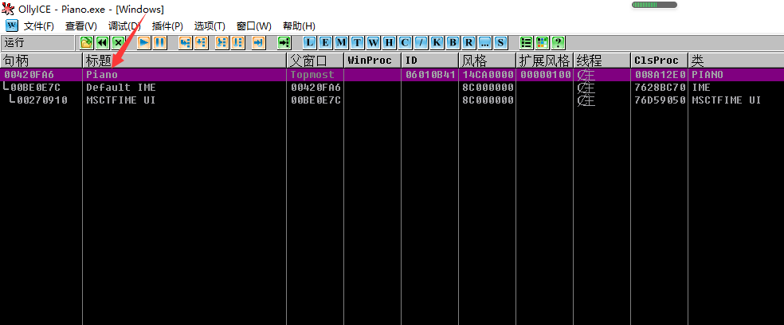

找到处理WM_KEYDOWN消息的那

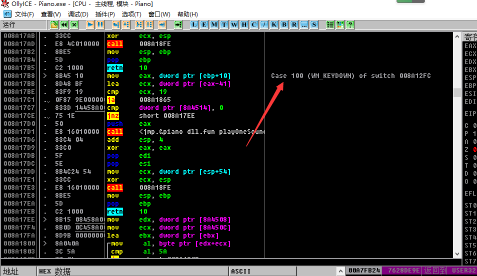

下个断点，然后按键断下来在这

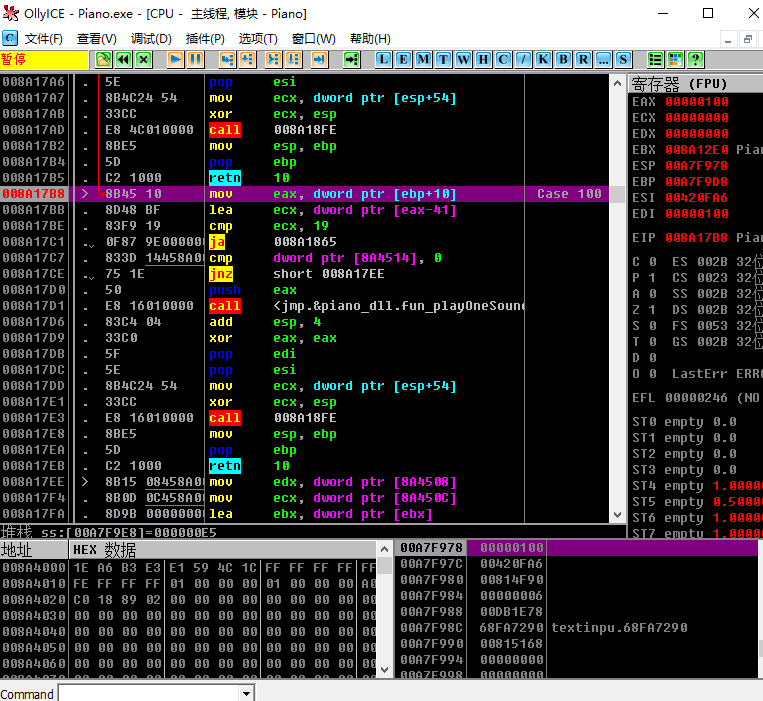


-   分析上图汇编代码：mov eax,dword ptr [ebp+10] 拿wParma
-   lea ecx,dword ptr [eax-41]  ,41的ASSCII为A,这里应该是判断是哪个按键做准备
-    cmp ecx,19    19h->25,0~25为26个数，对应26个字母
-   ja imm        大于则不是字母按键，跳出
-   发出声音功能的函数应该是下面的call <jnp.&oiano_dll.fun_lpayOneSound>
-   然后我们观察该函数，分析其为C调用约定，传入一个参数，push eax
-   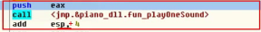
-   该函数参数eax的来源是上面的wParma

我们去写一个win32程序去测试一下

RasAsm创建工程MyPiano


相应地方：;=============包起来的是后加入的代码

```
586
.model flat,stdcall
option casemap:none

   include windows.inc
   include user32.inc
   include kernel32.inc
   
   includelib user32.lib
   includelib kernel32.lib


WinMain proto :DWORD,:DWORD,:DWORD,:DWORD


.data
   ClassName db "MainWinClass",0
   AppName  db "Main Window",0
   g_szPianoDll db "piano_dll",0
   g_szPlayOneSound db "fun_playOneSound",0
   g_pfnPlayOneSound dd 0
   g_hPianoDll dd 0

.data?
   hInstance HINSTANCE ?
   CommandLine LPSTR ?

.code


; ---------------------------------------------------------------------------


start:
	;=============
	invoke LoadLibrary,offset g_szPianoDll
	mov g_hPianoDll,eax
	invoke GetProcAddress,g_hPianoDll,offset g_szPlayOneSound
	mov g_pfnPlayOneSound,eax
	;=============
	
	invoke GetModuleHandle, NULL
	mov    hInstance,eax
	
	invoke GetCommandLine
	mov    CommandLine,eax
	
	invoke WinMain, hInstance,NULL,CommandLine, SW_SHOWDEFAULT
	invoke ExitProcess,eax

WinMain proc hInst:HINSTANCE,hPrevInst:HINSTANCE,CmdLine:LPSTR,CmdShow:DWORD
	LOCAL wc:WNDCLASSEX
	LOCAL msg:MSG
	LOCAL hwnd:HWND
	
	mov   wc.cbSize,SIZEOF WNDCLASSEX
	mov   wc.style, CS_HREDRAW or CS_VREDRAW
	mov   wc.lpfnWndProc, OFFSET WndProc
	mov   wc.cbClsExtra,NULL
	mov   wc.cbWndExtra,NULL
	push  hInstance
	pop   wc.hInstance
	mov   wc.hbrBackground,COLOR_BTNFACE+1
	mov   wc.lpszMenuName,NULL
	mov   wc.lpszClassName,OFFSET ClassName
	
	invoke LoadIcon,NULL,IDI_APPLICATION
	mov   wc.hIcon,eax
	mov   wc.hIconSm,eax
	
	invoke LoadCursor,NULL,IDC_ARROW
	mov   wc.hCursor,eax
	
	invoke RegisterClassEx, addr wc
	INVOKE CreateWindowEx,NULL,ADDR ClassName,ADDR AppName,\
           WS_OVERLAPPEDWINDOW,CW_USEDEFAULT,\
           CW_USEDEFAULT,CW_USEDEFAULT,CW_USEDEFAULT,NULL,NULL,\
           hInst,NULL
	mov   hwnd,eax
	
	invoke ShowWindow, hwnd,SW_SHOWNORMAL
	invoke UpdateWindow, hwnd
	
	.WHILE TRUE
		invoke GetMessage, ADDR msg,NULL,0,0
		.BREAK .IF (!eax)
		invoke TranslateMessage, ADDR msg
		invoke DispatchMessage, ADDR msg
	.ENDW
	
	mov     eax,msg.wParam
	ret
WinMain endp

WndProc proc hWnd:HWND, uMsg:UINT, wParam:WPARAM, lParam:LPARAM
	
	.IF uMsg==WM_DESTROY
		invoke PostQuitMessage,NULL
	.ELSEIF uMsg==WM_CREATE
  .elseif uMsg==WM_KEYDOWN
		;=============
		push wParam
		call g_pfnPlayOneSound
		add esp,4 
		;============= 
	.ELSE
		invoke DefWindowProc,hWnd,uMsg,wParam,lParam		
		ret
	.ENDIF
	
	xor eax,eax
	ret
WndProc endp


end start
```

但是我们发现无论是注入asm和刚刚的这个，都无法让钢琴发出声音，我们在换成  WM_KEYUP和 WM_KEYCHAR 结果跟 WM_KEYDOWN 一样 因此我们打开dll看看其导出函数（之前分析那个函数的所在dll）


猜想可能有所谓的播放环境，可能需要调用其它函数相辅相成

比如需要先调用fun_Create，可能调用时机比较早，我们直接用od调式去对应dll查看名称找该函数。


查看参考


发现只有一个地方式函数调用，我们直接去看看


发现WM_CREATE就调用了，果然如此

因此回到我们的MyPiano的工程中加入对应的,注意要将对应dll及其它可能用到文件都拷贝到工程目录下

值得注意的是fun_Create有一个参数，在上图看出来参数来自esi，可追溯其来源

然后修改为：

```
.586
.model flat,stdcall
option casemap:none

   include windows.inc
   include user32.inc
   include kernel32.inc
   
   includelib user32.lib
   includelib kernel32.lib


WinMain proto :DWORD,:DWORD,:DWORD,:DWORD


.data
   ClassName db "MainWinClass",0
   AppName  db "Main Window",0
   g_szPianoDll db "piano_dll",0
   g_szPlayOneSound db "fun_playOneSound",0
   g_szfun_Create db "fun_Create",0
   g_pfnPlayOneSound dd 0
   g_pnfun_Create dd 0
   g_hPianoDll dd 0

.data?
   hInstance HINSTANCE ?
   CommandLine LPSTR ?

.code


; ---------------------------------------------------------------------------


start:
	;=============
	invoke LoadLibrary,offset g_szPianoDll
	mov g_hPianoDll,eax
	invoke GetProcAddress,g_hPianoDll,offset g_szPlayOneSound
	mov g_pfnPlayOneSound,eax
	invoke GetProcAddress,g_hPianoDll,offset g_szfun_Create
	mov g_pnfun_Create,eax
	;=============
	
	invoke GetModuleHandle, NULL
	mov    hInstance,eax
	
	invoke GetCommandLine
	mov    CommandLine,eax
	
	invoke WinMain, hInstance,NULL,CommandLine, SW_SHOWDEFAULT
	invoke ExitProcess,eax

WinMain proc hInst:HINSTANCE,hPrevInst:HINSTANCE,CmdLine:LPSTR,CmdShow:DWORD
	LOCAL wc:WNDCLASSEX
	LOCAL msg:MSG
	LOCAL hwnd:HWND
	
	mov   wc.cbSize,SIZEOF WNDCLASSEX
	mov   wc.style, CS_HREDRAW or CS_VREDRAW
	mov   wc.lpfnWndProc, OFFSET WndProc
	mov   wc.cbClsExtra,NULL
	mov   wc.cbWndExtra,NULL
	push  hInstance
	pop   wc.hInstance
	mov   wc.hbrBackground,COLOR_BTNFACE+1
	mov   wc.lpszMenuName,NULL
	mov   wc.lpszClassName,OFFSET ClassName
	
	invoke LoadIcon,NULL,IDI_APPLICATION
	mov   wc.hIcon,eax
	mov   wc.hIconSm,eax
	
	invoke LoadCursor,NULL,IDC_ARROW
	mov   wc.hCursor,eax
	
	invoke RegisterClassEx, addr wc
	INVOKE CreateWindowEx,NULL,ADDR ClassName,ADDR AppName,\
           WS_OVERLAPPEDWINDOW,CW_USEDEFAULT,\
           CW_USEDEFAULT,CW_USEDEFAULT,CW_USEDEFAULT,NULL,NULL,\
           hInst,NULL
	mov   hwnd,eax
	
	invoke ShowWindow, hwnd,SW_SHOWNORMAL
	invoke UpdateWindow, hwnd
	
	.WHILE TRUE
		invoke GetMessage, ADDR msg,NULL,0,0
		.BREAK .IF (!eax)
		invoke TranslateMessage, ADDR msg
		invoke DispatchMessage, ADDR msg
	.ENDW
	
	mov     eax,msg.wParam
	ret
WinMain endp

WndProc proc hWnd:HWND, uMsg:UINT, wParam:WPARAM, lParam:LPARAM
	
	.IF uMsg==WM_DESTROY
		invoke PostQuitMessage,NULL
	.ELSEIF uMsg==WM_CREATE
		push hWnd
		call g_pnfun_Create
		add esp,4
	.elseif uMsg==WM_KEYDOWN
		;=============
		push wParam
		call g_pfnPlayOneSound
		add esp,4 
		;============= 
	.ELSE
		invoke DefWindowProc,hWnd,uMsg,wParam,lParam		
		ret
	.ENDIF
	
	xor eax,eax
	ret
WndProc endp


end start

```

-   接下来探究这个钢琴如何触发使用曲子，即那些文本文件所记录的曲子

去od找读文件相关操作

右键反汇编窗口，选择字符串查找，该软件需要用unicode查找才可

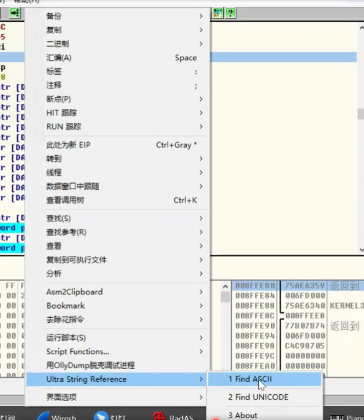

下面这个玩意非常可疑

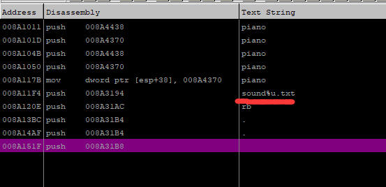

选中回车到对应位置

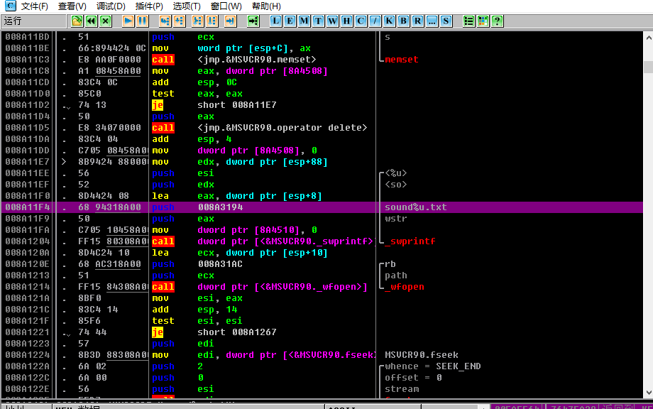


##### 插入od功介绍：选中 call 一行右击转到

可以看到调用这个函数的地方

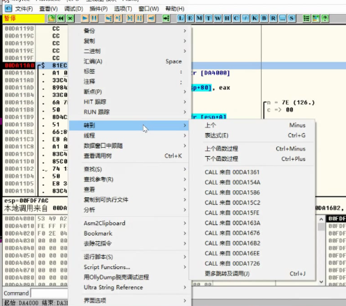

-   

**思路回到打开文件对应函数上**


点击其中一个转到对应调用处


再起上面那个push再来转到


转到的是下面这个jmp，然后再看sub又是哪里跳过来的呢？


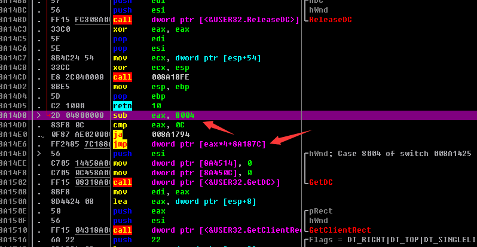转到下面所示的jg 另外一个mov ecx,dword ptr [ebp+10]是commad消息！！！

我们猜测这里应该有拿资源id的操作

利用vs：文件->打开->文件

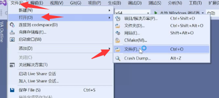

选择该exe


情况如下


点开快捷键查看

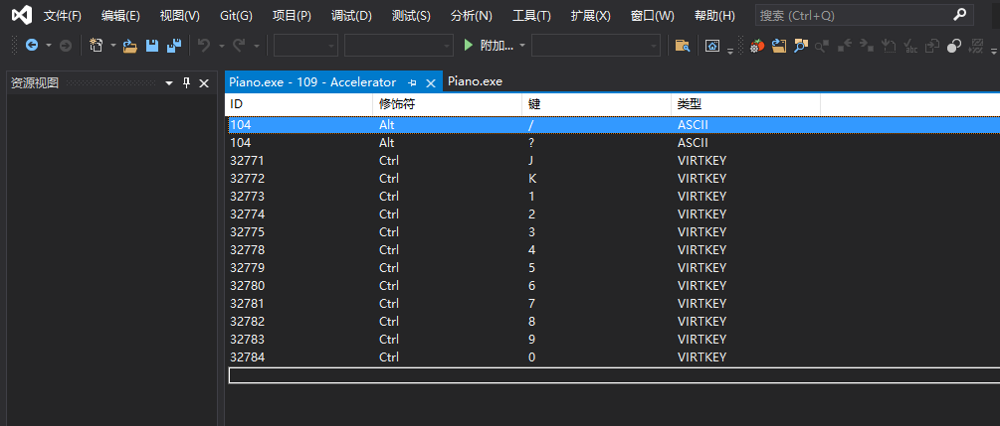

32772->对应上面我们怀疑是拿资源id那个立即数的8004h，十分巧合？

再去回想之前的转到那


去8004h对应要走的地方去下断点，ctrl+K测试

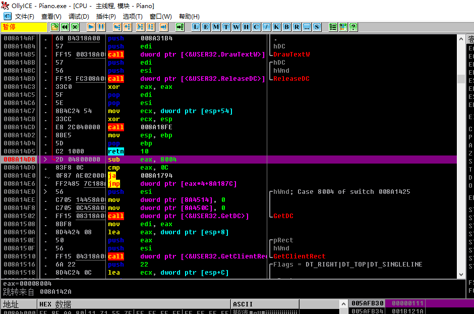

断点果然下来了

但是并没有播放音乐，我们通过断点处往下走观察发现仅仅只是读了数据而已。

我们可以看它把读的东西放到哪里去了。

再去看文件读写那


有用到了全局变量，往它那些如东西，如果别的地方要用到，肯定也要访问全局变量。

##### 如何看那些地方用到了对应的全局变量？选中，右键->查找参考->地址参考


那么只要用到了该全局变量的地方都列举出来了


我们一个个找对应的读操作里面的情况，找到此处有循环，值得注意一下了！！！

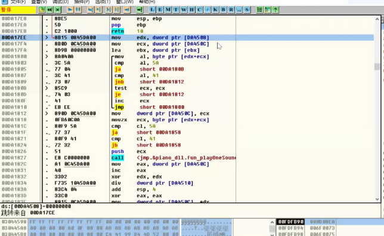

看看它从哪里来的

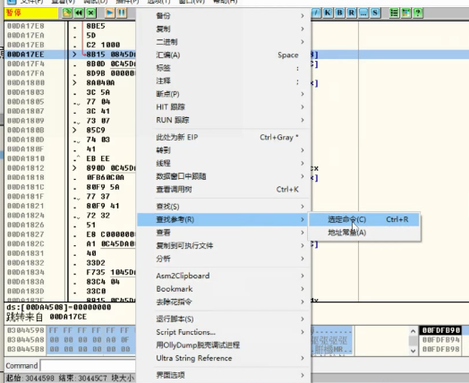

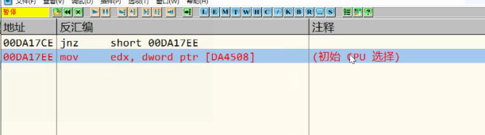

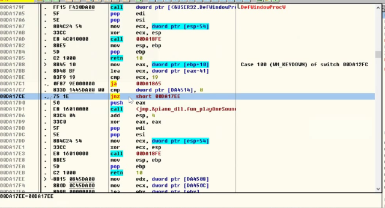

转到这个jnz,发现还是KeyDown消息触发。又有一个全局变量，去看看它


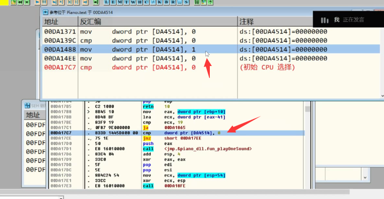

只有一个1，那么就进去看看


来自于8003,32771h ctrl+j

总结：

-   crtl+num  读文件
-   ctrl+j     开启         在右上角画一个点
-   ctrl+k     关闭         取消右上角画的点
-   按任意键即可播放文件曲子

```
.586
.model flat,stdcall
option casemap:none

   include windows.inc
   include user32.inc
   include kernel32.inc
   
   includelib user32.lib
   includelib kernel32.lib


WinMain proto :DWORD,:DWORD,:DWORD,:DWORD


.data
   ClassName     db "MainWinClass",0
   AppName       db "Main Window",0
   g_szDll       db "piano_dll.dll",0        ;要加载的 dll
   g_szPlay      db "fun_playOneSound",0     ;要加在的dll中函数(播放音乐)
   g_szCreate    db "fun_Create", 0          ;要加在的dll中函数(初始化)
   g_pfnCreate   dd 0                        ;函数地址
   g_pfnPlay     dd 0                        ;函数地址

.data?
   hInstance HINSTANCE ?                     ;
   CommandLine LPSTR   ?                     ;

.code


; ---------------------------------------------------------------------------


start:
	invoke GetModuleHandle, NULL
	mov    hInstance,eax
	
	invoke GetCommandLine
	mov    CommandLine,eax
	
	invoke WinMain, hInstance,NULL,CommandLine, SW_SHOWDEFAULT
	invoke ExitProcess,eax

WinMain proc hInst:HINSTANCE,hPrevInst:HINSTANCE,CmdLine:LPSTR,CmdShow:DWORD
	LOCAL wc:WNDCLASSEX
	LOCAL msg:MSG
	LOCAL hwnd:HWND
	LOCAL hDll:HANDLE         ;dll句柄
	
	invoke LoadLibrary, offset g_szDll     ;动态加载dll
	mov hDll, eax                          ;保存dll句柄
	
	invoke GetProcAddress,eax, offset g_szPlay      ;获取函数地址
	mov g_pfnPlay, eax                              ;保存函数地址
	invoke GetProcAddress, hDll, offset g_szCreate  ;获取函数地址
	mov g_pfnCreate, eax                            ;保存函数地址
	
	mov   wc.cbSize,SIZEOF WNDCLASSEX
	mov   wc.style, CS_HREDRAW or CS_VREDRAW
	mov   wc.lpfnWndProc, OFFSET WndProc
	mov   wc.cbClsExtra,NULL
	mov   wc.cbWndExtra,NULL
	push  hInstance
	pop   wc.hInstance
	mov   wc.hbrBackground,COLOR_BTNFACE+1
	mov   wc.lpszMenuName,NULL
	mov   wc.lpszClassName,OFFSET ClassName
	
	invoke LoadIcon,NULL,IDI_APPLICATION
	mov   wc.hIcon,eax
	mov   wc.hIconSm,eax
	
	invoke LoadCursor,NULL,IDC_ARROW
	mov   wc.hCursor,eax
	
	invoke RegisterClassEx, addr wc
	INVOKE CreateWindowEx,NULL,ADDR ClassName,ADDR AppName,\
           WS_OVERLAPPEDWINDOW,CW_USEDEFAULT,\
           CW_USEDEFAULT,CW_USEDEFAULT,CW_USEDEFAULT,NULL,NULL,\
           hInst,NULL
	mov   hwnd,eax
	
	invoke ShowWindow, hwnd,SW_SHOWNORMAL
	invoke UpdateWindow, hwnd
	
	.WHILE TRUE
		invoke GetMessage, ADDR msg,NULL,0,0
		.BREAK .IF (!eax)
		invoke TranslateMessage, ADDR msg
		invoke DispatchMessage, ADDR msg
	.ENDW
	
	mov     eax,msg.wParam
	ret
WinMain endp

WndProc proc hWnd:HWND, uMsg:UINT, wParam:WPARAM, lParam:LPARAM
	
	.IF uMsg==WM_DESTROY
		invoke PostQuitMessage,NULL
	.ELSEIF uMsg==WM_CREATE
	    push hWnd          ;窗口句柄入栈
	    call g_pfnCreate   ;调用播放初始化函数 (c调用约定)
	    add esp, 4         ;自己平栈
    .elseif uMsg == WM_KEYDOWN
        push wParam        ;按下的字符入栈 
        call g_pfnPlay     ;调用播放音乐函数 (c调用约定)
        add esp, 4         ;自己平栈
	.ELSE
		invoke DefWindowProc,hWnd,uMsg,wParam,lParam		
		ret
	.ENDIF
	
	xor eax,eax
	ret
WndProc endp


end start

```

 筛选器异常 

操作系统有个机制,他会把异常通告给我们应用程序,让我们应用程序来处理,异常机制  windows 系统提供了3种,筛选器异常,SEH 结构化异常,veh 向量异常


筛选器异常是一种最终的异常处理方式,当异常发生时,我们可以在程序启动时,我们可以给程序注册一个异常回调函数当异常发生时,系统就会调这个异常函数,让我们有一次处理的机会.


如果我们要处理筛选器异常哦们需要自己写一个处理的函数,然后把这个函数注册到给操作系统,这样操作系统就知道你要处理筛选器,如果没有注册,那么系统默认不处理筛选器异常


 异常派发流程 

 处于调试状态的派发流程 

​         异常出现时,系统首先给 调试器,调试器不处理的话给 应用程序,,应用程序给 SEH, SEH不处理,会再给调试器,调试器不处理优惠给应用程序,应用程序此时会给筛选器,  筛选器也不处理就直接给操作系统了,操作系统此时必须处理,操作系统处理方式就是关闭程序 ,

 处于非调试状态的派发流程 

​        异常出现时,系统首先给  SEH, SEH不处理,就会给筛选器,筛选器也不处理就直接给操作系统了,操作系统此时必须处理,操作系统处理方式就是关闭程序 


筛选器是最后一次应用程序处理异常的机会,因此被称为最终异常

 注册筛选器    SetUnhandledExceptionFilter 

LPTOP LEVEL EXCEPTION FILTER SETUNHANDLEDEXCEPTIONFILTER(

LPTOPLEVELEXCEPTIONFILTER

LPTOP LEVEL EXCEPTION FILTER


参数 :   函数指针  : 自己注册的函数函数指针          返回值   函数指针: 之前注册的函数指针

声明

LONG  SetUnhandledExceptionFilter(   STRUCT _EXCEPTION_POINTERS *ExceptionInfo  );


结构体 EXCEPTION_POINTERS


第一个成员:      异常记录 (异常信息)

第二个成员:      环境记录  (寄存器环境)

异常记录: EXCEPTION_RECORD


成员:        异常码 (异常种类)

​                 标志(不用管)

​                 异常嵌套 (处理异常过程中出现了异常)

​                 异常产生的地址 (EIP)   

​                 产生异常的: 参数数量

​                异常发生时的操作, 0 是 读  1是写 ,第二个是访问异常的地址(意思是你读或写哪个地址时发生了异常)

```
.586
.model flat,stdcall
option casemap:none

   include windows.inc
   include user32.inc
   include kernel32.inc
   
   includelib user32.lib
   includelib kernel32.lib


WinMain proto :DWORD,:DWORD,:DWORD,:DWORD


.data
   g_szTitle db "提示",0
   g_szText  db "异常来了",0

.data?
   hInstance HINSTANCE ?
   CommandLine LPSTR ?

.code


;异常回调函数     参数:结构体指针
MyUnhandledExceptionFilter proc pExceptPointer:ptr EXCEPTION_POINTERS
    
    invoke MessageBox, NULL, offset g_szText, offset g_szTitle, MB_OK
    
    
    ;--------搭配  EXCEPTION_CONTINUE_EXECUTION,不然无法退出程序---------------
    ;---继续执行,即从56行继续执行,又报异常继续回到56行异常处,导致死循环,因此需要跳过56行代码   
   
    mov esi, pExceptPointer              ;获取出现异常的地址
    assume esi:ptr EXCEPTION_POINTERS    ;地址类型类型强转
    mov esi, [esi].ContextRecord  ;获取出现异常环境记录
    assume esi:ptr CONTEXT        ;地址类型类型强转
    add [esi].regEip, 2           ;跳过出现异常的代码,异常代码地址+2
    assume esi:nothing            ;还原类型
    ;-----------------------------
    
    ;mov eax, EXCEPTION_EXECUTE_HANDLER;    - 异常已处理，结束进程
    
    ;mov eax, EXCEPTION_CONTINUE_EXECUTION; -异常已经处理，可以继续执行代码
    
    mov eax, EXCEPTION_CONTINUE_SEARCH;     - 异常我不处理，交给系统处理,跟第一种区别不大
   
   ret
MyUnhandledExceptionFilter endp

start:
    ;注册异常回调函数
    invoke SetUnhandledExceptionFilter,offset MyUnhandledExceptionFilter
    
    mov eax, 1212h
    mov [eax], eax    ;因为1212属于不可访问地址,因此会出现异常 

    invoke MessageBox, NULL, offset g_szText, offset g_szTitle, MB_OK
	invoke ExitProcess,0
end start
```


### 作业

##### 1. 带作弊功能的钢琴

大键盘1是开启

大键盘2是关闭

大键盘3是读取文件

先读取文件  然后再开启。

```
.586
.model flat,stdcall
option casemap:none

include windows.inc
include kernel32.inc
include user32.inc
include Comctl32.inc
include shell32.inc
include msvcrt.inc
include shlwapi.inc

includelib kernel32.lib
includelib user32.lib
includelib Comctl32.lib
includelib shell32.lib
includelib msvcrt.lib
includelib shlwapi.lib


WinMain proto :DWORD,:DWORD,:DWORD,:DWORD


.data
   ClassName db "MainWinClass",0
   AppName  db "Main Window",0
   g_szDll db "piano_dll.dll",0
   g_szPlay db "fun_playOneSound",0
   g_szCreate db "fun_Create", 0
   g_pfnCreate dd 0
   g_pfnPlay dd 0
   g_TestCut dd 0
   g_TestOpenWin  db "打开成功", 0
   g_TestCloseWin  db "关闭成功", 0
   
   g_TestFmt db"1.txt",0
   g_wFileCode        dd  0  
   g_szFileMode       db  "r", 0
   g_FileTest         db 255 dup(0),0
   g_TestChar db 0
   
   g_TestBuf  db 0
   g_TestFlag  db 0
   
.data?
   hInstance HINSTANCE ?
   CommandLine LPSTR ?

.code


start:
	invoke GetModuleHandle, NULL
	mov    hInstance,eax
	
	invoke GetCommandLine
	mov    CommandLine,eax
	
	invoke WinMain, hInstance,NULL,CommandLine, SW_SHOWDEFAULT
	invoke ExitProcess,eax

WinMain proc hInst:HINSTANCE,hPrevInst:HINSTANCE,CmdLine:LPSTR,CmdShow:DWORD
	LOCAL wc:WNDCLASSEX
	LOCAL msg:MSG
	LOCAL hwnd:HWND
	LOCAL hDll:HANDLE
	
	invoke LoadLibrary, offset g_szDll
	mov hDll, eax
	
	invoke GetProcAddress,eax, offset g_szPlay
	mov g_pfnPlay, eax
	invoke GetProcAddress, hDll, offset g_szCreate
	mov g_pfnCreate, eax
	
	mov   wc.cbSize,SIZEOF WNDCLASSEX
	mov   wc.style, CS_HREDRAW or CS_VREDRAW
	mov   wc.lpfnWndProc, OFFSET WndProc
	mov   wc.cbClsExtra,NULL
	mov   wc.cbWndExtra,NULL
	push  hInstance
	pop   wc.hInstance
	mov   wc.hbrBackground,COLOR_BTNFACE+1
	mov   wc.lpszMenuName,NULL
	mov   wc.lpszClassName,OFFSET ClassName
	
	invoke LoadIcon,NULL,IDI_APPLICATION
	mov   wc.hIcon,eax
	mov   wc.hIconSm,eax
	
	invoke LoadCursor,NULL,IDC_ARROW
	mov   wc.hCursor,eax
	
	invoke RegisterClassEx, addr wc
	INVOKE CreateWindowEx,NULL,ADDR ClassName,ADDR AppName,\
           WS_OVERLAPPEDWINDOW,CW_USEDEFAULT,\
           CW_USEDEFAULT,CW_USEDEFAULT,CW_USEDEFAULT,NULL,NULL,\
           hInst,NULL
	mov   hwnd,eax
	
	invoke ShowWindow, hwnd,SW_SHOWNORMAL
	invoke UpdateWindow, hwnd
	
	.WHILE TRUE
		invoke GetMessage, ADDR msg,NULL,0,0
		.BREAK .IF (!eax)
		invoke TranslateMessage, ADDR msg
		invoke DispatchMessage, ADDR msg
	.ENDW
	
	mov     eax,msg.wParam
	ret
WinMain endp

WndProc proc hWnd:HWND, uMsg:UINT, wParam:WPARAM, lParam:LPARAM
	
	.IF uMsg==WM_DESTROY
		invoke PostQuitMessage,NULL
		
	.ELSEIF uMsg==WM_CREATE
	
	    push hWnd
	    call g_pfnCreate
	    add esp, 4
        .elseif uMsg == WM_KEYDOWN
                           
                lea eax,g_TestFlag
                
                .if word ptr[eax] == 0
                          .if wParam =="1"
                        
                           invoke MessageBox,NULL,NULL,offset g_TestOpenWin,MB_OK    
                           lea eax,g_TestFlag
                           mov word ptr[eax],1  
        
                          .elseif wParam == "2"
                        
                             invoke MessageBox,NULL,NULL,offset g_TestCloseWin,MB_OK
                             
                             
                             lea eax,g_TestFlag
                             mov word ptr[eax],0
                           .elseif wParam == "3"
                        
                             ;载入文件 
                             
                             ;打开文件
                             invoke crt_fopen,offset g_TestFmt,offset g_szFileMode
                             mov g_wFileCode,eax
                             ;读文件
                             invoke crt_fgets,offset g_FileTest,255, g_wFileCode
                             
                          .else   
                          
                         
                            
                              push wParam
                              call g_pfnPlay
                              add esp, 4 
                          
                           
                           .endif 
                           
                .else
                        
                     .if wParam != "2" 
                      lea ebx,  g_FileTest
                      mov wParam, ebx 
 
                      
                      
                      push wParam
                      call g_pfnPlay
                      add esp, 4 
                      
                      .else
                             invoke MessageBox,NULL,NULL,offset g_TestCloseWin,MB_OK
                             lea eax,g_TestFlag
                             mov word ptr[eax],0
                              
                      .endif 
                      
                .endif  

                      
                      
                      
                        
                             
                
	.ELSE
		invoke DefWindowProc,hWnd,uMsg,wParam,lParam		
		ret
	.ENDIF
	
	xor eax,eax
	ret
WndProc endp


end start
```

 2. 在筛选器异常处理中dump程序  MiniDumpWriteDump        

```
.586
.model flat,stdcall
option casemap:none

   include windows.inc
   include user32.inc
   include kernel32.inc
   
   include minidump.inc
   
   includelib user32.lib
   includelib kernel32.lib

   includelib dbghelp_x86.lib
  
WinMain proto :DWORD,:DWORD,:DWORD,:DWORD


.data
   g_szTitle db "提示",0
   g_szText  db "异常来了",0
   
   g_szFile  db "info.dump",0

.data?
   hInstance HINSTANCE ?
   CommandLine LPSTR ?

.code


MyUnhandledExceptionFilter proc pExceptPointer:ptr EXCEPTION_POINTERS
    local @hFile:DWORD
    local @hProcess:DWORD
    local @dwProcessId:DWORD


    ;local @bClientPointers:DWORD
    local @pExceptionPointers:DWORD
    local @dwThreadId:DWORD
    mov eax,pExceptPointer
    mov @pExceptionPointers, eax
    ;mov @bClientPointers, 0
    ; 创建文件

    invoke  CreateFile,offset g_szFile,GENERIC_READ or GENERIC_WRITE,FILE_SHARE_READ,NULL,CREATE_ALWAYS,FILE_ATTRIBUTE_NORMAL,NULL
     
    mov @hFile, eax

    invoke GetCurrentProcess
    mov @hProcess, eax
    invoke GetCurrentProcessId
    mov @dwProcessId, eax
    invoke GetCurrentThreadId
    mov @dwThreadId, eax

    invoke MiniDumpWriteDump, @hProcess, @dwProcessId, @hFile, 0, addr @dwThreadId, NULL, NULL
          
    ;--------搭配  EXCEPTION_CONTINUE_EXECUTION,不然无法退出程序---------------
    ;---继续执行,即从56行继续执行,又报异常继续回到56行异常处,导致死循环,因此需要跳过56行代码   
   
    ;mov esi, pExceptPointer              ;获取出现异常的地址
    ;assume esi:ptr EXCEPTION_POINTERS    ;地址类型类型强转
    ;mov esi, [esi].ContextRecord  ;获取出现异常环境记录
    ;assume esi:ptr CONTEXT        ;地址类型类型强转
    ;add [esi].regEip, 2           ;跳过出现异常的代码,异常代码地址+2
    ;assume esi:nothing            ;还原类型
    ;-----------------------------
    
    mov eax, EXCEPTION_EXECUTE_HANDLER;    - 异常已处理，结束进程
    
    ;mov eax, EXCEPTION_CONTINUE_EXECUTION; -异常已经处理，可以继续执行代码
    ;mov eax, EXCEPTION_CONTINUE_SEARCH;     - 异常我不处理，交给系统处理,跟第一种区别不大
    
    ret
MyUnhandledExceptionFilter endp

start:
    ;注册异常回调函数
    invoke SetUnhandledExceptionFilter,offset MyUnhandledExceptionFilter
    
    mov eax, 1212h
    mov [eax], eax

    invoke MessageBox, NULL, offset g_szText, offset g_szTitle, MB_OK
    invoke ExitProcess,0
end start
```

```
.586
.model flat,stdcall
option casemap:none

   include windows.inc
   include user32.inc
   include kernel32.inc
   include msvcrt.inc
   
   includelib user32.lib
   includelib kernel32.lib
   includelib msvcrt.lib


WinMain proto :DWORD,:DWORD,:DWORD,:DWORD


.data
   g_szTitle db "提示",0
   g_szText  db "异常来了",0
   g_szExe db "TestUnh.exe", 0
   g_szDmp db "TestUnh.dmp", 0
   
   g_szDll db "Dbghelp.dll",0
   g_szDump db "MiniDumpWriteDump",0
   g_pfnDump dd 0
   
.data?
   hInstance HINSTANCE ?
   CommandLine LPSTR ?

.code


MyUnhandledExceptionFilter proc pExceptPointer:ptr EXCEPTION_POINTERS
    LOCAL hsnap:HANDLE
    LOCAL pe32:PROCESSENTRY32
    LOCAL pid:DWORD
    LOCAL TestHandle:HANDLE
    LOCAL outFile:HANDLE
    
    invoke CreateToolhelp32Snapshot, TH32CS_SNAPPROCESS, 0
    mov hsnap, eax
    mov pe32.dwSize, size pe32
    invoke Process32First, hsnap, addr pe32
    invoke crt_strcmp, addr pe32.szExeFile, offset g_szExe
    .while eax != 0  
        invoke Process32Next, hsnap, addr pe32
        mov eax, pe32.th32ProcessID
        mov pid, eax
        invoke crt_strcmp, addr pe32.szExeFile, offset g_szExe
    .endw

    invoke OpenProcess, PROCESS_ALL_ACCESS, 0, pid
    mov TestHandle, eax
    invoke CreateFile, offset g_szDmp, GENERIC_ALL, 0, NULL, CREATE_ALWAYS, FILE_ATTRIBUTE_NORMAL, NULL
    mov outFile, eax
    xor ebx, ebx
    mov ebx, 2
    
    push NULL
    push NULL
    push NULL
    push ebx
    push outFile
    push pid
    push TestHandle
    call g_pfnDump
    
    mov eax, EXCEPTION_EXECUTE_HANDLER; - 异常已处理，结束进程
    ;mov eax, EXCEPTION_CONTINUE_EXECUTION;-异常已经处理，可以继续执行代码
    ;mov eax, EXCEPTION_CONTINUE_SEARCH; - 异常我不处理，交给系统处理
    ret
MyUnhandledExceptionFilter endp

start:
    ;注册异常回调函数
    invoke SetUnhandledExceptionFilter,offset MyUnhandledExceptionFilter
    
    ;获取dump函数地址
    invoke LoadLibrary, offset g_szDll
	
	invoke GetProcAddress,eax, offset g_szDump
	mov g_pfnDump, eax

    
    mov eax, 1212h
    mov [eax], eax

    invoke MessageBox, NULL, offset g_szText, offset g_szTitle, MB_OK
	invoke ExitProcess,0
end start

```

原文链接：https://www.bpsend.net/thread-180-1-1.html
