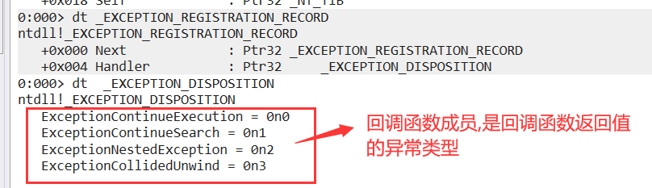
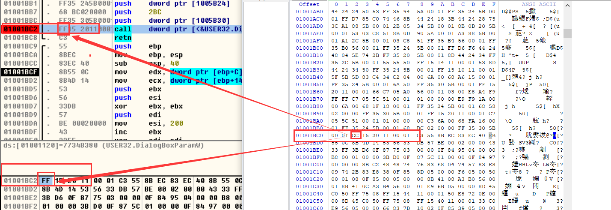

### SEH - structed exception handler 结构化异常处理

跟筛选一样都是用来处理异常的,但不同的是  筛选器是整个进程最终处理异常的函数,但无法做到比较精细的去处理异常(例如处理某个函数的异常), 跟 C++ 的  try { } catch {  } 的思路一脉相承, SHE 实现的 就是 函数自己 来处理自己的异常,实现方式就是通过回调函数实现的,把回调函数注册给操作系统,当你函数内部出现异常时,系统就会调用你的回调函数,此时就可以处理了,处理完之后可以继续执行代码或者把异常交给筛选器	


因此要使用SHE只需要做2件事,1是自己实现异常回调函数,2是吧异常回调函数注册给系统


把函数注册给系统的方式就是  把函数地址 存到 fs:[0]  就可以了


可以看到  偏移为0 的位置 是一个异常链 表, , 记录的是一个结构体指针

因此我们需要构造一个结构体 , 把 函数地址 放到   Handler



回调函数声明在 msdn 是没有定义,这是微软没有文档化的函数,但是在微软 C 库的 实现用了,可以直接到里面去搜


参数:    第一个  异常记录 (异常信息)     第二个 不用管      第3个环境记录  (寄存器环境)     第4个也可以不用管

第2个和第4个是给嵌套异常和展开异常用的

声明


第3个和第四个也是给 嵌套异常 和展开异常用的

```
.586
.model flat,stdcall
option casemap:none

   include windows.inc
   include user32.inc
   include kernel32.inc
   
   includelib user32.lib
   includelib kernel32.lib


;构造结构体 异常回调函数结构体
EXCEPTION_REGISTRATION_RECORD struc
    Next dd 0           ;调用这异常回调函数函数结构体指针
    Handler dd 0        ;当前异常回调函数地址  
EXCEPTION_REGISTRATION_RECORD ends

.data
   g_szF0 db "F0",0
   g_szF1  db "F1",0

.code
    assume fs:nothing   ;对fs的类型进行强转
    
    
;处理 F1 异常的回调函数 
F1Handler proc uses esi pER:ptr EXCEPTION_RECORD, pFrame:dword, pContext:ptr CONTEXT, pDC:dword
    
    invoke MessageBox, NULL, offset g_szF1, NULL, MB_OK
    
    ;ExceptionContinueExecution, - 程序继续执行
    ;ExceptionContinueSearch,    - 此异常我不处理，交给其它处理
    
    ;异常交给F0 的 异常回调函数处理
    mov eax, ExceptionContinueSearch     ;返回异常处理方式 不然会直接退出
    ret
F1Handler endp    


  
;产生异常函数  F1  
F1 proc
    LOCAL @err:EXCEPTION_REGISTRATION_RECORD
    LOCAL @dwOldSeh:dword    ;原先的过程函数地址
    
    
    ;保存调用者的异常回调函数
    mov eax, fs:[0]
    mov @dwOldSeh, eax  
    
    ;保存调用者回调函数地址 到 next,不然无法找到调用者异常函数处理的地址
    mov eax, fs:[0]
    mov @err.Next, eax   
    
    ;注册异常回调
    mov @err.Handler, offset F1Handler
    lea eax, @err
    mov fs:[0], eax
    
    ;产生异常
    xor esi, esi
    div esi
    
    ;卸载SEH   还原过程函数(不然 F0 产生的异常会又回来)
    mov eax, @dwOldSeh
    mov fs:[0], eax
    
    ret
F1 endp    
    
;处理 F0 异常的回调函数
F0Handler proc pER:ptr EXCEPTION_RECORD, pFrame:dword, pContext:ptr CONTEXT, pDC:dword
    
    invoke MessageBox, NULL, offset g_szF0, NULL, MB_OK
   
    ;处理 F1 产生的除0异常   
    assume esi:ptr EXCEPTION_RECORD   ;类型强转
    mov esi, pER      ;将 异常信息 pER 给  esi  
   
    .if [esi].ExceptionCode == EXCEPTION_INT_DIVIDE_BY_ZERO   ;如果是除0异常
    
        ;处理，跳过产生异常的代码
        mov esi, pContext
        assume esi:ptr CONTEXT
        add [esi].regEip, 2    ;除0指令是2个字节   regEip 是返回的地址
        assume esi:nothing
        
        mov eax, ExceptionContinueExecution   ;返回异常处理方式 不然会直接退出
        ret
    .endif
    assume esi:nothing
    
    ret
F0Handler endp


;产生异常函数  F0
F0 proc
    LOCAL @err:EXCEPTION_REGISTRATION_RECORD
    LOCAL @dwOldSeh:dword
    
    ;保存调用者的异常回调函数
    mov eax, fs:[0]
    mov @dwOldSeh, eax
    
    ;保存调用者回调函数地址 到 next,不然无法找到调用者异常函数处理的地址
    mov eax, fs:[0]
    mov @err.Next, eax
    
    ;注册异常
    mov @err.Handler, offset F0Handler ;存入异常回调函数地址
    
    lea eax, @err
    mov fs:[0], eax
    
    invoke F1
    
    ;产生异常
    mov eax, 1211h
    mov [eax], eax
    
    ;卸载SEH
    mov eax, @dwOldSeh
    mov fs:[0], eax
    ret
F0 endp


start:
    invoke F0
    xor eax, eax
	invoke ExitProcess,eax
end start

```


异常链  :  SEH链    尾结点是系统默认的异常函数处理地址


但是我们一般不会像上面写


因为结构体是2成员,     一个是调用者的异常回调函数信息结构体地址 , 一个是自己的异常回调函数地址,都是 4字节

那么我们只需要在栈上  push 2个 dword(2个地址指针)   ,就可以了

```
.586
.model flat,stdcall
option casemap:none

   include windows.inc
   include user32.inc
   include kernel32.inc
   
   includelib user32.lib
   includelib kernel32.lib

.data
   g_szF0 db "F0",0
   g_szF1  db "F1",0

.code
    assume fs:nothing
    
F1Handler proc uses esi pER:ptr EXCEPTION_RECORD, pFrame:dword, pContext:ptr CONTEXT, pDC:dword
    
    invoke MessageBox, NULL, offset g_szF1, NULL, MB_OK

    ;ExceptionContinueExecution, - 程序继续执行
    ;ExceptionContinueSearch, - 此异常我不处理，交给其它处理
    mov eax, ExceptionContinueSearch
    ret
F1Handler endp    
    
F1 proc
    ;注册SEH
    push offset F1Handler             ; handler push 自己异常回调函数的地址
    push fs:[0] ;next                 ;push 调用者异常处理结构体信息地址
    mov fs:[0], esp                   
    ;注册回调函数,移位此时esp 存的就是结构体首地址
    
    xor esi, esi
    div esi
    
    ;卸载SEH
    pop fs:[0]          ;把 next 弹回 fs:[0]           
    add esp, 4          ;平栈,因为自己的异常回调函数地址不需要弹栈,直接丢弃

    ret
F1 endp    
    

F0Handler proc pER:ptr EXCEPTION_RECORD, pFrame:dword, pContext:ptr CONTEXT, pDC:dword
    invoke MessageBox, NULL, offset g_szF0, NULL, MB_OK
    
    assume esi:ptr EXCEPTION_RECORD
    mov esi, pER
    
    .if [esi].ExceptionCode == EXCEPTION_INT_DIVIDE_BY_ZERO
    
        ;处理，跳过产生异常的代码
        mov esi, pContext
        assume esi:ptr CONTEXT
        add [esi].regEip, 2
        assume esi:nothing
        
        mov eax, ExceptionContinueExecution
        ret
    .endif
    assume esi:nothing
    
    ret
F0Handler endp

F0 proc
    ;注册异常
    ; | next      | <--esp
    ; | Fohandler | 
        
    push offset F0Handler ;handler    ;push 自己异常回调函数的地址
    push fs:[0] ;next                 ;push 调用者异常处理结构体信息地址
    mov fs:[0], esp                   ;注册回调函数,移位此时esp 存的就是结构体首地址
    
    invoke F1
    
    ;产生异常
    mov eax, 1211h
    mov [eax], eax
    
    ;卸载SEH   
    pop fs:[0]          ;把 next 弹回 fs:[0]           
    add esp, 4          ;平栈,因为自己的异常回调函数地址不需要弹栈,直接丢弃
    
    ret
F0 endp


start:
    invoke F0
    xor eax, eax
	invoke ExitProcess,eax
end start

```

### 反调试

一切阻止调试的方法都被称为反调试


在 OD 或者 x32Dbg  中下断点时,他会插入一行代码,但在调试器中看不出来的   那就是把这一行指令在内存的第一个字节改成了  CC  (int 3)



当 TF 被置位 为 1 时  ,执行一行代码 就会 抛出异常,抛出异常之后就会恢复为 0,因此可以不断通过 改变 TF 位,来判断每一行代码,判断是否被下断点

```
.586
.model flat,stdcall
option casemap:none

   include windows.inc
   include user32.inc
   include kernel32.inc
   
   includelib user32.lib
   includelib kernel32.lib

.data
   g_szCaption db "友情提示",0
   g_szText  db "你干嘛调试我？",0
   g_szText2 db "结束了", 0
   g_ddEnd dd 0        ;函数结束地址

.code
    assume fs:nothing
    
FuncTest proc
    ;存储
    mov g_ddEnd, offset ENDTF  ;保存函数结束位置
    
    ;设置TF标志位  (将值置为1 就会抛异常)
    pushfd
    or dword ptr [esp], 100h
    popfd

    xor eax, eax
    xor eax, eax
    xor eax, eax
    xor eax, eax
    xor eax, eax
    xor eax, eax
    xor eax, eax
    xor eax, eax
    xor eax, eax
    xor eax, eax
    xor eax, eax
    xor eax, eax
    xor eax, eax
    xor eax, eax

ENDTF:
    ret

FuncTest endp
    
;异常回调函数,将 TF 置位
F0Handler proc uses esi edi pER:ptr EXCEPTION_RECORD, pFrame:dword, pContext:ptr CONTEXT, pDC:dword
    
    assume esi:ptr EXCEPTION_RECORD
    mov esi, pER
    
    mov edi, pContext
    assume edi:ptr CONTEXT
    
    ;判断
    mov eax, [edi].regEip
    .if byte ptr [eax] == 0cch   ;指令的第一个字节是CC 说明被调试
        ;被设置断点了
        invoke MessageBox, NULL, offset g_szText, offset g_szCaption, MB_OK
        invoke ExitProcess, 0    ;退出进程
    .endif
    
    ;结束
    mov eax, g_ddEnd
    .if [edi].regEip == eax    ;程序结束, TF就不需要置位了
        mov eax, ExceptionContinueExecution
        ret
    .endif
    
    ;继续设置TF标志位
    or [edi].regFlag, 100h
    mov eax, ExceptionContinueExecution

    assume edi:nothing
    assume esi:nothing
    
    ret
F0Handler endp

F0 proc
    ;注册异常
    ; | next      | <--esp
    ; | Fohandler | 
    push offset F0Handler ;handler
    push fs:[0] ;next
    mov fs:[0], esp
    
    invoke FuncTest
    

    ;卸载SEH
    pop fs:[0]
    add esp, 4
    
    ret
F0 endp


start:
    invoke F0
    
    invoke MessageBox, NULL , offset g_szText2, NULL, MB_OK
    
    xor eax, eax
	invoke ExitProcess,eax
end start
```

对于部分调试器,他会接收所有异常,这种处理方式就是  把 主要代码放在异常中实现


异常很多时候都被用作反调试


对抗反调试的方法:

把代码分成多块,每块做加密,执行每块代码之前 先进异常还原,还原之后再进异常变成加密状态,因为不解密前面的代码,无法知道后面的代码去哪

处理方法:代码追踪,把执行的每一行代码记录下来


把代码放到堆里面,在堆里面执行完再回到代码区,这样代码追踪就失效了,因为重启地址就变了


### 作业

#####   使用异常解密代码，并检查断点

```
.586
.model flat,stdcall
option casemap:none

   include windows.inc
   include user32.inc
   include kernel32.inc
   
   includelib user32.lib
   includelib kernel32.lib


.data
    g_szCaption db "友情提示",0
    g_szText2 db "结束了", 0

.code

Data proc

;   jmp DATA_CODE
;   g_szSuccess db "Success",0
;   g_szOk  db "你就是我要找的人",0
;   g_szFail db "Fail",0
;   g_szNo db "我喜欢守规矩的人",0
;
;
;DATA_CODE:
;
;    invoke MessageBox, NULL,offset g_szOk, offset g_szSuccess, MB_OK
;    
;    invoke ExitProcess,0
    
    


    array1 DB 0DAh, 1Eh
    g_szSuccess db 62h, 44h, 52h, 52h, 54h, 42h, 42h, 31h
    g_szOk db 0F5h, 0D2h, 8Fh, 0FCh, 0FBh, 0F6h, 0FFh, 0E3h, 0E3h, 9Bh, 0E4h, 0E3h, 84h, 0F5h, 0F9h, 0FAh, 31h
    g_szFail db  77h, 50h, 58h, 5Dh, 31h
    g_szNo db  0FFh, 0E3h, 0FEh, 83h, 8Ah, 87h, 0FBh, 0E9h, 88h, 0D7h, 8Fh, 0E9h, 84h, 0F5h, 0F9h, 0FAh, 31h
    array2 db 5Bh, 31h, 59h, 33h, 21h, 71h, 31h, 59h, 3Bh, 21h, 71h, 31h, 5Bh, 31h, 0D9h,
    043h, 30h, 31h, 31h, 5Bh, 31h, 0D9h, 040h, 30h, 31h, 31h
    
    
Data endp


; 加密数据
EnData proc uses ebx ecx pBuf:DWORD, ddSize:DWORD
    LOCAL @ddOldProtect:DWORD
    
    invoke VirtualProtect,offset Data, 1, PAGE_EXECUTE_READWRITE,addr @ddOldProtect
    
    mov ebx, pBuf
    mov ecx, 0
    
    .while 1
        
        
        xor byte ptr [ebx + ecx], 31h
        
        inc ecx
        
        .if ecx == ddSize
            ret
        .endif
        
    .endw
    
    invoke VirtualProtect,offset Data, 1, @ddOldProtect,addr @ddOldProtect
    
    ret

EnData endp

DecodeData proc uses ebx ecx pBuf:DWORD, ddSize:DWORD
    LOCAL @ddOldProtect:DWORD
    
    invoke VirtualProtect,offset Data, 1, PAGE_EXECUTE_READWRITE,addr @ddOldProtect
    
    mov ebx, pBuf
    mov ecx, 0
    
    .while 1
        
        
        xor byte ptr [ebx + ecx], 31h
        
        inc ecx
        
        .if ecx == ddSize
            ret
        .endif
        
    .endw
    
    invoke VirtualProtect,offset Data, 1, @ddOldProtect,addr @ddOldProtect
    
    ret  
    
DecodeData endp


Func_except_handler proc uses edx ebx esi pExceptionRecord:ptr EXCEPTION_RECORD, pEstablisherFrame:dword, pContextRecord:ptr CONTEXT, pDispatcherContext:dword
    
    
    mov edx, pExceptionRecord
    assume edx:ptr EXCEPTION_RECORD
    
    mov ebx, pContextRecord
    assume ebx:ptr CONTEXT
    
    .if [edx].ExceptionCode == EXCEPTION_ACCESS_VIOLATION
        
        ; 跳过内存访问异常的指令
        add [ebx].regEip, 6
        
        ; 解密
        mov eax, offset EnData - offset Data
        invoke DecodeData, offset Data, eax
        
        ; 设置单步
        or [ebx].regFlag, 100h
        
        
    .elseif [edx].ExceptionCode == EXCEPTION_SINGLE_STEP
        
        ; 判断是否有 CC
        mov esi,[ebx].regEip
        .if byte ptr [esi] == 0cch
            
            ; 有 CC ， 退出
            invoke MessageBox, NULL, offset g_szFail, offset g_szNo, MB_OK
            invoke ExitProcess, 0
            
        .elseif byte ptr [esi] == 0c3h
            
            ; 如果是 ret 则不再继续设置单步
        
        .else
            
            ; 没有 CC ,设置单步
            
            ; 设置单步
            or [ebx].regFlag, 100h          
                        
        .endif
        
    .endif
    assume ebx:nothing
    assume edx:nothing
    
    mov eax, ExceptionContinueExecution ; 继续执行
    ret

Func_except_handler endp


; ---------------------------------------------------------------------------
WinMain proc

    ; 注册SEH
    assume fs:nothing
    push offset Func_except_handler
    push fs:[0]
    mov fs:[0], esp
    

	; 自己抛异常
	xor eax, eax
	mov dword ptr [eax], 0
	
	
    invoke Data
    
    
    invoke MessageBox, NULL, offset g_szCaption, offset g_szText2, MB_OK
	
	; 卸载SEH
	pop fs:[0]
	add esp, 4
	
	mov     eax,0
	ret
WinMain endp

start:

	invoke WinMain
	invoke ExitProcess,eax


end start

```

