### 筛选器异常插件

被调试程序:  [📎TestUnh.zip](./TestUnh.zip) 

我们用OD条试试发现,无法断下 筛选器异常

异常产生之后    异常首先会给调试器       调试器不处理就会给 SEH  ,  SEH 不处理的话有又给调试器, 调试器不处理的话就会给筛选器  ,   筛选器不处理的就会给操作系统,直接退进程

这里面是2次的异常派发流程     第一次 是 到 给SHE      之后属于第二次 派发流程

第二次派发是一个分支,会判断是否有调试器,有的话就给调试器,没有的话直接给筛选器,因此系统会检查软件是否处于调试状态  即检查调试端口是否存在,如果存在,异常就会给调试器,否则给筛选器,所以我们在用 OD 调试筛选器异常时,是不可能再筛选器这下断点的,因此系统检测到了调试器,异常就不会给筛选器 

因此我们可以欺骗系统,告诉系统,不存在调试器,直接给筛选器,因此我们需要找到 异常派发时,系统在哪判断是否有调试器存在的,找到后我们可以更改判断结果 或者跳转 的地方 

这个在 msdn中有明确的说明     UnhandledExceptionFilter   来判断的

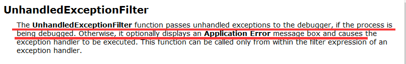


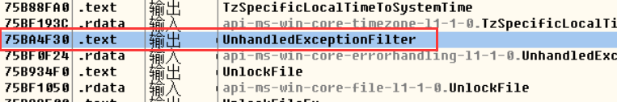


接下来我们只需要  更改条件跳转  ,看 筛选器异常能否断下来 ,就可以判断是在哪  判断是否有 调试器的

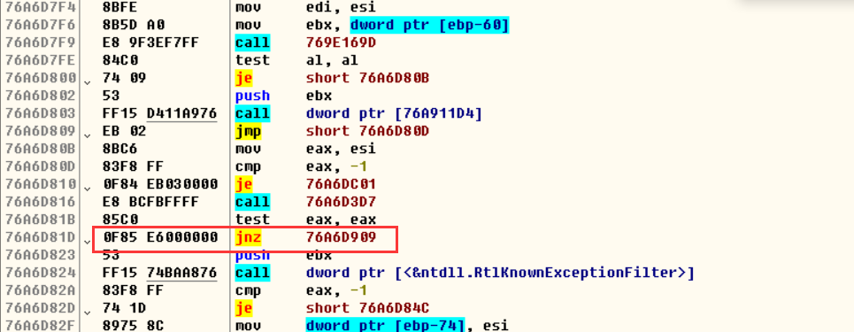

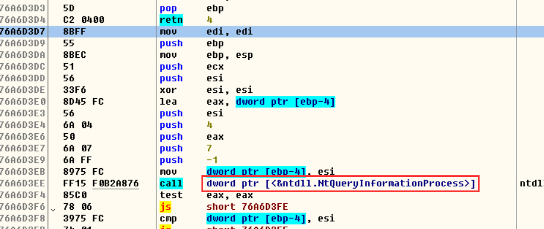


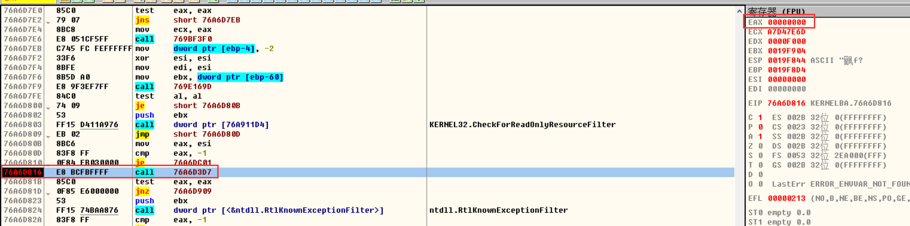

跳过测试可知,当  call 函数 返回值 为0  就可以收到 筛选器异常,为1就无法收到,那么位置我们已经找到了,接下来我们只需要改    判断 函数下一行   把 eax 的值 改为0  就可以  收到 筛选器异常了  即改成  xor   eax,eax


因此我们只需要写一个插件让他自己去改


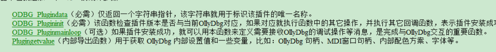

接下来就是写插件了

```
#include <windows.h>
#include "Plugin.h"


int ODBG_Plugindata(char* shortname) {

    strcpy_s(shortname, 32,"筛选器异常修复");
    return PLUGIN_VERSION;

}


int ODBG_Plugininit(int ollydbgversion, HWND hw, ulong* features) {


    return 0;
}
```

生成解决方案时

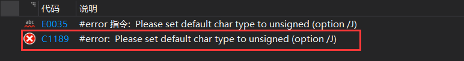

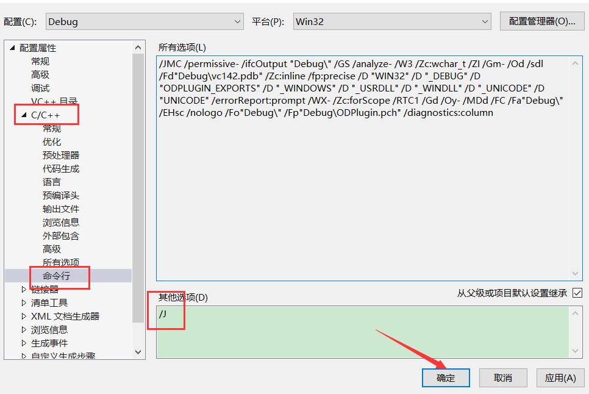

把生成的 dll 放到指定目录,再打开 OD,发现我们的插件已经 加载进来了

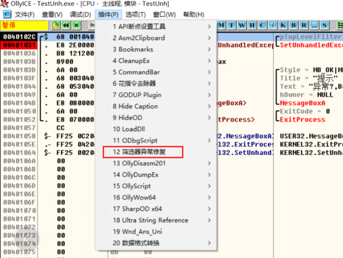 

既然插件可以识别那下面就是增加功能了


我们的目标把红框的代码改成  xor ,eax,eax   即 把  76A6D810 处的 值 改成  33  ,如果直接写固定地址,那么电脑重启后dll 的路径就发生过了改变,即 该处地址也变化了,Name插件也用不了了,因此我们需要用相对地址,可以函数地址+偏移  或者  模块地址 + 偏移

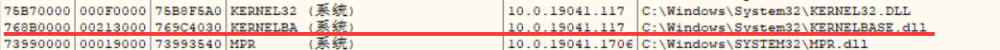

我们可以看到  kernelbase 的 地址是  768B0000   那么 跟   76A6D81B   的偏移值位为   0x1BD81B

```
#include <windows.h>
#include "Plugin.h"

void  FixUnHandledException();

int ODBG_Plugindata(char* shortname) 
{
    strcpy_s(shortname, 32,"筛选器异常修复");
    FixUnHandledException() ;
    return PLUGIN_VERSION;

}


int ODBG_Plugininit(int ollydbgversion, HWND hw, ulong* features) 
{
    return 0;
}

void  FixUnHandledException() 
{
    //1.定位 test eax,eax的地址
    HMODULE hKernelbase = GetModuleHandle("Kernelbase");   
    LPBYTE pDst = (LPBYTE)hKernelbase + 0x1BD81B;
    //2.修改   test eax,eax  位 xor eax,eax
    DWORD dwOldPro = 0;

    //修改内存属性
    VirtualProtect(pDst, 1, PAGE_EXECUTE_READWRITE, &dwOldPro);
    *pDst = 0x33;
    //还原内存属性
    VirtualProtect(pDst, 1, dwOldPro, &dwOldPro);
}
```


运行发现并没有被修改,猜想可能是因为 修改的太早,程序还没有运行

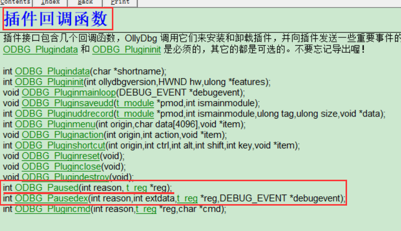


```
#include <windows.h>
#include "Plugin.h"

void  FixUnHandledException();
int ODBG_Paused(int reason, t_reg* reg);


int ODBG_Plugindata(char* shortname) 
{
    strcpy_s(shortname, 32,"筛选器异常修复");
    
    return PLUGIN_VERSION;

}


int ODBG_Plugininit(int ollydbgversion, HWND hw, ulong* features) 
{
    return 0;
}

int ODBG_Paused(int reason, t_reg* reg)
{
    if (reason == PP_EVENT)
    {
        FixUnHandledException();
    }
    return 1;
}

void  FixUnHandledException() 
{
    //1.定位 test eax,eax的地址
    HMODULE hKernelbase = GetModuleHandle("Kernelbase");   
    LPBYTE pDst = (LPBYTE)hKernelbase + 0x1BD81B;
    //2.修改   test eax,eax  位 xor eax,eax
    DWORD dwOldPro = 0;

    //修改内存属性
    VirtualProtect(pDst, 1, PAGE_EXECUTE_READWRITE, &dwOldPro);
    *pDst = 0x33;
    //还原内存属性
    VirtualProtect(pDst, 1, dwOldPro, &dwOldPro);

    //用于判断dll有没有被加载
    MessageBox(NULL, "这是我的插件", "提示", MB_OK);
}
```

调试发现还是没改成功

那是因为 OD 调试时有2个进程 , 我们修改时 修改的是 OD 的进程 , 并没有修改到被调试的进程,但是地址是对的,因为在同一台电脑, kernelbase 的 地址是固定的 ,      因此我们需要跨进程修改 内存  OD 提供了 对应的 api

内存函数

结构

OILYDBG为被调试程序保存了一份已分配内存块的信息表,它由TMG

MEMORY

MEMORY*FINDMEMORY(ULONG ADDR);

VOID HAVECOPYOFMEMORY(CHAR *COPY,ULONG BASE,ULONG SIZE);

ULONG READMEMORY(VOID *BUF.ULONG ADDR.ULONG SIZE.INT MODE):

WRITEMEMORY(VOID*BUF ULONG ADDR,ULONG SIZE,INT MODE):

ULONG W

INT LISTMEMORY(VOID);


```
#include <windows.h>
#include "Plugin.h"

#pragma comment(lib,"Ollydbg.lib")
void  FixUnHandledException();
int ODBG_Paused(int reason, t_reg* reg);


int ODBG_Plugindata(char* shortname) 
{
    strcpy_s(shortname, 32,"筛选器异常修复");  
    return PLUGIN_VERSION;

}


int ODBG_Plugininit(int ollydbgversion, HWND hw, ulong* features) 
{
    return 0;
}

int ODBG_Paused(int reason, t_reg* reg)
{
    if (reason == PP_EVENT)
    {
        FixUnHandledException();
    }
    return 1;
}

void  FixUnHandledException() 
{
    //1.定位 test eax,eax的地址
    HMODULE hKernelbase = GetModuleHandle("Kernelbase");   
    LPBYTE pDst = (LPBYTE)hKernelbase + 0x1BD81B;
   
#if 0
    //2.修改   test eax,eax  位 xor eax,eax
    DWORD dwOldPro = 0;
    //修改内存属性
    VirtualProtect(pDst, 1, PAGE_EXECUTE_READWRITE, &dwOldPro);
    *pDst = 0x33;
    //还原内存属性
    VirtualProtect(pDst, 1, dwOldPro, &dwOldPro);
#endif // 0

    BYTE btCode = 0x33;
    Writememory(&btCode, (ulong)pDst, 1, MM_SILENT);

    //用于判断dll有没有被加载
    ;MessageBox(NULL, "这是我的插件", "提示", MB_OK);
}
```


再次调试,可以发现我们成功修改了,筛选器异常也可以成功调试了 


上面虽然成功了,但是兼容性还存在问题,要求二进制文件必须是一样,但是不同的电脑,编译出来的二进制文件是可能不一样的,到时兼容性还是出问题,这种处理方式是搜机器码, 先找到特征码(离修改代码最近的唯一值) ,再去寻找要修改的代码,不然直接搜要修改代码可能会有多个  ,类似于切割出指定字符串


### 窗口过程函数地址错误

OD 如果没有安装修复插件啊,有些 窗口的过程函数地址是错误的      看雪下载的已经修复


获取过程函数的地址有2种

一种是通过   GetWindowLong  获得     一种是通过  GetClassLong  

通过OD 调  OD  对   GetWindowLong   和   GetClassLong   下断点

可以知道是通过   GetClassLongA 拿到的,因此可以猜想 是因为     GetClassLongA   拿的是 多字节的窗口过程函数 而Unicode 窗口 获取 过程函数需要用  GetClassLongW,因此只需要在获取 Unicode 窗口  过程函数是是 用 GetClassLongW 就可以了

跟窗口相关的函数都在  user32 里面 ,跟界面相关的 都在 user32 里面


调试可知  GetClassLong 调取的都是该处的 GetClassLongA ,因此我们只需要改动这里就可以了


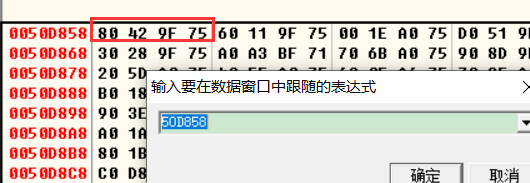

jmp是一个间接调,先取地址,在跳到目标位置,因此我们改该处地址就可以了,

我们自己可以实现一个 MyGetClassLong  然后把地址传过来这样他就会调我们的函数,我们只需要做一下判断是 多字节窗口还是 Unicode 就可以了

该处地址的我们还是可以 通过算偏移得到 ,因为 OD 版本一样,所以偏移也是一样的


所以偏移是    0x0050D858 - 0x00400000 =  0x0010D858

```
#include <windows.h>
#include "Plugin.h"

#pragma comment(lib,"Ollydbg.lib")
void  FixUnHandledException();
int ODBG_Paused(int reason, t_reg* reg);
void FixGetClassLong();

int ODBG_Plugindata(char* shortname) 
{
    strcpy_s(shortname, 32,"筛选器异常修复");  
    return PLUGIN_VERSION;

}


int ODBG_Plugininit(int ollydbgversion, HWND hw, ulong* features) 
{
    FixGetClassLong();
    return 0;
}

int ODBG_Paused(int reason, t_reg* reg)
{
    if (reason == PP_EVENT)
    {
        FixUnHandledException();
    }
    return 1;
}

void  FixUnHandledException() 
{
    //1.定位 test eax,eax的地址
    HMODULE hKernelbase = GetModuleHandle("Kernelbase");   
    LPBYTE pDst = (LPBYTE)hKernelbase + 0x1BD81B;
   
#if 0
    //2.修改   test eax,eax  位 xor eax,eax
    DWORD dwOldPro = 0;
    //修改内存属性
    VirtualProtect(pDst, 1, PAGE_EXECUTE_READWRITE, &dwOldPro);
    *pDst = 0x33;
    //还原内存属性
    VirtualProtect(pDst, 1, dwOldPro, &dwOldPro);
#endif // 0

    BYTE btCode = 0x33;
    Writememory(&btCode, (ulong)pDst, 1, MM_SILENT);

    //用于判断dll有没有被加载
    //MessageBox(NULL, "这是我的插件", "提示", MB_OK);
}

LONG MyGetClassLong(HWND hWnd,int nIndex)
{
    if (IsWindowUnicode(hWnd))  // 判断一个窗口是否是 unicode窗口
    {
        return GetClassLongW(hWnd, nIndex);
    }
    else
    {
        return GetClassLongA(hWnd, nIndex);
    }


}

void FixGetClassLong()
{
    //1.定位地址
    HMODULE Hod = GetModuleHandle(NULL);  //获取主模块基址(OD)
    LPDWORD pAddr =(LPDWORD)((LPBYTE)Hod + 0x10D858);

    //2.修改为自己的地址
    DWORD dwOldPro = 0;
    //修改内存属性
    VirtualProtect(pAddr, 1, PAGE_EXECUTE_READWRITE, &dwOldPro);
    *pAddr = (DWORD)MyGetClassLong;
    //还原内存属性
    VirtualProtect(pAddr, 1, dwOldPro, &dwOldPro);

}
```

调试会发现会崩, 代码没崩,但是运行了一段时间就崩一般情况下是栈歪了

经过调试,还有2个参数在栈上


系统的api 一般都是标准调用约定,  但是我们自己的代码需要自己去平栈, 因此要改动调用约定  改成 stdcall

```
#include <windows.h>
#include "Plugin.h"

#pragma comment(lib,"Ollydbg.lib")
void  FixUnHandledException();
int ODBG_Paused(int reason, t_reg* reg);
void FixGetClassLong();

int ODBG_Plugindata(char* shortname) 
{
    strcpy_s(shortname, 32,"筛选器异常修复");  
    return PLUGIN_VERSION;

}


int ODBG_Plugininit(int ollydbgversion, HWND hw, ulong* features) 
{
    FixGetClassLong();
    return 0;
}

int ODBG_Paused(int reason, t_reg* reg)
{
    if (reason == PP_EVENT)
    {
        FixUnHandledException();
    }
    return 1;
}

void  FixUnHandledException() 
{
    //1.定位 test eax,eax的地址
    HMODULE hKernelbase = GetModuleHandle("Kernelbase");   
    LPBYTE pDst = (LPBYTE)hKernelbase + 0x1BD81B;
   
#if 0
    //2.修改   test eax,eax  位 xor eax,eax
    DWORD dwOldPro = 0;
    //修改内存属性
    VirtualProtect(pDst, 1, PAGE_EXECUTE_READWRITE, &dwOldPro);
    *pDst = 0x33;
    //还原内存属性
    VirtualProtect(pDst, 1, dwOldPro, &dwOldPro);
#endif // 0

    BYTE btCode = 0x33;
    Writememory(&btCode, (ulong)pDst, 1, MM_SILENT);

    //用于判断dll有没有被加载
    //MessageBox(NULL, "这是我的插件", "提示", MB_OK);
}

LONG WINAPI MyGetClassLong(HWND hWnd,int nIndex)
{
    if (IsWindowUnicode(hWnd))  // 判断一个窗口是否是 unicode窗口
    {
        return GetClassLongW(hWnd, nIndex);
    }
    else
    {
        return GetClassLongA(hWnd, nIndex);
    }
}

void FixGetClassLong()
{
    //1.定位地址
    HMODULE Hod = GetModuleHandle(NULL);  //获取主模块基址(OD)
    LPDWORD pAddr =(LPDWORD)((LPBYTE)Hod + 0x10D858);

    //2.修改为自己的地址
    DWORD dwOldPro = 0;
    //修改内存属性
    VirtualProtect(pAddr, 1, PAGE_EXECUTE_READWRITE, &dwOldPro);
    *pAddr = (DWORD)MyGetClassLong;
    //还原内存属性
    VirtualProtect(pAddr, 1, dwOldPro, &dwOldPro);

}
```

再去调试,发现可以获取正确的 窗口过程函数地址了


x32dbg 也可以写插件

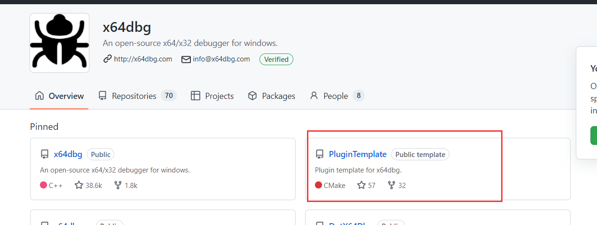


### 作业

#####    修复OD不能断筛选器异常的bug，兼容win10和win7。

思路,先定位到函数入口,再去找特征码 , 再去搜要修改的代码, 直到  ret 结束

win10 和 win7 特征码不一样,需要分别设定

```
#include <windows.h>
#include "Plugin.h"
#include <string>

#pragma comment(lib,"Ollydbg.lib")
void  FixUnHandledException();
int ODBG_Paused(int reason, t_reg* reg);
void FixGetClassLong();
void  FixUnHandledExceptionByKey();

using namespace std;
string getSystemName()
{
    string vname;
    //先判断是否为win8.1或win10
    typedef void(__stdcall* NTPROC)(DWORD*, DWORD*, DWORD*);
    HINSTANCE hinst = LoadLibrary("ntdll.dll");
    DWORD dwMajor, dwMinor, dwBuildNumber;
    NTPROC proc = (NTPROC)GetProcAddress(hinst, "RtlGetNtVersionNumbers");
    proc(&dwMajor, &dwMinor, &dwBuildNumber);

    if (dwMajor == 10 && dwMinor == 0)	//win 10
    {

        return "Win10";
    }

    SYSTEM_INFO info;                //用SYSTEM_INFO结构判断64位AMD处理器  
    GetSystemInfo(&info);            //调用GetSystemInfo函数填充结构  
    OSVERSIONINFOEX os;
    os.dwOSVersionInfoSize = sizeof(OSVERSIONINFOEX);
#pragma warning(disable:4996)
    if (GetVersionEx((OSVERSIONINFO*)&os))
    {

        //下面根据版本信息判断操作系统名称  
        switch (os.dwMajorVersion)
        {                        //判断主版本号  

        case 6:
            switch (os.dwMinorVersion)
            {

            case 1:
                if (os.wProductType == VER_NT_WORKSTATION)
                {
                    return "Win7";
                }
                break;
            }
            break;
        default:
            vname = "未知操作系统";
        }

    }
    return vname;
}

int ODBG_Plugindata(char* shortname) 
{
    strcpy_s(shortname, 32,"筛选器异常修复");  
    return PLUGIN_VERSION;

}


int ODBG_Plugininit(int ollydbgversion, HWND hw, ulong* features) 
{
    FixGetClassLong();
    return 0;
}

int ODBG_Paused(int reason, t_reg* reg)
{
    if (reason == PP_EVENT)
    {
        //FixUnHandledException();
        FixUnHandledExceptionByKey();
    }
    return 1;
}

void  FixUnHandledExceptionByKey() 
{
    string strSystemName = getSystemName();   //判断系统
    string strModule;
    
    if (strSystemName == "Win10")
    {
        strModule = "Kernelbase";
    }else  if (strSystemName == "Win10")
    {
        strModule = "Kernel32";
    }
    //1.定位 test eax,eax的地址
    HMODULE hKernelbase = GetModuleHandle(strModule.c_str());
   
    LPBYTE pAddr = (LPBYTE)GetProcAddress(hKernelbase, "UnhandledExceptionFilter");
    BYTE bDate= *pAddr;
    BOOL isGetSing = FALSE;
    //0x8BC683F8   特征码
    //0x85         要修改的代码
    //0x33         修改后的代码
    //0xC3         结束
    while (bDate == 0xC3) {
       DWORD dwSignature = (DWORD)*pAddr;
        
        //有问题,2个系统特征码不一样,需要分别设置
       if (dwSignature == 0x8BC683F8)
       {
           isGetSing = TRUE;
       }
       pAddr++;
       bDate = *pAddr;
       if (isGetSing)
       {
           if (bDate == 0x85)
           {
               BYTE btCode = 0x33;
               Writememory(&btCode, (ulong)pAddr, 1, MM_SILENT);
               return;
           }
       }
    }
}


void  FixUnHandledException()
{
    //1.定位 test eax,eax的地址
    HMODULE hKernelbase = GetModuleHandle("Kernelbase");
    LPBYTE pDst = (LPBYTE)hKernelbase + 0x1BD81B;

#if 0
    //2.修改   test eax,eax  位 xor eax,eax
    DWORD dwOldPro = 0;
    //修改内存属性
    VirtualProtect(pDst, 1, PAGE_EXECUTE_READWRITE, &dwOldPro);
    *pDst = 0x33;
    //还原内存属性
    VirtualProtect(pDst, 1, dwOldPro, &dwOldPro);
#endif // 0

    BYTE btCode = 0x33;
    Writememory(&btCode, (ulong)pDst, 1, MM_SILENT);

    //用于判断dll有没有被加载
    //MessageBox(NULL, "这是我的插件", "提示", MB_OK);
}

LONG WINAPI MyGetClassLong(HWND hWnd,int nIndex)
{
    if (IsWindowUnicode(hWnd))  // 判断一个窗口是否是 unicode窗口
    {
        return GetClassLongW(hWnd, nIndex);
    }
    else
    {
        return GetClassLongA(hWnd, nIndex);
    }
}

void FixGetClassLong()
{
    //1.定位地址
    HMODULE Hod = GetModuleHandle(NULL);  //获取主模块基址(OD)
    LPDWORD pAddr =(LPDWORD)((LPBYTE)Hod + 0x10D858);

    //2.修改为自己的地址
    DWORD dwOldPro = 0;
    //修改内存属性
    VirtualProtect(pAddr, 1, PAGE_EXECUTE_READWRITE, &dwOldPro);
    *pAddr = (DWORD)MyGetClassLong;
    //还原内存属性
    VirtualProtect(pAddr, 1, dwOldPro, &dwOldPro);

}
```

