### 游戏基址

#### 游戏基址的概念

-   游戏基址是保持恒定的两部分内存地址的一部分并提供一个基准点，从这里可以计算一个字节数据的位置。基址伴随着一个加到基上的偏移值来确定信息准确的位置（绝对地址）。
-   根据结构体成员特性：向下找偏移，向上推地址。

#### 全局基址 一级基址 二级基址 三级基址的关系

-   第一步：计算机内存一般分为四级存储。
-   第二步：在最底下的，往往是游戏的全局基址(决定用户界面以及一些细节等)和一些响应用户操作而对应实施的命令。
-   第三步：该是传递基址了。现在网游的基址往往是动态的。这个是因为底层的基址不会直接传递给上一级内存。它会加上一个偏移量，然后再传递。这个传递就是指针了。
-   第四步：当传递到第四层的时候，就会表现在游戏的用户界面。
-   "----->"表示"指针指向"：

-   -   基址(存放的内容是一级基址起始地址)----->一级基址(存放的内容是二级基址的起始地址:假定为a)；
    -   [一级基址(a) + 偏移量]----->二级基址(存放的内容是三级基址的起始地址:假定为b)；
    -   [二级基址(b)+偏移量]----->三级基址；
    -   三级基址-------->游戏界面。

-   自己制作游戏修改器必须要找到一级基址。
-   注意：对于单机游戏 ，游戏基址是不变的。对网络游戏， 更新时可能会变。（因此才会有游戏更新后，某外挂不可以使用。其本质可能是基址改变的。）

-   问题：基址无非就是一块内存，同时基址又不可以改变，如果计算机中该块内存被占用了，然后再安装基址为0x006A9EC0的游戏，此时会不会写入失败，造成无法安装呢？
-   解析：不会，基址0x006A9EC0是虚拟内存，会经过页面地址重地位，将虚拟地址转换成本机的物理地址，即不存在地址冲突问题。即使十个游戏的基址都是0x006A9EC0都不会存在冲突问题。

### 

### CE用法

#### 第一关：下载并安装CE

一、先下载CE ，打开CE目录下的2个文件：

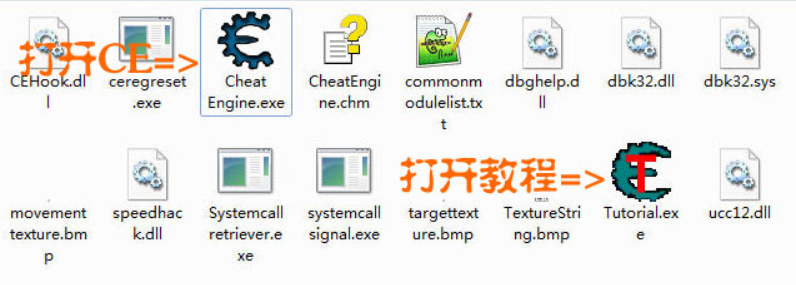

三、附加进程（图示）：

操作到此就结束了。这个教程就是如此简单，下一关同样如此。

#### 第二关：精确扫描

紧接着，我们继续第二关，第二关的作用还是很简单的，主要目的是遍历出我们想要的动态数据，比如角色的生命，人物的魔法，某火线上飞刀的搜索等，都会用到精确扫面，可以说这一关是既简单又实用的东西

教程第二关，需要扫描的精确数值是100

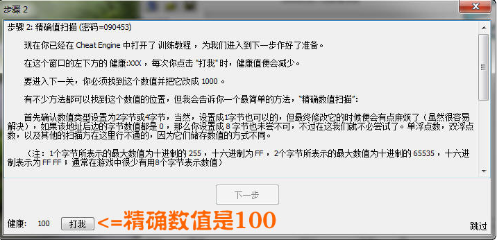

现在开始搜索精确数值 100   数值中输入 **100** 点击 **首次扫描** 按钮

一般游戏就是4字节，这里不需要改动，默认就好。
这次扫描我们得到 59 个结果，里面肯定有我们要找的那个血值，不过好像太多了。

关键一步：回到 Tutorial 点击 **打我** 按钮，此时血值已有变化了：

我们再输入 96 点击 **再次扫描** 按钮 结果只剩1个（这就是我们要找的），我们双击此地址将其添加到地址栏：

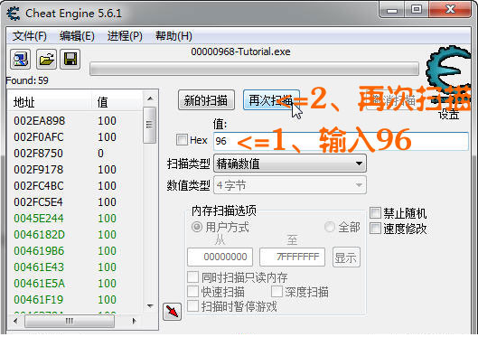

只有1个结果了，这个就是我们要找的内存地址，双击将其加入到地址栏

图示操作：

把 **95 改成 1000** 点击 **确定** 按钮

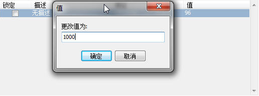

此时教程的 **下一步** 按钮变成可用

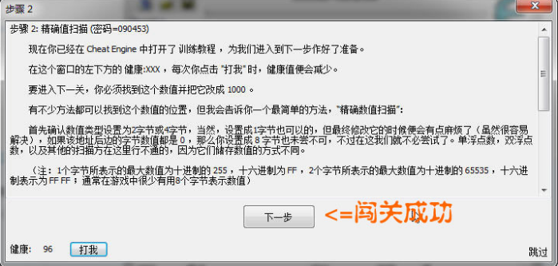

闯关成功。

#### 第三关：未知数值扫描

第三关，主要用来搜索进度条，任务血条等，我们无法直接看到的数据，我们通过变更的数据一步步找到动态地址

第3关的密码是 419482
这一关很重要，因为某些游戏中血显示的不是数字而是血条，这样的话教程2中的方法就失效了。
本关就你要教会你如何修改这些讨厌的未知数

此时点击 **新扫描** 然后选择 **未知初始数值**

点击 首次扫描 然后出现了肯定是N多的结果，因为太多了，CE没有显示出来。

老办法，回到 Tutorial ，点击**打我** ，CE会告诉你血量减了多少，比如-1
这里面我们换个思路，假设CE没告诉我减少了多少或者我根本没看清，这时应该怎么办呢？注意看下面的操作

**一、扫描减少的数值**

下拉框，选择减少了的数值，按再次扫描（此时血量减少了）

**二、扫描不变的数值**

然后选择 没变动的数值（此时血量没有变化）

**三、反复操作**

再回到Tutorial ，点击 打我 => 扫描减少了的数值 => 扫描没变动的数值 反复操作，最后就会只剩14个地址

**四、简单判断**

简单判断下（Tutorial中告诉你了这个数值是小于500的），很容易就找到了最终的地址。

双击把地址加到地址栏，然后更改数值为5000，就可以过关了（前面教程有说过，这里就不再重复了）闯关成功。

大家一定要明白这样操作的思路：

**血量减少=>CE搜索减少的数值**
**血量不变=>CE搜索不变的数值**
**血量增加=>CE搜索增加的数值**

这样反复筛减，就能很容易找到最终的结果。

#### 第四关：浮点数的搜索过程 

第4关的密码是 890124
这一关的操作和前面和基本相同，主要是介绍一下什么浮点数：
浮点数就是带小数点的数字

如何扫描呢：
1、首先将数值类型改成 浮点数。
2、浮点数扫描时不必输入后的小数 94.444 扫描时输入94就可以了
其它的操作和前面的基本相同。

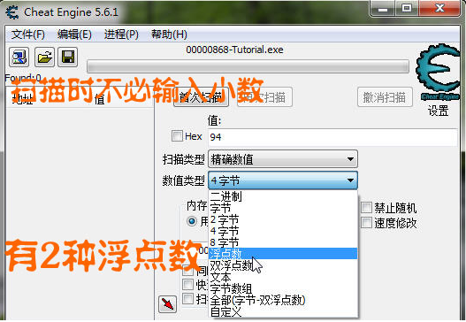

大家也注意到了（上图），浮点数也分为2种：
1、浮点数 也叫单精度浮点数 英文是Single Float
2、双浮点数 也叫双精度浮点数 英文是Double Float

这里面要强调的是：
浮点数的长度是4字节，使用4字节也可搜索到浮点数，但需要使用模糊搜索。
下图：

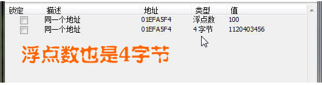

双浮点数的长度是8字节，使用8字节也可搜索到浮点数，但需要使用模糊搜索

*
**小技巧：
**1、双击图中红圈处可快速更改数值类型。*

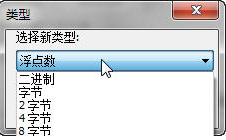

2、浮点数在4字节中大多以11开头。

现在好多游戏都采用浮点数来处理，比如[疯狂农场](http://www.cr173.com/k/fknc/)中的时间。例如您在扫描游戏时发现一个数值是 1120403456 这时候您就要想到它是浮点数。
4字节的 1120403456 = 浮点数的 100
目前的游戏大多以4字节（含浮点数）为主，双浮点数大家知道就行了。

将 血 和 子弹 都改成 5000 就可进入下一关，操作和第二关基本相同。

#### 第五关：代码替换

本关的目的就是要让改变数值的按钮失效，很神奇，但是有什么用呢？

1、在游戏中我们可以利用此功能使金钱数量不会发生变化。
2、可以利用此功能让怪物攻击失效，从而实现无敌的效果。
3、让弹药不会减少，从而实现无限弹药的效果

好处太多了，本关的方法就可以轻松实现上面的功能。

先找到血量的内存地址，不会找的先去看前面几关，这里就不重复了，然后 在地址上 **右键=>找出是什么改写了这个地址**：

点击**确定**

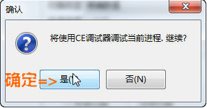

弹出一个小窗口

然后点击教程中的 **改变数值** 按钮

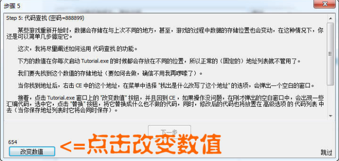

小窗口中会出现一行代码，选中代码，然后点击**替换**

最后一步：直接按**确定**就可以

然后回到 按**改变数值的按钮**，你会发现按钮已经没有用了。本关操作已经结束了

操作非常简单，但是为什么这样就会使按钮的功能失效：

改变数值按钮其实是通过 代码 0045aecb - 89 10 - mov [eax],edx 来实现数值改变的。
我们在的最后一步操作就是要把这行代码替换成什么也不做（英文是 Nop），这样就会让按钮的功能失效。

#### 第六关：关于指针

为什么要找指针，在前面的教程中，如果各位细心观察的话就会发现 在我截图中的出现地址和你的地址并不相同。
也就是说，这些地址是一直在变化的，我们把它叫做动态地址。

问题：电脑是如何每次都知道这个动态地址究竟是多少的？

其实并不是所有的地址都会变化的，不会变化的地址，我们把它叫做基址。

实现思路：用不变的地址定位会变化的地址，即用基址定位动态地址。

上面介绍了2个简单的概念，现在开始我们的具体操作 

首先**找到血量的地址**，加入到地址栏，然后在地址上按 **右键=>找出是什么改写了这个地址**，然后点击 **改变数值** 按钮，出现一行代码（见第五关），**双击那行代码**（或者点击详细信息）

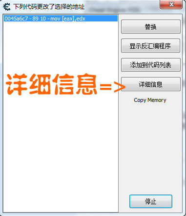

然后出现一个信息框，具体的代码是什么意思就不解释了，CE会告诉你下一步该做什么，图：

CE让我们下一步找 **01da6d48**(在你电脑显示可能不是这个地址，因为它是动态地址)，继续操作：

回到CE，**点击新扫描**，先**勾上HEX**，点击**首次扫描**

**一定要勾上HEX**，否则CE在搜索16进制字母时会报错。

搜索结果出来了：

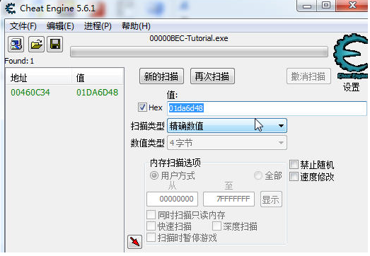

这个地址 460c34 显示的是 绿色 的，你的电脑上也应该是这个地址，因为**它就是基址**。

记住：**在CE中显示绿色的地址是基址，黑色的地址是动态地址

****添加指针：**

点击 **手动添加地址**

图示操作，输入 **460c34** 然后点击**确定**

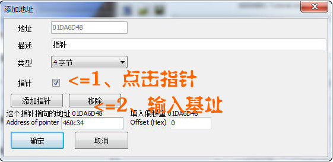

注意看：指针在地址栏显示的是 **p-> 地址** 这种类型的

我们将**数值改成5000**，再点击前面的**锁定**

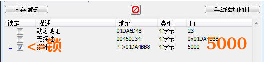

然后点击 Tutorial 中的 **改变指针** 按钮，这关就可以过了。

**注意**

前面一个概念没有说明，添加指针的时候出现，就是**偏移**，这个指针的偏移就是 0。

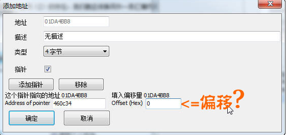

这一关相当重要，大家一定要多多练习（学会前六关，你已经可以修改大部分的游戏了）

**小说明：**

1、并不是所有的游戏都要找基址然后做指针，有的游戏直接就是基址

2、基址是绿色的，如果找到最后有多个绿色地址，在一般情况下选择第1个

**最后介绍下CE中的模块地址：**

**双击基址**

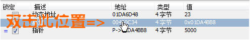

您会发现显示的竟然是 Tutorial.exe+60C34 而不是  00460c34 这是为什么呢？

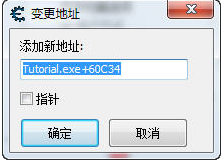

其实 Tutorial.exe+60C34 就等于 00460c34 

一般来说游戏在电脑中申请的地址是从00400000开始的，Tutorial.exe代表的就是 00400000 然后加上 60c34 自然就等于  00460c34。

但是在某些情况下游戏的起始地址并不是从00400000开始的，或者说每次启动申请的地址都不相同；那么就不能用 00460c34 来添加指针了，真正科学添加指针的方法是：

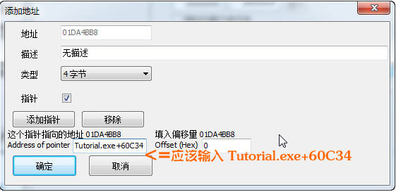

#### 第七关：简单的代码注入

从本关开始，各位会初步接触到CE的反汇编功能，这也是CE最强大的功能之一。在第6关的时候我们说到指针的找法，用基址定位动态地址。但这一关不用指针也可以进行修改，即使对方是动态地址，且功能更加强大。

看看教程让我们做什么：原来每按一次按钮减少1点血，改成每按一次按钮增加2点血。
还记得第5关的不伤血的修改方法吗？这一关就是第5关的加强版。

查找血量的地址，然后再地址上 **右键=> 查找写入的地址**

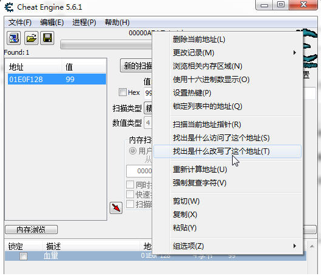

然后按一下**打我**按钮，会出现一行汇编代码 **0045a063 - ff 8b 10 03 00 00 - dec [ebx+00000310]**

双击那行代码，看下详细信息：

这行代码什么意思呢？dec 大家都知道是英文**减少**的意思

图示红框处：**EBX=01e0ee18**

我们用计算器算一下（注意是16进制的）

**01e0ee18 + 310  = 01E0F128 正好是血量的地址**

**dec [ebx+00000310] = dec [01E0F128]** 够清楚了吧，这就是让血量减1的代码（1省略了），其实CE中也有提示 Decrement by 1 。

明白了这行代码的意思，我们回去看看Tutorial的要求：把减1改成加2。

继续操作。**选择反汇编程序**

点击工具，**选择自动汇编**

第一步 **选择作弊框架代码**

第二步 **选择代码注入**

对应的地址不要搞错了，是**0045A063**

然后按**确定**，会自动生成汇编代码，这些代码是什么意思，我们先不管，找到关键的一行：**dec [ebx+00000310]**

把代码注释掉（删除也行），**改成 add [ebx+00000310],2**

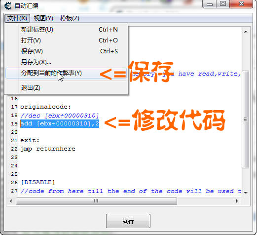

**保存即可**，然后在地址栏就可以看到这个脚本了，点击前面的 单选框 执行，然后点击Tutorial中的打我，这关就可以过了。

**你感觉到他的神奇了吗？逆天级的修改：**

**1、怪物每次打我从伤血变成加血。**
**2、子弹越打越多。**
**3、钱越花越多。**

**如果你学会了这一关，你已经脱离菜鸟的行列了，不要再提金山游侠，FPE，GM8之类的修改工具了，告诉你们的朋友快来学习CE吧**

**最后，再强调一下CE中的模块地址：**

在第6关的后面有提到过CE的模块地址，我说过这是科学的添加方法。这一关也同样适用，就是在代码注入的时候。

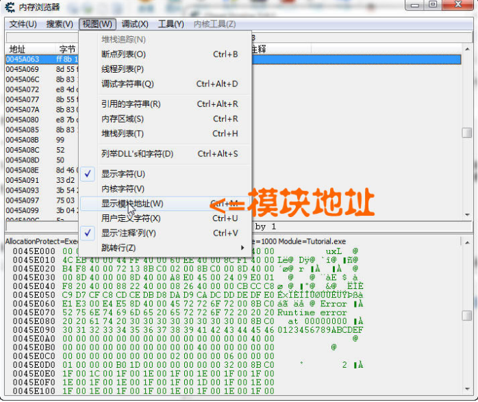

**0045A063 变成了 Tutorial.exe+5A063**

注入的时候也应该是

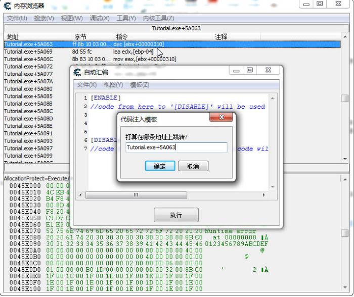

**小技巧：**

这种方法并不是百试百灵的，对于某些变态的游戏可能并不好使。如何判断这种方法是否有效呢？很简单：
在上面选中 **显示模块地址** 后，如果 0045A063 变成了 Tutorial.exe+5A063 说明这种方法好使。反之如果 0045A063 还是 0045A063 则说明这种方法失效了。至于为什么，你以后会明白。

当然CE也有解决的方法，有兴趣的话，大家可以学习下大象教程4中的 Aobscan。

学会此关，您已经可以对付绝大部分的游戏了。

#### 第八关：多级指针

这关是第6关的加强版，CE 5.6.1教程中的4级指针比5.4的要简单些。

多级指针就像玩解谜游戏一样，谜团不只一个，盒子中还有盒子。这里面是4级指针，游戏中也有比如8级指针，12级指针等等，思路都是一样的。

**查找一级指针：**

找到血量地址 01E13B3C （动态地址），然后**右键 => 查找写入**

然后点击**改变 数值按钮**

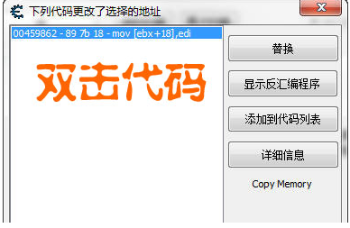

出现代码的详细信息。

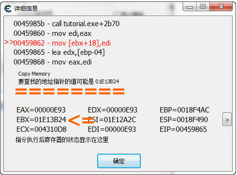

这个该怎么看呢？EBX = 01E13B24 

EBX + 18 =  01E13B3C 就是血量的地址，也就是说。想找到血量的地址就要找到EBX（01E13B24 ），注意看了图中一行字：

要查找地址的指针的**可能**值是 01E13B24 

如果您觉得分析太麻烦，就按CE的建议来，这里面要提醒各位注意 可能 这个词，也就是说不一定全对。

第6关也提到过偏移的概念。这里面的一级偏移是 **18

**

**查找二级指针：**

下面**找EBX，勾上HEX（16进制），输入 01E13B24 新扫描**。

然后把新地址 01E136D4 添加到地址栏，在地址上**右键=>选择 查找访问的地址**。

一定要注意：这里面和上面的操作不同，第一次是查找写入的地址，这次选择的是**查找访问的地址**。

如果没有出现代码信息。我们就到 Tutorial 中点击一下 **改变数值** 按钮

这里分析和上面一样的，直接看CE的建议就好了。二级偏移是 **0

**

**查找三级指针：**

再搜索  01E136D4 得到 01E12414

在地址01E12414上 **右键=>选择 查找访问的地址**

如果没有出现代码信息。我们就到 Tutorial 中点击一下 **改变数值** 按钮

三级偏移是 **14 

**

**查找四级指针：**

重复操作（和前面一样，该找什么CE会告诉你的）

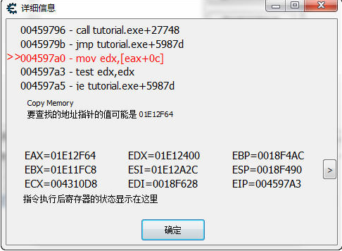

4级偏移是 **c**

再查找 1e12f64 得到一个绿色地址，这就是最终结果了。

一定要记住：**在CE中显示绿色的地址是基址，黑色的是动态地址。如果有多个绿色地址，一般情况下我们选择第一个。

****最后添加指针**

点击**手动添加地址** 

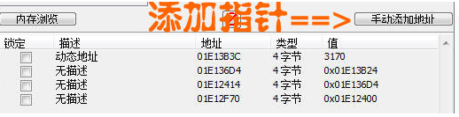

如下操作

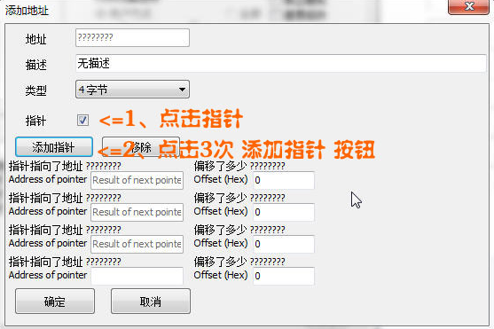

输入基址和偏移：

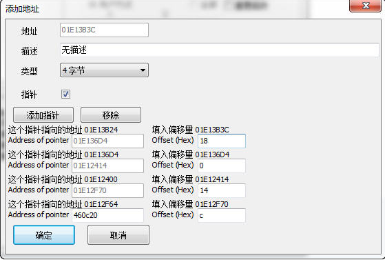

这样输入才完全对（第6关和第7关有提到模块地址的概念）：

然后把数值改成5000，点击前面的锁定，再点击 Tutorial 改变指针按钮，这关就可以过了。

**多级指针要注意的地方：**

1、1级指针是 查找写入，其余全是 查找访问。
2、绿色的地址是基址，黑色是动态地址。
3、添加指针时注意用模块地址。
指针是由基址在偏移组成的，所以在教程中我们只要找到4个偏移和1个基址就可以了。

## 

###  修改阳光

1.  通过工具CE暴力搜索内存，符合值的变化，即可得到阳关的地址，但是这样会存在一个弊端，就是下次启动的时候，可能该地址就不是一个有效值，或者阳光所在的值。
2.  查找基地址 + 偏移 = 阳光的值

1.  1.  查看访问阳光值的 基址 + 偏移，得到上一层的结构体地址，搜索该地址，查看该地址是否为 基址 + 偏移的形式访问的，如果是，证明还有上一层，则继续查找，当查找到与程序基址相关的内存访问的时候，证明该基址是可用的。

1.  得到 游戏基址定位到阳光的指针，修改指针的值即可。

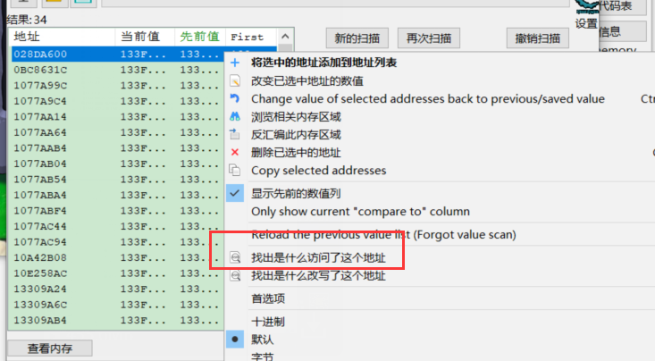

CE会把全局变量地址用绿色表示

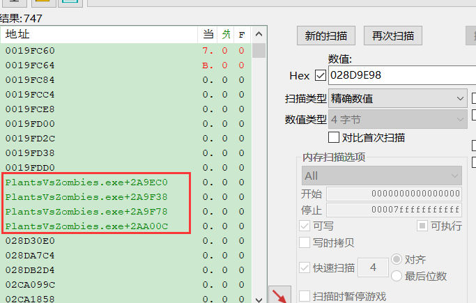

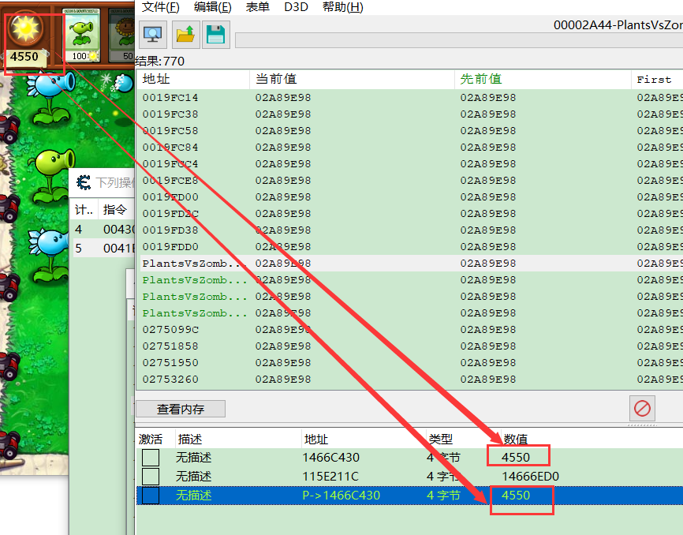

重新打开游戏,发现果然这个地址就是阳光地址

### 修改卡槽CD

1.  CD在界面上并没有具体的数值，所以之前阳光的方法就不适用了，那么只能从其他方面入手。
2.  通过CE的暴力搜索，搜索未知的数据，然后伴随着数据的变动、不变动筛选出去不想关的值，然后得到的数据实在无法在筛选少后，可以合理猜想 CD的值肯定不会是那些很大的值。那么就搜索一个范围，通过范围之间的搜索未知的值，然后结合游戏的数据变化，猜测并找到真实的CD的值
3.  得到CD的值后，通过找基地址 + 偏移的形式来确定基地址的使用。
4.  这里无法像上面的搜索 地址 + 偏移，搜索地址会搜不到任何东西，可能是该地址通过其他基址定位的。所以这里改用其他的方法。

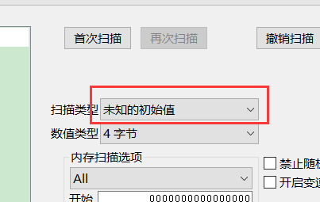

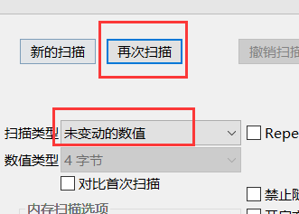

然后回到游戏,这时候植物冷却变了,再搜变动的值

在暂停游戏搜未变动的值,循环几次后,等所有植物冷却好,在继续游戏,不放置植物,在继续搜未变动的值(没放植物,冷却不变),重复几次,在让冷却变动,重复前面操作,知道最后刷筛选的差不多,在判断可能是哪条

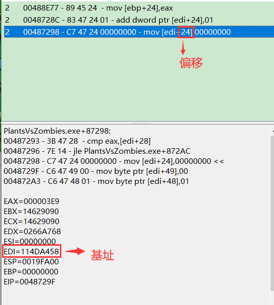

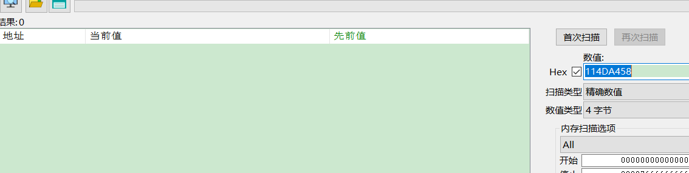

结构体成员的首地址 等于 结构体 首地址  + 偏移值

那么我们可以假设   结构体 首地址是    114DA000    和    114DA458   中间的某一值那么此时我们可以直接搜范围

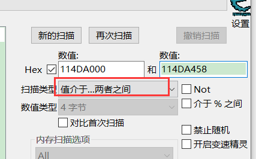

再去搜第二个植物的冷却

由于我们我们前面测试知道,豌豆冷却是2000,二向日葵比他冷却短,所以一定在1 -2000 之间,所以直接搜 1-2000的值就可以了而且我们可知,冷却的值是增加,所以我们可以循环搜增加的值,和不变的值,等完全冷却好搜0即可

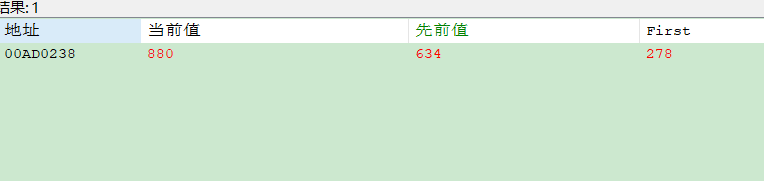

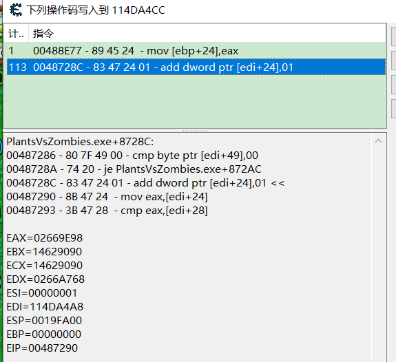

第一个植物   114DA458+  24   是冷却地址

第二个植物  是  114DA4A8  +  24    是冷却地址  

2个相差了 0x 50  离的很近,所以可能是数组不是链表,数组的成员大小 每个是  0x50

可以推测   像个植物冷却缩减的 地址 跟相邻的驻地相差 0x 50,为了验证我们的猜想,直接 在第二个植物 地址 +50  

114DA4F8  +  24     = 114DA51C    看看是不是第3个植物的  

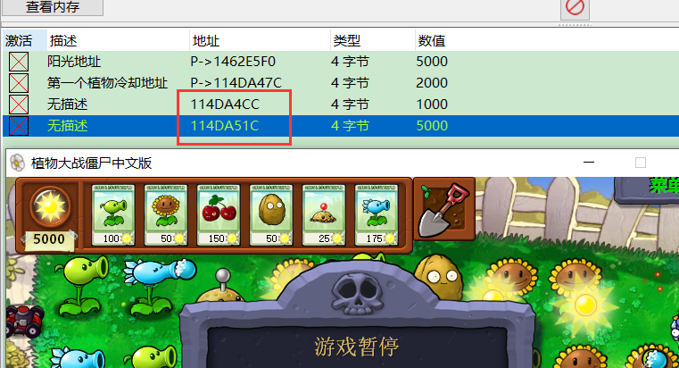

接下来我们就要分析数组每个成员代表的意义

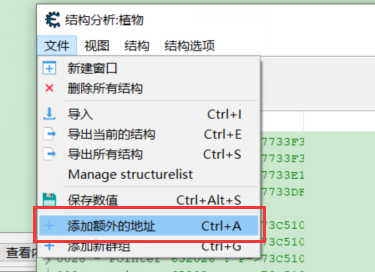

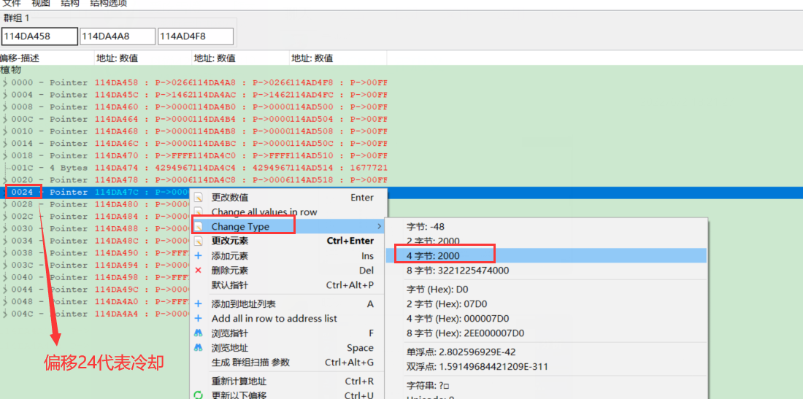

经过测试可以分析出以下一些数据

接下来就是分析草坪了

可以通过植物数量来分析,通过增加和删除朱武数量,很容易找到植物数量地址

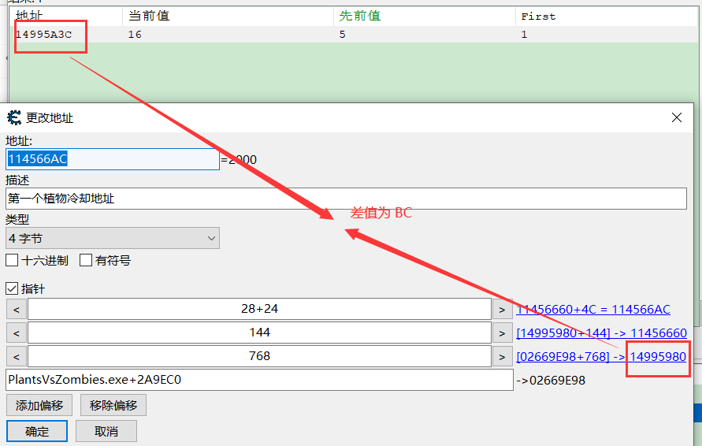

总的战场植物数量我们知道了,那么怎么知道各个植物数量呢

我们应该至少找到其中一个植物,再根据这个植物串联其他植物,在通过对比内存其分析成员,查找方式可以通过植物血量来查找,建议通过坚果来查找,因此可以把坚果放在第一个植物,僵尸攻击坚果,血量会减少,因此可以通过数值减少和暂停时数值不变来搜索

### 找植物在地图的血量

1.  由于每个植物放到地图上，他的血量都是不一样的，所以这里猜测可能这是利用了类多态的特性。每个在地图上的植物都有自己的属性。
2.  通过血量的查找可以找到地图数据和她的行为之间的关系。
3.  然后通过CE的内存工具，横向对比他们之间关系并分析行为。

第一个植物的我们已经知道了,现在来找第二个,我们可以知到坚果的血量最大值为4000,因此搜第二个坚过血量就可以在 0-4000

所以第一个植物血量地址为  14BCDD28           第二个为  14BCDE74      差值为    0x14C

所以推测第3个植物血量   在  14BCDE74      +    0x14C  =    14BC DFC0  位置

获取第一个植物血量基址和偏移

可以看到 基址位  ESI   14BCDCEB   偏移为  0x40  

换成 主模块基址 +  偏移  

在游戏里验证之后发现我们的猜想正确

### 自动捡阳光

我们通过CE知道 阳光的地址

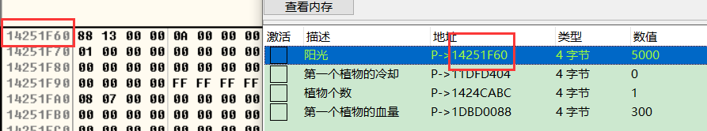

在该地址下内存断点

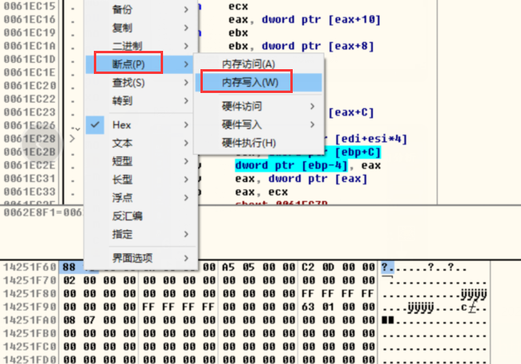

或者硬件写入断点

根据断点判断此处是写入阳光

查看调用该函数的地方

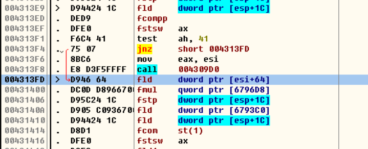

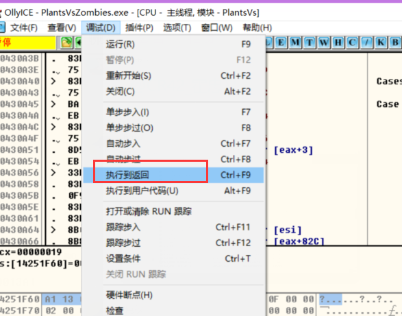

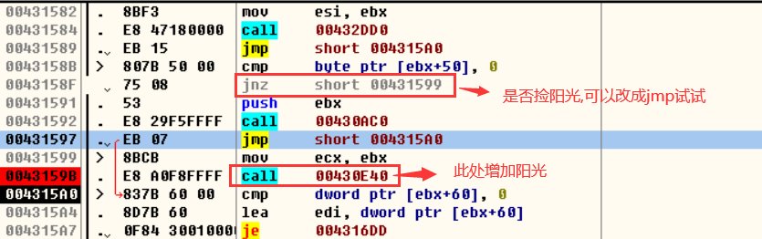

改成 jmp 后 果然自动捡阳光了,那额说明此处就是实现捡阳光的地方了

### 自动种植物

猜想一: 种植植物阳光会减少

还是下硬件断点,去种植物断下来之后

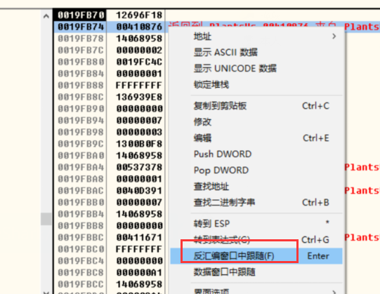

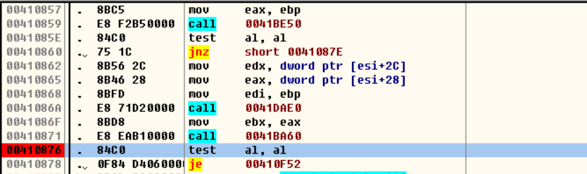

整体思路是看改了什么东西,然后沿着栈往上去找,在根据自己的推测去做验证,对不对,如果想要调函数,一定要函数的参数都要自己拿得到的,否则这个函数可能不是自己想要的

### 作业

##### 1.  辅助AI。

​    自动捡阳光，自动种植植物，自动切换关卡。

[📎GameDll.zip](./GameDll.zip)

##### 2.  手动放置僵尸。

​     可以选择僵尸，注意平衡。

​     nop掉自动产生僵尸的功能。

[📎PlantDLL.zip](./PlantDLL.zip)