### 调试框架

调试器最基本功能:   断点,单步

断点分为三类

1.  软件断点
2.  硬件断点
3.  内存断点

 

window提供了一套机制,帮助用户来实现一套3环的调试器

事件驱动 : 窗口的各种操作(外在的想要对窗口做一下改动,例如点击菜单,点击按钮,按下键盘等)

消息响应 : 这些事件会被封装成结构体,叫做消息


调试器也是类似,调试器有各种跟调试相关的事情发生,这些事情会被封装成一个个结构体传给我们,我们只需要一直处理这样一个个的结构体的信息,这些结构体就是调试事件,调试事件 90% 都是处理异常,调试器本身就是依托于系统的异常机制实现的

 

#### 步骤

##### 建立调试会话

  当调试器开始调试另一个进程的时候称为调试会话的建立,当调试器没有调试进程时,就叫没有调试会话


调试器建立会话的2种方式

###### 启动    **CreateProcess**

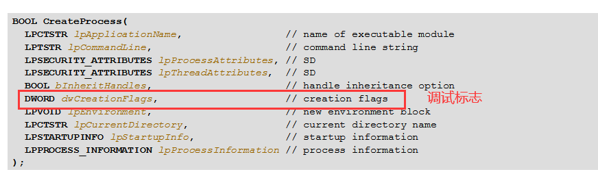

调试标志主要2种


###### 附加     **DebugActiveProcess**

   

###### 脱离   **DebugActiveProcessStop**

​    结束调试,但是被调试的进程仍然运行,一般用于测试调试时修改的有没有效果,大部分时候用不到

   

##### 循环接受调试事件

######      WaitForDebugEvent


超时时间 :    INFINITE  一直等待,只能使用控制台程序 ,不能用于窗口程序

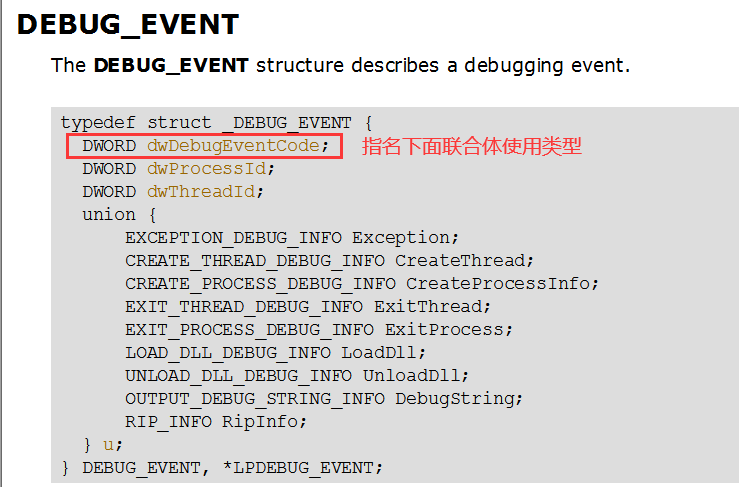


##### 处理调试事件


##### 提交处理结果

结果提交给系统

当调试器调试进程时, 被调试进程处于挂起状态,当调试事件处理完之后,被调试进程是处于运行还是挂起要看我们的操作,返回结果就是告诉系统 被调试进程  是 继续挂起还是运行

###### ContinueDebugEvent

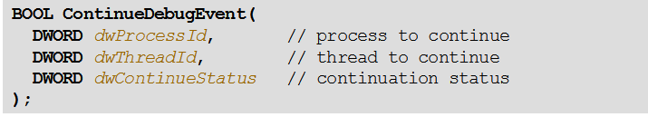

第3个参数:   继续状态

DBG_CONTINUE                                    继续运行(如果异常应该状态表示异常已处理,进程继续运行)

DBG_EXCEPTION_NOT_HANDLED    只对异常事件有用


#### 代码实现

##### 新建工程


##### 完成代码

```
.386
.model flat, stdcall
option casemap:none

include windows.inc
include user32.inc
include kernel32.inc
include msvcrt.inc

includelib user32.lib
includelib kernel32.lib
includelib msvcrt.lib
   

.data
    g_szExe db "winmine.exe",0  ;被调试的进程
   
    g_szEXCEPTION_DEBUG_EVENT           db "EXCEPTION_DEBUG_EVENT",0dh,0ah, 0
    
    g_szCREATE_THREAD_DEBUG_EVENT       db "CREATE_THREAD_DEBUG_EVENT",0dh,0ah,0
    
    g_szCREATE_PROCESS_DEBUG_EVENT      db "CREATE_PROCESS_DEBUG_EVENT",0dh,0ah, 0
    
    g_szEXIT_THREAD_DEBUG_EVENT         db "EXIT_THREAD_DEBUG_EVENT",0dh,0ah, 0
    
    g_szEXIT_PROCESS_DEBUG_EVENT        db "EXIT_PROCESS_DEBUG_EVENT",0dh,0ah, 0
    
    g_szLOAD_DLL_DEBUG_EVENT            db "LOAD_DLL_DEBUG_EVENT" , 0dh,0ah, 0
    
    g_szUNLOAD_DLL_DEBUG_EVENT          db "UNLOAD_DLL_DEBUG_EVENT" , 0dh,0ah, 0
    
    g_szOUTPUT_DEBUG_STRING_EVENT       db "OUTPUT_DEBUG_STRING_EVENT" , 0dh,0ah, 0
 
 
.code

main proc
	LOCAL  @si:STARTUPINFO
	LOCAL  @pi:PROCESS_INFORMATION 
	LOCAL  @de:DEBUG_EVENT  ;这个结构体使用后需要清0
	
	;初始化变量
	invoke  RtlZeroMemory,addr @si, size @si
	invoke  RtlZeroMemory,addr @pi, size @pi
	invoke  RtlZeroMemory,addr @de, size @de  
	
	;建立调试会话
        invoke CreateProcess,NULL,offset g_szExe,NULL,NULL,NULL,\
              DEBUG_ONLY_THIS_PROCESS,NULL,NULL,addr @si,addr @pi
          
          .if !eax
          	ret  ;建立调试会话失败直接退出
          .endif 
          
	;循环接受调试事件
	.while  TRUE
	    
            invoke WaitForDebugEvent,addr @de,INFINITE
            
            ;处理调试事件
            .if @de.dwDebugEventCode == EXCEPTION_DEBUG_EVENT           ;异常 90%都是在处理这个
            	 invoke crt_printf, offset g_szEXCEPTION_DEBUG_EVENT
            	 
            .elseif @de.dwDebugEventCode == CREATE_THREAD_DEBUG_EVENT   ;创建线程
                 invoke crt_printf, offset g_szCREATE_THREAD_DEBUG_EVENT
                 
            .elseif @de.dwDebugEventCode == CREATE_PROCESS_DEBUG_EVENT  ;创建进程
            	 invoke crt_printf, offset g_szCREATE_PROCESS_DEBUG_EVENT
            	
            .elseif @de.dwDebugEventCode == EXIT_THREAD_DEBUG_EVENT     ;线程退出
                 invoke crt_printf, offset g_szEXIT_THREAD_DEBUG_EVENT 
            	
            .elseif @de.dwDebugEventCode == EXIT_PROCESS_DEBUG_EVENT    ;进程退出
                 invoke crt_printf, offset g_szEXIT_PROCESS_DEBUG_EVENT             
            	 
            .elseif @de.dwDebugEventCode == LOAD_DLL_DEBUG_EVENT        ;dll被加载
                invoke crt_printf, offset g_szLOAD_DLL_DEBUG_EVENT  
            	
            .elseif @de.dwDebugEventCode == UNLOAD_DLL_DEBUG_EVENT      ;dll被卸载
               invoke crt_printf, offset g_szUNLOAD_DLL_DEBUG_EVENT              
          	 
            .elseif @de.dwDebugEventCode == UNLOAD_DLL_DEBUG_EVENT      ;输出信息
               invoke crt_printf, offset g_szOUTPUT_DEBUG_STRING_EVENT 
               
            .endif
	
	
	    ;提交事件处理结果
	    invoke ContinueDebugEvent,@de.dwProcessId,@de.dwThreadId,DBG_CONTINUE
	    
	    ;DEBUG_EVENT结构体使用后清0
	    invoke  RtlZeroMemory,addr @de, size @de  
	    
	.endw
	
	ret

main endp

start:
   
   invoke main

    
end start

```

##### 处理 LOAD_DLL_DEBUG_EVENT 事件


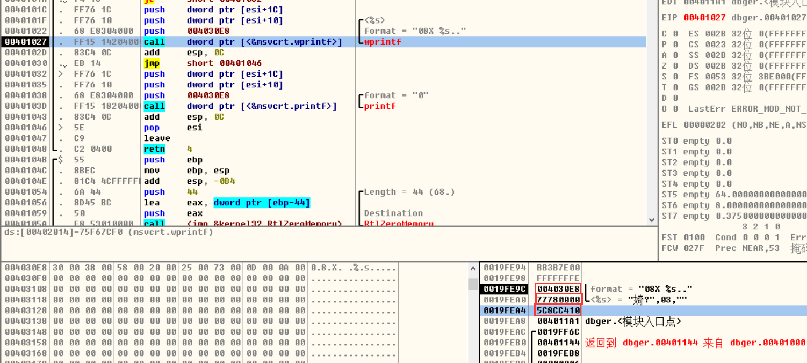

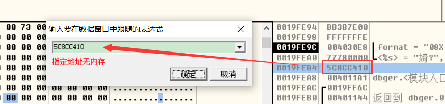

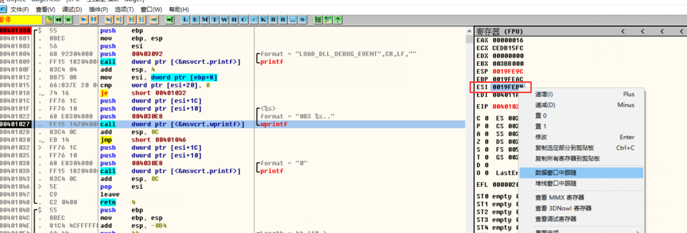

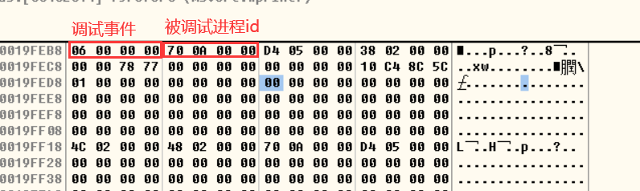

用winhex 打开 该id 进程,查看内存数据 发现还是搜不到


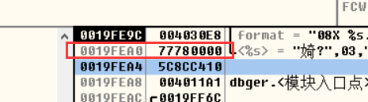


发现是系统dll,再看一下后面的

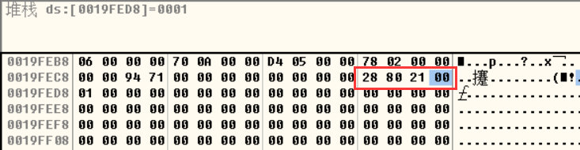

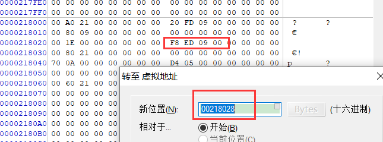

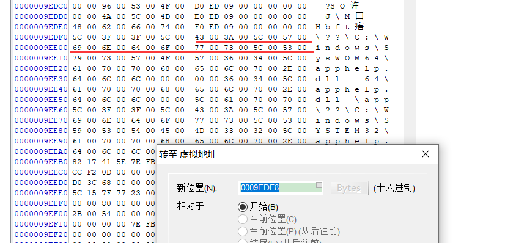

在F9执行几次,发现地址是固定的,但是指针指向的dll 会发生变化

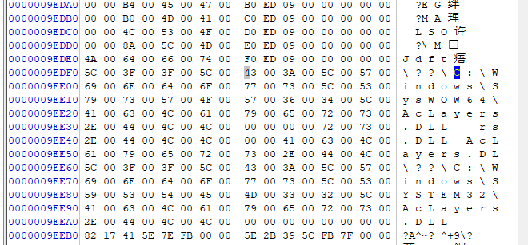


所以   lpImageName  存储的是一个二级指针,  拿到 dll 地址就必须跨进程读写内存,但是第一个dll (ntdll.dll)例外,没办法拿到数据

```
.386
.model flat, stdcall
option casemap:none

include windows.inc
include user32.inc
include kernel32.inc
include msvcrt.inc

includelib user32.lib
includelib kernel32.lib
includelib msvcrt.lib
   

.data
    g_szExe db "winmine.exe",0  ;被调试的进程
    g_hExe dd  0               ;进程句柄
   
    g_szEXCEPTION_DEBUG_EVENT           db "EXCEPTION_DEBUG_EVENT",0dh,0ah, 0
    
    g_szCREATE_THREAD_DEBUG_EVENT       db "CREATE_THREAD_DEBUG_EVENT",0dh,0ah,0
    
    g_szCREATE_PROCESS_DEBUG_EVENT      db "CREATE_PROCESS_DEBUG_EVENT",0dh,0ah, 0
    
    g_szEXIT_THREAD_DEBUG_EVENT         db "EXIT_THREAD_DEBUG_EVENT",0dh,0ah, 0
    
    g_szEXIT_PROCESS_DEBUG_EVENT        db "EXIT_PROCESS_DEBUG_EVENT",0dh,0ah, 0
    
    g_szLOAD_DLL_DEBUG_EVENT            db "LOAD_DLL_DEBUG_EVENT" , 0dh,0ah, 0
    
    g_szUNLOAD_DLL_DEBUG_EVENT          db "UNLOAD_DLL_DEBUG_EVENT" , 0dh,0ah, 0
    
    g_szOUTPUT_DEBUG_STRING_EVENT       db "OUTPUT_DEBUG_STRING_EVENT" , 0dh,0ah, 0
    
    g_szLoadDllFmt   db "%08X  %s", 0dh,0ah, 0
    
    g_szwLoadDllFmt  dw '%','0','8','X',' ', '%','s', 0dh,0ah, 0
 
 
.code

OnLoadDll proc uses esi pDE:ptr DEBUG_EVENT
        LOCAL  @dwAddr:DWORD
        LOCAL  @dwByteReaded:DWORD
        LOCAL  @szwPath[512]:WORD
         

	invoke crt_printf, offset g_szLOAD_DLL_DEBUG_EVENT  
	invoke  RtlZeroMemory,addr @szwPath, size @szwPath

	mov esi,pDE
	assume esi: ptr DEBUG_EVENT
	
	invoke ReadProcessMemory,g_hExe,[esi].u.LoadDll.lpImageName,addr @dwAddr, size @dwAddr,addr  @dwByteReaded
	 .if !eax
          	ret  
         .endif 
          
	invoke ReadProcessMemory,g_hExe, @dwAddr ,addr @szwPath, sizeof  @szwPath,addr  @dwByteReaded
	.if !eax
          	ret  
        .endif 
          
	
	.if [esi].u.LoadDll.fUnicode   ;如果是 unicode
	
	    invoke crt_wprintf, offset g_szwLoadDllFmt,[esi].u.LoadDll.lpBaseOfDll,addr @szwPath
	.elseif
	
	    invoke crt_printf, offset g_szwLoadDllFmt,[esi].u.LoadDll.lpBaseOfDll,addr @szwPath
		
	.endif
	
	assume esi:nothing
	ret

OnLoadDll endp


main proc
	LOCAL  @si:STARTUPINFO
	LOCAL  @pi:PROCESS_INFORMATION 
	LOCAL  @de:DEBUG_EVENT  ;这个结构体使用后需要清0
	
	;初始化变量
	invoke  RtlZeroMemory,addr @si, size @si
	invoke  RtlZeroMemory,addr @pi, size @pi
	invoke  RtlZeroMemory,addr @de, size @de  
	
	;建立调试会话
        invoke CreateProcess,NULL,offset g_szExe,NULL,NULL,NULL,\
              DEBUG_ONLY_THIS_PROCESS,NULL,NULL,addr @si,addr @pi
          
          .if !eax
          	ret  ;建立调试会话失败直接退出
          .endif 
          
          mov eax,@pi.hProcess
          mov g_hExe,eax
	;循环接受调试事件
	.while  TRUE
	    
            invoke WaitForDebugEvent,addr @de,INFINITE
            
            ;处理调试事件
            .if @de.dwDebugEventCode == EXCEPTION_DEBUG_EVENT           ;异常 90%都是在处理这个
            	 invoke crt_printf, offset g_szEXCEPTION_DEBUG_EVENT
            	 
            .elseif @de.dwDebugEventCode == CREATE_THREAD_DEBUG_EVENT   ;创建线程
                 invoke crt_printf, offset g_szCREATE_THREAD_DEBUG_EVENT
                 
            .elseif @de.dwDebugEventCode == CREATE_PROCESS_DEBUG_EVENT  ;创建进程
            	 invoke crt_printf, offset g_szCREATE_PROCESS_DEBUG_EVENT
            	
            .elseif @de.dwDebugEventCode == EXIT_THREAD_DEBUG_EVENT     ;线程退出
                 invoke crt_printf, offset g_szEXIT_THREAD_DEBUG_EVENT 
            	
            .elseif @de.dwDebugEventCode == EXIT_PROCESS_DEBUG_EVENT    ;进程退出
                 invoke crt_printf, offset g_szEXIT_PROCESS_DEBUG_EVENT             
            	 
            .elseif @de.dwDebugEventCode == LOAD_DLL_DEBUG_EVENT        ;dll被加载
                ;invoke crt_printf, offset g_szLOAD_DLL_DEBUG_EVENT  
            	invoke OnLoadDll,addr @de
            .elseif @de.dwDebugEventCode == UNLOAD_DLL_DEBUG_EVENT      ;dll被卸载
               invoke crt_printf, offset g_szUNLOAD_DLL_DEBUG_EVENT              
          	 
            .elseif @de.dwDebugEventCode == UNLOAD_DLL_DEBUG_EVENT      ;输出信息
               invoke crt_printf, offset g_szOUTPUT_DEBUG_STRING_EVENT 
               
            .endif
	
	
	    ;提交事件处理结果
	    invoke ContinueDebugEvent,@de.dwProcessId,@de.dwThreadId,DBG_CONTINUE
	    
	    ;DEBUG_EVENT结构体使用后清0
	    invoke  RtlZeroMemory,addr @de, size @de  
	    
	.endw
	
	ret

main endp

start:
   
   invoke main

    
end start

```

NtQueryProcessInfomation   获取进程信息


 作业 

   解析    CREATE_PROCESS_DEBUG_EVENT    OUTPUT_DEBUG_STRING_EVENT 


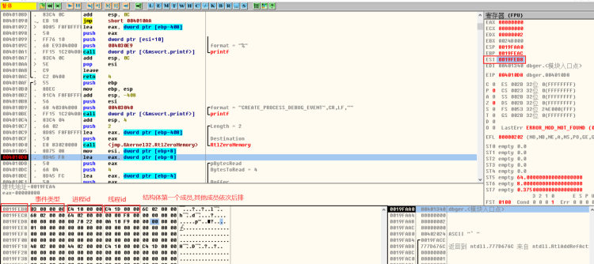

