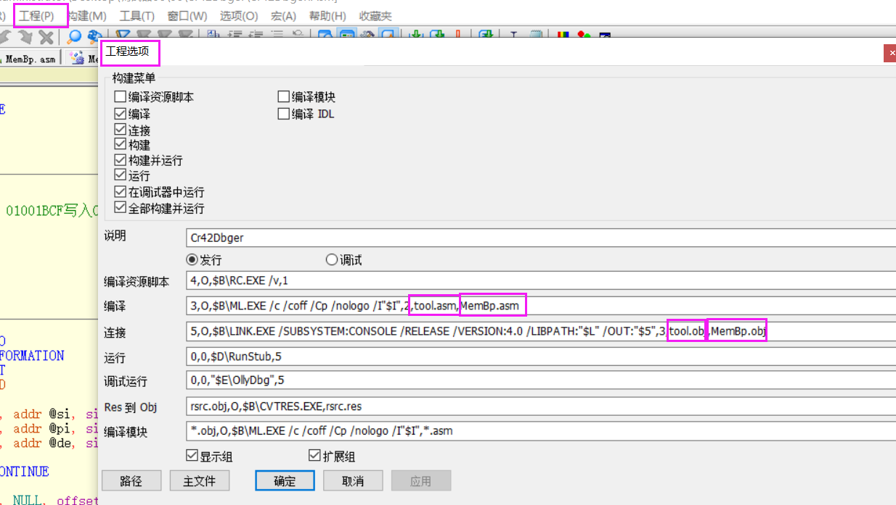

### 实现多个内存断点


#### 多文件编译设置

把要编译和链接的文件加入选项



#### 汇编解析输入的命令

strtoul  将字符串转为  指定进制的数值     结果是返回值

会自动跳过空格   如果 转换不了结果为空   

参数    字符串    转换后指针位置     进制

```
   .while TRUE
        ;提示：
        invoke crt_printf,  offset g_szCommandTip
        ;输入命令
        invoke crt_gets, offset g_szCommand
        .if eax <= 0
            .continue
        .endif
        
        ;解析命令
        .if g_szCommand[0] == 'b'  && g_szCommand[1] == 'm' && g_szCommand[2] == 'l' 
            
        
        .elseif g_szCommand[0] == 'b'  && g_szCommand[1] == 'm' && g_szCommand[2] == 'c' 
        
        
        .elseif g_szCommand[0] == 'b' && g_szCommand[1] == 'm'
          
            ;解析命令
            ;16进制地址
            invoke crt_strtoul, offset g_szCommand + 2, addr @pEnd, 16
            mov @dwAddr, eax
            .if eax == 0
                ;地址错误
                .continue
            .endif
            
            ;长度
            invoke crt_strtoul, @pEnd, addr @pEnd, 16
            mov @dwLen, eax
            .if eax == 0
                ;长度错误
                .continue
            .endif
            
            ;设置内存断点
            invoke SetBm, @dwAddr, @dwLen
        .elseif g_szCommand[0] == 'g'
            .break
        .endif
        
        
    .endw
    
```

#### 调试器框架

[📎Cr42Dbger.zip](./Cr42Dbger.zip)