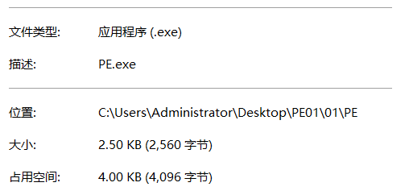
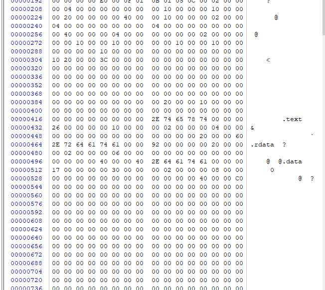
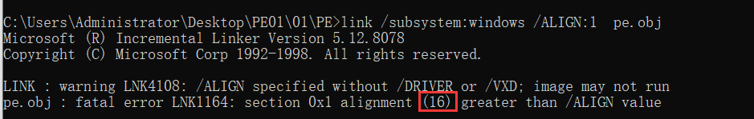
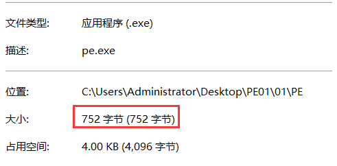
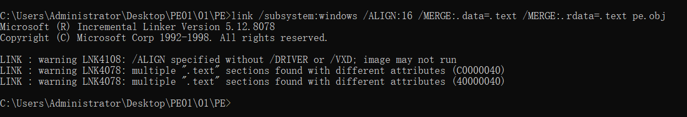
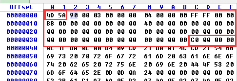
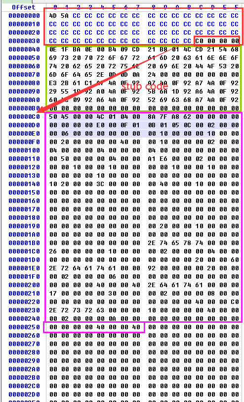
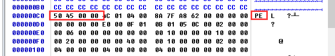

portable  excute   可移植,可执行的文件(exe    dll)

能够解析的文件,其内部都是有格式的,不是随随便便放的,都是按照某种规律放的,可执行文件也是如此,他有自己的格式,exe 和 dll 的格式是一样的


微软由dos  到 windows 文件格式发生了改变,所以要出新的文件格式,因此微软要求文件要兼容 dos 系统,其次要兼容其他的所有操作系统 

**IMAGE_FILE_MACHINE_AM33**   希望兼容所有的cpu


因此PE的文件格式里面有很多字段时 windows 系统用不到的,有些是给已经被淘汰的 dos系统用的,还有一些是给其他系统用的,所以不是每个字段都非常有用,我们只需要关注在 windows 上的用的,即windows会检查的一些字段


### PE头

```
IMAGE_DOS_HEADER
IMAGE_NT_HEADERS
       IMAGE_FILE_HEADER  
        IMAGE_OPTIONAL_HEADER
               IMAGE_DATA_DIRECTORY[1]       //柔性数组
IMAGE_SECTION_HEADER[]                      //描述整个数据.解析这个表可以拿到所有数据
```

 用于解析的PE文件 


PE文件代码

```
.586
.model flat,stdcall
option casemap:none

   include windows.inc
   include user32.inc
   include kernel32.inc
   
   includelib user32.lib
   includelib kernel32.lib

.data
   g_szText db "pe for pe teach",0
   g_szCaption  db "tiptip",0

.code
start:
    invoke MessageBox, NULL, offset g_szText, offset g_szCaption, MB_OK
	invoke ExitProcess,eax

end start
```


我们自己编译

```
ml /c /coff  pe.asm
link /subsystem:windows pe.obj
```



在winhex查看



此时可以发现0很多,这是因为文件生成的时候有对齐值我们可以通过修改对齐值来修改其大小




还可以更小,就是把数据节合并(因为数据段里面也存在对齐)




继续合并




此时已经达到了编译器的最小大小了


#### DOS头   IMAGE_DOS_HEADER：    00000000--0000003F

IMAGE_DOS_HEADER 结构体

```
// DOS头结构体： _IMAE_DOS_HEADER
typedef struct _IMAE_DOS_HEADER {       //DOS .EXE header                 偏移  
    WORD e_magic;     //幻数  Magic number;                               0x00  
   	
    // 中间部分成员是为了兼容16位操作系统...可修改可忽略...
   
    LONG e_lfanew;     //File address of new exe header                   0x3C  
} IMAGE_DOS-HEADER, *PIMAGE_DOS_HEADER;  
```



该结构体中两个重要字段（不可更改），分别是 e_magic，和 e_lfanew字段：

-   第一个字段 e_magic：该字段WORD类型，2字节 ，存储字符是“MZ”，对应PE文件的开头，是PE文件的标识符。该标识符在Winnt.h头文件中有一个宏定义，定义如下所示：

    #define IMAGE_DOS_SIGNATURE      0x4D5A  // MZ
    #define IMAGE_OS2_SIGNATURE      0x4E45  // NE
    #define IMAGE_OS2_SIGNATURE_LE   0x4C45  // LE

    最后一个字段 e_lfanew：该字段LONG类型，4字节，对应PE文件的0x3C处 ：表示NT头在文件中的偏移，即32位及以上系统文件头在文件中真正的偏移,这个值可以修改,但是修改的话要把整个IMAGE_NT_HEADERS  结构体移到 该值对应的偏移值处

    

    IMAGE_DOS_HEADER    到   IMAGE_NT_HEADERS   中间有一部分数据  叫做  stub code 也叫残留代码,残留数据,这个里面是跑在16位 dos系统里面的代码,起一个提示作用

    

    

    #### NT头 IMAGE_NT_HEADERS

    偏移值 :     IMAGE_DOS_HEADER 中e_lfanew值   --    IMAGE_DOS_HEADER 中e_lfanew值 +  0x98  

    IMAGE_NT_HEADERS 结构体

    ```
    // NT头结构体： _IMAGE_NT_HEADERS
    typedef struct _IMAGE_NT_HEADERS {
      DWORD                   Signature;		// 签名 32位文件格式的头部标识，不可修改 
      IMAGE_FILE_HEADER       FileHeader;		// 文件头
      IMAGE_OPTIONAL_HEADER32 OptionalHeader;	// 选项头
    } IMAGE_NT_HEADERS32, *PIMAGE_NT_HEADERS32;
    ```

    

##### DWORD  Signature   

-    宏定义：   #define IMAGE_NT_SIGNATURE    0x50450000  // PE00    



##### 文件头 IMAGE_FILE_HEADER：描述磁盘上PE文件的相关信息。

-   -   重要字段不可修改：

-   -   -   1.WORD  Machine;	2.WORD  NumberOfSections;
        -   6.WORD  SizeOfOptionalHeader;	7.WORD  Characteristics.

    -   

    -   ```
        // 文件头结构体 20B： _IMAGE_FILE_HEADER
        typedef struct _IMAGE_FILE_HEADER {
          WORD  Machine; 		    	// 表示CPU平台,不可修改：
            							// 32位IMAGE_FILE_MACHINE_I386, 0x014c
            							// 64位IMAGE_FILE_MACHINE_AMD64, 0x8664
          WORD  NumberOfSections;    	// 表示节表数量，用于遍历节表，判断从PE中拷贝什么数据到内存中：
            							//.text/.rdata/.data...每个2行半
            							// 遍历节表经验：根据此处的个数拿对应的节表数据
          DWORD TimeDateStamp;			// 时间戳：链接器填写的文件生成的时间,作用不大(可修改)
          DWORD PointerToSymbolTable;   // 符号表位置(无用)
          DWORD NumberOfSymbols;	    // 符号表个数：windows的符号表信息一般由PDB放置在文件后端(无用)
          WORD  SizeOfOptionalHeader;   // 选项头大小：用于定位节表位置=选项头地址+选项头大小(不可随便修改)
          WORD  Characteristics;		// 文件属性，指应用程序是一个什么程序(不可随便修改)
        } IMAGE_FILE_HEADER, *PIMAGE_FILE_HEADER;
        ```

    -   

##### 选项头 IMAGE_OPTIONAL_HEADER：以供操作系统加载PE文件使用，32位必选。

-   重要字段：7.DWORD AddressOfEntryPoint；10.DWORD ImageBase

IMAGE_OPTIONAL_HEADER 结构体

```
typedef struct _IMAGE_OPTIONAL_HEADER {
  WORD  Magic;	// 32位PE： IMAGE_NT_OPTIONAL_HDR32_MAGIC  ,   0x10b. 
                // 以 _IMAGE_OPTIONAL_HEADER  结构体解析			
                // 64位PE： IMAGE_NT_OPTIONAL_HDR64_MAGIC  ,   0x20b.	
                // 以 _IMAGE_OPTIONAL_HEADER64  结构体解析			
  BYTE  MajorLinkerVersion;	// 主链接器版本号 (无用)
  BYTE  MinorLinkerVersion; // 副链接器版本号  (无用)
    
  //系统分配内存不看着3个值,但是对于调试器有影响(影响反汇编所用内存大小,OD是机器码个数*2,字节数是通过SizeOfCode 得到)   
  DWORD SizeOfCode;				// 代码所占空间大小  (没啥用)
  DWORD SizeOfInitializedData;	// 已初始化数据所占空间大小 (没啥用)
  DWORD SizeOfUninitializedData;// 未初始化数据所占空间大小 (没啥用)
    
  DWORD AddressOfEntryPoint;	// *oep:原本的程序入口点（实际为偏移，+模块基址=实际入口点）
    						    // ep: 被加工后的入口点
                                //这个值可以修改,但是修改过后必须跳转到在该偏移处跳转到真正入口
  DWORD BaseOfCode;	// 代码基址  (无用)
  DWORD BaseOfData;	// 数据基址   (无用)
  DWORD ImageBase;	// *建议装载地址：exe映射加载到内存中的首地址= PE 0处，即实例句柄hInstance
    			    // 一般而言，exe文件可遵从装载地址建议，但dll文件无法满足
  DWORD SectionAlignment;
  DWORD FileAlignment;
  WORD  MajorOperatingSystemVersion;
  WORD  MinorOperatingSystemVersion;
  WORD  MajorImageVersion;
  WORD  MinorImageVersion;
  WORD  MajorSubsystemVersion;
  WORD  MinorSubsystemVersion;
  DWORD Win32VersionValue;
  DWORD SizeOfImage;
  DWORD SizeOfHeaders;
  DWORD CheckSum;
  WORD  Subsystem;
  WORD  DllCharacteristics;
  DWORD SizeOfStackReserve;
  DWORD SizeOfStackCommit;
  DWORD SizeOfHeapReserve;
  DWORD SizeOfHeapCommit;
  DWORD LoaderFlags;
  DWORD NumberOfRvaAndSizes;
  IMAGE_DATA_DIRECTORY DataDirectory[IMAGE_NUMBEROF_DIRECTORY_ENTRIES];
} IMAGE_OPTIONAL_HEADER32, *PIMAGE_OPTIONAL_HEADER32;
```

AddressOfEntryPoint    EP

 OEP  程序入口点    - Old  Entry Point   

如果 EP 没有被修改的话   OEP   =   EP   ,但是很多时候为了隐藏程序入口点   通常会修改 EP 的值

例如  原本  AddressOfEntryPoint      的值为1000   可以改成  1100 ,那么模块基址 + 1100 的地方就成了程序入口点 再到  该地址 执行跳转指令  ,可以挑战转到  偏移 为 1000 处或者 跳转到其他地方在跳回 偏移 1000处  


CC表示不重要的无用数据


### 作业

#####  带界面的PE解析工具