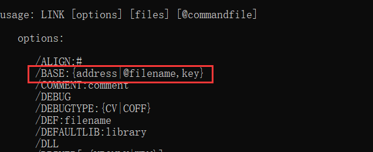
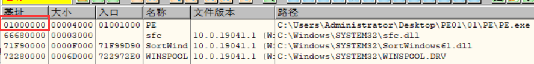
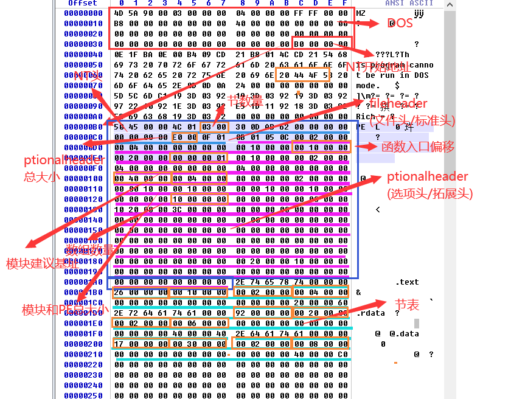
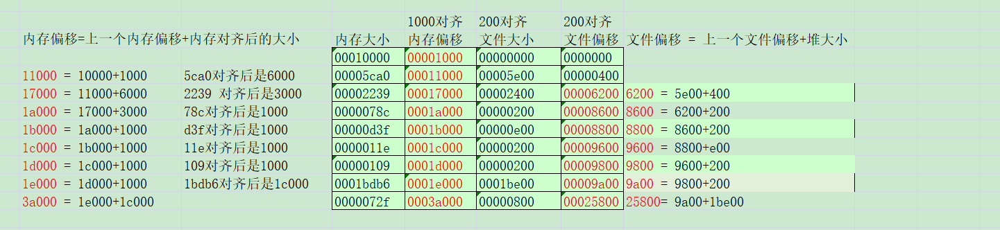
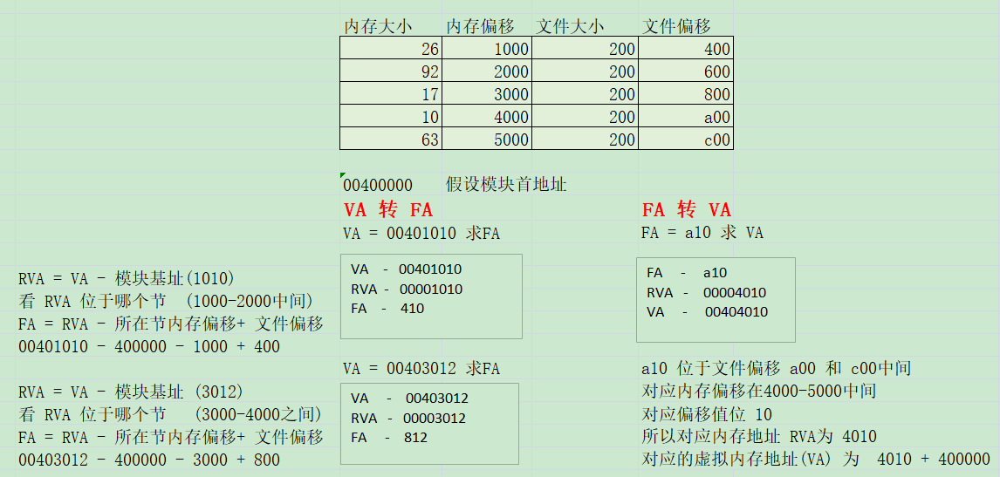
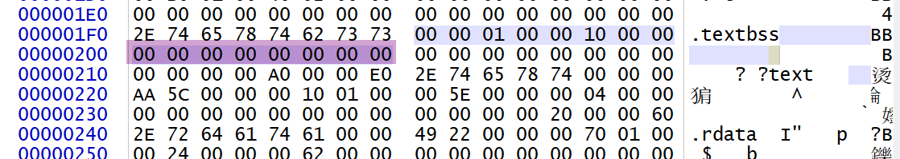

### 选项头 IMAGE_OPTIONAL_HEADER：以供操作系统加载PE文件使用，32位必选。

​       重要字段：

​                 DWORD AddressOfEntryPoint；   入口点                   

​                  DWORD ImageBase                          建议模块地址

​                 DWORD SectionAlignment;       内存对齐值

​                 DWORD FileAlignment;               文件对齐值,

​                 DWORD SizeOfImage;                 模块在内存中总大小,与 SectionAlignment 对齐

​                 DWORD SizeOfHeaders;             PE头总大小,与 FileAlignment 对齐

IMAGE_OPTIONAL_HEADER 结构体

```
typedef struct _IMAGE_OPTIONAL_HEADER {
  WORD  Magic;	// 32位PE： IMAGE_NT_OPTIONAL_HDR32_MAGIC  ,   0x10b. 
                // 以 _IMAGE_OPTIONAL_HEADER  结构体解析			
                // 64位PE： IMAGE_NT_OPTIONAL_HDR64_MAGIC  ,   0x20b.	
                // 以 _IMAGE_OPTIONAL_HEADER64  结构体解析			
  BYTE  MajorLinkerVersion;	// 主链接器版本号 (无用)
  BYTE  MinorLinkerVersion; // 副链接器版本号  (无用)
    
  //系统分配内存不看着3个值,但是对于调试器有影响(影响反汇编所用内存大小,OD是机器码个数*2,字节数是通过SizeOfCode 得到)   
  DWORD SizeOfCode;				// 代码所占空间大小  (没啥用)
  DWORD SizeOfInitializedData;	// 已初始化数据所占空间大小 (没啥用)
  DWORD SizeOfUninitializedData;// 未初始化数据所占空间大小 (没啥用)
    
  DWORD AddressOfEntryPoint;	// *oep:原本的程序入口点（实际为偏移，+模块基址=实际入口点）
    						    // ep: 被加工后的入口点
                                //这个值可以修改,但是修改过后必须跳转到在该偏移处跳转到真正入口

  DWORD BaseOfCode;	// 代码基址  (无用)
  DWORD BaseOfData;	// 数据基址   (无用)
    
  DWORD ImageBase;	// *建议模块地址：exe映射加载到内存中的首地址= PE 0处，即实例句柄hInstance
    			    // 一般而言，exe文件可遵从装载地址建议，但dll文件无法满足 (开了随机基址可能也不是这个值,是通过重定位表得到)
                    //这个值最好不要改,改的话要改动大量地方,因为函数和全局变量的地址也需要跟着改变
 
  DWORD SectionAlignment;   //内存对齐值,数据在内存的对齐值,很多内存地址,大小都要依赖他来计算
                            //默认1000h 一个分页大小,系统管理内存是以分页为单位
  DWORD FileAlignment;      //文件对齐值, 200h,磁盘的一个扇区大小  (vc6是1000h)
                            //文件的起始位置和大小都是跟文件对齐值对齐的 
                            // 对齐值都是2的倍数 如果把所有节合并了 就可以设为1,否则不可以随便修改因为要配合节检查
    
   //主副系统相关版本号   除了  MajorSubsystemVersion 不可修改,其他5个可以
  WORD  MajorOperatingSystemVersion;
  WORD  MinorOperatingSystemVersion;
  WORD  MajorImageVersion;
  WORD  MinorImageVersion;
  WORD  MajorSubsystemVersion;   //主子系统版本号   不可以修改   这里改成4可以再xp运行
  WORD  MinorSubsystemVersion;
    
    
  DWORD Win32VersionValue;   // win32版本值  xp上不可以改 ,win7和win10可以修改
    
  //改值是通过节表计算得到的   
  DWORD SizeOfImage;     //模块在内存中总大小,与 SectionAlignment 对齐,改的话不可以改变分页数量(但最好对齐)
  DWORD SizeOfHeaders;   // PE头总大小,与 FileAlignment 对齐
    
  DWORD CheckSum;       //校验值  3环程序随便改,0环程序会检查,不允许改 可以用 MapFileAndCheckSum 计算值
 
  WORD  Subsystem;      //子系统  不允许修改    /subsystem
    
  WORD  DllCharacteristics;   //描述应用程序的一些相关信息(例如是否开了随机基址等),可以改,但不能随便改
    
  //这四个值可以改,但是不能改得太离谱
  DWORD SizeOfStackReserve;  //栈保留
  DWORD SizeOfStackCommit;   //栈提交
  DWORD SizeOfHeapReserve;   //堆保留
  DWORD SizeOfHeapCommit;    //堆保留
    
    
  DWORD LoaderFlags;     //跟调试相关，目前用不到，值可以随便改
  DWORD NumberOfRvaAndSizes;   //下面数组个数（最小可以改为2,最大为16,前2个表是导入,导出表,必须要有）
 //数据目录表(成员2个 dword 第一个是内存偏移,第二个大小 )  
 //描述PE中各种个样的表的位置和大小,每个下标对应一个固定的表(前2个不能改,导入,导出表,改了无法调API)
  IMAGE_DATA_DIRECTORY DataDirectory[IMAGE_NUMBEROF_DIRECTORY_ENTRIES];  //柔性数组 个数由上面值决定,但是总大小为16个
} IMAGE_OPTIONAL_HEADER32, *PIMAGE_OPTIONAL_HEADER32;
```

AddressOfEntryPoint    EP

 OEP  程序入口点    - Old  Entry Point   

如果 EP 没有被修改的话   OEP   =   EP   ,但是很多时候为了隐藏程序入口点   通常会修改 EP 的值

例如  原本  AddressOfEntryPoint      的值为1000   可以改成  1100 ,那么模块基址 + 1100 的地方就成了程序入口点 再到  该地址 执行跳转指令  ,可以挑战转到  偏移 为 1000 处或者 跳转到其他地方在跳回 偏移 1000处


ImageBase   建议模块基址 

命令行编译的时候可以通过   /base修改



link /subsystem:windows /base:0x01000000 pe.obj


名称







开了随机基址,PE里面就会有一个重定位表,记录了所有需要修改的地方,没开没有


 节表 IMAGE_SECTION_HEADER 

●描述PE文件与内存之间的映射关系，说明PE文件的指定内容拷贝至内存的哪个位置、拷贝大小及内存属性的设置。

●一个结构体总大小为   0x 28 (40)  字节

 如何定位节表 

●节表置于选项头之后，位置 = 选项头( IMAGE_OPTIONAL_HEADER) 的地址 

​                                                          \+ 选项头( IMAGE_OPTIONAL_HEADER)的大小。

 节表字段的意义 


```
// IMAGE_SECTION_HEADER 节表结构体，大小40B
typedef struct _IMAGE_SECTION_HEADER {
    
  BYTE  Name[IMAGE_SIZEOF_SHORT_NAME];	// 节表名称：描述性字段  2个字节
    
  // 下方4个字段：从文件S1处开始，拷贝S2大小的数据，到内存S3处，有效数据占用内存S4大小
  union {
    DWORD PhysicalAddress;
    DWORD VirtualSize;			// S4:内存大小
  } Misc;
  DWORD VirtualAddress;			// S3:内存地址：基于模块基址，与SectionAlignment对齐（0x1000）
  DWORD SizeOfRawData;			// S2:文件大小，与FileAlignment对齐（0x200）
  DWORD PointerToRawData;		// S1:文件偏移，与FileAlignment对齐（0x200）
 
  //跟调试相关  
  DWORD PointerToRelocations;	// 无用
  DWORD PointerToLinenumbers;	// 无用
  WORD  NumberOfRelocations;	// 无用
  WORD  NumberOfLinenumbers;	// 无用
    
  DWORD Characteristics;		// 节内存属性，取值IMAGE_SCN_...系列宏  分低位和高位
} IMAGE_SECTION_HEADER, *PIMAGE_SECTION_HEADER;
```

##### 空节

文件大小和偏移都为0

编译器一般用来存放未初始化的数据

##### 节表与OD复制到文件功能的关系

-   由于内存是基于分页管理，所以要注意区块与页的关系。

##### 节表字段的关系

-   关系：各个节之间是连续不间断的（除特殊节.textbss）。但是系统检查没那么严格改成不对齐也没事(修改 VirtualSize 的值或 SizeOfRawData ),但是不能改变分页情况,最好连续

-   -   下一个节的PointerToRawData = 上一个节的PointerToRawData+SizeOfRawData。
    -   下一个节的VirtualAddress= 上一个节的VirtualAddress+VirtualSize对齐后的值（+0x1000）。

-   SizeofImage PE文件在进程内存中的总大小= 

-   -   算法1：最后一个节的virtualAddress + VirtualSize对齐后的值（+0x1000）
    -   算法2：各个节占内存大小的总和+PE头大小（对齐后0x1000）。


最后一个节点数据不能随便改,再便宜为 0c处的 存的是资源信息表




#### 地址转换   FA,VA和RVA的转换

FA --- file Address 文件地址（文件偏移）

VA --- virtual Address 虚拟内存（内存中的绝对地址）

RVA --- relative virtual Address 相对虚拟地址（基于模块基质的偏移，内存偏移）

##### 注意：

通过FA 一定可以找到对应的 VA地址               因为文件对齐位200h，比内存偏移1000h小

VA地址不一定可以找到对应的  FA 地址         内存偏移 大于 当前节 200h是 , 文件中没办法找到对应偏移



##### VA 转 RVA

-   相对虚拟地址 = 绝对虚拟地址 - 基地址 

**RVA = VA - ImageBase**

##### RVA 转 FA

-   

##### VA -> FA

1.  计算相对虚拟地址：RVA = VA - ImageBase
2.  定位RVA所在的节，查节表，定位所在节
3.  计算节内偏移：= RVA - 所定位节表virtualAddress字段的值
4.  计算FA = 节内偏移 + PointToRawData


特殊的节：文件大小和偏移都为空，这叫空节，虽然不映射文件，但是会申请空间。



##### FA - > VA

1.  定位节
2.  计算节内偏移 = FA - PointRawData
3.  计算相对虚拟地址：RVA = 节内偏移 + VirtualAddress
4.  计算绝对虚拟地址：VA = RVA + ImageBase