### dump

我们点击运行程序进程加载时时,是把文件里面的数据映射进内存,这样进程里面的内存就拿到了各种各样的代码,数据等资源,但是如果我们反着来,就可以从进程的内存里把 exe 文件提出来,这个过程叫做dump过程

dump过程在对抗里面经常用到

------

第一代的壳功能比较简单，当时的加壳软件在运行时一定会在内存中还原代码。OS可以根据PE信息，将文件的数据映射到内存中，那么可以进行反操作，将解密后的内存中的代码保存到文件中，这就称为内存dump。

内存dump可以跳过壳的各种复杂算法，直面原始代码。内存dump可以称为万能的脱壳方式。

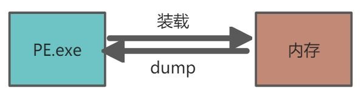


-   **映射：按照节表的内容，将PE文件按照节表信息和节数据依次映射进入内存。**
-   **DUMP：将内存中的数据按节表数据将目标数据拷贝出来成为一个PE.exe文件**


**dump的先决条件****：在OEP处dump，此时全局变量里的值未被初始化，不会存在全局变量的访问异常。**

#### 手动Dump

**描述Dump的原理，内存中需要dump的数据，PE头，节数据。**

1.  **拷贝PE文件头。**

1.  1.  **根据PE模块确定模块基址，在内存中找到文件头的位置，根据文件头大小将头数据dump到新文件中 。**

1.  **dump节数据。**

1.  1.  **获取节的RVA（相对虚拟地址），计算出VA（内存绝对地址），根据文件大小和内存大小字段dump到新文件中。**

1.  **依次拷贝完所有节，保存关闭。**


1.  1.  **文件大小 = 0，则不需要dump，表示该节中都是未初始化的数据**
    2.  **文件大小 > 内存大小，则dump文件大小的数据**
    3.  **文件大小  < 内存大小，同样dump文件大小的数据，表示其他数据是未初始化的数据**

##### 演示

可以把整个内存数据拷贝出来放到文件,但是这样数据偏移就会有问题,需要自己去修节表,还可以按照节表结构去拷贝出来,下面就是演示按节表结构拷贝

1.  首先用winhex打开需要dump的进程
2.  把PE头拷贝出来
3.  按照节表结构解析数据,拷贝出来

```
从内存S3处开始，拷贝S2大小的数据，到文件S1处
typedef struct _IMAGE_SECTION_HEADER {...
  DWORD VirtualAddress;			// S3:内存地址：基于模块基址，与SectionAlignment对齐（0x1000）
  DWORD SizeOfRawData;			// S2:文件大小，与FileAlignment对齐（0x200）
  DWORD PointerToRawData;		// S1:文件偏移，与FileAlignment对齐（0x200）
  ...
 }
```

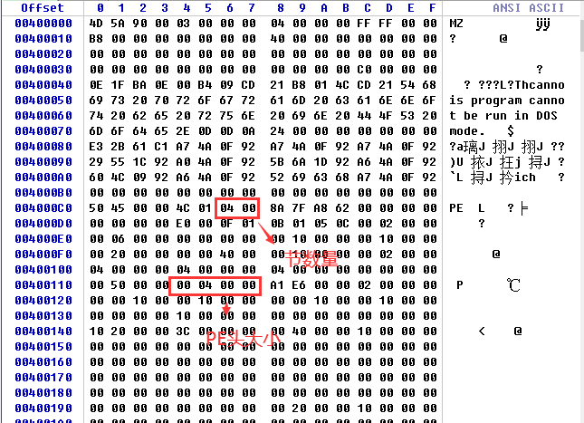

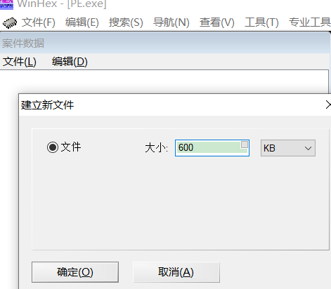


拷贝节数据


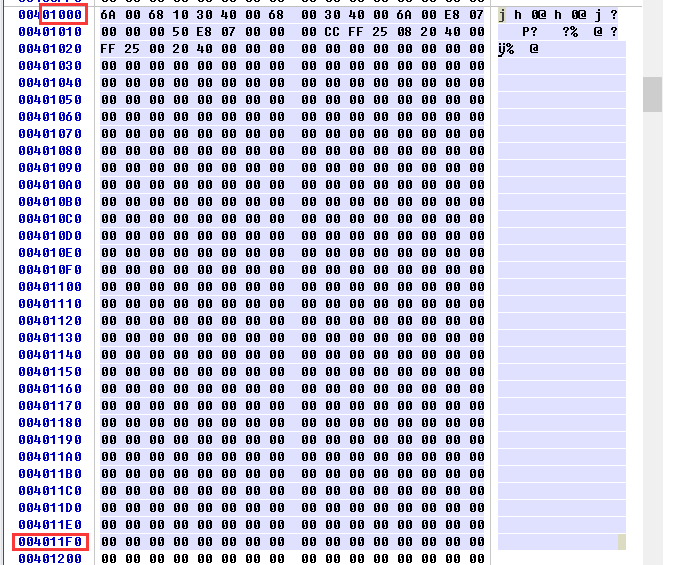


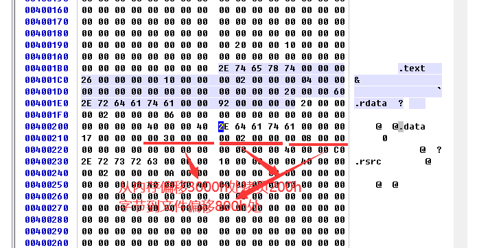

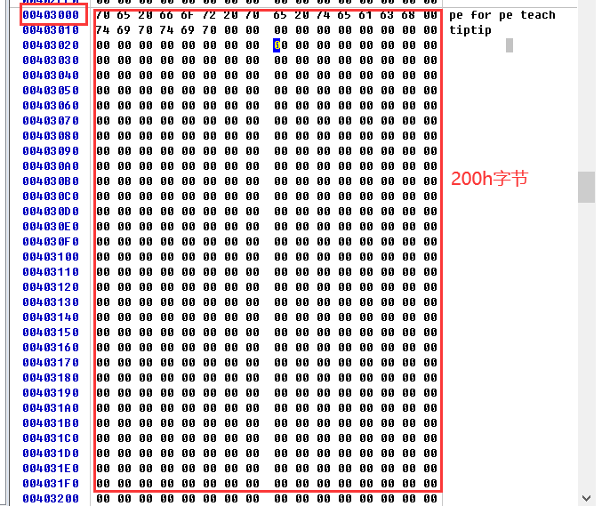


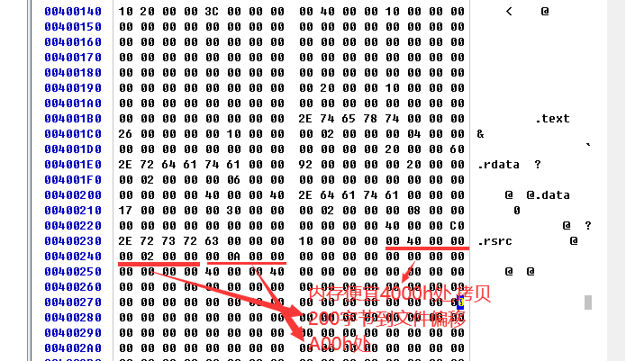

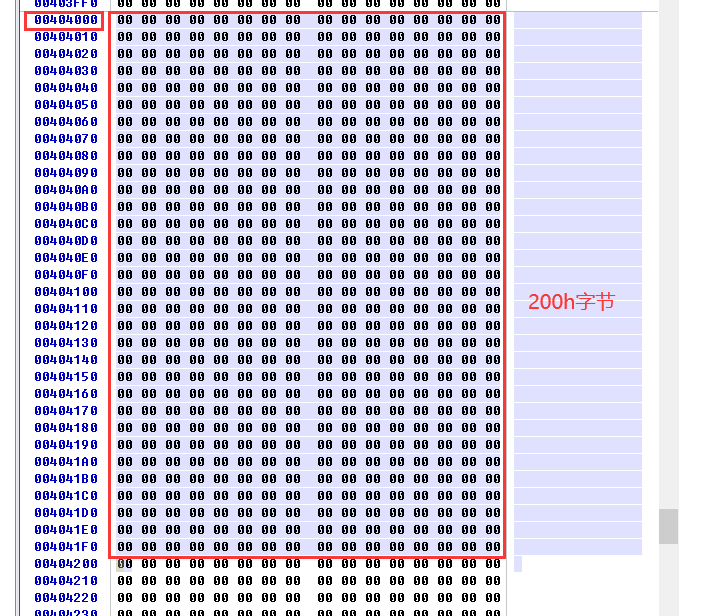

至此数据拷贝完了,包数据保存去运行,发现功能正常,所以拷贝是成功的


#### 插件Dump

一般的调试工具或者PE工具 例如x64,OD本身有dump的的功能和插件

##### OD

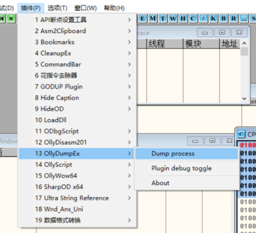

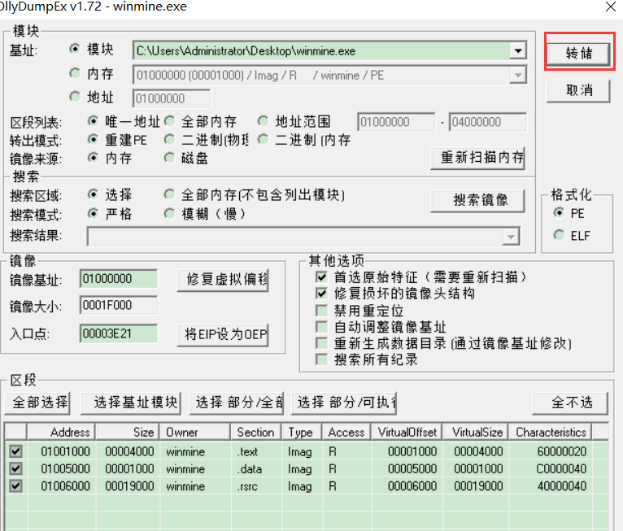


##### X64dbug

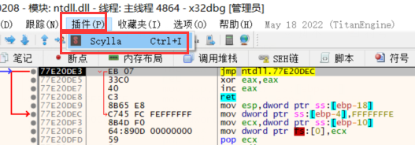

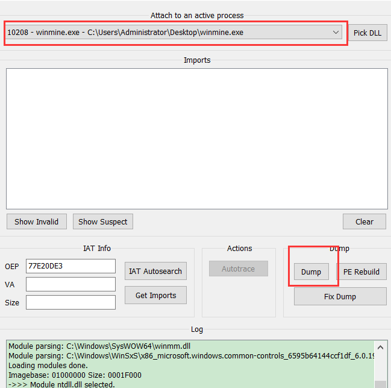


#### Dump时机不对原理：

1.  **原因：**dump的时机不对。程序运行中,此时全局变量中的值需要做修改,不为NULL，跳过了程序的空指针检查，导致指针访问异常。

如果程序运行起来以后，全局变量里面已经有值了，此时dump，则会将全局变量的值也dump到新文件。当dump后的文件运行时，里面有值，就越过了空检查，然而此时的的值是错误的，导致了内存访问异常。

Dump有值的原因

```
LPBYTE g_p = NULL
if g_p != NULL
{
    g_p = new BYTE[0x1000];
}

//使用
```

因此 dump最好的时间就是代码还没执行的时候,即在程序的入口点,所以要找oep,可以用调试器把程序在入口点挂起,再去dump

#### 


#### 反内存Dump

#####  依据Dump原理

根据dump原理，删除或者改变PE头中用到的关键信息，或者破坏PE信息，使得dump到的新文件，windwos不支持。

比如：

-   修改节的内存地址，欺骗攻击者或者工具，使得dump到错误的数据
-   修改PE中的关键数据，使得即使dump到正确的代码，也不能正确执行，比如PE镜像大小（和计算出的大小不一致,OS就有可能不承认）
-   加载PE后抹除导入表数据。

##### 对抗方法

直接从PE文件中Dump获取数据。

导入表对抗：

加壳软件分次解密：

-   对抗方法：分层dump


### 节表注入

------

代码注入的一种，将代码添加到现有节数据中，或则是新增一个节当中，然后修改OEP指向新增的代码处，OEP执行完成后重新跳转到Old  OEP处。

#### 利用节空隙

1.  添加节区数据
2.  节表添加一项  ,  节表个数    NumberOfSections  + 1
3.  修改  SizeOfImage  大小  ,原大小加上节区数据对齐后的大小


将自定义机器码直接写入PE文件内的空闲位置处。


-   **缺陷：**节之间的大小，可能不够使用。且仅限用于手动做，写代码做就很麻烦。对 00 00 00 00 是否有效不好掌控。
-   **应用举例：**CHI病毒。写PE.exe ->运行程序执行流程 -> jmp 到原来 OEP 

##### 注入流程：

1.  寻找节与节之间的空隙，很多 00 00 00 00 处，手动构造机器码，注意绝对地址的使用。

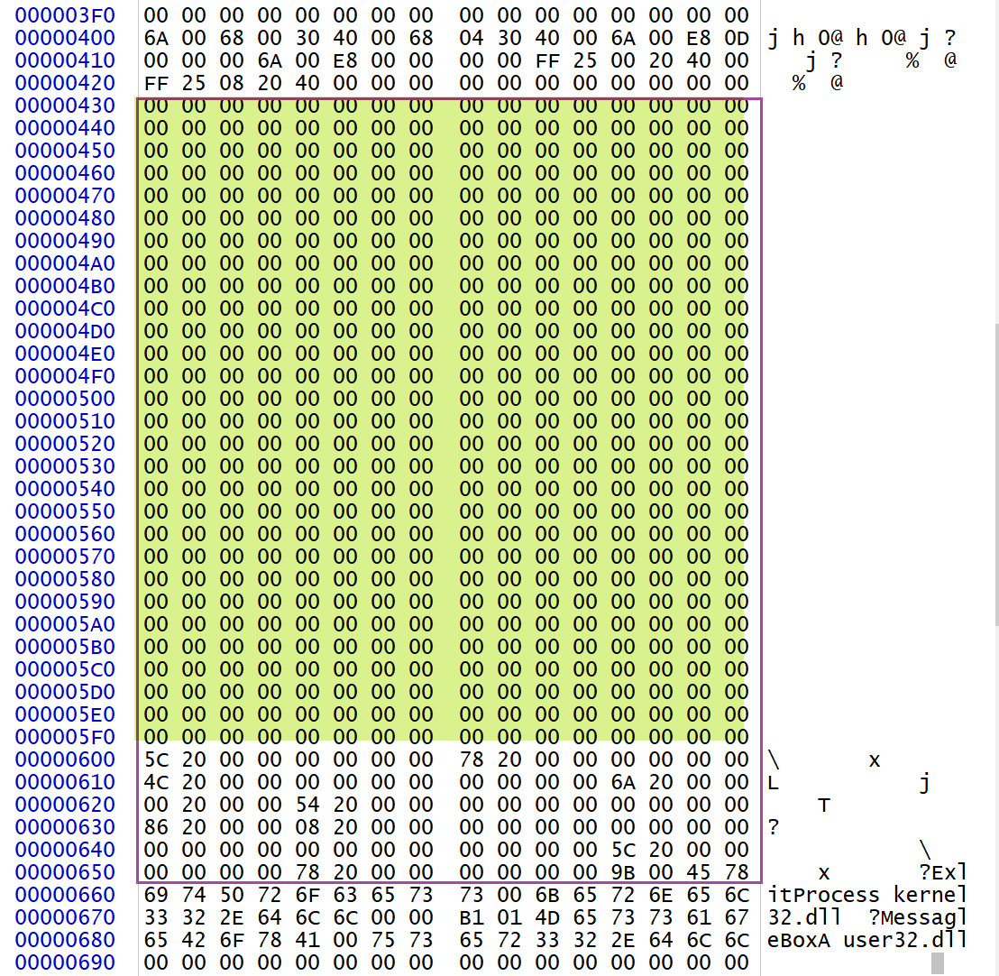

1.  修改OEP
2.  执行自己的流程
3.  执行完流程jmp到原来的OEP


##### 操作演示

把winmine 加入到我们的 PE 程序中

1.  首先在 winhex 中 打开2个 可执行文件


1.  把winmin的所有数据拷到PE.exe 最后面

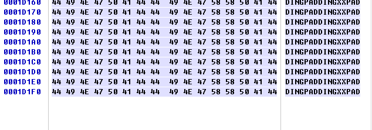

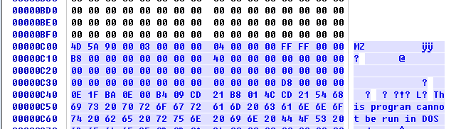

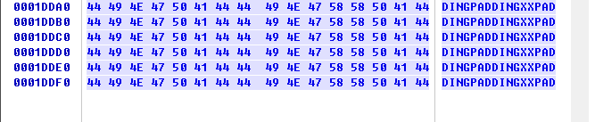

1.  增加一个节

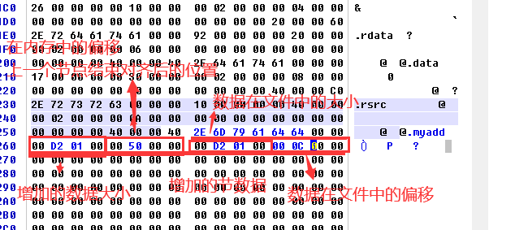

 

1.  修改内存总大小和节数量

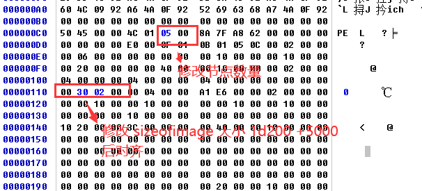

用OD打开程序,可以看到扫雷数据成功写入了我们程序中

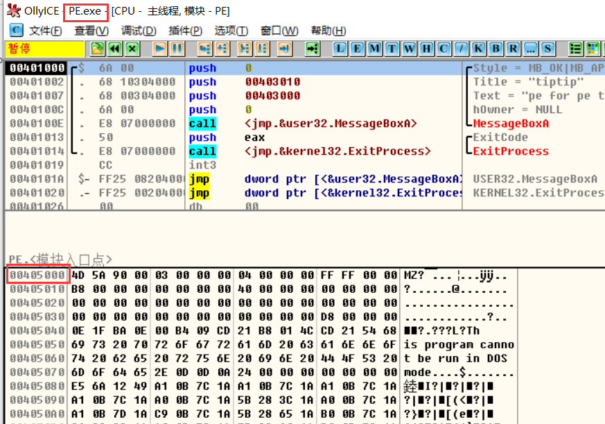 

注意:像这种节表后面有数据的是没有办法使用添加节的

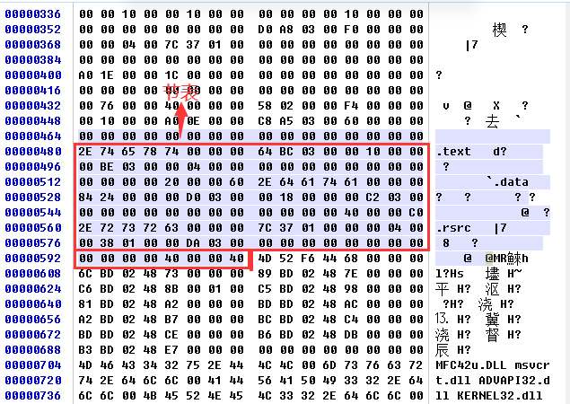

#### 新增一个节

-   新增一个节，将数据放到最后。
-   优点：数据有多大，就放多大。
-   缺陷：对于有的程序，当节表后面没有空隙，即有附加数据,直接跟了数据的程序不适用
-   影响的字段：

-   -   **IMAGE_FILE_HEADER**

-   -   -   **NumberOfSections** 节的个数

-   -   **IMAGE_OPTIONAL_HEADER** 

-   -   -   **OEP**
        -   **SizeOfImage：在内存中所占内存的大小**
        -   **SIzeOfHeaders：PE文件格式总大小。如果节表够多，一般不小于400h**


**步骤：**

1.  **IMAGE_FILE_HEADER 中的NumberOfSections 增加1**
2.  **节表中增加一项**
3.  **PE中添加节数据，数据必须跟文件对齐值对齐。**
4.  **修改IMAGE_OPTIONAL_HEADER 中的SizeOfImage 和 AddressOfEntryPoint**

1.  增加节，很明显，我们首先要该的是节的个数，并将新的节的属性增加到IMAGE_SECTION_HEADER的后面

1.  1.  这里会遇到一个问题，通过修改，PE的头部大小可能不支持我们增加一个节，这时需要我们先插入一个文件对齐值大小的控件，再将节数据写入文件
    2.  这时就会增加文件头部大小，我们需要对PE的数据进行修正，包括头部大小以及所有节的文件地址，所有节的文件地址+文件对齐值

1.  增加节的内容，即注入代码，需要注意的是，增加的文件内容也是需要文件对齐的，不足补0
2.  修改镜像大小，由于这里我们是新加的节，OS在映射到内存时，必然会从一个新的内存页开始，所以镜像大小必然要变大
3.  要使注入的代码能够运行，就要修改entry point

**不适用以下情况：节表和节数据之间没有空隙**

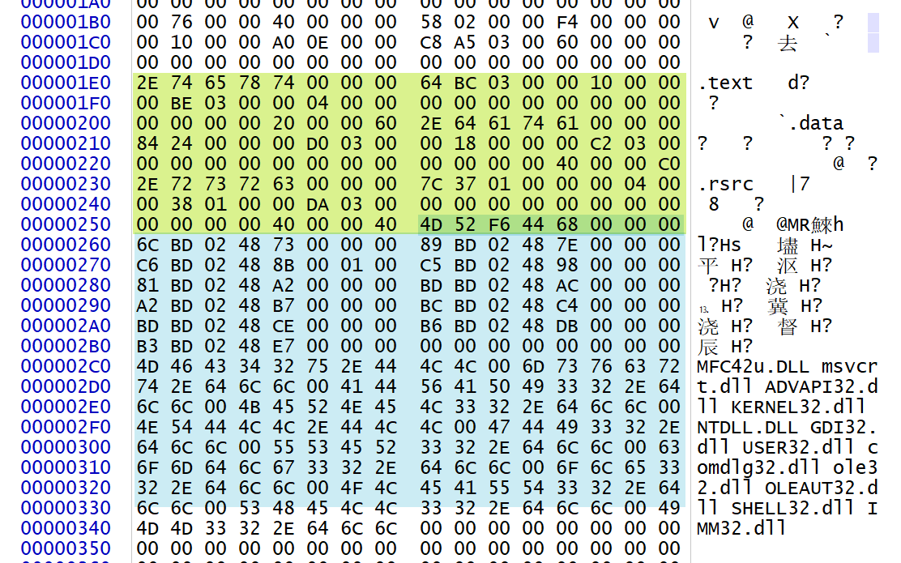

#### 扩展最后一个节

思路是直接将注入的代码当作最后一个节的内容，需要修改的地方首先能想到的就是节数组中最后一个节的文件大小，以及内存大小。

比较隐秘的坑，由于原PE文件，节的大小是按照文件对齐值来设置的，现在新增了数据，新增的数据要以文件对齐值的大小为单位。如新增的数据超过内存对齐值，我们就要相应的修改PE镜像大小。

**缺陷：**这种方式最方便，但是修改的代码很大，稳定性很差。必须是最后一个,前面不可以


##### 步骤：

1.  添加节数据
2.  修改节表最后一项,拓展文件大小和内存大小 IMAGE_OPTIONAL_HEADER 中 的SizeOfImage 和   AddressOfEntryPoint
3.  修改 SizeOfImage  


##### 操作演示

把winmine 加入到我们的 PE 程序中

1.  首先在 winhex 中 打开2个 可执行文件

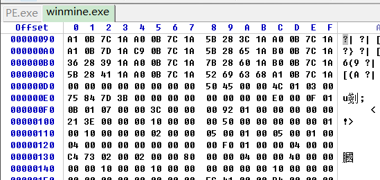

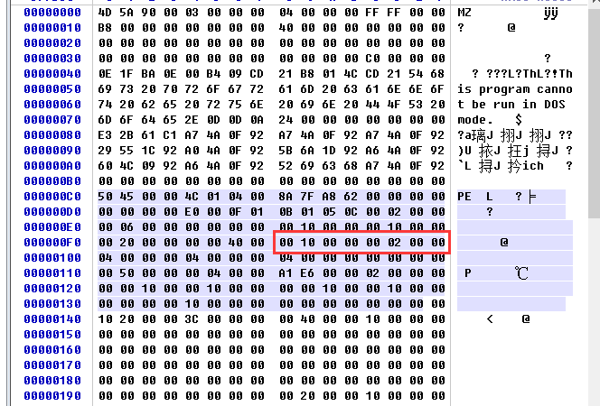

1.  把winmine数据拷贝到 pe.exe

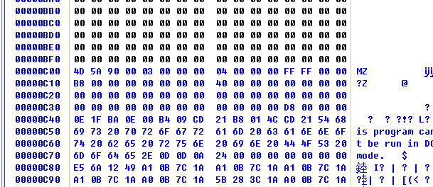

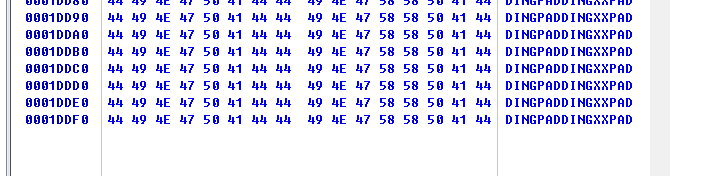

1.  修改节表最后一项


1.   修改 SizeOfImage  

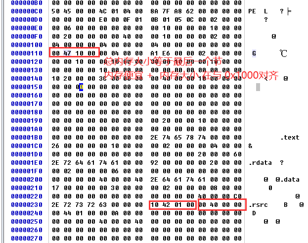


在通过OD去看,发现winmain数据已经 写入 PE

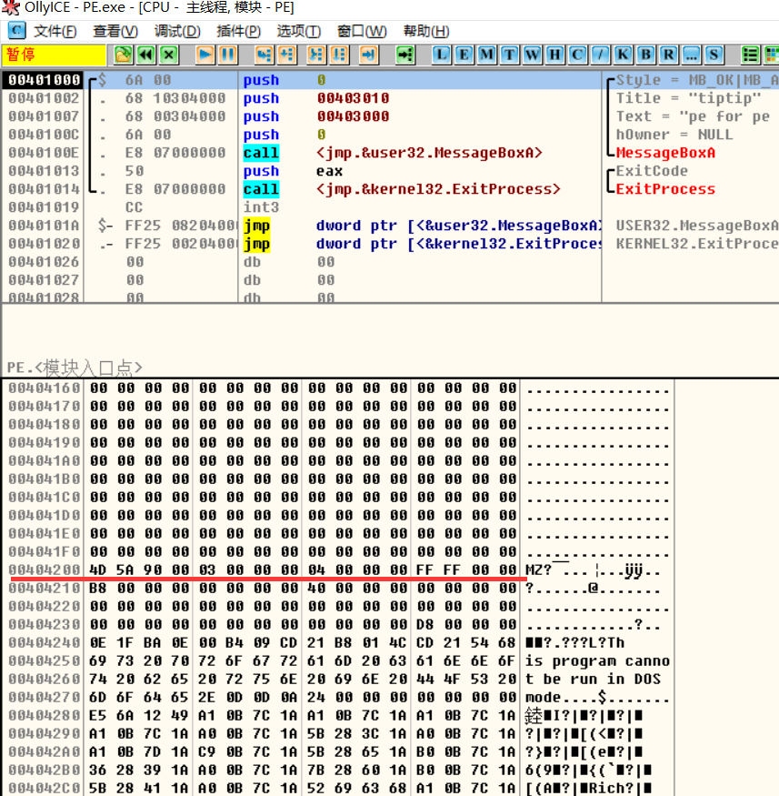

注意

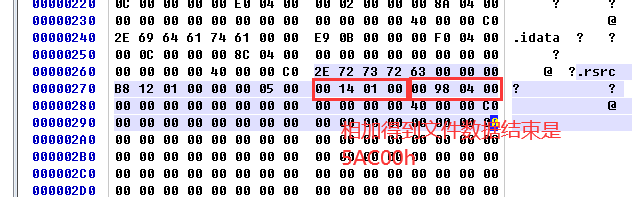

#### 使用空节