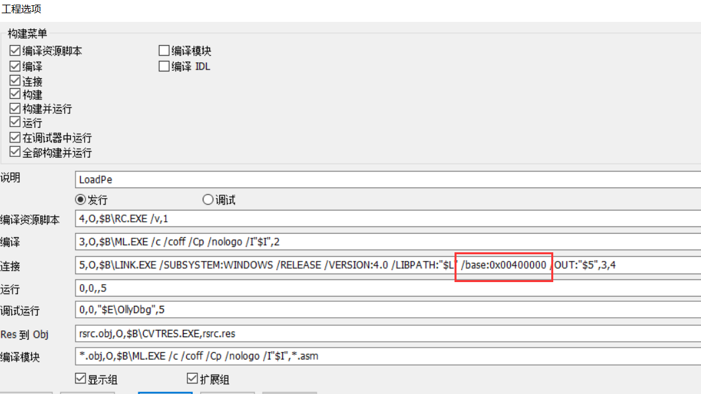
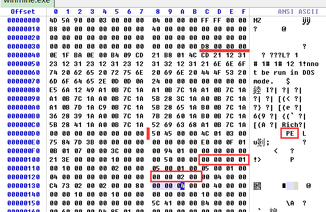
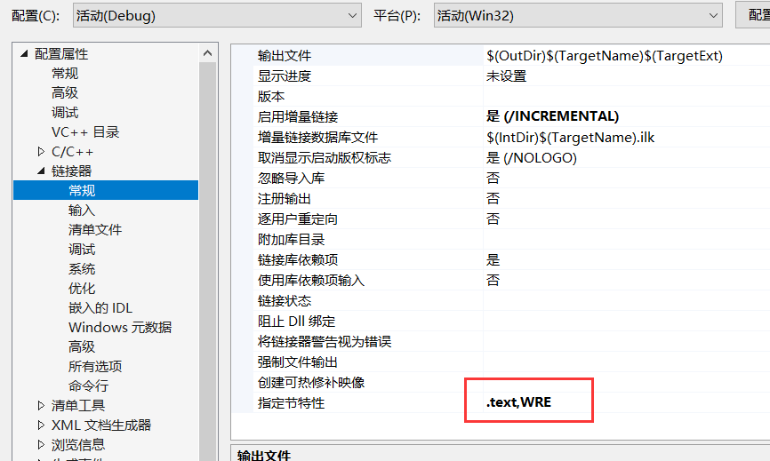

LoadPE  -  pe 加载器    壳的前身

​         如果想访问一个程序运行起来的内存,一种方法就是跨进程读写内存,但是跨进程读写内存需要来回调用api,不如直接访问地址来得方便,那么如果我们需要直接访问地址,该怎么做呢?.需要把dll注进程,注进去的代码跟他在同一块进程里面,这样我们就可以直接访问这个进程的地址,但是不想注入,也不想跨进程读写地址,就直接读进程地址,有什么方法呢?如果把导入表里面加一个dll,这样很容易检查出来,模块里一遍历,就可容易看到了, 其实我们可以反其道行之,换种思路,不是往他进程里面塞东西,而是把他加载到我们进程里面.,这个时候再去访问进程内存其实就是访问我们自己的内存.


#### 1.系统加载exe的流程

-   准备一个新的内存；
-   按照顺序把节表内容映射进内存；
-   填写导入表。

#### 2.LoadPE的目的

-   可以在自己进程更改目标PE的内存。

#### 3.LoadPE的重点

-   1.在自己代码前留出足够空间--目标进程的SizeofImage；
-   2.更改自己程序的ImageBase加载到目标ImageBase处：/base:0x。



这样,目标进程的PE头就占据了我们自己进程的 PE头,他的数据节就覆盖了我们自己的数据节,即目标进程的数据就会覆盖我们自己进程的数据,因此我们需要  把我们的代码往后移,给 目标进程 留出足够的空间

#### 4.LoadPE的实现思路

-   设置我们进程的  ImageBase  和 目标进程  ImageBase   保持一致
-   我们需要把我们的代码往后移,腾出来的内存可以放目标程序
-   读目标进程的数据,按照节表拷贝数据帮他处理导入表
-   执行目标进程代码。

#### 5.LoadPE的汇编实现

1.  用winhex查看目标进程的   ImageBase    和   SizeofImage
2.  新建工程,并且在工程选项设置  自己工程 的  ImageBase    与目标进程的一致
3.  后移自己的代码,可以在开头定义   SizeofImage  大小的全局变量    或者通过指令    org  偏移调整指令

注意,很多 C 库函数 并不会 保存  ecx , edx 环境,自己使用前记得先保存


进程的模块基址和 数据大小可以通过 winhex看



```assembly
.586
.model flat,stdcall
option casemap:none

   include windows.inc
   include user32.inc
   include kernel32.inc
   include msvcrt.inc
   
   includelib user32.lib
   includelib kernel32.lib
   includelib msvcrt.lib

IMAGE_SIZE equ 20000h     ;往后移的大小,即目标进程的SizeofImage


.data
    g_szFile db "winmine.exe", 0    ;要读取的进程

.code
    org IMAGE_SIZE 


LoadPe proc
    LOCAL @dwImageBase:DWORD       ;自己进程的模块基址
    LOCAL @hFile:HANDLE            ;文件句柄
    LOCAL @hFileMap:HANDLE         ;映射句柄
    LOCAL @pPEBuf:LPVOID           ;映射文件的缓冲地址
    LOCAL @pDosHdr:ptr IMAGE_DOS_HEADER      ;目标进程的dos头
    LOCAL @pNTHdr:ptr IMAGE_NT_HEADERS       ;目标进程的NT头
    LOCAL @pSecHdr:ptr IMAGE_SECTION_HEADER  ;目标进程的节表
    LOCAL @dwNumOfSecs:DWORD                 ;目标进程的节表数量
    LOCAL @pImpHdr:ptr IMAGE_IMPORT_DESCRIPTOR   ;目标进程的导入表
    LOCAL @dwSizeOfHeaders:DWORD                 ;目标进程的选项头大小
    LOCAL @dwOldProc:DWORD                       ;旧的内存属性
    LOCAL @hdrZeroImp:IMAGE_IMPORT_DESCRIPTOR    ;导入表结束标志,所有项全0
    LOCAL @hDll:HMODULE                          ;加载dll的句柄
    LOCAL @dwOep:DWORD                           ;进程的入口地址
    
    ;判断导入表结束的标志清0
    invoke RtlZeroMemory, addr @hdrZeroImp, size IMAGE_IMPORT_DESCRIPTOR
    
    ;自己的模块基址
    invoke GetModuleHandle, NULL
    mov @dwImageBase, eax
    
    
    ;解析PE文件，获取表
    
    ;打开文件
    invoke CreateFile, offset g_szFile, GENERIC_READ, FILE_SHARE_READ,NULL, OPEN_EXISTING,FILE_ATTRIBUTE_NORMAL, NULL
    ;check ....
    mov @hFile, eax   ;保存文件句柄
    
    invoke CreateFileMapping, @hFile, NULL, PAGE_READONLY, 0, 0, NULL   ;创建文件映射
    ;check
    mov @hFileMap, eax    ;创建文件映射句柄
    
    invoke MapViewOfFile, @hFileMap, FILE_MAP_READ, 0, 0, 0      ;将整个文件映射进内存
    ;check 
    mov @pPEBuf, eax      ;保存映射文件内存的地址
    
    ;解析目标进程
    
    ;目标进程的 dos 头
    mov eax, @pPEBuf      
    mov @pDosHdr, eax
    
    ;目标进程的 nt头
    mov esi, @pDosHdr
    assume esi:ptr IMAGE_DOS_HEADER
    mov eax, @pPEBuf
    add eax, [esi].e_lfanew   ;获取nt头的偏移地址
    mov @pNTHdr, eax
    
    
    mov esi, @pNTHdr
    assume esi:ptr IMAGE_NT_HEADERS
    
    ;选项头信息
    mov eax, [esi].OptionalHeader.SizeOfHeaders    ;获取选项头大小
    mov @dwSizeOfHeaders, eax
    
    ;进程的入口地址  =  进程的内存偏移地址 + 模块基址
    mov eax, [esi].OptionalHeader.AddressOfEntryPoint
    add eax, @dwImageBase
    mov @dwOep, eax
    
    
    ;节表  地址: 选项头地址+大小
    movzx eax, [esi].FileHeader.NumberOfSections
    mov @dwNumOfSecs,eax
    
    lea ebx, [esi].OptionalHeader
    
    ;获取选项头大小：用于定位节表位置=选项头地址+选项头大小
    movzx eax, [esi].FileHeader.SizeOfOptionalHeader   ;把 word 转为 dword
    add eax, ebx
    mov @pSecHdr, eax   ;保存节表地址
    
    
    ;修改内存属性
    invoke VirtualProtect, @dwImageBase, IMAGE_SIZE, PAGE_EXECUTE_READWRITE, addr @dwOldProc
    
    ;拷贝PE头  从映射内存拷贝到 自己进程的最开始处 
    invoke crt_memcpy, @dwImageBase, @pPEBuf, @dwSizeOfHeaders


    ;按照节表，拷贝节区数据
    mov esi, @pSecHdr
    assume esi:ptr IMAGE_SECTION_HEADER
    xor ecx, ecx
    .while ecx < @dwNumOfSecs   ;遍历节表
        ;目标
        mov edi, @dwImageBase
        add edi, [esi].VirtualAddress  ;获取节的内存地址 + 模块地址 就是内存中的绝对地址
        
        ;源
        mov ebx, @pPEBuf
        add ebx, [esi].PointerToRawData  ;获取指定进程的节数据的偏移地址  映射的首地址 + 文件偏移地址
        
        ;大小[esi].SizeOfRawData
        
        ;拷贝  注意,很多 C 库函数 并不会 保存 ecx ,edx 环境,自己使用前记得先保存
        push ecx
        push edx
        invoke crt_memcpy, edi, ebx, [esi].SizeOfRawData   ;将目标进程的节数据拷贝进自己的进程
        pop edx
        pop ecx
    
        inc ecx      ;计数++
        add esi, size IMAGE_SECTION_HEADER  ;指针移动
    .endw
    
    ;获取导入表  如果在前面获取导入表信息,那么就需要对内存地址和文件地址做转化比较麻烦
                ;但是把数据拷贝到我们进程之后只需要访问内存进程就可以了
    mov esi, @pNTHdr
    assume esi:ptr IMAGE_NT_HEADERS
    
    ;获取导入表地址 ,数组的第二个元素的第一个成员 
    mov eax, [esi].OptionalHeader.DataDirectory[IMAGE_DIRECTORY_ENTRY_IMPORT*8].VirtualAddress
    add eax, @dwImageBase   ;获取导入表在进程的绝对地址  内存偏移 + 模块基址
    mov @pImpHdr, eax       ;保存导入表的地址
    
    ;处理导入表
    mov esi, @pImpHdr
    assume esi:ptr IMAGE_IMPORT_DESCRIPTOR
    
    .while TRUE     ;遍历导入表
    
        ;判断结束，全0项结束
        invoke crt_memcmp, esi, addr @hdrZeroImp
        .if eax == 0
            .break
        .endif
        
        
        ;判断字段,为空则结束
        .if [esi].Name1 == NULL || [esi].FirstThunk == NULL
            .break
        .endif 
       
       
       ;加载dll
        mov eax, [esi].Name1
        add eax, @dwImageBase
        push ecx
        push edx
        invoke LoadLibrary, eax   ;根据dll名加载 dll 
        pop edx
        pop ecx
        ;check              如果此时为空加说明无法找到dll
        mov @hDll, eax      ;保存dll的模句柄
        
        ;获取导入地址表,IAT
        mov ebx, [esi].FirstThunk
        add ebx, @dwImageBase
        
        ;获取导入名称表,INT
        mov edi, ebx
        .if [esi].OriginalFirstThunk != NULL
            mov edi, [esi].OriginalFirstThunk
            add edi, @dwImageBase            
        .endif
        
        
        ;遍历导入名称表
        .while dword ptr [edi] != 0
            
            .if dword ptr [edi] & 80000000h   ;判断最高位是否为1
                ;序号导入,获取序号
                mov edx, dword ptr [edi]
                and edx, 0ffffh               ;获取低 word 
            .else
                ;名称导入
                mov edx, dword ptr [edi]
                add edx, @dwImageBase
                add edx, 2                  ;名称前面有2个无用字节
            .endif
            
            ;获取dll导入函数进程加载后地址
            push ecx
            push edx
            invoke GetProcAddress, @hDll, edx
            pop edx
            pop ecx
            ;check
            
            ;把地址存入 INT 表
            mov dword ptr [ebx], eax
            
            add ebx, 4
            add edi, 4
        .endw
        
        
        add esi, size IMAGE_IMPORT_DESCRIPTOR
    .endw
    
     ;清理
    invoke UnmapViewOfFile,@pPEBuf
    invoke CloseHandle,@hFileMap
    invoke CloseHandle,@hFile
    
    ; 执行加载的pe的代码
    jmp @dwOep
    
    ret

LoadPe endp

start:
    invoke LoadPe
	invoke ExitProcess,0

end start

```

需要合并节

.text,ERW



C++版：

```c++
#include <windows.h>
#include <concrt.h>
#include <iostream>
using namespace std;

#define IMAGE_SIZE 0x5000	


//留空的全局变量
char szBuff[IMAGE_SIZE] = { 1 };

#if 1
char g_szExeName[] = "PE.exe";	//需要加载的PE路径


LPVOID lpMapAddr = NULL;

HANDLE LoadPe()
{
    DWORD  dwOldProc = 0;
    PIMAGE_IMPORT_DESCRIPTOR pImpHdr = NULL;
    IMAGE_IMPORT_DESCRIPTOR  zeroImp = { 0 };
    HANDLE hDll = NULL;
    PIMAGE_THUNK_DATA pTmpThunk = NULL;
    DWORD  dwPFNAddr = 0;
    DWORD  dwIAT = 0;

    // 获取模块句柄
    HANDLE hInst = GetModuleHandle(NULL);

    // 读取文件
    HANDLE hFile = CreateFile(g_szExeName, GENERIC_READ, FILE_SHARE_READ, NULL, OPEN_EXISTING, FILE_ATTRIBUTE_NORMAL, NULL);
    if (hFile == INVALID_HANDLE_VALUE)
    {
        return 0;
    }

    // 创建文件映射对象
    HANDLE hFileMap = CreateFileMapping(hFile, NULL, PAGE_READONLY, 0, 0, NULL);
    if (hFileMap == NULL)
    {
        CloseHandle(hFile);
        return 0;
    }

    void* lpMapAddr = MapViewOfFile(hFileMap, FILE_MAP_READ, 0, 0, 0);
    if (lpMapAddr == NULL)
    {
        CloseHandle(hFileMap);
        CloseHandle(hFile);
        return 0;
    }

    // 拷贝PE头
    PIMAGE_DOS_HEADER pDosHeader = (PIMAGE_DOS_HEADER)lpMapAddr;
    PIMAGE_NT_HEADERS pNtHeader = (PIMAGE_NT_HEADERS)((DWORD)lpMapAddr + pDosHeader->e_lfanew);

    DWORD dwSizeOfHeaders = pNtHeader->OptionalHeader.SizeOfHeaders;
    DWORD dwNumOfSection = pNtHeader->FileHeader.NumberOfSections;

    //获取节表首地址  (选项头地址+ 大小)
    PIMAGE_SECTION_HEADER pSecHdr = (PIMAGE_SECTION_HEADER)((DWORD)pNtHeader->FileHeader.SizeOfOptionalHeader + (DWORD)(&pNtHeader->OptionalHeader));

    DWORD dwOep = (DWORD)hInst + pNtHeader->OptionalHeader.AddressOfEntryPoint;

    // 更改内存属性
    VirtualProtect(hInst, IMAGE_SIZE, PAGE_EXECUTE_READWRITE, &dwOldProc);

    //拷贝PE头
    memcpy(hInst, lpMapAddr, dwSizeOfHeaders);

    // 拷贝拷贝节区数据
    DWORD i = 0;
    while (dwNumOfSection > i)
    {
        //拷贝数据
        DWORD pDst = (DWORD)hInst + (DWORD)pSecHdr->VirtualAddress;
        DWORD pSrc = (DWORD)lpMapAddr + (DWORD)pSecHdr->PointerToRawData;
        //DWORD pSrc = (DWORD)pSecHdr;
        memcpy((void*)pDst, (void*)pSrc, pSecHdr->SizeOfRawData);
        int nSecHdrSzie = sizeof(IMAGE_SECTION_HEADER);
        
        pSecHdr = (PIMAGE_SECTION_HEADER)((DWORD)pSecHdr + (DWORD)nSecHdrSzie);

        i++;
    }

    //获取导入表地址
    pImpHdr = (PIMAGE_IMPORT_DESCRIPTOR)((DWORD)pNtHeader->OptionalHeader.DataDirectory[1].VirtualAddress 
              + (DWORD)hInst);
   
    // 处理导入表
    while (TRUE)
    {
        // 遇到全0项，遍历结束 
        int nRet = memcmp(pImpHdr, &zeroImp, sizeof(IMAGE_IMPORT_DESCRIPTOR));
        if (nRet == 0)
        {
            break;
        }

        //判断字段, 为空则结束

        if (pImpHdr->Name == NULL || pImpHdr->FirstThunk == NULL)
        {
            break;
        }


        DWORD pNameAddre = (DWORD)pImpHdr->Name + (DWORD)hInst;
        // 加载dll
        HMODULE hDll = LoadLibrary((LPCSTR)pNameAddre);
        if (hDll == NULL)
        {
            break;
        }

        DWORD pFunAddr = 0;
        DWORD pIAT = (DWORD)pImpHdr->FirstThunk + (DWORD)hInst;
        DWORD pINT = (DWORD)pImpHdr->OriginalFirstThunk;
        if (pINT != 0)
        {
            pFunAddr = pINT + (DWORD)hInst;
        }
        else
        {
            pFunAddr = pIAT;

        }

        // 遍历导入名称表
        while (true){
            DWORD pAddr = *(DWORD*)pFunAddr;
            if (pAddr == 0)
            {
                break;
            }
            DWORD  pFun = 0;
            if (pAddr & 0x80000000)
            {
                //序号导入, 获取序号
                pFun = pAddr & 0xffff;
            }
            else
            {
                pFun = pAddr + 2 + (DWORD)hInst;
            }

            DWORD  dwPFNAddr = (DWORD)GetProcAddress(hDll, (LPCSTR)LOWORD(pFun));
            *(DWORD*)pIAT = dwPFNAddr;
            pIAT += 4;
            pFunAddr+=4;
       }

        pImpHdr = (PIMAGE_IMPORT_DESCRIPTOR)((DWORD)pImpHdr + (DWORD)sizeof(IMAGE_IMPORT_DESCRIPTOR));
    }

    // 关闭句柄
    UnmapViewOfFile(lpMapAddr);
    CloseHandle(hFileMap);
    CloseHandle(hFile);

    // 返回地址
    return &dwOep;
}


#endif // 0

int main()
{

#if 1
    // 加载PE文件，返回原OEP
    void* pOep = LoadPe();
    if (pOep != NULL)
    {
        __asm jmp pOep
    }

#endif // 0

    return 0;
}

```

```c++
#include <iostream>
#include <Windows.h>
#include <stdio.h>

using namespace std;

#define FILESIZE  0x00020000         //目标进程的SizeofImage
#define IMAGEBASE 0x01000000

char szExeDataBuff[FILESIZE] = {1};
char g_szExeName[] = "winmine.exe";   //要加载的进程路径

DWORD g_oep = 0;

void LoadPe()
{

    // 创建文件映射
    //打开文件
	HANDLE hFile = CreateFile(g_szExeName, GENERIC_READ, FILE_SHARE_READ, NULL, OPEN_EXISTING, FILE_ATTRIBUTE_NORMAL, NULL);
	if (hFile == INVALID_HANDLE_VALUE)
	{
		return ;
	}

    // 创建文件映射对象
	HANDLE hFileMap = CreateFileMapping(hFile, NULL, PAGE_READONLY, 0, 0, NULL);
	if (hFileMap == NULL)
	{
		CloseHandle(hFile);
		return;
	}

    //将文件映射进内存
	LPVOID pView = MapViewOfFile(hFileMap, FILE_MAP_READ, 0, 0, 0);
	if (pView == NULL)
	{
		CloseHandle(hFileMap);
		CloseHandle(hFile);
		return;
	}

    // 修改代码节属性
    DWORD nOldProtect = 0;
    VirtualProtect((LPVOID)IMAGEBASE, FILESIZE, PAGE_EXECUTE_READWRITE, &nOldProtect);

    // 处理PE
    PIMAGE_DOS_HEADER pDos = (PIMAGE_DOS_HEADER)pView;

    // 获取pe头大小
    PIMAGE_NT_HEADERS32 pNt = (PIMAGE_NT_HEADERS32)((DWORD)pView + pDos->e_lfanew);

    memcpy((void*)IMAGEBASE, (void*)pDos, pNt->OptionalHeader.SizeOfHeaders);

    // OEP
    g_oep = pNt->OptionalHeader.AddressOfEntryPoint + IMAGEBASE;

    // 解析节
    PIMAGE_SECTION_HEADER pSec = (PIMAGE_SECTION_HEADER)((DWORD) & (pNt->OptionalHeader.Magic) + pNt->FileHeader.SizeOfOptionalHeader);
    
    // 节数量
    unsigned int nNumberOfSections = pNt->FileHeader.NumberOfSections;

    while (nNumberOfSections != 0)
    {
        void* pVirtualAddress = (void*)(pSec->VirtualAddress + IMAGEBASE);
        void* pFileAddress = (void*)(pSec->PointerToRawData + (DWORD)pDos);
        memcpy(pVirtualAddress, pFileAddress, pSec->SizeOfRawData);
        nNumberOfSections--;
        pSec++;
    }

    if (pNt->OptionalHeader.NumberOfRvaAndSizes > 2)
    {
        // 处理导入表
        PIMAGE_IMPORT_DESCRIPTOR pIm = (PIMAGE_IMPORT_DESCRIPTOR)(pNt->OptionalHeader.DataDirectory[1].VirtualAddress + IMAGEBASE);
        while (pIm->Name && pIm->FirstThunk)
        {
            HMODULE hModule = LoadLibraryA((char*)(pIm->Name + IMAGEBASE));
            if (hModule == NULL)
            {
                pIm++;
                continue;
            }

            DWORD dwThunkData = pIm->OriginalFirstThunk ? pIm->OriginalFirstThunk : pIm->FirstThunk;
            if (dwThunkData == 0)
            {
                return ;
            }

            PIMAGE_THUNK_DATA pThunkData = (PIMAGE_THUNK_DATA)(dwThunkData + IMAGEBASE);
            DWORD* pPfn = (DWORD*)(pIm->FirstThunk + IMAGEBASE);
            while (pThunkData->u1.AddressOfData)
            {
                FARPROC farProc = 0;
                LPCSTR lpParam2 = 0;

                // 最高位判断
                if (pThunkData->u1.AddressOfData & 0x80000000)
                {
                    // 序号
                    lpParam2 = LPCSTR(LOWORD(pThunkData->u1.AddressOfData));
                }
                else
                {
                    // 函数名
                    lpParam2 = LPCSTR(pThunkData->u1.AddressOfData + IMAGEBASE + 2);
                }
                farProc = GetProcAddress(hModule, lpParam2);

                // 填充IAT
                *pPfn = (DWORD)farProc;
                pThunkData++;
                pPfn++;
            }

            pIm++;
        }
    }

    //取消映射
    UnmapViewOfFile(pView);
    //关闭文件映射对象
    CloseHandle(hFileMap);
    //关闭文件
    CloseHandle(hFile);
}

int main()
{
    LoadPe();
    if (g_oep != 0)
    {
        __asm
        {
            jmp g_oep;
        }
    }

    return 0;
}

```

思路: 主要难点是代码后移,留出空间

方法1:   内联   汇编    开始  nop

方法2:  把代码放到dll中  

方法3:  合并节,全局变量是放在未初始化的节内合并后就会在第一个节

合并节代码：

```c++
#include <Windows.h>
#pragma bss_seg (".mySec")
char g_aryImageSize[0x200000];
		
#pragma bss_seg()
#pragma comment(linker,"/MERGE:.mySec=.textbss")

const char* g_szExe = "mspaint.exe";

int main()
{

	HANDLE hFile = NULL;
	HANDLE hFileMap = NULL;
	LPVOID pFileBuf = NULL;
	IMAGE_DOS_HEADER* pDosHdr = NULL;
	IMAGE_NT_HEADERS* pNtHdr = NULL;
	IMAGE_FILE_HEADER* pFileHdr = NULL;
	IMAGE_OPTIONAL_HEADER* pOptHdr = NULL;
	IMAGE_SECTION_HEADER* pSecHdr = NULL;
	IMAGE_IMPORT_DESCRIPTOR* pImpDes = NULL;
	DWORD dwSizeOfOptHdr = 0;
	DWORD dwNumOfSecs = 0;
	HANDLE hMod = NULL;
	DWORD  dwSizeOfHeader = 0;
	DWORD dwOldProc = 0;
	DWORD dwEntry = 0;
	HMODULE hDll = NULL;
	LPDWORD pINT = NULL;
	LPDWORD pIAT = NULL;
	DWORD dwAddrOfFunc = 0;
	IMAGE_IMPORT_DESCRIPTOR zeroImp;

	memset(&zeroImp, 0, sizeof(IMAGE_IMPORT_DESCRIPTOR));

	//1、创建文件
	hMod = GetModuleHandle(NULL);

	hFile = CreateFile(g_szExe,
		GENERIC_READ,
		FILE_SHARE_READ,
		NULL,
		OPEN_EXISTING,
		FILE_ATTRIBUTE_NORMAL,
		NULL);
	if (hFile == INVALID_HANDLE_VALUE)
	{
		OutputDebugString("Could not open file.");
		return -1;
	}
	//2、创建文件映射
	hFileMap = CreateFileMapping(hFile, NULL, PAGE_READONLY, 0, 0, NULL);

	if (hFileMap == NULL)
	{
		OutputDebugString("Could not create file-mapping object.");
		return -1;
	}
	//3、映射文件内容到内存
	pFileBuf = MapViewOfFile(hFileMap, FILE_MAP_READ, 0, 0, 0);
	if (pFileBuf == NULL)
	{
		OutputDebugString("Could not map view of file.");
		return -1;
	}
	//4、解析DOS头
	pDosHdr = (IMAGE_DOS_HEADER*)pFileBuf;
	//5、解析NT头
	pNtHdr = (IMAGE_NT_HEADERS*)(pDosHdr->e_lfanew + (char*)pFileBuf);
	//6、解析文件头
	pFileHdr = &(pNtHdr->FileHeader);
	//7、解析选项头
	pOptHdr = &(pNtHdr->OptionalHeader);
	//8、获取节表个数和选项头大小
	dwSizeOfOptHdr = pFileHdr->SizeOfOptionalHeader;
	dwNumOfSecs = pFileHdr->NumberOfSections;
	//9、解析节表
	pSecHdr = (IMAGE_SECTION_HEADER*)((char*)pOptHdr + dwSizeOfOptHdr);
	//10、获取PE头大小和入口点(RVA)
	dwSizeOfHeader = pOptHdr->SizeOfHeaders;
	dwEntry = pOptHdr->AddressOfEntryPoint + (DWORD)hMod;
	//11、获取导入表入口
	pImpDes = (IMAGE_IMPORT_DESCRIPTOR*)pOptHdr->DataDirectory[1].VirtualAddress;
	pImpDes = (IMAGE_IMPORT_DESCRIPTOR*)((DWORD)pImpDes + (DWORD)hMod);

	//12、拷贝PE头
	VirtualProtect(hMod, dwSizeOfHeader, PAGE_EXECUTE_READWRITE, &dwOldProc);
	memcpy(hMod, pDosHdr, dwSizeOfHeader);

	//13、拷贝节数据
	IMAGE_SECTION_HEADER* pSecTmpHdr = pSecHdr;
	for (size_t i = 0; i < dwNumOfSecs; i++)
	{
		LPVOID pSecDataFileOffset = (char*)pFileBuf + pSecTmpHdr->PointerToRawData;

		LPVOID pSecDataMemory = (LPVOID)((DWORD)hMod + pSecTmpHdr->VirtualAddress);

		VirtualProtect(pSecDataMemory, pSecTmpHdr->Misc.VirtualSize, PAGE_EXECUTE_READWRITE, &dwOldProc);

		memcpy(pSecDataMemory, pSecDataFileOffset, pSecTmpHdr->SizeOfRawData);

		pSecTmpHdr = (IMAGE_SECTION_HEADER*)((char*)pSecTmpHdr + sizeof(IMAGE_SECTION_HEADER));
	}

	//14、拷贝导入表信息
	while (true)
	{
		if (pImpDes->Characteristics == 0 &&
			pImpDes->FirstThunk == 0 &&
			pImpDes->Name == 0)
		{
			break;
		}

		if (pImpDes->Name == NULL)
		{
			break;
		}
		LPSTR pDllName = (LPSTR)((DWORD)hMod + pImpDes->Name);
		hDll = LoadLibrary(pDllName);

		if (pImpDes->FirstThunk == NULL)
		{
			break;
		}

		//获取导入名称表
		pINT = (LPDWORD)((DWORD)hMod + pImpDes->OriginalFirstThunk);
		if (pINT == NULL)
		{
			pINT = (LPDWORD)((DWORD)hMod + pImpDes->FirstThunk);
		}
		//获取导入地址表
		pIAT = (LPDWORD)((DWORD)hMod + pImpDes->FirstThunk);

		//
		while (true)
		{
			DWORD dwINT = *pINT;
			if (dwINT == 0)
			{
				break;
			}

			//判断是符号导入还是名称导入
			LPSTR pApiName = NULL;
			if (dwINT & 0x80000000)
			{
				pApiName = (LPSTR)dwINT;
				pApiName = LPSTR((DWORD)pApiName & 0x0000ffff);
			}
			else
			{
				pApiName = LPSTR(dwINT + (DWORD)hMod + sizeof(WORD));
			}
			*pIAT = (DWORD)GetProcAddress(hDll, pApiName);

			pINT++;
			pIAT++;
		}
		pImpDes++;
	}

	__asm jmp dwEntry;
	return 0;
}
```

