## 本节内容

### 实现目标

-   实现目标：手写实现不大于 200 Byte大小的PE文件（又名：畸形PE/变形PE），要求MessageBox弹框显示一个字符串。
-   实现要点：充分利用空间，在保证遵循PE结构的基础上对数据结构进行重构存放。

### 环境工具

-   运行环境--XP系统：XP对于畸形PE的兼容性更高。参数检查相对win7和win10更宽松
-   编辑器--winhex：用于编写PE文件。

### 步骤

#### 1.创建文件

-   使用winhex工具，新建200字节大小的文件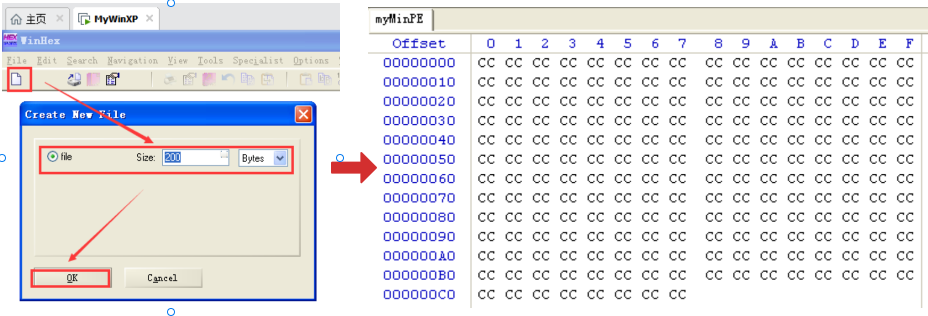

myWinPE.exe文件创建流程

#### 2.编写DOS_HEADER部分  (大小为 0x 40 )

-   **文件偏移+0x00（注1），****WORD e_magic→'MZ'文件头标识：**0x5A4D**（注2）**
-   **文件偏移+0x3C，****LONG e_lfanew→指向****NT头****'PE'标识的地址：**0x00000040

-   -   此处设置NT头地址为0x4偏移的原因：1.充分利用每字节可用空间，DOS除首尾两字段外都非必要字段，可用；2.当NT头置于0x4处，0x3C的功能不仅是指向NT头标识，还将成为选项头的成员SectionAlignment（文件对齐值），在XP中，此项最小值为4。综上两点，此处写入0x4最为合适。

-   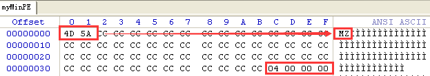

 DOS_HEADER部分内容

#### 3.编写NT头的Signature部分

  Dos头中间有 大量 无用数据,可以把  NT 头数据拷到 dos 头 偏移位4的位置,然后修改 dos头 指向 NT头的偏移但是全部拷贝放不下,因此只能拷贝一部分,到导入表结束(因为后面的数据表没用)

-   **文件偏移+0x04，**DWORD Signature→**'PE00'**NT头标识**：0x00004550**
-   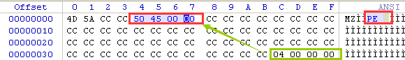


#### 4.编写NT头的FILE_HEADER部分

-   **文件偏移+0x08，**WORD Machine→指定程序的运行平台**：0x104C（运行于**Intel 386**）**
-   **文件偏移+0x10，**WORD NumberOfSections→PE中的节数量**：0x0001（最小限值）**
-   **文件偏移+0x18，**WORD SizeOfOptionalHeader→选项头大小**：0x0080**

-   -   选项头大小默认为0xE0，不过以目标为导向，我们还是要力求最小，计算可得，不包含数据目录字段的选项头结构体大小是0x60，而每一个数据目录数组元素的大小是0x8，此处我们留出4个数据目录元素的大小，即4*8=0x20，加上0x60=0x80。

-   **文件偏移+0x1A，**WORD Characteristics→文件属性：0x010F

-   -   0x010F组合属性表示：只在32位平台上运行的不存在行信息、重定位信息、符号信息的可执行文件。

-   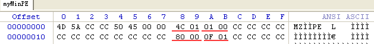

NT头的FILE_HEADER部分内容

#### 5.编写NT头的OPTIONAL_HEADER部分

-   **文件偏移+0x1C，**WORD Magic→PE标志字即程序位数**：0x010B（32位系统）**
-   **文件偏移+0x28，D**WORD AddressOfEntryPoint→程序执行入口RVA**：0x00000000**
-   **文件偏移+0x38，**DWORD ImageBase→内存加载基址**：0x00400000（exe默认）**
-   **文件偏移+0x40，**DWORD FileAlignment→文件对齐值**：0x00000004（最小限值）**
-   **文件偏移+0x4C，**WORD  MajorSubsystemVersion→主子系统版本号：**0x0004（恢复默认不可修改）**
-   **文件偏移+0x4E，**WORD  MinorSubsystemVersion→副子系统版本号：**0x0000（恢复默认不可修改）**
-   **文件偏移+0x50，**DWORD  Win32VersionValue→版本号，XP中须为0：**0x00000000**
-   **文件偏移+0x54，**DWORD SizeOfImage→PE文件在进程内存中的总大小：**0x00001000（内存预计占用1页内）**
-   **文件偏移+0x58，**DWORD SizeOfHeaders→PE文件头部在文件中的总大小：**0x000000C4（=文件实现目标大小）**
-   **文件偏移+0x60，**WORD  Subsystem→程序类型：**0x0002（**2=图形界面**）**
-   **文件偏移+0x62，**WORD   DllCharacteristics→文件特性：**0x0000（**默认为0**）**
-   **文件偏移+0x64，**DWORD  SizeOfStackReserve→初始化时保留的栈大小：**0x07FFFFFF**
-   **文件偏移+0x68，**DWORD  SizeOfStackCommit→初始化时实际提交的栈大小：**0x07FFFFFF**
-   **文件偏移+0x6C，**DWORD  SizeOfHeapReserve→初始化时保留的堆大小：**0x07FFFFFF**
-   **文件偏移+0x70，**DWORD  SizeOfHeapCommit→初始化时实际提交的堆大小：**0x07FFFFFF**
-   **文件偏移+0x78，**DWORD  NumberOfRvaAndSizes→数据目录的元素个数：**0x00000004**
-   **文件偏移+0x7C，**DataDirectory[4]→4项元素的数据目录：**全0**
-   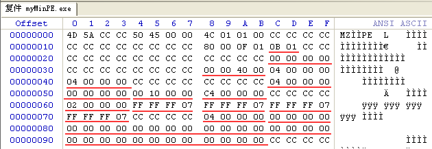

NT头的OPTIONAL_HEADER部分内容

#### 6.编写节表部分

-   **文件偏移+0xA4，**DWORD VirtualSize→内存时机占用大小**：0x000000C4**
-   **文件偏移+0xA8，**DWORD VirtualAddress→内存地址RVA**：0x00000000**
-   **文件偏移+0xAC，**DWORD SizeOfRawData→文件大小**：0x000000C4**
-   **文件偏移+0xB0，**DWORD PointerToRawData→文件偏移**：0x00000000**
-    **文件偏移+0xC4，**DWORD Characteristics→节属性**：0x**E00000E0

-   -   **0x**E00000E0 = 1110 0000 0000 0000 0000 0000 1110 0000，根据图3-5显示，此属性值表示节中包含代码、已初始化数据和未初始化数据，且映射到内存后的页面可执行可读写。

-   ***0xA4-0xB3含义：**从文件偏移为0x0的位置，拷贝0xC4大小的数据到内存偏移为0x0的位置，占用内存0xC4大小
-   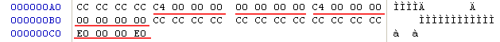

节表部分内容

#### 7.基础PE总览（xdm先备份一下，再做后方花里胡哨的操作）

-   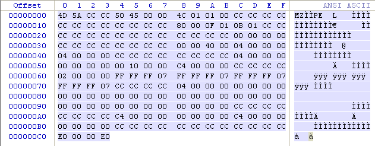

 基础PE内容总览

#### 8.编写导入内容：库+函数

-   根据导入内容思考设计：实现弹框需要写入两项内容：1.库名（user32）；2.函数名（MessageBoxA）。根据两个字符串的长度（+00结束符）找到最合适的位置并写入：

-   -   **文件偏移+0x30， dll名**：**"user32 "，7Byte**
    -   **文件偏移+0x0C， 函数名**：**"**MessageBoxA **"，12Byte**
    -   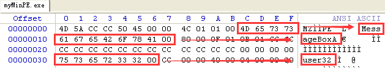

写入库名和函数名

#### 9.编写导入表项 

-   导入表IMAGE_IMPORT_DESCRIPTOR 置于**0xB0处**，因为PE加载后，0xB0-0xC3处内存会被初始化为全0。
-   **文件偏移+0xBC**：DWORD   Name→RVA指向dll名：**0x00000030**
-   **文件偏移+0xC0**：DWORD   FirstThunk→RVA指向IAT表：**0x0000009C**
-   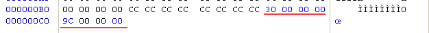

#### 10.编写IAT表 IMAGE_THUNK_DATA32

-   **文件偏移+0x9C**，PIMAGE_IMPORT_BY_NAME  AddressOfData→指向IMAGE_IMPORT_BY_NAME：**0x0000000A**

-   -   **因为**IMAGE_IMPORT_BY_NAME结构体的指向函数名的NAME成员前还有一个WORD Hint成员，所以指向的地址需要跳过一个WORD 2字节，以实现NAME指向函数名。

-   **文件偏移+0xA0**，以全0作结尾项：**0x00000000**
-   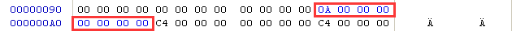

#### 11.将导入表位置写入数据目录中

-   **文件偏移+0x80**，DataDirectory[1]导入表位置：0x000000B0
-   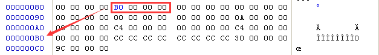
-   OD检测：内存窗口中跟随地址0x40009C，以"长型→地址"方式查看，可见导入成功。
-   

#### 12.编写汇编指令：获取MessageBoxA函数地址并传参调用

-   **文件偏移+0x60**，在选项头的堆栈空间值区编写弹框文本："hello world"
-   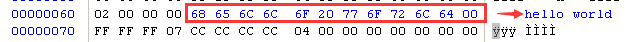
-   *选线头主版本号不可用，故以副链接器版本号成员处（0x1F）开始非重要区域编写指令：
-   **文件偏移+0x1F**，参数4 UINT uType→对话框按钮类型：6A 00 = push 0（注3）
-   **文件偏移+0x21**，参数3 LPCTSTR lpCaption→消息框标题：6A 00 = push 0
-   **文件偏移+0x23**，参数2 LPCTSTR lpText→消息框内容，指向"hello world"：68 64004000 = push 00400064
-   **文件偏移+0x25**，参数1 HWND hWnd→窗口句柄：6A 00 = push 0
-   **文件偏移+0x2A**，短跳至空闲区以备调用函数：EB18= jmp short 00400044
-   **文件偏移+0x44**，从IAT表中获取API地址并调用：FF15 9C004000= CALL  0040009C
-   **文件偏移+0x4A**，调用后返回：C3=ret
-   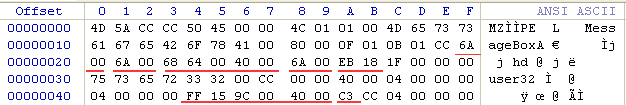

#### 14.修改OEP

-   **文件偏移+0x44**，OEP：FF15 9C004000= CALL  0040009C
-   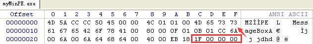

#### 15.完整PE总览

-   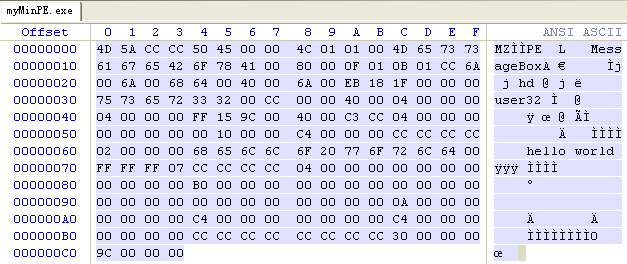

#### 


### 操作

-   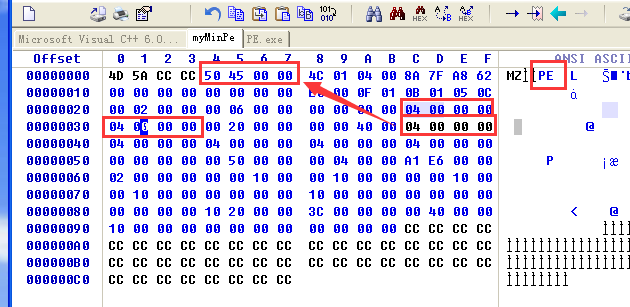

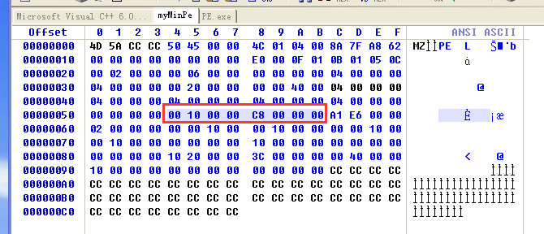

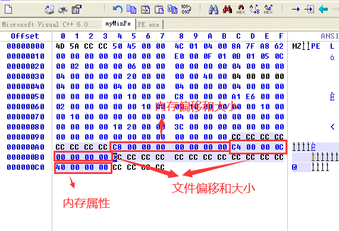

修改导入表,导入表占 20字节 但前面 12个字节都没用

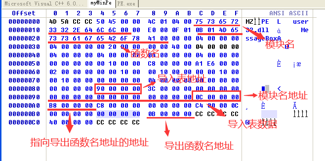

上述操作之后的代码

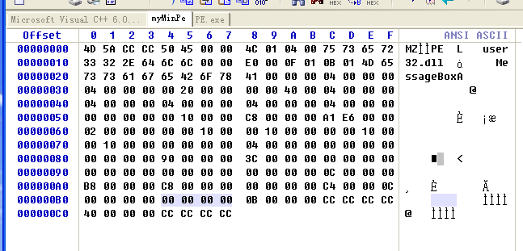

点击运行发现报错,说明我们的代码有问题

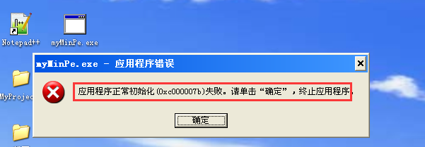

用OD 查看,发现导入函数并没有加载进来,说明我们的导入表构件的有问题

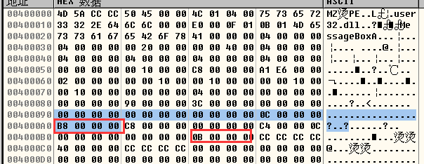

初步检查发现如下错误

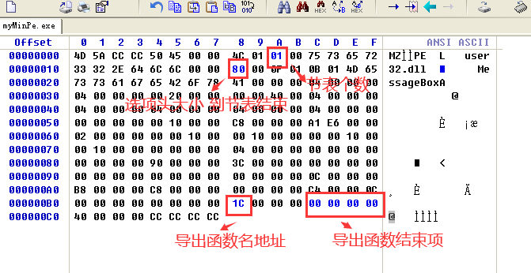

继续寻找错误并把没用的数据用CC填充

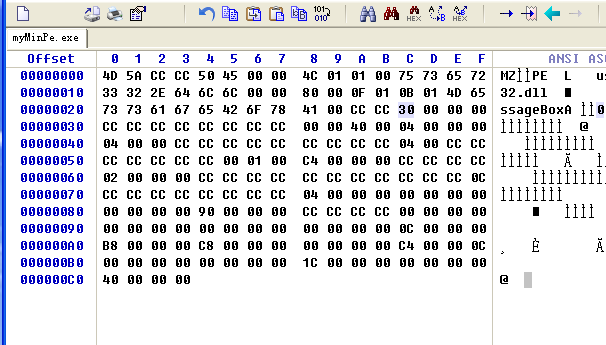

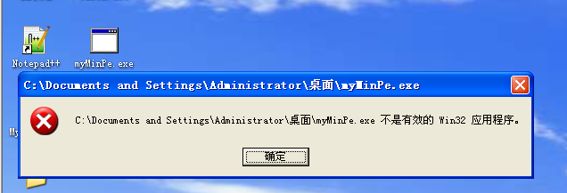

还是有错误,继续寻找

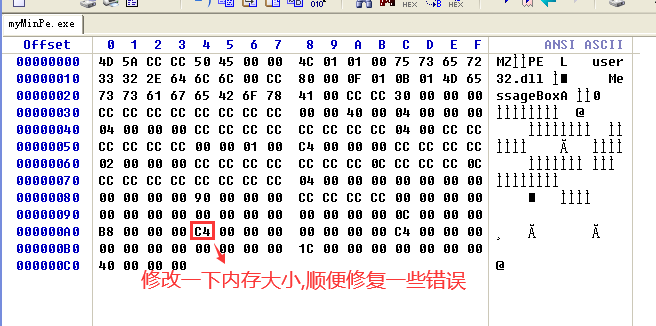

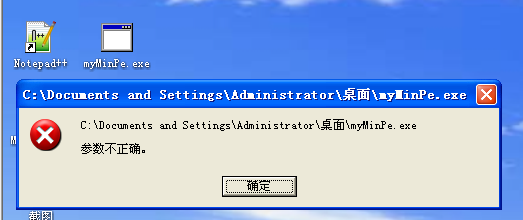

继续找错误

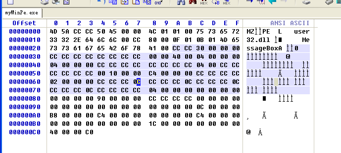

再到OD去看,可以看到函数已经加载进来了

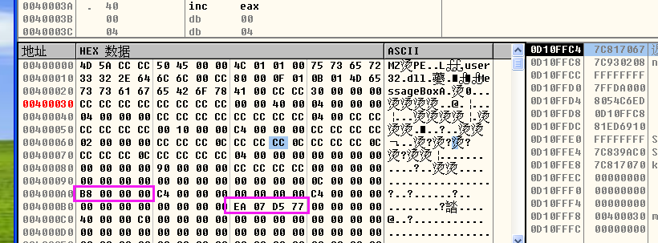

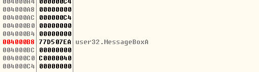

说明我们格式已经对了,接下来就是写代码了

函数入口点,之所以跳到 64,因此哪里空间多一点,可以写代码

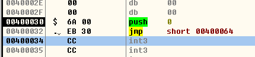

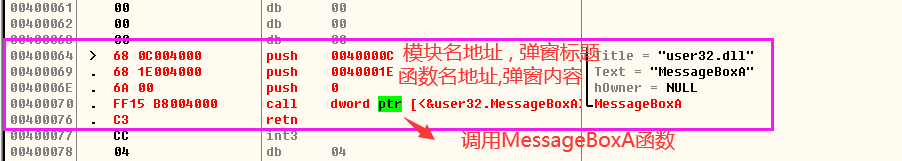

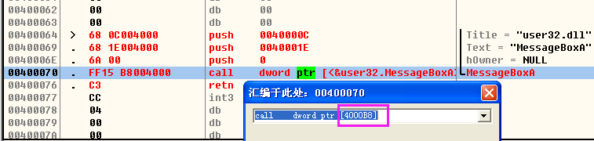

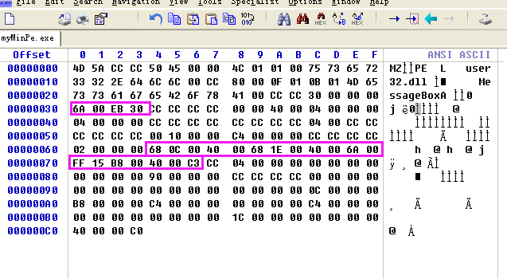

运行发现只有标题没有内容,怀疑可能是栈被破坏了

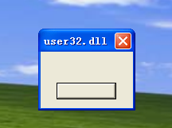

有一个标志  Win32VersionValue ,xp必须为0,win7 和win10不用管

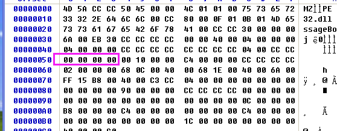

点击发现功能实现了

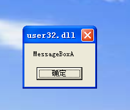

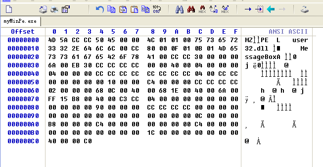

```
Offset      0  1  2  3  4  5  6  7   8  9  A  B  C  D  E  F

00000000   4D 5A CC CC 50 45 00 00  4C 01 01 00 75 73 65 72   MZ烫PE  L   user
00000010   33 32 2E 64 6C 6C 00 CC  80 00 0F 01 0B 01 4D 65   32.dll 虁     Me
00000020   73 73 61 67 65 42 6F 78  41 00 CC CC 30 00 00 00   ssageBoxA 烫0   
00000030   6A 00 EB 30 CC CC CC CC  00 00 40 00 04 00 00 00   j ?烫烫  @     
00000040   04 00 00 00 CC CC CC CC  CC CC CC CC 04 00 CC CC       烫烫烫烫  烫
00000050   00 00 00 00 00 10 00 00  C4 00 00 00 CC CC CC CC           ?  烫烫
00000060   02 00 00 00 68 0C 00 40  00 68 1E 00 40 00 6A 00       h  @ h  @ j 
00000070   FF 15 B8 00 40 00 C3 CC  04 00 00 00 00 00 00 00    ?@ 锰        
00000080   00 00 00 00 90 00 00 00  CC CC CC CC 00 00 00 00       ?  烫烫    
00000090   00 00 00 00 00 00 00 00  00 00 00 00 0C 00 00 00                   
000000A0   B8 00 00 00 C4 00 00 00  00 00 00 00 C4 00 00 00   ?  ?      ?  
000000B0   00 00 00 00 00 00 00 00  1C 00 00 00 00 00 00 00                   
000000C0   40 00 00 C0                                        @  
```

还可以继续减少大小

因为系统准备内存会在里面填充0 , 因为后面的0可以全部删除 ,又因为 第一个节就算不给属性系统也会自动给,所以也可以不要

```
Offset      0  1  2  3  4  5  6  7   8  9  A  B  C  D  E  F

00000000   4D 5A CC CC 50 45 00 00  4C 01 01 00 75 73 65 72   MZ烫PE  L   user
00000010   33 32 2E 64 6C 6C 00 CC  80 00 0F 01 0B 01 4D 65   32.dll 虁     Me
00000020   73 73 61 67 65 42 6F 78  41 00 CC CC 30 00 00 00   ssageBoxA 烫0   
00000030   6A 00 EB 30 CC CC CC CC  00 00 40 00 04 00 00 00   j ?烫烫  @     
00000040   04 00 00 00 CC CC CC CC  CC CC CC CC 04 00 CC CC       烫烫烫烫  烫
00000050   00 00 00 00 00 10 00 00  C4 00 00 00 CC CC CC CC           ?  烫烫
00000060   02 00 00 00 68 0C 00 40  00 68 1E 00 40 00 6A 00       h  @ h  @ j 
00000070   FF 15 B8 00 40 00 C3 CC  04 00 00 00 00 00 00 00    ?@ 锰        
00000080   00 00 00 00 90 00 00 00  CC CC CC CC 00 00 00 00       ?  烫烫    
00000090   00 00 00 00 00 00 00 00  00 00 00 00 0C 00 00 00                   
000000A0   B8 00 00 00 C4 00 00 00  00 00 00 00 C4 00 00 00   ?  ?      ?  
000000B0   00 00 00 00 00 00 00 00  1C 
```

注意上面的可执行程序在 win10 无法运行,因为win10检查比较严格

## 二、本节作业

规则：

 \1. 小于185字节

 \2. PE头不能放在偏移为4的位置

 \3. 不能写死MessageBox地址，必须要有导入表

技巧:   通过修改选项头大小来控制节表位置,让他与数据表重合, 弹窗内容可以用PE .

PE.7z(1 KB)[](./pe.7z)

```
Offset      0  1  2  3  4  5  6  7   8  9  A  B  C  D  E  F

00000000   4D 5A 50 00 12 00 00 00  00 00 00 00 50 45 00 00   MZP         PE  
00000010   4C 01 01 00 4D 65 73 73  61 67 65 42 6F 78 41 00   L   MessageBoxA 
00000020   40 00 8E 81 0B 01 68 0C  00 40 00 6A 00 FF 15 04   @ ?  h  @ j   
00000030   00 40 00 C3 38 00 00 00  6A 00 EB 28 0C 00 00 00    @ ?   j ?    
00000040   00 00 40 00 04 00 00 00  04 00 00 00 75 73 65 72     @         user
00000050   33 32 00 00 04 00 00 00  00 00 00 00 00 10 00 00   32              
00000060   90 00 00 00 6A 00 EB BE  02 00 00 00 90 00 00 00       j 刖        
00000070   00 00 00 00 90 00 00 00  00 00 00 00 90 00 00 00                   
00000080   02 00 00 00 4C 00 00 00  04 00 00 00 78                L       x
```

