提高动手能力的方法,多看别人的代码,自己多写一写,看的多了,见多识广就自然会写了


 有导入函数就有导入dll,导入函数是不会被优化的.因为无法确定是否会被用,而且也不清楚代码大小

导入表跟静态链接没有关系,静态链接是直接把代码直接链接到可执行文件中,调了动态链接库,就会有导入表,不调就没有


改变节属性后,相同属性的节会自动合并,合并的顺序是按照节名的 ascii 码顺序排序


## C++ 代码后移的方式

```c++
#define NOP10  __asm nop   __asm nop  __asm nop  __asm nop  __asm nop  __asm nop  __asm nop  __asm nop  __asm nop  __asm nop
#define NOP100 NOP10  NOP10  NOP10  NOP10  NOP10  NOP10  NOP10  NOP10  NOP10  NOP10  
#define NOP1000  NOP100 NOP100 NOP100 NOP100 NOP100 NOP100 NOP100 NOP100 NOP100 NOP100


int APIENTRY wWinMain(_In_ HINSTANCE hInstance,
                     _In_opt_ HINSTANCE hPrevInstance,
                     _In_ LPWSTR    lpCmdLine,
                     _In_ int       nCmdShow)
{
   NOP10
   MessageBox(NULL, _T("hellow"),_T("hellow"),MB_OK);
   
}
```

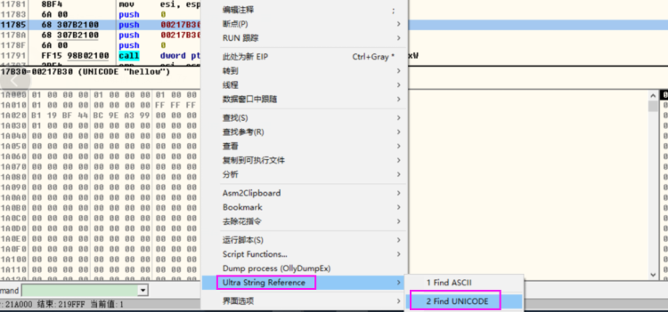


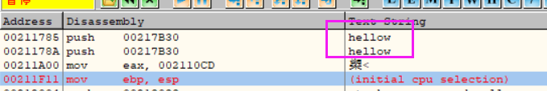


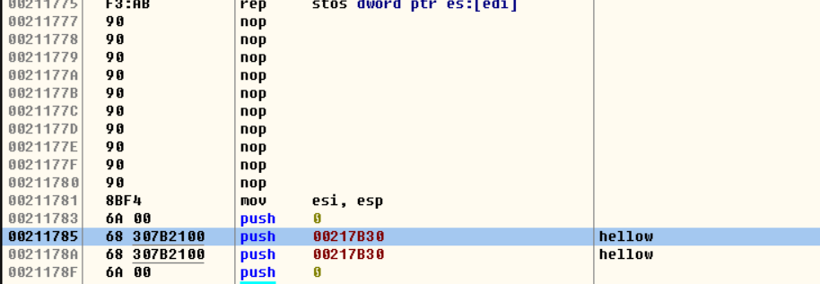


  

 向带有附加数据的进程中添加数据(例如 CE) 

如果附加数据检查不严格就没事

而且不一定非要加在 exe中 ,也可以把数据放入加载的dll 没有附加数据的dll中

如果上面都不满足,那么就先把最后一个节节拓展,把附加数据放入节中,想要加数据可以再去添加节或者拓展节都可以,注意修改 SizeOfImage,不一定适用于所有进程

 判断自己的可执行文件是否被修改了看 

用MD5值校验,如果不一样就说被修改了


txt是纯文本文件,没有格式

 节表注入 

 添加节 

 第一步:添加节数据 

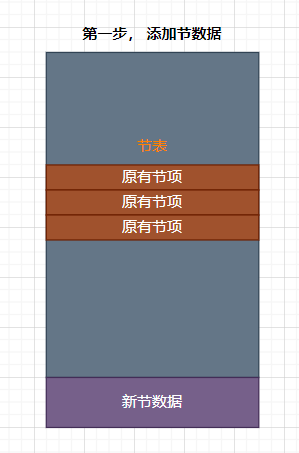


 第二步:添加节数据 

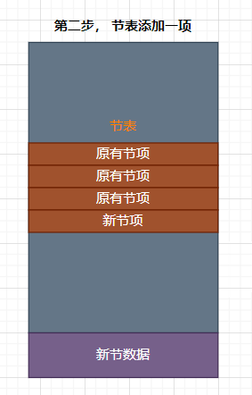


 第三步:文件头中节个数加1 

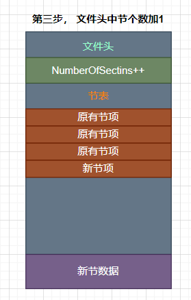


 第四步:修正PE在内存中总大小 

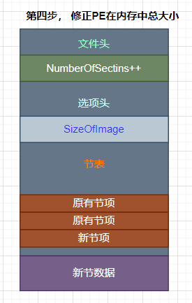


 拓展节 

 第一步添加节数据 

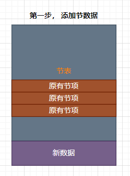


 第二步修正最后一个节的文件和内存大小 

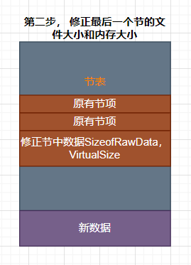


 第三步修正PE在内存中总大小 

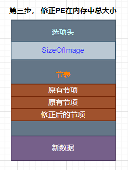


 导入表注入 

 第一步增加节 


 第二步拷贝源导入表 

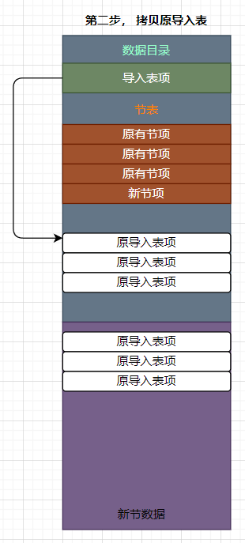


 第三步导入表添加一项 

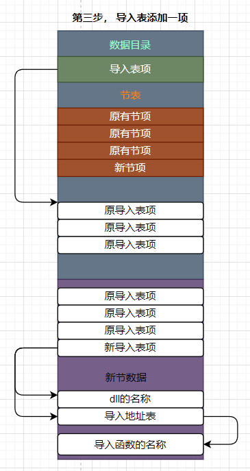


 第四步数据目录中导入表地址指向新节的导入表 

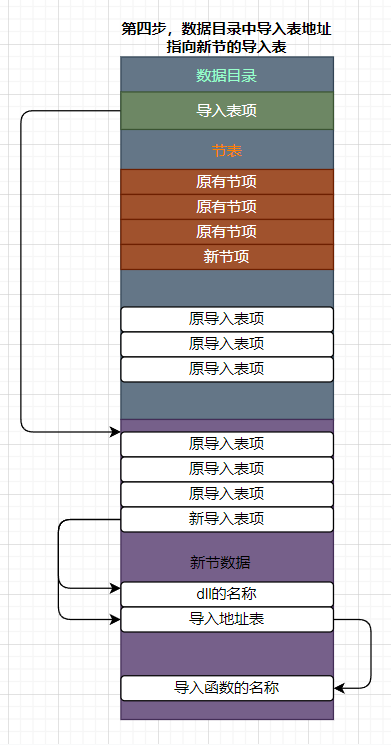

