 RadAsm的bug 

 创建程序 

 1、创建程序1：C++工程： 

●项目选项：控制台"hello，World"程序，不使用预编译头

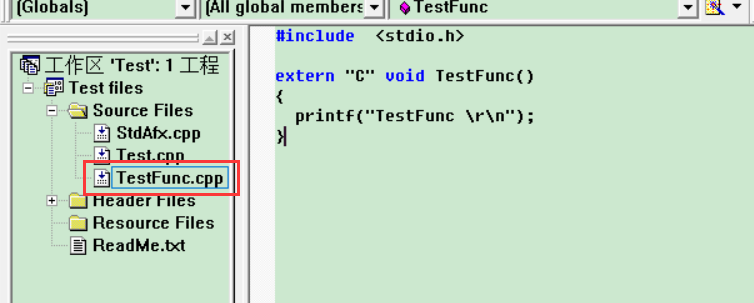


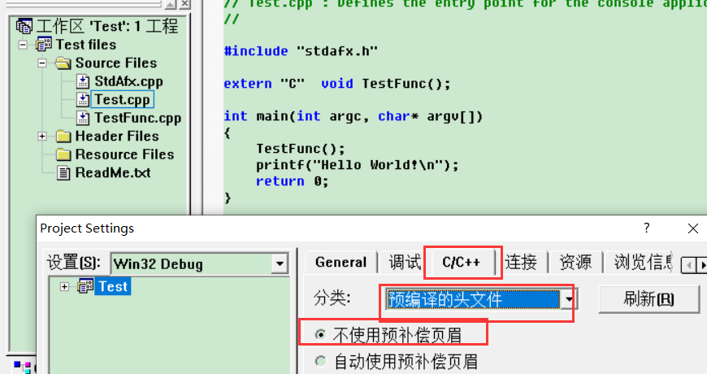


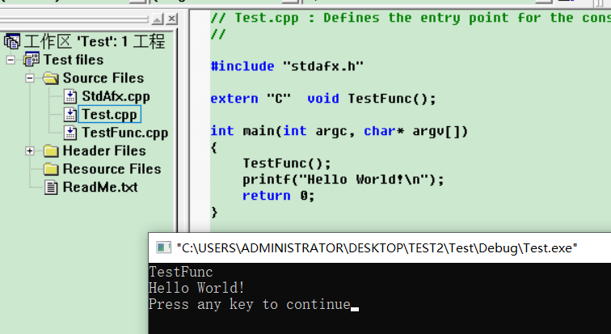


 2、创建程序2：汇编工程： 

●radasm工程选项：控制台

●将程序1中的obj拷贝至本工程中并添加至工程连接选项，用程序2调用程序1中的TestFunc函数


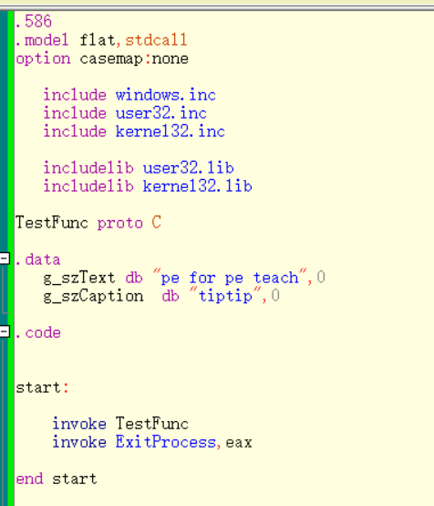


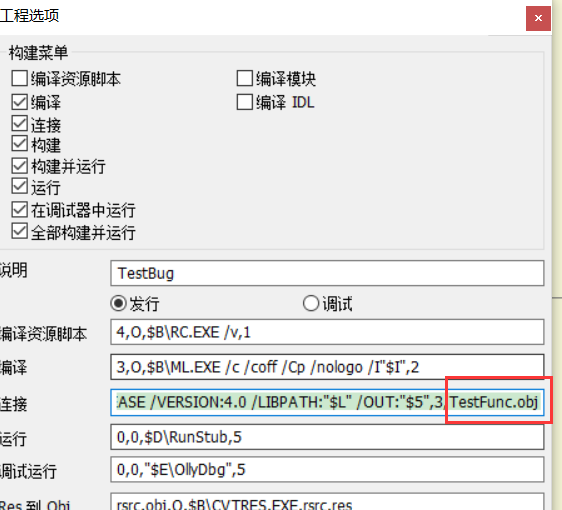


 获取并解决BUG 

 1.非预期BUG：提示缺少lib，"LIBCD.LIB"、"OLDNAMES.lib"。 

●解决办法：从VC库中获取并拷贝过来。

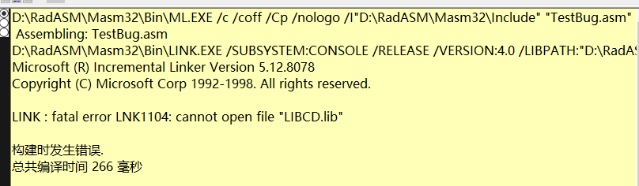


 2.预期BUG1：LIBCD.lib BUG：LNK2001：无法处理的外部符号 _main。 

●原因：虽然汇编当中未使用此库，但是在C++程序中使用到了C库PI"printf"。而程序2汇编没有main函数，所以就会在连接时报预期BUG。


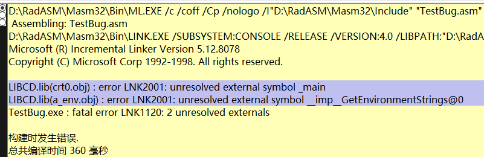


●解决方案：增加"main"，即把汇编程序的入口标号替换为main。

●效果：报错消失，但程序依然报其他错误。


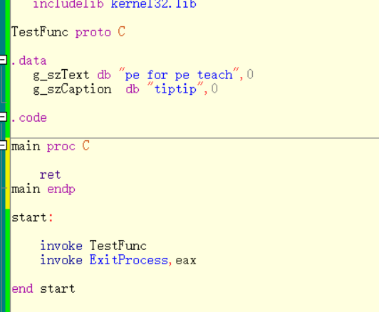


 3.预期BUG2：指定函数未定义 


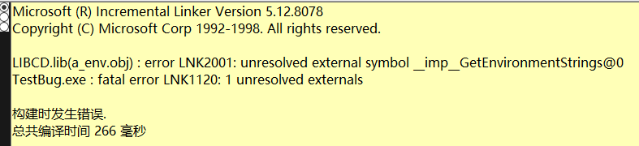


●BUG探究：查找GetEnvironmentStrings函数定义（kernel32.lib），将lib包含后仍出现指定BUG。

●BUG再探究：从kernel32.lib中查询报错API，发现对应接口不分A/W，而是将GetEnvironmentStrings作为定义，GetEnvironmentStringA作为宏，违反了我们过往对于微软命名风格的认知习惯。所以造成了预期bug2。


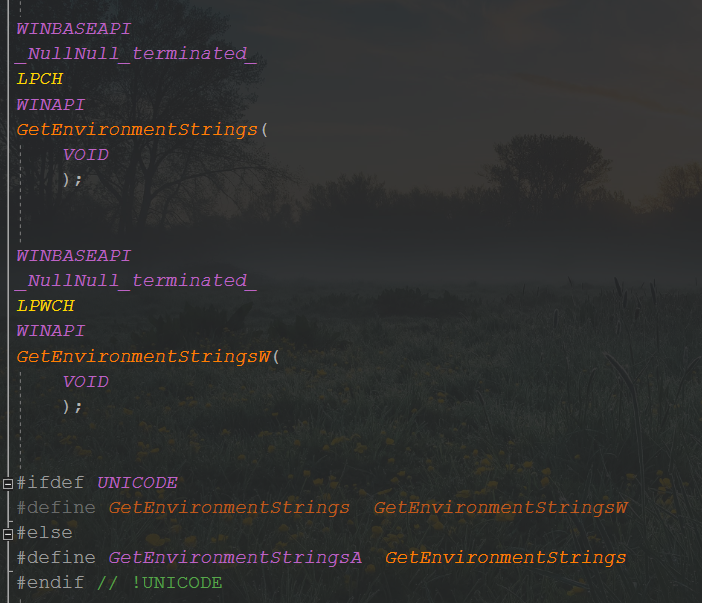


**●**解决方案

○（1）手动修改radasm的kernel32.inc文件；


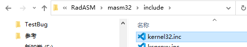

```
修改前：
GetDriveTypeW PROTO :DWORD
GetEnvironmentStringsA PROTO 
GetEnvironmentStrings equ <GetEnvironmentStringsA>

修改后：
GetDriveTypeW PROTO :DWORD
GetEnvironmentStrings PROTO 
GetEnvironmentStringsA equ <GetEnvironmentStrings>
```

-   -   **（2）**重新生成LIB的工具路径：..\RadASM\masm32\tools\inc2l\inc2l.exe
    -   **（3）**将两者拷贝出来并cmd命令：inc2l.exe       kernel32.inc。
    -   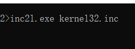
    -   **（4）**此时目录下未见新生成lib，研究一下inc2l.exe

### 分析程序：inc2l.exe

#### 1.OD调试 引入壳

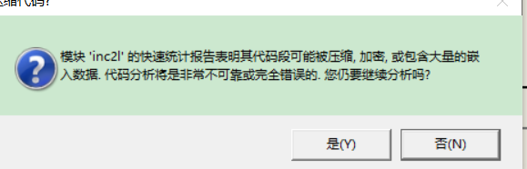

此时点击否就可以

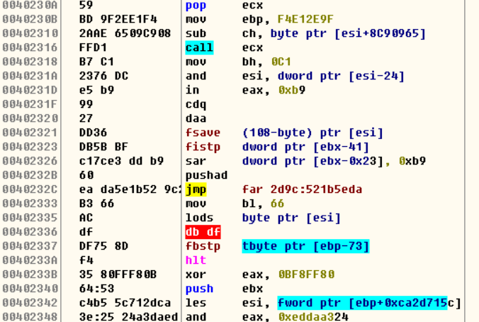


-   可以看到,汇编代码十分诡异,怀疑是加了壳,我们现在的代码不是程序真正的入口点,而是壳的代码

-   **壳的作用：**对PE的保护。
-   **壳的原理：**在执行真正的PE前，壳会先跑一段对PE进行处理的壳代码
-   **脱壳流程：**1.查壳；2.有壳就去找OEP；3.dump进程
-   **通杀pushad技巧（压缩壳和部分加密壳）：**ESP定律。

#### 2.ESP定律

-   所谓ESP定律就是利用了pushad的设计原理，在一开始的时候，去栈上数据进行硬件读处理，当壳执行完毕要恢复PE前，即可快速锁定OEP定位。

#### 3.OD分析定位OEP

-   （1）F8单步过pushad入栈，跟踪ESP，以DWORD类型，下硬件访问断点至第二组或第三组（王老师经验）。

​       esp 右键,数据窗口中跟随

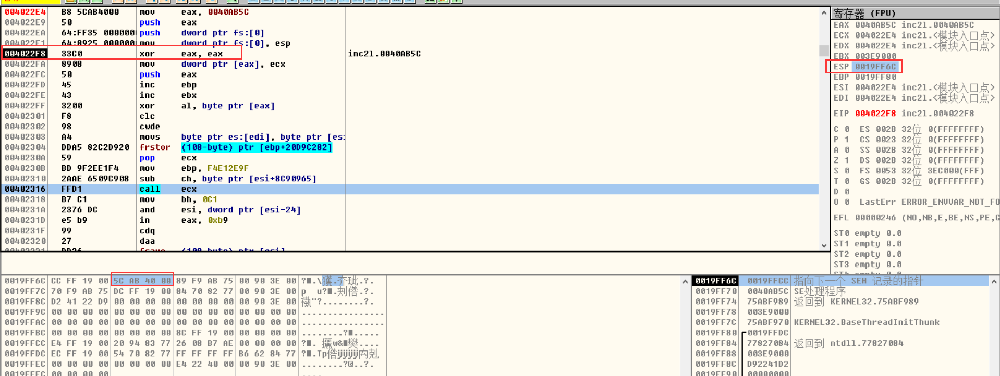

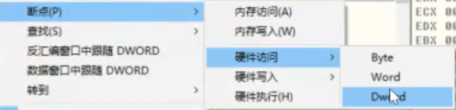

F9

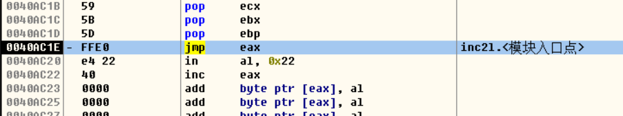

F8   入口点

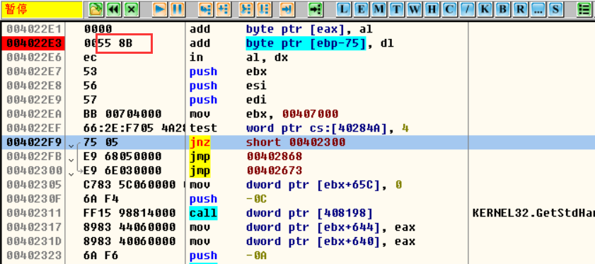


### 脱壳

#### OllyDump

-   1.设置：插件 → OllyDump （）→ 脱壳在当前调试的进程 （Dump process）

-   -   此处幺蛾子：自版本的OD只有OllyDumpEx插件，无法同步以下操作，需要使用radasm自带的OD。

-   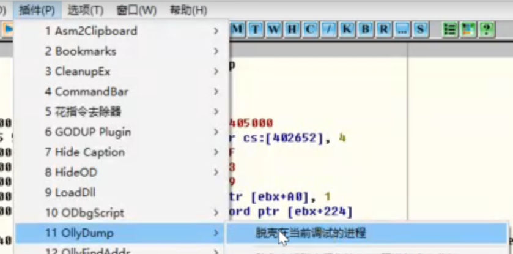
-   2.选项：将EIP设为OEP，并确认转储为xxx_dump.exe。
-   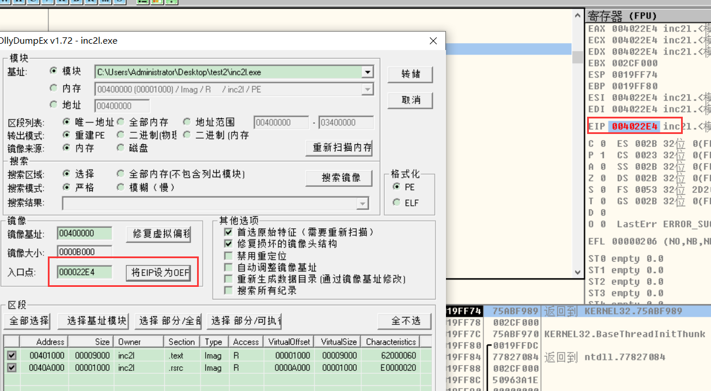
-   用cff查看,发现导入表错误
-   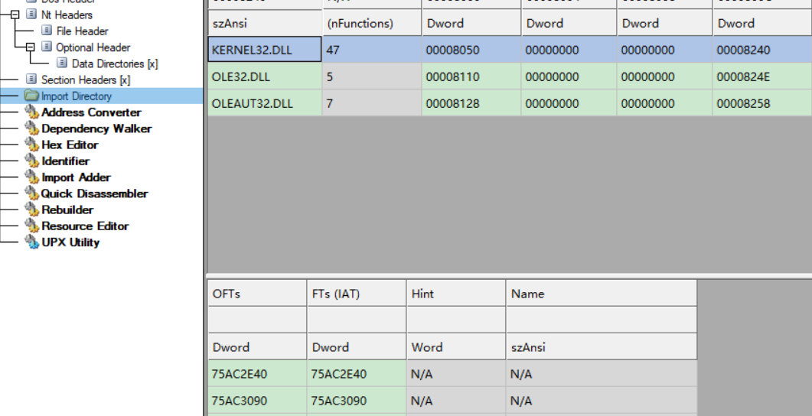
-   3.OD调试xxx_dump.exe，发现程序无法运行。单步调试找到崩溃处，右键"长型→地址"。
-   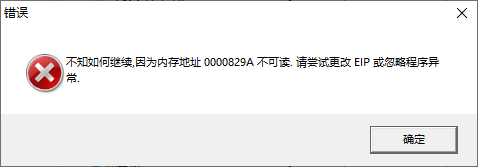
-   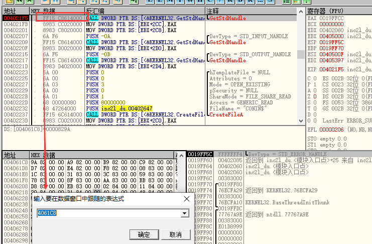
-   4.思考原因：发现是导入表缺少了IAT，可能是由于dump后数据格式会错位，导致插件无法正确读取进行转储。。
-   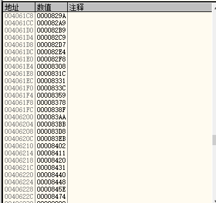

#### x32dbg

解决办法：使用x32dbg重建导入表。

-   （1）定位指令于OEF处，并于此行设置硬件断点。这里的代码即将被改,所以下cc断点不行

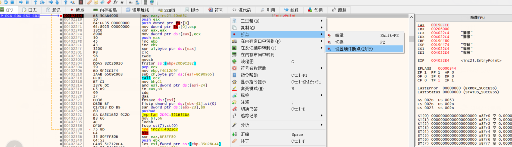

可以看到代码被改了

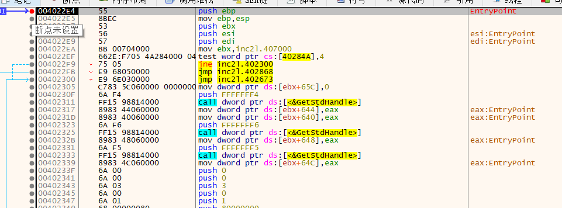


-   设置在内存窗口中转到→常数，并将内存窗口区设置为地址。
-   
-   插件 → Scylla处理 → 自动搜索 → 获取导入 → Fix Dump 修复转储至原dump程序（生成xxx_dump_SCY.exe）。
-   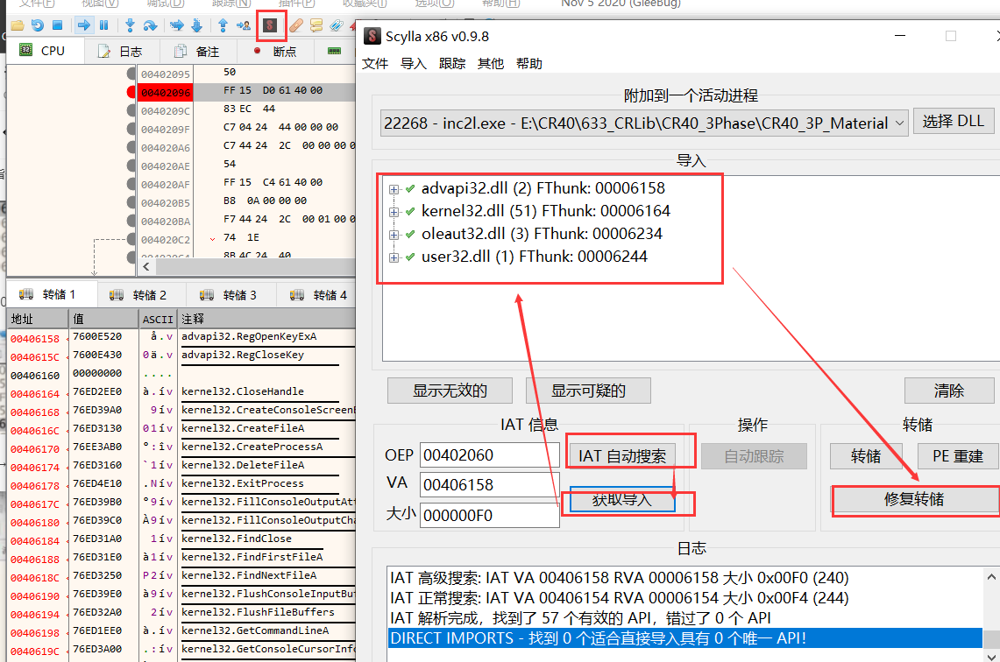
-   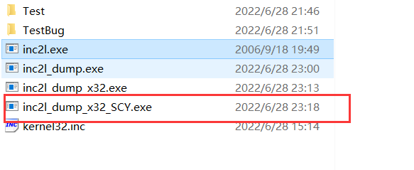
-   在用cff查看   此时查看IA表已经导入成功。

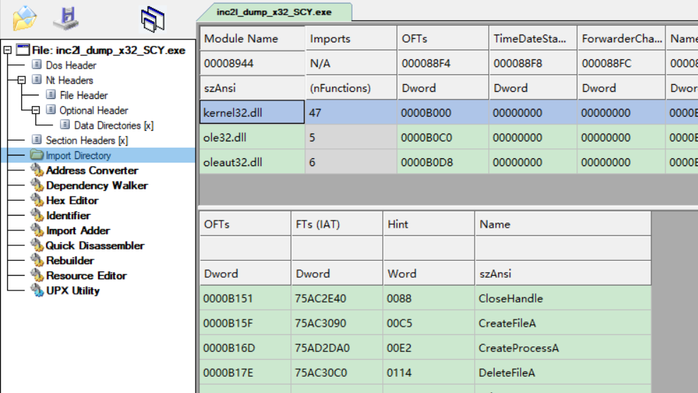


#### ImportREC

一般32位程序在32位系统中修复

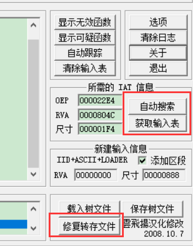


### 修复inc2l.exe  

inc2l.exe里面编译和链接用的绝对路径,换成相对路径就可以了,还有改字符串对应长度


修改编译选项

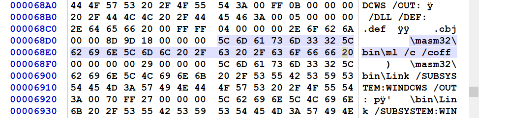

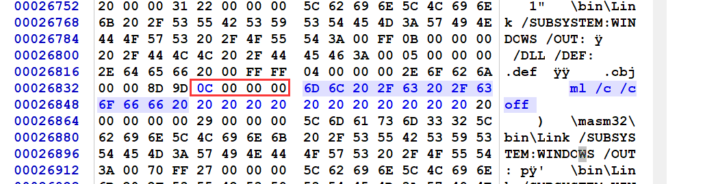


修改链接选项

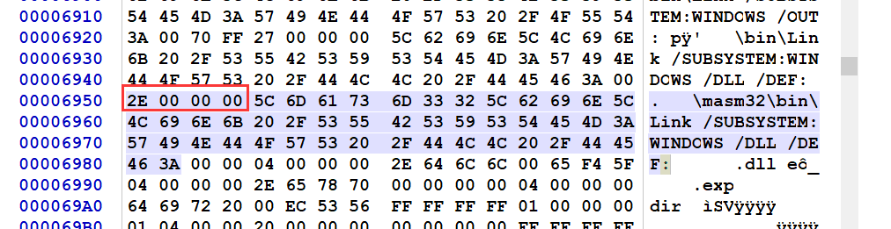

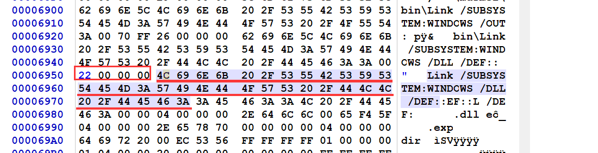


## 重定位表

定义：记录需要绝对地址修正的表，大多数绝对地址如果imagebase变化的话就无法使用，需要修正程序所调用的那些绝对地址。

-   **修正方法：需要重定位的地址 + 偏移（当前基址 - PE的基址）**
-   开了随机基址的程序才需要重定位，而DLL通常都有重定位表，因为不一定能够加载到DLL指定的ImageBase上。

### OS如何判定是否重定位？

-   先查看随机地址标志，标志开启，地址重定位
-   再查看数据目录项 5 是否位NULL，不为NULL，基址重定位。


我们现在都是玩固定基址的PE，随机基址涉及到要修代码，如果有重定位信息，就可以在内存中随便申请一块内存，把代码放进去跑。

我们知道随机基址需要重定位表来修代码， 那么是修什么代码呢。

实际上我们修的是使用绝对地址的代码，例如API的调用，通过IAT调用，这里就是使用的绝对地址，当模块基址改变时，原VA地址并没有保存API函数地址，所以就需要修正到正确的位置去获取API地址。

### 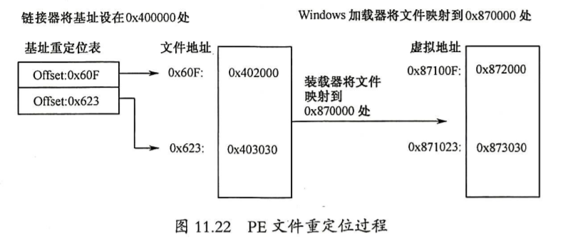设计思路

假设以下 RVA 地址需要进行修正,最简单的方法是把下面的地址都记录下来,加载的时候直接去修正


00001023

00001028

00001128

00001228

00001328

00001428

但是直接保存所有地址,那么数组的体积就会变得很大,那么如何减少体积呢

可以按照  分页地址  +分页偏移 的方式记录,因为分页偏移只需要 2个字节就可以了

00001000       分页基址

0000014         总大小

0023                分页偏移

0028

0128 

0228

0328 

0428

### 重定位表的结构

-   重定位表的位置：在数据目录的[5]项，IMAGE_BASE_RELOCATION，共8+N字节。

IMAGE_BASE_RELOCATION

```
// IMAGE_BASE_RELOCATION 重定位结构体，以8字节全0结尾
typedef struct _IMAGE_BASE_RELOCATION {						
	DWORD   VirtualAddress;	;+0x00, 分页基址				
	DWORD   SizeOfBlock;	;+0x04, 对应重定位数据块的大小，以字节为单位		
 	// WORD TypeOffset[1]	;+0x08, 重定项位数组，个数=(SizeOfBlock-8)/2
	// TypeOffset解析：高4位两个取值--0无需重定位(多用于对齐)，3需要重定位；低12位是页内偏移；
} IMAGE_BASE_RELOCATION;						
typedef IMAGE_BASE_RELOCATION ，* PIMAGE_BASE_RELOCATION;	
```

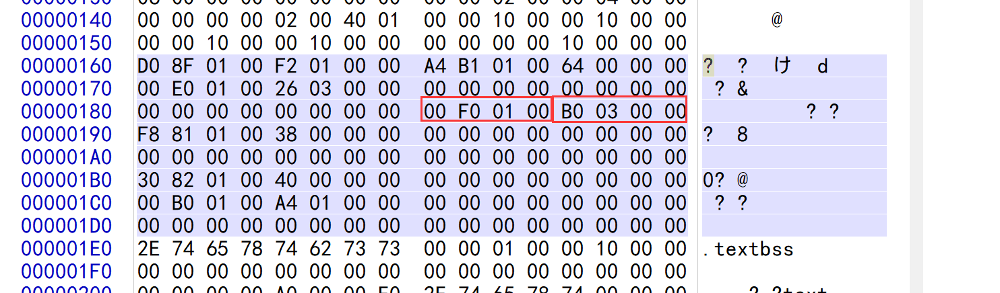

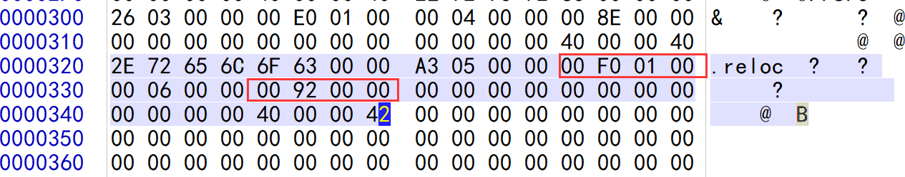

1F000 对应文件偏移 9200

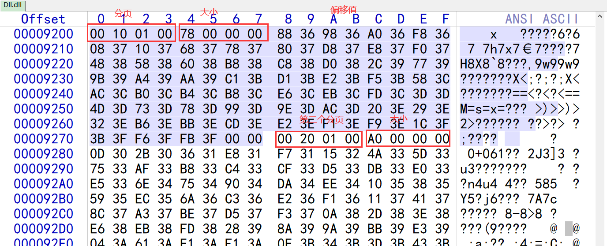


所有分页的数据大小合计就是  3B0  跟 结构体里面的总大小一致

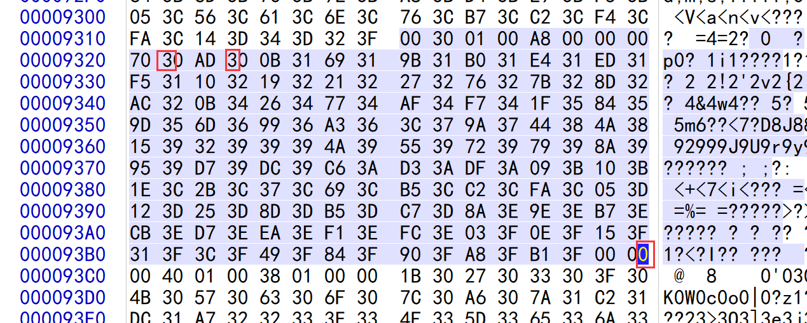


便宜的最高位是 3 表示需要被重定位 ,  0表示不需要,代表要对齐


OD中,有下划线的是代表修正后的地址

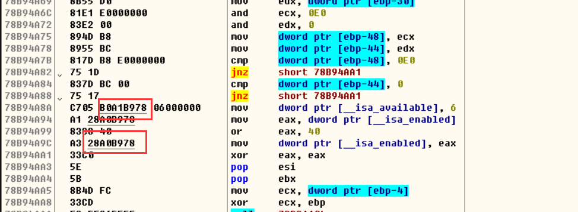


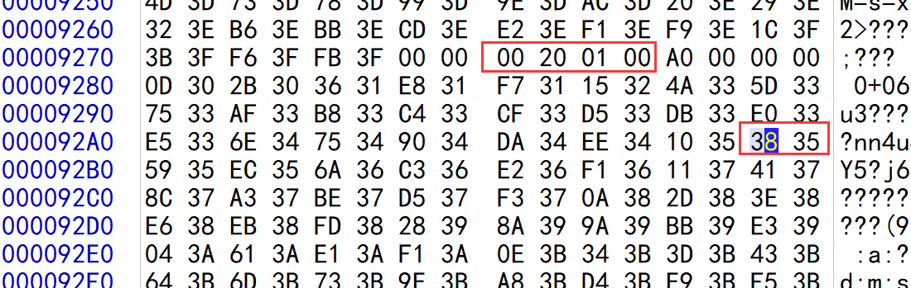


3538 开头是3  表示是一个有效重定位项    偏移值是 538 ,分页是 12000


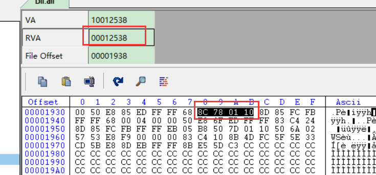


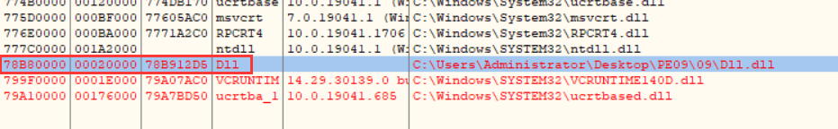


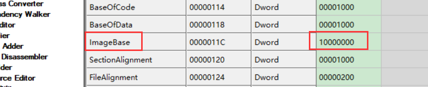


原基址: 10000000

新基址: 78b80000  

偏移    : 68b80000  

地址 1001788c +  68b80000  = 78 B9 78 8C

8c  78  b9  78

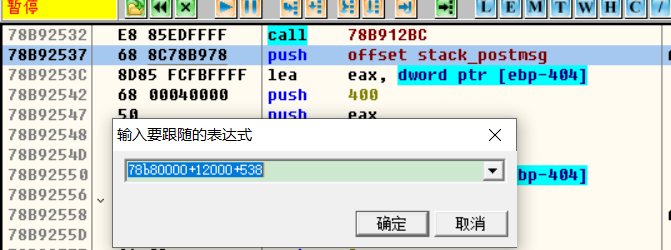


 LoadDll 

一个PE 有重定位表, 那么我们就可以把它加载到任意地址,然后修复重定位表即可,就可以模拟    LoadLibrary 了

user32.dll 的 MessageBoxA  要在xp中运行 win10无法运行 因为 win10的 user32.dll 需要初始化一个全局变量

``` assembly
.586
.model flat,stdcall
option casemap:none

   include windows.inc
   include user32.inc
   include kernel32.inc
   include msvcrt.inc
   
   includelib user32.lib
   includelib kernel32.lib
   includelib msvcrt.lib


WinMain proto :DWORD,:DWORD,:DWORD,:DWORD


.data
   ;g_szDll db "Dll.dll",0
   ;g_szFunc  db "Add",0
   
   g_szDll db "user32.dll",0
   g_szFunc  db "MessageBoxA",0

.code

;参数:   句柄   导出函数名
MyGetProcAddress proc hMod:HMODULE, lpProcName:LPCSTR   
       
    LOCAL @pDosHdr:ptr IMAGE_DOS_HEADER          ;dos头
    LOCAL @pNTHdr:ptr IMAGE_NT_HEADERS           ;Nt头
    LOCAL @pExpDir:ptr IMAGE_EXPORT_DIRECTORY    ;导出表
    
    LOCAL @pAddrTbl:DWORD     ;导出地址表地址
    LOCAL @pNameTbl:DWORD     ;导出名称表地址
    LOCAL @pOrdTbl:DWORD      ;导出序号表地址

    ;解析
    ;dos 头
    mov eax, hMod
    mov @pDosHdr, eax
    
    ;nt头
    mov esi, @pDosHdr
    assume esi:ptr IMAGE_DOS_HEADER
    mov eax, hMod
    add eax, [esi].e_lfanew
    mov @pNTHdr, eax
    
    
    mov esi, @pNTHdr
    assume esi:ptr IMAGE_NT_HEADERS

    
    ;获取导出表
    mov esi, @pNTHdr
    assume esi:ptr IMAGE_NT_HEADERS
    
    mov eax, [esi].OptionalHeader.DataDirectory[0].VirtualAddress
    add eax, hMod
    mov @pExpDir, eax
    
    mov esi, @pExpDir
    assume esi:ptr IMAGE_EXPORT_DIRECTORY
    
    ;导出函数地址表
    mov eax, [esi].AddressOfFunctions
    add eax, hMod
    mov @pAddrTbl, eax
    
    ;导出函数名称表
    mov eax, [esi].AddressOfNames
    add eax, hMod
    mov @pNameTbl, eax
    
    
    ;导入序号表
    mov eax, [esi].AddressOfNameOrdinals
    add eax, hMod
    mov @pOrdTbl, eax
    
    
    ;判断是序号还是名称  (序号是一个 word,对于 dword来说高位都是0)
    .if lpProcName & 0000ffffh   
        ;名称
        mov ebx, @pNameTbl
        xor ecx, ecx
        .while ecx < [esi].NumberOfNames
            ;获取名称地址
            mov eax, [ebx+ecx*4]
            add eax, hMod
            
            ;字符串比较
            push ecx
            invoke crt_strcmp, lpProcName, eax
            pop ecx
            .if eax == 0
                ;找到了, 从导出序号表取出函数地址下标
                mov edi, @pOrdTbl
                movzx eax, word ptr [edi+ecx*2]
                
                
                ;从导入地址表，下标寻址，获取导出函数地址
                mov ebx, @pAddrTbl
                mov eax, [ebx+eax*4]
                
                ;判断转发 。。。。解析函数名,递归判断
                
                
                ;返回地址
                .if eax != NULL
                    add eax, hMod
                    ret
                .endif
                
            .endif
            
            inc ecx
        .endw
        
    
    .else 
        ;序号
        mov eax, lpProcName
        sub eax, [esi].nBase ;获取索引值
        
        ;从导入地址表，下标寻址，获取导出函数地址
        mov ebx, @pAddrTbl
        mov eax, [ebx+eax*4]
        
        .if eax != NULL
            add eax, hMod
            ret
        .endif
    
    .endif
    
    
    xor eax, eax
    ret

MyGetProcAddress endp


MyLoadLibary proc uses ebx ecx edx esi edi lpFileName:LPCTSTR
     LOCAL @dwImageBase:DWORD       ;自己进程的模块基址
    LOCAL @hFile:HANDLE            ;文件句柄
    LOCAL @hFileMap:HANDLE         ;映射句柄
    LOCAL @pPEBuf:LPVOID           ;映射文件的缓冲地址
    LOCAL @pDosHdr:ptr IMAGE_DOS_HEADER      ;目标进程的dos头
    LOCAL @pNTHdr:ptr IMAGE_NT_HEADERS       ;目标进程的NT头
    LOCAL @pSecHdr:ptr IMAGE_SECTION_HEADER  ;目标进程的节表
    LOCAL @dwNumOfSecs:DWORD                 ;目标进程的节表数量
    LOCAL @pImpHdr:ptr IMAGE_IMPORT_DESCRIPTOR   ;目标进程的导入表
    LOCAL @dwSizeOfHeaders:DWORD                 ;目标进程的选项头大小
    LOCAL @dwOldProc:DWORD                       ;旧的内存属性
    LOCAL @hdrZeroImp:IMAGE_IMPORT_DESCRIPTOR    ;导入表结束标志,所有项全0
    LOCAL @hDll:HMODULE                          ;加载dll的句柄
    LOCAL @dwOep:DWORD                           ;进程的入口地址
    LOCAL @pReloc:ptr IMAGE_BASE_RELOCATION      ;重定位表
    LOCAL @dwOfReloc:DWORD                       ;重定位数据块大小
    LOCAL @dwOff:DWORD                           ;新旧的基址偏移值
    
    
    ;判断导入表结束的标志清0
    invoke RtlZeroMemory, addr @hdrZeroImp, size IMAGE_IMPORT_DESCRIPTOR
    

    
    
    ;解析PE文件，获取表
    
    ;打开文件
    invoke CreateFile, lpFileName, GENERIC_READ, FILE_SHARE_READ,NULL, OPEN_EXISTING,FILE_ATTRIBUTE_NORMAL, NULL
    ;check ....
    mov @hFile, eax   ;保存文件句柄
    
    invoke CreateFileMapping, @hFile, NULL, PAGE_READONLY, 0, 0, NULL   ;创建文件映射
    ;check
    mov @hFileMap, eax    ;创建文件映射句柄
    
    invoke MapViewOfFile, @hFileMap, FILE_MAP_READ, 0, 0, 0      ;将整个文件映射进内存
    ;check 
    mov @pPEBuf, eax      ;保存映射文件内存的地址
    
    ;解析目标进程
    
    ;目标进程的 dos 头
    mov eax, @pPEBuf      
    mov @pDosHdr, eax
    
    ;目标进程的 nt头
    mov esi, @pDosHdr
    assume esi:ptr IMAGE_DOS_HEADER
    mov eax, @pPEBuf
    add eax, [esi].e_lfanew   ;获取nt头的偏移地址
    mov @pNTHdr, eax
    
    
    mov esi, @pNTHdr
    assume esi:ptr IMAGE_NT_HEADERS
    
    ;选项头信息
    mov eax, [esi].OptionalHeader.SizeOfHeaders    ;获取选项头大小
    mov @dwSizeOfHeaders, eax
    
    invoke VirtualAlloc, NULL, [esi].OptionalHeader.SizeOfImage, MEM_COMMIT, PAGE_EXECUTE_READWRITE
    mov @dwImageBase, eax
    
    sub eax, [esi].OptionalHeader.ImageBase
    mov @dwOff, eax ;新旧ImageBase的偏移差
    
    ;进程的入口地址  =  进程的内存偏移地址 + 模块基址
    mov eax, [esi].OptionalHeader.AddressOfEntryPoint
    add eax, @dwImageBase
    mov @dwOep, eax
    
    
    ;节表  地址: 选项头地址+大小
    movzx eax, [esi].FileHeader.NumberOfSections
    mov @dwNumOfSecs,eax
    
    lea ebx, [esi].OptionalHeader
    
    ;获取选项头大小：用于定位节表位置=选项头地址+选项头大小
    movzx eax, [esi].FileHeader.SizeOfOptionalHeader   ;把 word 转为 dword
    add eax, ebx
    mov @pSecHdr, eax   ;保存节表地址
    
    
  
    
    ;拷贝PE头  从映射内存拷贝到 自己进程的最开始处 
    invoke crt_memcpy, @dwImageBase, @pPEBuf, @dwSizeOfHeaders


    ;按照节表，拷贝节区数据
    mov esi, @pSecHdr
    assume esi:ptr IMAGE_SECTION_HEADER
    xor ecx, ecx
    .while ecx < @dwNumOfSecs   ;遍历节表
        ;目标
        mov edi, @dwImageBase
        add edi, [esi].VirtualAddress  ;获取节的内存地址 + 模块地址 就是内存中的绝对地址
        
        ;源
        mov ebx, @pPEBuf
        add ebx, [esi].PointerToRawData  ;获取指定进程的节数据的偏移地址  映射的首地址 + 文件偏移地址
        
        ;大小[esi].SizeOfRawData
        
        ;拷贝  注意,很多 C 库函数 并不会 保存 ecx ,edx 环境,自己使用前记得先保存
        push ecx
        push edx
        invoke crt_memcpy, edi, ebx, [esi].SizeOfRawData   ;将目标进程的节数据拷贝进自己的进程
        pop edx
        pop ecx
    
        inc ecx      ;计数++
        add esi, size IMAGE_SECTION_HEADER  ;指针移动
    .endw
    
    ;获取导入表  如果在前面获取导入表信息,那么就需要对内存地址和文件地址做转化比较麻烦
                ;但是把数据拷贝到我们进程之后只需要访问内存进程就可以了
    mov esi, @pNTHdr
    assume esi:ptr IMAGE_NT_HEADERS
    
    ;获取导入表地址 ,数组的第二个元素的第一个成员 
    mov eax, [esi].OptionalHeader.DataDirectory[IMAGE_DIRECTORY_ENTRY_IMPORT*8].VirtualAddress
    add eax, @dwImageBase   ;获取导入表在进程的绝对地址  内存偏移 + 模块基址
    mov @pImpHdr, eax       ;保存导入表的地址
    
    ;处理导入表
    mov esi, @pImpHdr
    assume esi:ptr IMAGE_IMPORT_DESCRIPTOR
    
    .while TRUE     ;遍历导入表
    
        ;判断结束，全0项结束
        invoke crt_memcmp, esi, addr @hdrZeroImp
        .if eax == 0
            .break
        .endif
        
        
        ;判断字段,为空则结束
        .if [esi].Name1 == NULL || [esi].FirstThunk == NULL
            .break
        .endif 
       
       
       ;加载dll
        mov eax, [esi].Name1
        add eax, @dwImageBase
        push ecx
        push edx
        invoke LoadLibrary, eax   ;根据dll名加载 dll 
        pop edx
        pop ecx
        ;check              如果此时为空加说明无法找到dll
        mov @hDll, eax      ;保存dll的模句柄
        
        ;获取导入地址表,IAT
        mov ebx, [esi].FirstThunk
        add ebx, @dwImageBase
        
        ;获取导入名称表,INT
        mov edi, ebx
        .if [esi].OriginalFirstThunk != NULL
            mov edi, [esi].OriginalFirstThunk
            add edi, @dwImageBase            
        .endif
        
        
        ;遍历导入名称表
        .while dword ptr [edi] != 0
            
            .if dword ptr [edi] & 80000000h   ;判断最高位是否为1
                ;序号导入,获取序号
                mov edx, dword ptr [edi]
                and edx, 0ffffh               ;获取低 word 
            .else
                ;名称导入
                mov edx, dword ptr [edi]
                add edx, @dwImageBase
                add edx, 2                  ;名称前面有2个无用字节
            .endif
            
            ;获取dll导入函数进程加载后地址
            push ecx
            push edx
            invoke GetProcAddress, @hDll, edx
            pop edx
            pop ecx
            ;check
            
            ;把地址存入 INT 表
            mov dword ptr [ebx], eax
            
            add ebx, 4
            add edi, 4
        .endw
        
        
        add esi, size IMAGE_IMPORT_DESCRIPTOR
    .endw
    
    
    ;处理重定位表
    mov esi, @pNTHdr
    assume esi:ptr IMAGE_NT_HEADERS
    
    ;定位重定位表
    mov eax, [esi].OptionalHeader.DataDirectory[5 * 8].VirtualAddress
    add eax, @dwImageBase
    mov @pReloc, eax
    
    mov eax, [esi].OptionalHeader.DataDirectory[5 * 8].isize
    mov @dwOfReloc, eax
    
    xor ecx, ecx
    mov esi, @pReloc
    assume esi:ptr IMAGE_BASE_RELOCATION
    
    .while ecx < @dwOfReloc
        push ecx
        
        ;数组首地址
        mov ebx, esi
        add ebx, 8
        
        ;数组元素个数
        mov ecx, [esi].SizeOfBlock
        sub ecx, 8
        shr ecx, 1    ;除以2就是右移1位
        
        ;遍历数组
        xor edx, edx
        .while edx < ecx
            ;取出一项
            movzx eax, word ptr [ebx+edx*2]
            
            ;判断是否是有效重定位项
            .if eax & 00003000h
                ;修正
                and eax, 0fffh ;页偏移
                add eax, [esi].VirtualAddress ;RVA
                add eax, @dwImageBase;VA
                
                mov edi, @dwOff
                add dword ptr [eax], edi
            .endif

            inc edx
        .endw
   
        pop ecx
        ;处理下一个分页     
        add ecx, [esi].SizeOfBlock
        add esi, [esi].SizeOfBlock
    .endw
    
    ;调用dllmain
    push 0
    push DLL_PROCESS_ATTACH
    push @dwImageBase
    call @dwOep
    
    mov eax, @dwImageBase
    ret

MyLoadLibary endp

start:
    invoke MyLoadLibary, offset g_szDll
    invoke MyGetProcAddress,eax, offset g_szFunc
    
    push MB_OK
    push offset g_szDll
    push offset g_szFunc
    push NULL
    call eax
    invoke ExitProcess,0


end start

```

我们的  MyLoadLibary   去调系统   GetProcAddress  会崩,什么都拿不到,因为  GetProcAddress  有检查,他会取peb的 ldr 的链表中去验证dll在不在里面,是不是一个dll,如果不是那他就不去分析导入表,如果想要系统加载信息,就要把我们的信息加到peb里面去

我们可以通过这这种方式把一个 exe 或者一个dll 注入到另一个进程里面去,在另一个进程申请一块内存,把节数据拷贝进去,把导入表和重定位表处理一下


###  API模拟

​    api 模拟   在对抗中一般用来加载系统dll,防止别人下api断点

-   原理：IAT表填函数地址的时候不是填的系统DLL，自己处理，将IAT表中函数地址填自己加载的DLL导出函数地址（自己将系统DLL加载到堆内存里）

-   -   一般不会装载全部的DLL，而是将需要的函数做处理后装载到堆里。

-   将API模拟到堆内，堆内获取地址调用。
-   新的注入方式，远程线程调用LoadDll，加载Dll。


注意：

1.  并不是所有API都能模拟。比如Kernel32 和 ntdll

1.  1.  优点：修导入表的时候特别难修


申请内存,拷贝数据,修复表这些行为太明显了,例如系统dll 要掉 createfile 这个 api ,他就把这块拷出来(从头到ret),申请一块内存,放在里面,再把里面信息,偏移,重定位等信息处理一下,这种还有可能看出来,更好的方法就是把数据放到节里面