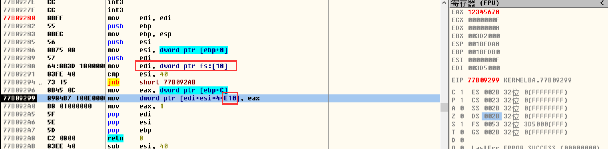
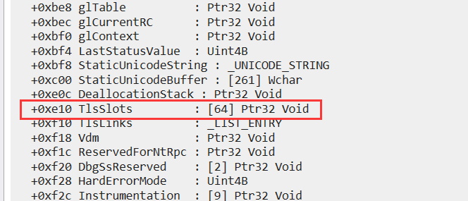
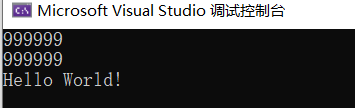
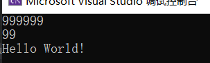
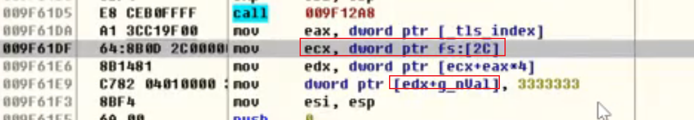
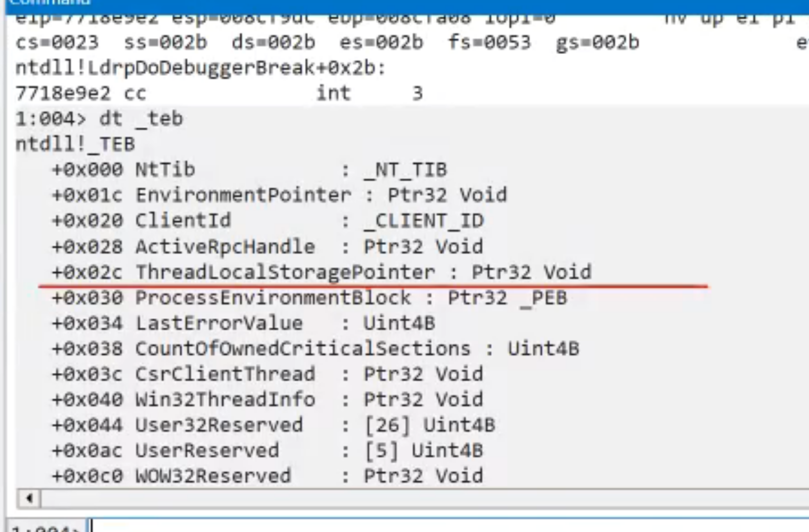
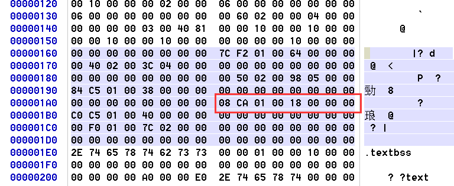
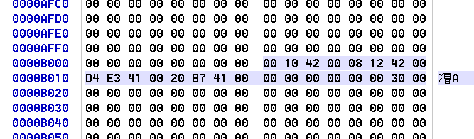
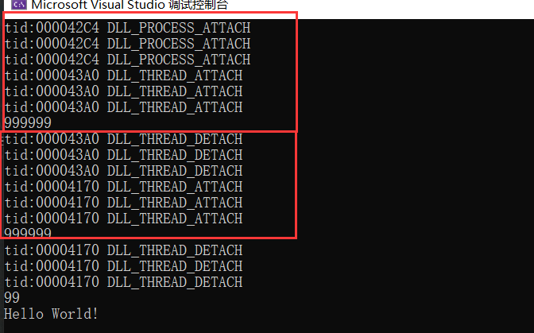

当一个全局变量,所有的线程都会同时访问这个全局变量,其实就是访问同一块内存,有时我们希望所有的内存访问同一块内存,它们的值是不一样的,同一个线程里面是同一个值,不同线程里面是不同的值.

```c++
// Project1.cpp : 此文件包含 "main" 函数。程序执行将在此处开始并结束。
//

#include <iostream>
using namespace std;

int g_n = 99;

void  TestFunc1() {  
    g_n = 88;
}


void  Thread1() 
{
    TestFunc1();

}

void  Thread2() {
    TestFunc1();
}
int main()
{
    cout << "Hello World!\n";
}

```

例如上面代码,  线程1 Thread1  和线程   Thread2  同时运行,访问 函数 TestFunc1 ,但是里面全局变量的值是相互独立,互不影响的,系统提供了2种方式,  显式TLS  和隐式TLS     


### 显式TLS - thread local storage

线程局部存储

由四个api负责

TlsAlloc：   判断数组中哪个元素可以使用，将该元素分配并保留，返回值是数组下标。
TlsSetValue：给数组元素赋值
TlsGetValue：获取数组元素的值
TlsFree：    释放索引
*Set和Get：元素值可以是4字节的值，也可以是指针。比如存结构体类型的TLS，在SetValue之前new个内存，
将指针存入元素；读取的是结构体指针，使用时强转。

TlsAlloc 返回的索引不是无限大的,最基础的需求是64个,  说明线程多的话,索引值可能相同,相同的话也不会存到同一块内存,每个线程都是独立的,该变量的是存入到 TEB 的 E10 位置处




fs:[18]  保存的是teb的信息




 隐式TLS 

 变量 

●语法：__declspec(thread) 类型 变量名 = xx。对这些变量的访问与普通变量一样，编译器负责处理其中细节分配索引和初始化等，生成动态使用时的代码。

●静态使用TLS变量需要在main之前（入口代码之前）申请数组下标并初始化元素为0。如果在main 中申请，在main之前执行代码时用到TLS变量来不及申请。所以只能记录在PE中，加载完PE立刻申请 TLS。

●每开辟一条新的线程，系统都会拷贝一份TLS变量副本到该线程中。作用域限制在各个线程内部。 

●各个线程中TLS变量的初始值取决于申请TLS变量时赋的初始值。 

●静态创建的TLS变量不能用于DLL动态库中。

```c++
#include <Windows.h>
#include <iostream>
#include <thread>
using namespace std;

int g_n = 99;

void  TreadFunc() {
    g_n = 999999;
    cout << g_n << endl;
}


int main()
{
    thread t(TreadFunc);
    t.join();
    cout << g_n << endl;
    cout << "Hello World!\n";
}
```




可以看到全局变量的值被改了,那么怎么变成线程的局部变量呢    变量前面    __declspec(thread)

```c++
#include <Windows.h>
#include <iostream>
#include <thread>
using namespace std;

__declspec(thread) int g_n = 99;   //设为线程局部函数

void  TreadFunc() {
    g_n = 999999;
    cout << g_n << endl;
}

int main()
{
    thread t(TreadFunc);
    t.join();
    cout << g_n << endl;
    cout << "Hello World!\n";
}
```



可以看到此时局部变量的值没有被修改


-   _tls_index的值一般为 0



**fs:[2C]** 处，TEB结构体的2C处，先从2C处取首地址，然后根据index计算偏移，将3333333存储到该位置处。tls_index 发现是一个固定地址，猜测在文件中。




#### TLS 表

 **PE头里面的 TLS 表，使用隐式TLS的时候才存在该表，数据目录第 9（下标） 项**



IMAGE_TLS_DIRECTORY32

```c++
// IMAGE_TLS_DIRECTORY32：IMAGE_DIRECTORY_ENTRY_TLS ，在数据目录的[9]，24字节
// 隐式加载才会建此表
typedef struct _IMAGE_TLS_DIRECTORY32 {
 DWORD   StartAddressOfRawData;　//　TLS初始化数据的起始地址 VA，需要重定位
 DWORD   EndAddressOfRawData;	 //　TLS初始化数据的结束地址 VA，需要重定位
    							 // 1和2字段两者相减=定位放初始化值的范围
 DWORD   AddressOfIndex;         //　TLS 索引的位置
 DWORD   AddressOfCallBacks;     //　Tls回调函数的数组指针 也是 VA
 DWORD   SizeOfZeroFill;　　　　 //　填充0的个数
 union {
     DWORD Characteristics;　　　　//　保留 
     struct {
         DWORD Reserved0 : 20;
         DWORD Alignment : 4;
         DWORD Reserved1 : 8;
     } DUMMYSTRUCTNAME;
 } DUMMYUNIONNAME;

} IMAGE_TLS_DIRECTORY32;
typedef IMAGE_TLS_DIRECTORY32 * PIMAGE_TLS_DIRECTORY32;
```




-   **StartAddressOfRawData** 和 **EndAddressOfRawData** 决定一个范围，创建线程的时候拷贝该范围数据到TEB结构体中。

#### 回调函数

-   线程创建结束以及进程创建结束时调，类似DllMain。
-   当用户选择使用自己编写的回调函数时，在应用程序初始化阶段，系统将要调用一个由用户编写的回调函数以完成相应的初始化以及其他的一些初始化工作。此调用将在程序真正开始执行到入口点之前就完成，以保证程序执行的正确性。 
-   当同步的代码量不大的时候，TLS可以提高性能，TLS是C标准。

```c++
#include <Windows.h>
#include <iostream>
#include <thread>
using namespace std;

__declspec(thread) int g_n = 99;

void  TreadFunc() {
    g_n = 999999;
    cout << g_n << endl;
}


VOID NTAPI TlsCallBack(
    PVOID DllHandle,
    DWORD Reason,
    PVOID Reserved
)
{
    switch (Reason)	// 调用原因
    {
    case DLL_PROCESS_ATTACH:
        printf("tid:%08X DLL_PROCESS_ATTACH\r\n", GetCurrentThreadId());
        break;
    case DLL_PROCESS_DETACH:
        printf("tid:%08X DLL_PROCESS_DETACH\r\n", GetCurrentThreadId());
        break;
    case DLL_THREAD_ATTACH:
        printf("tid:%08X DLL_THREAD_ATTACH\r\n", GetCurrentThreadId());
        break;
    case DLL_THREAD_DETACH:
        printf("tid:%08X DLL_THREAD_DETACH\r\n", GetCurrentThreadId());
        break;
    }
}
//======== 强制生成tls表 ========
#pragma comment(linker, "/include:__tls_used")    //启用tls
#pragma data_seg(".CRT$XLY")
PIMAGE_TLS_CALLBACK callbacks[] = { 
    TlsCallBack,
    TlsCallBack,
    TlsCallBack,
};
#pragma data_seg()

//======== 强制生成tls表 ========
int main()
{
    thread(TreadFunc).join();
    thread(TreadFunc).join();
    cout << g_n << endl;
    cout << "Hello World!\n";
}
```

-   .CRT$XLH：以$作为分割，.CRT表示启用C运行时库，XL固定，H（B-Y任意字符）
-   **#pragma data_seg(".CRT$XLY")**  申请新节，链接器安排节的时候会将节名相似的节安排到一起，并且排序的时候会按照ASCLL码排序。

#pragma data_seg(".CRT$XLA")
#pragma data_seg(".CRT$XLB")
#pragma data_seg(".CRT$XLC")
#pragma data_seg(".CRT$XLD")
#pragma data_seg(".CRT$XLE")
内存排序顺序：ABCDE。



```c++
  __xl_a 00401000
00000000
c0 22 41 00 c0 22 41 00 c0 22 41 00 00 00 00 00
00 00 00 00 
    
    
extern const IMAGE_TLS_DIRECTORY _tls_used =
{
        (ULONG)(ULONG_PTR) &_tls_start, // start of tls data
        (ULONG)(ULONG_PTR) &_tls_end,   // end of tls data
        (ULONG)(ULONG_PTR) &_tls_index, // address of tls_index
        (ULONG)(ULONG_PTR) 00401004, // pointer to call back array
        (ULONG) 0,                      // size of tls zero fill
        (ULONG) 0                       // characteristics
};
```

#### 应用

因为线程回调的时机很早,每次线程创建之前他就会调一下,进程启动前也会调一下,因此很早的时候被用来做反调试,是配合堆标志来做反调试的,堆在调试状态和非调试状态的初始值是不一样的,跑起来时,先在stl中申请一块堆,检查堆里面的初始值,看看是不是调试状态的初始值,如果是调试状态的初始值,说明是调试器.   PEB 里面有一个标志位,如果改值位TRUE ,每次申请堆,里面堆的初始值是调试状态的初始值,如果是FLASE,就是非调试状态的初始值, 直接改这个标志位的值是没用的,因为会影响后面一系列的标志 ,如果真想改 需要吧内核 里面的 CreateProcess  hook掉在他给标志的时候改成自己的值就可以