## 资源表

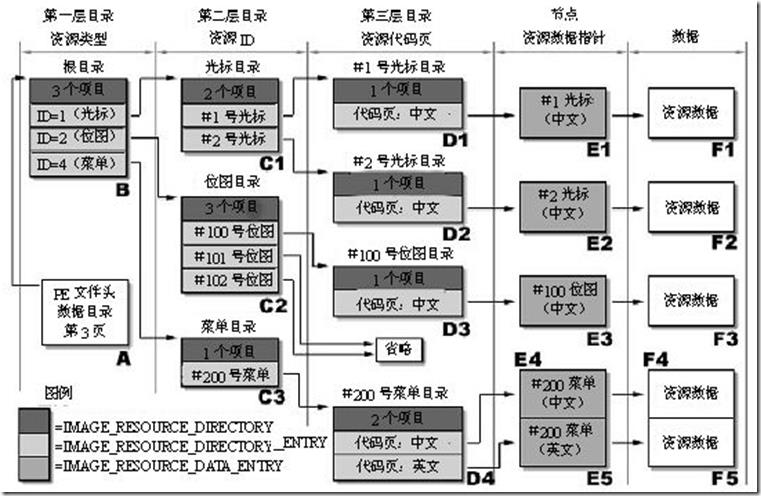

-   资源的管理方式采用windows资源管理器目录的管理方式，一般有三层目录。
-   根目录 结构体IMAGE_RESOURCE_DIRECTORY：描述名称资源和ID资源各自的数量，不描述文件。资源本质都是二进制数据，光标图标是图片有自己的文件格式，字符串什么的需要编译后写进文件，对话框是资源脚本，在rc里。在rc里对话框是一堆字符串，编译器解析字符串后显示出来的，操作系统可以根据文本字符串来创建对话框，但由于需要解析语法效率很低。为了提高效率使用资源编译，将文本字符串生成二进制，用结构体来描述，读资源时将对应数据强转成结构体就完事了。链接时会把res所有二进制数据插入PE文件里。 

-   -   第一层目录描述了资源类型，一般只有目录，以RT_开头的一组宏分类。 
    -   第二层目录指向各类资源ID。如果是图标类型的资源，每种分辨率都会占一个ID。目录项数由资源目录的数量字段控制。 
    -   第三层目录再进去之后就是指向资源数据（即代码页）了，一般只会有一项。 

-   在PE里为了更快的找到资源，有一些组织方式。正常情况下所有资源数据都会在.rsrc里。 
-   流程：根目录 - 资源类型 - 资源ID - 资源数据。

```c++
#define IMAGE_DIRECTORY_ENTRY_RESOURCE 2 

// 根目录 - 资源目录 - 名称资源和ID资源各自的数量
typedef struct _IMAGE_RESOURCE_DIRECTORY {
DWORD Characteristics; 	// 属性
DWORD TimeDateStamp; 	// 时间戳
WORD MajorVersion; 		// 主版本号
WORD MinorVersion; 		// 子版本号，前12字节无用
    
WORD NumberOfNamedEntries; // 按照名称命名的资源数量，一般都是0
WORD NumberOfIdEntries; // 按照ID命名的资源数量，编译器默认编译的一般都是序号
// IMAGE_RESOURCE_DIRECTORY_ENTRY DirectoryEntries[]; // 柔性数组，项数为上两者之和
} IMAGE_RESOURCE_DIRECTORY, *PIMAGE_RESOURCE_DIRECTORY;


// 第二层目录 - 表项，大小8字节
typedef struct _IMAGE_RESOURCE_DIRECTORY_ENTRY {
    
//四个字节最高位是1那么资源的id是字符串,低31位是偏移(指向一个结构体)
//,如果是0 资源id是数值 ,低16位就是id值  
union { 
    struct { // 四字节共用体，资源ID(类型)/名称
        DWORD NameOffset:31;    //位段低31位
        DWORD NameIsString:1;   //位段最高位
        } DUMMYSTRUCTNAME;
        DWORD Name;             // 最高位为1，用这个字段解析，低31位指向名称的节内偏移
        WORD Id;                // 最高位为0，用这个字段解析，低两位是ID
    } DUMMYUNIONNAME;
    
 //四个字节 最高位是1那么是个目录,低31位是偏移(指向一个目录的结构体地址) 
 //       ,如果是0 那么是个数据,低31位是偏移(指向一个数据的结构体地址) 
 union { // 资源数据/资源目录
        DWORD OffsetToData; // 最高位为1，是目录，低31位是新目录的相对于根目录IMAGE_RESOURC
     struct {            // 最高位为0，是数据(类似文件)，直接用IMAGE_RESOURCE_DATA_ENTRY解析
        DWORD OffsetToDirectory:31;  //位段低31位
        DWORD DataIsDirectory:1;     //位段最高位
       } DUMMYSTRUCTNAME2;
    } DUMMYUNIONNAME2; 
} IMAGE_RESOURCE_DIRECTORY_ENTRY, *PIMAGE_RESOURCE_DIRECTORY_ENTRY;


// 名称解析  -- ASCII
typedef struct _IMAGE_RESOURCE_DIRECTORY_STRING {
  WORD Length;			 // 长度
  CHAR NameString[ 1 ]; 	// ASCII字符串
} IMAGE_RESOURCE_DIRECTORY_STRING, *PIMAGE_RESOURCE_DIRECTORY_STRING;

// 名称解析  -- UNICODE
typedef struct _IMAGE_RESOURCE_DIR_STRING_U {
  WORD Length; 			// 长度
  WCHAR NameString[ 1 ]; // UNICODE字符串
} IMAGE_RESOURCE_DIR_STRING_U, *PIMAGE_RESOURCE_DIR_STRING_U;

// 数据项
typedef struct _IMAGE_RESOURCE_DATA_ENTRY {
  DWORD OffsetToData; // 资源数据RVA，这里的OFFSET是相对资源节的偏移
  DWORD Size; 		  // 资源数据的长度
  DWORD CodePage;     // 代码页，一般是0
  DWORD Reserved; 	  // 保留字段
} IMAGE_RESOURCE_DATA_ENTRY, *PIMAGE_RESOURCE_DATA_ENTRY;
```

主要目的不是为了提取资源,而是在条件比较恶劣的情况下,在资源里面看看是不是塞了一些恶意的东西

资源id可以以数值命名,也可以以字符串命名


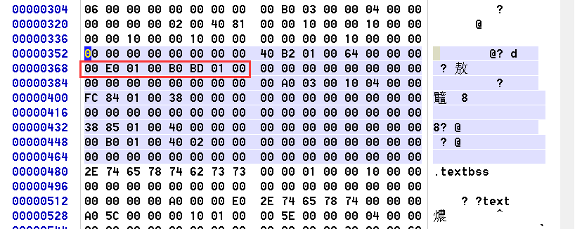

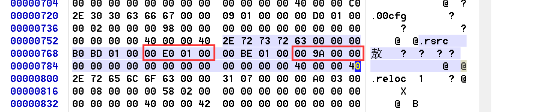


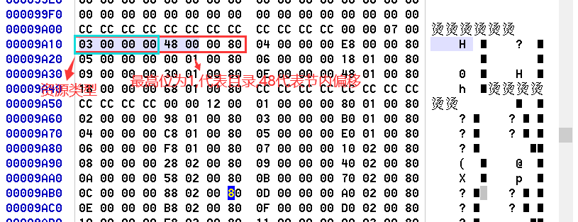

资源类型宏

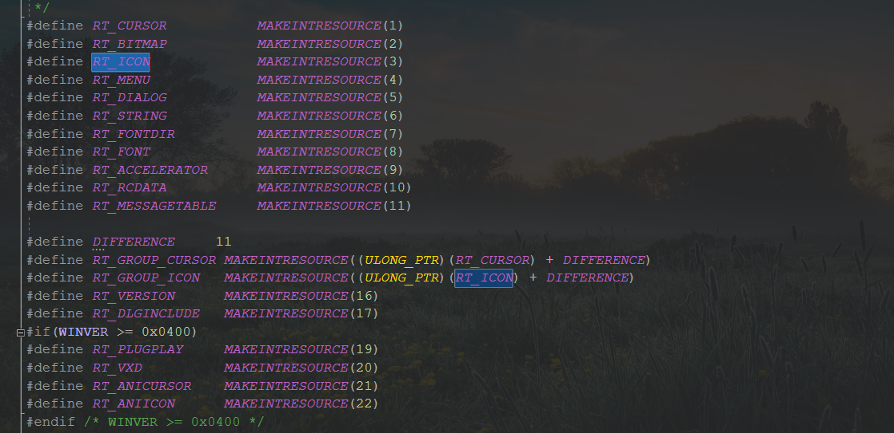

以 类型 6  字符串为例继续解析


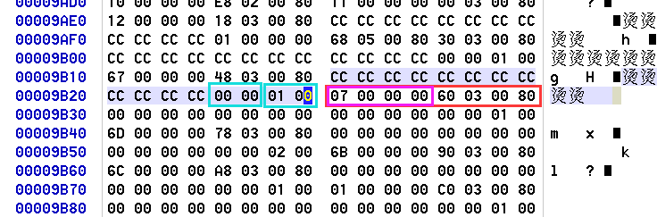

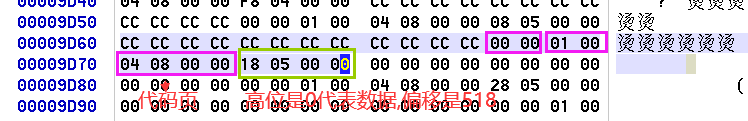

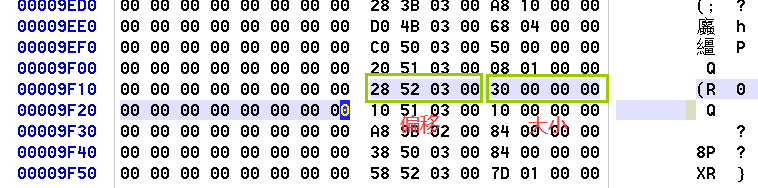

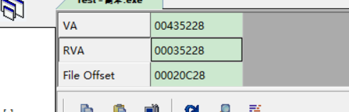

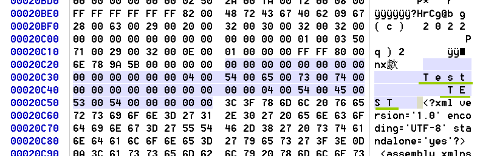

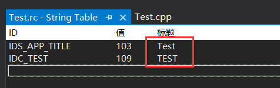


在看一下菜单资源

  菜单类型是4

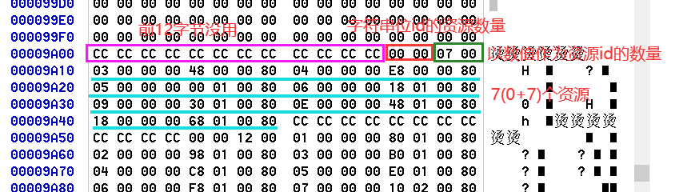

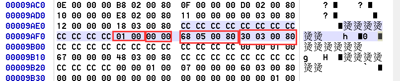

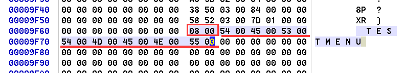

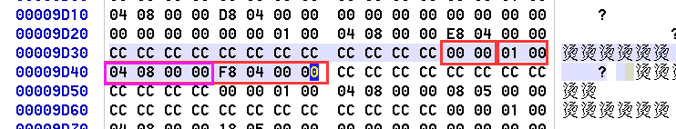

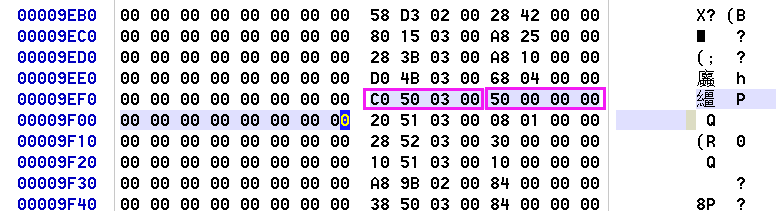

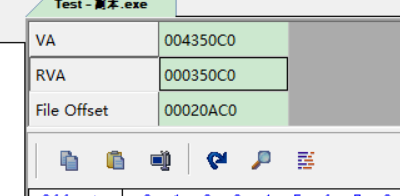

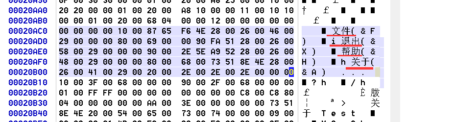

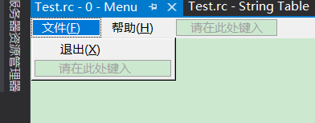

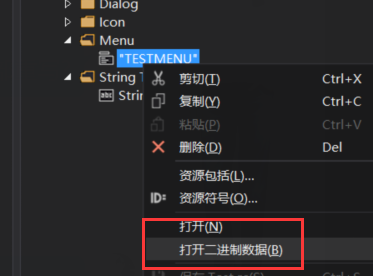

二进制数据对比,可以看到是一样的

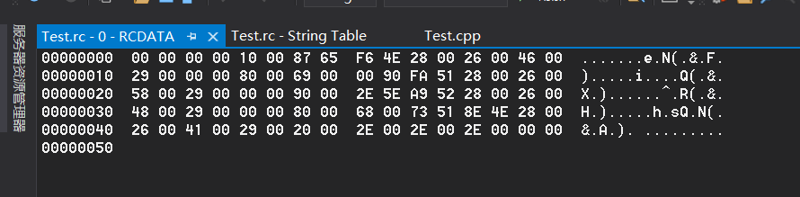


往资源里面添加一个PE

因为该类型不属于已有类型,所以添加自定义类型

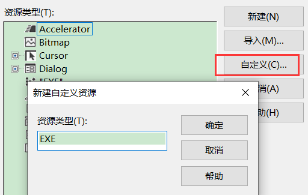

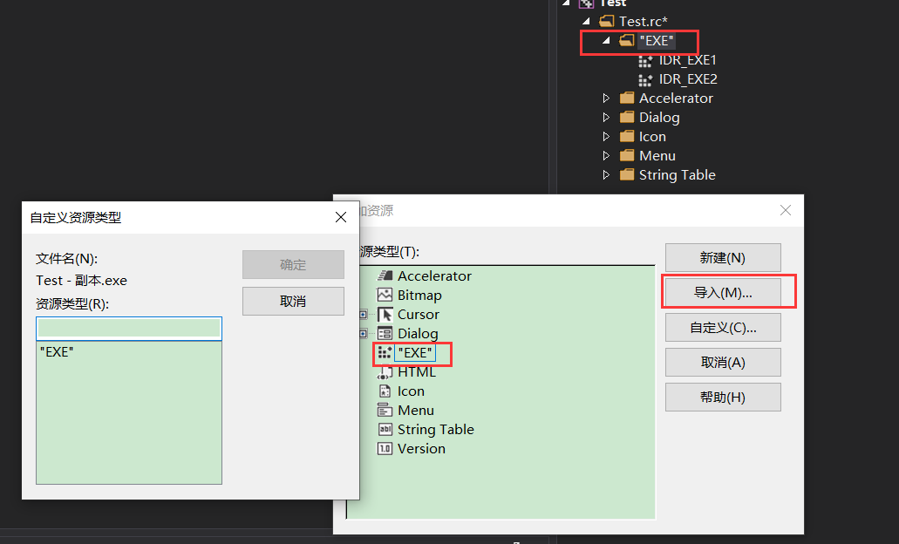

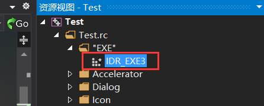

再用 winhex 打开 exe

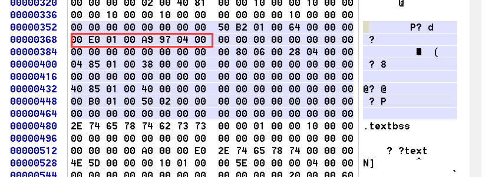

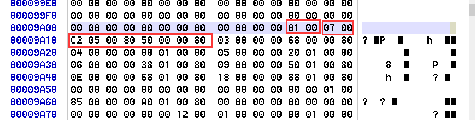

资源类型

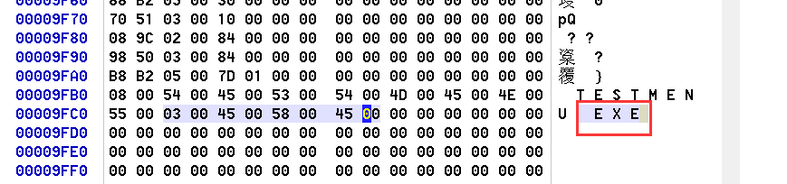

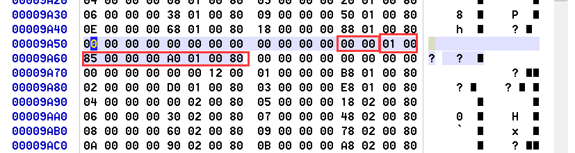

0x85 = 133  可以从资源.h 文件中看出,id是对的


800001a0   最高位是1 是个目录 ,偏移是  1a0      9a00+1a0= 9ba0

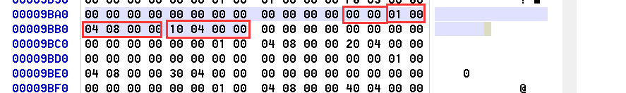

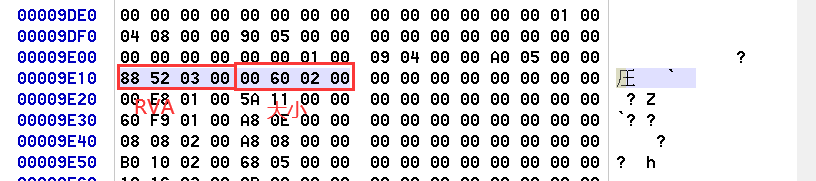


20c88 +  26000  = 46c88  所以数据从  20c88  到  4c688

把对应区域的数据拷贝出来保存到一个 文件里面

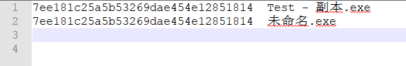

对比MD5 值,可以看到文件一模一样


#### 使用自定义资源

```c++
    HRSRC hRsrc = FindResource(hInst, MAKEINTRESOURCE(IDR_EXE3), TEXT("EXE"));
    HGLOBAL hGlobal = LoadResource(hInst, hRsrc);
    LPVOID pRes = LockResource(hGlobal);    //返回资源的首地址
```

 提取资源文件 

以扫雷为例

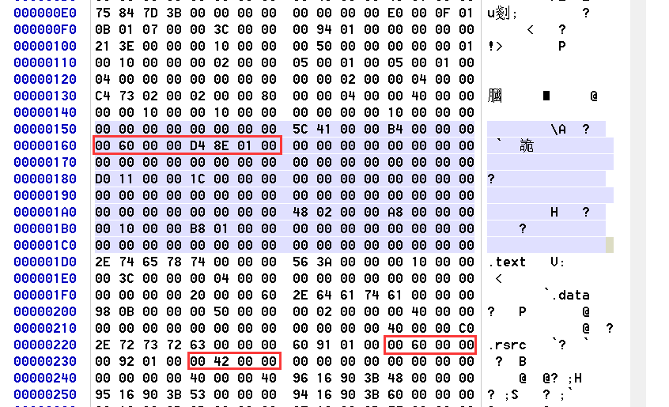


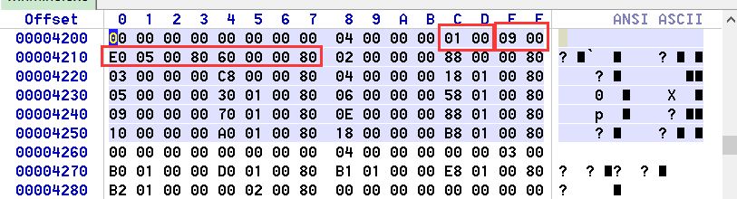

4200 + 5e0 = 47e0  ,  4200 + 60 = 4260


​    格式是 wav 

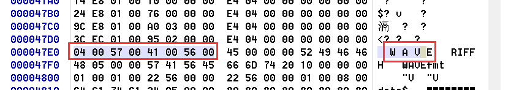


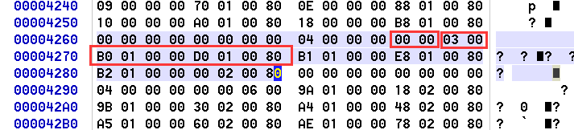

4200+1d0 = 43d0


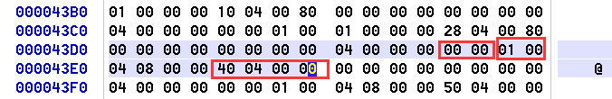


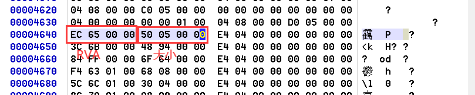


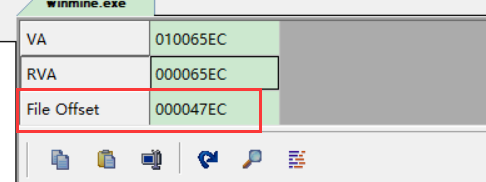


把数据拷出来复制到新文件,  以wav作为格式