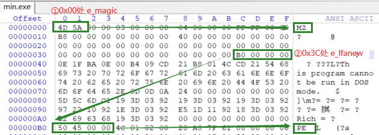
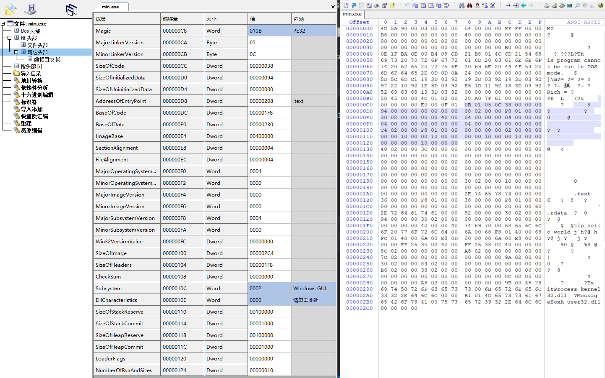
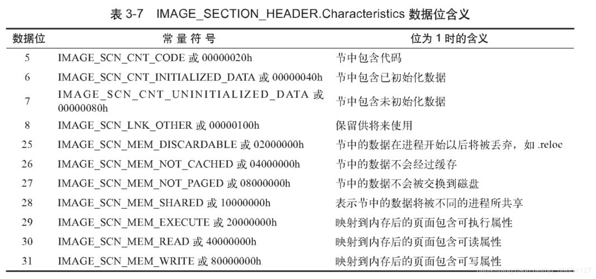
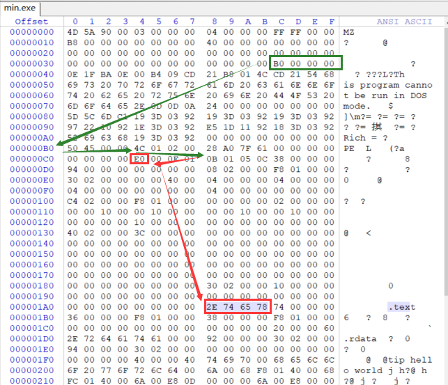
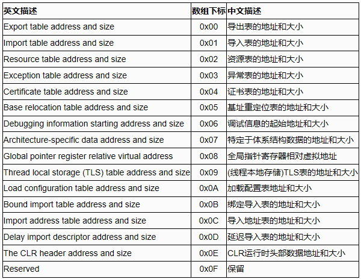
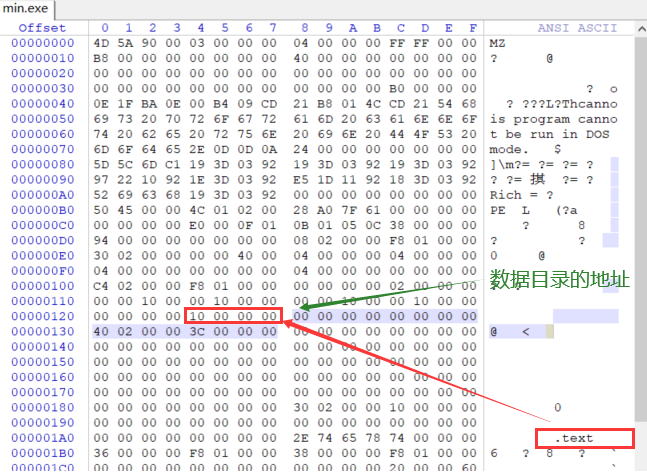
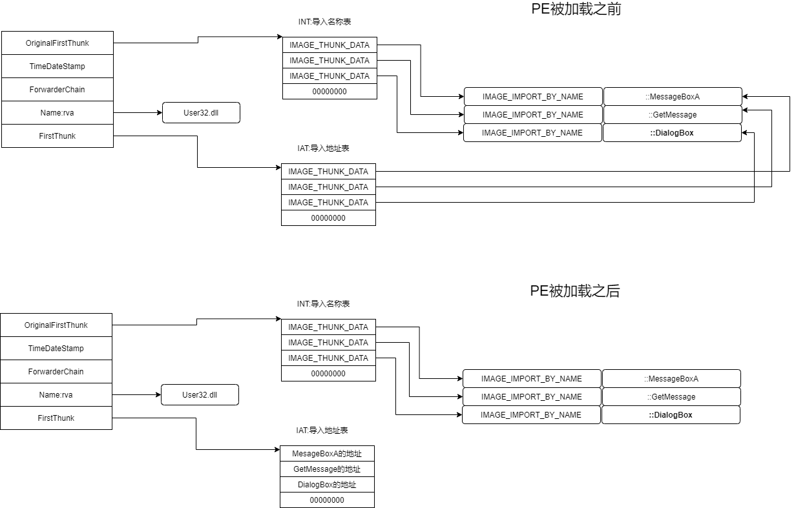

### 1.DOS部分

#### （1）DOS头结构体 IMAGE_DOS_HEADER；

```c++
typedef struct _IMAE_DOS_HEADER//  偏移, 意义
{ 
    WORD e_magic;              //  0x00, 'MZ'（0x5A4D）标识 	
    ......中间成员为兼容16位操作系统,可修改可忽略......
        LONG e_lfanew;             //  0x3C, PE头的起始地址，默认0xB0处
} IMAGE_DOS_HEADER, *PIMAGE_DOS_HEADER;  

1.WORD e_magic（0x00处）
● 对应PE文件的开头，是PE文件DOS头的标识符"MZ"→0x5A4D
○ 对应Winnt.h头文件中宏定义: #define IMAGE_DOS_SIGNATURE 0x4D5A // MZ
2.LONG e_lfanew（0x3C处）
● 对应PE文件0x3C处指向NT头在文件中的偏移（默认0xB0），即32位及以上系统文件头在文件中真正的偏移
```



图3-2    IMAGE_DOS_HEADER成员图析

#### 2.DOS块--DOS头与NT头之间的内容；

### （二）NT头

#### 1.DWORD Signature："PE\0\0"→0x00004550

对应Winnt.h头文件中宏定义：，#define IMAGE_NT_SIGNATURE 0x50450000 // PE00

#### 2.文件头结构体 IMAGE_FILE_HEADER  FileHeader

-   IMAGE_FILE_HEADER：描述磁盘上PE文件的相关信息。
-   *定位文件头地址：DOS头中的e_lfanew+4

```C++
// 文件头结构体： _IMAGE_FILE_HEADER
typedef struct _IMAGE_FILE_HEADER{
    WORD Machine; 								// +0x00, 指定程序的运行平台，勿改
    WORD NumberOfSections; 			// +0x02, PE中的节/块(section)数量，勿改
    DWORD TimeDateStamp; 				// +0x04, 时间戳：链接器填写的文件生成时间
    DWORD PointerToSymbolTable;  // +0x08, 指向符号表的地址(主要用于调试)
    DWORD NumberOfSymbols; 			// +0x0C, 符号表中符号个数(同上)
    WORD SizeOfOptionalHeader; 	// +0x10, IMAGE_OPTIONAL_HEADER32选项头结构大小，勿改
    WORD Characteristics; 				// +0x12, 文件属性，勿改
} IMAGE_FILE_HEADER, *PIMAGE_FILE_HEADER;

//* 字段1：Machine 表CPU的类型, 定义在windows.h中，常用类型
32位：#define IMAGE_FILE_MACHINE_I386, 0x014c　// Intel 386, x86
    64位：#define IMAGE_FILE_MACHINE_AMD64, 0x8664 // AMD64(KB), x64
    //* 字段2：NumberOfSections 表PE中的节(section)数量：
    节表紧跟在IMAGE_NT_HEADERS后面,此字段决定了节表中元素的个数，即节的个数
    遍历节表经验：根据此处的个数拿对应的节表数据
    //* 字段6：SizeOfOptionalHeader 表IMAGE_OPTIONAL_HEADER32 结构大小
    定位节表位置=选项头地址+选项头大小
    //* 字段7： Characteristics 表文件属性,EXE默认0100,DLL默认210Eh,或运算组合设置。
    #define IMAGE_FILE_RELOCS_STRIPPED　　　　 0x0001　// 文件中不存在重定位信息
    #define IMAGE_FILE_EXECUTABLE_IMAGE　　　　0x0002　// 文件可执行
    #define IMAGE_FILE_LINE_NUMS_STRIPPED　　　0x0004　// 文件中不存在行信息
    #define IMAGE_FILE_LOCAL_SYMS_STRIPPED　　 0x0008　// 文件中不存在符号信息
    #define IMAGE_FILE_AGGRESIVE_WS_TRIM　　　 0x0010　// 调整工作集
    #define IMAGE_FILE_LARGE_ADDRESS_AWARE　　 0x0020　// 程序能处理大于2G的地址
    #define IMAGE_FILE_BYTES_REVERSED_LO　　　 0x0080　// 小尾方式
    #define IMAGE_FILE_32BIT_MACHINE　　　　　 0x0100　// 只在32位平台上运行
    #define IMAGE_FILE_DEBUG_STRIPPED　　　　　0x0200　// 不包含调试信息
    #define IMAGE_FILE_REMOVABLE_RUN_FROM_SWAP　0x0400　// 不能从可移动盘运行
    #define IMAGE_FILE_NET_RUN_FROM_SWAP　　　　0x0800　// 不能从网络运行 
    #define IMAGE_FILE_SYSTEM　　　　　　　　　　0x1000　// 系统文件（如驱动程序），不能直接运行
    #define IMAGE_FILE_DLL　　　　　　　　　　　 0x2000　// 是一个dll文件
    #define IMAGE_FILE_UP_SYSTEM_ONLY　　　　　 0x4000　// 文件不能在多处理器计算机上运行
#define IMAGE_FILE_BYTES_REVERSED_HI　　　  0x8000　// 大尾方式
```


图3-3    IMAGE_FILE_HEADER成员图析

#### 3.选项头结构体IMAGE_OPTIONAL_HEADER（区分32位和64位）

-   IMAGE_FILE_HEADER：：以供操作系统加载PE文件使用，必选。
-   *定位选项头地址：DOS头中的e_lfanew+4+0x14（文件头大小）。

```c++
// 32位选项头结构体：_IMAGE_OPTIONAL_HEADER
typedef struct _IMAGE_OPTIONAL_HEADER
{
    WORD   Magic;							//* PE标志字：32位（0x10B），64位（0x20B）
    BYTE   MajorLinkerVersion;				//	主链接器版本号
    BYTE   MinorLinkerVersion;				//	副链接器版本号
    DWORD  SizeOfCode;						//	代码所占空间大小（代码节大小）
    DWORD  SizeOfInitializedData;			//	已初始化数据所占空间大小
    DWORD  SizeOfUninitializedData;			//	未初始化数据所占空间大小
    DWORD  AddressOfEntryPoint;				//*	程序执行入口RVA，(w)(Win)mainCRTStartup：即0D首次断下来的自进程地址
    DWORD  BaseOfCode;						//	代码段基址
    DWORD  BaseOfData;						//	数据段基址
    DWORD  ImageBase;						//*	内存加载基址，exe默认0x400000，dll默认0x10000000
    DWORD  SectionAlignment;				//*	节区数据在内存中的对齐值，一定是4的倍数，一般是0x1000(4096=4K)
    DWORD  FileAlignment;					//*	节区数据在文件中的对齐值，一般是0x200(磁盘扇区大小512)
    WORD   MajorOperatingSystemVersion;		//	要求操作系统最低版本号的主版本号
    WORD   MinorOperatingSystemVersion;		//	要求操作系统最低版本号的副版本号
    WORD   MajorImageVersion;				//	可运行于操作系统的主版本号
    WORD   MinorImageVersion;				//	可运行于操作系统的次版本号
    WORD   MajorSubsystemVersion;			//	主子系统版本号：不可修改，这里改成4可以再xp运行
    WORD   MinorSubsystemVersion;			//	副子系统版本号
    DWORD  Win32VersionValue;				//	版本号：不被病毒利用的话一般为0,XP中不可修改
    DWORD  SizeOfImage;						//*	PE文件在进程内存中的总大小，与SectionAlignment对齐
    DWORD  SizeOfHeaders;					//*	PE文件头部在文件中的按照文件对齐后的总大小（所有头 + 节表）
    DWORD  CheckSum;						//	对文件做校验，判断文件是否被修改：3环无用，MapFileAndCheckSum获取
    WORD   Subsystem;						//	子系统，与连接选项/system相关：1=驱动程序，2=图形界面，3=控制台/Dll
    WORD   DllCharacteristics;				//	文件特性
    DWORD  SizeOfStackReserve;				//	初始化时保留的栈大小
    DWORD  SizeOfStackCommit;				//	初始化时实际提交的栈大小
    DWORD  SizeOfHeapReserve;				//	初始化时保留的堆大小
    DWORD  SizeOfHeapCommit;				//	初始化时实际提交的堆大小
    DWORD  LoaderFlags;						//	已废弃，与调试有关，默认为 0
    DWORD  NumberOfRvaAndSizes;				//	下边数据目录的项数，此字段自Windows NT发布以来,一直是16
    IMAGE_DATA_DIRECTORY DataDirectory[IMAGE_NUMBEROF_DIRECTORY_ENTRIES];// 数据目录表
} IMAGE_OPTIONAL_HEADER32, * PIMAGE_OPTIONAL_HEADER32;

//* 字段6：AddressOfEntryPoint 表 程序入口RVA，即OEP:
EOP:程序入口点，壳相关概念
OEP:原本的程序入口点（实际为偏移，+模块基址=实际入口点）
EP: 被加工后的入口点
//* 字段9：ImageBase 表 模块加载基地址，exe默认0x400000，dll默认0x10000000
建议装载地址：exe映射加载到内存中的首地址= PE 0处，即实例句柄hInstance
一般而言，exe文件可遵从装载地址建议，但dll文件无法满足
//* 尾字段：DataDirectory 表 数据目录表，用来定义多种不通用处的数据块。
      存储了PE中各个表的位置，详情参考IMAGE_DIRECTORY_ENTRY...系列宏
```



图3-4    IMAGE_OPTIONAL_HEADER成员图析

### （三）节表

#### 1.节表总概

-   节表：描述PE文件与内存之间的映射关系，由一系列的IMAGE_SECTION_HEADER结构排列而成，每个结构用来描述一个节（每个节占用0x28B），说明PE文件的指定内容拷贝至内存的哪个位置、拷贝大小及内存属性的设置。结构的排列顺序和它们描述的节在文件中的排列顺序是一致的。全部有效结构的最后以一个空的IMAGE_SECTION_HEADER结构作为结束，所以节表中总的IMAGE_SECTION_HEADER结构数量等于节的数量加一。节表总是被存放在紧接在PE文件头的地方。
-   节表大小 = FileHeader.NumberOfSections（节数量）* IMAGE_SECTION_HEADER 结构体。

```c++
// IMAGE_SECTION_HEADER 节表结构体，大小40B
typedef struct _IMAGE_SECTION_HEADER {
    BYTE  Name[IMAGE_SIZEOF_SHORT_NAME];	// 节表名称：描述性字段
    // 下方4个字段：从文件S1处开始，拷贝S2大小的数据，到内存S3处，有效数据占用内存S4大小
    union {
        DWORD PhysicalAddress;
        DWORD VirtualSize;			// S4:内存大小
    } Misc;
    DWORD VirtualAddress;			// S3:内存地址：基于模块基址
    DWORD SizeOfRawData;			// S2:文件大小
    DWORD PointerToRawData;		// S1:文件偏移
    DWORD PointerToRelocations;	// 无用
    DWORD PointerToLinenumbers;	// 无用
    WORD  NumberOfRelocations;	// 无用
    WORD  NumberOfLinenumbers;	// 无用
    DWORD Characteristics;		// 节属性，取值IMAGE_SCN_...系列宏
} IMAGE_SECTION_HEADER, *PIMAGE_SECTION_HEADER;
```



图3-5    节属性常用位含义

-   节表置于选项头之后，节表首地址 计算方法：

-   -   （1）选项头的地址 + 选项头的大小；
    -   （2） e_lfanew+4+0x14（文件头大小）+0xE0（32位选项头大小）。
    -   

### （四）数据目录  IMAGE_DATA_DIRECTORY

-   数据目录用来描述PE中各个表的位置及大小信息，重点表：导出表、导入表、重定位表、资源表。

// 数据目录 _IMAGE_DATA_DIRECTORY结构体
typedef struct _IMAGE_DATA_DIRECTORY {
    DWORD VirtualAddress;     /**指向某个数据的相对虚拟地址   RAV  偏移0x00**/
    DWORD Size;               /**某个数据块的大小                 偏移0x04**/
} IMAGE_DATA_DIRECTORY, *PIMAGE_DATA_DIRECTORY;

在这个数据目录结构体中只有两个成员 VirtualAddress 和 Size ：

○参数1VirtualAddress指定了数据块的相对虚拟地址(RVA)，因为当exe在处理导入表的时候，已经映射进进程内存了，取值RVA更方便。

○ Size则指定了该数据块的大小，有时并不是该类型数据的总大小，可能只是该类型数据一个数据项的大小。这两个成员(主要是VirtualAddress)成为了定位各种表的关键，所以一定要知道每个数组元素所指向的数据块类型，以下表格就是它的对应关系：




图3-6    IMAGE_DATA_DIRECTORY数组元素项图析

●定位数据目录的技巧：数据目录向上找10h，+4即为DataDirectory的地址，编译器生成的一般都是10h。




图3-7    数据目录定位图析

 3.数据目录重点元素--DataDirectory[1] IMP（导入表） 

●IMP（导入表）：导入表用来描述模块调用的API列表，位于PE数据目录中的第二项即DataDirectory[1]，其中记录了导入表的地址和大小，VirtualAddress指向IMAGE_IMPORT_DESCRIPTOR 结构体数组，这个结构体数组中的每个元素对应着一个dll文件，以全0作为最后一个元素结尾。程序产生调用会生成CALL指令，两大问题及解决思路如下：

○1.地址存放问题：出于运行环境等因素考虑，导入函数的地址不能为固定地址。所以在exe中保存导入函数的相关信息，系统和链接器对其进行约定：链接器在生成exe的时候，为所有调用API的地方填写一个间接地址，当程序运行起来后，相应地址则会被写入真正API的地址，此区域即为IAT表（导入地址表）；

○2.exe如何存储导入dll及其函数信息：dll与函数是一对多的关系，原则上应该设计为多方填写1方信息的数据关系，但考虑到数据较多的情况，遍历不便。反过来设计为1方存储多方信息的数据结构，虽然会造成插入删除的不方便，但是考虑到exe加载dll的实际场景，无插入删除需求，所以应该设计为后者结构更贴合遍历查询需求。

```c++
// IMAGE_IMPORT_DESCRIPTOR 导入表结构，以全0（20个0）结尾
typedef struct _IMAGE_IMPORT_DESCRIPTOR
{
    union
    {
        DWORD   Characteristics;				//  作用1：导入表结束标志
        DWORD   OriginalFirstThunk;			//* 作用2：*RVA指向一个结构体数组(INT表)
    };
    DWORD   TimeDateStamp;           //  32位时间戳
    DWORD   ForwarderChain;          //  0表无意义，与_IMAGE_THUNK_DATA32.ForwarderString配合使用
    DWORD   Name;                    //* RVA指向以0结尾的dll名字
    DWORD   FirstThunk;              //* RVA指向一个结构体数组(IAT表，DataDirectory[12]项)
} IMAGE_IMPORT_DESCRIPTOR, * PIMAGE_IMPORT_DESCRIPTOR;
```

-   **IAT（导入地址表）：**IMP中的FirstThunk指向IAT表。
-   **INT（导入名称表）：**IMP中的OriginalFirstThunk指向INT表，也是DataDirectory[12]项。
-   **PE加载前，**IAT和INT都指向_IMAGE_IMPORT_BY_NAME结构体

```c++
// IMAGE_THUNK_DATA结构体汇总只有一个联合体，
// 一般用四字节的AddressOfData来获取IMAGE_IMPORT_BY_NAME的地址。
// 四字节解析，看最高位[31]：
//      1表序号导入，低word为导入函数的序号值；
//      0表RVA，指向_IMAGE_IMPORT_BY_NAME；
typedef struct _IMAGE_THUNK_DATA32
{
    union
    {
        PBYTE  ForwarderString;  	// PBYTE 指向一个字符串的RVA；与_IMAGE_IMPORT_DESCRIPTOR.ForwarderChain配合使用
        PDWORD Function;      	 	// PDWORD 导入函数的实际内存地址；
        DWORD Ordinal;       			// *导入函数的序数值，最高位[31]为1才有效
        PIMAGE_IMPORT_BY_NAME  AddressOfData; //*RVA 指向IIMAGE_IMPORT_BY_NAME结构
    } u1;
} IMAGE_THUNK_DATA32;


// IMAGE_IMPORT_BY_NAME有两个成员：1.序号；2.函数名。
typedef struct _IMAGE_IMPORT_BY_NAME
{
    WORD    Hint;				// 可能为0，编译器决定，如果不为0，是函数在导入表中的索引
    BYTE    Name[1];		// 导入函数名称以0结尾，由于不知道到底多长，所以干脆只给出第一个字符，找到0结束
} IMAGE_IMPORT_BY_NAME, * PIMAGE_IMPORT_BY_NAME;
```

-   **PE加载后，IAT有变：**加载后的IAT每一项存储的是所对应的导入函数地址。



-   图3-8    PE加载前后IMP、IAT、INT之间的关系

### （四）节数据

-   -   节数据：即是由不同属性数据组成的不同节。