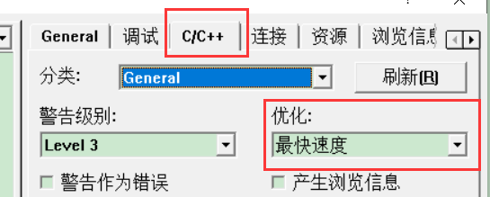
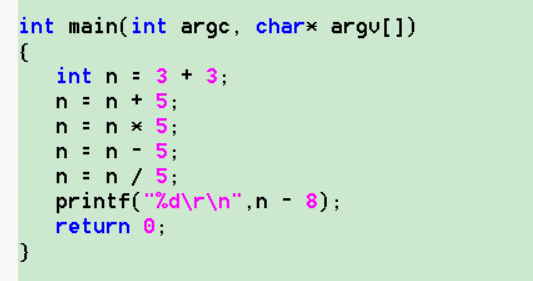
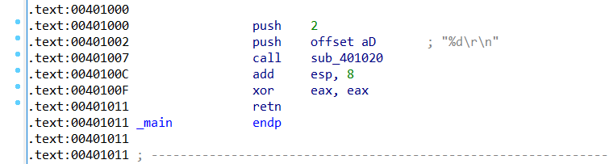
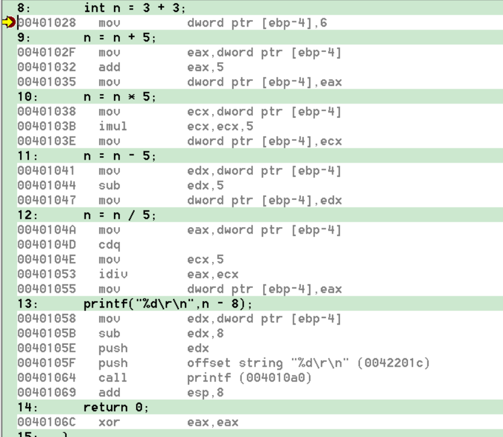
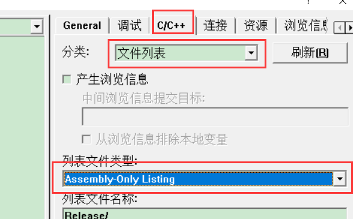
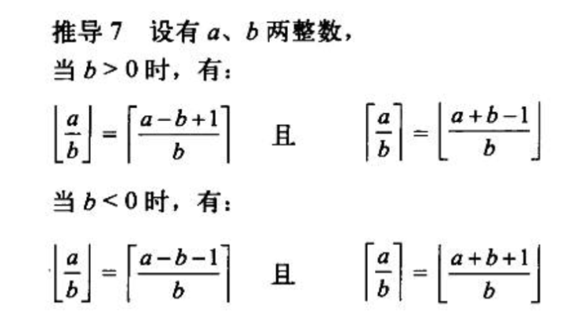
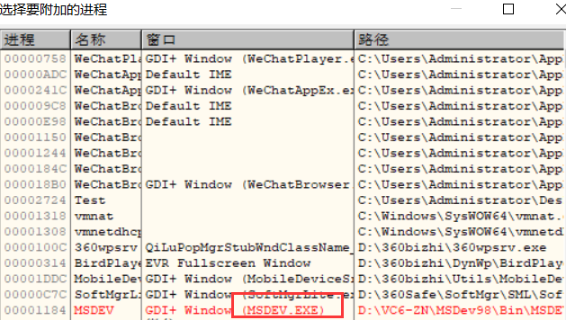
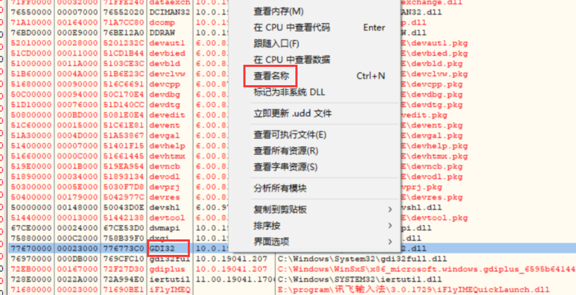
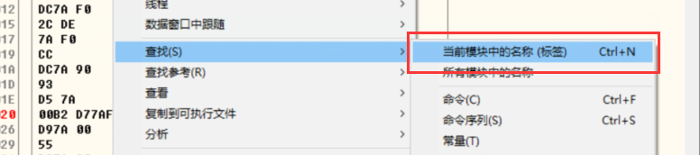
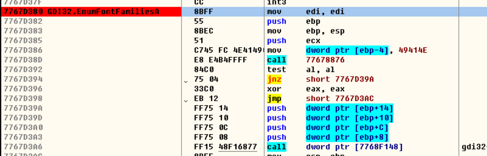

逆向一个序列号有3种层次

1.  打个补丁,改一下跳转(暴力破解)
2.  推导出一组可以用的账号密码
3.  还原算法,并写出例算法(注册机,彻底破解)

彻底破解的难点是还原算法,和 写出例算法(可能变成解题问题)

### 优化

优化方向

1.  体积优化

-   内存优化    例如:大数据   , 蓝光视频   ,写shellcode
-   磁盘优化    例如: 病毒   压缩

1.  速度优化

-    执行速度的优化
-   编译速度的优化

现在的优化一般以执行速度为主,Debug版优化是以便于调试为主所以里面带有详细的信息,效率是次要的,但是并不代表不优化

编译器对算法进行编译,运算结果的参与传递才会参与编译,否则不会参与编译(Debug 和Release 都会这样  )

参与传递的3种情况

1.  传参
2.  传返回值
3.  赋值运算

例如下面代码:

运行会发现此处的断点是无效的,而且通过反汇编窗口看,是没有反汇编的代码的,因为他没有参与编译

#### 整形加法的优化

##### Release

把上述代码生成的  Release 版  文件用IED查看,会发现代码都被优化掉了

##### Debug

Debug也会优化,但不会优化得那么彻底,因为那样无法单步,只会在单行代码内优化,和把当行代码换成等价的更优代码,例如:  -5  可能 +5的补码

#### 窥孔优化

  窥孔优化:  优化一段代码,以几行为单位进行优化,如果源码发生了优化,

​                 就会回到第一行开始重新开始,直到源码没有发生改变

1.   常量传播: 假如一个变量初始化或者赋值为常量,值中间没有任何修改, 然后把他代入到另一个表达式的时候,可以用常量直接替换掉他
2.  常量折叠:一个表达式,不管多复杂,只要参与运算的都是常量 ,就会触发常量折叠,编译期间直接对表达式求值,获得最后的常量结果

1.  删除未使用的变量:  如果优化到最后,变量没有使用,就直接删除

1   int n = 3 + 3;    
2  n = n + 5;
3   n = n * 5;
4   n = n - 5;
5   n = n / 5;
6   printf("%d\r\n",n - 8);
   return 0;

1  触发常量折叠   3+3  直接变成6       int  n= 6
2  触发常量传播  用6直接替换  n = 5+6      源码发生改变 从来开始
到 2 又 再触发常量折叠    n = 11  在从 1 开始
3   触发常量传播  用11 直接替换n      n = 11  * 5;    源码发生改变 从来开始
到3又触发常量折叠      n = 55    ;    源码发生改变 从来开始
4  触发常量传播  用55直接替换n     n = 55 - 5      源码发生改变 从来开始
到4又触发常量折叠      n = 50    ;    源码发生改变 从来开始
5 触发常量传播  用50直接替换n     n = 50 /5      源码发生改变 从来开始
到5又触发常量折叠      n = 10    ;    源码发生改变 从来开始
6  触发常量传播  用10 直接替换n    printf("%d\r\n",10 - 8);      源码发生改变 从来开始
到6又触发常量折叠     printf("%d\r\n",2);   ;    源码发生改变 从来开始
到6又触发删除未使用的变量     printf("%d\r\n",2);   前面的代码直接删除

所以最后优化后编译的代码就是  

 printf("%d\r\n",2); 

窥孔一方面用来优化代码,把代码由多变少,换个方向就是写反逆向工程 (代码混淆膨胀),把代码由少变多(只需要稳定可靠的的让1 行代码变2行就可以),2者互为对抗

#### VC6.0导出汇编代码

设置之后编译构建就会产生源码对应的汇编文件,再通过命令行编译和链接就可以产生  可执行文件,

只需要对对应的汇编文件进行混淆就可以了

### 乘法优化

1.  常量  乘 常量  直接折叠
2.  变量 乘  常量

-   常量是  2 的整数幂    直接位移

Debug

注意    shl   eax，3    等价于     lea  eax ,[ eax * 8 ]

 lea  eax ,[ eax * n ]  =  mul   eax , n       n必须是2的整数次幂

Release

-    常量不是  2 的整数幂    拆分成 2的整数次幂的组合 ,但是高版本取消了这个的优化

-   例如:

    argc * 7     =  argc *  8  -  argc 

    对应的汇编代码是

    lea  eax ,[ eax * 8  - eax  ]

    

    argc * 25     = (argc  * 5)*5

    对应的汇编代码是

    mov eax,argc  

    lea  eax ,[ eax * 4  + eax  ]      折叠就是     argc  * 5

    lea  eax ,[ eax * 4  + eax  ]     折叠就是     (argc  * 5) * 5     => argc  * 25

    

    argc * 52     =（ argc   +  （argc   *3）*4) * 4

    对应的汇编代码是

    mov eax,argc  

    lea  ecx,[ eax * 2  + 1]    就是     argc  * 3

    lea  edx,[ eax + ecx * 4 ]    就是    （ argc   +  （argc   *3）*4)   折叠一下   就是     argc  **  13 

    shl  edx,2     就是    *argc  **  13  *4    *折叠一下   就是     argc  **  52

    

    1.  变量 * 变量   无法优化

    argc *  argc 

    对应的汇编代码是

    mov eax,argc 

    mov ecx,eax

    imul  ecx,eax

    ### 除法优化

    高版本和低版本都会对除法进行优化,因为除法消耗比较大

    1.  当除数是变量,没有优化空间
    2.  无符号数除法,且除数时2的整数次幂    

    ​       直接右移位

    1.  有符号数除法,且除数时2的整数次幂  

    计算机除法有取整问题

    正数 或者 无符号数  除法    结果都是像下取整

    负数                            除法    结果都是像上取整

    即  计算机的有符号 除法 是向0 取整的 

    所以在计算机中     (-a)/b  != -( a/b)

    

    在计算机中求以下结果

    

    a / b = q 余 r

    r =  a  - q*b

    

    10 %  3     =   1        // r  =  10 - 3 * 3 =  1

    -10 %  3    = -1       // r  =  -10 - ( - 3 ) * 3 =  -1

    10 % - 3    =   1       // r  =  10 - ( - 3 ) * (-  3) =  1

    -10 %  -3   = -1      // r  =  -10 -   3  * (-  3) =   - 1

    从上面可以看到   余数的符号 跟 被除数相关(即符号相同)

    除法原型:

    a / b = c .... r 

    6  / 4 = 1 ...2

    1.     |r|  < |b|     : 余数的绝对值,绝对会小于除数的.  比如  6 / 4 = 1 .... 2  那么 余数2 不关是正数还是父数,绝对都是绝对会小于除数的,也就是4

    1.    a = c * b + r : 求被除数,被除数是商*除数+余数

    1.    b  =  (a - r)/c   : 求除数,除数等于 被除数-余数 / 商
    2.    c = (a - r)/b : 求商: 被除数 - 余数 / 除数
    3.    r = a - (c * b)          : 求余数 被除数 - (商 * 除数) 

    

    从上面可以知道 

    A  /   2^n

    当 A > 0      , 结果需要  向 下取整

    当 A  < 0     , 结果需要  向 上取整    那么就等于         ( A + 2^n -1  )  / 2^n  向下取整

    

    所以  

    argc /  4

    当  argc   >  0            =    argc    >> 2 

    当  argc   <  0           =    ( argc   + 4 - 1)  >> 2

    所以

    if(   argc  >= 0){

       argc /  4   ==   argc    >> 2 

    } 

    else

    {

    ​    argc /  4   ==    ( argc   + 4 - 1)  >> 2

    }

    

    但是上面有分支,如何实现无分支呢    

    cdq  指令,如果eax 不小于0 那么edx 为0 ,否则为  -1

    

    mov  eax , argc  

    cdq                    ;   eax >= 0 , edx =0   否则     eax<0   ,edx = 0xFFFFFFFF

    and edx ,3        ;  eax >= 0 , edx =0 ,  edx = 0   否则   eax<0   ,edx = 0xFFFFFFFF    dex=3

    add  eax,dex   ;  eax >= 0 , edx =0, edx = 0 ,eax=0   否则   eax<0,edx = 0xFFFFFFFF,dex=3, eax=3

    shr eax,2          ;eax >> 2

    

    因此可以得到代码定式

    

    a / 2^n    的反汇编代码是  

    

    1      mov  eax , a

    2      cdq                 

    3      and edx ,2^n - 1   

    4      add  eax,dex  

    5      shr eax, n

    

    必须要验证一下    第3行 是否满足  值   等于 第5行的    2^n  -1       例如     

    1     mov  eax , a

    2     cdq                 

    3     and edx , 7

    4     add  eax,dex  

    5     shr eax,   2

    是错的   7 != 2^2 -1

    

    argc /  2

    1    mov  eax , a

    2     cdq     

    3    sub   eax,dex              ; 2^n  -1 ,n = 1    =>     1  =  0 - (-1) 

    4     shr eax, 1

    注意除数是2情况有些特殊 ,指令序列不一样但数学模型是一样的

    

    

    练习: 

    argc /  32

    

    1    mov  eax , a

    2    cdq                 

    3    and edx ,31

    4    add  eax,dex  

    5     shr eax, 5

    

    ### VC6 .0 字体补丁

    正常情况下VC6.0 可选字体很少,因此需要打补丁

    用OD 附加 进程 VC6.0

    

    当我们选择字体时,肯定要用到列举字体的函数

    

    列举字体的函数的函数为   **EnumFontFamiliesEx    在**    Gdi32.lib  里面

    

    

    函数比较多,无法确定使用哪一个,可以到主模块去看看

    

    

    可以看到是这个

    

    

    下断点,因为我们换字体肯定会调这个函数

    

    去换字体就会断下来,继续跟可以发现有检查,那如果把检查跳转去掉不跳走直接 执行下面的指令

    

    然后把修改复制到可执行文件,覆盖掉原来的 dll 就可以了,再去看就可以发现字体多了