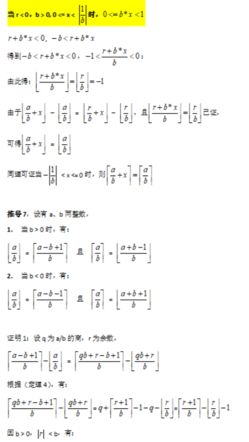
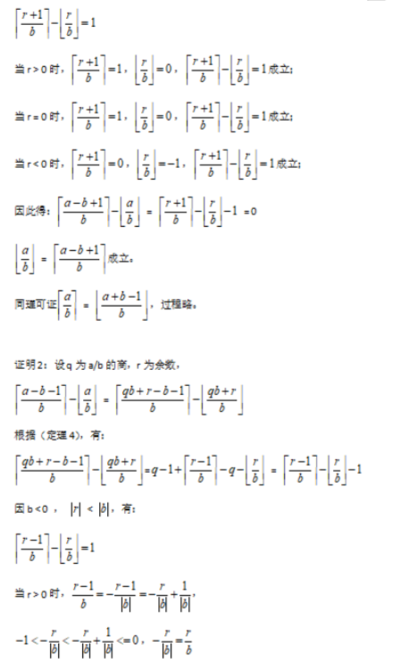
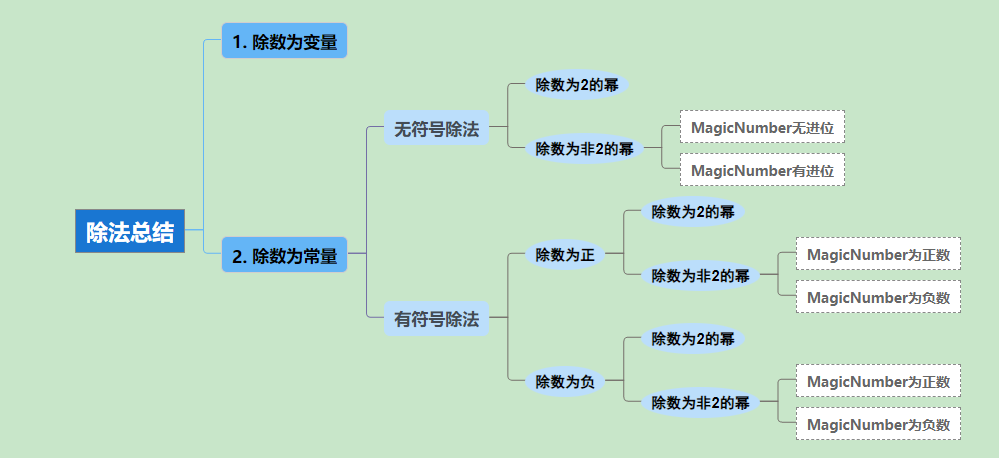

edx 传递结果高位

ecx传递成员对象指针


### 除数是负数 2的整数次幂

```
int main(int argc, char* argv[])
{
      printf("%d\r\n",argc / -4);
      return 0;
}
反汇编代码
mov     eax, [esp+argc]
 cdq
and     edx, 3
add     eax, edx
sar     eax, 2
neg     eax     ;结果比  argc / 4 多一条求补

分析:    argc / -4    =  -(argc / 4 ) 因此相对   argc  / 4  求补就可以了
```

### 除数是负数且非 2的整数次幂

```
int main(int argc, char* argv[])
{
      printf("%d\r\n",argc / -5);
      return 0;
}
反汇编代码:
mov     ecx, [esp+argc]
mov     eax, 99999999h
imul    ecx
sar     edx, 1
mov     eax, edx
shr     eax, 1Fh
add     edx, eax
分析:  上式用前面的方式还原代码是错的 
2^33 /   99999999h  =  4 ;明显是不对的
那该怎么还原呢?
前面知识我们可以知道    A/C =>  AM >> n                M = 2^n/C
那么    A/ (-C)  => -(AM) >> n   =>  A * (-M) >> n    M是常量 -M 编译器可以计算
所以: 上式 M 值是求补后的 值
那怎么判断呢?
我们看出 :   M 是一个负数 ,按之前所学的知识,M为负数,那么需要 进行调整, 但是上式明显没有,所以可以判断除数为负   (M为负数 ,且乘法移位之间没有调整 即没有 add     edx, ecx)

因此还原时需要先对M值进行求补   ,在计算出 C 的绝对值  ,再由于是负数 ,所以 再把结果 取负

还原:    neg(99999999h)  =    - (99999999h)  +  1 =   6666 6667h
C =    2^33 /    6666 6667h=   5      
因为可知除数为负,所以除数为   -5   


可以得到结论: 是除法定式 M为负数, 乘法之后没有调整 那么被除数是负数，M需要求补，求出C的绝对值


int main(int argc, char* argv[])
{
      printf("%d\r\n",argc / -7);
      return 0;
}

反汇编代码:
mov     ecx, [esp+argc]
mov     eax, 6DB6DB6Dh
imul    ecx
sub     edx, ecx
sar     edx, 2
mov     eax, edx
shr     eax, 1Fh
add     edx, eax
上面跟前面的比较,我们发现,代码出现了调整,且是减调整
定式:  是除法定式,M为正数,且乘法移位之前有减调整,可以确定除数为负

 neg(6DB6DB6Dh)  =    - (6DB6DB6Dh)  +  1 =  9249 2493h    2454267027

|C| =    2^34 /  neg(6DB6DB6Dh)=2^34 / 2454267027  =   7
因为 C为负数  所以 C = -7

可以得到结论: 是除法定式 M为正数, 乘法之后有sub调整 那么被除数是负数，M需要求补，求出C的绝对值
```

### 除法有效性问题

用于确定除法误差的范围 ,即 确定 n 的值

由 推导 6 可知:   M / C  = q..r

0<=    M /(2^n *C)  < | 1/C|       n值32起步,当不满时是  n 值+1 在计算,知道 n 上面不等式 







### **除法总结**

-   调整方法：正数是加，负数是减。

### **除法总结**

-   调整方法：正数是加，负数是减。
-   

#### （1）除数为变量

div / idiv    ;无优化    

#### （2）除数为常量

1.  **无符号除法：**

1.  1.  **除数为2的幂**

1.  1.  1.  **公式：**`c = 2^n `
        2.  **定式：**

mov   reg, A

**shr**     reg , n        ;直接移位 

1.  1.  **除数为非2的幂**

1.  1.  1.  **MagicNumber无进位：**

1.  1.  1.  1.  **公式****：**`c = 2^(n+32) / MagicNumber`
            2.  **定式：**基于此原型有四种变化。

mov eax, MagicNumber

**mul**    A

**shr**     edx, n

1.  1.  1.  **MagicNumber有进位：**

1.  1.  1.  1.  **公式****：**`c = 2^(1+n+32) / (MagicNumber + 2^32)`
            2.  **定式：**

**mul / sub / shr / add / shr** 


mov eax, MagicNumber 

**mul**   A 

**sub**   A, edx 

**shr**    A, 1 

**add**   A, edx

**shr**    A, n


1.  **有符号除法 ：**

1.  1.  **除数为正**

1.  1.  1.  **除数为2的幂**

1.  1.  1.  1.  1.  **公式：**`c = 2^n `
                2.  **定式：**

**cdq / and / add / sar**

mov   eax, A

**cdq**

**and**   edx, 2^n ‐ 1

**add**   eax, edx

**sar**     eax, n

1.  1.  1.  **除数为非2的幂**

1.  1.  1.  1.  **MagicNumber为正数：**

1.  1.  1.  1.  1.  **公式****：**`c = 2^(n+32) / MagicNumber`
                2.  **定式：**

mov eax, MagicNumber

**imul**   A

**sar**     edx, n


;调整取整方向(序列不唯一)

mov reg, edx		; 或：mov eax, edx

shr reg, 31			; 或：cdq

add reg, edx 		; 或：sub eax, edx

1.  1.  1.  1.  **MagicNumber为负数：**

1.  1.  1.  1.  1.  **公式****：**`c = 2^(n+32) / MagicNumber`
                2.  **定式：**

mov eax, MagicNumber

**imul** A

**add** **edx, A**

**sar** edx, n


mov reg, edx

shr reg, 31

add edx, reg

1.  1.  **除数为负**

1.  1.  1.  **除数为2的幂**

1.  1.  1.  1.  1.  **公式：**`c = ‐(2^n)`
                2.  **定式：**

cdq / and / add / sar / neg 

mov eax, A

**cdq**

**and**   edx, 2^n ‐ 1

**add**   eax, edx

**sar**     eax, n

**neg**    **eax**

1.  1.  1.  **除数为非2的幂**

1.  1.  1.  1.  **MagicNumber为正数：**

1.  1.  1.  1.  1.  **公式****：**`c = ‐(2^(n+32) / (2^32 ‐ MagicNumber))`
                2.  **定式：**

mov eax, MagicNumber

**imul** A

**sub edx, A**

**sar**     edx, n


mov   reg, edx

shr       reg, 31

add     edx, reg

1.  1.  1.  1.  **MagicNumber为负数：**

1.  1.  1.  1.  1.  **公式****：**`c = ‐(2^(n+32) / neg(MagicNumber))`
                2.  **定式：**

mov eax, MagicNumber

**imul**   A

**sar**      edx, n


mov reg, edx

shr reg, 31

add reg, edx ; ×add edx, reg