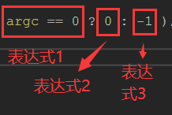
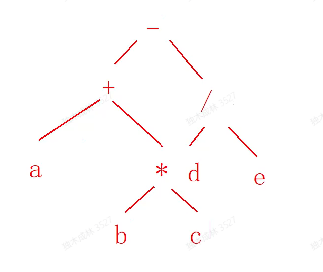

高低版本区别比较大


### 取模

### **取模 就是 jns 或者 有 a-qb 的  或者有  绝对值了  3种情况**

#### 当模值(除数)为变量时,无优化

```
int main(int argc, char* argv[])
{
   printf("%d\r\n",3 % argc );
   return 0;
}
反汇编代码:
mov     eax, 3
cdq
idiv    [esp+argc]
push    edx
push    offset aD       ; "%d\r\n"
call    sub_401020
add     esp, 8
```

#### 无符号数 模  2的整数次 幂

debug 版 没优化 release 会优化

```
int main(unsigned  int argc, char* argv[])
{
   printf("%d\r\n",argc % 2 );
   return 0;
}
反汇编代码:
mov     eax, [esp+argc]
and     eax, 1     ;取最低位
push    eax
push    offset aD       ; "%d\r\n"
call    sub_401020
分析:   取 %2 的值 其实没必要做除法,取最低位的值 其实就可以了,最低位是0,那么余数就是0,最低位是1,那么余数就是 1

同理推断:  2^2 就取 最低2位就够了, 2^n  取最低  n 位 就够了
int main(unsigned  int argc, char* argv[])
{
   printf("%d\r\n",argc % 8);
   return 0;
}
反汇编代码:
mov     eax, [esp+argc]
and     eax, 7      ;8 = 2^3   取低3位  111b  = 7
push    eax
push    offset aD       ; "%d\r\n"
call    sub_401020

注意: 上式 1 必须连续 ,否则 就是 and 不是取模  (即 1,3,7,.........., 2^(n-1) )

定式:   当 n 为 2的整数次幂 的常量是 
argc  %  n  的 反汇编代码为 

mov     eax, [esp+argc]
and     eax, n - 1      
push    eax


```

#### 无符号数  模  非2的整数次 幂

低版本无优化,高版本有优化

```
int main(unsigned  int argc, char* argv[])
{
   printf("%d\r\n",argc % 7 );
   return 0;
}
低版本(VC6.0) 汇编代码
mov     eax, [esp+argc]
xor       edx, edx
mov     ecx, 7
div        ecx
push    edx
push    offset aD       ; "%d\r\n"
call       sub_401020

高版本(VS2019) 
int main(int argc, char* argv[])
{
   printf("%d\r\n",argc % 7 );
   return 0;
}
反汇编代码:
mov     esi, [ebp+argc]
mov     eax, 92492493h
imul    esi
add     edx, esi
sar     edx, 2
mov     ecx, edx
shr     ecx, 1Fh
add     ecx, edx
; 获取 q,        a / 7     

lea     eax, ds:0[ecx*8]
sub     eax, ecx
;  qb,   q * 7

sub     esi, eax
; a - qb,     a - (a/b * b)

push    esi
push    offset _Format  ; "%d\r\n"
call    _printf


分析 :
a /  b  =  q ..  r
r = a - qb


```

#### 有符号数 模  2的整数次 幂

debug版 和 release 版都会优化

```
int main(int argc, char* argv[])
{
   printf("%d\r\n",argc % 8 );
   return 0;
}

                 mov     eax, [ebp+argc]
                 and     eax, 80000007h      ;保留符号和低3位 
                 jns     short loc_401037    ;如果是负数,中间需要填1,如果模是0,直接跳走
                 dec     eax
                 or      eax, 0FFFFFFF8h     ;低3位不变 , 中间填1
                 inc     eax
 loc_401037:                          
                push    eax
                 push    offset Format   ; "%d\r\n"
                 call    _printf

分析:  中间的  dec  和 inc 看着是没什么用,实际上是处理整除的情况(清掉高位的1)

无分支情况:
int main(int argc, char* argv[])
{
   printf("%d\r\n",argc % -8 );
   return 0;
}
反汇编代码:
;求绝对值,相当于b变成无符号取模再回填符号
mov     eax, [esp+argc]
cdq
xor     eax, edx
sub     eax, edx
;无符号取模
and     eax, 7
;还原符号位
xor     eax, edx       ;此时 edx仍然保留 eax 的符号位
sub     eax, edx

push    eax
push    offset aD       ; "%d\r\n"
call    sub_401030

分析:    余数的符号跟被除数相关,跟除数无关
当 B <  0  , B = 2^n    
A % B     =>  |A| % |B|    结果在回填 A 的符号  
and  A,n-1     ;  无符号取模
xor     eax, edx       ;回填A 的符号
sub     eax, edx
```

**无分支求绝对值**

**mov   eax   ,n**

**cdq**

**xor      eax    ,edx**

**sub     eax     ,edx**


分析: 

当 n 为正数时   dex 为 0  ,  异或  ,减0  ,eax 的值不变

当 n 为父数时   dex 为 -1 (FFFFFFFF) , eax 异或   (FFFFFFFF)  等于取反   , eax 减 dex  等于 +1  就相当于对eax求补


### 三目运算(条件表达式)

#### 基本原型

int main(int argc, char* argv[])

{

​    printf("%d\r\n", argc == 0 ? 0 : -1 );

​    return 0;

}



当表达式 2 或 3 不为常量,没有优化空间


反汇编代码:


mov     eax, [ebp+argc]

**neg**     eax                   ;  =>  0 -  eax    只有当eax 等于 0 是  cf 才不产生借位

**sbb**     eax, eax           ;  sbb    A,B   =>   A   =    A - B - CF


push    eax

push    offset Format   ; "%d\r\n"

call    _printf

分析:    neg    sbb 是一个很经典的组合,  间接造一个 0 和 -1  出来,便于后继的位运算

当  eax =  0   时 , **neg**     eax   ->   cf =  0      =>    **sbb**     eax, eax  ->   eax = eax - eax - cf = 0    

当  eax !=  0 时 ,  **neg**     eax   ->   cf =  1     =>    **sbb**     eax, eax  ->   eax = eax - eax - cf = -1    


注意:  如果 sbb 上面是 cmp , 也会产生 neg 一样的效果

```
int main(int argc, char* argv[])
{
    printf("%d\r\n", argc == 0 ? 32 : 48 );
    return 0;
}
反汇编代码:
mov   eax ,  argc
neg    eax
sbb    eax ,eax
add    eax, 48-32
add    eax,32
分析 :    
当   argc =  0;     到 sbb 之后   eax = 0;           add    eax, 48-32=>  eax = 0   
当   argc !=  0;     到 sbb 之后  eax = -1;         add    eax, 48-32=>  eax = 16
```

**三目运算无分支定式**

A ==0 ? B : C


mov  reg  ,   A

neg    reg

sub    reg  ,   reg

and    reg  ,   C - B

add    B


如果表达式不等      A !=0 ? B : C    

可以换成等式          A ==0 ? C : B

如果   是  A == n ?  B : C  可以在  neg 之前 加一条    sub  reg  , n

#### setxx 指令

经过     cmp  /  test / sub / add 等处理(影响标志)之后, 后面出现了   setxx   r8  指令  (设置8位寄存器的值为0或1) 

|      | 有符号 | 无符号 |
| ---- | ------ | ------ |
| 大于 | Greate | Above  |
| 小于 | Less   | Blow   |

```
cmp  eax,100
setge  cl
上式意思是   eax  跟100比较     如果大于等于(g   e)100 ,   cl=1   否则 cl = 0
setge  =>  set   +  g (Greate) + e (Equal)

xor  ecx ,ecx
cmp  eax,100
setge  cl
dec  ecx 

上式意思是   eax  跟100比较     如果大于等于(g   e)100 ,   ecx = 0   否则 ecx  = -1
```

```
#include <stdio.h>
int main(int argc, char* argv[])
{
   printf("%d\r\n",argc >= 100 ? 32 : 48);
   return 0;
}

反汇编代码:
xor     eax, eax
cmp     [ebp+argc], 64h      ; 跟100比较
setl      al                           ;如果小于 al = 1 否则 al = 0 
dec      eax                       ; 变成  0 和 -1
and      al, 0F0h              ; 0F0h 是 -16 
add      eax, 30h ;          ;加上 48
push    eax
push     offset Format   ; "%d\r\n"
call    _printf
```

#### cmovxx 指令

在**高版本**中:

经过     cmp  /  test / sub / add 等处理(影响标志)之后, 后面出现了  cmovxx   reg32 , reg32

A>= 100 ? 32 : 48


mov  eax , 32

mov  ecx , 48

cmp  A,100

cmovl  eax,ecx


上式意思是   ,eax = 32  ,ecx = 48 ,比较 A 和 100 的大小  ,如果小于 ,就把  eax = ecx  否则  值不变

```
int main(int argc, char* argv[])
{
    printf("%d\r\n", argc == 0 ? 0 : -1);
    return 0;
}
反汇编代码
mov     eax, [ebp+argc]
neg     eax
sbb     eax, eax
push    eax
push    offset _Format  ; "%d\r\n"
call    _printf
如果是 0 和 -1 就不会使用 cmovxx 指令 ,跟低版本一样

int main(int argc, char* argv[])
{
    printf("%d\r\n", argc == 0 ? 100 : -100 );
    return 0;
}
反汇编代码
push    ebp
mov     ebp, esp
cmp     [ebp+argc], 0
mov     ecx, 64h  
mov     eax, 0FFFFFF9Ch
cmovz   eax, ecx
push    eax
push    offset _Format  ; "%d\r\n"
call    _printf
```

### 常见优化方案

编译器的工作过程可以

分为几个阶段：

1.  预处理      :  除以 以 # 号开头的文件,对源码进行查找替换,得到的还是源码
2.   词法分析   : 运算符,表达式 ,生成表达式 树

例如:   计算一个表达式   " a + b * c - d / e "

最简单的方法是生成一个  表达式树  

            

中序遍历   :    a + b * c - d / e

先序遍历   :    - + a * b c / d e         (波兰式 : 前缀表达式,操作在前,操作树在后)

后序遍历  :     a b c * + d e / -


人类习惯的是 中序       

 c 和 汇编语言 习惯先序   (容易转成函数调用)

c 用函数调用来表达上式       sub(add (a mul (b,c) ),div(d,e) )


中国传统是 逆波兰表达式 ,操作数在前,操作符在后

1.  语法分析
2.  语义分析    :  转成流程图
3.  中间代码生成   : 把图换成语言再存储
4.  目标代码生成。 : 跟平台相关,生成机器指令

其中，优化的机会一般存在于中间代码生成和目标代码生成这两个阶段


**常见的与设备无关的优化方案有以下几种:**

\1. 常量折叠

\2. 常量传播

\3. 减少变量

\4. 公共表达式

\5. 复写传播

\6. 剪去不可达分支（剪支优化）

\7. 顺序语句代替分支

\8. 强度削弱

\9. 数学变换

\10. 代码外提

```
    unsigned  int u = 10;
    int  n = 20;

    printf("请输入2个整数,以空格分隔\r\n");
    scanf_s("%d %d", &u, &n);

    printf("%d\r\n", u % 16);
    printf("%d\r\n", u % 9);
    printf("%d\r\n", u % 2);

    printf("%d\r\n", n % 2);
    printf("%d\r\n", n % 11);
    printf("%d\r\n", n % 8);
    printf("%d\r\n", n % -4);

    printf("%d\r\n", n == 10 ? 6 : 5 );
    printf("%d\r\n", n == 10 ? 5 : 6);

    printf("%d\r\n", n >= 10 ? 10 : 20);
    printf("%d\r\n", n >= 10 ? 20 : 10);


.text:004010A0                 push    esi
.text:004010A1                 push    edi             ; ArgList
.text:004010A2                 push    offset Format   ; "请输入2个整数,以空格分隔\r\n"
.text:004010A7                 mov     dword ptr [ebp+Arglist], 0Ah
.text:004010AE                 mov     [ebp+var_8], 14h
.text:004010B5                 call    sub_401020
.text:004010BA                 lea     eax, [ebp+var_8]
.text:004010BD                 push    eax
.text:004010BE                 lea     eax, [ebp+Arglist]
.text:004010C1                 push    eax             ; Arglist
.text:004010C2                 push    offset aDD      ; "%d %d"
.text:004010C7                 call    sub_401050
.text:004010CC                 mov     eax, dword ptr [ebp+Arglist]
.text:004010CF                 and     eax, 0Fh
.text:004010D2                 push    eax             ; ArgList
.text:004010D3                 push    offset aD       ; "%d\r\n"
.text:004010D8                 call    sub_401020
.text:004010DD                 mov     ecx, dword ptr [ebp+Arglist]
.text:004010E0                 mov     eax, 38E38E39h
.text:004010E5                 mul     ecx
.text:004010E7                 shr     edx, 1
.text:004010E9                 lea     eax, [edx+edx*8]
.text:004010EC                 sub     ecx, eax
.text:004010EE                 push    ecx             ; ArgList
.text:004010EF                 push    offset aD       ; "%d\r\n"
.text:004010F4                 call    sub_401020
.text:004010F9                 mov     eax, dword ptr [ebp+Arglist]
.text:004010FC                 and     eax, 1
.text:004010FF                 push    eax             ; ArgList
.text:00401100                 push    offset aD       ; "%d\r\n"
.text:00401105                 call    sub_401020
.text:0040110A                 mov     eax, [ebp+var_8]
.text:0040110D                 and     eax, 80000001h
.text:00401112                 jns     short loc_401119
.text:00401114                 dec     eax
.text:00401115                 or      eax, 0FFFFFFFEh
.text:00401118                 inc     eax
.text:00401119
.text:00401119 loc_401119:                             ; CODE XREF: _main+82↑j
.text:00401119                 push    eax             ; ArgList
.text:0040111A                 push    offset aD       ; "%d\r\n"
.text:0040111F                 call    sub_401020
.text:00401124                 mov     ecx, [ebp+var_8]
.text:00401127                 mov     eax, 2E8BA2E9h
.text:0040112C                 imul    ecx
.text:0040112E                 sar     edx, 1
.text:00401130                 mov     eax, edx
.text:00401132                 shr     eax, 1Fh
.text:00401135                 add     eax, edx
.text:00401137                 imul    eax, 0Bh
.text:0040113A                 sub     ecx, eax
.text:0040113C                 push    ecx             ; ArgList
.text:0040113D                 push    offset aD       ; "%d\r\n"
.text:00401142                 call    sub_401020
.text:00401147                 mov     eax, [ebp+var_8]
.text:0040114A                 and     eax, 80000007h
.text:0040114F                 jns     short loc_401156
.text:00401151                 dec     eax
.text:00401152                 or      eax, 0FFFFFFF8h
.text:00401155                 inc     eax
.text:00401156
.text:00401156 loc_401156:                             ; CODE XREF: _main+BF↑j
.text:00401156                 push    eax             ; ArgList
.text:00401157                 push    offset aD       ; "%d\r\n"
.text:0040115C                 call    sub_401020
.text:00401161                 mov     eax, [ebp+var_8]
.text:00401164                 add     esp, 40h
.text:00401167                 cdq
.text:00401168                 xor     eax, edx
.text:0040116A                 sub     eax, edx
.text:0040116C                 and     eax, 3
.text:0040116F                 xor     eax, edx
.text:00401171                 sub     eax, edx
.text:00401173                 push    eax             ; ArgList
.text:00401174                 push    offset aD       ; "%d\r\n"
.text:00401179                 call    sub_401020
.text:0040117E                 xor     eax, eax
.text:00401180                 cmp     [ebp+var_8], 0Ah
.text:00401184                 setz    al
.text:00401187                 add     eax, 5
.text:0040118A                 push    eax             ; ArgList
.text:0040118B                 push    offset aD       ; "%d\r\n"
.text:00401190                 call    sub_401020
.text:00401195                 xor     eax, eax
.text:00401197                 cmp     [ebp+var_8], 0Ah
.text:0040119B                 setnz   al
.text:0040119E                 add     eax, 5
.text:004011A1                 push    eax             ; ArgList
.text:004011A2                 push    offset aD       ; "%d\r\n"
.text:004011A7                 call    sub_401020
.text:004011AC                 mov     esi, 0Ah
.text:004011B1                 mov     edi, 14h
.text:004011B6                 cmp     [ebp+var_8], esi
.text:004011B9                 mov     eax, edi
.text:004011BB                 cmovge  eax, esi
.text:004011BE                 push    eax             ; ArgList
.text:004011BF                 push    offset aD       ; "%d\r\n"
.text:004011C4                 call    sub_401020
.text:004011C9                 cmp     [ebp+var_8], esi
.text:004011CC                 cmovge  esi, edi
.text:004011CF                 push    esi             ; ArgList
.text:004011D0                 push    offset aD       ; "%d\r\n"
.text:004011D5                 call    sub_401020
.text:004011DA                 push    offset Command  ; "pause"
.text:004011DF                 call    ds:system
```

