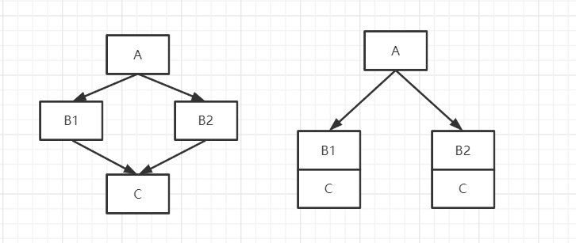
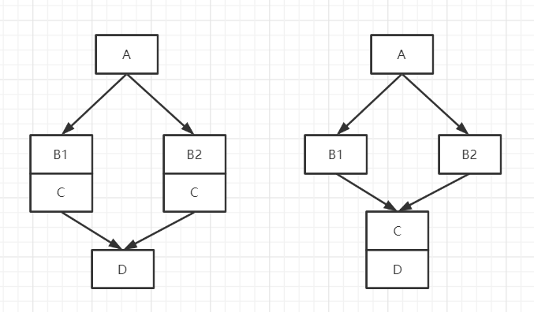

## 单分支

当常量为条件的时候会直接折叠,真条件会转为顺序语句,假条件整个if 全部删除

#### 单条件

```
int main(int argc, char* argv[])
{
      if(argc %  2== 0)
      {
         printf("偶数\r\n");
     }
      return 0;
}

反汇编代码:
mov     eax, [esp+argc]
and     eax, 80000001h
 jns     short loc_401010
dec     eax
or      eax, 0FFFFFFFEh
inc     eax
 loc_401010:                            
 jnz       short loc_40101F
 push    offset asc_407030 ; "偶数\r\n"
 call    sub_401030
add     esp, 4
loc_40101F:        
xor     eax, eax
retn

定式:
  jxx   IF_END
  .......
 IF_END :
还原要点:  看 jxx 反条件还原,因为 x86 语义(或机器语义) 跟  高级语义 是反着,
机器语义是满足条件则跳走,高级语言语义是满足条件则执行


int main(int argc, char* argv[])
{
   if(argc %  2 >= 100)
   {
      printf("偶数\r\n");
   }
   return 0;
}

反汇编代码:

	   mov     eax, [esp+argc]
	   and     eax, 80000001h
	   jns     short loc_401010
	   dec     eax
	   or      eax, 0FFFFFFFEh
	   inc     eax
loc_401010:                        ; CODE XREF: _main+9↑j
	   cmp     eax, 64h ; 'd'
	   jl      short loc_401022             ; jl 表示有符号,无符号是 jb 
	   push    offset asc_407030 ; "偶数\r\n"
	   call    sub_401030                       
	   add     esp, 4
           ;没有其他跳转,所以是单分支
loc_401022:                        ; CODE XREF: _main+13↑j
	   xor     eax, eax
	   retn

分析:
jl 小于,那么还原时应该是  >=


```

#### 多条件

注意: 高版本如果 多条件 情况下  ,如果 条件相互冲突 可能会 被优化成顺序条件 或者 优化无

```
int main(int argc, char* argv[])
{
    int n = 0;
    scanf("%d",&n);
   if(argc %  n > 100  &&  argc %  n <= 50 )
   {
      printf("偶数\r\n");
   }
   return 0;
}
低版本反汇编代码:
	 push    ecx
	 lea     eax, [esp+4+var_4]
	 mov     [esp+4+var_4], 0
	 push    eax
	 push    offset Format   ; "%d"
	 call    _scanf
	 mov     eax, [esp+0Ch+argc]
	 add     esp, 8
	 cdq
	 idiv    [esp+4+var_4]
	 cmp     edx, 64h ; 'd'
	 jle     short loc_40103B
	 cmp     edx, 32h ; '2'
	 jg      short loc_40103B
	 push    offset asc_408030 ; "偶数\r\n"
	 call    sub_401040
	 add     esp, 4
loc_40103B:                       ;iF_END      					
	 xor     eax, eax
	 pop     ecx
	 retn

分析:
定式:
       ...
  jl  iF_END
       ...
   jl  iF_END
        xxxx(代码块)
 iF_END
2个跳转都不满足   xxxx  才会执行, 即  第一个 jl  不满足 且 第二个 也不满足才执行

高版本发汇编代码:
lea     eax, [ebp+n]
mov     [ebp+n], 0
push    eax
push    offset _Format  ; "%d"
call    _scanf_s
分析:  因为    argc %  n > 100  &&  argc %  n <= 50   不可能同时实现,所以高版本会把if优化掉


```

```
int main(int argc, char* argv[])
{
    int n = 0;
    scanf("%d",&n);
   if(argc %  n > 100  ||  argc %  n <= 50 )
   {
      printf("偶数\r\n");
   }
   return 0;
}

反汇编代码:
      push    ecx
	lea     eax, [esp+4+var_4]
	mov     [esp+4+var_4], 0
	push    eax
	push    offset Format   ; "%d"
	call    _scanf
	mov     eax, [esp+0Ch+argc]
	add     esp, 8
	cdq
	idiv    [esp+4+var_4]
	cmp     edx, 64h ; 'd'
	jg      short loc_40102E    ; 能进   loc_40102E
	cmp     edx, 32h ; '2'
	jg      short loc_40103B      ;反条件能进   loc_40102E
loc_40102E:                            
	push    offset asc_408030 ; "偶数\r\n"
	call    sub_401040
	add     esp, 4
loc_40103B:                            ;  iF_END 
	xor     eax, eax
	pop     ecx
	retn
分析:  2个都不成立才不执行


```

## 双分支

定式:

  **jxx  ELSE_BEGIN**

  **IF_BEGIN:**

​           **.....**

​         **jmp   ELSE_BEGIN    ;无这个跳转是单分支,向上跳是循环,向下跳是双或多分支**

  **ELSE_BEGIN:**

​        **.....**

  **ELSE_END:**

```
int main(int argc, char* argv[])
{
    int n = 0;
    scanf("%d",&n);
   if(argc % n == 0 )
   {
      printf("偶数\r\n");
   }
   else
   {
     printf("奇数\r\n");
   }
   return 0;
}
debug 版反汇编代码
	 push    eax
	 push    offset aD       ; "%d"
	 call    _scanf
	 add     esp, 8
	 mov     eax, [ebp+argc]
	 cdq
	 idiv    [ebp+var_4]
	 test    edx, edx
	 jnz     short loc_40F9AA
	 push    offset Format   ; "偶数\r\n"
	 call    _printf
	 add     esp, 4
	 jmp     short loc_40F9B7     ;产生了 jmp,向下跳
loc_40F9AA:             ;ELSE_BEGIN:                   
	 push    offset asc_42201C ; "奇数\r\n"
	 call    _printf
	 add     esp, 4
loc_40F9B7:             ; ELSE_END:                      
	 xor     eax, eax

release反汇编代码:    会有优化(节点优化)
	 push    ecx
	 lea     eax, [esp+4+var_4]
	 mov     [esp+4+var_4], 0
	 push    eax
	 push    offset Format   ; "%d"
	 call    _scanf
	 mov     eax, [esp+0Ch+argc]
	 add     esp, 8
	 cdq
	 idiv    [esp+4+var_4]
	 test    edx, edx
	 jnz     short loc_401039
	 push    offset asc_408038 ; "偶数\r\n"
	 call    sub_401050
	 add     esp, 4
	 xor     eax, eax
	 pop     ecx
	 retn
loc_401039:                            
	 push    offset asc_408030 ; "奇数\r\n"
	 call    sub_401050
	 add     esp, 4
	 xor     eax, eax
	 pop     ecx
	 retn

分析: release 优化是以 速度优化为主, 所以 增加了节点而减少了路径 ,增加了代码体积,但是减少了跳转次数
```



但是如果增加节点的代价比较大,那么就不会这么优化,则可能出现另一种优化, 在无法减少路径的情况就会考虑减少节点,即 会把 B1 和 B2 的公共部分外提



```
int main(int argc, char* argv[])
{
    int n = 0;
    scanf("%d",&n);
   if(argc % n == 0 )
   {
      printf("偶数\r\n");
   }
   else
   {
     printf("奇数\r\n");
   }

   printf("hello world\r\n");
   printf("hello world\r\n");
   printf("hello world\r\n");
   printf("hello world\r\n");
   printf("hello world\r\n");
   printf("hello world\r\n");
   printf("hello world\r\n");
   printf("hello world\r\n");
   return 0;
}
反汇编代码;
	 push    ecx   ;这里使用了强度削弱的优化,ecx 是不需要保存的,这句起到了  sub  esp , 4 的作用,psush
                                ;指令才1字节,而sub 需要3个字节
	 lea     eax, [esp+4+var_4]
	 mov     [esp+4+var_4], 0
	 push    eax
	 push    offset Format   ; "%d"
	 call    _scanf
	 mov     eax, [esp+0Ch+argc]
	 add     esp, 8
	 cdq
	 idiv    [esp+4+var_4]
	 test    edx, edx
	 jnz     short loc_40102F
	 push    offset asc_408048 ; "偶数\r\n"
	 jmp     short loc_401034
loc_40102F:                            
	 push    offset asc_408040 ; "奇数\r\n"     ;只有push没法还原代码,因此肯定有外提的公共代码段
loc_401034:                            
	 call    sub_4010A0      ;外提的公共部分
	 add     esp, 4
	 push    offset aHelloWorld ; "hello world\r\n"
	 call    sub_4010A0
	 push    offset aHelloWorld ; "hello world\r\n"
	 call    sub_4010A0
	 push    offset aHelloWorld ; "hello world\r\n"
	 call    sub_4010A0
	 push    offset aHelloWorld ; "hello world\r\n"
	 call    sub_4010A0
	 push    offset aHelloWorld ; "hello world\r\n"
	 call    sub_4010A0
	 push    offset aHelloWorld ; "hello world\r\n"
	 call    sub_4010A0
	 push    offset aHelloWorld ; "hello world\r\n"
	 call    sub_4010A0
	 push    offset aHelloWorld ; "hello world\r\n"
	 call    sub_4010A0
	 xor     eax, eax
	 add     esp, 24h
	 retn
分析: 上式 还原的话可以看到 分支里面只有 push ,在不内联汇编的情况下,push 是无法还原的,所以肯定有外提的公共代码段,人工找到后,把外提的代码分别复制到各个分支里面,再还原
```

## 多分支

```
定式:
jxx   ELSE1_BEGIN
        ... 
       jmp   ELSE_END
ELSE1_BEGIN:
jxx   ELSE2_BEGIN 
         ... 
        jmp   ELSE_END
ELSE2_BEGIN:
jxx   ELSE_BEGIN 
        ... 
       jmp   ELSE_END
       .....
ELSE_BEGIN:
       ....
ELSE_END:
```

```
int main(int argc, char* argv[])
{
   int n = 0;
   scanf("%d",&n);
   if(argc % n == 0 )
   {
      printf("1\r\n");
   }
   else  if(argc % n == 2)
   {
     printf("2\r\n");
   }
   else  if(argc % n == 3)
   {
     printf("3\r\n");
   }
   else 
   {
     printf("4\r\n");
   }
   return 0;
}
反汇编代码:
	push    ecx
	lea     eax, [esp+4+var_4]
	mov     [esp+4+var_4], 0
	push    eax
	push    offset Format   ; "%d"
	call    _scanf
	mov     eax, [esp+0Ch+argc]
	add     esp, 8
	cdq
	idiv    [esp+4+var_4]
	test    edx, edx
	jnz     short loc_40102F
	push    offset a1      
	jmp     short loc_40104C
loc_40102F:                            
	cmp     edx, 2
	jnz     short loc_40103B
	push    offset a2       
	jmp     short loc_40104C
loc_40103B:                            
	cmp     edx, 3
	jnz     short loc_401047
	push    offset a3       
	jmp     short loc_40104C
loc_401047:                             
	push    offset a4       
loc_40104C:                                ; ELSE_END:                    						   
	call    sub_401070
	add     esp, 4
	xor     eax, eax
	add     esp, 0Ch
	retn
上面这种是防止优化后的代码外提的

int main(int argc, char* argv[])
{
   int n = 0;
   scanf("%d",&n);
   if(argc % n == 0 )
   {
      printf("0");
   }
   else  if(argc % n == 1)
   {
      printf("%d\r\n",argc,"1");
   }
   else  if(argc % n == 2)
   {
     printf("2\r\n");
   }
   else  if(argc % n == 3)
   {
     printf("%d\r\n",argc,"3");
   }
   else 
   {
     printf("4\r\n");
   }
   printf("hello world\r\n");
   printf("hello world\r\n");
   return 0;
}

反汇编代码:
	 
	 push    ecx
	 lea     eax, [esp+4+var_4]
	 mov     [esp+4+var_4], 0
	 push    eax
	 push    offset Format   ; "%d"
	 call    _scanf
	 mov     ecx, [esp+0Ch+argc]
	 add     esp, 8
	 mov     eax, ecx
	 cdq
	 idiv    [esp+4+var_4]
	 test    edx, edx
	 jnz     short loc_401031
	 push    offset a0       ; "0"
	 jmp     short loc_401076
loc_401031:                             ; CODE XREF: _main+28↑j
	 cmp     edx, 1
	 jnz     short loc_40104B
	 push    offset a1       ; "1"
	 push    ecx
	 push    offset aD       ; "%d\r\n"
	 call    sub_4010A0
	 add     esp, 0Ch
	 jmp     short loc_40107E
loc_40104B:                             ; CODE XREF: _main+34↑j
	 cmp     edx, 2
	 jnz     short loc_401057
	 push    offset a2       ; "2\r\n"
	 jmp     short loc_401076
loc_401057:                             ; CODE XREF: _main+4E↑j
	 cmp     edx, 3
	 jnz     short loc_401071
	 push    offset a3       ; "3"
	 push    ecx
	 push    offset aD       ; "%d\r\n"
	 call    sub_4010A0
	 add     esp, 0Ch
	 jmp     short loc_40107E
loc_401071:                            
	 push    offset a4       ; "4\r\n"
loc_401076:                            
	 call    sub_4010A0
	 add     esp, 4
loc_40107E:                             
	 push    offset aHelloWorld ; "hello world\r\n"
	 call    sub_4010A0
	 push    offset aHelloWorld ; "hello world\r\n"
	 call    sub_4010A0
	 xor     eax, eax
	 add     esp, 0Ch
	 retn
分析: 上面有的分支有的 跳   loc_40107E      有的跳      loc_401076    ,还原时发现 跳 loc_401076    的,push无法还原,说明有代码外提, ,在 loc_401076    拷贝到 跳转到 该地址的地方,在删除,会发现  loc_40107E      和   loc_401076     重叠了.说明他俩是一样,跳2个地方是等价的,在按 if  elseif   还原了
```

