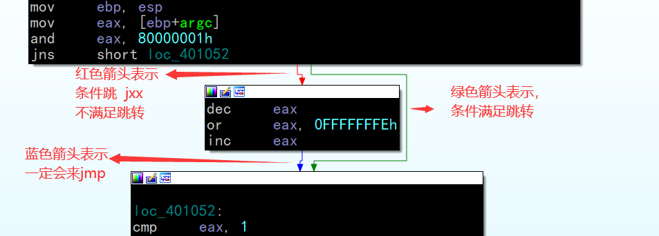
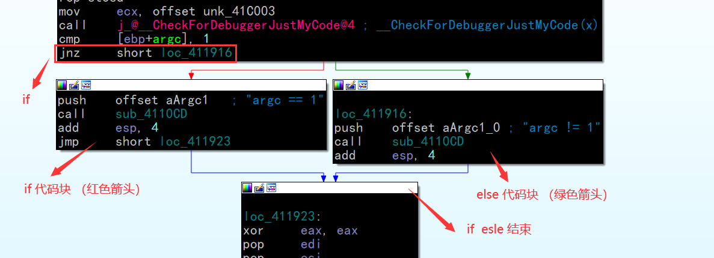
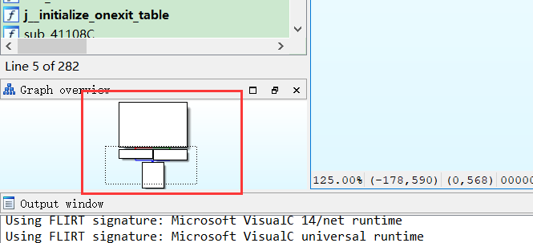
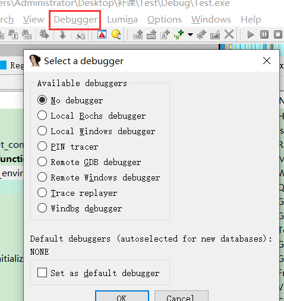

3种移位:

逻辑右移  >>

逻辑左移  <<

算术右移  >>      (针对有符号数,高位补符号)

计算机中的除法是整除 ,整除带来的问题就是取整

对于正数来说:  向下取整 

对于负数来说:  向上取整 

因此计算机除法是 **向0取整**

0011   2   >> 1   0001  => 1     向下取整

1101  -3  >> 1   1110  => -2   向下取整

从上面可以看出,右移是向下取整的

### 除法的优化

 除法优化的前提是除数是**常量**

**伪造出来的M 计算结果可能精度不够, 计算 除数是 精度 应该是小数点后 6个9再取整**

#### 计算除数:

根据 M值 来判断

 \1.  正数 y = 2^n / M

  \2.  负数 y = 2^n / (2^32 - M）

  \3.  溢出 y = 2^n / (2^32 + M）

#### 1.	除数为无符号2的幂/

​       在cpu中,移位的效率高于算术运算

​       对于无符号数来说因此右移可以取代除法,因为 2者的 取整方式一样, 

 **x / 2^n = x >> n**

#### 2.	除数为有符号2的幂

当除数为正数时,跟上面的一致,当x位负数时,取整方向发生了改变,因此需要把向下取整转为向上取整

下整转上整方式:   

1.  结果 + 1
2.  被除数 + 一个数   2^n - 1     (调大被除数,结果也会变大),

 例如:   -10 / 4  向上取整    =   (-10 + 3)  / 4  向下取整

 **x >= 0**

​         **x / 2^n = (x + 0) >> n**

  **x <  0**

​         **x / 2^n = (x + 2^n-1) >> n**

分支慢的原因是因为会断流水线

指令实现无分支   正数 + 0  ,负数 + 15

cdq  这条指令 只有 intel 的cpu才有,因此跨平台的不能用这条指令

**方法1:**

mov     eax, esi

cdq 

and     edx, 0Fh     

add     eax, edx

sar     eax, 4

**方法2:**

mov edx, eax

sar edx, 31  

and edx, 15    

add eax, edx

sar eax, 4

**方法3:**

mov edx, eax

sar edx, 31         //正数全0 ,负数全1

shr edx, 28        //  高位补0 

add eax, edx

sar eax, 4

#### 3.	除数为有符号-2的幂

   **x /  - 2^n  = - ( x / 2^n )**

#### 4.	无符号非2的幂1

编译器是先乘一个数,再来位移  ,这个数编译器会先算出来   **Magic  Numbe**

  **x  / y =  ( x \* M ) >> n**

**=>**

**y =  2^n  / M**

对于32位系统来说   n 是一个 大于 32 的值 ,64位系统来说就是  大于64的值

#### 5.	有符号非2的幂1      M >= 0

当  x  小于0  需要把向下取整转成向上取整, 而  向上取整  =  向下取整 + 1

所以  此公式  就变成了     x  >=  0 结果 +0  和   x< 0 结果 + 1 的问题

  **x >= 0** 

​          **x / y =  (x \* M) >> n  + 0**

  **x < 0**

​           **x / y =  ((x \* M) >> n) + 1**

**=>**

 **y = 2^n / M**

**这个公式是最常见的 ,基本占 70% ~ 80%**

无分支实现  正数 +0  负数 +1

mov  eax ,  edx

shr     eax , 1Fh        ;取符号位

add   eax ,  edx

#### 6.	有符号负非2的幂1       M < 0

此式跟上式的区别就是   Magic  Numbe  的最高位是 1

  **x  / -y = ( x \* -M ) >> n  + 0**

**=>**

 **y = 2^n / (2^32 - M）**

#### 7.	有符号非2的幂2     M < 0

取 Magic  Numbe 值较大,本来是正数  ,但是因为是有符号,在 乘 的时候被当成了负数  ,此时计算结果会变小(变成了负数),  因此需要加上  变小的差值 

**x >= 0** 

**x / y =  (((x \* M) >> 32) + x >>  n)  + 0**

**x < 0**

**x / y =  (((x \* M) >> 32) + x >>  n)  + 1**

**=>**

 **y = 2^n / M**

#### 8.	有符号负非2的幂2  M >= 0

求负数的时候,就会造成  M >=0  (对M求完补码溢出变正数) ,此时计算结果会变大,  因此需要减去  变大的差值 

**x >= 0**

**x / y =  (((x \* M) >> 32) - x >>  n)  + 0**

**x < 0**

**x / y =  (((x \* M) >> 32) - x >>  n)  + 1**

**=>**

**y = 2^n / (2^32 - M）**

#### 9.	无符号非2的幂2  

因为是无符号 Magic  Numbe   可能会是一个很大很大的数， 乘完之后结果放不下，因此需要 分2次乘 2此移

 公式：   mul    sub   shr   add    shr

**x / y = (x - (x \* M) >> 32) >> n1) + (x \* M >> 32) >> n2**

**=》**

**y = 2^n / (2^32 + M）**

#### 总结

当我们碰到一个除法，首先判断 除数是不是 2的 幂 ，不满足就看第二个公式（4.，5，6），还不满足就看  + （7） - （9） ，还不满足就看是否满足 乘  减  移 加 移 （9）

 int n1 = 0;

 int n2 = 0;

 int n3 = 0;

 scanf_s("%d %d", &n1, &n2);

 n3 = (n1 / 7) * (n2 / 8) + (n2 / 5);

 printf("%d\n", n3);	

反汇编代码：

lea     eax, [ebp+var_8]

mov     dword ptr [ebp+Arglist], 0

push    eax

lea     eax, [ebp+Arglist]

mov     [ebp+var_8], 0

push    eax             ; Arglist

push    offset aDD      ; "%d %d"

call    sub_401050

mov     eax, [ebp+var_8]

cdq

and     edx, 7

lea     edi, [edx+eax]

mov     eax, 92492493h

imul    dword ptr [ebp+Arglist]

mov     eax, 66666667h

sar     edi, 3                     ； edi = n2 / 8

add     edx, dword ptr [ebp+Arglist]

sar     edx, 2

mov     ecx, edx

shr     ecx, 1Fh

add     ecx, edx                ;  ecx =  n1/7

imul    [ebp+var_8]

imul    edi, ecx                ;   edi =  (n2 / 8) *  (n1/7)  

mov     eax, edx

shr     eax, 1Fh

add     edi, edx              ;   edi =  (n2 / 8) *  (n1/7)   + ( n2 * M >> n )   

add     eax, edi              ;   eax =  (n2 / 8) *  (n1/7)   + ( n2 * M >> n ) +1      

push    eax             

push    offset Format   ; "%d\n"

call    sub_401020

=>   edi =  (n2  / 8) *  (n1 / 7)   +( n2 * M >> 32 ) +1   

​                =>   (n2  / 8) *  (n1 / 7)   + ( ( n2 * M >> n ) +1  )

​                =>   (n2  /  8) *  ( n1 / 7 )   + ( n2 / 5 )

###   取模

一个数 % 该数进制的 n 次幂  =   取 该数的 低 n-1 位

#### 1.有符号模2的幂1  (新公式)

 **x >= 0**

**x % 2^n = x & 2^n - 1** 

**x < 0**              ；把负数变正数  （先加一个数再减去该数）

**x % 2^n = x + ( 2^n - 1 & 2^n - 1 ) - 2^n - 1** 

**例如：  -6 % 8 =  - 6 + 7 & 7  - 7**

无分支实现

mov eax, ecx

cdq

and edx, 2^n-1

add ecx, edx

and ecx, 2^n-1

sub ecx edx

​    

#### 2.模2的幂2   (旧公式)

jns 分支跳转

**if (x > 0)**

**x & 2^n - 1**

**else** 

**(x - 1)  |  ~(2^n - 1) + 1** 

上式无法实现无分支是因为 没有规律

#### 3.模非2的幂

 **x % y = z**  

 **=》**

**z = x - ( x  /  y )  \*  y**

### 识别操作数符号

跳转指令   Jxx          A  B  (无符号)   (L  G) 有符号       

乘法 除法                  有符号(i)            无符号(无)

加法减法不区分符号 (补码  把减法转成了 加法)

补码能取代减法   是因为  膜

膜最早出现再手表中:  代表可表示数的极限值     例如手表是  12

例如 要表示 3点 - 2点  =  1点   =》  3点  + （ 12点  -  2点 ） =  1点

即  一个数 -  另一个数  =   一个数  + （ 膜  - 另一个数 ）

补码是为了迅速求出     膜  - 另一个数 

### IDA的使用

#### 颜色条

表示整个软件的代码的分析结果

粉色：  表示导入表（这个节的代码不需要还原）

蓝色：  用户写的代码 （需要还原的代码）,IDA可能会把库函数识别成自己的代码

浅蓝色：库函数（静态链接进来的）（不需要还原）  

灰色：    数据

浅黄色：数据  ：全局数据区 

#### 图视图

方便快速看分支

一个方格代表一个代码块

当代码量很大的时候，可能无法画出图视图

上面的图可以看作  

if     elseif  为了方便看清结构，可以转化成  if  else  的嵌套，因为    if     elseif   的图视图 结构比较复杂不便于理解

#### 缩略图

快速了解代码结构

#### IDA调试

下断点：  选中行   F2      或者   F5 再 F2下断点

快捷键和 OD一样