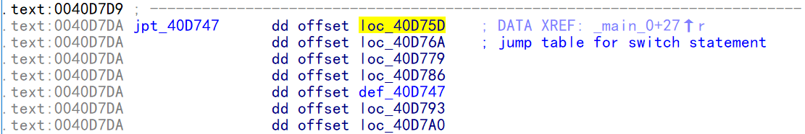
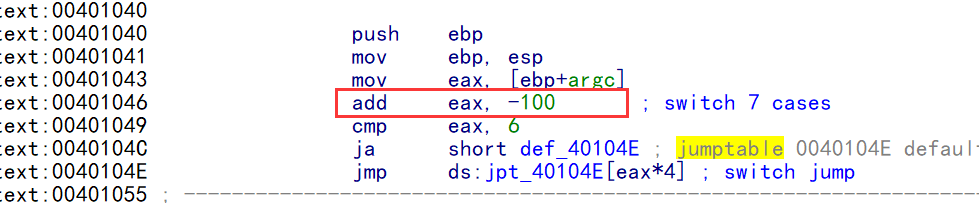
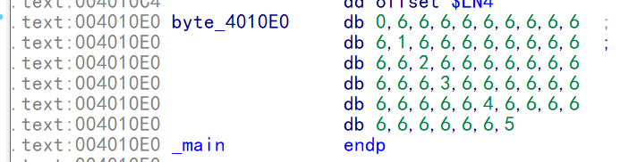
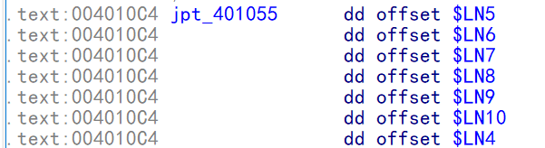
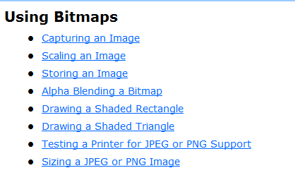
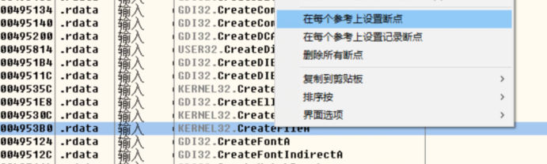
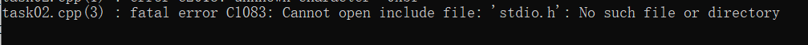
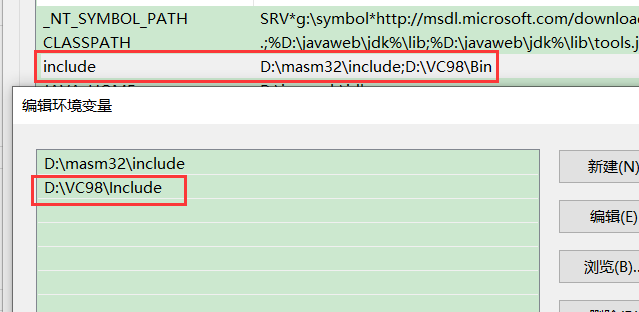
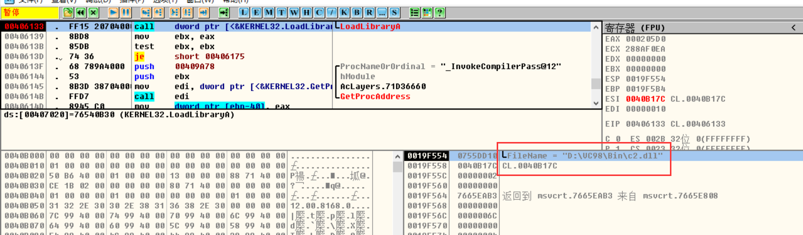
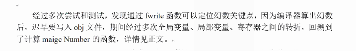

### case 分支不超过3个

当 case 分支少于3个,不会怎么优化,直接3个跳转,这种很像  if esle ,但是跟if esle 有区别,它跳转和跳转之间没有实质性代码,只有影响标志位代码

其次 它的代码结构分2部分


而且必须这么设计,因为break的原因

case种有break 就跳走,没有的话就顺着走,且不做判定,一旦把case 值:   插入  case  jxx 那么一旦遇到break,就要做比较

```
int main(int argc, char* argv[])
{
   switch(argc)
   {
   case 0:
       printf("case 0");
   case 1:
       printf("case 1");
       break;
   case 2:
       printf("case 2");
   }
   return 0;
}

反汇编代码:
debug 版
	 mov     eax, [ebp+argc]
	 mov     [ebp+var_4], eax
	 cmp     [ebp+var_4], 0
	 jz      short loc_401042
	 cmp     [ebp+var_4], 1
	 jz      short loc_40104F
	 cmp     [ebp+var_4], 2
	 jz      short loc_40105E
	 jmp     short loc_40106B
loc_401042:                            
	 push    offset Format   ; "case 0"
	 call    _printf
	 add     esp, 4
loc_40104F:                           
	 push    offset aCase1   ; "case 1"
	 call    _printf
	 add     esp, 4
	 jmp     short loc_40106B
loc_40105E:                             
	 push    offset aCase2   ; "case 2"
	 call    _printf
	 add     esp, 4
loc_40106B: 

分析:  遇到上面定式,就可以判断位 switch case ,还原时就可以无脑还原 ,jxx 比的是谁 case 就是 谁,而且需要看最后一个跳转,如果是  jne  或者  jnz 就是  default 或者 switch end , jne 或者 jnz后面的jmp 就是 case,否则如果是 jz 或者  je,后面的jmp 就是    default 或者 switch end 

release 版  有优化
	 mov     eax, [esp+argc]
	 sub     eax, 0
	 jz      short loc_40101F     ;case 0
	 dec     eax                              
	 jz      short loc_40102C     ;case  1  
	 dec     eax
	 jnz     short loc_401039      ;case  2 ,因为前面已经减1,再减1就是 减2
	 push    offset aCase2   ; "case 2"
	 call    sub_401040
	 add     esp, 4
	 xor     eax, eax
	 retn
loc_40101F:                             
	 push    offset aCase0   ; "case 0"
	 call    sub_401040
	 add     esp, 4
loc_40102C:                             
	 push    offset aCase1   ; "case 1"
	 call    sub_401040
	 add     esp, 4
loc_401039:    

分析: 有无default 的的区别 看把 break;   break 肯定不执行 default  的代码,  break肯定跳到 switch  end
看判断 跟 jnz 跳出的是不是同一个点,是的话就没有 default ,否则就是有
int main(int argc, char* argv[])
{
   switch(argc)
   {
   default: 
         printf("default:");
         break;
   case 0:
       printf("case 0");
   case 1:
       printf("case 1");
       break;
   case 2:
       printf("case 2");
   }
   return 0;
}
反汇编代码;
	 mov     eax, [esp+argc]
	 sub     eax, 0
	 jz      short loc_40102F      ; -0 = 0 CASE 0
	 dec     eax
	 jz      short loc_40103C      ; -1= 0 CASE 1
	 dec     eax
	 jz      short loc_40101F       ; -1-1= 0 CASE 2
        ;default  
	 push    offset aDefault ;   "default:"
	 call    sub_401050
	 add     esp, 4
	 xor     eax, eax
	 retn
loc_40101F:                             
	 push    offset aCase2   ; "case 2"
	 call    sub_401050
	 add     esp, 4
	 xor     eax, eax
	 retn
loc_40102F:                            
	 push    offset aCase0   ; "case 0"
	 call    sub_401050
	 add     esp, 4
loc_40103C:                            
	 push    offset aCase1   ; "case 1"
	 call    sub_401050
```

### case 分支大于3 且较为连续

会做表

```
int main(int argc, char* argv[])
{
   switch(argc)
   {
   default: 
         printf("default:");
         break;
   case 0:
       printf("case 0");
   case 1:
       printf("case 1");
       break;
   case 2:
       printf("case 2");
   case 3:
       printf("case 3");
   case 5:
       printf("case 5");
   case 6:
       printf("case 6");
   }
   printf("hello");
   printf("hello");
   return 0;
}
反汇编代码:
	 mov     eax, [ebp+argc]
	 mov     [ebp+var_4], eax
	 cmp     [ebp+var_4], 6              ;跟 case值的区间比较
	 ja      short def_40D747           ;这里就是 switch end 或者default,至于是否有 default 需要后面验证
	 mov     ecx, [ebp+var_4]
	 jmp     ds:jpt_40D747[ecx*4]      ; 寻址  数组首地址40D747
def_40D747:                           													 
	 push    offset Format   ; jumptable 0040D747 default case, case 4
	 call    _printf
	 add     esp, 4
	 jmp     short loc_40D7AD
loc_40D75D:                            
	 push    offset aCase0   ; jumptable 0040D747 case 0
	 call    _printf
	 add     esp, 4
loc_40D76A:                             ;
	 push    offset aCase1   ; jumptable 0040D747 case 1
	 call    _printf
	 add     esp, 4
	 jmp     short loc_40D7AD
loc_40D779:                             
	 push    offset aCase2   ; jumptable 0040D747 case 2
	 call    _printf
	 add     esp, 4
loc_40D786:                            
	 push    offset aCase3   ; jumptable 0040D747 case 3
	 call    _printf
	 add     esp, 4
loc_40D793:  
	 push    offset aCase5   ; jumptable 0040D747 case 5
	 call    _printf
	 add     esp, 4
loc_40D7A0:    
	 push    offset aCase6   ; jumptable 0040D747 case 6
	 call    _printf
	 add     esp, 4
loc_40D7AD:                            
	 push    offset aHello   ; "hello"
	 call    _printf
	 add     esp, 4
	 push    offset aHello   ; "hello"
	 call    _printf
```

分析:

先观察 eax 的取值范围(0-6),在跳转到调表 ,分别命名为 0 - 6,接着看每个case,看谁有 break,找到有break 的地方直接命名为  default ,接着论证 default 分时是否存在,  当把代码外提,内联都搞清楚以后如果 default 和 switch end 重合,说明没有  default  分支

**跳表的数组**




当如果  case 不是从 0 - 6 而是 100 -106 , 那么就会 先减去最小 case 值

```
int main(int argc, char* argv[])
{
    switch (argc)
    {
    default:
        printf("default:");
        break;
    case 100:
        printf("case 0");
    case 101:
        printf("case 1");
        break;
    case 102:
        printf("case 2");
    case 103:
        printf("case 3");
    case 105:
        printf("case 5");
    case 106:
        printf("case 6");
    }
    printf("hello");
    printf("hello");
    return 0;
}
反汇编代码:
```



### case分支大于3且不连续

case 的 值区间超过12 ,就会换方案

再按上面坐标 ,需要很多四字节来放地址 ,大部分都是 default ,所以不划算

```
int main(int argc, char* argv[])
{
    switch (argc)
    {
    default:
        printf("default:");
        break;
    case 100:
        printf("case 0");
    case 111:
        printf("case 1");
        break;
    case 122:
        printf("case 2");
    case 133:
        printf("case 3");
    case 145:
        printf("case 5");
    case 156:
        printf("case 6");
    }
    printf("hello");
    printf("hello");
    return 0;
}

反汇编代码:
	 push    ebp
	 mov     ebp, esp
	 mov     eax, [ebp+argc]
	 add     eax, 0FFFFFF9Ch ; switch 57 cases
	 cmp     eax, 38h
	 ja      short $LN4     
	 movzx   eax, ds:byte_4010E0[eax]     ;第一次寻址
	 jmp     ds:jpt_401055[eax*4]                ;  ;第二次寻址

$LN5:                                   
	 push    offset _Format  ; jumptable 00401055 case 100
	 call    _printf
	 add     esp, 4
$LN6:                                  
	 mov     eax, offset aCase1 ; jumptable 00401055 case 111
	 jmp     short loc_4010A3
$LN7:                               
	 push    offset aCase2   ; jumptable 00401055 case 122
	 call    _printf
	 add     esp, 4

$LN8:                                
	 push    offset aCase3   ; jumptable 00401055 case 133
	 call    _printf
	 add     esp, 4
$LN9:                                   
	 push    offset aCase5   ; jumptable 00401055 case 145
	 call    _printf
	 add     esp, 4
$LN10:                                 
	 mov     eax, offset aCase6 ; jumptable 00401055 case 156
	 jmp     short loc_4010A3
$LN4:         
	 mov     eax, offset aDefault ; 
loc_4010A3:                         
	 push    eax             ; _Format
	 call    _printf
	 push    offset aHello   ; "hello"
	 call    _printf
	 push    offset aHello   ; "hello"
	 call    _printf
```

分析:  采用二次寻址来方式 来获取跳转地址

先用 一个 int 数组 保存 case 的 跳转坐标 ,在用一个char 数组  保存  每个 case 区间值 跳转 的 坐标 在坐标数组的索引, 访问时  现根据  索引数组 拿索引,在 把索引转 整形 到  坐标数组拿对应  坐标,再跳转


说明  case 的区间是  100  -  156

对应的下标索引表



因为大部分  是 default ,所以 6对应的   derault 跳转的地址  ,  然后 其他 非 6 值 表示  case的的值

例如 0   表示  100 +0 = 100 => case 100   表示  坐标表索引为0的坐标就是 case100 跳转的坐标  ,       1=> 100 +11 = 111 => case  111    表示  坐标表索引为1的坐标就是 case111 跳转的坐标  ,  2 => 100 + 22 => case 122     表示  坐标表索引为2的坐标就是 case122 跳转的坐标, 100表示 case 最小值 , 后面加的值表示在数组中的索引

对应的地址表:




带位图的位图保存方式     **CreateCompatibleBitmap** 




先用一个数组保存 颜色种类  (调色板),在用另一个 char 数组 保存每个 坐标 对应的 颜色在 颜色数组的下标,这样就只需要一个 char 数组就可以了,这样就不需要用  int 数组 , 因此可以节省大量空间 ,但缺点就是需要2次 数组寻址,需要先在坐标数组 取出   对应颜色的下标  转成  整形 ,在根据下标在 颜色数组取出对应的颜色 ,而且  颜色种类不能超过  256种

### 混合方案

switch   是一个多分支的机器优化方案,优化的时候视为各个分支节点命中率均等,且必须是整形 或 类整形.不能是区间和浮点,

```
int main(int argc, char* argv[])
{
    switch (argc)
    {
    default:
        printf("default:");
        break;
case 100:
        printf("case 0");
case 200:
        printf("case 0");
case 300:
        printf("case 0");
case 400:
        printf("case 0");
case 500:
        printf("case 0");
case 1100:
        printf("case 0");
case 2111:
        printf("case 1");
        break;
 case 3122:
        printf("case 2");
case 4133:
        printf("case 3");
case 5545:
        printf("case 5");
case 6656:
        printf("case 6");
    }
    printf("hello");
    printf("hello");
    return 0;
}

编译器优化时,  使用 平衡比较数  来优化   会先对  csae 的值进行排序

100      200      300     400     500     1100    2111     3122     4133    5545     6656

然后先比 中间值    1100  
如果 等于 直接走     
如果  小于    在 跟左边 比较  ,跟左边比较 是也会 先跟中间值比较
如果   大于    在 跟到边 比较  ,跟右边比较 是也会 先跟中间值比较
一直递归比较值回到 一边值 满足上面 3种情况之一 ,就采用上面 的 对应的  优化方案 
                                                                1100
                                   <                             =                                  >
                                  300                                                              4133    
     <                            =                        >             <                            =                          >  
=100, =200                              =400,=500   =2111, =3122                                    =5545  ,=6656 

这种方案还原 直接找等于 就行了 ,大于小于 都是引导  ,等于的值 就是 case值
比较大于,小于,等于 2个跳转就够了,因此上式的特征就是很多 2跳在一起 ,其中 je 肯定有, 另一个 jg 或 jl 之一
```

### 周末作业

1.  GreenVPN 对配置文件进行了加密 分析,解析出解密算法,并用高级语言还原出源码,并解密出远程服务器信息相关的密文。

思路:   既然是对配置文件信息解密,那么肯定会先读取配置文件,再对配置文件的内容 进行 解密

步骤:  

先通过OD 打开 可执行文件,在  careteFile  api上设置断点



获取缓冲区大小


对缓冲区字符进行转义


因此可以推测这块就是解密算法


直接跑完这段断码.可以发现 配置文件已经解密了


所以解密算法是

```
00407704  |> /8A11          /mov     dl, byte ptr [ecx]
00407706  |. |80F2 BD       |xor     dl, 0BD
00407709  |. |80C2 69       |add     dl, 69
0040770C  |. |8811          |mov     byte ptr [ecx], dl
0040770E  |. |41            |inc     ecx
0040770F  |. |48            |dec     eax
00407710  |.^\75 F2         \jnz     short 00407704
```

1.  解密编译器求幻数  

C2.DLL

这个dll 是通过  loadlibrary 加载的

 

调试方法:   用 OD 打开   CL.EXE


然后在 loadlibrary api上下断点

第二次断下来的时候就是 C2.DLL




解决不认识     stdio.h  ,配置环境变量



解决字符问题:   用  vc6.0 写程序,不要用vs2019


样本中关键算法(文件偏移5FACE处)。




```
1075EACE    83EC 08         sub     esp, 8
1075EAD1    83F9 03         cmp     ecx, 3
1075EAD4    894C24 04       mov     dword ptr [esp+4], ecx
1075EAD8    7C 10           jl      short 1075EAEA
1075EADA    83F9 0D         cmp     ecx, 0D
1075EADD    73 0B           jnb     short 1075EAEA
1075EADF    8D04CD D8E07A10 lea     eax, dword ptr [ecx*8+107AE0D8]
1075EAE6    83C4 08         add     esp, 8
1075EAE9    C3              retn
//算法开始
1075EAEA    8BC1            mov     eax, ecx
1075EAEC    53              push    ebx
1075EAED    55              push    ebp
1075EAEE    56              push    esi
1075EAEF    99              cdq
1075EAF0    57              push    edi
1075EAF1    8BF1            mov     esi, ecx
1075EAF3    8BF8            mov     edi, eax
1075EAF5    BB 00000080     mov     ebx, 80000000
1075EAFA    C1EE 1F         shr     esi, 1F
1075EAFD    33FA            xor     edi, edx
1075EAFF    81EE 00000080   sub     esi, 80000000
1075EB05    2BFA            sub     edi, edx
1075EB07    8BC6            mov     eax, esi
1075EB09    33D2            xor     edx, edx
1075EB0B    C74424 10 1F000>mov     dword ptr [esp+10], 1F
1075EB13    F7F7            div     edi
1075EB15    B8 00000080     mov     eax, 80000000
1075EB1A    2BF2            sub     esi, edx
1075EB1C    33D2            xor     edx, edx
1075EB1E    4E              dec     esi
1075EB1F    F7F6            div     esi
1075EB21    33D2            xor     edx, edx
1075EB23    8BE8            mov     ebp, eax
1075EB25    0FAFC6          imul    eax, esi
1075EB28    2BD8            sub     ebx, eax
1075EB2A    B8 00000080     mov     eax, 80000000
1075EB2F    F7F7            div     edi
1075EB31    BA 00000080     mov     edx, 80000000
1075EB36    8BC8            mov     ecx, eax
1075EB38    0FAFC7          imul    eax, edi
1075EB3B    2BD0            sub     edx, eax
1075EB3D    EB 08           jmp     short 1075EB47
1075EB3F    8BC7            mov     eax, edi
1075EB41    2BC2            sub     eax, edx
1075EB43    3BE8            cmp     ebp, eax
1075EB45    73 22           jnb     short 1075EB69
1075EB47    8B4424 10       mov     eax, dword ptr [esp+10]
1075EB4B    03DB            add     ebx, ebx
1075EB4D    40              inc     eax
1075EB4E    03ED            add     ebp, ebp
1075EB50    3BDE            cmp     ebx, esi
1075EB52    894424 10       mov     dword ptr [esp+10], eax
1075EB56    0F83 AB080300   jnb     1078F407
1075EB5C    03D2            add     edx, edx
1075EB5E    03C9            add     ecx, ecx
1075EB60    3BD7            cmp     edx, edi
1075EB62  ^ 72 DB           jb      short 1075EB3F
1075EB64    41              inc     ecx
1075EB65    2BD7            sub     edx, edi
1075EB67  ^ EB D6           jmp     short 1075EB3F
1075EB69    0F84 A0080300   je      1078F40F
1075EB6F    8D41 01         lea     eax, dword ptr [ecx+1]
//算法结束
1075EB72    8B4C24 14       mov     ecx, dword ptr [esp+14]
1075EB76    5F              pop     edi
1075EB77    5E              pop     esi
1075EB78    5D              pop     ebp
1075EB79    A3 90F07910     mov     dword ptr [1079F090], eax
1075EB7E    85C9            test    ecx, ecx
1075EB80    5B              pop     ebx
1075EB81    0F8C 95080300   jl      1078F41C
1075EB87    8B4C24 00       mov     ecx, dword ptr [esp]
1075EB8B    B8 90F07910     mov     eax, 1079F090
1075EB90    83C1 E0         add     ecx, -20
1075EB93    890D 94F07910   mov     dword ptr [1079F094], ecx
1075EB99    83C4 08         add     esp, 8
1075EB9C    C3              retn

```

自己找 算法的方法:



```
// CLProject.cpp : 此文件包含 "main" 函数。程序执行将在此处开始并结束。
//

#include <stdio.h>
#include <stdlib.h>

int g_nExp = 0; //指数
int g_nMagicNumber = 0; //幻数

int Test(int Divisor) {
    
//.text:1075EACE                 sub     esp, 8
    int ecx = Divisor;
//.text:1075EAD1                 cmp     ecx, 3
//.text:1075EAD4                 mov     [esp+8+var_4], ecx
//.text:1075EAD8                 jl      short loc_1075EAEA
//.text:1075EADA                 cmp     ecx, 13
//.text:1075EADD                 jnb     short loc_1075EAEA
    if (ecx >= 3 && ecx < 13) {
    //.text:1075EADF                 lea     eax, dword_107AE0D8[ecx*8]
    //.text:1075EAE6                 add     esp, 8
    //.text:1075EAE9                 retn

        printf("需要查表\r\n");
        return 0;
    }
//.text:1075EAEA loc_1075EAEA:                           
//.text:1075EAEA                                         
//.text:1075EAEA                 mov     eax, ecx
//.text:1075EAEC                 push    ebx
//.text:1075EAED                 push    ebp
//.text:1075EAEE                 push    esi
//.text:1075EAEF                 cdq                ;流水线优化的代码,可以后提                
//.text:1075EAF0                 push    edi
//.text:1075EAF1                 mov     esi, ecx
//.text:1075EAF3                 mov     edi, eax
//.text:1075EAF5                 mov     ebx, 80000000h
    int eax = ecx;
    unsigned int esi = ecx;
    int edi = eax;
    unsigned int ebx = 0x80000000;
//.text:1075EAFA                 shr     esi, 1Fh
    esi = esi >> 31; //能这么移说明它是无符号的
//                               cdq                        ;流水线优化的代码可以提到这里
//.text:1075EAFD                 xor     edi, edx
//.text:1075EB05                 sub     edi, edx           ;流水线优化的代码
    edi = abs(eax); //绝对值
//.text:1075EAFF                 sub     esi, 80000000h     ;流水线优化的代码
    esi = esi - 0x80000000;

//.text:1075EB0B                 mov     [esp+18h+nExp], 1Fh
    int nExp = 31;

//.text:1075EB07                 mov     eax, esi ;两处流水线优化,调整到这里
//.text:1075EB09                 xor     edx, edx
//.text:1075EB13                 div     edi
//.text:1075EB1A                 sub     esi, edx
//.text:1075EB1E                 dec     esi
    esi = esi - esi % edi - 1;

//.text:1075EB15                 mov     eax, 80000000h
//.text:1075EB1F                 div     esi
//.text:1075EB21                 xor     edx, edx
//.text:1075EB23                 mov     ebp, eax
    unsigned int ebp = 0x80000000 / esi;
//.text:1075EB25                 imul    eax, esi
//.text:1075EB28                 sub     ebx, eax
    ebx = ebx - ebp * esi  ;
//.text:1075EB2A                 mov     eax, 80000000h
//.text:1075EB1C                 xor     edx, edx
//.text:1075EB2F                 div     edi
//.text:1075EB36                 mov     ecx, eax
    ecx = 0x80000000 / edi;
//.text:1075EB38                 imul    eax, edi
//.text:1075EB31                 mov     edx, 80000000h
//.text:1075EB3B                 sub     edx, eax
    int edx = 0x80000000 - ecx * edi;
//.text:1075EB3D                 jmp     short LOOP_BEGIN2 ;直接跳到循环体内了
//.text:1075EB3F ; ---------------------------------------------------------------------------
//.text:1075EB3F
//.text:1075EB3F LOOP_BEGIN://;这里相当于第一次不执行,后续循环再执行,将EB3F的代码挪到调用的地方,这块就不存在了
//.text:1075EB3F                 mov     eax, edi
//.text:1075EB41                 sub     eax, edx
//.text:1075EB43                 cmp     ebp, eax
//.text:1075EB45                 jnb     short loc_1075EB69 
    
//.text:1075EB3F                
    do {

        //.text:1075EB47
        //.text:1075EB47 LOOP_BEGIN2:                           
        //.text:1075EB47                                         
        //.text:1075EB47                 mov     eax, [esp+18h+nExp]
        //.text:1075EB4D                 inc     eax
        eax = nExp + 1;
        //.text:1075EB4B                 add     ebx, ebx
        ebx = ebx * 2;
        //.text:1075EB4E                 add     ebp, ebp
        ebp = ebp * 2;

        //.text:1075EB52                 mov     [esp+18h+nExp], eax ;这句可以提到上面,就相当于nExp++;
        nExp = eax;
        //.text:1075EB50                 cmp     ebx, esi
        //.text:1075EB56                 //jnb     loc_1078F407  改为 jb loc_1075EB5C

        //;这里是跳到外部游离代码处,把游离代码贴回来后就要修改条件,jnb 跳到游离代码,就要改为jb 跳到下面的地方 loc_1075EB5C
        // 之前是不小于则跳到游离代码,现在改为小于则跳到原先下面的代码,也就是不小于的话不跳,照常执行游离代码

        if(ebx >= esi){
            //.text:1078F407 loc_1078F407 :                     ;把游离代码贴回来
            //.text : 1078F407                 inc     ebp
            ebp++;
            //.text : 1078F408                 sub     ebx, esi
            ebx = ebx - esi;
            //.text : 1078F40A                 jmp     loc_1075EB5C ;这一句就没用了

        }

        //.text:1075EB5C loc_1075EB5C:                           
        //.text:1075EB5C                 add     edx, edx
        edx = edx * 2;
        //.text:1075EB5E                 add     ecx, ecx
        ecx = ecx * 2;
        //.text:1075EB60                 cmp     edx, edi
        //.text:1075EB62                 jb      short LOOP_BEGIN ?
        if(edx < edi ){
            //可以把EB3F的代码搬到这里来,jb 还原为if ,成立就跳到这里
            //.text:1075EB3F                 mov     eax, edi
            //.text:1075EB41                 sub     eax, edx
            eax = edi - edx;
            //.text:1075EB43                 cmp     ebp, eax
            //.text:1075EB45                 jnb     short loc_1075EB69  ;不小于还原为等于,但由于EB69出还有个jnz所以只能是大于了
            if (ebp > eax) {
                break;
            }
            continue;
        }


        //.text:1075EB64                 inc     ecx
        ecx++;
        //.text:1075EB65                 sub     edx, edi
        edx = edx - edi;
        //EB3F的代码
        //.text:1075EB3F                 mov     eax, edi
        eax = edi;
        //.text:1075EB41                 sub     eax, edx
        eax = eax - edx; //?
        //.text:1075EB43                 cmp     ebp, eax
        //.text:1075EB45                 jnb     short loc_1075EB69 
        if (ebp < eax) {
            //.text:1075EB67                 jmp     short LOOP_BEGIN   ;
               //可以把EB3F的代码搬到这里来,jb 还原为if ,成立就跳到这里
            //.text:1075EB3F                 mov     eax, edi
            //.text:1075EB41                 sub     eax, edx
            eax = edi - edx;
            //.text:1075EB43                 cmp     ebp, eax
            //.text:1075EB45                 jnb     short loc_1075EB69  ;不小于还原为等于,但由于EB69出还有个jnz所以只能是大于了
            if (ebp > eax) {
                break;
            }
            continue;
        }

//.text:1075EB69 loc_1075EB69:                          
//.text:1075EB69                 jnz      LOOPEND;  jz      loc_1078F40F 满足条件则执行,改为不满足条件跳下面的代码
        if(ebp>eax){
            break;
        }
        //外提代码贴回来
        //.text:1078F40F loc_1078F40F:                          
        //.text:1078F40F                 test    ebx, ebx
        //.text:1078F411                 jz      LOOP_BEGIN2
        if (ebx != 0) { //避免每次continue检查ebx,所以直接写为死循环,然后判断ebx
            break;
        }
    } while (1);


//.text:1075EB6F
//.text:1075EB6F LOOPEND:                           
//.text:1075EB6F                 lea     eax, [ecx+1]
    eax = ecx + 1;
//.text:1075EB72                 mov     ecx, [esp+18h+var_4]
    ecx = Divisor;
//.text:1075EB76                 pop     edi
//.text:1075EB77                 pop     esi
//.text:1075EB78                 pop     ebp
//.text:1075EB79                 mov     ds:dword_1079F090, eax
    g_nMagicNumber = eax;
//.text:1075EB7E                 test    ecx, ecx
//.text:1075EB80                 pop     ebx
//.text:1075EB81                 jnl      loc_1075EB87 ;同样修改一下,满足条件跳下面的代码,不满足则执行游离代码
    if(ecx < 0){
    //游离代码
    // .text:1078F41C loc_1078F41C:                           
    //.text:1078F41C                 neg     eax
    //.text:1078F41E                 mov     ds:dword_1079F090, eax
        g_nMagicNumber = -eax;
    //.text:1078F423                 jmp     loc_1075EB87
    }
//.text:1075EB87
//.text:1075EB87 loc_1075EB87:                          
//.text:1075EB87                 mov     ecx, [esp+8+nExp] ;局部指数变量
//.text:1075EB8B                 mov     eax, offset dword_1079F090
//.text:1075EB90                 add     ecx, -32  ;指数 ,因为指数起步加32,所以要减去32,把剩下的返回出去
//.text:1075EB93                 mov     ds:dword_1079F094, ecx ;
    g_nExp = nExp - 32;
//.text:1075EB99                 add     esp, 8
//.text:1075EB9C                 retn
//.text:1075EB9C sub_1075EACE    endp
    return g_nMagicNumber;
}


int main(int argc)
{

    Test(-54321);
    printf("%08x ,Exp:%d", g_nMagicNumber,g_nExp);

    return 0;
}
```

