### 全局变量

可以通过寻址和存储地方可以分辨出来

全局变量有一个特点:他的地址肯定命中在 PE结构中 节表所以描述的区域中

未初始化数据地址有几种形态:

1.  在未初始化节,不同的编译器,对未初始化节的命名不一样
2.  在已初始化节,但是在文件对应的文件大小对应映射的内存大小以外的地方
3.  无文件映射节 (PE的节可以没有文件映射,节对应的文件映射地址和大小位0),未初始化节可以省空间     

#### 非静态全局           

```
int g_nTest = 0x87654091
int main(int argc, char* argv[])
{  
    return g_nTest;
}
反汇编代码:
DEBUG 版 
0040D718   mov         eax,[g_nTest (00424d8c)]
分析: 可以看到 
通过对全局变量的寻址,我们可以看到, 他的地址是 [ 绝对地址 ] ,即[ 立即数 ],数组首地址也是立即数,或者有一个寄存器间接寻址,但是寄存器有保存的是一个全局的地址
```

release 版

mov     eax, **dword_406030**


```
int g_nTest[20000];
int main(int argc, char* argv[])
{   
    return g_nTest[5];
}
反汇编代码:
mov     eax, dword_4084D4
```

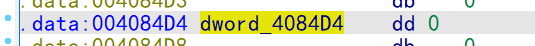


可以看到内存大小远大于文件大小,多出来的部分就是未初始化数据


很多壳会用到这招,预留空间用的,用来保存解压数据,代码运行时把文件数据拷贝进对堆,,对在数据解压到内存中,一个壳的工作就完成了

数组的值是全局的信息排列,进函数的时候再把全局的数据复制到局部空间,这样可以省代码

#### 静态全局

如果是静态全局,他是编译器检查,看有没有跨文件访问,如果跨文件访问,编译时就直接报错,逆向时对于全局静态变量只能酌情处理,愿意给静态就给,不愿意给就不给

```
static int g_nTest = 0x87654091;
int main(int argc, char* argv[])
{   
    return g_nTest;
}
```

#### const 全局变量

如果是const  就在   rdata 里面,但是有时候编辑器会把他放到  text 节 里面,由链接器决定 

```
const char g_szMsg[] = "Hello";
int main(int argc, char* argv[])
{   
    return strlen(g_szMsg);
}

反汇编代码
push    edi
mov     edi, offset aHello ; "Hello"
or      ecx, 0FFFFFFFFh
xor     eax, eax
repne scasb
not     ecx
dec     ecx
pop     edi
mov     eax, ecx
```


#### 带初始化功能的全局

高低版本有区别

```
int GetInt()
{
  return 0x87654091;
}

int g_nTest = GetInt();
int main(int argc, char* argv[])
{   
    return g_nTest;
}
反汇编
mov     eax, dword_4084C0
```

此时可以看到 ,变量的值为 0

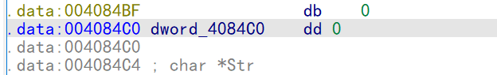

但是运行的时候又不是0值

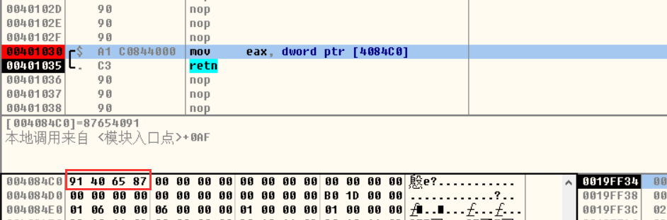

重新运行 


发现此时是0 ,在改地址下一个内存写入断点

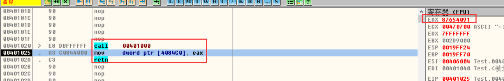

可以看出, 该全局变量是函数 的 返回值,所以确定该全局变量的值是由函数初始化的


在非调试的环境下

通过栈窗口追踪 变量的初始化过程 可以发现

E2 调  E1 函数 ,  E1 再调我们的初始化函数,把返回值写到全局变量

他实际上有一层代理


为什么要E1 呢 ,因为函数指针得统一是无参无返回值的,但是我们写的函数不一定能做到无参无返回值,因此要处理这个问题,需要包一层,由无参无返回值的函数调用一下我们的函数就行了,这样可以做到统一接口


但是这样应该包一层就够了,为啥还要 E2 呢,因为每一层职责不同

E2其实是为 C++ 准备的 ,c++的全局对象需要激活构造函数,  这时候 E1 负责传递this指针调构造,但是全局对象还需要析构,因此  E2 还得 调 E3 ,E3负责调析构函数,在main函数执行完触发


但是优化后,如果函数比较简单,可能被优化调,就只看到一层


通过IDA 怎么看呢

**正面看**


我们知道运行时这个值会变,说明有其他地方改这个值,到main函数的调用方

找到  cinit

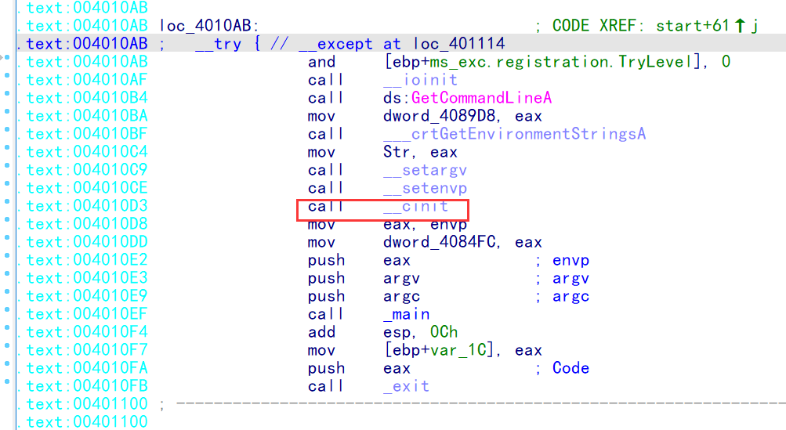

再进去找第二个


点击2个值中的一个

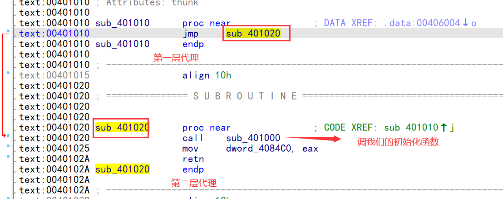


**简单方法**


改变量被2处引用   w 代表写  r 代表读,直接点击写的函数


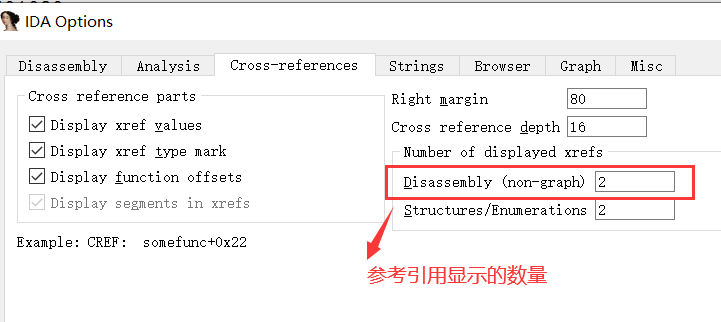

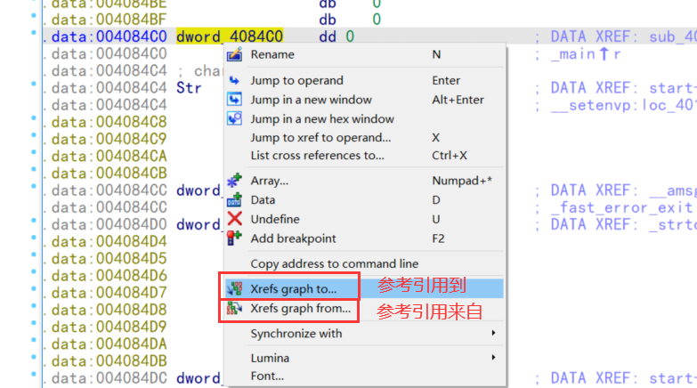

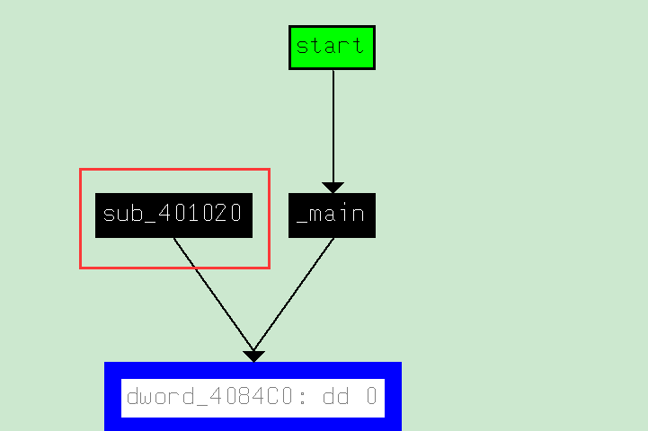


可以看函数的规模,即函数或变量的调用关系


粉红的表示导入表命中,青色表示被识别出来特征


最复杂的是操作系统的实现代码


```
int GetInt(int m,int n)
{
    return 0x87654091+m*n;
}
int g_nTest = GetInt(5,6);
int main(int argc, char* argv[])
{
    return g_nTest;
}
高版本:
mov     eax, ds:?g_nTest@@3HA ; int g_nTest
```

如果函数比较简单,高版本会内联

可以看到值已经出来了


vs 内联优化选项

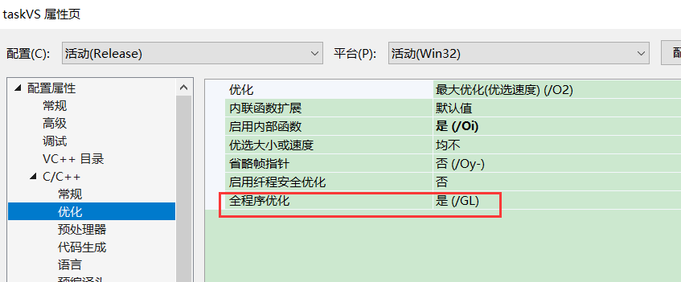

全程优化就是跨函数优化,即常量传播,折叠等优化可以跨函数了 ,只能在函数特别简单时才能优化

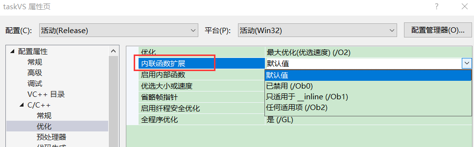

0b0  禁用内联,内联关键字会失效       debug版默认值

0b1  只有写内联关键字的才会内联

0b2  无视关键字,能内联的都内联        release版默认值

### 局部变量

#### 静态局部变量

静态变量如果初始为常量,他就是一个特殊的全局变量

```
int main(int argc, char* argv[])
{   
    static stcTset = argc;
    return stcTset;
}
反汇编代码  
debug版

9:        static stcTset = argc;
0040D508   xor         eax,eax
0040D50A   mov         al,[`main'::`2'::$S1 (00427f4c)]     ;读一个标志
0040D50F   and         eax,1
0040D512   test        eax,eax      ;判断标志的最低位是否为0,,为0代表没有被初始化
0040D514   jne         main+3Eh (0040d52e)     ;代表已经初始化跳走
0040D516   mov         cl,byte ptr [`main'::`2'::$S1 (00427f4c)]     ;重新读标志位
0040D51C   or            cl,1                            ;标志位最低位置1
0040D51F   mov         byte ptr [`main'::`2'::$S1 (00427f4c)],cl     ;写回标志
0040D525   mov         edx,dword ptr [ebp+8]                               ;参数给 edx    
0040D528   mov         dword ptr [___piob+4 (00427f48)],edx   ; edx给静态静态变量
10:       return stcTset;
0040D52E   mov         eax,[___piob+4 (00427f48)]

relaese版

.text:00401000                 mov     cl, byte_4084C4
.text:00401006                 mov     al, 1
.text:00401008                 test    al, cl
.text:0040100A                 jnz     short loc_40101E
.text:0040100C                 or      cl, al
.text:0040100E                 mov     eax, [esp+argc]
.text:00401012                 mov     byte_4084C4, cl
.text:00401018                 mov     dword_4084C0, eax      ;dword_4084C0就是静态局部变量

release版不像  debug 版 那么啰嗦   
对于静态局部变量都可以这个思路处理,但是标志的位置不一样,有的时候就在变量旁边,有的可能很远,在2019种考虑了多线程问题 ,如果是一个线程函数中 有一个 静态局部变量,在多线程的时候,有的线程读,有的线程写就会有问题,所以基于保护的情况,把标志 放到  tls 里面去了,  标志的值也不怎么重要

高版本

.text:00401000                 push    ebp
.text:00401001                 mov     ebp, esp
.text:00401003                 mov     eax, large fs:2Ch
.text:00401009                 mov     ecx, [eax]
.text:0040100B                 mov     eax, $TSS0
.text:00401010                 cmp     eax, [ecx+4]
.text:00401016                 jle     short loc_401043
.text:00401018                 push    offset $TSS0    ; pOnce
.text:0040101D                 call    __Init_thread_header
.text:00401022                 add     esp, 4
.text:00401025                 cmp     $TSS0, -1
.text:0040102C                 jnz     short loc_401043
.text:0040102E                 mov     eax, [ebp+argc]
.text:00401031                 push    offset $TSS0    ; pOnce
.text:00401036                 mov     stcTset, eax
.text:0040103B                 call    __Init_thread_footer
; 2个call 中间的代码就是静态局部变量初始化的代码
.text:00401040                 add     esp, 4
.text:00401043
.text:00401043 loc_401043:                             ; CODE XREF: _main+16↑j
.text:00401043                                         ; _main+2C↑j
.text:00401043                 mov     eax, stcTset
```

### 堆作用域

堆作用域  

1.  主要看符号,识别出这是一个堆申请,或者堆释放
2.  看这个变量是否在 栈里面 ,是否在PE 里面,都不在的话那就是堆

```
int main(int argc, char* argv[])
{
    int* p = (int*)malloc(4);
    *p = 999;
    free(p);

    p = new int;
    *p = 666;
    delete p;
    return 0;
}

反汇编代码
高版本
.text:00401000                 push    4               ; Size
.text:00401002                 call    ds:__imp__malloc
.text:00401008                 push    eax             ; Block
.text:00401009                 mov     dword ptr [eax], 3E7h
.text:0040100F                 call    ds:__imp__free
.text:00401015                 push    4               ; size
.text:00401017                 call    ??2@YAPAXI@Z    ; operator new(uint)
.text:0040101C                 push    4               ; __formal
.text:0040101E                 push    eax             ; block
.text:0040101F                 mov     dword ptr [eax], 29Ah
.text:00401025                 call    ??3@YAXPAXI@Z   ; operator delete(void *,uint)
.text:0040102A                 add     esp, 14h
.text:0040102D                 xor     eax, eax
高版本比较简单,就看是否调用了   malloc       free    new        delete 

低版本
低版本比较复杂一点,要人肉识别或者通过签名来看
.text:00401000                 push    4               ; Size
.text:00401002                 call    _malloc
.text:00401007                 push    eax             ; lpMem
.text:00401008                 mov     dword ptr [eax], 3E7h
.text:0040100E                 call    sub_401049
.text:00401013                 push    4               ; Size
.text:00401015                 call    ??2@YAPAXI@Z    ; operator new(uint)
.text:0040101A                 push    eax             ; lpMem
.text:0040101B                 mov     dword ptr [eax], 29Ah
.text:00401021                 call    sub_401030
.text:00401026                 add     esp, 10h
.text:00401029                 xor     eax, eax
```

可以直接看他调用了什么函数


或

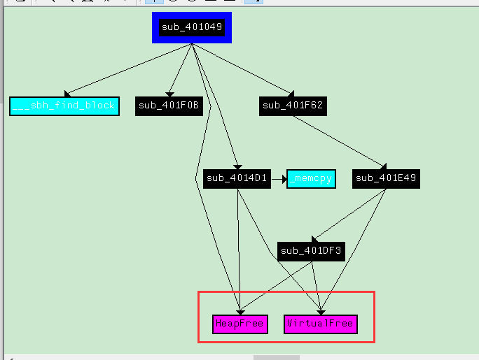


堆的创建

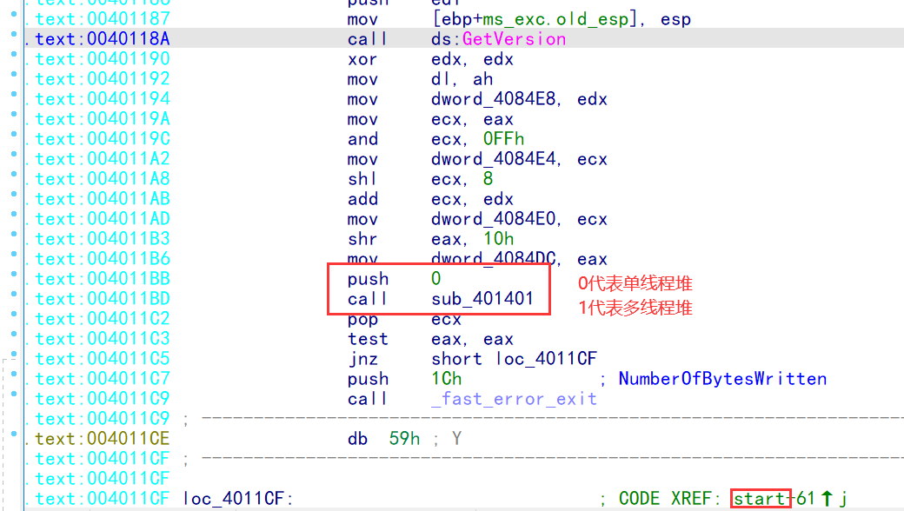


看变量地址

005A25F8  明显不是栈空间,也不在PE里面,所以是堆


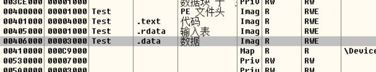

到了 C++ 的时候  delete[]  和 delete 才有区别,有无 [ ] 区别是 需要析构,有 [] 表示需要调用析构 