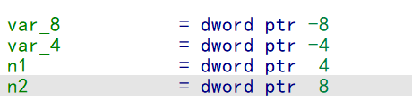
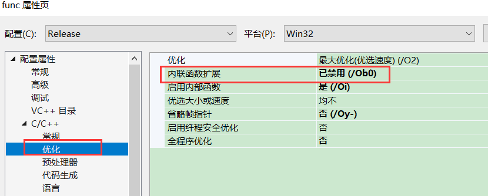

### 函数的调用约定

1.  栈参数传递(传递方向)
2.  返回值
3.  栈平衡(参数平衡 由谁平衡)

函数的调用约定系统说了算

系统的api是标准调用约定,由此编译器也不得不提供这种调用约定

在**非window系统**上,当我们把函数调用约定用 stdcall 时,,并不代表编译过后还是  stdcall ,可能会根据系统的api转为其他的调用约定

#### 栈

​         内存的资源是有限且应用程序共享的, 就会产生一个抢资源的问题,但是内存资源是有限的,因此我们希望能用重复的利用一段内存,这就是栈的意义

​        栈的本质是一段可以重复利用的的内存,(为了节省资源),跟全局变相相对(不共享,进程退出才会收)

​       只用全局变量不用局部变量,会导致内存消耗居高不下,并且可能还会出不够用的情况

​        进入函数时会打开栈空间，退出函数时会还原栈空间。

​        栈就是开始申请一段指定的内存,记录在pe里面

​        栈平衡:申请多少,释放多少,栈的不平衡可能并不会马上出问题

​        通常使用栈来传递函数参数，因此传递函数的栈也属于被调用函数栈空间中的一部分。

​       平衡细节：汇编过程中通常使用“ret xxxx”来平衡参数所使用的栈空间，当函数的参数为不定参数时，函数自身无法确定参数所使用的栈空间的大小，因此无法由函数自身执行平衡操作，需要此函数的调用者执行平衡操作。为了确定参数的平衡者，以及参数的传递方式，于是有了函数的调用约定

#### 调用约定

有时候编译器会为了适应各种操作平台,可能会转换调用约定

windows api 大部分都是  stdcall 调用约定 ，但是如果是不定参，则会用 默认调用约定（c调用约定 cdecl）

##### 1.c调用约定 cdecl (默认)

```
int __cdecl MyAdd(int n1, int n2) {
  int nNum1 = 0;
  scanf_s("%d", &nNum1);
  printf("%d\n", n1 + n2 + nNum1);

  return n1 + n2;
}
```

1.  参数从右到左入栈
2.  函数调用者平衡参数栈(release平衡可能会一起做,debug会分开)

###### 栈结构

寄存器环境(env)

局部变量空间(local)

栈底(ebp)

返回地址(ret)

参数(从右往左入栈)

###### 参数和变量访问

​        参数访问:      ebp +  偏移  (一般第一个参数在 ebp + 8 位置 ,后面参数要看前面参数大小)

 	局部变量访问:      ebp -  偏移 (offset) 

relese 版还可以可以用  esp +  偏移 (offset) 

 参数访问:      esp +  偏移  (offset) 

 	局部变量访问:      esp +  偏移  (offset) 


用ebp 访问存在缺点:

-   浪费了一个寄存器
-   函数的头和尾必须保存和访问ebp,增加了内存访问次数,会浪费时间,因此ebp效率没有esp高


禁止使用ebp,采用esp ,把该项设为是即可 


用esp的效率高于ebp,那么为什么还要用ebp呢

因为当多层函数调用时,  ebp 可以定位每层函数的信息,而esp不可以

调用该函数地址   [ebp+4]            调用该函数的参数      [ebp+8]

调用该函数的上层函数地址      [ [ebp+4] + 4]     调用该函数的上层函数参数      [ [ebp+4] + 8] 

.............

............

这样,在函数崩了,没有源码的情况下,可以打印出调用堆栈,也可以打印出每个函数的参数(一般一个正常的数的参数不超过四个),这样就可以快速定位问题和出问题的函数(调用堆栈)

但是 esp 就不行,而且用汇编时,用 esp 看变量 和参数 时,偏移不是固定的,每次esp变化时需要重新计算偏移 

用 esp  访问参数和局部变量   

int __cdecl MyAdd1(int n1, int n2) {

​    int nNum1 = 0;

​    scanf_s("%d", &nNum1);

​    printf("%d\n", n1 + n2 + nNum1);


​    return n1 + n2;

}

int main()

{

​    printf("10+20=%d\n", MyAdd1(10, 20)); 

​    return 0;

}

反汇编代码:

mov     [esp+4], eax

push    esi

push    edi

lea     eax, [esp+8]

mov     dword ptr [esp+8], 0

push    eax

push    offset _Format  ; "%d"

call    _scanf_s

mov     eax, [esp+10h]

mov     edi, [esp+1Ch]

add     eax, edi

mov     esi, [esp+20h]

add     eax, esi

push    eax

push    offset aD       ; "%d\n"

call    _printf

mov     ecx, [esp+1Ch]

lea     eax, [edi+esi]

add     esp, 10h


栈列表:

esp:

+0 esi

+4 edi

+8 esi

+c edi

+10 local

+14

+18 ret

+1c 10

+20 20


每一行看的代码 栈都不一样,因此需要栈列表配合来看

没次看esp 的位置一直在变,这就代表参数和局部变量的位置不固定,而且每次平栈不一定会一次平完,中间平四个字节,后面再平完

 在IDA中 arg_0  表示第一个参数 , var_4 表示第一个局部变量  ,他会模拟列出栈



禁止内联函数:



int __cdecl MyAdd(int n1, int n2) {

​    int nNum1 = 0;

​    scanf_s("%d", &nNum1);

​    printf("%d\n", n1 + n2 + nNum1);

​    return n1 + n2;

}

int main()

{

​    printf("%d\n", MyAdd(4,1));

​    return 0;

}


反汇编：

push    1

push    4

call    sub_401000

push    eax             ; ArgList

push    offset Format   ; "%d\n"

call    sub_401100

add     esp, 10h

xor     eax, eax

retn

函数

push    ebp

mov     ebp, esp

lea     eax, [ebp+ArgList]

push    eax             ; ArgList

push    0               ; Locale

push    [ebp+Format]    ; Format

push    1               ; Ix

call    ds:__acrt_iob_func

add     esp, 4

push    eax             ; Stream

call    sub_401080

add     esp, 10h

pop     ebp

retn

##### 2.标准调用约定  stdcall

```
int __stdcall MyAdd(int n1, int n2) {
  return n1 + n2;
}
```

1.  参数从右到左入栈
2.  函数本身平衡参数栈

一般通过 retn 来平,自己是无法平栈的,需要平栈的一瞬间返回

```
int __stdcall MyAdd(int n1, int n2) {
  return n1 + n2;
}
int main()
{
  printf("10+20=%d\n", MyAdd(10, 20));
  return 0;
}
反汇编:
.text:00401000                 push    ebp
.text:00401001                 mov     ebp, esp
.text:00401003                 mov     eax, [ebp+n1]
.text:00401006                 add     eax, [ebp+n2]
.text:00401009                 pop     ebp
.text:0040100A                 retn    8       ;平栈,返回的过程中平栈

自己平栈的话 可以  先    pop 返回地址到寄存器     平栈后在 push 寄存器    在返回 ,但是这样会破坏寄存器环境,如果用 eax,就没了返回值  因此如果有参数,自己是没办法平栈的
```

##### 3.快速调用约定  fastcall

参数不入栈,通过寄存器访问

1.   参数1:ecx

​         参数2:edx

​         参数从右到左入栈

1.  函数本身平衡参数栈


跟  stdcall 最大的区别就是 前2个参数用寄存器,还原时,因为流水线优化, ecx和edx 可能在前面使用,从而导致被误认为  stdcall  调用约定,那么如何快速去分呢:

第一步: 调用该函数之前有没有调用  ecx 和 edx,

第二步: 如果有的话 然后进函数看看有没有  push ecx 和 edx ,没有的话说明是参数,不然会破坏寄存器环境

```
int __fastcall MyAdd3(int n1, int n2, int n3, int n4) {
  return n1 + n2 + n3 + n4;
}
```

```
int __fastcall MyAdd(int n1, int n2, int n3, int n4) {
    return n1 + n2 + n3+ n4;
}
int main()
{
    printf("%d\n", MyAdd(10, 20,30,40));
    return 0;
}
反汇编代码:
push    ebp
mov     ebp, esp
lea     eax, [ecx+edx]
add     eax, [ebp+arg_0]       ;此时这里 arg_0 是第 3 个参数, ecx,edx分别是第一个和第二个
add     eax, [ebp+arg_4]
pop     ebp
retn    8
```

##### 4.不定参的调用约定

不定参的调用约定是   c调用约定 cdecl  ，因此不确定每个参数个数，自己没办法平栈

```
int MyAdd4(int count, ...) {
  //esp [esp+xx]  [esp+xxx]
  int sum = 0;
  va_list argList;

  va_start(argList , count);     //获得不定参栈位置
  for (int i = 0; i < count; i++)
  sum += va_arg(argList, int);   //esp + 4 
  va_end(argList);               //结束
 
  return sum; //retn xxx
}
```

```
int stdcall MyAdd(int count, ...) {
    //esp [esp+xx]  [esp+xxx]
    int sum = 0;
    va_list argList;
    va_start(argList, count);     //获得不定参栈位置
    for (int i = 0; i < count; i++)
     sum += va_arg(argList, int);   //esp + 4 
    va_end(argList);               //结束
    return sum; //retn xxx
}

int main()
{
    printf("......%d\n", MyAdd(6, 1, 2, 3, 4,5,6));
    printf("......%d\n", MyAdd(4,1, 2,3,4));
    return 0;
}

反汇编代码：
push    6
push    5
push    4
push    3
push    2
push    1
push    6
call    sub_401000
push    eax             ; ArgList
push    offset Format   ; "......%d\n"
call    sub_4010A0
push    4
push    3
push    2
push    1
push    4
call    sub_401000
push    eax             ; ArgList
push    offset Format   ; "......%d\n"
call    sub_4010A0
add     esp, 40h
xor     eax, eax


push    ebp
mov     ebp, esp
lea     eax, [ebp+ArgList]
push    eax             ; ArgList
push    0               ; Locale
push    [ebp+Format]    ; Format
push    1               ; Ix
call    ds:__acrt_iob_func
add     esp, 4
push    eax             ; Stream
call    sub_401030
add     esp, 10h
pop     ebp
retn

从右往左入栈 ，虽然我们写的是  stdcall   但是 函数本身是没有平栈，而变成了  C调用约定，因此所有的不定参不管你设置成什么调用约定都会转为c调用约定
```

区分c调用约定函数和变参函数 ，如果参数是通过栈去算的，大概率是变参，如果这个函数有多次调用，且每次参数数量不一样，那么绝对是变参函数，如果函数只用一次，那么变参函数可以还原成 c调用约定函数

#### 函数工作原理小结

##### 1 函数调用的一般工作流程

###### （1）参数传递

通过栈或寄存器方式传递参数。

###### （2）函数调用，将返回地址压栈

使用call指令调用参数，并将返回地址压入栈中。

###### （3）保存栈底

使用栈空间保存调用方的栈底寄存器ebp。

###### （4）申请栈空间和保存寄存器环境

根据函数内局部变量的大小抬高栈顶让出对应的栈空间，并且将即将修改的寄存器保存在栈内。

###### （5）函数实现代码

函数实现过程的代码。

###### （6）还原环境

还原栈中保存的寄存器信息。

###### （7）平衡栈空间

平衡局部变量使用的栈空间。

###### （8）ret返回，结束函数调用

从栈顶取出第（2）步保存的返回地址，更新EIP。

在非__cdecl调用方式下，平衡参数占用栈空间。

###### （9）调整esp，平衡栈顶

此处为__cdecl特有的方式，用于平衡参数占用的栈顶。

##### 2 两种编译选项下的函数识别

-   Debug编译选项组下的函数识别非常简单，由于其注重调试的特性，其汇编代码基本上就是函数的原貌，只需对照汇编代码逐条分析即可将其还原成高级代码。

```
// Debug编译选项组下的函数识别

push reg/mem/imm；根据调用函数查看参数使用，可确定是否为参数
……
call reg/mem/imm；调用函数
add esp, xxxx；如果Debug编译选项组下是_cdecl调用方式，由调用方平衡栈顶
jmp FUN_ADDR；call指令调用处，可能存在使用跳转指令执行到函数
FUN_ADDR：
push ebp；保存栈底
……
mov eax，0CCCCCCCCh
rep stos dword ptr[edi]；初始化局部变量
……
pop ebp；还原栈底
ret；查看ret是否平衡栈
```

-   在O2选项下，_cdecl调用方式的函数调用结束后，并不一定会马上平衡栈顶，极有可能会复写传播并与其他函数一起平衡栈。由于函数实现改用了esp寻址，因此需要注意函数执行过程是否对esp进行了修改，如进行了修改，在平衡栈顶esp时，考察是否有对esp进行平衡恢复。当函数有参数时，检查参数是否在函数实现中被平衡，以确定其调用方式。

```
// Release版函数识别

push reg/mem/imm；根据调用函数查看参数使用，可确定是否为参数
……
call reg/mem/imm；调用函数
add esp, xxxx；在Release版下调用__cdecl方式的函数，栈平衡可能会复写传播，请注意
；函数实现内没有将局部变量初始化为0CCCCCCCCh
；若在函数体内不存在内联汇编或异常处理等代码，则使用esp寻址
```

### 变参函数支持不同类型参数

```
#include <stdio.h>
#include <stdarg.h>
#include <Windows.h>


int MyAdd1(int count, ...) {
  int sum = 0;
  va_list argList;

  va_start(argList , count);
  for (int i = 0; i < count; i++)
  sum += va_arg(argList, int);
  va_end(argList);

  return sum; 
}


int MyAdd(const char* fmt, ...) {
  char buf[1024];
  int sum = 0;
  va_list argList;
  va_start(argList, fmt);
  _vsnprintf_s(buf, sizeof(buf), fmt, argList);  
  va_end(argList);
  puts(buf);
  return sum; //retn xxx
}

//vararg
int main()
{
  MyAdd5("%d %f %c", 1, 3.5f, 'a');
  return 0;
}
```

