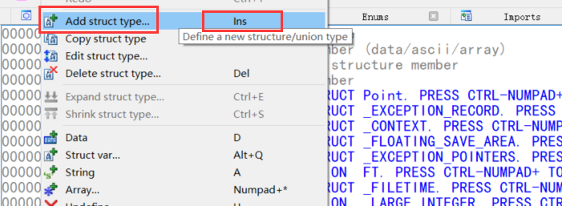
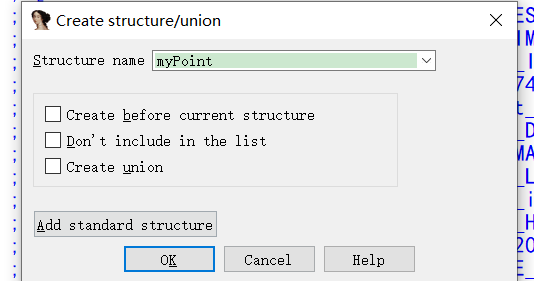
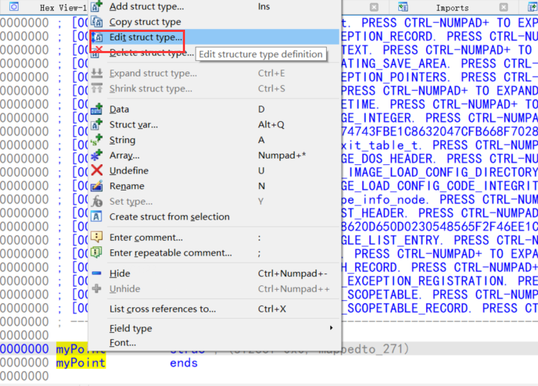
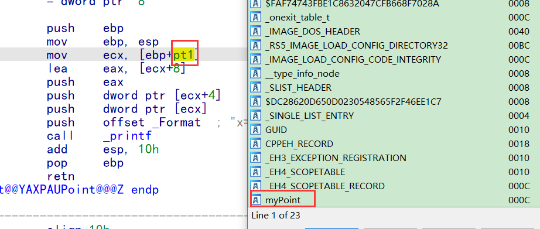
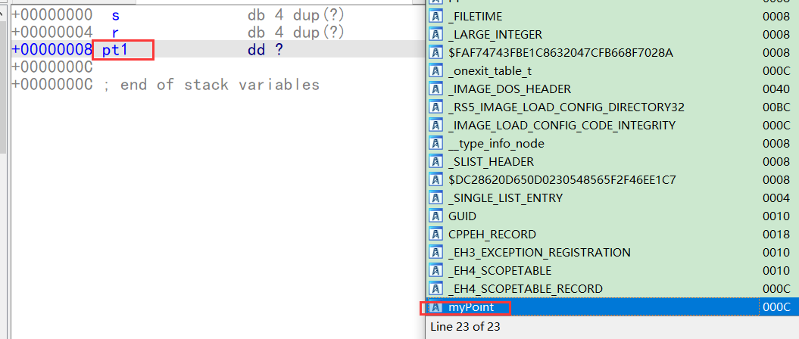
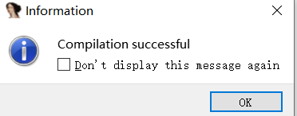
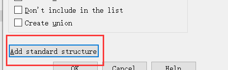
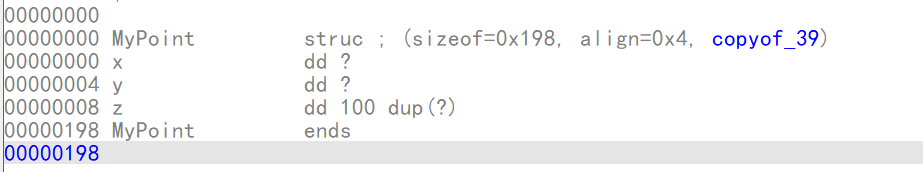
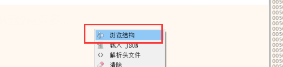
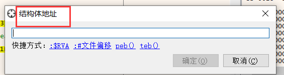

## 结构体

首先要考虑对齐值问题,但是在逆向角度是不关心的,因为结构体大小在代码中会体现

ida 如果读不到pbd,可以自动从微软服务器下载  pbd (系统api的pbd)

### 结构体成员2个整形

看不出是结构体,很像定义2个 变量,没啥区别

```
struct Point {
    int x;
    int y;
};


int main()
{
    Point pt1 = { 10,20 };
    printf("x:%d y:%d", pt1.x, pt1.y);
    return 0;
}
```

debug版反汇编代码

```
.text:00411865                 mov     dword ptr [ebp-0Ch], 0Ah       ;第一个成员
.text:0041186C                 mov     dword ptr [ebp-8], 14h            ;第二个成员
.text:00411873                 mov     eax, [ebp-8]
.text:00411876                 push    eax
.text:00411877                 mov     ecx, [ebp-0Ch]
.text:0041187A                 push    ecx             ; char
.text:0041187B                 push    offset aXDYD    ; "x:%d y:%d"
.text:00411880                 call    sub_4110CD
.text:00411885                 add     esp, 0Ch
```

release版

```
struct Point {
    int x;
    int y;
};
int main()
{
    Point pt1 = { 10,20 };
    scanf_s("%d%d", &pt1.x, &pt1.y);
    printf("x:%d y:%d", pt1.x, pt1.y);
    return 0;
}
反汇编代码:

.text:00401080                 push    ebp
.text:00401081                 mov     ebp, esp
.text:00401083                 sub     esp, 0Ch        ;抬了12字节,其中四字节是cookie,所以剩下8字节是变量
.text:00401086                 mov     eax, ___security_cookie
.text:0040108B                 xor     eax, ebp
.text:0040108D                 mov     [ebp+var_4], eax
.text:00401090                 lea     eax, [ebp-8]
.text:00401093                 mov     dword ptr [ebp-0Ch], 0Ah
.text:0040109A                 push    eax
.text:0040109B                 lea     eax, [ebp-0Ch]
.text:0040109E                 mov     dword ptr [ebp-8], 14h
.text:004010A5                 push    eax             ; Arglist
.text:004010A6                 push    offset aDD      ; "%d%d"
.text:004010AB                 call    sub_401110
.text:004010B0                 push    dword ptr [ebp-8]
.text:004010B3                 push    dword ptr [ebp-0Ch] ; ArgList
.text:004010B6                 push    offset Format   ; "x:%d y:%d"
.text:004010BB                 call    sub_4010E0
.text:004010C0                 mov     ecx, [ebp+var_4]
.text:004010C3                 add     esp, 18h

一样看不出来是结构体
```

### 结构体成员数多个整形

结构体和一堆变量最大的区别是 内存空间连续,多个变量内存不一定是连续的

```
struct Point {
    int x;
    int y;
    int z;
};


void showPoint(Point pt1) {

    printf("x=%d y:%d z:%d\n", pt1.x, pt1.y, pt1.z);
}

int main()
{
    Point pt1 = { 10,20,30 };
    scanf_s("%d%d%d", &pt1.x, &pt1.y, &pt1.z);
    showPoint(pt1);
    return 0;
}
```

debug版

```
mov     dword ptr [ebp-14h], 0Ah
mov     dword ptr [ebp-10h], 14h
mov     dword ptr [ebp-0Ch], 1Eh
lea     eax, [ebp-0Ch]
push    eax
lea     ecx, [ebp-10h]
push    ecx
lea     edx, [ebp-14h]
push    edx             ; pt1
push    offset aDDD     ; "%d%d%d"
call    j__scanf_s
add     esp, 10h
sub     esp, 0Ch
mov     eax, esp
mov     ecx, [ebp-14h]
mov     [eax], ecx
mov     edx, [ebp-10h]
mov     [eax+4], edx
mov     ecx, [ebp-0Ch]
mov     [eax+8], ecx
call    j_?showPoint@@YAXUPoint@@@Z ; showPoint(Point)
add     esp, 0Ch
xor     eax, eax
```

release版

```
lea     eax, [ebp-8]
mov     dword ptr [ebp-10h], 0Ah
push    eax
lea     eax, [ebp-0Ch]
mov     dword ptr [ebp-0Ch], 14h
push    eax
lea     eax, [ebp-10h]
mov     dword ptr [ebp-8], 1Eh
push    eax             ; pt1
push    offset aDDD     ; "%d%d%d"
call    _scanf_s
movq    xmm0, qword ptr [ebp-10h]
add     esp, 4      ; scanf 的栈需要平16字节,平了4字节还剩12字节,刚好结构体大小
mov     eax, [ebp-8]
mov     ecx, esp
movq    qword ptr [ecx], xmm0            ;8字节大小
mov     [ecx+8], eax                                   ;4字节大小的
call    ?showPoint@@YAXUPoint@@@Z ; showPoint(Point)

函数:
push    ebp
mov     ebp, esp
push    dword ptr [ebp+10h]       ;结构体首地址
push    dword ptr [ebp+0Ch]     ;本来应该是  首地址 +4   即    ebp+10h - 4  被优了
push    dword ptr [ebp+8]
push    offset _Format  ; "x=%d y:%d z:%d\n"
call    _printf
add     esp, 10h
pop     ebp
retn

所以上面等于  
sub    esp,  sizeof(Point)
mencpy (esp,pt1);
c语言语法规定  当函数参数是结构体时,整个结构体拷贝到栈顶当参数

寻址方式:  
[ebx + offset]   当寄存器不够时就会出现 首地址 +偏移 寻址
```

### 当结构体成员比较多

```
struct Point {
    int x;
    int y;
    int z[100];
};


void showPoint(Point pt1) {

    printf("x=%d y:%d z:%d\n", pt1.x, pt1.y, pt1.z);
}

int main()
{
    Point pt1 = { 10,20,30 };
    scanf_s("%d%d%d", &pt1.x, &pt1.y, &pt1.z);
    showPoint(pt1);
    return 0;
}
```

debug版

```
mov     dword ptr [ebp-1A0h], 0Ah
mov     dword ptr [ebp-19Ch], 14h
mov     dword ptr [ebp-198h], 1Eh
push    18Ch            ; Size
push    0               ; Val
lea     eax, [ebp-194h]
push    eax             ; void *
call    j__memset
add     esp, 0Ch
lea     eax, [ebp-198h]
push    eax
lea     ecx, [ebp-19Ch]
push    ecx
lea     edx, [ebp-1A0h]
push    edx
push    offset aDDD     ; "%d%d%d"
call    j__scanf_s
add     esp, 10h
sub     esp, 198h                  ;抬栈抬了 408字节
mov     ecx, 66h ; 'f'
lea     esi, [ebp-1A0h]          ;源首地址(结构体首地址)
mov     edi, esp                      ;目的地址
rep movsd                              ;内存拷贝  大小是  ecx * 4  = 408
call    j_?showPoint@@YAXUPoint@@@Z ; showPoint(Point)
add     esp, 198h
xor     eax, eax
```

release版

```
push    edi
push    18Ch            ; Size
lea     eax, [ebp-190h]
mov     dword ptr [ebp-19Ch], 0Ah
push    0               ; Val
push    eax             ; void *
mov     dword ptr [ebp-198h], 14h
mov     dword ptr [ebp-194h], 1Eh
call    _memset                  ;396  + 12 (3个mov)  = 408
lea     eax, [ebp-194h]
push    eax
lea     eax, [ebp-198h]
push    eax
lea     eax, [ebp-19Ch]
push    eax
push    offset aDDD     ; "%d%d%d"
call    _scanf_s
sub     esp, 17Ch            ;抬栈  
lea     esi, [ebp+pt1]
mov     ecx, 66h ; 'f'
mov     edi, esp
rep movsd
call    ?showPoint@@YAXUPoint@@@Z ; showPoint(Point)
```

### 结构体指针

```
struct Point {
    int x;
    int y;
    int z[100];
};


void showPoint(Point* pt1) {

    printf("x=%d y:%d z:%d\n", pt1->x, pt1->y, pt1->z);
}

int main()
{
    Point pt1 = { 10,20,30 };
    scanf_s("%d%d%d", &pt1.x, &pt1.y, &pt1.z);
    showPoint(&pt1);
    return 0;
}
```

```
push    18Ch            ; Size
lea     eax, [ebp+var_190]
mov     [ebp+pt1.x], 0Ah
push    0               ; Val
push    eax             ; void *
mov     [ebp+pt1.y], 14h
mov     [ebp+pt1.z], 1Eh
call    _memset
lea     eax, [ebp+pt1.z]
push    eax
lea     eax, [ebp+pt1.y]
push    eax
lea     eax, [ebp+pt1]
push    eax
push    offset aDDD     ; "%d%d%d"
call    _scanf_s
lea     eax, [ebp+pt1]
push    eax             ; pt1
call    ?showPoint@@YAXPAUPoint@@@Z ; showPoint(Point *)

函数
push    ebp
mov     ebp, esp
mov     ecx, [ebp+pt1]    ;获取指针(首地址)
lea     eax, [ecx+8]           ;首地址 + 偏移寻址
push    eax
push    dword ptr [ecx+4]    ;首地址 + 偏移寻址
push    dword ptr [ecx]        ;首地址 + 偏移寻址
push    offset _Format  ; "x=%d y:%d z:%d\n"
call    _printf
add     esp, 10h
pop     ebp
retn
```

### 总结

因此判断是否结构体的方法

1.  访问方式      [首地址 +  偏移]
2.  传参在拷贝

如果上面2种都不存在,那么可能是局部变量

结构体成员如果没有被使用,可以当做不存在,还原结构体大小可以按照访问的最大偏移的来计算

而且一般结构体会初始化,可以从初始化获取结构体大小

### 数组和结构体的区别

-   **（1）数组**

-   -   还原为数组：（1）类型一致，业务一致。（2）地址首地址参与比例因子寻址或有循环。
    -   数组传参：数组传参必然是指针。

-   **（2）结构体**

-   -   还原为结构体：（1）类型一致，业务不一致。（2）类型不一致，业务不一致。（3）!(地址首地址参与比例因子寻址或有循环)。
    -   结构体传参：结构体传参是浅拷贝。如果是引用参数的话，以栈顶为目标，执行memcpy，在高版本下会使用两个多媒体指令相当于传入了一个参数，即，栈顶为参数地址。

### 结构体和类的区别

-   类：有成员函数的调用。
-   结构体：没有成员函数的调用

### iad自动识别指定偏移位置的结构体成员

SDK定义的结构体会自动导入结构体类型

#### 第一种方法:  添加结构体类型

当结构体成员很多时,我们使用ida 可能没法记住所有成员的偏移,因此ida 提供了该功能


右键创建结构体   快捷键   **ins**





编辑对齐值



选中地址通过快捷键 d 可以添加成员


alt + q  可以吧改地址解释为结构体



或者到栈里面 按 alt + q




或者到变量地址    **alt + q**


#### 第二种方法: 头文件导入

建一个结构体头文件


导入


导入成功



有时候结构体会被折叠导致看不到,可以直接右键插入结构体  (ins) 








### x32 ,OD 解析结构体

x32 也可以载入头文件来解析结构体







OD 没有改功能


## 函数的传参和返回值

### 参数是结构体

#### 结构体成员只有1个

push 1个成员 ,并没有传地址

```
struct Point {
    int x;

};

void showPoint(Point pt1) {

 printf("x=%d\n", pt1.x);
}

int main()
{
    Point pt1 = { 10};
    scanf_s("%d%d%d", &pt1.x);
    showPoint(pt1);
    return 0;
}
```

按照我们传参的约定,是吧结构体压入栈顶,然后把栈顶地址当做参数传进去,当做一个参数

```
lea     eax, [ebp-8]
mov     dword ptr [ebp-8], 0Ah
push    eax             ; Arglist
push    offset aD       ; "%d"
call    sub_401110
push    dword ptr [ebp-8] ; ArgList
call    sub_401000
mov     ecx, [ebp-4]
add     esp, 0Ch

编译器视为:    void showPoint(int  x ) 
```

#### 结构体有2个成员

push 2个成员 ,并没有传地址

```
struct Point {
    int x;
    int y;
};

void showPoint(Point pt1) {

 printf("x=%d\n", pt1.x);
}

int main()
{
    Point pt1 = { 10};
    scanf_s("%d%d", &pt1.x, &pt1.y);
    showPoint(pt1);
    return 0;
}
```

lea     eax, [ebp+pt1.y]

mov     [ebp+pt1.x], 0Ah

push    eax

lea     eax, [ebp+pt1]

mov     [ebp+pt1.y], 0

push    eax

push    offset aDD      ; "%d%d"

call    _scanf_s

**push    [ebp+pt1.y]**

**push    [ebp+pt1.x]     ; pt1**

call    ?showPoint@@YAXUPoint@@@Z ; showPoint(Point)


编译器视为:    void showPoint(int  x ,  int y) 

#### 结构体有多个成员

```
struct Point {
    int x;
    int y;
    int z;
};

void showPoint(Point pt1) {
    printf("x=%d y:%d z:%d\n", pt1.x, pt1.y, pt1.z);
}

int main()
{
    Point pt1 = { 10};
    scanf_s("%d%d%d", &pt1.x, &pt1.y, &pt1.z);
    showPoint(pt1);
    return 0;
}
```

```
lea     eax, [ebp+var_8]
mov     [ebp+pt1.x], 0Ah
push    eax
lea     eax, [ebp+pt1.y]
xorps   xmm0, xmm0
push    eax
lea     eax, [ebp+pt1]
movq    qword ptr [ebp+pt1.y], xmm0
push    eax             ; pt1
push    offset aDDD     ; "%d%d%d"
call    _scanf_s
movq    xmm0, qword ptr [ebp+pt1.x]
add     esp, 4
mov     eax, [ebp+var_8]
mov     ecx, esp
movq    qword ptr [ecx], xmm0
mov     [ecx+8], eax
call    ?showPoint@@YAXUPoint@@@Z ; showPoint(Point)

产生了拷贝就是结构体 ,当参数超过 12字节,才会产生拷贝
```

### 返回值是结构体

#### 结构体只有一个成员    (返回值 长度<= 4 字节)

通过 eax 返回 

```

struct Point {
    int x;
};

Point GetPoint() {
    Point p1 = { 1};
    return p1;
}

int main()
{
    Point ret = GetPoint();
    printf("x:%d", ret.x);
    return 0;
}
```

```
?GetPoint@@YA?AUPoint@@XZ proc near
mov     eax, 1
retn
?GetPoint@@YA?AUPoint@@XZ endp
```

#### 返回值只有2个成员     (返回值 长度 4~ 8 字节)

通过 eax (结构体第一个成员),edx  (结构体第二个成员) 返回

调用函数前会保存edx的值 (push),调完后会恢复edx的值 (pop)

```
struct Point {
    int x;
    int y;
};

Point GetPoint() {
    Point p1 = { 1,2};
    return p1;
}

int main()
{
    Point ret = GetPoint();
    printf("x:%d,y:%d", ret.x, ret.y);
    return 0;
}
```

```
?GetPoint@@YA?AUPoint@@XZ proc near
mov     eax, 1
lea     edx, [eax+1]
retn
?GetPoint@@YA?AUPoint@@XZ endp
```


结构体地址当作参数传还进去,然后通过 地址+ 偏移 访问成员 ,然后返回 结构体地址

如果他前面还有一个其他参数,那么就会往后延,放到第二个

```
struct Point {
    int x;
    int y;
    int z;
};

Point GetPoint() {
    Point p1 = { 1,2,3};
    return p1;
}

int main()
{
    Point ret = GetPoint();
    printf("x:%d,y:%d,z:%d", ret.x, ret.y, ret.z);
    return 0;
}
```

```
push    ebp
mov     ebp, esp
sub     esp, 24
lea     eax, [ebp+result]
push    eax             ; 把 ret 的地址当参数产进去了
call    ?GetPoint@@YA?AUPoint@@XZ ; GetPoint(void)
push    dword ptr [eax+8]
movq    xmm0, qword ptr [eax]
movq    qword ptr [ebp+ret.x], xmm0
push    [ebp+ret.y]
push    [ebp+ret.x]
push    offset _Format  ; "x:%d,y:%d,z:%d"
call    _printf

函数实现
push    ebp
mov     ebp, esp
mov     eax, [ebp+result]
mov     dword ptr [eax], 1
mov     dword ptr [eax+4], 2
mov     dword ptr [eax+8], 3
pop     ebp
retn
```

### 其他类型的返回值

#### 返回者是 int  或 char

​        返回值是 eax

#### 返回值是 longlong

​        返回者 通过 eax (低4位)  ,edx (高四位) 返回

```
long long GetInt() {
    return 10;
}
int main()
{
    long long ret2 = GetInt();
    printf("ret:%lld", ret2);
    return 0;
}
```

?GetInt@@YA_JXZ proc near

mov     eax, 0Ah

xor     edx, edx

retn

?GetInt@@YA_JXZ endp

#### 返回值是float

通过   st(0)  返回

就算禁止使用  x87指令集 ,结果还是放在   st(0)  里面,因为需要固定返回值

```
float GetFloat() {
    return 10.5f;
}
int main()
{
    float ret = GetFloat();
    printf("ret:%f", ret);
    return 0;
}
```

?GetFloat@@YAMXZ proc near

fld     ds:__real@41280000

retn

?GetFloat@@YAMXZ endp

#### 返回值是double

st(0)有80位,可以放下double 

因此也是     通过   st(0)  返回

```
double GetDouble() {
    return 10.5;
}

int main()
{
    double ret = GetDouble();
    printf("ret:%f", ret);
    return 0;
}
```

?GetDouble@@YANXZ proc near

fld     ds:__real@4025000000000000

retn

?GetDouble@@YANXZ endp

### 其他编译器

在其他编译器中,不一定是这么传的,即我们可能碰到位置的编译器,此时逆向时,如果操作了寄存,进函数去看有没有直接用寄存器,直接用了说明是参数寄存器,如果是入栈是通过 ebp 访问