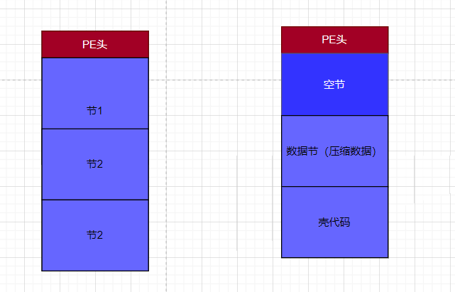

一个加壳程序应该做到 不管一个 exe 是啥,能对其加壳,加壳是根据原先的exe 合成一个新的 exe,新的exe里面有一部分东西是我们从原先 exe 里面提取出来做压缩的,还有一部分是我们的解压缩代码,解压缩代码基本是每个壳通用的.


新建一个MFC 对话框程序,功能就是 选择文件 壳 提供加壳 和 脱壳 按钮


接下来就是实现加壳了,因此要处理很多跟PE相关的东西,为了方便管理,可以用一个类来实现


### 加壳步骤

#### 1解析原PE

```
    m_hFile = CreateFile(strSrc,           // open MYFILE.TXT 
        GENERIC_READ,              // open for reading 
        FILE_SHARE_READ,           // share for reading 
        NULL,                      // no security 
        OPEN_EXISTING,             // existing file only 
        FILE_ATTRIBUTE_NORMAL,     // normal file 
        NULL);                     // no attr. template 

    if (m_hFile == INVALID_HANDLE_VALUE)
    {
        return false;
    }

    m_dwSrcPeSize = GetFileSize(m_hFile, NULL);
    // 创建文件映射
    m_hFileMap = CreateFileMapping(m_hFile, 0, PAGE_READONLY, 0, 0, NULL);
    if (m_hFileMap == NULL)
    {
        return false;
    }
    //把内存数据映射进PE数据缓冲区
    m_pSrcPe = (LPBYTE)MapViewOfFile(m_hFileMap, FILE_MAP_READ, 0, 0, 0);
    if (m_pSrcPe == NULL)
    {
        return false;
    }

    m_pDosHdr = (PIMAGE_DOS_HEADER)m_pSrcPe;                                        //DOS头
    m_pNtHdr = (PIMAGE_NT_HEADERS32)((DWORD)m_pSrcPe + m_pDosHdr->e_lfanew);        //NT头
    m_pSecHdr = (PIMAGE_SECTION_HEADER)((DWORD)&m_pNtHdr->OptionalHeader + (m_pNtHdr->FileHeader.SizeOfOptionalHeader));

    //检查格式

    return true;
```

#### 2对原PE进行压缩,获取压缩数据

压缩算法可以用windows 提供的api ,  **Compress

```
#include <compressapi.h>
#pragma comment(lib, "Cabinet.lib")


    COMPRESSOR_HANDLE hCompressor;
    BOOL bSuccess = CreateCompressor(
        COMPRESS_ALGORITHM_XPRESS_HUFF, //  Compression Algorithm
        NULL,                           //  Optional allocation routine
        &hCompressor);                   //  Handle

   //获取压缩后数据缓冲区的大小
    //DWORD dwCompressedBufferSize;
    //bSuccess = Compress(
    //    hCompressor,                  //  句柄
    //    m_pSrcPe,                     //  压缩前数据
    //    m_dwSrcPeSize,                //  压缩前大小
    //    NULL,                         //  压缩后的数据缓冲区
    //    0,                            //  压缩后的数据缓冲区大小
    //    &dwCompressedBufferSize);     //  压缩后的数据大小


    //申请缓冲区
    m_pComData = new BYTE[m_dwSrcPeSize];
    if (m_pComData == nullptr)
    {
        return false;
    }
    //压缩数据
    bSuccess = Compress(           
        hCompressor,              //  句柄 
        m_pSrcPe,                 //  压缩前数据
        m_dwSrcPeSize,            //  压缩前大小
        m_pComData,               //  压缩后的数据缓冲区
        m_dwSrcPeSize,            //  压缩后的数据缓冲区大小
        &m_dwComSize);            //  压缩后的数据大小
    if (!bSuccess)
    {
        return false;
    }

    CloseCompressor(hCompressor);
```

#### 合成新PE



如果放在堆里面的话不需要处理跳转之类的地址,我们写出来的代码应该是放在任何地址都能跑的

构造PE头要先把节表构造好,这样必须知道每个节多大必须先构造好,我们写文件的的时候是先写PE头,在写节,但是准备过程要反过来

##### 步骤

 压缩数据节

```

    //跟文件对齐值对齐
    m_dwComSecSize = GetAlign(m_dwComSize, m_pNtHdr->OptionalHeader.FileAlignment);
    m_pComSec = new BYTE[m_dwComSecSize];
    ZeroMemory(m_pComSec, m_dwComSecSize);
    //拷贝数据
    CopyMemory(m_pComSec, m_pComData, m_dwComSize);
```

壳代码节

```
//跟文件对齐值对齐
m_dwCodeSecSize = GetAlign(m_dwCodeSize, m_pNtHdr->OptionalHeader.FileAlignment);
m_pCodeSec = new BYTE[m_dwCodeSecSize];
ZeroMemory(m_pCodeSec, m_dwCodeSecSize);
//拷贝数据
CopyMemory(m_pCodeSec, m_pCode, m_dwCodeSize);
```

构造节表

```
   ZeroMemory(m_newSecHdr, sizeof(m_newSecHdr));
    //空节
    strcpy((char*)m_newSecHdr[0].Name, ".cr42");
    m_newSecHdr[0].Misc.VirtualSize = m_pNtHdr->OptionalHeader.SizeOfImage;
    m_newSecHdr[0].VirtualAddress = m_pSecHdr[0].VirtualAddress;  //和原先PE第一个内存位置一样
    m_newSecHdr[0].SizeOfRawData = 0;   //空节没有文件大小
    m_newSecHdr[0].PointerToRawData = 0;   
    m_newSecHdr[0].Characteristics = IMAGE_SCN_MEM_EXECUTE | IMAGE_SCN_MEM_READ | IMAGE_SCN_MEM_WRITE;  //可读可写可执行
    //数据节
    strcpy((char*)m_newSecHdr[1].Name, ".data");
    m_newSecHdr[1].Misc.VirtualSize = GetAlign(m_dwComSecSize,m_pNtHdr->OptionalHeader.SectionAlignment);
    m_newSecHdr[1].VirtualAddress = m_newSecHdr[0].VirtualAddress + m_newSecHdr[0].Misc.VirtualSize;  //节表是连续的,等于上一个节表地址+大小
    m_newSecHdr[1].SizeOfRawData = m_dwComSecSize;   //节大小
    m_newSecHdr[1].PointerToRawData = m_pNtHdr->OptionalHeader.SizeOfHeaders;   //紧跟文件头
    m_newSecHdr[1].Characteristics = IMAGE_SCN_MEM_READ ;  //可读
    //代码节
    strcpy((char*)m_newSecHdr[2].Name, ".text");
    m_newSecHdr[2].Misc.VirtualSize = GetAlign(m_dwCodeSecSize, m_pNtHdr->OptionalHeader.SectionAlignment);
    m_newSecHdr[2].VirtualAddress = m_newSecHdr[1].VirtualAddress + m_newSecHdr[1].Misc.VirtualSize;  //节表是连续的,等于上一个节表地址+大小
    m_newSecHdr[2].SizeOfRawData = m_dwCodeSecSize;   //节大小
    m_newSecHdr[2].PointerToRawData = m_newSecHdr[1].PointerToRawData + m_newSecHdr[1].SizeOfRawData;   //上一个节文件地址+大小
    m_newSecHdr[2].Characteristics = IMAGE_SCN_MEM_EXECUTE | IMAGE_SCN_MEM_READ;  //可读可写可执行
```

构造PE头

注意,不能把压缩数据当做整个节数据 ,因为PE的节数据是有对齐要求的,而压缩后的数据不一定能满足对其要求

```
    //拷贝原PE的PE头
    m_dwNewPeHdrSize = m_pNtHdr->OptionalHeader.SizeOfHeaders;
    m_pNewPeHdr = new BYTE[m_dwNewPeHdrSize];
    CopyMemory(m_pNewPeHdr,m_pDosHdr, m_dwNewPeHdrSize);

    auto pDosHdr = (PIMAGE_DOS_HEADER)m_pNewPeHdr;                                        //DOS头
    auto pNtHdr = (PIMAGE_NT_HEADERS32)((DWORD)m_pNewPeHdr + pDosHdr->e_lfanew);        //NT头
    auto pSecHdr = (PIMAGE_SECTION_HEADER)((DWORD)&pNtHdr->OptionalHeader + (pNtHdr->FileHeader.SizeOfOptionalHeader));

    //修改节表个数
    pNtHdr->FileHeader.NumberOfSections = 3;
    //修改入口点
    pNtHdr->OptionalHeader.AddressOfEntryPoint = m_newSecHdr[2].VirtualAddress;
    //修改在内存的总大小  
    pNtHdr->OptionalHeader.SizeOfImage = m_newSecHdr[2].VirtualAddress + m_newSecHdr[2].Misc.VirtualSize; //最后一个节的地址 + 大小

    //清空数据目录
    ZeroMemory(pNtHdr->OptionalHeader.DataDirectory, sizeof(pNtHdr->OptionalHeader.DataDirectory));
    CopyMemory(pSecHdr, m_newSecHdr, sizeof(m_newSecHdr));  //拷贝节表
```

写入文件

```
 //创建文件
    HANDLE hFile = CreateFile(strNewPe,           // open MYFILE.TXT 
        GENERIC_WRITE,              // open for reading 
        FILE_SHARE_READ,           // share for reading 
        NULL,                      // no security 
        CREATE_ALWAYS,             // existing file only 
        FILE_ATTRIBUTE_NORMAL,     // normal file 
        NULL);                     // no attr. template 
    if (hFile == INVALID_HANDLE_VALUE)
    {
        return false;
    }

    DWORD dwBytesWrited = 0;
    //写入PE头
    WriteFile(hFile, m_pNewPeHdr, m_dwNewPeHdrSize, &dwBytesWrited, NULL);
    //写入数据结头
    WriteFile(hFile, m_pComSec, m_dwComSecSize, &dwBytesWrited, NULL);
    //写入代码节
    WriteFile(hFile, m_pCodeSec, m_dwCodeSecSize, &dwBytesWrited, NULL);

    CloseHandle(hFile);
```

### 完整源码

CPacker.h

```
#pragma once
class CPacker
{

public:
    bool Pack(CString strSrc, CString strDst);    //实现加壳

private:
    DWORD GetAlign(DWORD dwValue, DWORD dwAlign);

    //解析原PE
private:
    HANDLE m_hFile;          
    HANDLE m_hFileMap;
    LPBYTE m_pSrcPe;                  
    DWORD m_dwSrcPeSize;              //原PE数据大小

    PIMAGE_DOS_HEADER m_pDosHdr;      //dos头
    PIMAGE_NT_HEADERS m_pNtHdr;       //nt头
    PIMAGE_SECTION_HEADER m_pSecHdr;  //节表

    bool AnalyzePe(CString strSrc);   //解析PE数据

    //对原PE进行压缩, 获取压缩数据
private:
    LPBYTE m_pComData;//压缩后的数据缓冲区
    DWORD m_dwComSize;//压缩后的数据的大小
    bool GetCompressData();

    //获取解压缩代码 
private:
    LPBYTE m_pCode;      //壳代码(解压缩代码)
    DWORD m_dwCodeSize;  //代码大小
    bool GetCode();

    //合成新PE
private:
    LPBYTE m_pComSec;     //数据节
    DWORD m_dwComSecSize; //数据节大小
    void GetComSec();

private:
    LPBYTE m_pCodeSec;     //代码节
    DWORD m_dwCodeSecSize; //代码节大小
    void GetCodeSec();

private:
    IMAGE_SECTION_HEADER m_newSecHdr[3];   //新的节表
    void GetNewSectionHeaders();

private:
    LPBYTE m_pNewPeHdr;      //新的PE头
    DWORD m_dwNewPeHdrSize;  //新的PE头大小
    void GetNewPeHdr();

    //写入文件
private:
    bool WriteNewPe(CString	strNewPe);
};


```

CPacker.cpp

```
#include "pch.h"
#include "CPacker.h"

#include <compressapi.h>
#pragma comment(lib, "Cabinet.lib")

bool CPacker::Pack(CString strSrc, CString strDst)
{

    //解析原PE
    if (!AnalyzePe(strSrc)) {
        return false;
    }

    //对原PE进行压缩,获取压缩数据
    if (!GetCompressData()) {
        return false;
    }
    

    //获取解压缩代码
    if (!GetCode()) {
        return false;
    }
    //合成新PE
      //1压缩数据节
    GetComSec();
      //2壳代码节
    GetCodeSec();
      //3构造节表
    GetNewSectionHeaders();
      //4构造PE头
    GetNewPeHdr();

    if (!WriteNewPe(strDst)) {
        return false;
    }

    //写入文件
    return true;
}

DWORD CPacker::GetAlign(DWORD dwValue, DWORD dwAlign)
{

    if (dwValue % dwAlign == 0) {
        return dwValue;
    }
    else
    {
        return  (dwValue / dwAlign + 1) * dwAlign;
    }
    return 0;
}

////解析原PE
bool CPacker::AnalyzePe(CString strSrc)
{

    m_hFile = CreateFile(strSrc,           // open MYFILE.TXT 
        GENERIC_READ,              // open for reading 
        FILE_SHARE_READ,           // share for reading 
        NULL,                      // no security 
        OPEN_EXISTING,             // existing file only 
        FILE_ATTRIBUTE_NORMAL,     // normal file 
        NULL);                     // no attr. template 

    if (m_hFile == INVALID_HANDLE_VALUE)
    {
        return false;
    }

    m_dwSrcPeSize = GetFileSize(m_hFile, NULL);
    // 创建文件映射
    m_hFileMap = CreateFileMapping(m_hFile, 0, PAGE_READONLY, 0, 0, NULL);
    if (m_hFileMap == NULL)
    {
        return false;
    }
    //把内存数据映射进PE数据缓冲区
    m_pSrcPe = (LPBYTE)MapViewOfFile(m_hFileMap, FILE_MAP_READ, 0, 0, 0);
    if (m_pSrcPe == NULL)
    {
        return false;
    }

    m_pDosHdr = (PIMAGE_DOS_HEADER)m_pSrcPe;                                        //DOS头
    m_pNtHdr = (PIMAGE_NT_HEADERS32)((DWORD)m_pSrcPe + m_pDosHdr->e_lfanew);        //NT头
    m_pSecHdr = (PIMAGE_SECTION_HEADER)((DWORD)&m_pNtHdr->OptionalHeader + (m_pNtHdr->FileHeader.SizeOfOptionalHeader));

    //检查格式

    return true;

}

//对原PE进行压缩,获取压缩数据
bool CPacker::GetCompressData()
{
    COMPRESSOR_HANDLE hCompressor;
    BOOL bSuccess = CreateCompressor(
        COMPRESS_ALGORITHM_XPRESS_HUFF, //  Compression Algorithm
        NULL,                           //  Optional allocation routine
        &hCompressor);                   //  Handle

   //获取压缩后数据缓冲区的大小
    //DWORD dwCompressedBufferSize;
    //bSuccess = Compress(
    //    hCompressor,                  //  句柄
    //    m_pSrcPe,                     //  压缩前数据
    //    m_dwSrcPeSize,                //  压缩前大小
    //    NULL,                         //  压缩后的数据缓冲区
    //    0,                            //  压缩后的数据缓冲区大小
    //    &dwCompressedBufferSize);     //  压缩后的数据大小


    //申请缓冲区
    m_pComData = new BYTE[m_dwSrcPeSize];
    if (m_pComData == nullptr)
    {
        return false;
    }
    //压缩数据
    bSuccess = Compress(           
        hCompressor,              //  句柄 
        m_pSrcPe,                 //  压缩前数据
        m_dwSrcPeSize,            //  压缩前大小
        m_pComData,               //  压缩后的数据缓冲区
        m_dwSrcPeSize,            //  压缩后的数据缓冲区大小
        &m_dwComSize);            //  压缩后的数据大小
    if (!bSuccess)
    {
        return false;
    }

    CloseCompressor(hCompressor);
    return true;
}

bool CPacker::GetCode()
{
    m_dwCodeSize = 1;
    m_pCode = new BYTE[m_dwCodeSize]{ 0xc3 };
    return true;
}

void CPacker::GetComSec()
{

    //跟文件对齐值对齐
    m_dwComSecSize = GetAlign(m_dwComSize, m_pNtHdr->OptionalHeader.FileAlignment);
    m_pComSec = new BYTE[m_dwComSecSize];
    ZeroMemory(m_pComSec, m_dwComSecSize);
    //拷贝数据
    CopyMemory(m_pComSec, m_pComData, m_dwComSize);


}

void CPacker::GetCodeSec()
{

    //跟文件对齐值对齐
    m_dwCodeSecSize = GetAlign(m_dwCodeSize, m_pNtHdr->OptionalHeader.FileAlignment);
    m_pCodeSec = new BYTE[m_dwCodeSecSize];
    ZeroMemory(m_pCodeSec, m_dwCodeSecSize);
    //拷贝数据
    CopyMemory(m_pCodeSec, m_pCode, m_dwCodeSize);
}

void CPacker::GetNewSectionHeaders()
{
    ZeroMemory(m_newSecHdr, sizeof(m_newSecHdr));
    //空节
    strcpy((char*)m_newSecHdr[0].Name, ".cr42");
    m_newSecHdr[0].Misc.VirtualSize = m_pNtHdr->OptionalHeader.SizeOfImage;
    m_newSecHdr[0].VirtualAddress = m_pSecHdr[0].VirtualAddress;  //和原先PE第一个内存位置一样
    m_newSecHdr[0].SizeOfRawData = 0;   //空节没有文件大小
    m_newSecHdr[0].PointerToRawData = 0;   
    m_newSecHdr[0].Characteristics = IMAGE_SCN_MEM_EXECUTE | IMAGE_SCN_MEM_READ | IMAGE_SCN_MEM_WRITE;  //可读可写可执行
    //数据节
    strcpy((char*)m_newSecHdr[1].Name, ".data");
    m_newSecHdr[1].Misc.VirtualSize = GetAlign(m_dwComSecSize,m_pNtHdr->OptionalHeader.SectionAlignment);
    m_newSecHdr[1].VirtualAddress = m_newSecHdr[0].VirtualAddress + m_newSecHdr[0].Misc.VirtualSize;  //节表是连续的,等于上一个节表地址+大小
    m_newSecHdr[1].SizeOfRawData = m_dwComSecSize;   //节大小
    m_newSecHdr[1].PointerToRawData = m_pNtHdr->OptionalHeader.SizeOfHeaders;   //紧跟文件头
    m_newSecHdr[1].Characteristics = IMAGE_SCN_MEM_READ ;  //可读
    //代码节
    strcpy((char*)m_newSecHdr[2].Name, ".text");
    m_newSecHdr[2].Misc.VirtualSize = GetAlign(m_dwCodeSecSize, m_pNtHdr->OptionalHeader.SectionAlignment);
    m_newSecHdr[2].VirtualAddress = m_newSecHdr[1].VirtualAddress + m_newSecHdr[1].Misc.VirtualSize;  //节表是连续的,等于上一个节表地址+大小
    m_newSecHdr[2].SizeOfRawData = m_dwCodeSecSize;   //节大小
    m_newSecHdr[2].PointerToRawData = m_newSecHdr[1].PointerToRawData + m_newSecHdr[1].SizeOfRawData;   //上一个节文件地址+大小
    m_newSecHdr[2].Characteristics = IMAGE_SCN_MEM_EXECUTE | IMAGE_SCN_MEM_READ;  //可读可写可执行
}

void CPacker::GetNewPeHdr()
{
    //拷贝原PE的PE头
    m_dwNewPeHdrSize = m_pNtHdr->OptionalHeader.SizeOfHeaders;
    m_pNewPeHdr = new BYTE[m_dwNewPeHdrSize];
    CopyMemory(m_pNewPeHdr,m_pDosHdr, m_dwNewPeHdrSize);

    auto pDosHdr = (PIMAGE_DOS_HEADER)m_pNewPeHdr;                                        //DOS头
    auto pNtHdr = (PIMAGE_NT_HEADERS32)((DWORD)m_pNewPeHdr + pDosHdr->e_lfanew);        //NT头
    auto pSecHdr = (PIMAGE_SECTION_HEADER)((DWORD)&pNtHdr->OptionalHeader + (pNtHdr->FileHeader.SizeOfOptionalHeader));

    //修改节表个数
    pNtHdr->FileHeader.NumberOfSections = 3;
    //修改入口点
    pNtHdr->OptionalHeader.AddressOfEntryPoint = m_newSecHdr[2].VirtualAddress;
    //修改在内存的总大小  
    pNtHdr->OptionalHeader.SizeOfImage = m_newSecHdr[2].VirtualAddress + m_newSecHdr[2].Misc.VirtualSize; //最后一个节的地址 + 大小

    //清空数据目录
    ZeroMemory(pNtHdr->OptionalHeader.DataDirectory, sizeof(pNtHdr->OptionalHeader.DataDirectory));
    CopyMemory(pSecHdr, m_newSecHdr, sizeof(m_newSecHdr));  //拷贝节表
      

}

bool CPacker::WriteNewPe(CString strNewPe)
{
    //创建文件
    HANDLE hFile = CreateFile(strNewPe,           // open MYFILE.TXT 
        GENERIC_WRITE,              // open for reading 
        FILE_SHARE_READ,           // share for reading 
        NULL,                      // no security 
        CREATE_ALWAYS,             // existing file only 
        FILE_ATTRIBUTE_NORMAL,     // normal file 
        NULL);                     // no attr. template 
    if (hFile == INVALID_HANDLE_VALUE)
    {
        return false;
    }

    DWORD dwBytesWrited = 0;
    //写入PE头
    WriteFile(hFile, m_pNewPeHdr, m_dwNewPeHdrSize, &dwBytesWrited, NULL);
    //写入数据结头
    WriteFile(hFile, m_pComSec, m_dwComSecSize, &dwBytesWrited, NULL);
    //写入代码节
    WriteFile(hFile, m_pCodeSec, m_dwCodeSecSize, &dwBytesWrited, NULL);

    CloseHandle(hFile);
    return true;
}

```

