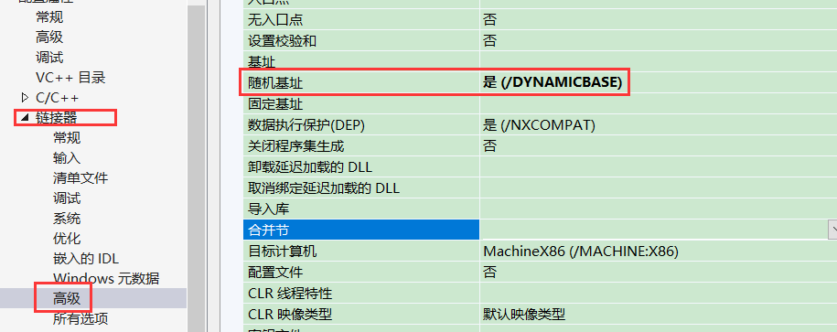
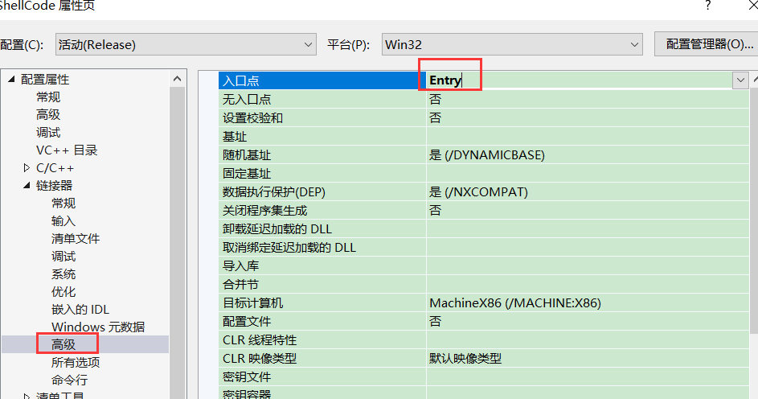
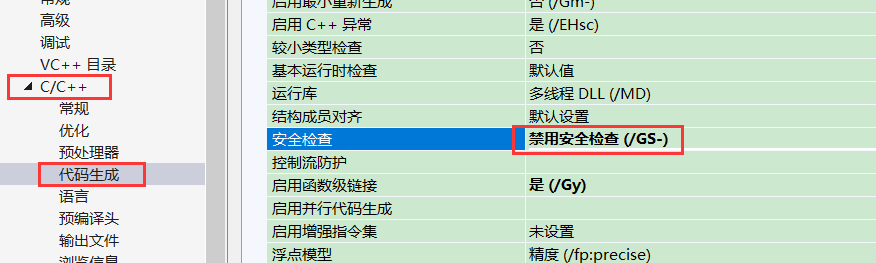
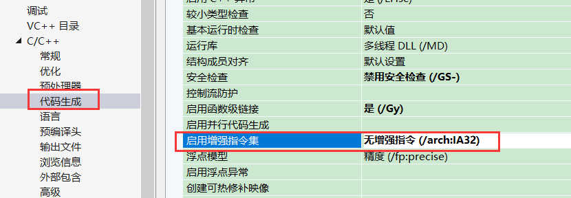
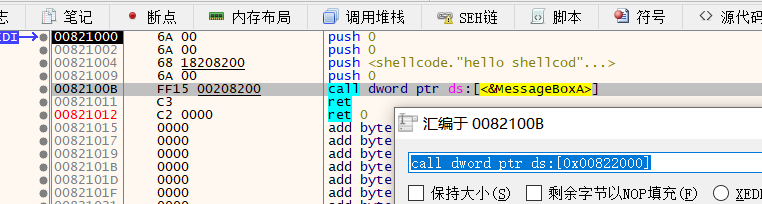
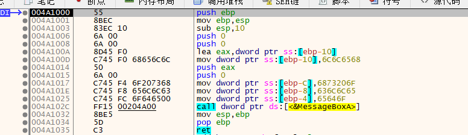
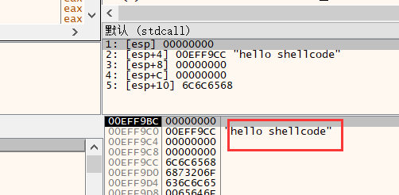

因为我们的能对任意可执行程序加壳,会导致壳代码在程序运行起来时的地址是不确定的,所以要求我们的壳代码放到任意地址上他都能够可以运行,这样就不用管地址问题.这个代码称为地址无关代码


 地址无关代码(shellcode) 

就是指令中不能有绝对地址,有绝对地址的需要进行重定位


VS实现 地址无关代码(shellcode)：

1用release版

因为 debug版会加很多一些额外的信息方便调试,而相当部分信息会生成全局变量

2开启随机基址




3不要main函数




4关闭GS




4关闭增强指令集



```
#include<windows.h>

void Entry() {
    MessageBox(NULL,"hello shellcod",NULL,MB_OK);
}
```

通过 x64打开,可以看到 MessageBox  依赖了一个绝对地址



常量字符串惠存到一个常量数据区,上面只给了一个地址,因此我们我们需要把它改成不依赖地址的,换句话说就是不让他把他放到数据区,可以放到栈上

```
#include<windows.h>

void Entry() {
    char  szText[] = { 'h','e','l','l','o',' ','s','h','e','l','l','c','o','d','e','\0' };
    MessageBox(NULL, szText,NULL,MB_OK);
}
```



可以看到字符串的绝对地址已经没了压到栈里面去了     数组的局部变量传参



那么接下来就是去掉调用函数的绝对地址了,直接调用函数肯定会生成导入表,那么就会生成依赖的绝对地址


因此可以先拿到  Kernel32 模块基址 (不用调api,直接去peb里面去拿)   再自己 实现  GetProcAddress拿到 LoadLibrary  和 系统  GetProcAddress 的地址,通过者2个api 就可以拿到剩下所有api.


获取Kernel32地址

```
HMODULE GetKernel32()
{
    HMODULE hKer = NULL;
    __asm
    {
        mov     eax, dword ptr fs : [0x30]
        mov     eax, dword ptr[eax + 0x0C]
        mov     eax, dword ptr[eax + 0x0C]
        mov     eax, dword ptr[eax]
        mov     eax, dword ptr[eax]
        mov     eax, dword ptr[eax + 0x18]
        mov hKer, eax
    }
    return hKer;
}
```

完整 ShellCode 代码

```
#pragma once

#include <windows.h>
#include <compressapi.h>


//GetProcAddress的函数定义
typedef FARPROC(WINAPI* PFN_GetProcAddress)
(
    _In_ HMODULE hModule,
    _In_ LPCSTR lpProcName
);

//LoadLibrary函数定义
typedef 
HMODULE(WINAPI* PFN_LoadLibraryA)
(
    _In_ LPCSTR lpLibFileName
);

//CreateCompressor函数定义(创建压缩句柄)
typedef 
BOOL(WINAPI* PFN_CreateDecompressor)
(
DWORD                         Algorithm,
PCOMPRESS_ALLOCATION_ROUTINES AllocationRoutines,
PDECOMPRESSOR_HANDLE          DecompressorHandle
);


//Decompress 函数定义
typedef
BOOL(WINAPI* PFN_Decompress)(
    DECOMPRESSOR_HANDLE DecompressorHandle,
    LPCVOID             CompressedData,
    SIZE_T              CompressedDataSize,
    PVOID               UncompressedBuffer,
    SIZE_T              UncompressedBufferSize,
    PSIZE_T             UncompressedDataSize
);


//VirtualAlloc申请内存
typedef
LPVOID(WINAPI* PFN_VirtualAlloc)(
    LPVOID lpAddress,
    SIZE_T dwSize,         
    DWORD flAllocationType,
    DWORD flProtect        
);

typedef
BOOL (WINAPI* PFN_VirtualProtect)(
    LPVOID lpAddress,     
    SIZE_T dwSize,         
    DWORD flNewProtect,   
    PDWORD lpflOldProtect 
);


//函数申明结构体
struct Environment {
    PFN_GetProcAddress      pfnGetProcAddress;
    PFN_LoadLibraryA        pfnLoadLibraryA;
    PFN_CreateDecompressor  pfnCreateDecompressor;
    PFN_Decompress          pfnDecompress;
    PFN_VirtualAlloc        pfnVirtualAlloc;
    PFN_VirtualProtect      pfnVirtualProtect;
};

HMODULE GetKernel32();
void* MyGetProcAddress(HMODULE hMod, LPCSTR lpFunName);
HMODULE GetModuleBase();
DWORD MyLoadLibrary(LPBYTE pPeBuf,Environment* pEnv);
void InitEnvironment(Environment* pEnv);
void* __cdecl Mymemcpy(void* dst, const void* src, size_t count);
int __cdecl Mymemcmp(const void* buf1, const void* buf2, size_t count);
void* __cdecl Mymemset(void* dst, int val, size_t count);
```

完整 ShellCode 代码

ShellCode.h

```
#pragma once

#include <windows.h>
#include <compressapi.h>


//GetProcAddress的函数定义
typedef FARPROC(WINAPI* PFN_GetProcAddress)
(
    _In_ HMODULE hModule,
    _In_ LPCSTR lpProcName
);

//LoadLibrary函数定义
typedef 
HMODULE(WINAPI* PFN_LoadLibraryA)
(
    _In_ LPCSTR lpLibFileName
);

//CreateCompressor函数定义(创建压缩句柄)
typedef 
BOOL(WINAPI* PFN_CreateDecompressor)
(
DWORD                         Algorithm,
PCOMPRESS_ALLOCATION_ROUTINES AllocationRoutines,
PDECOMPRESSOR_HANDLE          DecompressorHandle
);


//Decompress 函数定义
typedef
BOOL(WINAPI* PFN_Decompress)(
    DECOMPRESSOR_HANDLE DecompressorHandle,
    LPCVOID             CompressedData,
    SIZE_T              CompressedDataSize,
    PVOID               UncompressedBuffer,
    SIZE_T              UncompressedBufferSize,
    PSIZE_T             UncompressedDataSize
);


//VirtualAlloc申请内存
typedef
LPVOID(WINAPI* PFN_VirtualAlloc)(
    LPVOID lpAddress,
    SIZE_T dwSize,         
    DWORD flAllocationType,
    DWORD flProtect        
);

typedef
BOOL (WINAPI* PFN_VirtualProtect)(
    LPVOID lpAddress,     
    SIZE_T dwSize,         
    DWORD flNewProtect,   
    PDWORD lpflOldProtect 
);


//函数申明结构体
struct Environment {
    PFN_GetProcAddress      pfnGetProcAddress;
    PFN_LoadLibraryA        pfnLoadLibraryA;
    PFN_CreateDecompressor  pfnCreateDecompressor;
    PFN_Decompress          pfnDecompress;
    PFN_VirtualAlloc        pfnVirtualAlloc;
    PFN_VirtualProtect      pfnVirtualProtect;
};

HMODULE GetKernel32();
void* MyGetProcAddress(HMODULE hMod, LPCSTR lpFunName);
HMODULE GetModuleBase();
DWORD MyLoadLibrary(LPBYTE pPeBuf,Environment* pEnv);
void InitEnvironment(Environment* pEnv);
void* __cdecl Mymemcpy(void* dst, const void* src, size_t count);
int __cdecl Mymemcmp(const void* buf1, const void* buf2, size_t count);
void* __cdecl Mymemset(void* dst, int val, size_t count);
```

ShellCode.cpp

```
// ShellCode.cpp : 此文件包含 "main" 函数。程序执行将在此处开始并结束。
//
#include "ShellCode.h"


/*
    1.编写Release版程序
    2.打开随机基址
    3.去掉main函数,自己编写函数
    4.把自己写的函数设置为入口点
*/
void Entry() 
{


    //初始化所有函数API地址
    Environment env;
    InitEnvironment(&env);

    /***********************定位到压缩数据***********************/
    /*
        压缩数据节在本PE里的第二个节,就要解析本进程中的文件格式,从PE头后面定位到第二个节
        要定位PE头的话就要获取自己的模块基址了
    */
    LPBYTE pImageBase = (LPBYTE)GetModuleBase();

    //先定位到节表
    //解析DOS头
    auto pDosHdr = (PIMAGE_DOS_HEADER)pImageBase;
    //解析NT头
    auto pNtHdr = (PIMAGE_NT_HEADERS)(pImageBase + pDosHdr->e_lfanew);
    //解析节表(选项头地址+选项头大小)
    auto pSecHdr =(PIMAGE_SECTION_HEADER)(
                  (LPBYTE)&pNtHdr->OptionalHeader + pNtHdr->FileHeader.SizeOfOptionalHeader);
    //压缩数据节位置  = 模块基址+第二个节的内存偏移
    LPBYTE pComData = pImageBase + pSecHdr[1].VirtualAddress;


    /*******************解压缩***************************/
    DECOMPRESSOR_HANDLE hDecompressor = NULL;
    BOOL bSuccess = env.pfnCreateDecompressor(
        COMPRESS_ALGORITHM_XPRESS_HUFF, //  Compression Algorithm
        NULL,                           //  Optional allocation routine
        &hDecompressor);

    //获取压缩前大小,以及压缩后大小
    DWORD dwComSize = pSecHdr[1].PointerToRelocations; //压缩后大小
    DWORD dwDecomSize = pSecHdr[1].PointerToLinenumbers;//解压缩大小
    //申请空间
    LPBYTE pPEBuf = (LPBYTE)env.pfnVirtualAlloc(NULL, dwDecomSize, MEM_COMMIT, PAGE_READWRITE);

    DWORD dwDecompressedBufferSize = 0;
    bSuccess = env.pfnDecompress(
       hDecompressor,               // 句柄
       pComData,                    // 压缩数据 
       dwComSize,                   // 压缩数据大小
       pPEBuf,                      // 解压缩缓冲区
        dwDecomSize,                // 解压缩缓冲区大小
       &dwDecompressedBufferSize);

    /********************LoadPE*****************************/
    DWORD dwOep = MyLoadLibrary(pPEBuf, &env);
    
    __asm jmp dwOep;
}

//初始化所有函数指针
void InitEnvironment(Environment* pEnv) {
    //获取Kernel3地址
    HMODULE hKer = GetKernel32();

    //获取GetProcAddress地址
    char szGetProcAddress[] = { 'G','e','t','P','r','o','c','A','d','d','r','e','s','s','\0' };
    pEnv->pfnGetProcAddress = (PFN_GetProcAddress)MyGetProcAddress(hKer, szGetProcAddress);

    //获取LoadLibrary地址
    char szLoadLibrary[] = { 'L','o','a','d','L','i','b','r','a','r','y','A','\0' };
    pEnv->pfnLoadLibraryA = (PFN_LoadLibraryA)pEnv->pfnGetProcAddress(hKer, szLoadLibrary);

    //获取VirtualAlloc地址
    char szVirtualAlloc[] = { 'V','i','r','t','u','a','l','A','l','l','o','c','\0' };
    pEnv->pfnVirtualAlloc = (PFN_VirtualAlloc)pEnv->pfnGetProcAddress(hKer, szVirtualAlloc);

    //获取VirtualProtect地址
    char szVirtualProtect[] = { 'V','i','r','t','u','a','l','P','r','o','t','e','c','t','\0' };
    pEnv->pfnVirtualProtect = (PFN_VirtualProtect)pEnv->pfnGetProcAddress(hKer, szVirtualProtect);

    //获取Cabinet.dll的模块基址
    char szCab[] = { 'C','a','b','i','n','e','t','\0' };
    HMODULE hCab = pEnv->pfnLoadLibraryA(szCab);

    //获取CreateDecompressor地址
    char szCreateDecompressor[] = { 'C','r','e','a','t','e','D','e','c','o','m','p','r','e','s','s','o','r','\0'};
    pEnv->pfnCreateDecompressor = (PFN_CreateDecompressor)pEnv->pfnGetProcAddress(hCab, szCreateDecompressor);

    //获取Decompress地址
    char szDecompress[] = { 'D','e','c','o','m','p','r','e','s','s','\0'};
    pEnv->pfnDecompress = (PFN_Decompress)pEnv->pfnGetProcAddress(hCab, szDecompress);
}


//获取Kernel32基址
HMODULE GetKernel32() {
    HMODULE hKer;
    __asm {
        mov eax , dword ptr fs : [0x30]
        mov eax , dword ptr[eax + 0x0C]
        mov eax , dword ptr[eax + 0x0C]
        mov eax , dword ptr[eax]
        mov eax , dword ptr[eax]
        mov eax , dword ptr[eax + 0x18]
        mov hKer,eax
    }
    return hKer;
}

//获取自己的模块基址
HMODULE GetModuleBase() {
    HMODULE hBase;
    __asm {
        mov eax, dword ptr fs : [0x30]
        mov eax, dword ptr[eax + 0x0C]
        mov eax, dword ptr[eax + 0x0C]
        mov eax, dword ptr[eax + 0x18]
        mov hBase, eax
    }
    return hBase;
}


//GetProcAddress
void* MyGetProcAddress(HMODULE hMod, LPCSTR lpFunName)
{
    IMAGE_DOS_HEADER* pDosHeader = (IMAGE_DOS_HEADER*)hMod;                        //DOS头
    IMAGE_NT_HEADERS32* pNtHeader = (IMAGE_NT_HEADERS32*)((DWORD)hMod + pDosHeader->e_lfanew);      //NT头
    IMAGE_DATA_DIRECTORY* pExportDirectory = &pNtHeader->OptionalHeader.DataDirectory[0];        //导出表数据目录
    IMAGE_EXPORT_DIRECTORY* pExport = (IMAGE_EXPORT_DIRECTORY*)((DWORD)hMod + pExportDirectory->VirtualAddress);
    if ((DWORD)lpFunName > 0xffff)
    {   
        /*名称查找*/
        for (DWORD i = 0; i < pExport->NumberOfNames; i++)
        {
            char* pName = (char*)(*(DWORD*)((DWORD)hMod + pExport->AddressOfNames + i * 4) + (DWORD)hMod);
            if (strcmp(lpFunName, pName) == 0)
            {
                DWORD dwOrdinals = *(WORD*)((DWORD)hMod + pExport->AddressOfNameOrdinals + i * 2);
                return (void*)(*(DWORD*)((DWORD)hMod + pExport->AddressOfFunctions + dwOrdinals * 4) + (DWORD)hMod);
            }
        }
        return 0;
    }
    else
    {   
        /*序号查找*/
        DWORD dwOrdinals = (DWORD)lpFunName - pExport->Base;
        if (dwOrdinals >= pExport->NumberOfFunctions)
        {
            return 0;
        }
        return (void*)(*(DWORD*)((DWORD)hMod + pExport->AddressOfFunctions + dwOrdinals * 4) + (DWORD)hMod);
    }
    return 0;
}


//输入RVA，参数为 基址、NT头，返回值是所属节表指针
PIMAGE_SECTION_HEADER GetSectionHeader(DWORD RVA, PIMAGE_NT_HEADERS pNtHeader)
{
    PIMAGE_SECTION_HEADER pSectionHeader = IMAGE_FIRST_SECTION(pNtHeader);
    DWORD dwNumberOfSections = pNtHeader->FileHeader.NumberOfSections;
    for (DWORD i = 0; i < dwNumberOfSections; i++)
    {
        if (RVA >= pSectionHeader->VirtualAddress && RVA < pSectionHeader->VirtualAddress + pSectionHeader->Misc.VirtualSize)
        {
            return pSectionHeader;
        }
        pSectionHeader++;
    }
    return NULL;
}
DWORD MyLoadLibrary(LPBYTE pPeBuf, Environment* pEnv)
{

    LPVOID pFileMap = pPeBuf;

    PIMAGE_DOS_HEADER pDosHdr = NULL;
    PIMAGE_NT_HEADERS pNtHdr = NULL;
    PIMAGE_FILE_HEADER pFileHdr = NULL;
    PIMAGE_OPTIONAL_HEADER pOptionalHdr = NULL;
    PIMAGE_SECTION_HEADER pSecHdr = NULL;

    PIMAGE_BASE_RELOCATION pBaseReloc = NULL;
    DWORD dwBaseRelocSize = 0;//重定位表大小
    DWORD dwReadRelocSize = 0;//已读重定位表大小

    DWORD dwNumberOfSections = 0;
    DWORD dwFileHeaderSize = 0;
    DWORD dwImageSize = 0;
    DWORD dwEntry = 0;
    DWORD dwOldProtect = 0;

    DWORD dwRelocBase = 0;//重定位基址


    //1. 获取DOS头
    pDosHdr = (PIMAGE_DOS_HEADER)pFileMap;
    //2. 获取NT头
    pNtHdr = (PIMAGE_NT_HEADERS)((char*)pDosHdr + pDosHdr->e_lfanew);
    //3. 获取文件头 和 可选头
    pFileHdr = &pNtHdr->FileHeader;
    pOptionalHdr = &pNtHdr->OptionalHeader;

    //获取文件头大小 和 内存大小
    dwFileHeaderSize = pOptionalHdr->SizeOfHeaders;
    dwImageSize = pOptionalHdr->SizeOfImage;

    //获取数据目录数据
    pBaseReloc = (PIMAGE_BASE_RELOCATION)pOptionalHdr->DataDirectory[IMAGE_DIRECTORY_ENTRY_BASERELOC].VirtualAddress;
    dwBaseRelocSize = pOptionalHdr->DataDirectory[IMAGE_DIRECTORY_ENTRY_BASERELOC].Size;

    HMODULE hMod = GetModuleBase();
    dwRelocBase = ((DWORD)hMod - pOptionalHdr->ImageBase);
    //4. 获取节表数量 和 首地址
    dwNumberOfSections = pFileHdr->NumberOfSections;
    pSecHdr = (PIMAGE_SECTION_HEADER)((DWORD)pOptionalHdr + pFileHdr->SizeOfOptionalHeader);
    //5. 获取基址 和 OEP
    dwEntry = (DWORD)hMod + pOptionalHdr->AddressOfEntryPoint;


    //拷贝文件头
    //修改内存属性为 可读可写可执行
    pEnv->pfnVirtualProtect((LPVOID)hMod, dwFileHeaderSize, PAGE_EXECUTE_READWRITE, &dwOldProtect);
    Mymemcpy((LPVOID)hMod, pDosHdr, dwFileHeaderSize);
    pEnv->pfnVirtualProtect((LPVOID)hMod, dwFileHeaderSize, dwOldProtect, &dwOldProtect);

    //拷贝节区
    for (int i = 0; i < dwNumberOfSections; i++)
    {
        PIMAGE_SECTION_HEADER pSection = pSecHdr + i;
        LPVOID dwDest = (char*)hMod + pSection->VirtualAddress;
        LPVOID dwSrc = (char*)pFileMap + pSection->PointerToRawData;
        //拷贝内存
        pEnv->pfnVirtualProtect(dwDest, pSection->SizeOfRawData, PAGE_EXECUTE_READWRITE, &dwOldProtect);
        Mymemcpy(dwDest, dwSrc, pSection->SizeOfRawData);
        pEnv->pfnVirtualProtect(dwDest, pSection->SizeOfRawData, dwOldProtect, &dwOldProtect);
    }
    //帮忙导入IAT
    //空导入表信息
    IMAGE_IMPORT_DESCRIPTOR ZeroIID = { 0 };

    //获取导入表地址
    DWORD dwIID = pNtHdr->OptionalHeader.DataDirectory[IMAGE_DIRECTORY_ENTRY_IMPORT].VirtualAddress;
    //寻找符合的节并计算出VA地址
    BOOL bRet = FALSE;
    DWORD dwDiff = GetSectionHeader(dwIID, pNtHdr)->VirtualAddress - GetSectionHeader(dwIID, pNtHdr)->PointerToRawData;
    dwIID = dwIID - dwDiff;

    PIMAGE_IMPORT_DESCRIPTOR pItem = (PIMAGE_IMPORT_DESCRIPTOR)((DWORD)pFileMap + dwIID);
    while (true)
    {
        if (pItem->Name == NULL || pItem->FirstThunk == NULL)
        {
            //遍历结束
            break;
        }
        //加载DLL
        HMODULE hDll = pEnv->pfnLoadLibraryA((LPCSTR)((DWORD)pFileMap + pItem->Name - dwDiff));
        if (hDll == nullptr)
        {
            break;
        }
        //判断OriginalFirstThunk（INT）是否存在
        PDWORD pINT = (PDWORD)pItem->FirstThunk;
        if (pItem->OriginalFirstThunk != NULL)
        {
            pINT = (PDWORD)pItem->OriginalFirstThunk;
        }
        pINT = (PDWORD)((DWORD)pFileMap + (DWORD)pINT - dwDiff);
        DWORD dwIATaddr = pItem->FirstThunk + (DWORD)hMod;

        //遍历导入名称表
        while (*pINT != NULL)
        {
            //判断是否是序号
            DWORD dwFuncAddr = 0;
            if (*pINT & 0x80000000)
            {
                //序号导入
                dwFuncAddr = (DWORD)pEnv->pfnGetProcAddress(hDll, (LPCSTR)LOWORD(*pINT));
            }
            else
            {
                dwFuncAddr = (DWORD)pEnv->pfnGetProcAddress(hDll, (LPCSTR)((DWORD)pFileMap + sizeof WORD + *(PDWORD)pINT - dwDiff));
            }
            pEnv->pfnVirtualProtect((LPVOID)dwIATaddr, 1, PAGE_EXECUTE_READWRITE, &dwOldProtect);
            *(DWORD*)dwIATaddr = dwFuncAddr;
            pEnv->pfnVirtualProtect((LPVOID)dwIATaddr, 1, dwOldProtect, &dwOldProtect);
            pINT++;
            dwIATaddr += 4;
        }

        pItem++;
    }

    //修复重定位
    if (pBaseReloc == NULL) {
        return dwEntry;
    }
    PIMAGE_SECTION_HEADER pBaseSecHdr = GetSectionHeader((DWORD)pBaseReloc, pNtHdr);
    pBaseReloc = (IMAGE_BASE_RELOCATION*)((DWORD)pFileMap + (DWORD)pBaseReloc - pBaseSecHdr->VirtualAddress + pBaseSecHdr->PointerToRawData);

    for (; dwReadRelocSize < dwBaseRelocSize;)
    {

        DWORD dwPageOff = pBaseReloc->VirtualAddress;

        LPWORD pRelocData = (LPWORD)((DWORD)pBaseReloc + sizeof(IMAGE_BASE_RELOCATION));

        DWORD dwItemCount = (pBaseReloc->SizeOfBlock - sizeof(IMAGE_BASE_RELOCATION)) / sizeof(WORD);
        //遍历数据
        for (size_t i = 0; i < dwItemCount; i++)
        {
            WORD wData = pRelocData[i];
            if (wData & 0x3000)
            {
                //如果是需要重定位的
                DWORD dwAddr = (DWORD)hMod + dwPageOff + (wData & 0x0FFF);
                *(DWORD*)dwAddr += dwRelocBase;
            }
        }


        dwReadRelocSize += pBaseReloc->SizeOfBlock;
        pBaseReloc = (PIMAGE_BASE_RELOCATION)((DWORD)pBaseReloc + pBaseReloc->SizeOfBlock);
    }

    return dwEntry;
}

void* __cdecl Mymemcpy(void* dst, const void* src,size_t count) {

    void* ret = dst;

    while (count--) {
        *(char*)dst = *(char*)src;
        dst = (char*)dst + 1;
        src = (char*)src + 1;
    }
    return (ret);
}

int __cdecl Mymemcmp( const void* buf1,const void* buf2,size_t count)
{
    if (!count)
        return(0);

    while (--count && *(char*)buf1 == *(char*)buf2) {
        buf1 = (char*)buf1 + 1;
        buf2 = (char*)buf2 + 1;
    }

    return(*((unsigned char*)buf1) - *((unsigned char*)buf2));
}

void* __cdecl Mymemset(void* dst,int val,size_t count)
{
    void* start = dst;
    while (count--) {
        *(char*)dst = (char)val;
        dst = (char*)dst + 1;
    }
    return(start);
}
```

确定没有绝对对地址  :  通过 OD或者x64打开 ,没有存在下划线的地址


通过 winhex 把源码复制出来


```
unsigned AnsiChar data[1487] = {
    0x55, 0x8B, 0xEC, 0x83, 0xEC, 0x48, 0x8D, 0x4D, 0xB8, 0xE8, 0xD2, 0x00, 0x00, 0x00, 0xE8, 0x9D,
    0x02, 0x00, 0x00, 0x89, 0x45, 0xFC, 0x8B, 0x45, 0xFC, 0x89, 0x45, 0xE4, 0x8B, 0x4D, 0xE4, 0x8B,
    0x55, 0xFC, 0x03, 0x51, 0x3C, 0x89, 0x55, 0xF4, 0x8B, 0x45, 0xF4, 0x0F, 0xB7, 0x48, 0x14, 0x8B,
    0x55, 0xF4, 0x8D, 0x44, 0x0A, 0x18, 0x89, 0x45, 0xF8, 0xB9, 0x28, 0x00, 0x00, 0x00, 0xC1, 0xE1,
    0x00, 0x8B, 0x55, 0xF8, 0x8B, 0x45, 0xFC, 0x03, 0x44, 0x0A, 0x0C, 0x89, 0x45, 0xD8, 0xC7, 0x45,
    0xEC, 0x00, 0x00, 0x00, 0x00, 0x8D, 0x4D, 0xEC, 0x51, 0x6A, 0x00, 0x6A, 0x04, 0xFF, 0x55, 0xC0,
    0x89, 0x45, 0xD4, 0xBA, 0x28, 0x00, 0x00, 0x00, 0xC1, 0xE2, 0x00, 0x8B, 0x45, 0xF8, 0x8B, 0x4C,
    0x10, 0x18, 0x89, 0x4D, 0xDC, 0xBA, 0x28, 0x00, 0x00, 0x00, 0xC1, 0xE2, 0x00, 0x8B, 0x45, 0xF8,
    0x8B, 0x4C, 0x10, 0x1C, 0x89, 0x4D, 0xF0, 0x6A, 0x04, 0x68, 0x00, 0x10, 0x00, 0x00, 0x8B, 0x55,
    0xF0, 0x52, 0x6A, 0x00, 0xFF, 0x55, 0xC8, 0x89, 0x45, 0xE8, 0xC7, 0x45, 0xE0, 0x00, 0x00, 0x00,
    0x00, 0x8D, 0x45, 0xE0, 0x50, 0x8B, 0x4D, 0xF0, 0x51, 0x8B, 0x55, 0xE8, 0x52, 0x8B, 0x45, 0xDC,
    0x50, 0x8B, 0x4D, 0xD8, 0x51, 0x8B, 0x55, 0xEC, 0x52, 0xFF, 0x55, 0xC4, 0x89, 0x45, 0xD4, 0x8D,
    0x55, 0xB8, 0x8B, 0x4D, 0xE8, 0xE8, 0x06, 0x02, 0x00, 0x00, 0x89, 0x45, 0xD0, 0xFF, 0x65, 0xD0,
    0x8B, 0xE5, 0x5D, 0xC3, 0xCC, 0xCC, 0xCC, 0xCC, 0xCC, 0xCC, 0xCC, 0xCC, 0xCC, 0xCC, 0xCC, 0xCC,
    0x55, 0x8B, 0xEC, 0x83, 0xEC, 0x78, 0x53, 0x56, 0x57, 0x8B, 0xF9, 0x89, 0x7D, 0xFC, 0x64, 0xA1,
    0x30, 0x00, 0x00, 0x00, 0x8B, 0x40, 0x0C, 0x8B, 0x40, 0x0C, 0x8B, 0x00, 0x8B, 0x00, 0x8B, 0x40,
    0x18, 0x89, 0x45, 0xF8, 0x8B, 0x5D, 0xF8, 0x8D, 0x4D, 0xAC, 0xC7, 0x45, 0xAC, 0x47, 0x65, 0x74,
    0x50, 0xC7, 0x45, 0xB0, 0x72, 0x6F, 0x63, 0x41, 0xC7, 0x45, 0xB4, 0x64, 0x64, 0x72, 0x65, 0x8B,
    0x43, 0x3C, 0x66, 0xC7, 0x45, 0xB8, 0x73, 0x73, 0xC6, 0x45, 0xBA, 0x00, 0x8B, 0x44, 0x18, 0x78,
    0x03, 0xC3, 0x89, 0x45, 0xF0, 0x81, 0xF9, 0xFF, 0xFF, 0x00, 0x00, 0x76, 0x68, 0x8B, 0x48, 0x18,
    0x33, 0xFF, 0x89, 0x4D, 0xF4, 0x85, 0xC9, 0x74, 0x40, 0x8B, 0x70, 0x20, 0x03, 0xF3, 0x8B, 0xFF,
    0x8B, 0x06, 0x8D, 0x4D, 0xAC, 0x03, 0xC3, 0x8A, 0x11, 0x3A, 0x10, 0x75, 0x1A, 0x84, 0xD2, 0x74,
    0x12, 0x8A, 0x51, 0x01, 0x3A, 0x50, 0x01, 0x75, 0x0E, 0x83, 0xC1, 0x02, 0x83, 0xC0, 0x02, 0x84,
    0xD2, 0x75, 0xE4, 0x33, 0xC0, 0xEB, 0x05, 0x1B, 0xC0, 0x83, 0xC8, 0x01, 0x85, 0xC0, 0x74, 0x10,
    0x47, 0x83, 0xC6, 0x04, 0x3B, 0x7D, 0xF4, 0x72, 0xC7, 0x8B, 0x7D, 0xFC, 0x33, 0xC0, 0xEB, 0x2F,
    0x8B, 0x55, 0xF0, 0x8B, 0x42, 0x24, 0x8D, 0x04, 0x78, 0x8B, 0x7D, 0xFC, 0x0F, 0xB7, 0x0C, 0x18,
    0x8B, 0x42, 0x1C, 0xEB, 0x12, 0x8D, 0x4D, 0xAC, 0x2B, 0x48, 0x10, 0x3B, 0x48, 0x14, 0x72, 0x04,
    0x33, 0xC0, 0xEB, 0x0B, 0x8B, 0x40, 0x1C, 0x8D, 0x04, 0x88, 0x8B, 0x04, 0x18, 0x03, 0xC3, 0x8D,
    0x4D, 0xCC, 0x89, 0x07, 0x51, 0x53, 0xC7, 0x45, 0xCC, 0x4C, 0x6F, 0x61, 0x64, 0xC7, 0x45, 0xD0,
    0x4C, 0x69, 0x62, 0x72, 0xC7, 0x45, 0xD4, 0x61, 0x72, 0x79, 0x41, 0xC6, 0x45, 0xD8, 0x00, 0xFF,
    0xD0, 0x89, 0x47, 0x04, 0x8D, 0x45, 0xBC, 0x50, 0x8B, 0x07, 0x53, 0xC7, 0x45, 0xBC, 0x56, 0x69,
    0x72, 0x74, 0xC7, 0x45, 0xC0, 0x75, 0x61, 0x6C, 0x41, 0xC7, 0x45, 0xC4, 0x6C, 0x6C, 0x6F, 0x63,
    0xC6, 0x45, 0xC8, 0x00, 0xFF, 0xD0, 0x89, 0x47, 0x10, 0x8D, 0x45, 0x9C, 0x50, 0x8B, 0x07, 0x53,
    0xC7, 0x45, 0x9C, 0x56, 0x69, 0x72, 0x74, 0xC7, 0x45, 0xA0, 0x75, 0x61, 0x6C, 0x50, 0xC7, 0x45,
    0xA4, 0x72, 0x6F, 0x74, 0x65, 0x66, 0xC7, 0x45, 0xA8, 0x63, 0x74, 0xC6, 0x45, 0xAA, 0x00, 0xFF,
    0xD0, 0x89, 0x47, 0x14, 0x8D, 0x45, 0xE8, 0x50, 0x8B, 0x47, 0x04, 0xC7, 0x45, 0xE8, 0x43, 0x61,
    0x62, 0x69, 0xC7, 0x45, 0xEC, 0x6E, 0x65, 0x74, 0x00, 0xFF, 0xD0, 0x8B, 0xF0, 0xC7, 0x45, 0x88,
    0x43, 0x72, 0x65, 0x61, 0x8D, 0x45, 0x88, 0xC7, 0x45, 0x8C, 0x74, 0x65, 0x44, 0x65, 0x50, 0x8B,
    0x07, 0x56, 0xC7, 0x45, 0x90, 0x63, 0x6F, 0x6D, 0x70, 0xC7, 0x45, 0x94, 0x72, 0x65, 0x73, 0x73,
    0x66, 0xC7, 0x45, 0x98, 0x6F, 0x72, 0xC6, 0x45, 0x9A, 0x00, 0xFF, 0xD0, 0x89, 0x47, 0x08, 0x8D,
    0x45, 0xDC, 0x50, 0x8B, 0x07, 0x56, 0xC7, 0x45, 0xDC, 0x44, 0x65, 0x63, 0x6F, 0xC7, 0x45, 0xE0,
    0x6D, 0x70, 0x72, 0x65, 0x66, 0xC7, 0x45, 0xE4, 0x73, 0x73, 0xC6, 0x45, 0xE6, 0x00, 0xFF, 0xD0,
    0x89, 0x47, 0x0C, 0x5F, 0x5E, 0x5B, 0x8B, 0xE5, 0x5D, 0xC3, 0xCC, 0xCC, 0xCC, 0xCC, 0xCC, 0xCC,
    0x55, 0x8B, 0xEC, 0x51, 0x64, 0xA1, 0x30, 0x00, 0x00, 0x00, 0x8B, 0x40, 0x0C, 0x8B, 0x40, 0x0C,
    0x8B, 0x40, 0x18, 0x89, 0x45, 0xFC, 0x8B, 0x45, 0xFC, 0x8B, 0xE5, 0x5D, 0xC3, 0xCC, 0xCC, 0xCC,
    0x55, 0x8B, 0xEC, 0x83, 0xEC, 0x38, 0x8B, 0xC1, 0xC7, 0x45, 0xFC, 0x00, 0x00, 0x00, 0x00, 0x53,
    0x56, 0x57, 0x8B, 0xFA, 0x89, 0x45, 0xF8, 0x8B, 0x50, 0x3C, 0x03, 0xD0, 0x89, 0x7D, 0xF0, 0x8B,
    0x82, 0xA0, 0x00, 0x00, 0x00, 0x8D, 0x72, 0x18, 0x8B, 0x4E, 0x3C, 0x89, 0x45, 0xCC, 0x8B, 0x86,
    0x8C, 0x00, 0x00, 0x00, 0xC7, 0x45, 0xDC, 0x00, 0x00, 0x00, 0x00, 0x89, 0x55, 0xE0, 0x89, 0x4D,
    0xEC, 0x89, 0x45, 0xD8, 0x64, 0xA1, 0x30, 0x00, 0x00, 0x00, 0x8B, 0x40, 0x0C, 0x8B, 0x40, 0x0C,
    0x8B, 0x40, 0x18, 0x89, 0x45, 0xD4, 0x8B, 0x45, 0xD4, 0x0F, 0xB7, 0x5A, 0x06, 0x89, 0x45, 0xF4,
    0x2B, 0x46, 0x1C, 0x89, 0x45, 0xC8, 0x0F, 0xB7, 0x42, 0x14, 0x03, 0xC6, 0x89, 0x5D, 0xE4, 0x89,
    0x45, 0xD0, 0x8B, 0x46, 0x10, 0x8B, 0x75, 0xF4, 0x03, 0xC6, 0x89, 0x45, 0xE8, 0x8D, 0x45, 0xFC,
    0x50, 0x8B, 0x47, 0x14, 0x6A, 0x40, 0x51, 0x56, 0xFF, 0xD0, 0x8B, 0x45, 0xEC, 0x8B, 0xD0, 0x8B,
    0x4D, 0xF8, 0x85, 0xC0, 0x74, 0x1E, 0x2B, 0xF1, 0xEB, 0x06, 0x8D, 0x9B, 0x00, 0x00, 0x00, 0x00,
    0x8A, 0x01, 0x8D, 0x49, 0x01, 0x88, 0x44, 0x31, 0xFF, 0x83, 0xEA, 0x01, 0x75, 0xF2, 0x8B, 0x45,
    0xEC, 0x8B, 0x75, 0xF4, 0x8D, 0x4D, 0xFC, 0x51, 0xFF, 0x75, 0xFC, 0x50, 0x8B, 0x47, 0x14, 0x56,
    0xFF, 0xD0, 0x85, 0xDB, 0x74, 0x5D, 0x8B, 0x5D, 0xD0, 0x83, 0xC3, 0x10, 0x8D, 0x64, 0x24, 0x00,
    0x8B, 0x43, 0xFC, 0x8D, 0x4D, 0xFC, 0x51, 0x03, 0xC6, 0x8B, 0x73, 0x04, 0x03, 0x75, 0xF8, 0x6A,
    0x40, 0xFF, 0x33, 0x89, 0x45, 0xEC, 0x50, 0x8B, 0x47, 0x14, 0xFF, 0xD0, 0x8B, 0x0B, 0x85, 0xC9,
    0x74, 0x15, 0x8B, 0x55, 0xEC, 0x2B, 0xD6, 0x8A, 0x06, 0x8D, 0x76, 0x01, 0x88, 0x44, 0x16, 0xFF,
    0x83, 0xE9, 0x01, 0x75, 0xF2, 0x8B, 0x0B, 0x8D, 0x45, 0xFC, 0x50, 0xFF, 0x75, 0xFC, 0x8B, 0x47,
    0x14, 0x51, 0xFF, 0x75, 0xEC, 0xFF, 0xD0, 0x8B, 0x75, 0xF4, 0x83, 0xC3, 0x28, 0x83, 0x6D, 0xE4,
    0x01, 0x75, 0xAD, 0x8B, 0x75, 0xE0, 0x0F, 0xB7, 0x46, 0x14, 0x8D, 0x4E, 0x18, 0x8B, 0x9E, 0x80,
    0x00, 0x00, 0x00, 0x03, 0xC8, 0x0F, 0xB7, 0x76, 0x06, 0x33, 0xC0, 0x89, 0x75, 0xEC, 0x8B, 0xD1,
    0x89, 0x45, 0xE4, 0x85, 0xF6, 0x74, 0x1F, 0x8B, 0x72, 0x0C, 0x3B, 0xDE, 0x72, 0x0C, 0x8B, 0x42,
    0x08, 0x03, 0xC6, 0x3B, 0xD8, 0x72, 0x11, 0x8B, 0x45, 0xE4, 0x40, 0x83, 0xC2, 0x28, 0x89, 0x45,
    0xE4, 0x3B, 0x45, 0xEC, 0x72, 0xE1, 0x33, 0xD2, 0x8B, 0x45, 0xEC, 0x33, 0xF6, 0x85, 0xC0, 0x74,
    0x1A, 0x3B, 0x59, 0x0C, 0x72, 0x0D, 0x8B, 0x41, 0x08, 0x03, 0x41, 0x0C, 0x3B, 0xD8, 0x72, 0x0D,
    0x8B, 0x45, 0xEC, 0x46, 0x83, 0xC1, 0x28, 0x3B, 0xF0, 0x72, 0xE6, 0x33, 0xC9, 0x8B, 0x72, 0x0C,
    0x2B, 0x71, 0x14, 0x8B, 0x4D, 0xF8, 0x2B, 0xDE, 0x03, 0xD9, 0x89, 0x75, 0xEC, 0x89, 0x5D, 0xE4,
    0x8B, 0x43, 0x0C, 0x85, 0xC0, 0x0F, 0x84, 0xB6, 0x00, 0x00, 0x00, 0xEB, 0x06, 0x8D, 0x49, 0x00,
    0x8B, 0x4D, 0xF8, 0x83, 0x7B, 0x10, 0x00, 0x0F, 0x84, 0xA4, 0x00, 0x00, 0x00, 0x2B, 0xC6, 0x03,
    0xC1, 0x50, 0x8B, 0x47, 0x04, 0xFF, 0xD0, 0x8B, 0xD0, 0x89, 0x55, 0xD0, 0x85, 0xD2, 0x0F, 0x84,
    0x8D, 0x00, 0x00, 0x00, 0x8B, 0x03, 0x8B, 0x4B, 0x10, 0x8B, 0xF9, 0x85, 0xC0, 0x74, 0x02, 0x8B,
    0xF8, 0x8B, 0x45, 0xF8, 0x2B, 0xC6, 0x8B, 0x75, 0xF4, 0x03, 0xF8, 0x03, 0xF1, 0x8B, 0x07, 0x85,
    0xC0, 0x74, 0x57, 0x8B, 0x4D, 0xF0, 0x8B, 0x09, 0x85, 0xC0, 0x79, 0x05, 0x0F, 0xB7, 0xC0, 0xEB,
    0x0B, 0x8B, 0x5D, 0xF8, 0x2B, 0x45, 0xEC, 0x83, 0xC3, 0x02, 0x03, 0xC3, 0x50, 0x52, 0xFF, 0xD1,
    0x8B, 0xD8, 0x8D, 0x45, 0xFC, 0x50, 0x8B, 0x45, 0xF0, 0x6A, 0x40, 0x6A, 0x01, 0x56, 0x8B, 0x40,
    0x14, 0xFF, 0xD0, 0x8D, 0x45, 0xFC, 0x89, 0x1E, 0x50, 0xFF, 0x75, 0xFC, 0x8B, 0x45, 0xF0, 0x6A,
    0x01, 0x56, 0x8B, 0x40, 0x14, 0xFF, 0xD0, 0x8B, 0x47, 0x04, 0x83, 0xC7, 0x04, 0x8B, 0x55, 0xD0,
    0x83, 0xC6, 0x04, 0x85, 0xC0, 0x75, 0xAC, 0x8B, 0x5D, 0xE4, 0x8B, 0x43, 0x20, 0x83, 0xC3, 0x14,
    0x8B, 0x7D, 0xF0, 0x8B, 0x75, 0xEC, 0x89, 0x5D, 0xE4, 0x85, 0xC0, 0x0F, 0x85, 0x4F, 0xFF, 0xFF,
    0xFF, 0x8B, 0x5D, 0xCC, 0x85, 0xDB, 0x0F, 0x84, 0x89, 0x00, 0x00, 0x00, 0x8B, 0x55, 0xE0, 0x0F,
    0xB7, 0x42, 0x14, 0x8D, 0x4A, 0x18, 0x0F, 0xB7, 0x7A, 0x06, 0x03, 0xC8, 0x33, 0xD2, 0x85, 0xFF,
    0x74, 0x18, 0x8B, 0x71, 0x0C, 0x3B, 0xDE, 0x72, 0x09, 0x8B, 0x41, 0x08, 0x03, 0xC6, 0x3B, 0xD8,
    0x72, 0x0A, 0x42, 0x83, 0xC1, 0x28, 0x3B, 0xD7, 0x72, 0xE8, 0x33, 0xC9, 0x8B, 0x41, 0x14, 0x2B,
    0x41, 0x0C, 0x03, 0x45, 0xF8, 0x03, 0xD8, 0x83, 0x7D, 0xD8, 0x00, 0x76, 0x48, 0x8B, 0x7D, 0xF4,
    0x8B, 0x43, 0x04, 0xB9, 0x00, 0x00, 0x00, 0x00, 0x8B, 0x33, 0x8D, 0x50, 0xF8, 0xD1, 0xEA, 0x74,
    0x25, 0x0F, 0xB7, 0x44, 0x4B, 0x08, 0xA9, 0x00, 0x30, 0x00, 0x00, 0x74, 0x11, 0x25, 0xFF, 0x0F,
    0x00, 0x00, 0x03, 0xC6, 0x03, 0xC7, 0x8B, 0x7D, 0xC8, 0x01, 0x38, 0x8B, 0x7D, 0xF4, 0x41, 0x3B,
    0xCA, 0x72, 0xDE, 0x8B, 0x43, 0x04, 0x8B, 0x4D, 0xDC, 0x03, 0xD8, 0x03, 0xC8, 0x89, 0x4D, 0xDC,
    0x3B, 0x4D, 0xD8, 0x72, 0xBB, 0x8B, 0x45, 0xE8, 0x5F, 0x5E, 0x5B, 0x8B, 0xE5, 0x5D, 0xC3
};
```

#### 最终加壳源码

```
#pragma once
class CPacker
{
public:
    //加壳函数 参数为原路径和目标路径
    bool Pack(CString strSrc, CString strDst);

private:
    //计算对齐值
    DWORD GetAlign(DWORD dwValue, DWORD dwAlign);
//解析原PE
private:
    /*
        解析原PE要获取到原PE的DOS头和NT头,拿到NT头就能拿到文件头和选项头了
        还需要获取节表数据
    */
    HANDLE m_hFile; //文件句柄
    HANDLE m_hFileMap; //文件映射句柄
    LPBYTE m_pSrcPe; //文件映射缓冲区
    DWORD  m_dwSrcPeSize;// PE大小
    PIMAGE_DOS_HEADER m_pDosHdr; //DOS头
    PIMAGE_NT_HEADERS m_pNtHdr;//NT头
    PIMAGE_SECTION_HEADER m_pSecHdr; //节表
    //获取原PE数据
    bool AnalyzePe(CString strSrc);

//压缩数据
private: 
    LPBYTE m_pComData; //压缩后的数据缓冲区
    DWORD m_dwComSize;//压缩后的数据大小
    bool GetCompressData();//获取压缩数据
    
//壳代码
private:
    LPBYTE m_pCode; //壳代码(解压缩代码)
    DWORD m_dwCodeSize;//代码大小
    bool GetCode(); //获取壳代码

//准备压缩数据节
private:
    LPBYTE m_pComSec;//数据节
    DWORD m_dwComSecSize;//数据节大小
    void GetComSec(); //获取数据节数据
//准备代码节
private:
    LPBYTE m_pCodeSec;//代码节
    DWORD m_dwCodeSecSize;//代码节大小
    void GetCodeSec();//获取代码节数据

//构造节表
private:
    IMAGE_SECTION_HEADER m_newSecHdr[3]; //新的节表
    void GetNewSectionHeaders();//获取新节表
//构造PE头
private:
    LPBYTE m_pNewPeHdr; //PE头数据
    DWORD m_dwNewPeHdrSize; //PE头大小
    void GetNewPeHdr();//获取新PE头

//写入文件
private:
    bool WriteNewPe(CString strNewPe);
};


```

```
#include "pch.h"
#include "CPacker.h"
#include <compressapi.h>
#pragma comment(lib,"Cabinet.lib")
//加壳
bool CPacker::Pack(CString strSrc, CString strDst)
{
    //1. 解析原PE,获取原PE数据
    if (!AnalyzePe(strSrc)) {
        return false;
    }

    //2. 获取压缩数据
    if (!GetCompressData()) {
        return false;
    }
    //3.获取解压缩代码(解压缩代码暂时没有)
    if (!GetCode()) {
        return false;
    }

    //4.合成新PE
    // 4.1 准备压缩数据节
    GetComSec();
    // 4.2 准备壳代码节
    GetCodeSec();
    // 4.3 构造节表
    GetNewSectionHeaders();
    // 4.4 构造PE头
    GetNewPeHdr();

    //5. 写入文件
    if (!WriteNewPe(strDst)) {
        return false;
    }
    return true;
}

//计算对齐值
DWORD CPacker::GetAlign(DWORD dwValue, DWORD dwAlign)
{
    /*
        dwValue :要对齐的值
        dwAlign :对齐值
        比如:
        dwValue = 0x5843;
        dwAlign = 0x1000;
        return 0x6000;
    */
    if (dwValue % dwAlign == 0) {
        //等于0就是已经对齐了
        return dwValue;
    }
    else {
        //先除然后+1再*
        return (dwValue / dwAlign + 1) * dwAlign;
    }
}

//获取原PE数据
bool CPacker::AnalyzePe(CString strSrc)
{
    m_hFile = CreateFile(strSrc,    
        GENERIC_READ,      //读        
        FILE_SHARE_READ,          
        NULL,                     
        OPEN_EXISTING,    //打开已存在的        
        FILE_ATTRIBUTE_NORMAL,    
        NULL);                    

    if (m_hFile == INVALID_HANDLE_VALUE)
    {
        AfxMessageBox(_T("Could not open file."));  
        return false;
    }
    //获取文件大小
    m_dwSrcPeSize = GetFileSize(m_hFile, NULL);//高位直接不要了,
    //创建文件映射
    m_hFileMap = CreateFileMapping(m_hFile,
        NULL,                              
        PAGE_READONLY,   //只读                  
        0,                                 
        0,                                 
        NULL);            

    if (m_hFileMap == NULL)
    {
        AfxMessageBox(_T("创建文件映射失败"));
        return false;
    }

    //映射文件数据到缓冲区
    m_pSrcPe = (LPBYTE)MapViewOfFile(m_hFileMap,
        FILE_MAP_READ, //只读
        0,                                
        0,                                
        0 //整个文件映射进来
    );                                

    if (m_pSrcPe == NULL)
    {
        AfxMessageBox(_T("映射文件数据失败"));
        return false;
    }

    //获取DOS头
    m_pDosHdr = (PIMAGE_DOS_HEADER)m_pSrcPe;
    //获取NT头
    m_pNtHdr = (PIMAGE_NT_HEADERS)((DWORD)m_pSrcPe + m_pDosHdr->e_lfanew);
    //获取节表(选项头地址+选项头大小)
    m_pSecHdr = (PIMAGE_SECTION_HEADER)((DWORD)&m_pNtHdr->OptionalHeader + m_pNtHdr->FileHeader.SizeOfOptionalHeader);

    //检查格式...


    return true;
}

//获取压缩数据
bool CPacker::GetCompressData()
{

    COMPRESSOR_HANDLE hCompressor = NULL; //压缩句柄
    //  创建压缩句柄
    BOOL Success = CreateCompressor(
        COMPRESS_ALGORITHM_XPRESS_HUFF, 
        NULL,                           
        &hCompressor);
    if (!Success)
    {
        AfxMessageBox(_T("创建压缩句柄失败"));
        return false;
    }

    //申请压缩后的数据缓冲区空间
    m_pComData = new BYTE[m_dwSrcPeSize];

    //压缩
    Success = Compress(
        hCompressor,            // 压缩句柄
        m_pSrcPe,               // 压缩前数据(整个PE做压缩)
        m_dwSrcPeSize,          // 压缩前大小
        m_pComData,             // 压缩后的数据缓冲区
        m_dwSrcPeSize,          // 压缩后的数据缓冲区大小
        &m_dwComSize);          // 压缩后的数据大小
    if (!Success)
    {
        AfxMessageBox(_T("压缩失败"));
        return false;
    }
    CloseCompressor(hCompressor);
    return true;
}

//壳代码(解压缩算法)
unsigned char g_Codedata[] = {
    0x55, 0x8B, 0xEC, 0x83, 0xEC, 0x48, 0x8D, 0x4D, 0xB8, 0xE8, 0xD2, 0x00, 0x00, 0x00, 0xE8, 0x9D,
    0x02, 0x00, 0x00, 0x89, 0x45, 0xFC, 0x8B, 0x45, 0xFC, 0x89, 0x45, 0xE4, 0x8B, 0x4D, 0xE4, 0x8B,
    0x55, 0xFC, 0x03, 0x51, 0x3C, 0x89, 0x55, 0xF4, 0x8B, 0x45, 0xF4, 0x0F, 0xB7, 0x48, 0x14, 0x8B,
    0x55, 0xF4, 0x8D, 0x44, 0x0A, 0x18, 0x89, 0x45, 0xF8, 0xB9, 0x28, 0x00, 0x00, 0x00, 0xC1, 0xE1,
    0x00, 0x8B, 0x55, 0xF8, 0x8B, 0x45, 0xFC, 0x03, 0x44, 0x0A, 0x0C, 0x89, 0x45, 0xD8, 0xC7, 0x45,
    0xEC, 0x00, 0x00, 0x00, 0x00, 0x8D, 0x4D, 0xEC, 0x51, 0x6A, 0x00, 0x6A, 0x04, 0xFF, 0x55, 0xC0,
    0x89, 0x45, 0xD4, 0xBA, 0x28, 0x00, 0x00, 0x00, 0xC1, 0xE2, 0x00, 0x8B, 0x45, 0xF8, 0x8B, 0x4C,
    0x10, 0x18, 0x89, 0x4D, 0xDC, 0xBA, 0x28, 0x00, 0x00, 0x00, 0xC1, 0xE2, 0x00, 0x8B, 0x45, 0xF8,
    0x8B, 0x4C, 0x10, 0x1C, 0x89, 0x4D, 0xF0, 0x6A, 0x04, 0x68, 0x00, 0x10, 0x00, 0x00, 0x8B, 0x55,
    0xF0, 0x52, 0x6A, 0x00, 0xFF, 0x55, 0xC8, 0x89, 0x45, 0xE8, 0xC7, 0x45, 0xE0, 0x00, 0x00, 0x00,
    0x00, 0x8D, 0x45, 0xE0, 0x50, 0x8B, 0x4D, 0xF0, 0x51, 0x8B, 0x55, 0xE8, 0x52, 0x8B, 0x45, 0xDC,
    0x50, 0x8B, 0x4D, 0xD8, 0x51, 0x8B, 0x55, 0xEC, 0x52, 0xFF, 0x55, 0xC4, 0x89, 0x45, 0xD4, 0x8D,
    0x55, 0xB8, 0x8B, 0x4D, 0xE8, 0xE8, 0x06, 0x02, 0x00, 0x00, 0x89, 0x45, 0xD0, 0xFF, 0x65, 0xD0,
    0x8B, 0xE5, 0x5D, 0xC3, 0xCC, 0xCC, 0xCC, 0xCC, 0xCC, 0xCC, 0xCC, 0xCC, 0xCC, 0xCC, 0xCC, 0xCC,
    0x55, 0x8B, 0xEC, 0x83, 0xEC, 0x78, 0x53, 0x56, 0x57, 0x8B, 0xF9, 0x89, 0x7D, 0xFC, 0x64, 0xA1,
    0x30, 0x00, 0x00, 0x00, 0x8B, 0x40, 0x0C, 0x8B, 0x40, 0x0C, 0x8B, 0x00, 0x8B, 0x00, 0x8B, 0x40,
    0x18, 0x89, 0x45, 0xF8, 0x8B, 0x5D, 0xF8, 0x8D, 0x4D, 0xAC, 0xC7, 0x45, 0xAC, 0x47, 0x65, 0x74,
    0x50, 0xC7, 0x45, 0xB0, 0x72, 0x6F, 0x63, 0x41, 0xC7, 0x45, 0xB4, 0x64, 0x64, 0x72, 0x65, 0x8B,
    0x43, 0x3C, 0x66, 0xC7, 0x45, 0xB8, 0x73, 0x73, 0xC6, 0x45, 0xBA, 0x00, 0x8B, 0x44, 0x18, 0x78,
    0x03, 0xC3, 0x89, 0x45, 0xF0, 0x81, 0xF9, 0xFF, 0xFF, 0x00, 0x00, 0x76, 0x68, 0x8B, 0x48, 0x18,
    0x33, 0xFF, 0x89, 0x4D, 0xF4, 0x85, 0xC9, 0x74, 0x40, 0x8B, 0x70, 0x20, 0x03, 0xF3, 0x8B, 0xFF,
    0x8B, 0x06, 0x8D, 0x4D, 0xAC, 0x03, 0xC3, 0x8A, 0x11, 0x3A, 0x10, 0x75, 0x1A, 0x84, 0xD2, 0x74,
    0x12, 0x8A, 0x51, 0x01, 0x3A, 0x50, 0x01, 0x75, 0x0E, 0x83, 0xC1, 0x02, 0x83, 0xC0, 0x02, 0x84,
    0xD2, 0x75, 0xE4, 0x33, 0xC0, 0xEB, 0x05, 0x1B, 0xC0, 0x83, 0xC8, 0x01, 0x85, 0xC0, 0x74, 0x10,
    0x47, 0x83, 0xC6, 0x04, 0x3B, 0x7D, 0xF4, 0x72, 0xC7, 0x8B, 0x7D, 0xFC, 0x33, 0xC0, 0xEB, 0x2F,
    0x8B, 0x55, 0xF0, 0x8B, 0x42, 0x24, 0x8D, 0x04, 0x78, 0x8B, 0x7D, 0xFC, 0x0F, 0xB7, 0x0C, 0x18,
    0x8B, 0x42, 0x1C, 0xEB, 0x12, 0x8D, 0x4D, 0xAC, 0x2B, 0x48, 0x10, 0x3B, 0x48, 0x14, 0x72, 0x04,
    0x33, 0xC0, 0xEB, 0x0B, 0x8B, 0x40, 0x1C, 0x8D, 0x04, 0x88, 0x8B, 0x04, 0x18, 0x03, 0xC3, 0x8D,
    0x4D, 0xCC, 0x89, 0x07, 0x51, 0x53, 0xC7, 0x45, 0xCC, 0x4C, 0x6F, 0x61, 0x64, 0xC7, 0x45, 0xD0,
    0x4C, 0x69, 0x62, 0x72, 0xC7, 0x45, 0xD4, 0x61, 0x72, 0x79, 0x41, 0xC6, 0x45, 0xD8, 0x00, 0xFF,
    0xD0, 0x89, 0x47, 0x04, 0x8D, 0x45, 0xBC, 0x50, 0x8B, 0x07, 0x53, 0xC7, 0x45, 0xBC, 0x56, 0x69,
    0x72, 0x74, 0xC7, 0x45, 0xC0, 0x75, 0x61, 0x6C, 0x41, 0xC7, 0x45, 0xC4, 0x6C, 0x6C, 0x6F, 0x63,
    0xC6, 0x45, 0xC8, 0x00, 0xFF, 0xD0, 0x89, 0x47, 0x10, 0x8D, 0x45, 0x9C, 0x50, 0x8B, 0x07, 0x53,
    0xC7, 0x45, 0x9C, 0x56, 0x69, 0x72, 0x74, 0xC7, 0x45, 0xA0, 0x75, 0x61, 0x6C, 0x50, 0xC7, 0x45,
    0xA4, 0x72, 0x6F, 0x74, 0x65, 0x66, 0xC7, 0x45, 0xA8, 0x63, 0x74, 0xC6, 0x45, 0xAA, 0x00, 0xFF,
    0xD0, 0x89, 0x47, 0x14, 0x8D, 0x45, 0xE8, 0x50, 0x8B, 0x47, 0x04, 0xC7, 0x45, 0xE8, 0x43, 0x61,
    0x62, 0x69, 0xC7, 0x45, 0xEC, 0x6E, 0x65, 0x74, 0x00, 0xFF, 0xD0, 0x8B, 0xF0, 0xC7, 0x45, 0x88,
    0x43, 0x72, 0x65, 0x61, 0x8D, 0x45, 0x88, 0xC7, 0x45, 0x8C, 0x74, 0x65, 0x44, 0x65, 0x50, 0x8B,
    0x07, 0x56, 0xC7, 0x45, 0x90, 0x63, 0x6F, 0x6D, 0x70, 0xC7, 0x45, 0x94, 0x72, 0x65, 0x73, 0x73,
    0x66, 0xC7, 0x45, 0x98, 0x6F, 0x72, 0xC6, 0x45, 0x9A, 0x00, 0xFF, 0xD0, 0x89, 0x47, 0x08, 0x8D,
    0x45, 0xDC, 0x50, 0x8B, 0x07, 0x56, 0xC7, 0x45, 0xDC, 0x44, 0x65, 0x63, 0x6F, 0xC7, 0x45, 0xE0,
    0x6D, 0x70, 0x72, 0x65, 0x66, 0xC7, 0x45, 0xE4, 0x73, 0x73, 0xC6, 0x45, 0xE6, 0x00, 0xFF, 0xD0,
    0x89, 0x47, 0x0C, 0x5F, 0x5E, 0x5B, 0x8B, 0xE5, 0x5D, 0xC3, 0xCC, 0xCC, 0xCC, 0xCC, 0xCC, 0xCC,
    0x55, 0x8B, 0xEC, 0x51, 0x64, 0xA1, 0x30, 0x00, 0x00, 0x00, 0x8B, 0x40, 0x0C, 0x8B, 0x40, 0x0C,
    0x8B, 0x40, 0x18, 0x89, 0x45, 0xFC, 0x8B, 0x45, 0xFC, 0x8B, 0xE5, 0x5D, 0xC3, 0xCC, 0xCC, 0xCC,
    0x55, 0x8B, 0xEC, 0x83, 0xEC, 0x38, 0x8B, 0xC1, 0xC7, 0x45, 0xFC, 0x00, 0x00, 0x00, 0x00, 0x53,
    0x56, 0x57, 0x8B, 0xFA, 0x89, 0x45, 0xF8, 0x8B, 0x50, 0x3C, 0x03, 0xD0, 0x89, 0x7D, 0xF0, 0x8B,
    0x82, 0xA0, 0x00, 0x00, 0x00, 0x8D, 0x72, 0x18, 0x8B, 0x4E, 0x3C, 0x89, 0x45, 0xCC, 0x8B, 0x86,
    0x8C, 0x00, 0x00, 0x00, 0xC7, 0x45, 0xDC, 0x00, 0x00, 0x00, 0x00, 0x89, 0x55, 0xE0, 0x89, 0x4D,
    0xEC, 0x89, 0x45, 0xD8, 0x64, 0xA1, 0x30, 0x00, 0x00, 0x00, 0x8B, 0x40, 0x0C, 0x8B, 0x40, 0x0C,
    0x8B, 0x40, 0x18, 0x89, 0x45, 0xD4, 0x8B, 0x45, 0xD4, 0x0F, 0xB7, 0x5A, 0x06, 0x89, 0x45, 0xF4,
    0x2B, 0x46, 0x1C, 0x89, 0x45, 0xC8, 0x0F, 0xB7, 0x42, 0x14, 0x03, 0xC6, 0x89, 0x5D, 0xE4, 0x89,
    0x45, 0xD0, 0x8B, 0x46, 0x10, 0x8B, 0x75, 0xF4, 0x03, 0xC6, 0x89, 0x45, 0xE8, 0x8D, 0x45, 0xFC,
    0x50, 0x8B, 0x47, 0x14, 0x6A, 0x40, 0x51, 0x56, 0xFF, 0xD0, 0x8B, 0x45, 0xEC, 0x8B, 0xD0, 0x8B,
    0x4D, 0xF8, 0x85, 0xC0, 0x74, 0x1E, 0x2B, 0xF1, 0xEB, 0x06, 0x8D, 0x9B, 0x00, 0x00, 0x00, 0x00,
    0x8A, 0x01, 0x8D, 0x49, 0x01, 0x88, 0x44, 0x31, 0xFF, 0x83, 0xEA, 0x01, 0x75, 0xF2, 0x8B, 0x45,
    0xEC, 0x8B, 0x75, 0xF4, 0x8D, 0x4D, 0xFC, 0x51, 0xFF, 0x75, 0xFC, 0x50, 0x8B, 0x47, 0x14, 0x56,
    0xFF, 0xD0, 0x85, 0xDB, 0x74, 0x5D, 0x8B, 0x5D, 0xD0, 0x83, 0xC3, 0x10, 0x8D, 0x64, 0x24, 0x00,
    0x8B, 0x43, 0xFC, 0x8D, 0x4D, 0xFC, 0x51, 0x03, 0xC6, 0x8B, 0x73, 0x04, 0x03, 0x75, 0xF8, 0x6A,
    0x40, 0xFF, 0x33, 0x89, 0x45, 0xEC, 0x50, 0x8B, 0x47, 0x14, 0xFF, 0xD0, 0x8B, 0x0B, 0x85, 0xC9,
    0x74, 0x15, 0x8B, 0x55, 0xEC, 0x2B, 0xD6, 0x8A, 0x06, 0x8D, 0x76, 0x01, 0x88, 0x44, 0x16, 0xFF,
    0x83, 0xE9, 0x01, 0x75, 0xF2, 0x8B, 0x0B, 0x8D, 0x45, 0xFC, 0x50, 0xFF, 0x75, 0xFC, 0x8B, 0x47,
    0x14, 0x51, 0xFF, 0x75, 0xEC, 0xFF, 0xD0, 0x8B, 0x75, 0xF4, 0x83, 0xC3, 0x28, 0x83, 0x6D, 0xE4,
    0x01, 0x75, 0xAD, 0x8B, 0x75, 0xE0, 0x0F, 0xB7, 0x46, 0x14, 0x8D, 0x4E, 0x18, 0x8B, 0x9E, 0x80,
    0x00, 0x00, 0x00, 0x03, 0xC8, 0x0F, 0xB7, 0x76, 0x06, 0x33, 0xC0, 0x89, 0x75, 0xEC, 0x8B, 0xD1,
    0x89, 0x45, 0xE4, 0x85, 0xF6, 0x74, 0x1F, 0x8B, 0x72, 0x0C, 0x3B, 0xDE, 0x72, 0x0C, 0x8B, 0x42,
    0x08, 0x03, 0xC6, 0x3B, 0xD8, 0x72, 0x11, 0x8B, 0x45, 0xE4, 0x40, 0x83, 0xC2, 0x28, 0x89, 0x45,
    0xE4, 0x3B, 0x45, 0xEC, 0x72, 0xE1, 0x33, 0xD2, 0x8B, 0x45, 0xEC, 0x33, 0xF6, 0x85, 0xC0, 0x74,
    0x1A, 0x3B, 0x59, 0x0C, 0x72, 0x0D, 0x8B, 0x41, 0x08, 0x03, 0x41, 0x0C, 0x3B, 0xD8, 0x72, 0x0D,
    0x8B, 0x45, 0xEC, 0x46, 0x83, 0xC1, 0x28, 0x3B, 0xF0, 0x72, 0xE6, 0x33, 0xC9, 0x8B, 0x72, 0x0C,
    0x2B, 0x71, 0x14, 0x8B, 0x4D, 0xF8, 0x2B, 0xDE, 0x03, 0xD9, 0x89, 0x75, 0xEC, 0x89, 0x5D, 0xE4,
    0x8B, 0x43, 0x0C, 0x85, 0xC0, 0x0F, 0x84, 0xB6, 0x00, 0x00, 0x00, 0xEB, 0x06, 0x8D, 0x49, 0x00,
    0x8B, 0x4D, 0xF8, 0x83, 0x7B, 0x10, 0x00, 0x0F, 0x84, 0xA4, 0x00, 0x00, 0x00, 0x2B, 0xC6, 0x03,
    0xC1, 0x50, 0x8B, 0x47, 0x04, 0xFF, 0xD0, 0x8B, 0xD0, 0x89, 0x55, 0xD0, 0x85, 0xD2, 0x0F, 0x84,
    0x8D, 0x00, 0x00, 0x00, 0x8B, 0x03, 0x8B, 0x4B, 0x10, 0x8B, 0xF9, 0x85, 0xC0, 0x74, 0x02, 0x8B,
    0xF8, 0x8B, 0x45, 0xF8, 0x2B, 0xC6, 0x8B, 0x75, 0xF4, 0x03, 0xF8, 0x03, 0xF1, 0x8B, 0x07, 0x85,
    0xC0, 0x74, 0x57, 0x8B, 0x4D, 0xF0, 0x8B, 0x09, 0x85, 0xC0, 0x79, 0x05, 0x0F, 0xB7, 0xC0, 0xEB,
    0x0B, 0x8B, 0x5D, 0xF8, 0x2B, 0x45, 0xEC, 0x83, 0xC3, 0x02, 0x03, 0xC3, 0x50, 0x52, 0xFF, 0xD1,
    0x8B, 0xD8, 0x8D, 0x45, 0xFC, 0x50, 0x8B, 0x45, 0xF0, 0x6A, 0x40, 0x6A, 0x01, 0x56, 0x8B, 0x40,
    0x14, 0xFF, 0xD0, 0x8D, 0x45, 0xFC, 0x89, 0x1E, 0x50, 0xFF, 0x75, 0xFC, 0x8B, 0x45, 0xF0, 0x6A,
    0x01, 0x56, 0x8B, 0x40, 0x14, 0xFF, 0xD0, 0x8B, 0x47, 0x04, 0x83, 0xC7, 0x04, 0x8B, 0x55, 0xD0,
    0x83, 0xC6, 0x04, 0x85, 0xC0, 0x75, 0xAC, 0x8B, 0x5D, 0xE4, 0x8B, 0x43, 0x20, 0x83, 0xC3, 0x14,
    0x8B, 0x7D, 0xF0, 0x8B, 0x75, 0xEC, 0x89, 0x5D, 0xE4, 0x85, 0xC0, 0x0F, 0x85, 0x4F, 0xFF, 0xFF,
    0xFF, 0x8B, 0x5D, 0xCC, 0x85, 0xDB, 0x0F, 0x84, 0x89, 0x00, 0x00, 0x00, 0x8B, 0x55, 0xE0, 0x0F,
    0xB7, 0x42, 0x14, 0x8D, 0x4A, 0x18, 0x0F, 0xB7, 0x7A, 0x06, 0x03, 0xC8, 0x33, 0xD2, 0x85, 0xFF,
    0x74, 0x18, 0x8B, 0x71, 0x0C, 0x3B, 0xDE, 0x72, 0x09, 0x8B, 0x41, 0x08, 0x03, 0xC6, 0x3B, 0xD8,
    0x72, 0x0A, 0x42, 0x83, 0xC1, 0x28, 0x3B, 0xD7, 0x72, 0xE8, 0x33, 0xC9, 0x8B, 0x41, 0x14, 0x2B,
    0x41, 0x0C, 0x03, 0x45, 0xF8, 0x03, 0xD8, 0x83, 0x7D, 0xD8, 0x00, 0x76, 0x48, 0x8B, 0x7D, 0xF4,
    0x8B, 0x43, 0x04, 0xB9, 0x00, 0x00, 0x00, 0x00, 0x8B, 0x33, 0x8D, 0x50, 0xF8, 0xD1, 0xEA, 0x74,
    0x25, 0x0F, 0xB7, 0x44, 0x4B, 0x08, 0xA9, 0x00, 0x30, 0x00, 0x00, 0x74, 0x11, 0x25, 0xFF, 0x0F,
    0x00, 0x00, 0x03, 0xC6, 0x03, 0xC7, 0x8B, 0x7D, 0xC8, 0x01, 0x38, 0x8B, 0x7D, 0xF4, 0x41, 0x3B,
    0xCA, 0x72, 0xDE, 0x8B, 0x43, 0x04, 0x8B, 0x4D, 0xDC, 0x03, 0xD8, 0x03, 0xC8, 0x89, 0x4D, 0xDC,
    0x3B, 0x4D, 0xD8, 0x72, 0xBB, 0x8B, 0x45, 0xE8, 0x5F, 0x5E, 0x5B, 0x8B, 0xE5, 0x5D, 0xC3
};
bool CPacker::GetCode()
{

    m_dwCodeSize = sizeof(g_Codedata);
    m_pCode = new BYTE[m_dwCodeSize]; //先给个C3
    RtlCopyMemory(m_pCode, g_Codedata, m_dwCodeSize);
    return true;
}

//获取数据节数据
void CPacker::GetComSec()
{
    //压缩后的数据大小要和文件对齐值对齐的 
    m_dwComSecSize = GetAlign(m_dwComSize, m_pNtHdr->OptionalHeader.FileAlignment);
    //数据节申请空间
    m_pComSec = new BYTE[m_dwComSecSize];
    ZeroMemory(m_pComSec, m_dwComSecSize);
    //拷贝数据 从原来的压缩数据缓冲区里拷贝数据到数据节里
    CopyMemory(m_pComSec, m_pComData, m_dwComSize);

}

//获取代码节
void CPacker::GetCodeSec()
{
    //和文件对齐值对齐的 
    m_dwCodeSecSize = GetAlign(m_dwCodeSize, m_pNtHdr->OptionalHeader.FileAlignment);
    //代码节申请空间
    m_pCodeSec = new BYTE[m_dwCodeSecSize];
    ZeroMemory(m_pCodeSec, m_dwCodeSecSize);
    //拷贝数据 从原来的代码缓冲区里拷贝数据到代码据节里
    CopyMemory(m_pCodeSec, m_pCode, m_dwCodeSize);
}

//构造节表
void CPacker::GetNewSectionHeaders()
{
    /*
    构造节表的时候需要填写
    节表名
    内存大小,内存偏移,文件大小,文件偏移
    内存属性
    */

    ZeroMemory(m_newSecHdr, sizeof(m_newSecHdr));
    //空节
    strcpy((char*)m_newSecHdr[0].Name, ".wang");
    m_newSecHdr[0].Misc.VirtualSize =  m_pNtHdr->OptionalHeader.SizeOfImage;//内存大小(直接用原PE的内存大小,确保能放下原PE的所有节)
    m_newSecHdr[0].VirtualAddress = m_pSecHdr[0].VirtualAddress;//内存地址(直接用原PE第一个节的地址)
    m_newSecHdr[0].SizeOfRawData = 0; //空节没有文件大小
    m_newSecHdr[0].PointerToRawData = 0; //文件偏移也是0
    m_newSecHdr[0].Characteristics = 
        IMAGE_SCN_MEM_EXECUTE | IMAGE_SCN_MEM_WRITE | IMAGE_SCN_MEM_READ;//内存属性(要往里面写代码所以最少是能写的)
    //数据节
    strcpy((char*)m_newSecHdr[1].Name, ".data");
    m_newSecHdr[1].Misc.VirtualSize = GetAlign(m_dwComSecSize,m_pNtHdr->OptionalHeader.SectionAlignment); //内存大小(压缩数据和内存对齐值对齐后的值)
    m_newSecHdr[1].VirtualAddress = 
        m_newSecHdr[0].VirtualAddress + m_newSecHdr[0].Misc.VirtualSize;//内存地址(上一个节的地址+上一个节的大小)
    m_newSecHdr[1].SizeOfRawData = m_dwComSecSize; //文件大小
    m_newSecHdr[1].PointerToRawData = m_pNtHdr->OptionalHeader.SizeOfHeaders; //这个节的文件偏移是紧跟着文件头的(因为第一个是空节)
    m_newSecHdr[1].Characteristics = IMAGE_SCN_MEM_READ;//内存属性

    //废弃字段存储压缩后大小,用于解压缩时使用
    m_newSecHdr[1].PointerToRelocations = m_dwComSize;
    //废弃字段存储压缩前大小,用于解压缩时使用
    m_newSecHdr[1].PointerToLinenumbers = m_dwSrcPeSize;

    //代码节
    strcpy((char*)m_newSecHdr[2].Name, ".text");
    m_newSecHdr[2].Misc.VirtualSize = GetAlign(m_dwCodeSecSize, m_pNtHdr->OptionalHeader.SectionAlignment); //内存大小(压缩数据和内存对齐值对齐后的值)
    m_newSecHdr[2].VirtualAddress =
        m_newSecHdr[1].VirtualAddress + m_newSecHdr[1].Misc.VirtualSize;//内存地址(上一个节的地址+上一个节的大小)
    m_newSecHdr[2].SizeOfRawData = m_dwCodeSecSize; //文件大小
    m_newSecHdr[2].PointerToRawData = 
        m_newSecHdr[1].PointerToRawData + m_newSecHdr[1].SizeOfRawData; //文件偏移是上个节的地址+上个节的大小
    m_newSecHdr[2].Characteristics = IMAGE_SCN_MEM_READ|IMAGE_SCN_MEM_EXECUTE;//内存属性
}

//构造PE头
void CPacker::GetNewPeHdr()
{
    //新的PE头大小
    m_dwNewPeHdrSize = m_pNtHdr->OptionalHeader.SizeOfHeaders;
    //申请内存空间
    m_pNewPeHdr = new BYTE[m_dwNewPeHdrSize];
    //直接拷贝原PE的PE头,然后在它基础上修改
    CopyMemory(m_pNewPeHdr, m_pDosHdr, m_dwNewPeHdrSize);

    //解析DOS头
    auto pDosHdr = (PIMAGE_DOS_HEADER)m_pNewPeHdr;
    //解析NT头
    auto pNtHdr = (PIMAGE_NT_HEADERS)((DWORD)m_pNewPeHdr + pDosHdr->e_lfanew);
    //解析节表(选项头地址+选项头大小)
    auto pSecHdr = 
        (PIMAGE_SECTION_HEADER)((DWORD)&pNtHdr->OptionalHeader + (pNtHdr->FileHeader.SizeOfOptionalHeader));
    //修改
    pNtHdr->FileHeader.NumberOfSections = 3;//文件头里需要修改节表个数
    pNtHdr->OptionalHeader.AddressOfEntryPoint = m_newSecHdr[2].VirtualAddress;//选项头里需要修改入口点为自己壳代码的地址
    pNtHdr->OptionalHeader.SizeOfImage =
        m_newSecHdr[2].VirtualAddress + m_newSecHdr[2].Misc.VirtualSize;//还需要修改PE文件在内存中的总大小SizeofImage
        //(总大小是所有节的大小+PE头大小)或者最后一个节的内存偏移+最后一个节的大小就是了
    //清空数据目录
    ZeroMemory(pNtHdr->OptionalHeader.DataDirectory, sizeof(pNtHdr->OptionalHeader.DataDirectory));
    //拷贝节表
    CopyMemory(pSecHdr, m_newSecHdr, sizeof(m_newSecHdr));

}

//写入文件
bool CPacker::WriteNewPe(CString strNewPe)
{
    //创建文件
    HANDLE hFile = CreateFile(strNewPe,
        GENERIC_WRITE,      //写       
        FILE_SHARE_READ,
        NULL,
        CREATE_ALWAYS,    //创建新的
        FILE_ATTRIBUTE_NORMAL,
        NULL);
    DWORD dwBytesWrited = 0;
    //写入PE头
    WriteFile(hFile, m_pNewPeHdr, m_dwNewPeHdrSize, &dwBytesWrited,NULL);
    //写入数据节(空节没有数据,可以直接略过)
    WriteFile(hFile, m_pComSec, m_dwComSecSize, &dwBytesWrited, NULL);
    //写入代码节
    WriteFile(hFile, m_pCodeSec, m_dwCodeSecSize, &dwBytesWrited, NULL);
    //关闭
    CloseHandle(hFile);

    return true;
}

```

