对于一些加壳程序,我们通过 esp定律到达 入口点以后,可以看到导入表已经没了

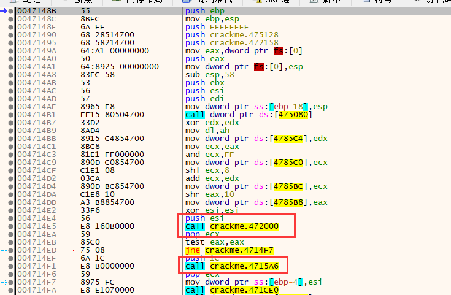

我们dump下来是无法运行的,在用x64打开dump下来的文件

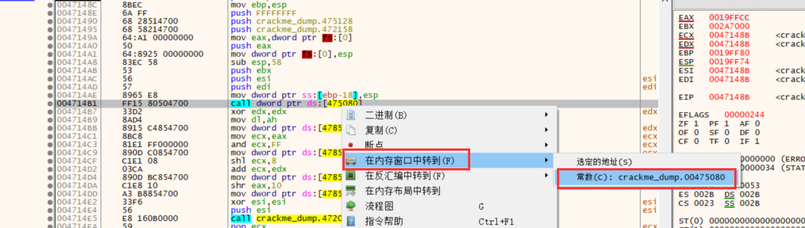

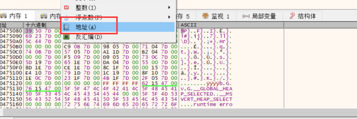

可以看到者一堆地址导入表不在了

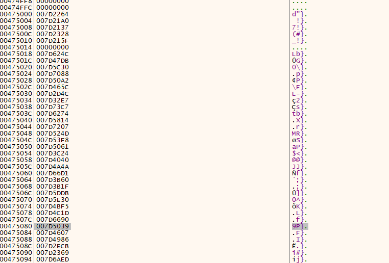

因此我们要去修导入表,就如表既然无法dump下来,说明做了处理,大部分时候都是被混淆过的

再回到加壳程序,查看导入表地址

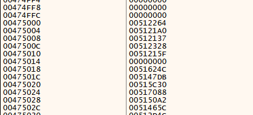

选择一个导入表  运行到这  F7 进去看它的实现,可以看到他做过膨胀处理,而且不是所有导出函数的处理手法都是一样的,一般这种处理导入表的方法都是有规律的,我门需要去找这个规律,不管他是如何变换,处理的,结果到了最后他一定会跳到最后真正api的位置,因此我们需要去找规律看看他什么时候拿到真正api的地址,什么时候跳过去的,找到这个规律我们对他的处理就很简单.

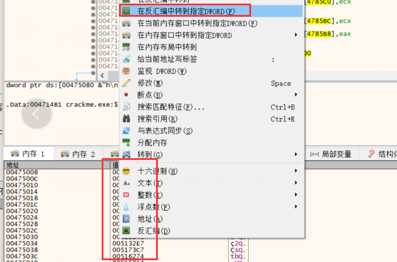

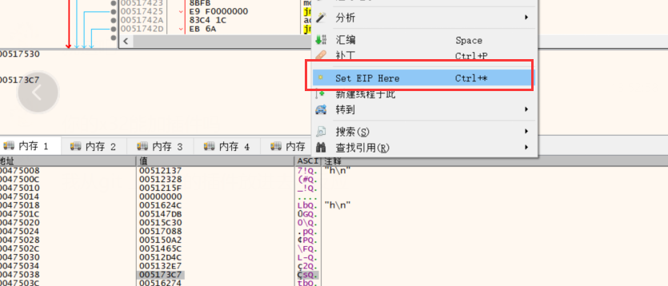

通过 F7 跟踪,  可以看到 都是通过 ret 跳到 api 的

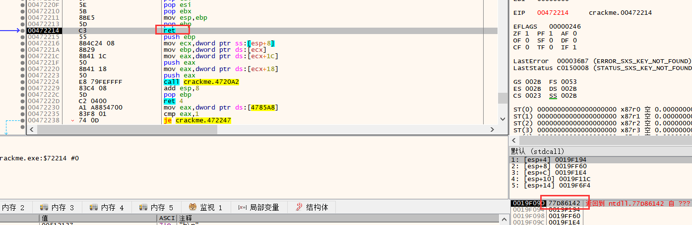

此时栈顶存的就是导入函数地址

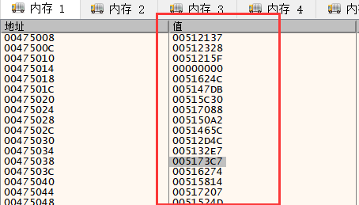

因此我们可以遍历iat 表

,取出它的每一个地址,让eip指过去,让他单步跑,跑到ret ,栈顶就是 api地址,之事后我们把api地址取过来,然后把只改改到对应的iat表,当我们把iat 表 遍历完改完之后,真正的iat表出来了


### 脚本修复PE

-   **脚本：**使用脚本将手工做的事情自动化。x32dbg脚本路径：x32dbg→脚本。右键脚步页面进行相关操作。

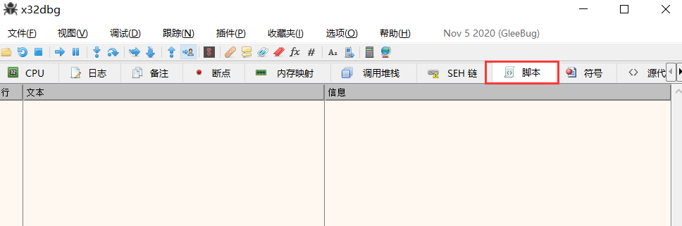

-   -   **控制命令帮助手册：**https://help.x64dbg.com/en/latest/commands/index.html
    -   **语法介绍：**https://help.x64dbg.com/en/latest/introduction/index.html

-   -   -   常用：定义变量（$ 名字）；访问寄存器（寄存器名字）；访问内存（数据类型(addr)）；

-   -   **使用示例：**https://github.com/x64dbg/Scripts

-   **本例脚本代码：**

```
//运行到OEP
bph 0x47148b    ;下断点
g

//导入表范围
impStart = 0x00475000
impEnd = 0x00475120

WHILEBEGIN:     ;循环
	//取出一项
	mov itaItem, dword:[impStart]
	
	//跳过0
	cmp itaItem, 0
	jz WHILECONTINUE
	jz WHILECONTINUE
	
	//设为新的EIP
	mov eip, itaItem
	
	//单步,直到遇到ret
	SETBEGIN:
		sti      ;单步	
		//判断是否到达ret
		mov code, byte:[eip]
		cmp code, 0xC3
  jnz SETBEGIN
	
	//从栈顶取出API地址,存入IAT对应项
	mov apiAddr, dword:[esp]
	mov dword:[impStart],apiAddr

WHILECONTINUE:
	add impStart, 4        ;每个地址四字节
  cmp impStart, impEnd   ;判断是否到了导入表结尾
  jb WHILEBEGIN          ;小于继续循环(没到)

ret
```

或

```
mov $addrIat, 0x00475000		    // 定义变量：IAT的范围起始处（同为循环中的遍历索引）
mov $addrIatEnd, 0x00475120		// 定义变量：IAT的范围结束处

fix_loop:
// 从ita取出一项
mov $addrIatItem, dword:[$addrIat]

cmp $addrIatItem, 0
je fix_next

// 设置为新的EIP地址
mov cip, $addrIatItem		// cip == eip
find_ret:
sti						// sti 单步步入

// 判断是否到了ret
cmp byte:[cip], 0xC3
jnz find_ret

// 到了ret，取栈顶的地址，存入对应的IAT
mov dword:[$addrIat], dword:[csp]

// 输出日志到信息窗口（同类msg为弹框）// 字符串格式化见下图String Formatting
log "fix old addr {p:$addrIatItem} --> new addr {p:dword:[csp]}" // p 地址
jmp fix_next

jmp find_ret			// 自己jmp自己，相当于while(true)死循环

fix_next:
add $addrIat, 4

cmp $addrIat, $addrIatEnd
je exit
jmp fix_loop

exit:
ret 
```

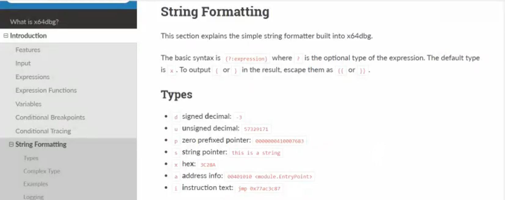

使用脚本

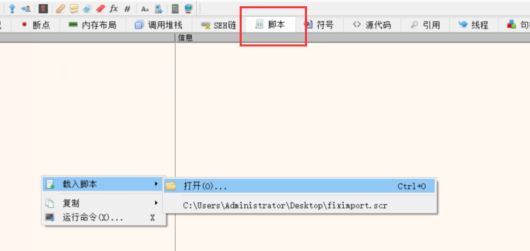

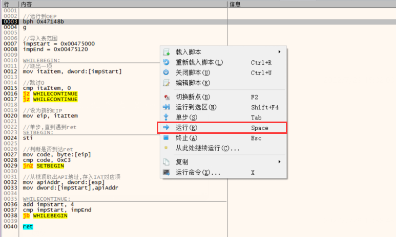

运行完脚本可以看到,ita表已经回写了

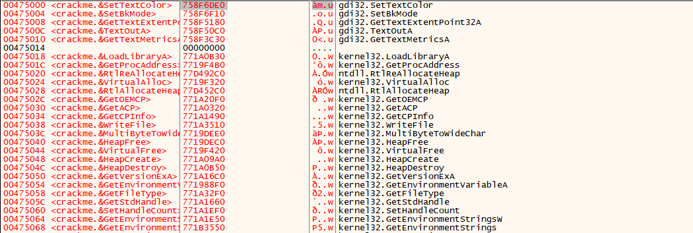

此时dump去拿导入表 ,把导入表如表地址 和地址总大小,发现可以拿到导入表了

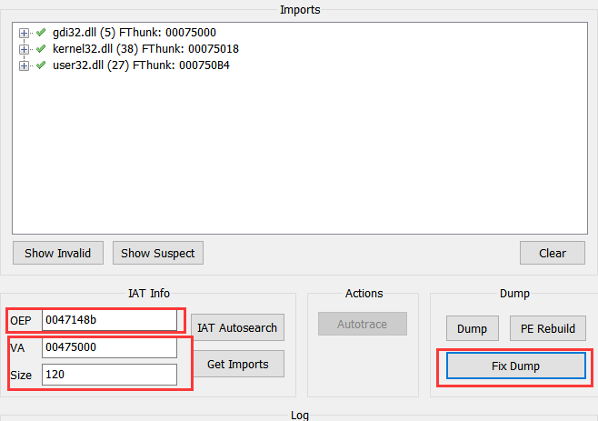

dump下来的可以运行了

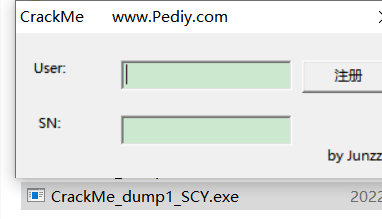

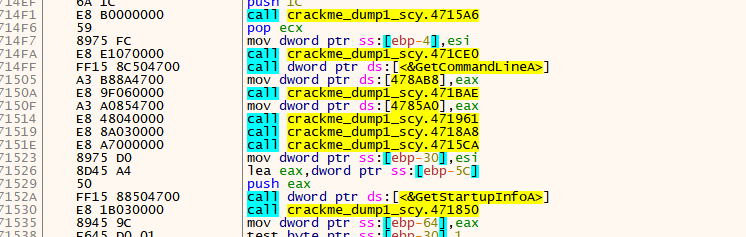


### x64dbg python脚本

https://github.com/x64dbg/x64dbgpy

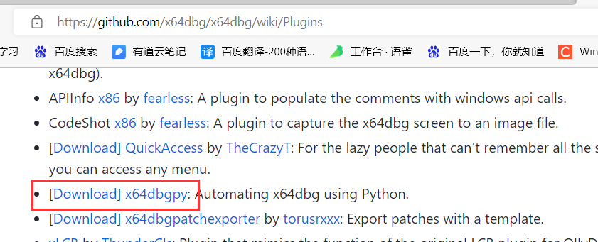


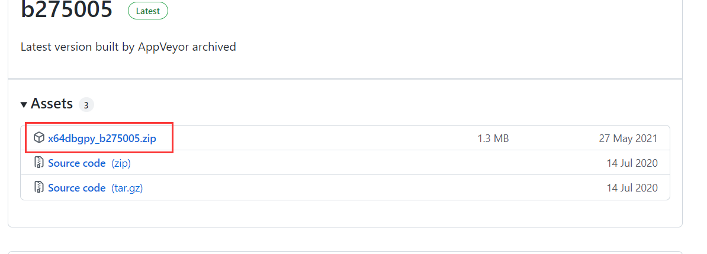

把插件复制到 xdbg 的插件目录下

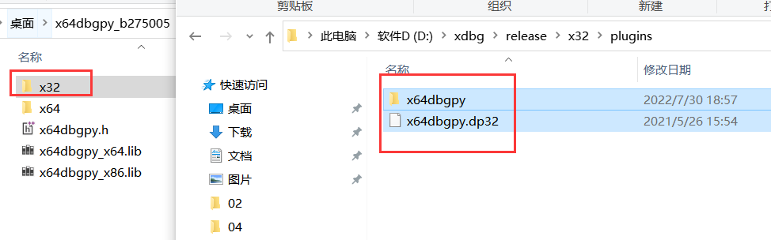

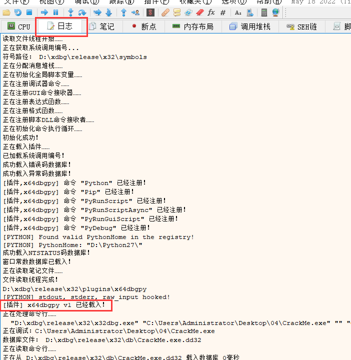

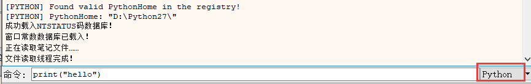

如果可以正常输出说明插件没问题,这个用起来也还行,不好的地方就是没有说明文档,但是有接口

......\plugins\x64dbgpy\x64dbgpy\pluginsdk\_scriptapi

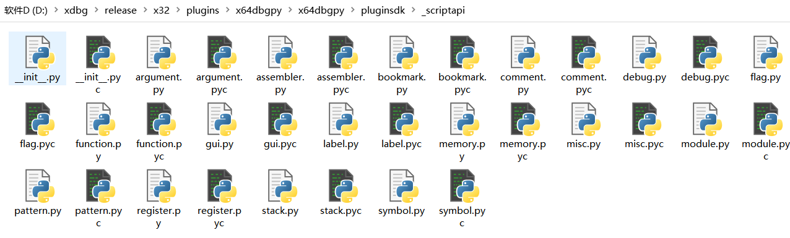

例如:内存操作

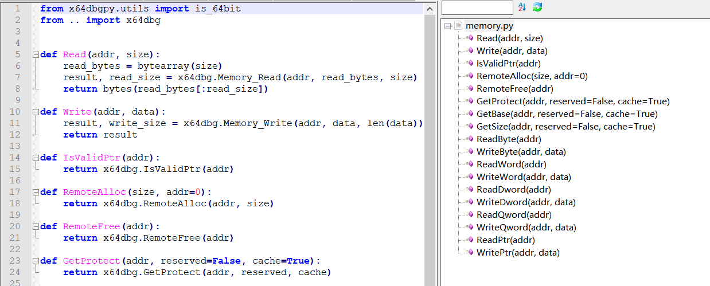

python脚本

```
#coding:utf-8 

from x64dbgpy.pluginsdk._scriptapi import *

#设置硬件执行断点
SetHardwareBreakpoint(0x47148b)
#运行
Run()
#等待断点到达
Wait()

impStart = 0x475000
impEnd =  0x475120
while   impStart < impEnd:
    #读取导入地址表一项,设为新Eip
    newEip = ReadDword(impStart);
    if newEip == 0:
        impStart+=4
        continue;
    SetEIP(newEip)
    #单步,直到ret
    while True:
        #单步
        StepIn()  
        #判断是否到ret
        if ReadByte(GetEIP()) == 0xC3:
            break
     #修正导入地址表
    WriteDword(impStart,ReadDword(GetESP()))
    #下一项
    impStart+=4
        
```

使用脚本

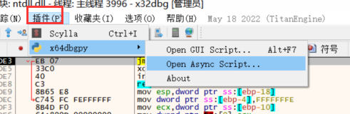

运行完可以看到真正的导入地址表了

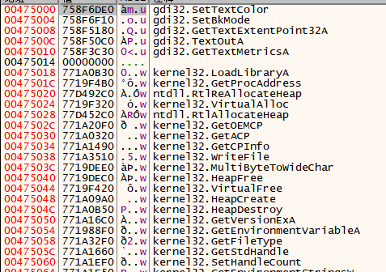

如果有问题在日志里面可以看错误


x64还支持用 .net  写程序,那个强悍的地方在于可以一边写脚本,一边在vs中调,x64还能同步的作响应 


### 代码混淆

核心原理是指令的等价替换

例如:

```
mov  eax  , 145h
等价于:
push ecx
xor  ecx , ecx
inc   ecx
shl    ecx ,8
add   ecx,45h
mov  eax,ecx
pop    ecx  
```

流程混淆示例:

通过跳转来改变代码块顺序,这样平常判断 条件 或者循环 的方法就失效了

而且可把跳转 换成等价指令,再插入一下不会执行到的代码块  

这种处理的方法就是跑单步,再去去混淆,去玩混淆之后再去跑单步

```
.586
.model flat,stdcall
option casemap:none

   include windows.inc
   include user32.inc
   include kernel32.inc
   
   includelib user32.lib
   includelib kernel32.lib


WinMain proto :DWORD,:DWORD,:DWORD,:DWORD


.data
   ClassName db "MainWinClass",0
   AppName  db "Main Window",0

.data?
   hInstance HINSTANCE ?
   CommandLine LPSTR ?

.code

; ---------------------------------------------------------------------------

start:
	invoke GetModuleHandle, NULL
	mov    hInstance,eax
	
	invoke GetCommandLine
	mov    CommandLine,eax
	
	invoke WinMain, hInstance,NULL,CommandLine, SW_SHOWDEFAULT
	invoke ExitProcess,eax

WinMain proc hInst:HINSTANCE,hPrevInst:HINSTANCE,CmdLine:LPSTR,CmdShow:DWORD
	LOCAL wc:WNDCLASSEX
	LOCAL msg:MSG
	LOCAL hwnd:HWND
	
	mov   wc.cbSize,SIZEOF WNDCLASSEX
	mov   wc.style, CS_HREDRAW or CS_VREDRAW
	jmp LABEL0
	
	LABEL0:
	mov   wc.lpfnWndProc, OFFSET WndProc
	mov   wc.cbClsExtra,NULL
	mov   wc.cbWndExtra,NULL
	jmp LABEL1
	
	LABEL4:
	mov   wc.hIconSm,eax
	invoke LoadCursor,NULL,IDC_ARROW
	jmp LABEL5
	
	LABEL3:
	mov   wc.hIcon,eax
	jmp LABEL4
	
	
	LABEL2:
	mov   wc.lpszClassName,OFFSET ClassName
	invoke LoadIcon,NULL,IDI_APPLICATION
	jmp LABEL3
	
	LABEL1:
	push  hInstance
	pop   wc.hInstance
	mov   wc.hbrBackground,COLOR_BTNFACE+1
	mov   wc.lpszMenuName,NULL
	jmp LABEL2
	
	LABEL5:
	mov   wc.hCursor,eax
	
	invoke RegisterClassEx, addr wc
	INVOKE CreateWindowEx,NULL,ADDR ClassName,ADDR AppName,\
           WS_OVERLAPPEDWINDOW,CW_USEDEFAULT,\
           CW_USEDEFAULT,CW_USEDEFAULT,CW_USEDEFAULT,NULL,NULL,\
           hInst,NULL
	mov   hwnd,eax
	
	invoke ShowWindow, hwnd,SW_SHOWNORMAL
	invoke UpdateWindow, hwnd
	
	.WHILE TRUE
		invoke GetMessage, ADDR msg,NULL,0,0
		.BREAK .IF (!eax)
		invoke TranslateMessage, ADDR msg
		invoke DispatchMessage, ADDR msg
	.ENDW
	
	mov     eax,msg.wParam
	ret
WinMain endp

WndProc proc hWnd:HWND, uMsg:UINT, wParam:WPARAM, lParam:LPARAM
	
	.IF uMsg==WM_DESTROY
		invoke PostQuitMessage,NULL
	.ELSEIF uMsg==WM_CREATE
		;
	.ELSE
		invoke DefWindowProc,hWnd,uMsg,wParam,lParam		
		ret
	.ENDIF
	
	xor eax,eax
	ret
WndProc endp
end start
```

