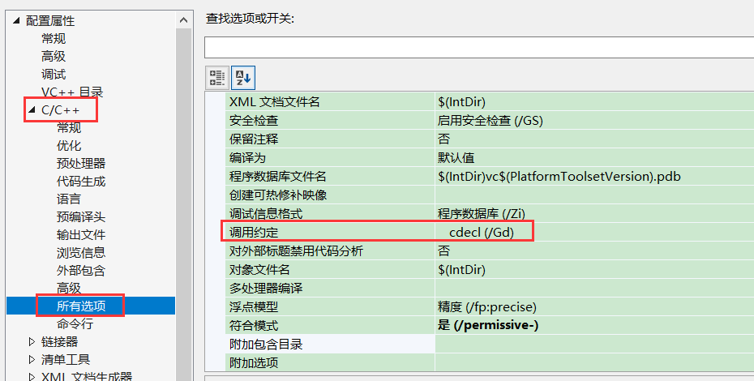
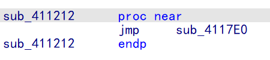
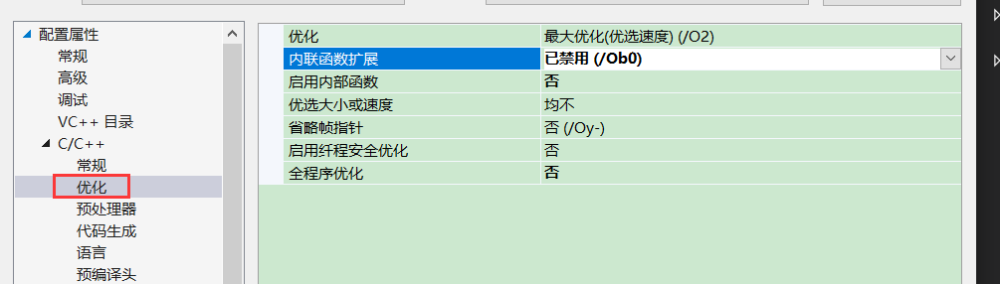
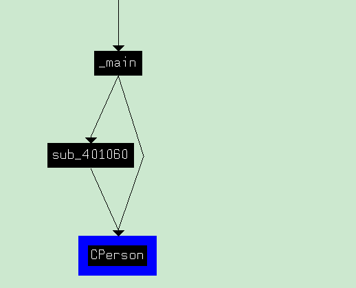
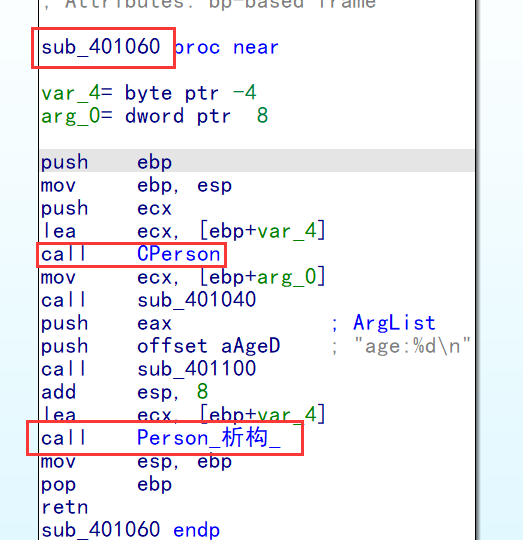
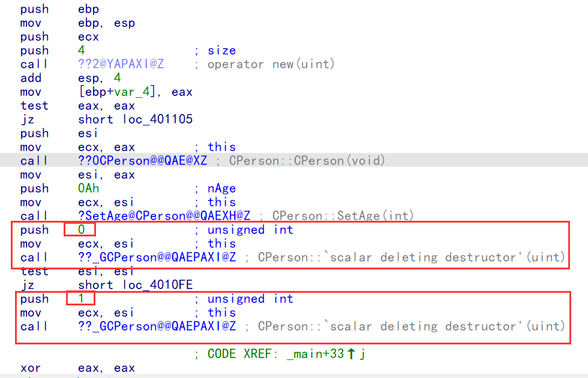
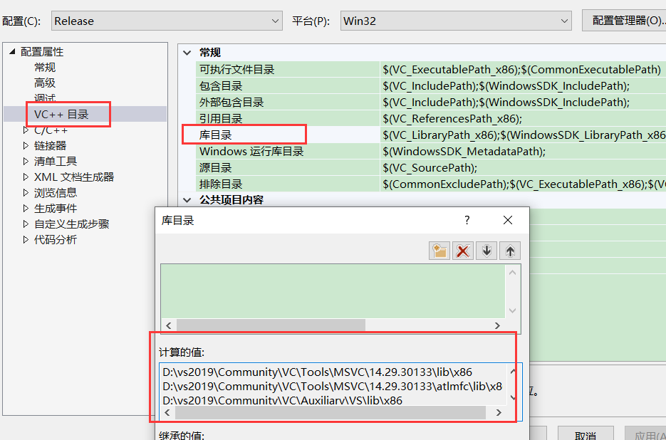
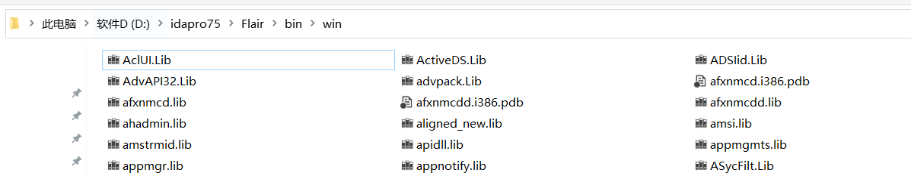
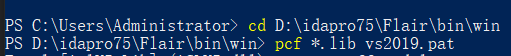

### 补充:堆喷射 

利用堆里面的残留数据,放shellcode代码,因为堆申请时不是自动初始化,而是放上一次的残留数据,而且堆里面可以跑代码,所以 可以把shellcode变成对的残留数据,在不断申请堆空间,就有很大可能申请到拥有 sehllcode 代码 残留值的空间  ,所以高版本为了解决这个问题,在你申请堆空间时,如果没有初始化,会自动初始化,低版本不会 


​      C++写的软件很多,尤其游戏中用的比较多,因为只要你的代码量够大,就会涉及到面向对象,虽然c也可以实现面向对象,但是比较复杂,面向对象就是抽象

### 修改默认调用约定



### 类成员函数的识别

简单的类(没有继承和多态)的内存结构等同于结构体,因此访问类的成员等同于访问结构体的成员

```c++
#include <stdio.h>

class CPerson
{

public:
    int  GetAge() const {    //加const表示常成员函数,只能获取不能改
        return  m_nAge;
    }
    void SetAge(int nAge) {
        m_nAge = nAge; 
    }

private:
    int m_nAge;
};
int main()
{
    CPerson obj;
    obj.SetAge(18);
    printf("age:%d\n",obj.GetAge());
}
```

debug反汇编代码

```
.text:00411942                 mov     [ebp+var_4], eax
.text:00411945                 mov     ecx, offset unk_41C003
.text:0041194A                 call    j_@__CheckForDebuggerJustMyCode@4 ;
.text:0041194F                 push    12h                                   ;在栈上传递了一个参数 18
.text:00411951                 lea     ecx, [ebp+var_C]             ;传递了一个参数 ecx
.text:00411954                 call    sub_411212                      ;通过下面可知,这个函数确实用了2个参数
.text:00411959                 lea     ecx, [ebp+var_C]            ;传递了一个参数 ecx
.text:0041195C                 call    sub_4111C2
.text:00411961                 push    eax             ; char
.text:00411962                 push    offset aAgeD    ; "age:%d\n"
.text:00411967                 call    sub_4110CD
.text:0041196C                 add     esp, 8
.text:0041196F                 xor     eax, eax
.text:00411971                 push    edx
.text:00411972                 mov     ecx, ebp        ; Esp
.text:00411974                 push    eax
.text:00411975                 lea     edx, Fd         ; Fd
.text:0041197B                 call    j_@_RTC_CheckStackVars@8 ; _RTC_CheckStackVars(x,x)
```



```
sub_4117E0 proc near

var_C= byte ptr -0Ch
var_8= dword ptr -8
arg_0= dword ptr  8

push    ebp
mov     ebp, esp
sub     esp, 0CCh
push    ebx
push    esi
push    edi
push    ecx
lea     edi, [ebp+var_C]
mov     ecx, 3
mov     eax, 0CCCCCCCCh
rep stosd
pop     ecx
mov     [ebp+var_8], ecx
mov     ecx, offset unk_41C003
call    j_@__CheckForDebuggerJustMyCode@4 ; __CheckForDebuggerJustMyCode(x)
mov     eax, [ebp+var_8]
mov     ecx, [ebp+arg_0]
mov     [eax], ecx      ;把第一个参数的值给结构第一个成员的位置
pop     edi
pop     esi
pop     ebx
add     esp, 0CCh
cmp     ebp, esp
call    j___RTC_CheckEsp
mov     esp, ebp
pop     ebp
retn    4
sub_4117E0 endp
```

从上面分析,函数传递了2个参数,一个在ecx,一个在栈顶,这不符合我们前面C逆向学的已知的调用约定,这就是类独有的调用约定  thiscall,其中ecx用来传递指针(对象首地址),剩下的参数入栈

然后根据这个可以判断上面是类的成员函数,然后可以推测下面可能也是(只传一个参数ecx是,无法确定是fastcall 和 thiscall),但是不一定是,因为他可能封装一个全局fastcall约定的函数(一般不会用),例如 UI,但是可以根据后面可读性来决定怎么还原,汇编代码会是一样的

```c++

#include <stdio.h>

class CPerson
{

public:
    int  GetAge() const {    //加const表示常成员函数,只能获取不能改
        return  m_nAge;
    }
    void SetAge(int nAge) {
        m_nAge = nAge; 
    }

private:
    int m_nAge;
};

void ShowAge(CPerson* pObj) {
    printf("age:%d\n", pObj->GetAge());

}
int main()
{
    CPerson obj;
    obj.SetAge(18);
    ShowAge(&obj);
}
```

release版反汇编代码

要先关闭内联



```
push    ebp
mov     ebp, esp
push    ecx
push    12h
lea     ecx, [ebp+var_4]
call    sub_401010
lea     eax, [ebp+var_4]
push    eax
call    sub_401020
add     esp, 4
xor     eax, eax
mov     esp, ebp
```

```
sub_401010 proc near

arg_0= dword ptr  8

push    ebp
mov     ebp, esp
mov     eax, [ebp+arg_0]
mov     [ecx], eax
pop     ebp
retn    4
sub_401010 endp
```

```
sub_401020 proc near

arg_0= dword ptr  8

push    ebp
mov     ebp, esp
mov     ecx, [ebp+arg_0]
call    sub_401000
push    eax             ; ArgList
push    offset Format   ; "age:%d\n"
call    sub_4010A0
add     esp, 8
pop     ebp
retn
sub_401020 endp
```

#### 结构体和类在内存上的区别

-   类在没有成员函数的时候内存结构和结构体是一致的。
-   const 常成员函数是编译器识别的，所以还原的时候看不出来。
-   类成员函数是能够指定调用约定的，除了构造函数外，构造函数不能指定调用约定。
-   当成员函数使用其他调用约定的时候,第一个参数必须是this指针,不管是栈传递还是寄存器传递
-   用栈传递的时候,第一个参数是最后一个push,用寄存器传递的时候,第一个参数是ecx

#### thiscall调用约定

​          thiscall只适用于 vs,而且类的成员函数可以自己修改调用约定,即在函数前面指定调用约定,因此thiscall只是判断类成员函数的一个依据,并不是绝对的

-   **_thiscall调用约定：**适用于类成员函数，_thiscall调用约定 ecx => this，通过 ecx 传递对象首地址，其他特性跟 __stdcall 一样。即使用 ecx 传递第一个参数this指针，从第二个参数开始使用 push 压参数入栈且在函数内， mov dword ptr [ebp ‐ xxx], ecx 将this指针存放在 [ebp ‐ xxx]。
-   **_thiscall与_fastcall 的区别（1个参数的区别不明显）：** _fastcall前两个参数是寄存器传参，ecx会被直接使用，_thiscall则不会。看到ecx需要进入函数内部观察ecx是否被使用，如果排除掉数组 ，那么它就是结构体，那么他是结构体的话我们就看他的来源，他的来源是从ebp ‐4来的，基本可判断为成员函数。
-   **_thiscall的识别：**1. 确定ecx传参；2. 确定ecx是一个指针，对象的首地址；3. 寄存器相对间接访问。


#### 还原：根据调用约定来还原

-   当参数只有一个的时候 fastcall 和 thsicall 识别不出来，但是解释为两个中调用约定都可以，根据上下文考虑还原为成员函数或者是fastcall调用约定的全局函数。


### 构造函数的识别

构造函数是可以重载的

#### 认识构造有几个必要条件：

-   \1.   ecx,this传参因为C++下的对象都是 thisCall,和FastCall类似,thisCall会通过寄存器传参.而fastCall最后两个参数会通过寄存器传参，鉴定是ecx传参的前提下是函数外面给值,函数内部使用，函数内部会将ecx给存储起来,这个内存空间称之为  this,也就是语法为什么可以这样写: this.xxxx = 1  this.MyTest();高亮ecx传参的时候的内存地址,会有多处使用。
-   \2.   构造会在创建对象的时候先调用,即作用域内第一个被调用的函数；
-   \3.   构造函数的返回值则是this指针。(编译器会用这个返回值来检测这个函数调用了没有)
-   \4.   构造函数一般只做初始化操作

因此 构造函数和成员函数的区别

1.  调用的时机有差异
2.  返回值有差异,(成员函数虽然也有返回this指针的,但是很少)

   CPerson&  SetAge(int nAge) {

​        m_nAge = nAge; 

​        return  this;

​    }

因此识别需要综合判断,就算判断错了,还原成初始化函数其实也是可以的,功能等价

```c++
#include <stdio.h>

class CPerson
{

public:
    CPerson() {
        printf("%s\n",__FUNCTION__);   //自动打印函数名
    }
    int  GetAge() const {    //加const表示常成员函数,只能获取不能改
        return  m_nAge;
    }
    void SetAge(int nAge) {
        m_nAge = nAge; 
    }

private:
    int m_nAge;
};

void ShowAge(CPerson* pObj) {
    printf("age:%d\n", pObj->GetAge());

}
int main()
{
    CPerson obj;
    obj.SetAge(18);
    ShowAge(&obj);
}

```

release版汇编代码

```
push    ebp
mov     ebp, esp
push    ecx
lea     ecx, [ebp+var_4]
call    sub_401000
push    12h
lea     ecx, [ebp+var_4]
call    sub_401030
lea     eax, [ebp+var_4]
push    eax
call    sub_401040
add     esp, 4
xor     eax, eax
mov     esp, ebp
pop     ebp
retn
```

```
sub_401000 proc near
push    esi
push    offset aCpersonCperson ; "CPerson::CPerson"
push    offset Format   ; "%s\n"
mov     esi, ecx
call    sub_4010D0
add     esp, 8
mov     eax, esi     //返回this指针
pop     esi
retn
sub_401000 endp
```

#### 总结

-   \1.  调用约定是thiscall , 注: 构造析构都是thiscall,不能修改。
-   \2.  ecx传参,且函数内部会将ecx给this赋值(this可能是一块内存空间,也可能是寄存器变量)且返回this指针；
-   \3.  进入作用域后的第一次成员调用 , 构造函数优先调用；
-   \4. 可以点击this指针,可能会有多次调用；
-   \5.  不包含堆对象(需要单独处理)


### 析构函数的识别

析构函数跟普通函数很相似,只有释放资源才可能看得出来,但是还是可以还原成free

####  析构函数

-   调用约定只能是thiscall
-   返回值为void

-   -   就算内存释放失败，也没什么异常产生。

-   作用域的最后一次调用
-   不包含堆对象、堆对象后面分析

```c++
#include <stdio.h>

class CPerson
{

public:
    CPerson() {
        printf("%s\n",__FUNCTION__);   //自动打印函数名
    }
    ~CPerson() {
        printf("%s\n", __FUNCTION__);   //自动打印函数名
    }
    int  GetAge() const {    //加const表示常成员函数,只能获取不能改
        return  m_nAge;
    }
    void SetAge(int nAge) {
        m_nAge = nAge; 
    }

private:
    int m_nAge;
};

void ShowAge(CPerson* pObj) {
    printf("age:%d\n", pObj->GetAge());

}
int main()
{
    CPerson obj;
    obj.SetAge(18);
    ShowAge(&obj);
}

```

release版反汇编代码

```
push    ebp
mov     ebp, esp
push    ecx
lea     ecx, [ebp+var_4]
call    sub_401000
push    12h
lea     ecx, [ebp+var_4]
call    sub_401050
lea     eax, [ebp+var_4]
push    eax
call    sub_401060
add     esp, 4
lea     ecx, [ebp+var_4]
call    sub_401020        ;析构函数,最后调用
xor     eax, eax
mov     esp, ebp
pop     ebp
```

```
sub_401020 proc near
push    offset aCpersonCperson_0 ; "CPerson::~CPerson"
push    offset Format   ; "%s\n"
call    sub_4010F0
add     esp, 8
retn
sub_401020 endp
```

当构造析构别多次使用会在函数头调构造,函数尾调析构,因此当多个函数调用析构会通过图形参考看到这个特点

```c++
// C++RE.cpp : 此文件包含 "main" 函数。程序执行将在此处开始并结束。
//

#include <stdio.h>

class CPerson
{

public:
    CPerson() {
        printf("%s\n",__FUNCTION__);   //自动打印函数名
    }
    ~CPerson() {
        printf("%s\n", __FUNCTION__);   //自动打印函数名
    }
    int  GetAge() const {    //加const表示常成员函数,只能获取不能改
        return  m_nAge;
    }
    void SetAge(int nAge) {
        m_nAge = nAge; 
    }

private:
    int m_nAge;
};

void ShowAge(CPerson* pObj) {
    CPerson obj;
    printf("age:%d\n", pObj->GetAge());

}
int main()
{
    CPerson obj;
    obj.SetAge(18);
    ShowAge(&obj);
}

```

先看哪些函数调用了,再看在函数中的位置





#### 总结

-   \1.  调用约定是thiscall , 注: 构造析构都是thiscall,不能修改。
-   \2.  返回值是 void；
-   \3.  离开作用域后最后一次成员调用 ；
-   \4.  不包含堆对象(需要单独处理)


### 堆对象

```c++
#include <stdio.h>

class CPerson
{

public:
    CPerson() {
        m_nAge = 0;
        printf("%s\n",__FUNCTION__);   //自动打印函数名
    }
    ~CPerson() {
        printf("%s\n", __FUNCTION__);   //自动打印函数名
    }
    int  GetAge() const {    //加const表示常成员函数,只能获取不能改
        return  m_nAge;
    }
    void SetAge(int nAge) {
        m_nAge = nAge; 
    }

private:
    int m_nAge;
};

void ShowAge(CPerson* pObj) {
    CPerson obj;
    printf("age:%d\n", pObj->GetAge());

}
int main()
{
     CPerson* PObj = new CPerson();
     PObj->SetAge(10);
     delete PObj;

}
```

release版反汇编代码

```
text:004010C0                 push    ebp
.text:004010C1                 mov     ebp, esp
.text:004010C3                 push    ecx
.text:004010C4                 push    4               ; Size
.text:004010C6                 call    ??2@YAPAXI@Z    ; operator new(uint)
.text:004010CB                 add     esp, 4
.text:004010CE                 mov     [ebp+var_4], eax
.text:004010D1                 test    eax, eax        ;自动判断是否申请到了堆空间,防止系统自己崩溃
.text:004010D3                 jz      short loc_4010FC
.text:004010D5                 push    esi
.text:004010D6                 mov     ecx, eax
.text:004010D8                 call    sub_401000
.text:004010DD                 mov     esi, eax
.text:004010DF                 push    0Ah
.text:004010E1                 mov     ecx, esi
.text:004010E3                 call    sub_401070
.text:004010E8                 test    esi, esi
.text:004010EA                 jz      short loc_4010F5
.text:004010EC                 push    1               ; char
.text:004010EE                 mov     ecx, esi        ; Block
.text:004010F0                 call    sub_401040          ;析构函数
.text:004010F5
.text:004010F5 loc_4010F5:                             ; CODE XREF: _main+2A↑j
.text:004010F5                 xor     eax, eax
.text:004010F7                 pop     esi
.text:004010F8                 mov     esp, ebp
.text:004010FA                 pop     ebp
.text:004010FB                 retn
.text:004010FC ; ---------------------------------------------------------------------------
.text:004010FC
.text:004010FC loc_4010FC:                             ; CODE XREF: _main+13↑j
.text:004010FC                 push    0Ah
.text:004010FE                 xor     ecx, ecx
.text:00401100                 call    sub_401070
.text:00401105                 xor     eax, eax
.text:00401107                 mov     esp, ebp
.text:00401070 sub_401070      proc near               ; CODE XREF: _main+23↓p
.text:00401070                                         ; _main+40↓p
.text:00401070
.text:00401070 arg_0           = dword ptr  8
.text:00401070
.text:00401070                 push    ebp
.text:00401071                 mov     ebp, esp
.text:00401073                 mov     eax, [ebp+arg_0]
.text:00401076                 mov     [ecx], eax       ;如果申请失败 ,ecx等于 0 ,那么此时崩溃
.text:00401078                 pop     ebp
.text:00401079                 retn    4
.text:00401079 sub_401070      endp


```

delete函数

```
xt:00401162 sub_401162      proc near               ; CODE XREF: sub_401040+14↑p
.text:00401162                                         ; unknown_libname_2+1F↓p ...
.text:00401162
.text:00401162 Block           = dword ptr  8
.text:00401162
.text:00401162                 push    ebp
.text:00401163                 mov     ebp, esp
.text:00401165                 push    [ebp+Block]     ; Block
.text:00401168                 call    j_free
.text:0040116D                 pop     ecx
.text:0040116E                 pop     ebp
.text:0040116F                 retn
.text:0040116F sub_401162      endp
```

析构代理:    解决 堆对象 delete 和 显式调用析构函数 释放空间问题

```
.text:00401040 sub_401040      proc near               ; CODE XREF: _main+30↓p
.text:00401040                 push    ebp
.text:00401041                 mov     ebp, esp
.text:00401043                 push    esi
.text:00401044                 mov     esi, ecx
.text:00401046                 call    sub_401020       ;析构函数
.text:0040104B                 test    [ebp+arg_0], 1
.text:0040104F                 jz      short loc_40105C
.text:00401051                 push    4
.text:00401053                 push    esi             ; Block
.text:00401054                 call    sub_401162      ;delete函数
.text:00401059                 add     esp, 8
.text:0040105C
.text:0040105C loc_40105C:                             ; CODE XREF: sub_401040+F↑j
.text:0040105C                 mov     eax, esi
.text:0040105E                 pop     esi
.text:0040105F                 pop     ebp
.text:00401060                 retn    4
.text:00401060 sub_401040      endp
```

#### 析构代理

正常情况下delet 一个对象 需要先析构再释放空间,因此系统系统会把 delete 对象 这行代码封装成一个函数,这个函数就是代理析构,第一个函数调析构,第二个函数根据参数判断需不需要delete   


##### c++  对象的析构有3种情况:

1.  出作用域后自动析构, (直接调析构函数)
2.   delete 对象析构
3.  显式调用析构    PObj->~CPerson();

​         当显示调用析构会调用 delete   ,但是不能释放空间,如果不传参数来控制,那么调用delete函数时就会释放空间

,因此他给析构函数加了一个参数, 0 表示 只析构 不free ,如果是1 ,表示先析构,在free 因此可以知道  当参数是0 代表显式调用析构函数,如果是 1 ,表示调用delete ,  3表示析构的是对象数组,需要调用析构迭代器

```c++
#include <stdio.h>

class CPerson
{

public:
    CPerson() {
        m_nAge = 0;
        printf("%s\n",__FUNCTION__);   //自动打印函数名
    }
    ~CPerson() {
        printf("%s\n", __FUNCTION__);   //自动打印函数名
    }
    int  GetAge() const {    //加const表示常成员函数,只能获取不能改
        return  m_nAge;
    }
    void SetAge(int nAge) {
        m_nAge = nAge; 
    }

private:
    int m_nAge;
};

void ShowAge(CPerson* pObj) {
    CPerson obj;
    printf("age:%d\n", pObj->GetAge());

}
int main()
{
     CPerson* pObj = new CPerson();
     pObj->SetAge(10);
     pObj->~CPerson();
     delete pObj;
}
```



析构时代是识别堆对象 析构构造的重要依据,因为出现析构代理说明是析构函数,那么作用域内第一个调用的函数大概率就是构造函数,而且 new 完 调用的第一个函数大概率是构造函数,如果不是,那么就没有构造函数


#### 没有构造函数

如果没有构造函数,从编译器的角度来说,没有就没有,不会生成默认构造

```c++
#include <stdio.h>

class CPerson
{

public:

    ~CPerson() {
        printf("%s\n", __FUNCTION__);   //自动打印函数名
    }
    int  GetAge() const {    //加const表示常成员函数,只能获取不能改
        return  m_nAge;
    }
    void SetAge(int nAge) {
        m_nAge = nAge; 
    }

private:
    int m_nAge;
};

int main()
{
     CPerson* pObj = new CPerson();
     pObj->SetAge(10);
     delete pObj;
}
```

```
release版反汇编代码
.text:004010A0                 push    esi
.text:004010A1                 push    4               ; size
.text:004010A3                 call    ??2@YAPAXI@Z    ; operator new(uint)       ;new函数
.text:004010A8                 add     esp, 4
.text:004010AB                 mov     esi, eax
.text:004010AD                 push    0Ah             ; nAge
.text:004010AF                 test    esi, esi
.text:004010B1                 jz      short loc_4010CD
.text:004010B3                 mov     ecx, esi        ; this
.text:004010B5                 mov     dword ptr [esi], 0    ;自动把成员初始化为0了(低版本不会),还原时可以自己写一个默认构造,然后把  memset(this , 0  , sizeof(CPerson)) 放在默认构造里面
.text:004010BB                 call    ?SetAge@CPerson@@QAEXH@Z ; CPerson::SetAge(int)
.text:004010C0                 push    1               ; unsigned int
.text:004010C2                 mov     ecx, esi        ; this
;析构代理函数
.text:004010C4                 call    ??_GCPerson@@QAEPAXI@Z ; CPerson::`scalar deleting destructor'(uint)
.text:004010C9                 xor     eax, eax
.text:004010CB                 pop     esi
.text:004010CC                 retn
.text:004010CD ; ---------------------------------------------------------------------------
.text:004010CD
.text:004010CD loc_4010CD:                             ; CODE XREF: _main+11↑j
.text:004010CD                 xor     ecx, ecx        ; this
.text:004010CF                 call    ?SetAge@CPerson@@QAEXH@Z ; CPerson::SetAge(int)
.text:004010D4                 xor     eax, eax
.text:004010D6                 pop     esi
.text:004010D7                 retn
```

#### 总结

​           如果是一个对对像,是被构造析构就会简单很多,尤其是有析构代理 (格式   if   delete),析构代理是无法模仿的,而且  堆对象是主流,因为 要实现多态和继承就必须 new

​          当构造申请资源时,很容易判断


new的构造函数识别

-   先判断,再调用构造函数
-   使用了构造函数的返回值

delete 的构造函数识别:

-    先判断再调用析构函数
-    调用的是析构代码
-    析构代码带参数

​    


### 对象数组

#### (1) new对象数组

​        系统给我们new 的地址是假的,真正地址需要-4 字节,是用来保存 new的对象数量的,析构实会把 保存数量的四字节以及给我们的地址一起释放掉

```c++
#include <stdio.h>
#include <string.h>

class CPerson
{

public:
    CPerson() {
        memset(this, 0, sizeof(CPerson));   //自动打印函数名
    }

    ~CPerson() {
        printf("%s\n", __FUNCTION__);   //自动打印函数名
    } 
    int  GetAge() const {    //加const表示常成员函数,只能获取不能改
        return  m_nAge;
    }
    void SetAge(int nAge) {
        m_nAge = nAge; 
    }

private:
    int m_nAge;
};


int main()
{
     CPerson* pObj = new CPerson[100];
     for (int i=0;i<100;i++)
     {
         pObj[i].SetAge(10);
         printf("age:%d\n", pObj[i].GetAge());
     }
    
     delete[] pObj;
}
```

```
40115C                 push    eax
.text:0040115D                 lea     eax, [ebp+var_C]
.text:00401160                 mov     large fs:0, eax
.text:00401166                 push    194h            ; size
.text:0040116B                 call    ??_U@YAPAXI@Z   ; operator new[](uint)
.text:00401170                 add     esp, 4
.text:00401173                 mov     [ebp+block], eax
.text:00401176 ;   try {
.text:00401176                 mov     [ebp+var_4], 0
.text:0040117D                 test    eax, eax
.text:0040117F                 jz      short loc_4011A0
.text:00401181                 push    offset ??1CPerson@@QAE@XZ ; destructor
.text:00401186                 push    offset ??0CPerson@@QAE@XZ ; constructor
.text:0040118B                 push    64h ; 'd'       ; count
.text:0040118D                 lea     edi, [eax+4]       ;new的地址+4
.text:00401190                 mov     dword ptr [eax], 64h ; 'd'     ;把个数放入地址
.text:00401196                 push    4               ; size  
.text:00401198                 push    edi             ; ptr
//构造迭代器,里面是循环调用构造函数,还有就是判断是否出错,出错就调用析构
.text:00401199                 call    ??_L@YGXPAXIIP6EX0@Z1@Z ; `eh vector constructor iterator '(void *,uint,uint,void (*)(void *),void (*)(void *))
.text:0040119E                 jmp     short loc_4011A2
.text:004011A0 ; ---------------------------------------------------------------------------
.text:004011A0
.text:004011A0 loc_4011A0:                             ; CODE XREF: _main+3F↑j
.text:004011A0                 xor     edi, edi
.text:004011A2
.text:004011A2 loc_4011A2:                             ; CODE XREF: _main+5E↑j
.text:004011A2                 mov     esi, edi
.text:004011A4                 mov     ebx, 64h ; 'd'
.text:004011A9                 nop     dword ptr [eax+00000000h]
.text:004011B0
.text:004011B0 loc_4011B0:                             ; CODE XREF: _main+94↓j
.text:004011B0                 push    0Ah             ; nAge
.text:004011B2                 mov     ecx, esi        ; this
.text:004011B4                 call    ?SetAge@CPerson@@QAEXH@Z ; CPerson::SetAge(int)
.text:004011B9                 mov     ecx, esi        ; this
.text:004011BB                 call    ?GetAge@CPerson@@QBEHXZ ; CPerson::GetAge(void)
.text:004011C0                 push    eax
.text:004011C1                 push    offset aAgeD    ; "age:%d\n"
.text:004011C6                 call    _printf
.text:004011CB                 add     esp, 8
.text:004011CE                 add     esi, 4
.text:004011D1                 sub     ebx, 1
.text:004011D4                 jnz     short loc_4011B0
.text:004011D6                 test    edi, edi
.text:004011D8                 jz      short loc_4011E3
.text:004011DA                 push    3                    ; 表示析构的是数组对象
.text:004011DC                 mov     ecx, edi        ; this
//析构代理函数,里面调析构迭代器
.text:004011DE                 call    ??_ECPerson@@QAEPAXI@Z ; CPerson::`vector deleting destructor'(uint)
.text:004011E3
.text:004011E3 loc_4011E3:                             ; CODE XREF: _main+98↑j
.text:004011E3                 xor     eax, eax
.text:004011E5                 mov     ecx, [ebp+var_C]
.text:004011E8                 mov     large fs:0, ecx
.text:004011EF                 pop     ecx
```

```
析构代理
text:00401030                 push    ebp
.text:00401031                 mov     ebp, esp
.text:00401033                 push    0FFFFFFFFh
.text:00401035                 push    offset __ehhandler$??_ECPerson@@QAEPAXI@Z
.text:0040103A                 mov     eax, large fs:0
.text:00401040                 push    eax
.text:00401041                 push    ebx
.text:00401042                 push    esi
.text:00401043                 push    edi
.text:00401044                 mov     eax, ___security_cookie
.text:00401049                 xor     eax, ebp
.text:0040104B                 push    eax
.text:0040104C                 lea     eax, [ebp+var_C]
.text:0040104F                 mov     large fs:0, eax
.text:00401055                 mov     esi, this
.text:00401057                 mov     eax, [ebp+arg_0]
.text:0040105A                 mov     ebx, eax
.text:0040105C                 and     ebx, 1
.text:0040105F                 test    al, 2
.text:00401061                 jz      short loc_4010A3
.text:00401063                 push    offset ??1CPerson@@QAE@XZ ; destructor
.text:00401068                 push    dword ptr [esi-4] ; count    
.text:0040106B                 lea     edi, [esi-4]     ;地址前面四字节表示new的对象数量
.text:0040106E                 push    4               ; size
.text:00401070                 push    esi             ; ptr
;析构迭代器
.text:00401071                 call    ??_M@YGXPAXIIP6EX0@Z@Z ; `eh vector destructor iterator'(void *,uint,uint,void (*)(void *))
.text:00401076                 test    ebx, ebx
.text:00401078                 jz      short loc_40108D
.text:0040107A                 mov     this, [edi]
.text:0040107C                 lea     this, ds:4[this*4]
.text:00401083                 push    this            ; __formal
.text:00401084                 push    edi             ; block
.text:00401085                 call    ??_V@YAXPAXI@Z  ; operator delete[](void *,uint)
.text:0040108A                 add     esp, 8
.text:0040108D
.text:0040108D loc_40108D:                             ; CODE XREF: CPerson::`vector deleting destructor'(uint)+48↑j
.text:0040108D                 mov     eax, edi
.text:0040108F                 mov     this, [ebp+var_C] ; this
.text:00401092                 mov     large fs:0, this
.text:00401099                 pop     this
.text:0040109A                 pop     edi
.text:0040109B                 pop     esi
.text:0040109C                 pop     ebx
.text:0040109D                 mov     esp, ebp
.text:0040109F                 pop     ebp
.text:004010A0                 retn    4
.text:004010A3 ; ---------------------------------------------------------------------------
.text:004010A3
.text:004010A3 loc_4010A3:                             ; CODE XREF: CPerson::`vector deleting destructor'(uint)+31↑j
.text:004010A3                 call    ??1CPerson@@QAE@XZ ; CPerson::~CPerson(void)
.text:004010A8                 test    ebx, ebx
.text:004010AA                 jz      short loc_4010B7
.text:004010AC                 push    4               ; __formal
.text:004010AE                 push    esi             ; block
.text:004010AF                 call    ??3@YAXPAXI@Z   ; operator delete(void *,uint)
.text:004010B4                 add     esp, 8
.text:004010B7
.text:004010B7 loc_4010B7:                             ; CODE XREF: CPerson::`vector deleting destructor'(uint)+7A↑j
.text:004010B7                 mov     eax, esi
.text:004010B9                 mov     this, [ebp+var_C]
.text:004010BC                 mov     large fs:0, this
```

#### 构造迭代器

eh vector constructor iterator (void *,uint,uint,void (*)(void *),void (*)(void *))

任何一个new数组的操作都是由这个函数来完成的

-   封装一个构造迭代器，传入数组以下参数：

-   -   数组首地址：需要从这里开始循环
    -   元素个数	：循环多少次
    -   对象大小	：每次步长加多少
    -   构造函数地址：循环体
    -   析构函数地址：当new 了9999个，假如最后一个没有成功，需要清理前面申请成功的，并返回错误。


#### 析构迭代器

eh vector destructor iterator(void *,uint,uint,void (*)(void *))

-   封装一个析构迭代器，传入以下参数：

-   -   数组首地址
    -   对象大小
    -   数组元素数量
    -   析构函数地址


#### 总结:

有了构造和析构迭代器,说明 构造和析构函数是不能内联的,因为内联的话是无法获得该函数地址的,无法传参

### 制作 sig 文件

#### 寻找库文件



找到以后把文件里面的库文件都拷出来

#### 拷贝库文件



根据库目录的文件,把对应库里面的lib 文件拷到指定文件夹

#### 提特征




如果出现名字冲突,把错误文件名的多个删掉一个,其他的对应冲突会按删掉的命名,或者 通过 在   sibmake 后面 加 -r  后面的名字把前面的覆盖


#### 