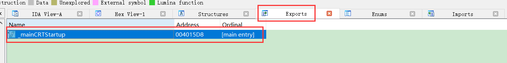
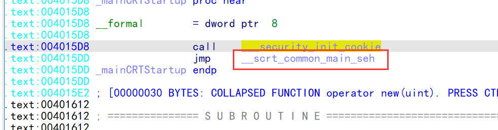
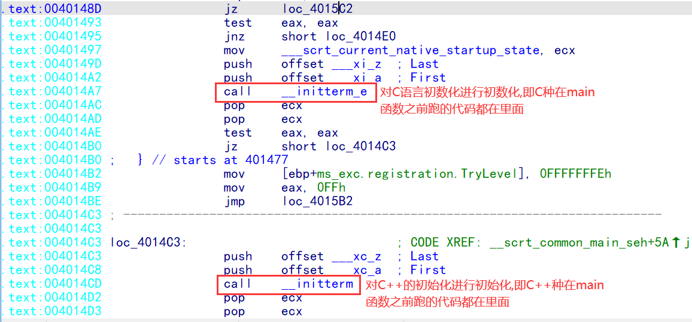
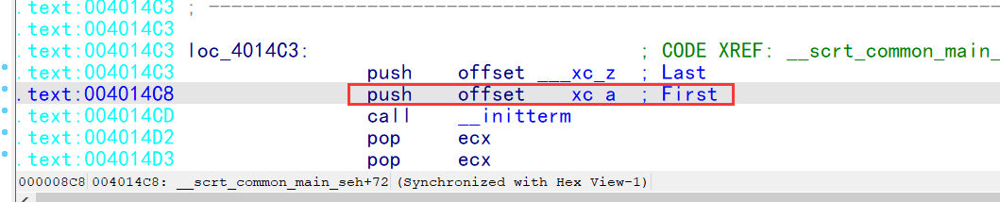
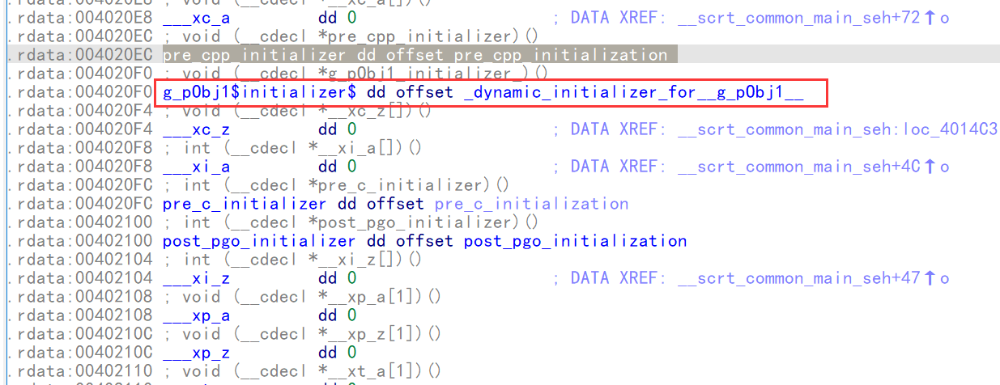
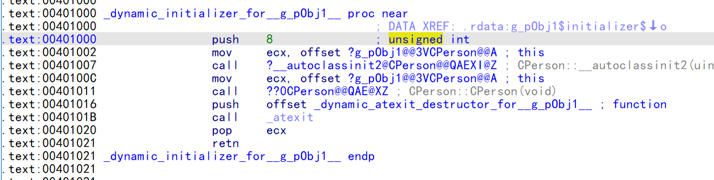
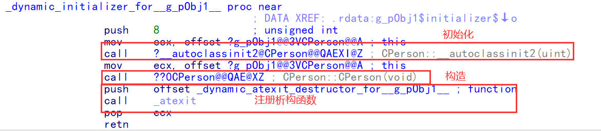
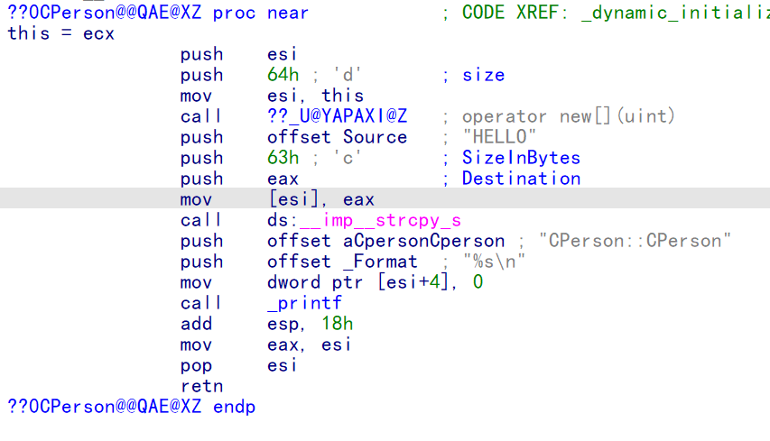

### 普通全局对象

-   生命周期: main 开始之前构造  ,main结束之后析构
-   因此在main函数之初始化,构造属于初始化,因此在Inititem中构造
-   先调用构造函数，然后再通过atexit函数注册析构函数，在软件退出的时候调用析构函数。
-   在调用析构以前，该全局变量都是有效的。














```c++
#include <stdio.h>
#include <string.h>

class CPerson
{

public:
    CPerson()
    {
        m_pszName = new char[100];
        strcpy_s(m_pszName, 99, "HELLO");
        m_nAge = 0;
        printf("%s\n", __FUNCTION__);
    }

    CPerson(int nSize)
    {
        m_pszName = new char[nSize];
        strcpy_s(m_pszName, nSize - 1, "HELLO");
        m_nAge = 0;
        printf("%s\n", __FUNCTION__);
    }
    ~CPerson()
    {
        if (m_pszName != nullptr) {
            delete[] m_pszName;
            m_pszName = nullptr;
        }
        printf("%s\n", __FUNCTION__);
    }

    int  GetAge() const {
        return m_nAge;
    }

    void  SetAge(int nAge) {
        m_nAge = nAge;
    }

private:
    char* m_pszName;
    int m_nAge;
};
 
CPerson  g_pObj1;

int main()
{
     printf("main end\n");
     return 0;
}
```

```
构造函数
_dynamic_initializer_for__g_pObj1__+11↑p
.text:00401030 this = ecx
.text:00401030                 push    esi
.text:00401031                 push    64h ; 'd'       ; size
.text:00401033                 mov     esi, this
.text:00401035                 call    ??_U@YAPAXI@Z   ; operator new[](uint)
.text:0040103A                 push    offset Source   ; "HELLO"
.text:0040103F                 push    63h ; 'c'       ; SizeInBytes
.text:00401041                 push    eax             ; Destination
.text:00401042                 mov     [esi], eax
.text:00401044                 call    ds:__imp__strcpy_s
.text:0040104A                 push    offset aCpersonCperson ; "CPerson::CPerson"
.text:0040104F                 push    offset _Format  ; "%s\n"
.text:00401054                 mov     dword ptr [esi+4], 0
.text:0040105B                 call    _printf
.text:00401060                 add     esp, 18h
.text:00401063                 mov     eax, esi
.text:00401065                 pop     esi
.text:00401066                 retn
.text:00401066 ??0CPerson@@QAE@XZ endp
```

#### 构造代理

##### 1.注册析构函数

```
内联后的析构代理
.text:00401000 _dynamic_initializer_for__g_pObj1__ proc near
.text:00401000                                         ; DATA XREF: .rdata:g_pObj1$initializer$↓o
.text:00401000                 push    64h ; 'd'       ; size
.text:00401002                 call    ??_U@YAPAXI@Z   ; operator new[](uint)
.text:00401007                 push    offset Source   ; "HELLO"
.text:0040100C                 push    63h ; 'c'       ; SizeInBytes
.text:0040100E                 push    eax             ; Destination
.text:0040100F                 mov     ?g_pObj1@@3VCPerson@@A.m_pszName, eax ; CPerson g_pObj1
.text:00401014                 call    ds:__imp__strcpy_s
.text:0040101A                 push    offset aCpersonCperson ; "CPerson::CPerson"
.text:0040101F                 push    offset _Format  ; "%s\n"
.text:00401024                 mov     ?g_pObj1@@3VCPerson@@A.m_nAge, 0 ; CPerson g_pObj1
.text:0040102E                 call    _printf
.text:00401033                 push    offset _dynamic_atexit_destructor_for__g_pObj1__ ; function
.text:00401038                 call    _atexit
.text:0040103D                 add     esp, 1Ch
.text:00401040                 retn
.text:00401040 _dynamic_initializer_for__g_pObj1__ endp
```

##### 2.传递构造函数的参数

​         构造函数本身是不可以传参数的,所以得生成一个函数,然后靠这个函数传值,这也是全局对象一定会产生构造代理的原因,就算内联还是得产生构造代理

```c++
#include <stdio.h>
#include <string.h>

class CPerson
{

public:
    CPerson()
    {
        m_pszName = new char[100];
        strcpy_s(m_pszName, 99, "HELLO");
        m_nAge = 0;
        printf("%s\n", __FUNCTION__);
    }

    CPerson(int nSize)
    {
        m_pszName = new char[nSize];
        strcpy_s(m_pszName, nSize - 1, "HELLO");
        m_nAge = 0;
        printf("%s\n", __FUNCTION__);
    }
    ~CPerson()
    {
        if (m_pszName != nullptr) {
            delete[] m_pszName;
            m_pszName = nullptr;
        }
        printf("%s\n", __FUNCTION__);
    }

    int  GetAge() const {
        return m_nAge;
    }

    void  SetAge(int nAge) {
        m_nAge = nAge;
    }

private:
    char* m_pszName;
    int m_nAge;
};
 
CPerson  g_pObj2(10);
int main()
{
 
     printf("main end\n");
     return 0;
}

```

```
内联
.text:00401000 _dynamic_initializer_for__g_pObj2__ proc near
.text:00401000                                         ; DATA XREF: .rdata:g_pObj2$initializer$↓o
.text:00401000                 push    0Ah             ; size
.text:00401002                 call    ??_U@YAPAXI@Z   ; operator new[](uint)
.text:00401007                 push    offset Source   ; "HELLO"
.text:0040100C                 push    9               ; SizeInBytes
.text:0040100E                 push    eax             ; Destination
.text:0040100F                 mov     ?g_pObj2@@3VCPerson@@A.m_pszName, eax ; CPerson g_pObj2
.text:00401014                 call    ds:__imp__strcpy_s
.text:0040101A                 push    offset aCpersonCperson ; "CPerson::CPerson"
.text:0040101F                 push    offset _Format  ; "%s\n"
.text:00401024                 mov     ?g_pObj2@@3VCPerson@@A.m_nAge, 0 ; CPerson g_pObj2
.text:0040102E                 call    _printf
.text:00401033                 push    offset _dynamic_atexit_destructor_for__g_pObj2__ ; function
.text:00401038                 call    _atexit
.text:0040103D                 add     esp, 1Ch
.text:00401040                 retn
.text:00401040 _dynamic_initializer_for__g_pObj2__ endp
```

```
不内联
.text:00401000 _dynamic_initializer_for__g_pObj2__ proc near
.text:00401000                                         ; DATA XREF: .rdata:g_pObj2$initializer$↓o
.text:00401000                 push    8               ; unsigned int
.text:00401002                 mov     ecx, offset ?g_pObj2@@3VCPerson@@A ; this
.text:00401007                 call    ?__autoclassinit2@CPerson@@QAEXI@Z ; CPerson::__autoclassinit2(uint)
.text:0040100C                 push    0Ah             ; nSize
.text:0040100E                 mov     ecx, offset ?g_pObj2@@3VCPerson@@A ; this
.text:00401013                 call    ??0CPerson@@QAE@H@Z ; CPerson::CPerson(int)
.text:00401018                 push    offset _dynamic_atexit_destructor_for__g_pObj2__ ; function
.text:0040101D                 call    _atexit
.text:00401022                 pop     ecx
.text:00401023                 retn
.text:00401023 _dynamic_initializer_for__g_pObj2__ endp
```

##### 总结

因此识别全局对象只需要看main之前有没有构造代理

构造代理里面可以同时初始化多个全局对象,即多个全局对象可以共用一个全局代理函数

如果类本身没有 构造 和析构函数,可以还原成结构体,因为没有区别


### 静态全局对象

静态全局对象和普通全局对象没有区别,只是作用域不同 ,因此静态是无法还原的,他只是在编译的时候做检查

对于编译器来说,跟普通全局对象是一样的

```c++

#include <stdio.h>
#include <string.h>

class CPerson
{

public:
    CPerson()
    {
        m_pszName = new char[100];
        strcpy_s(m_pszName, 99, "HELLO");
        m_nAge = 0;
        printf("%s\n", __FUNCTION__);
    }

    CPerson(int nSize)
    {
        m_pszName = new char[nSize];
        strcpy_s(m_pszName, nSize - 1, "HELLO");
        m_nAge = 0;
        printf("%s\n", __FUNCTION__);
    }
    ~CPerson()
    {
        if (m_pszName != nullptr) {
            delete[] m_pszName;
            m_pszName = nullptr;
        }
        printf("%s\n", __FUNCTION__);
    }

    int  GetAge() const {
        return m_nAge;
    }

    void  SetAge(int nAge) {
        m_nAge = nAge;
    }

private:
    char* m_pszName;
    int m_nAge;
};
 
static CPerson  g_pObj2;
int main()
{
 
     printf("main end\n");
     return 0;
}

```

```
构造代理
.text:00401000 _dynamic_initializer_for__g_pObj2__ proc near
.text:00401000                                         ; DATA XREF: .rdata:g_pObj2$initializer$↓o
.text:00401000                 push    8               ; unsigned int
.text:00401002                 mov     ecx, offset g_pObj2 ; this
.text:00401007                 call    ?__autoclassinit2@CPerson@@QAEXI@Z ; CPerson::__autoclassinit2(uint)
.text:0040100C                 push    0Ah             ; nSize
.text:0040100E                 mov     ecx, offset g_pObj2 ; this
.text:00401013                 call    ??0CPerson@@QAE@H@Z ; CPerson::CPerson(int)
.text:00401018                 push    offset _dynamic_atexit_destructor_for__g_pObj2__ ; function
.text:0040101D                 call    _atexit
.text:00401022                 pop     ecx
.text:00401023                 retn
.text:00401023 _dynamic_initializer_for__g_pObj2__ endp
```

```
构造函数
.text:00401030 ??0CPerson@@QAE@H@Z proc near           ; CODE XREF: 
_dynamic_initializer_for__g_pObj2__+13↑p
.text:00401030
.text:00401030 nSize           = dword ptr  8
.text:00401030
.text:00401030 this = ecx
.text:00401030                 push    ebp
.text:00401031                 mov     ebp, esp
.text:00401033                 push    esi
.text:00401034                 mov     esi, [ebp+nSize]
.text:00401037                 push    edi
.text:00401038                 push    esi             ; size
.text:00401039                 mov     edi, this
.text:0040103B                 call    ??_U@YAPAXI@Z   ; operator new[](uint)
.text:00401040                 push    offset Source   ; "HELLO"
.text:00401045                 lea     edx, [esi-1]
.text:00401048                 mov     [edi], eax
.text:0040104A                 push    edx             ; SizeInBytes
.text:0040104B                 push    eax             ; Destination
.text:0040104C                 call    ds:__imp__strcpy_s
.text:00401052                 push    offset aCpersonCperson ; "CPerson::CPerson"
.text:00401057                 push    offset _Format  ; "%s\n"
.text:0040105C                 mov     dword ptr [edi+4], 0
.text:00401063                 call    _printf
.text:00401068                 add     esp, 18h
.text:0040106B                 mov     eax, edi
.text:0040106D                 pop     edi
.text:0040106E                 pop     esi
.text:0040106F                 pop     ebp
.text:00401070                 retn    4
.text:00401070 ??0CPerson@@QAE@H@Z endp
```

#### 静态局部对象

会在面函数入口 调用构造代理,放全局也没问题(老版本就是),前提是不能有变参

```c++

#include <stdio.h>
#include <string.h>

class CPerson
{

public:
    CPerson()
    {
        m_pszName = new char[100];
        strcpy_s(m_pszName, 99, "HELLO");
        m_nAge = 0;
        printf("%s\n", __FUNCTION__);
    }

    CPerson(int nSize)
    {
        m_pszName = new char[nSize];
        strcpy_s(m_pszName, nSize - 1, "HELLO");
        m_nAge = 0;
        printf("%s\n", __FUNCTION__);
    }
    ~CPerson()
    {
        if (m_pszName != nullptr) {
            delete[] m_pszName;
            m_pszName = nullptr;
        }
        printf("%s\n", __FUNCTION__);
    }

    int  GetAge() const {
        return m_nAge;
    }

    void  SetAge(int nAge) {
        m_nAge = nAge;
    }

private:
    char* m_pszName;
    int m_nAge;
};
 

int main()
{
    static CPerson  g_pOb4;
     printf("main end\n");
     return 0;
}
```

```
.text:00401058                 push    eax
.text:00401059                 lea     eax, [ebp+var_C]
.text:0040105C                 mov     large fs:0, eax
.text:00401062                 mov     eax, large fs:2Ch
.text:00401068                 mov     ecx, [eax]
.text:0040106A                 mov     eax, $TSS0
.text:0040106F                 cmp     eax, [ecx+4]
.text:00401075                 jle     short loc_4010E9
.text:00401077                 push    offset $TSS0    ; pOnce
.text:0040107C                 call    __Init_thread_header
.text:00401081                 add     esp, 4
.text:00401084                 cmp     $TSS0, 0FFFFFFFFh
.text:0040108B                 jnz     short loc_4010E9        ;判断是否初数化
.text:0040108D                 xorps   xmm0, xmm0
.text:00401090 ;   try {
                                             ;构造代理
.text:00401090                 mov     [ebp+var_4], 0
.text:00401097                 push    64h ; 'd'       ; size
.text:00401099                 movlpd  qword ptr g_pOb4.m_pszName, xmm0
.text:004010A1                 call    ??_U@YAPAXI@Z   ; operator new[](uint)
.text:004010A6                 push    offset Source   ; "HELLO"
.text:004010AB                 push    63h ; 'c'       ; SizeInBytes
.text:004010AD                 push    eax             ; Destination
.text:004010AE                 mov     g_pOb4.m_pszName, eax
.text:004010B3                 call    ds:__imp__strcpy_s
.text:004010B9                 push    offset aCpersonCperson_0 ; "CPerson::CPerson"
.text:004010BE                 push    offset _Format  ; "%s\n"
.text:004010C3                 mov     g_pOb4.m_nAge, 0
.text:004010CD                 call    _printf
.text:004010D2                 push    offset _main____2____dynamic_atexit_destructor_for__g_pOb4__ ; 
.text:004010D7                 call    _atexit
.text:004010DC                 push    offset $TSS0    ; pOnce
.text:004010E1                 call    __Init_thread_footer
.text:004010E6                 add     esp, 20h
.text:004010E9
.text:004010E9 loc_4010E9:                             ; CODE XREF: _main+35↑j
.text:004010E9                                         ; _main+4B↑j
.text:004010E9                 push    offset aMainEnd ; "main end\n"
.text:004010EE                 call    _printf
.text:004010F3                 add     esp, 4
.text:004010F6                 xor     eax, eax
.text:004010F8                 mov     ecx, [ebp+var_C]
.text:004010FB                 mov     large fs:0, ecx
.text:00401102                 pop     ecx
.text:00401103                 mov     esp, ebp
.text:00401105                 pop     ebp
.text:00401106                 retn
.text:00401106 ;   } // starts at 401090
```

###### 静态局部变量传变参

此时,构造代理只能放main(),不能放全局,通过标志  $TSS0   来判断是否初始化 ,如果<= 0 就代表已经初始化,如果没初始化,就会调构造代理,如果已经初始化,就不会调用   

```c++
#include <stdio.h>
#include <string.h>

class CPerson
{

public:
    CPerson()
    {
        m_pszName = new char[100];
        strcpy_s(m_pszName, 99, "HELLO");
        m_nAge = 0;
        printf("%s\n", __FUNCTION__);
    }

    CPerson(int nSize)
    {
        m_pszName = new char[nSize];
        strcpy_s(m_pszName, nSize - 1, "HELLO");
        m_nAge = 0;
        printf("%s\n", __FUNCTION__);
    }
    ~CPerson()
    {
        if (m_pszName != nullptr) {
            delete[] m_pszName;
            m_pszName = nullptr;
        }
        printf("%s\n", __FUNCTION__);
    }

    int  GetAge() const {
        return m_nAge;
    }

    void  SetAge(int nAge) {
        m_nAge = nAge;
    }

private:
    char* m_pszName;
    int m_nAge;
};
 

int main(int argc)
{
     static CPerson g_pOb4(argc);
     printf("main end\n");
     return 0;

```

### 对象作为参数(非指针)

传指针很像成员函数

1.  **函数外构造**
2.  **函数内析构**

#### 浅拷贝

##### 没有构造函数

浅拷贝:  抬栈,把对象成员拷贝到栈里面

当成员较少是,直接 把成员push到栈里面

```c++
#include <stdio.h>
#include <string.h>

class CPerson
{

public:
     ~CPerson()
    {
        if (m_pszName != nullptr) {
            delete[] m_pszName;
            m_pszName = nullptr;
        }
        printf("%s\n", __FUNCTION__);
    }
    int  GetAge() const {
        return m_nAge;
    }

    void  SetAge(int nAge) {
        m_nAge = nAge;
    }

    const char* GetName() {
        return m_pszName;
    }
private:
    char* m_pszName;
    int m_nAge;
};
 
void showPerson(CPerson Obj)
{

}

int main(int argc)
{
     CPerson pObj = {0};
     showPerson(pObj);    //浅拷贝  memcpy
     printf("main end\n");
     return 0;
}

```

```
xorps   xmm0, xmm0
movlpd  qword ptr [ebp+pObj.m_pszName], xmm0
;类对象成员入栈
push    [ebp+pObj.m_nAge]
push    [ebp+pObj.m_pszName] ; Obj
call    ?showPerson@@YAXVCPerson@@@Z ; showPerson(CPerson)
push    offset aMainEnd ; "main end\n"
call    _printf
add     esp, 0Ch
lea     ecx, [ebp+pObj] ; this
call    ??1CPerson@@QAE@XZ ; CPerson::~CPerson(void)


?showPerson@@YAXVCPerson@@@Z proc near
push    ebp
mov     ebp, esp
lea     ecx, [ebp+8]     this指针(不是第一个参数,因为用的lea)
pop     ebp
jmp     ??1CPerson@@QAE@XZ ; CPerson::~CPerson(void)      ;形参出作用域要析构
?showPerson@@YAXVCPerson@@@Z endp
```

当类成员很多或者类很大是,就不会push,而用拷贝

```c++
#include <stdio.h>
#include <string.h>

class CPerson
{

public:

    ~CPerson()
    {
        if (m_pszName != nullptr) {
            delete[] m_pszName;
            m_pszName = nullptr;
        }
        printf("%s\n", __FUNCTION__);
    }


    int  GetAge() const {
        return m_nAge;
    }

    void  SetAge(int nAge) {
        m_nAge = nAge;
    }

    const char* GetName() {
        return m_pszName;
    }
public:
    char* m_pszName;
    int m_nAge;
    int m_nMember[100];
};
 
void showPerson(CPerson Obj)
{
    
}

int main(int argc)
{
     CPerson pObj = {0};
     showPerson(pObj);
     printf("main end\n");
     return 0;
}

```

```
sub     esp, 408
push    esi
push    edi
push    408             ; Size
lea     eax, [ebp+pObj]
push    0               ; Val
push    eax             ; void *
call    _memset
sub     esp, 18Ch
lea     esi, [ebp+pObj]
mov     ecx, 102 ; 'f'
mov     edi, esp
rep movsd
call    ?showPerson@@YAXVCPerson@@@Z ; showPerson(CPerson)
push    offset aMainEnd ; "main end\n"
call    _printf
add     esp, 19Ch
lea     ecx, [ebp+pObj] ; this
call    ??1CPerson@@QAE@XZ ; CPerson::~CPerson(void)
mov     ecx, [ebp+var_4]
```

##### 没有构造和析构

```c++

#include <stdio.h>
#include <string.h>

class CPerson
{

public:
    int  GetAge() const {
        return m_nAge;
    }

    void  SetAge(int nAge) {
        m_nAge = nAge;
    }

    const char* GetName() {
        return m_pszName;
    }
public:
    char* m_pszName;
    int m_nAge;
    int m_nMember[100];
};
 
void showPerson(CPerson Obj)
{
    printf("name:%s\n", Obj.m_pszName);
}

int main(int argc)
{
     CPerson pObj = {0};
     showPerson(pObj);
     printf("main end\n");
     return 0;
}

```

```
push    ebp
mov     ebp, esp
sub     esp, 198h
lea     eax, [ebp+pObj]
push    esi
push    edi
push    198h            ; Size
push    0               ; Val
push    eax             ; void *
call    _memset
sub     esp, 18Ch
lea     esi, [ebp+pObj]
mov     ecx, 66h ; 'f'
mov     edi, esp
rep movsd
call    ?showPerson@@YAXVCPerson@@@Z ; showPerson(CPerson)
push    offset aMainEnd ; "main end\n"
call    _printf
add     esp, 19Ch
xor     eax, eax
pop     edi
pop     esi
mov     esp, ebp
pop     ebp
retn
```

可以看到此时没有析构,所以无法判断是否为对象,当做结构也是可以的

```
?showPerson@@YAXVCPerson@@@Z proc near

Obj= CPerson ptr  8

push    ebp
mov     ebp, esp
push    [ebp+Obj.m_pszName]
push    offset _Format  ; "name:%s\n"
call    _printf
add     esp, 8
pop     ebp
retn
?showPerson@@YAXVCPerson@@@Z endp
```

#### 深拷贝

当一个对象有拷贝构造,那么将不能浅拷贝

把栈顶当this指针,再调拷贝构造,说明参数是对象

```c++
#include <stdio.h>
#include <string.h>

class CPerson
{

public:

    CPerson()
    {
        m_pszName = new char[100];
        strcpy_s(m_pszName, 99, "HELLO");
        m_nAge = 0;
        printf("%s\n", __FUNCTION__);
    }

    CPerson(int nSize)
    {
        m_pszName = new char[nSize];
        strcpy_s(m_pszName, nSize - 1, "HELLO");
        m_nAge = 0;
        printf("%s\n", __FUNCTION__);
    }

    CPerson(const CPerson& obj)
    {
        m_pszName = new char[100];
        m_nAge = 0;
        strcpy_s(m_pszName, 99, obj.m_pszName);
        printf("copy %s\n", __FUNCTION__);
    }

    ~CPerson()
    {
        if (m_pszName != nullptr) {
            delete[] m_pszName;
            m_pszName = nullptr;
        }
        printf("%s\n", __FUNCTION__);
    }

    int  GetAge() const {
        return m_nAge;
    }

    void  SetAge(int nAge) {
        m_nAge = nAge;
    }

    const char* GetName() {
        return m_pszName;
    }
public:
    char* m_pszName;
    int m_nAge;
};
 
void showPerson(CPerson Obj)
{
    printf("name:%s\n", Obj.m_pszName);
}

int main(int argc)
{
     CPerson pObj = {0};
     showPerson(pObj);    //深拷贝
     printf("main end\n");
     return 0;
}
```

```
xor     eax, ebp
mov     [ebp+var_10], eax
push    eax
lea     eax, [ebp+var_C]
mov     large fs:0, eax
push    8               ; unsigned int
lea     ecx, [ebp+pObj] ; this
call    ?__autoclassinit2@CPerson@@QAEXI@Z ; CPerson::__autoclassinit2(uint)
push    0               ; nSize
lea     ecx, [ebp+pObj] ; this
call    ??0CPerson@@QAE@H@Z ; CPerson::CPerson(int)
sub     esp, 8
;   try {
mov     [ebp+var_4], 0
lea     eax, [ebp+pObj]
mov     ecx, esp        ; this
;把栈顶当this指针,再调拷贝构造,说明参数是对象
push    eax             ; obj
call    ??0CPerson@@QAE@ABV0@@Z ; CPerson::CPerson(CPerson const &)
call    ?showPerson@@YAXVCPerson@@@Z ; showPerson(CPerson)
push    offset aMainEnd ; "main end\n"
call    _printf
add     esp, 0Ch
lea     ecx, [ebp+pObj] ; this
call    ??1CPerson@@QAE@XZ ; CPerson::~CPerson(void)
xor     eax, eax
```

```
?showPerson@@YAXVCPerson@@@Z proc near
push    ebp
mov     ebp, esp
push    [ebp+Obj.m_pszName]
push    offset aNameS   ; "name:%s\n"
call    _printf
add     esp, 80
lea     ecx, [ebp+8]       ;拿this指针调析构
pop     ebp
jmp     ??1CPerson@@QAE@XZ ; CPerson::~CPerson(void)  ;  jmp 的好处是不用将返回地址压栈
?showPerson@@YAXVCPerson@@@Z endp
```

 对象做返回值(非指针) 

如果没有构造和析构可以当结构体返回

**1**函数内构造

**2**函数外析构

```c++
#include <stdio.h>
#include <string.h>

class CPerson
{

public:

    CPerson()
    {
        m_pszName = new char[100];
        strcpy_s(m_pszName, 99, "HELLO");
        m_nAge = 0;
        printf("%s\n", __FUNCTION__);
    }

    CPerson(int nSize)
    {
        m_pszName = new char[nSize];
        strcpy_s(m_pszName, nSize - 1, "HELLO");
        m_nAge = 0;
        printf("%s\n", __FUNCTION__);
    }

    CPerson(const CPerson& obj)
    {
        m_pszName = new char[100];
        m_nAge = 0;
        strcpy_s(m_pszName, 99, obj.m_pszName);
        printf("copy %s\n", __FUNCTION__);
    }

    ~CPerson()
    {
        if (m_pszName != nullptr) {
            delete[] m_pszName;
            m_pszName = nullptr;
        }
        printf("%s\n", __FUNCTION__);
    }


    int  GetAge() const {
        return m_nAge;
    }

    void  SetAge(int nAge) {
        m_nAge = nAge;
    }

    const char* GetName() {
        return m_pszName;
    }
public:
    char* m_pszName;
    int m_nAge;
};
 
//此处debug版和release版有区别:应该是 先构造  obj  在用obj取构造返回对象 而 obj 的this是从参数传过来的
//因此应该是 先构造 obj 在拷贝构造参数  release直接优成了 构造 返回值对象
CPerson getPerson()
{
    CPerson obj;
    return obj;
}

int main(int argc)
{
     printf("age:%d\n", getPerson().GetAge());
     return 0;
}
```

```
push    ebp
mov     ebp, esp
sub     esp, 8
lea     eax, [ebp+result]
push    eax             ;传了一个参数
call    ?getPerson@@YA?AVCPerson@@XZ ; getPerson(void)
add     esp, 4
mov     ecx, eax        ; this     
call    ?GetAge@CPerson@@QBEHXZ ; CPerson::GetAge(void)
push    eax
push    offset aAgeD    ; "age:%d\n"
call    _printf
add     esp, 8
lea     ecx, [ebp+result] ; this
call    ??1CPerson@@QAE@XZ ; CPerson::~CPerson(void)    ;析构
xor     eax, eax
mov     esp, ebp
pop     ebp
retn
```

```
?getPerson@@YA?AVCPerson@@XZ proc near
push    ebp
mov     ebp, esp
push    esi
mov     esi, [ebp+result]
mov     ecx, esi        ; this
push    8               ; unsigned int
call    ?__autoclassinit2@CPerson@@QAEXI@Z ; CPerson::__autoclassinit2(uint)
mov     ecx, esi        ; this
call    ??0CPerson@@QAE@XZ ; CPerson::CPerson(void)       ;对参数进行了构造
mov     eax, esi      ;返回参数
pop     esi
pop     ebp
retn
?getPerson@@YA?AVCPerson@@XZ endp
```

```
debug版
text:00411E2A                 push    eax             ; result
.text:00411E2B                 call    j_?getPerson@@YA?AVCPerson@@XZ ; getPerson(void)
.text:00411E30                 add     esp, 4
.text:00411E33                 mov     [ebp+var_E0], eax
.text:00411E39                 mov     ecx, [ebp+var_E0]
.text:00411E3F                 mov     [ebp+var_E4], ecx
.text:00411E45                 mov     [ebp+var_4], 0
.text:00411E4C                 mov     ecx, [ebp+var_E4] ; this
.text:00411E52                 call    j_?GetAge@CPerson@@QBEHXZ ; CPerson::GetAge(void)
.text:00411E57                 push    eax
.text:00411E58                 push    offset aAgeD    ; "age:%d\n"
.text:00411E5D                 call    j__printf
.text:00411E62                 add     esp, 8
.text:00411E65                 mov     [ebp+var_4], 0FFFFFFFFh
.text:00411E6C                 lea     ecx, [ebp+result] ; this
.text:00411E72                 call    j_??1CPerson@@QAE@XZ ; CPerson::~CPerson(void)
.text:00411E77                 xor     eax, eax
.text:00411C23                 lea     ecx, [ebp+obj]  ; this
.text:00411C26                 call    j_?__autoclassinit2@CPerson@@QAEXI@Z ; CPerson::__autoclassinit2(uint)
;自己构造
.text:00411C2B                 lea     ecx, [ebp+obj]  ; this
.text:00411C2E                 call    j_??0CPerson@@QAE@XZ ; CPerson::CPerson(void)
.text:00411C33                 mov     [ebp+var_4], 0
.text:00411C3A                 lea     eax, [ebp+obj]
;调用拷贝构造
.text:00411C3D                 push    eax             ; obj
.text:00411C3E                 mov     ecx, [ebp+result] ; this
.text:00411C41                 call    j_??0CPerson@@QAE@ABV0@@Z ; CPerson::CPerson(CPerson const &)
.text:00411C46                 mov     ecx, [ebp+var_E8]
.text:00411C4C                 or      ecx, 1
.text:00411C4F                 mov     [ebp+var_E8], ecx
.text:00411C55                 mov     [ebp+var_4], 0FFFFFFFFh
;自己再析构
.text:00411C5C                 lea     ecx, [ebp+obj]  ; this
.text:00411C5F                 call    j_??1CPerson@@QAE@XZ ; CPerson::~CPerson(void)
.text:00411C64                 mov     eax, [ebp+result]
.text:00411C67                 push    edx
.text:00411C68                 mov     ecx, ebp        ; frame
.text:00411C6A                 push    eax
.text:00411C6B                 lea     edx, v          ; v
.text:00411C71                 call    j_@_RTC_CheckStackVars@8 ; _RTC_CheckStackVars(x,x)
.text:00411C76                 pop     eax
.text:00411C77                 pop     edx
.text:00411C78                 mov     ecx, [ebp+var_C]
.text:00411C7B                 mov     large fs:0, ecx
```

#### 无名对象

无名对象会被优掉

```c++
// C++RE.cpp : 此文件包含 "main" 函数。程序执行将在此处开始并结束。
//

#include <stdio.h>
#include <string.h>

class CPerson
{

public:

    CPerson()
    {
        m_pszName = new char[100];
        strcpy_s(m_pszName, 99, "HELLO");
        m_nAge = 0;
        printf("%s\n", __FUNCTION__);
    }

    CPerson(int nSize)
    {
        m_pszName = new char[nSize];
        strcpy_s(m_pszName, nSize - 1, "HELLO");
        m_nAge = 0;
        printf("%s\n", __FUNCTION__);
    }

    CPerson(const CPerson& obj)
    {
        m_pszName = new char[100];
        m_nAge = 0;
        strcpy_s(m_pszName, 99, obj.m_pszName);
        printf("copy %s\n", __FUNCTION__);
    }

    ~CPerson()
    {
        if (m_pszName != nullptr) {
            delete[] m_pszName;
            m_pszName = nullptr;
        }
        printf("%s\n", __FUNCTION__);
    }


    int  GetAge() const {
        return m_nAge;
    }

    void  SetAge(int nAge) {
        m_nAge = nAge;
    }

    const char* GetName() {
        return m_pszName;
    }
public:
    char* m_pszName;
    int m_nAge;
};
 

CPerson getPerson()
{
  
    return CPerson();   //无名对象
}

int main(int argc)
{
     printf("age:%d\n", getPerson().GetAge());
     return 0;
}

```

