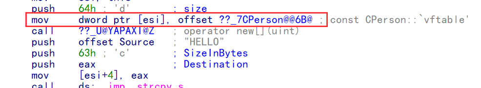
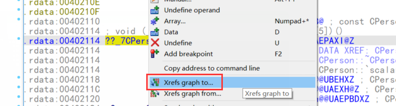
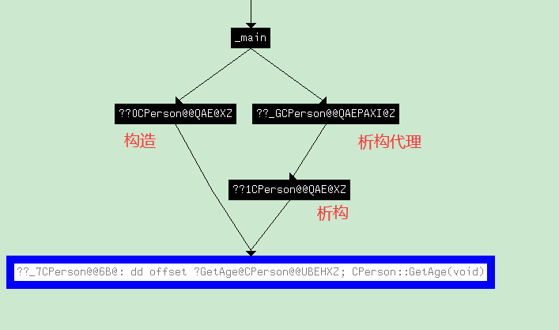
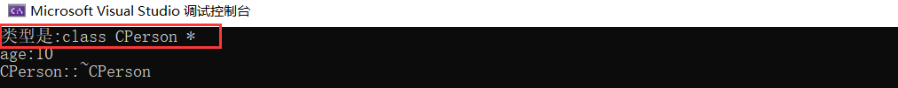
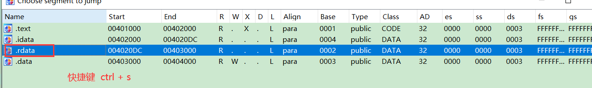
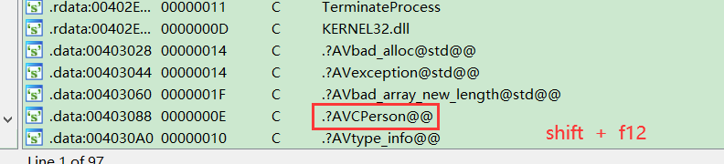
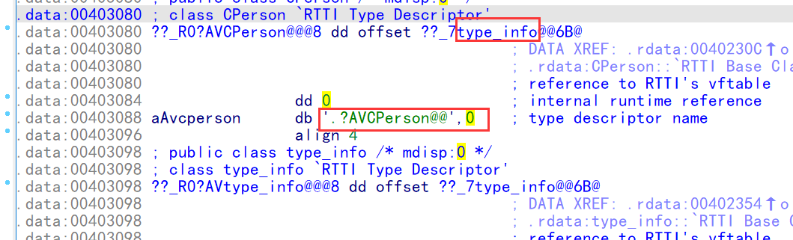
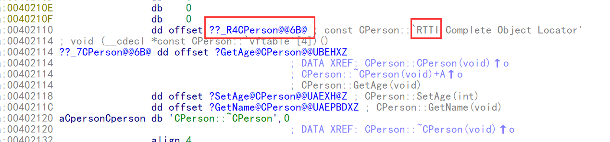
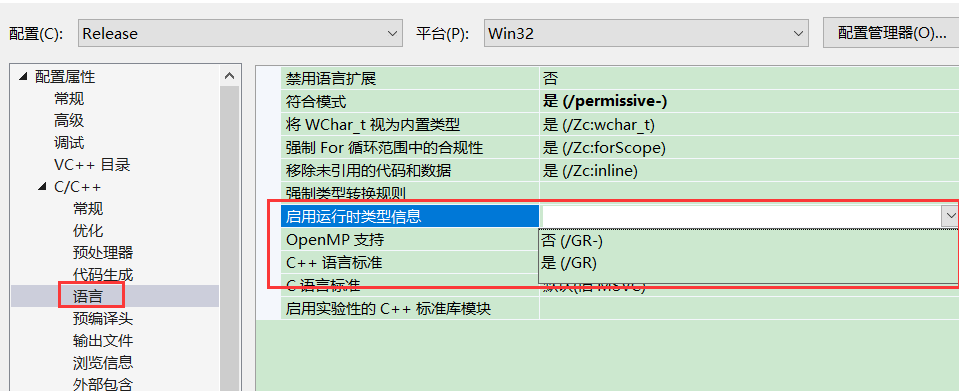
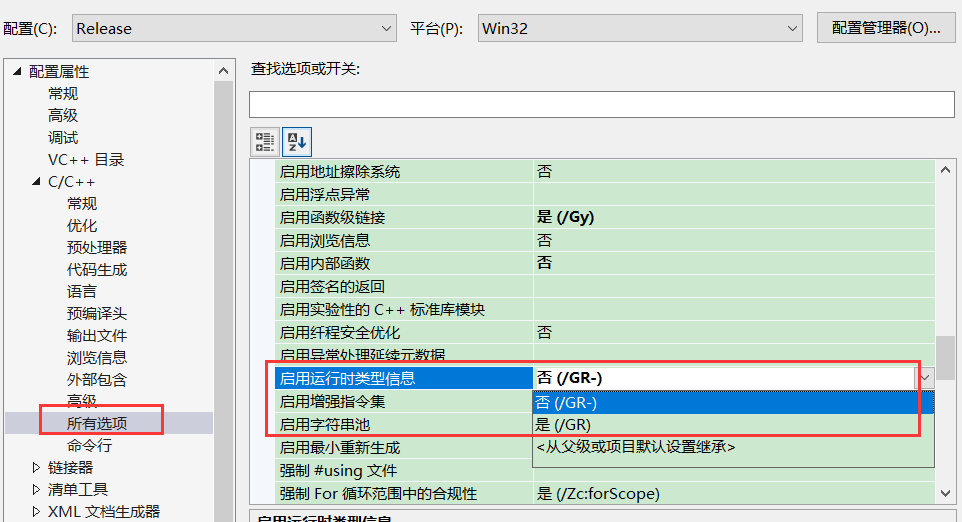

### 虚函数(多态)

-   虚函数不可被优化，是识别面向对象的重要依据。
-   关键字：virtual 
-   一般虚函数中都是重要的函数,有时候还原类时,重点是虚表中的函数,不知道函数功能时,可以调试时下断点

####  多态

1.  虚函数 ( 运行时多态)  :  软件不运行不知道去哪
2.  函数重载  (编译期多态) :   两个函数同名构成重载, , 根据名称粉碎来实现

#### 让代码产生多态的方法:

1.  指针调用虚函数
2.   引用调用虚函数


#### 1.概念回顾

-   -   定义一个函数为虚函数，不代表函数为不被实现的函数。
    -   定义他为虚函数是为了允许用基类的指针来调用子类的这个函数。
    -   定义一个函数为纯虚函数，才代表函数没有被实现。
    -   定义纯虚函数是为了实现一个接口，起到一个规范的作用，规范继承这个类的程序员必须实现这个函数。

#### 2.虚函数的典型应用

```c++
class A 
{ 
public: 
    virtual void foo() 
    { 
        cout<<"A::foo() is called"<<endl; 
    } 
}; 
class B:public A 
{ 
public: 
    void foo() 
    { 
        cout<<"B::foo() is called"<<endl; 
    } 
}; 
int main(void) 
{ 
    A *a = new B(); 
    a->foo();   // 在这里，a虽然是指向A的指针，但是被调用的函数(foo)却是B的! 
    return 0; 
}
```

上例说明：虚函数虚就虚在所谓“推迟联编”或者“动态联编”上，一个类函数的调用并不是在编译时刻被确定的，而是在运行时刻被确定的。由于编写代码的时候并不能确定被调用的是基类的函数还是哪个派生类的函数，所以被成为“虚”函数。 虚函数只能借助于指针或者引用来达到多态的效果。

 3.总结 

 （1）没有虚表指针 

●没有虚函数的情况下没有虚表指针

 （2）有虚表指针 

1虚表指针的产生是看你有没有 virtual这个关键字

2虚表指针存储的是虚表的首地址，虚表可以看做是一个数组

3虚表中存储的是虚函数的地址.

●当使用 对象.函数 时，则使用名称粉碎来匹配函数 

●虚表没有个数的指示，只能通过查看调用时访问虚表的偏移来判断虚表有几项

 虚表指针 




●构造时，会填写虚表指针：

○1.将对象存入一个局部变量保存

○2.局部变量中转给eax

○3.对eax取内容填写虚表地址. 

●总结：取出对象的首4个字节,填写虚表

●找到了虚表,则可以找到构造,析构,以及虚表中存储的所有虚函数了




 虚表 

●对其位置下一个引用图表,谁引用了我,则可以看到调用它的所有构造以及析构了,

○1.构造的时候会填写虚表

○2.析构的时候会填写虚表




 1.虚表 

●1.如果一个类至少有一个虚函数

●2.虚表在全局数据区或者说常量区,因为常量区的数据不能修改

●3.虚表指针在对象首地址处

​               不放在全局变量而放在对象首地址处,是因为继承

​               类对象作为参数,派生类转基类可以传参,此时将无法确定调用那个虚表,因此需要有一个字段来判断,放在对象首地   

​        址处是可以不用时就释放,因此在虚表在使用这个对象的时候就要填写,因此必须在构造入口填写,因为构造里面可以调

​        虚函数

●4.所有表项指向成员函数指针

●5.虚表不一定以0结尾

●6.构造函数填充虚表指针,如果没有构造函数将自动生成默认构造来填写虚表

●7.析构函数还原虚表指针(析构函数调用虚函数无多态性)

​                      有虚函数时,析构在开始也要回填虚表

​                      因为析构里面也能调虚函数,当存在派生类时,虚表首地址会被覆盖成派生类的,此时在析构里调虚函数会调派生              类的,而此时派生类已经被析构(析构时 会先析构派生类,再析构基类),此时查表查的是派生类的虚表,就会调用已经析      	     构的派生类的函数,可能访问派生类的成员,就会崩,因此需要把自己的虚表地址填写回去

●8 虚表大小是不确定的,可以通过标号来判断结束

●9. 还可以根据结尾置位是否是函数指针来判断虚表是否结束


 2.总结 

●1.识别虚表指针可以在构造中或者析构中查看

●2.虚表指针双击过去则可以看到所有的虚函数的地址

●3.对虚表指针来个引用,(谁引用我)可以看到所有的构造和析构


 虚函数的调用 

 1.普通成员函数调用和虚函数调用的区别 

●1.普通成员函数调用,直接Call 

●2.虚函数调用

○2.1 首先获得虚表指针

○2.2 间接调用虚表指针指向的虚表的内容(虚成员函数地址)

 2.识别调用普通成员函数和虚函数的特征 

●1.普通成员函数直接调用Call

●2.虚函数会通过虚表指针指向的虚表来间接调用

 3.小结 

●1.无多态调用虚函数，直接调用成员函数 

●2.多态调用虚函数﴾指针或者引用﴿，通过虚表间接调用虚函数


 RTTI 

```c++
#include <typeinfo>

void  ShowAge(CPerson* pObj)
{
  //类型识别
 printf("类型是:%s\n", typeid(pObj).name());

  pObj->SetAge(10); //call [g_vtable+8] call [[this->vtable]+4]
  printf("age:%d\n", pObj->GetAge());
}
```




编译的的时候,就会把字符串存起来








#### 通过虚表识别类名

高版本才有，低版本没有

在高版本中,只要类写了虚函数,就会这个类生成一个 RTTI 结构体,放在虚表上面,这样我们就可以得到类名




#### 关闭RTTI



或者



注意,rtti不是相关就能关的,因此c++生成代码的时候会增加很多额外代码

关了虽然虚表上面没有,但是字符串还可能存在

```c++
try{
    
    CPerson* pObj = new CPerson;
    showAge(pObj);
    delete pObj;

}
catch(CPerson e)
{
    printf("....");
}
```

