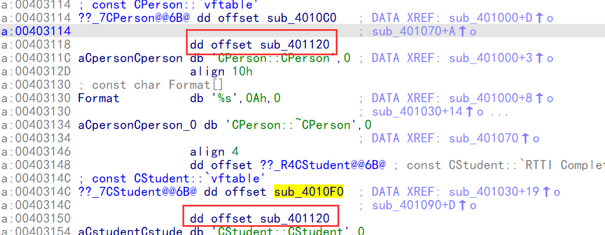

### 单重继承

#### 语法

##### 构造函数

1.  调用基类构造
2.  成员对象构造
3.  自己

##### 析构函数

1.  自己析构 
2.  成员对象析构
3.  调用基类析构

#### 

#### 父类和派生类都没有虚表

##### 内存布局

base::member

derived::member

##### 课堂案例

当一个类没有虚函数的时候很难识别出继承关系

```c++
#include <stdio.h>
#include <string.h>

class CPerson
{
public:
    CPerson()
    {
        m_nAge = 10;
        printf("%s\n", __FUNCTION__);
    }
    ~CPerson()
    {
        printf("%s\n", __FUNCTION__);
    }
    int  GetAge() const {
        return m_nAge;
    }
    void  SetAge(int nAge) {
        m_nAge = nAge;
    }

public:
    int m_nAge;
};

class CStudent :public CPerson
{
public:
    CStudent()
    {
        m_nID = 10;
        printf("%s\n", __FUNCTION__);
    }
    ~CStudent()
    {
        printf("%s\n", __FUNCTION__);
    }
public:
    int m_nID;
};


int main(int argc)
{
    CStudent  stu;
    return 0;
}

```

```
在看不到字符串的情况下无法推测是否为析构 和 构造函数
push    ebp
mov     ebp, esp
sub     esp, 8
lea     ecx, [ebp+var_8]
call    sub_401020
lea     ecx, [ebp+var_8]
call    sub_401070
xor     eax, eax
mov     esp, ebp
pop     ebp
当没有pbd问件事我们无法确定下面的是构造函数,因为只能看到返回 this指针, 可能返回结构体也是这样
sub_401020 proc near
push    ebp
mov     ebp, esp
push    ecx
push    esi
mov     esi, ecx
mov     [ebp+var_4], esi
call    sub_401000                  ;先调用基类的构造
push    offset aCstudentCstude ; "CStudent::CStudent"
push    offset Format   ; "%s\n"
mov     dword ptr [esi+4], 0Ah
call      printf
add     esp, 8
mov     eax, esi
pop     esi
mov     esp, ebp
pop     ebp
retn
sub_401020 endp
sub_401070 proc near
push    esi
push    offset aCstudentCstude_0 ; "CStudent::~CStudent"
push    offset Format   ; "%s\n"
mov     esi, ecx
call     printf
add     esp, 8
mov     ecx, esi
pop     esi
jmp     loc_401050   自己析构后再调基类的析构
sub_401070 endp
loc_401050:
push    offset aCpersonCperson_0 ; "CPerson::~CPerson"
push    offset Format   ; "%s\n"
call    sub_4010F0
add     esp, 8
retn
; END OF FUNCTION CHUNK FOR sub_401070
```

#### 父类或派生类存在虚表

当基类是虚函数,派生类对应的函数 不加   virtual  也会默认是虚函数

##### 内存布局

vftable

base::member

derived::member


##### 虚表：

1.拷贝基类虚表

2.覆盖基类虚表

3.追加自己的虚函数


##### 识别

###### 利用构造识别

1.  填充虚表前有代码
2.  出现覆盖虚表
3.  this指针无变化

###### 利用析构识别

1.  填充虚表后有代码
2.  出现覆盖虚表
3.  this指针无变化

###### 利用虚表识别

如果2个类中的虚表存在 同一个函数,那么说明存在继承关系 (虚表中函数较少的是基类)



注意: 在 release版中,可能会时效, **开了全局优化和内联,**之后,如果 很多类里面的函数功能很简单,代码相同(汇编代码相同),那他就会生成一个公共函数, 再往这些类的虚表里面填.


##### 课堂案例

基类的构造必须在派生类之前,因此 积累的构造必须在 派生类填写虚表之前

因此在填写虚表之前有其他代码,只能是积累的构造代码,可以递归

所以识别有序表的继承很简单,看看填写虚表之前有没有其他功能性代码,如果有代码就有继承

```c++
#include <stdio.h>
#include <string.h>

class CPerson
{
public:
    CPerson()
    {
        m_nAge = 10;
        printf("%s\n", __FUNCTION__);
    }
    virtual ~CPerson()
    {
        printf("%s\n", __FUNCTION__);
    }
    int  GetAge() const {
        return m_nAge;
    }
    void  SetAge(int nAge) {
        m_nAge = nAge;
    }

public:
    int m_nAge;
};

class CStudent :public CPerson
{
public:
    CStudent()
    {
        m_nID = 10;
        printf("%s\n", __FUNCTION__);
    }
    ~CStudent()
    {
        printf("%s\n", __FUNCTION__);
    }
public:
    int m_nID;
};


int main(int argc)
{
    CStudent  stu;
    return 0;
}

```

```
push    ebp
mov     ebp, esp
sub     esp, 0Ch
lea     ecx, [ebp+stu]  ; this
call    ??0CStudent@@QAE@XZ ; CStudent::CStudent(void)
lea     ecx, [ebp+stu]  ; this
call    ??1CStudent@@UAE@XZ ; CStudent::~CStudent(void)
xor     eax, eax
mov     esp, ebp
pop     ebp
retn
??0CStudent@@QAE@XZ proc near
push    ebp
mov     ebp, esp
push    this
push    esi
mov     esi, this
mov     [ebp+var_4], esi
call    ??0CPerson@@QAE@XZ ; CPerson::CPerson(void)  ;前面有构造函数,因此只能是基类的构造
push    offset aCstudentCstude ; "CStudent::CStudent"
push    offset _Format  ; "%s\n"
mov     dword ptr [esi], offset ??_7CStudent@@6B@ ; const CStudent::`vftable'        填写虚表
mov     dword ptr [esi+8], 0Ah
call    _printf
add     esp, 8
mov     eax, esi
pop     esi
mov     esp, ebp
pop     ebp
retn
??0CStudent@@QAE@XZ endp
??0CPerson@@QAE@XZ proc near
push    esi
mov     esi, this
push    offset aCpersonCperson_0 ; "CPerson::CPerson"
push    offset _Format  ; "%s\n"
mov     dword ptr [esi], offset ??_7CPerson@@6B@ ; const CPerson::`vftable'   ;填写虚表
mov     dword ptr [esi+4], 0Ah
call    _printf
add     esp, 8
mov     eax, esi
pop     esi
retn
??0CPerson@@QAE@XZ endp
```

开启内联之后

```c++
#include <stdio.h>
#include <string.h>

class CPerson
{
public:
    CPerson()
    {
        m_nAge = 10;
        printf("%s\n", __FUNCTION__);
    }
    virtual ~CPerson()
    {
        printf("%s\n", __FUNCTION__);
    }
    virtual int  GetAge() const {
        return m_nAge;
    }
    void  SetAge(int nAge) {
        m_nAge = nAge;
    }

public:
    int m_nAge;
};

class CStudent :public CPerson
{
public:
    CStudent()
    {
        m_nID = 10;
        printf("%s\n", __FUNCTION__);
    }
    ~CStudent()
    {
        printf("%s\n", __FUNCTION__);
    }
public:
    int m_nID;
};


int main(int argc)
{
    CPerson *p  =new CStudent();
    printf("age:%d\n", p->GetAge());
    delete p;
    return 0;
}
```

```
push    ebp
mov     ebp, esp
push    ecx
push    esi
push    0Ch             ; size
call    ??2@YAPAXI@Z    ; operator new(uint)
mov     esi, eax
push    offset aCpersonCperson_0 ; "CPerson::CPerson"
push    offset _Format  ; "%s\n"
mov     [ebp+var_4], esi
mov     dword ptr [esi], offset ??_7CPerson@@6B@ ; const CPerson::`vftable'    填虚表
mov     dword ptr [esi+4], 0Ah
call    _printf
push    offset aCstudentCstude_0 ; "CStudent::CStudent"
push    offset _Format  ; "%s\n"
mov     dword ptr [esi], offset ??_7CStudent@@6B@ ; const CStudent::`vftable'   ;覆盖虚表
mov     dword ptr [esi+8], 0Ah
call    _printf
mov     eax, [esi]
add     esp, 14h
mov     ecx, esi
call    dword ptr [eax+4]
push    eax
push    offset aAgeD    ; "age:%d\n"
call    _printf
mov     eax, [esi]
add     esp, 8
mov     ecx, esi
push    1
call    dword ptr [eax]      通过虚表调析构
xor     eax, eax
```

#### 成员是对象(组合)

成员对象的构造会在自己构造之前,跟继承很像

在高版本中:  成员对象的构造是在 填完虚表之后

低版本:   成员对象的构造是在 填完虚表之前

因此在低版本中区分方式是: 

​         派生类和基类的 this指针是同地址,但是对象成员的话,this需要后移四个字节,因此如果构造时出现了指针后移四个字节,说明是对象成员,但是如果 类对象没有虚表(将不会出现指针后移),在低版本中 将无法区分 对象成员和继承,此时还原成对象成员或者继承都可以

```c++
#include <stdio.h>
#include <string.h>

class CPerson
{
public:
    CPerson()
    {
        m_nAge = 10;
        printf("%s\n", __FUNCTION__);
    }
    virtual ~CPerson()
    {
        printf("%s\n", __FUNCTION__);
    }
    int  GetAge() const {
        return m_nAge;
    }
    void  SetAge(int nAge) {
        m_nAge = nAge;
    }

public:
    int m_nAge;
};

class CStudent 
{
public:
    CStudent()
    {
        m_nID = 10;
        printf("%s\n", __FUNCTION__);
    }
    virtual ~CStudent()
    {
        printf("%s\n", __FUNCTION__);
    }
public:
    CPerson m_obj;
    int m_nID;
};


int main(int argc)
{
    CPerson*p  =(CPerson*)new CStudent();
    printf("age:%d\n", p->GetAge());
    delete p;
    return 0;
}

```

```
??0CStudent@@QAE@XZ proc near
push    ebp
mov     ebp, esp
push    ecx
mov     [ebp+var_4], 0CCCCCCCCh
mov     [ebp+var_4], ecx
mov     eax, [ebp+var_4]
mov     dword ptr [eax], offset ??_7CStudent@@6B@ ; const CStudent::`vftable'     回填虚表
mov     ecx, [ebp+var_4]
add     ecx, 4          ; this      调构造的时候指针后移四个字节
call    j_??0CPerson@@QAE@XZ ; CPerson::CPerson(void)    ;构造,在回填虚表之后,所以是成员对象
mov     ecx, [ebp+var_4]
mov     dword ptr [ecx+0Ch], 0Ah
push    offset aCstudentCstude ; "CStudent::CStudent"            ;构造
push    offset aS       ; "%s\n"
call    j__printf
add     esp, 8
mov     eax, [ebp+var_4]
add     esp, 4
cmp     ebp, esp
call    j___RTC_CheckEsp
mov     esp, ebp
pop     ebp
retn
??0CStudent@@QAE@XZ endp
```

软件设计中应该尽量用组合替代继承,因为继承多了,管理上会产生混乱,维护性不好


### 多重继承

多重继承维护起来计较麻烦,因此现在开发设计会尽可能减少多重继承

#### 内存布局

base1::vftable

base1::member

base2::vftable

base2::member

.......

........

derived::member


#### 虚表

1.拷贝基类虚表

2.覆盖基类虚表

3.追加自己的虚函数在第一个虚表

​     想调追加的虚函数 只能通过 自己的 对象指针才能调,哪这里刚好是第一个基类的虚表,如果放到二哥基类虚表里,那么只能用第二个基类的指针,但是第二个基类的指针调不了,因此只需要追加到第一个基类的虚表里面填,追加到后面的基类虚表里面没意义(无法调用)


#### 识别

1.  填充虚表前有**多次**函数调用(没内联)
2.  出现**多次**覆盖虚表
3.  this指针无变化
4.  虚表成员函数 有相同的

#### 课堂案例

```c++
#include <stdio.h>
#include <string.h>

class CPerson
{
public:
    CPerson()
    {
        m_nAge = 10;
        printf("%s\n", __FUNCTION__);
    }
    virtual ~CPerson()
    {
        printf("%s\n", __FUNCTION__);
    }
    virtual int  GetAge() const {
        return m_nAge;
    }
    void  SetAge(int nAge) {
        m_nAge = nAge;
    }

public:
    int m_nAge;
};


class CPerson2
{
public:
    CPerson2()
    {
        m_nAge = 10;
        printf("%s\n", __FUNCTION__);
    }
    virtual ~CPerson2()
    {
        printf("%s\n", __FUNCTION__);
    }
    virtual int  GetAge() const {
        return m_nAge;
    }
    void  SetAge(int nAge) {
        m_nAge = nAge;
    }

public:
    int m_nAge;
};


class CStudent :public CPerson, CPerson2
{
public:
    CStudent()
    {
        m_nID = 10;
        printf("%s\n", __FUNCTION__);
    }
    virtual ~CStudent()
    {
        printf("%s\n", __FUNCTION__);
    }
    virtual int  GetID() const {
        printf("%s\n", __FUNCTION__);
        return m_nID;
    }
public:
    
    int m_nID;
};


int main(int argc)
{
    CPerson*p  =  new CStudent();
    printf("age:%d\n", p->GetAge());
    delete p;
    return 0;
}

```

```
push    ebp
mov     ebp, esp
push    ecx
push    esi
push    14h             ; size
call    ??2@YAPAXI@Z    ; operator new(uint)
mov     esi, eax
push    offset aCpersonCperson_0 ; "CPerson::CPerson"
push    offset _Format  ; "%s\n"
mov     [ebp+var_4], esi
mov     dword ptr [esi], offset ??_7CPerson@@6B@ ; const CPerson::`vftable'      ;填虚表
mov     dword ptr [esi+4], 0Ah
call    _printf
push    offset aCperson2Cperso_0 ; "CPerson2::CPerson2"
push    offset _Format  ; "%s\n"
mov     dword ptr [esi+8], offset ??_7CPerson2@@6B@ ; const CPerson2::`vftable'     填虚表
mov     dword ptr [esi+0Ch], 0Ah
call    _printf
push    offset aCstudentCstude_0 ; "CStudent::CStudent"
push    offset _Format  ; "%s\n"
mov     dword ptr [esi], offset ??_7CStudent@@6BCPerson@@@ ; const CStudent::`vftable'{for `CPerson'}             覆盖虚表
mov     dword ptr [esi+8], offset ??_7CStudent@@6BCPerson2@@@ ; const Student::`vftable'{for `CPerson2'}           覆盖虚表
mov     dword ptr [esi+10h], 0Ah
call    _printf
mov     eax, [esi]
add     esp, 1Ch
mov     ecx, esi
call    dword ptr [eax+4]
push    eax
push    offset aAgeD    ; "age:%d\n"
call    _printf
mov     eax, [esi]
add     esp, 8
mov     ecx, esi
push    1
call    dword ptr [eax]
xor     eax, eax


```

#### 继承和成员对象同时存在

如果成员对象也是派生类,那么将无法识别

```c++
#include <stdio.h>
#include <string.h>

class CPerson
{
public:
    CPerson()
    {
        m_nAge = 10;
        printf("%s\n", __FUNCTION__);
    }
    virtual ~CPerson()
    {
        printf("%s\n", __FUNCTION__);
    }
    virtual int  GetAge() const {
        return m_nAge;
    }
    void  SetAge(int nAge) {
        m_nAge = nAge;
    }

public:
    int m_nAge;
};


class CPerson2
{
public:
    CPerson2()
    {
        m_nAge = 10;
        printf("%s\n", __FUNCTION__);
    }
    virtual ~CPerson2()
    {
        printf("%s\n", __FUNCTION__);
    }
    virtual int  GetAge() const {
        return m_nAge;
    }
    void  SetAge(int nAge) {
        m_nAge = nAge;
    }

public:
    int m_nAge;
};


class CStudent :public CPerson
{
public:
    CStudent()
    {
        m_nID = 10;
        printf("%s\n", __FUNCTION__);
    }
    virtual ~CStudent()
    {
        printf("%s\n", __FUNCTION__);
    }
    virtual int  GetID() const {
        printf("%s\n", __FUNCTION__);
        return m_nID;
    }
public:
    CPerson2 obj
    int m_nID;
};


int main(int argc)
{
    CPerson*p  =  new CStudent();
    printf("age:%d\n", p->GetAge());
    delete p;
    return 0;
}

```

这种情况下低版本 无法识别 第二个类 到底是继承 还是 成员, 高版本可以,因为高版本成员构造在自己填写虚表后面,因此在低版本中根据可读性还原就可以了


只有一个覆盖,2次填写,说明继承了一个类,还有一个成员对象

```
push    ebp
mov     ebp, esp
push    ecx
push    esi
push    14h             ; size
call    ??2@YAPAXI@Z    ; operator new(uint)
mov     esi, eax
push    offset aCpersonCperson_0 ; "CPerson::CPerson"
push    offset _Format  ; "%s\n"
mov     [ebp+var_4], esi
mov     dword ptr [esi], offset ??_7CPerson@@6B@ ; const CPerson::`vftable'    填写虚表
mov     dword ptr [esi+4], 0Ah
call    _printf
mov     dword ptr [esi], offset ??_7CStudent@@6B@ ; const CStudent::`vftable'   覆盖虚表
push    offset aCperson2Cperso_0 ; "CPerson2::CPerson2"
push    offset _Format  ; "%s\n"
mov     dword ptr [esi+8], offset ??_7CPerson2@@6B@ ; const CPerson2::`vftable'    填写虚表
mov     dword ptr [esi+0Ch], 0Ah
call    _printf
push    offset aCstudentCstude_0 ; "CStudent::CStudent"
push    offset _Format  ; "%s\n"
mov     dword ptr [esi+10h], 0Ah
call    _printf
mov     eax, [esi]
add     esp, 1Ch
mov     ecx, esi
call    dword ptr [eax+4]
push    eax
push    offset aAgeD    ; "age:%d\n"
call    _printf
mov     eax, [esi]
add     esp, 8
mov     ecx, esi
push    1
call    dword ptr [eax]
xor     eax, eax
```

