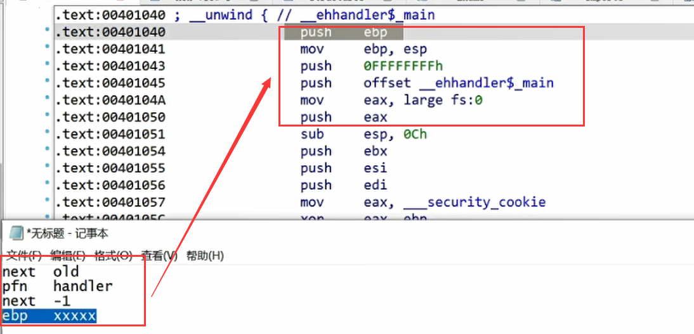
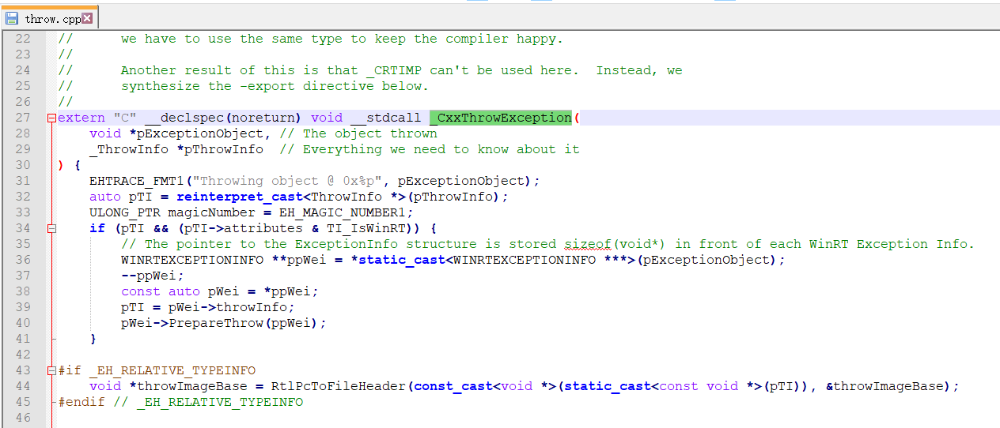
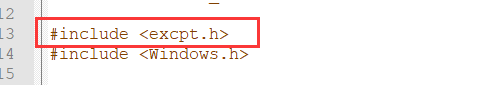
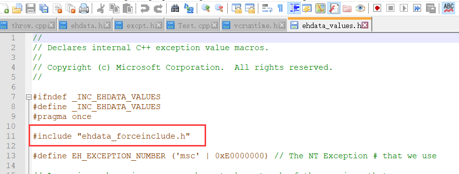

## 异常

-   C++中的异常处理机制由try、throw、catch语句组成。

-   -   try语句块负责监视异常。
    -   throw用于异常信息的发送，也称之为抛出异常。
    -   catch用于异常的捕获，并作出相应的处理,只能接收可预测的异常。

-   异常处理的基本C++语法如下：

C++中只有  throw  才可以catch

注意:  系统异常崩溃跟C++异常没有关系

```c++
try{//异常检测
//执行代码
throw异常类型；//抛出异常
}
catch（捕获异常类型）{//异常捕获
//处理代码
}
catch（捕获异常类型）{//异常捕获
//处理代码
}
……
```

-   从C++处理异常的语法中看到，异常的处理流程为：检测异常→产生异常→抛出异常→捕获异常。但对于用户而言，编译器隐藏了异常捕获的流程。在运行过程中，异常产生时会自动地匹配到对应的处理代码中，而这个过程的代码由编译器产生，也较为复杂。异常处理通常是由编译器和操作系统共同完成的，所以不同操作系统环境下的编译器对异常捕获和异常处理的分派过程各有不同。在用户量最多的Windows操作系统环境下，各个编译器也是基于操作系统的异常接口来分别实现C++中的异常处理，所以即使在Windows环境下，不同的编译器处理异常的实现方式也不同。
-   C++在处理异常时会在具有异常处理功能的函数的入口处注册一个异常回调函数，当该函数内有异常抛出时，便会执行这个已注册的异常回调函数。所有的异常信息都会被记录在相关表格中，异常回调函数根据这些表格中的信息进行异常的匹配处理工作。

## SEH 结构化异常处理

-   SEH 结构化异常处理 -> TEB -> 注册异常链：入口注册，出口注销
-   "fs:[0]"：也就是第一个异常链的位置
-   

```
+0x000  Next
+0x004  Handler
+0x008  tryLevel  0xffffffff
+0x00c  ebp
```

-   

-   -   首行的ebp并非仅仅是保存栈基址的，还是结构体成员，push ebp省一个ebp。

-   
-   

## 识别异常处理

早期的是够用使用表来解决的啊，他会为 try   catch 做 9个表 

​         _CxxThrowException    C++抛异常的API 作呕勇士额外传递一个  _ThrowInfo *pThrowInfo  的参数 最终调用的是  RaiseException

​        RaiseException   ： 通过代码产生异常

```
VOID RaiseException(  
DWORD dwExceptionCode,       // exception code
DWORD dwExceptionFlags,      // continuable exception flag
DWORD nNumberOfArguments,    // number of arguments
CONST ULONG_PTR *lpArguments // array of arguments);
);

```

  _ThrowInfo  保存异常的类型和值 ，全局对象，移编译器自己生出成 如果是基本数据类型只需要记录了异常的数据类型，如果是类还需要记住构造析构函 数

​        解析该结构体的函数文件再 throw.cpp中



那么我们就可以找到   _ThrowInfo   结构体定义的地方，如果该文件里面找不到，就可以去包含的头文件里面去找


如果没有找到定义，就继续找包含的头文件






因此涉及到的头文件有


#### 抛异常表表

##### _s_ThrowInfo

```c++

typedef const struct _s_ThrowInfo {
  unsigned int	attributes;							// Throw Info attributes (Bit field)
  
  //析构函数地址
  PMFN			pmfnUnwind;							// Destructor to call when exception has been handled or aborted

  //函数指针
  int	(__cdecl * pForwardCompat)(...);				// Forward compatibility frame handler

  // CatchableTypeArray 数组地址（用数组是因为一个异常类型，可能多个catch可以收，主要是类和派生类）
  CatchableTypeArray* pCatchableTypeArray;			// Pointer to list of pointers to types
} ThrowInfo;

```

##### _s_CatchableTypeArray

```c++
typedef const struct _s_CatchableTypeArray {
  //数量
  int	nCatchableTypes;         
   
  //CatchableType 结构体数组
  CatchableType*	arrayOfCatchableTypes[];
}
```

##### _s_CatchableType

```c++
typedef const struct _s_CatchableType {
  //属性，一般固定
  unsigned int		properties;			// Catchable Type properties (Bit field)
  //异常类型 此结构体中最重要的成员
  TypeDescriptor *	pType;				// Pointer to the type descriptor for this type
  //如果异常是对象，则需要记录对象指针
  PMD 				thisDisplacement;	// Pointer to instance of catch type within thrown object.
  //对象的大小
  int				sizeOrOffset;		// Size of simple-type object or offset into
  //对象的拷贝构造函数
  PMFN				copyFunction;		// Copy constructor or CC-closure

} CatchableType;

如果不涉及到对象，下面3个成员就是空
```

##### TypeDescriptor    RTTI结构体

```c++
typedef struct TypeDescriptor
{
  
#if defined(_WIN64) || defined(_RTTI) || defined(BUILDING_C1XX_FORCEINCLUDE)
     //虚表地址
	const void * pVFTable;	// Field overloaded by RTTI
#else
    //类型字符串的  hash值
	unsigned long	hash;			// Hash value computed from type's decorated name
#endif
   //没用的成员
  void *	spare;			// reserved, possible for RTTI

  // 类型的字符串 也是 RTTI 结构体中保存的类的类名
  char		name[];			// The decorated name of the type; 0 terminated.
};

TypeDescriptor  也是我们逆向还原时主要看的表
```

#### 收异常表

___CxxFrameHandler3    负责接收异常处理函数，因此它一定会查异常接收的表

```
EXCEPTION_DISPOSITION __cdecl _except_handler(
    _In_ struct _EXCEPTION_RECORD* _ExceptionRecord,
    _In_ void*                     _EstablisherFrame,
    _Inout_ struct _CONTEXT*       _ContextRecord,
    _Inout_ void*                  _DispatcherContext
);
他会调用  ___CxxFrameHandler3    
```

##### _s_FuncInfo

```c++
typedef const struct _s_FuncInfo
{
  //固定值 19930522h(可能是第一次发明这个表的日期) 
  unsigned int		magicNumber:29;		// Identifies version of compiler
  unsigned int		bbtFlags:3;			// flags that may be set by BBT processing
  //下面数组指针最大值
  __ehstate_t	    maxState;			// Highest state number plus one (thus
  //数组指针   unwind 异常展开 处理异常链表 以及异常中如果有对象，还要负责析构
  UnwindMapEntry*	pUnwindMap;			// Where the unwind map is
  //try的数量
  unsigned int		nTryBlocks;			// Number of 'try' blocks in this function
  //TryBlockMapEntry的数组地址（描述catch的信息）
  TryBlockMapEntry*	pTryBlockMap;		// Where the handler map is
  unsigned int		nIPMapEntries;		// # entries in the IP-to-state map. NYI (reserved)
  void*				pIPtoStateMap;		// An IP to state map.  NYI (reserved).
  ESTypeList*		pESTypeList;		// List of types for exception specifications
  int				EHFlags;			// Flags for some features.
} FuncInfo;
```

##### _s_UnwindMapEntry

```c++

typedef const struct _s_UnwindMapEntry {
  //状态，判断对象是否在异常里面，即在第几个 try 中 （-1 并表示对象不在try中）
  __ehstate_t	toState;					// State this action takes us to
   void		(__cdecl * action)(void);	// Funclet to call to effect state change
} UnwindMapEntry;

```

##### _s_TryBlockMapEntry

编译器会给函数里面的try做编号 

```c++
typedef const struct _s_TryBlockMapEntry {
  //try 的最低下标（主要）
  __ehstate_t		tryLow;				// Lowest state index of try
  //try 的最大下标
  __ehstate_t		tryHigh;			// Highest state index of try
  //catchde 最大下标
  __ehstate_t		catchHigh;			// Highest state index of any associated catch
  //catch数量
  int				nCatches;			// Number of entries in array
  // HandlerType* 数组地址
  HandlerType* pHandlerArray;	// List of handlers for this try
} TryBlockMapEntry;

存储下标是为了防止 try 里面嵌套 try 一个 try 的 最低下标 和最高下标 包含在另一个 try 的里面
，说明这个try 就是嵌套在 另一个 try 里面的
    
```

##### _s_HandlerType

```c++

typedef const struct _s_HandlerType {
  //标志
  unsigned int	adjectives;			// Handler Type adjectives (bitfield)
  //类型数组  如过类型是0，就代表所有 ...
  TypeDescriptor*	pType;				// Pointer to the corresponding type descriptor
  //参数如果是对象，基址的偏移，解决构造的问题
  ptrdiff_t		dispCatchObj;		// Displacement of catch object from base
  //catch的代码地址
  void *			addressOfHandler;	// Address of 'catch' code
} HandlerType;

```

#### 步骤：

1.  在函数入口处设置异常回调函数，回调函数先将eax设置为FuncInfo数据的地址，然后跳往__CxxFrameHandler。
2.  异常的抛出由__CxxThrowExceprion函数完成，该函数使用两个参数，一个是抛出异常的关键字throw的参数指针，另一个是抛出信息类型的指针（ThrowInfo*）。
3.  在异常回调函数中，可以得到异常对象的地址和对应ThrowInfo数据的地址以及FuncInfo表结构地址。根据记录的异常类型，进行try块的匹配工作。
4.  如果没有找到try块，则析构异常对象，返回ExceptionContinueSearch，继续下一个异常回调函数的处理。
5.  当找到对应的try时，通过TryBlockMapEntry表结构中的pCatch指向catch信息表，用ThrowInfo表结构中的异常类型遍历查找与之匹配的catch块，比较关键字的名称（如整形为.h，单精度为.m）找到有效的catch块。
6.  执行栈展开操作，产生catch块中使用的异常对象（有4种不同的产生方法）。
7.  正确析构所有声明周期已结束的对象。
8.  跳转到catch块，执行catch块代码。
9.  调用_JumpToContinuation函数，返回所有catch语句块的结束地址。
10.  通过  tryLevel 可以判断 try 的作用域  ，进的时候 改成标号 （标号 不一定连续），结束时会改为 -1 


说明进入 下标为 0 的 try 

## 课堂案例

```c++
#include <stdio.h>
#include <string.h>


class CMyExcept
{
};

class CMyDivExcept :public CMyExcept
{
};

void fun(int argc) {
    if (argc == 1)
    {
        throw 1;
    }
    if (argc == 2)
    {
        throw 1.0;
    }
    if (argc == 3)
    {
        throw& argc;
    }
};
int main(int argc)
{
    try
    {
        //如果此时产生异常，里面没有catch，就会由外存函数接收
        //，因此存在递归关系，如果都没有，就会由系统异常处理
       fun(argc); 

       if (argc == 4)
       {
           throw CMyExcept();  //抛出无名对象，需要拷贝构造
       }
       if (argc == 5)
       {
           throw new CMyExcept();
       }
       if (argc == 6)
       {
           throw new CMyDivExcept();   //抛出派生类异常，基类也可以收
       }
    }
    catch (int e)
    {
        printf("catch (int)\r\n");
    }

    catch (float e)
    {
        printf("catch (float)\r\n");
    }
    catch (int* e)
    {
        printf("catch (int*)\r\n");
    }
    catch (CMyExcept e)
    {
        printf("catch (CMyExcept)\r\n");
    }
    catch (CMyExcept* e)
    {
        printf("catch (CMyExcept* )\r\n");  
    }
    catch (...)   //接收所有异常
    {
        printf("catch (...)\r\n");
    }
 
}

```

如果要产生递归关系，是通过单向链表实现的


fs:0 就是   _NT_TIB 结构体


​         我们只需要进这个函数往这个链表添加一个异常处理函数就可以了，有时候这个函数再调函数，在被掉的函数入口再注册一个，当函数产生异常，遍历链表就可以了.越晚注册的越在前面，出函数的时候得删除链表

| 链表操作     |            |             |
| ------------ | ---------- | ----------- |
| 添加头部节点 | push_fornt | insert_head |
| 删除头部节点 | pop_fornt  | remove_head |

```
.text:004010B0                 push    ebp
.text:004010B1                 mov     ebp, esp
.text:004010B3                 push    0FFFFFFFFh    ; tryLevel
.text:004010B5                 push    offset _main_SEH   注册SEH异常
.text:004010BA                 mov     eax, large fs:0
.text:004010C0                 push    eax
.text:004010C1                 sub     esp, 24h
.text:004010C4                 push    ebx
.text:004010C5                 push    esi
.text:004010C6                 push    edi
.text:004010C7                 mov     eax, ___security_cookie
.text:004010CC                 xor     eax, ebp 
.text:004010CE                 push    eax

  ；固定的 ebp   tryLevel  _CxxThrowException  next  因此  ebp+var_C 就是结构体首地址
.text:004010CF                 lea     eax, [ebp+var_C]  
.text:004010D2                 mov     large fs:0, eax     把注册的函数放在链表头部

.text:004010D8                 mov     [ebp+var_10], esp
.text:004010DB                 mov     esi, [ebp+argc]
.text:004010DE                 push    esi
.text:004010DF ;   try {
.text:004010DF                 mov     [ebp+var_4], 0
.text:004010E6                 call    sub_401000
.text:004010EB                 add     esp, 4
.text:004010EE                 cmp     esi, 4
.text:004010F1                 jz      loc_401191
.text:004010F7                 cmp     esi, 5
.text:004010FA                 jz      loc_40119F
.text:00401100                 cmp     esi, 6
.text:00401103                 jz      loc_4011BA
.text:00401109                 jmp     short loc_40117D
.text:0040110B ; ---------------------------------------------------------------------------
.text:0040110B
.text:0040110B loc_40110B:                             ; DATA XREF: .rdata:stru_403810↓o
.text:0040110B ;   catch(int) // owned by 4010DF
.text:0040110B                 push    offset Format   ; "catch (int)\r\n"
.text:00401110                 call    sub_4011E0
.text:00401115                 add     esp, 4
.text:00401118                 mov     eax, offset loc_40117D
.text:0040111D                 retn
.text:0040111E ; ---------------------------------------------------------------------------
.text:0040111E
.text:0040111E loc_40111E:                             ; DATA XREF: .rdata:00403820↓o
.text:0040111E ;   catch(float) // owned by 4010DF
.text:0040111E                 push    offset aCatchFloat ; "catch (float)\r\n"
.text:00401123                 call    sub_4011E0
.text:00401128                 add     esp, 4
.text:0040112B                 mov     eax, offset loc_40117D
.text:00401130                 retn
.text:00401131 ; ---------------------------------------------------------------------------
.text:00401131
.text:00401131 loc_401131:                             ; DATA XREF: .rdata:00403830↓o
.text:00401131 ;   catch(int *) // owned by 4010DF
.text:00401131                 push    offset aCatchInt_0 ; "catch (int*)\r\n"
.text:00401136                 call    sub_4011E0
.text:0040113B                 add     esp, 4
.text:0040113E                 mov     eax, offset loc_40117D
.text:00401143                 retn
.text:00401144 ; ---------------------------------------------------------------------------
.text:00401144
.text:00401144 loc_401144:                             ; DATA XREF: .rdata:00403840↓o
.text:00401144 ;   catch(CMyExcept) // owned by 4010DF
.text:00401144                 push    offset aCatchCmyexcept ; "catch (CMyExcept)\r\n"
.text:00401149                 call    sub_4011E0
.text:0040114E                 add     esp, 4
.text:00401151                 mov     eax, offset loc_40117D
.text:00401156                 retn
.text:00401157 ; ---------------------------------------------------------------------------
.text:00401157
.text:00401157 loc_401157:                             ; DATA XREF: .rdata:00403850↓o
.text:00401157 ;   catch(CMyExcept *) // owned by 4010DF
.text:00401157                 push    offset aCatchCmyexcept_0 ; "catch (CMyExcept* )\r\n"
.text:0040115C                 call    sub_4011E0
.text:00401161                 add     esp, 4
.text:00401164                 mov     eax, offset loc_40117D
.text:00401169                 retn
.text:0040116A ; ---------------------------------------------------------------------------
.text:0040116A
.text:0040116A loc_40116A:                             ; DATA XREF: .rdata:00403860↓o
.text:0040116A ;   catch(...) // owned by 4010DF
.text:0040116A                 push    offset aCatch   ; "catch (...)\r\n"
.text:0040116F                 call    sub_4011E0
.text:00401174                 add     esp, 4
.text:00401177                 mov     eax, offset loc_40117D
.text:0040117C                 retn
.text:0040117D ; ---------------------------------------------------------------------------
.text:0040117D
.text:0040117D loc_40117D:                             ; CODE XREF: _main+59↑j
.text:0040117D                                         ; _main+6D↑j ...
.text:0040117D                 xor     eax, eax
.text:0040117F                 mov     ecx, [ebp+var_C]     获取的旧的链接next
.text:00401182                 mov     large fs:0, ecx           删除头部节点
.text:00401189                 pop     ecx
.text:0040118A                 pop     edi
.text:0040118B                 pop     esi
.text:0040118C                 pop     ebx
.text:0040118D                 mov     esp, ebp
.text:0040118F                 pop     ebp
.text:00401190                 retn
.text:00401191 ; ---------------------------------------------------------------------------
.text:00401191
.text:00401191 loc_401191:                             ; CODE XREF: _main+41↑j
.text:00401191                 push    offset __TI1?AVCMyExcept@@ ; pThrowInfo
.text:00401196                 lea     eax, [ebp+pExceptionObject]
.text:00401199                 push    eax             ; pExceptionObject
.text:0040119A                 call    _CxxThrowException
.text:0040119F ; ---------------------------------------------------------------------------
.text:0040119F
.text:0040119F loc_40119F:                             ; CODE XREF: _main+4A↑j
.text:0040119F                 push    1               ; Size
.text:004011A1                 call    ??2@YAPAXI@Z    ; operator new(uint)
.text:004011A6                 add     esp, 4
.text:004011A9                 mov     [ebp+var_18], eax
.text:004011AC                 lea     eax, [ebp+var_18]
.text:004011AF                 push    offset __TI2PAVCMyExcept@@ ; pThrowInfo
.text:004011B4                 push    eax             ; pExceptionObject
.text:004011B5                 call    _CxxThrowException
.text:004011BA ; ---------------------------------------------------------------------------
.text:004011BA
.text:004011BA loc_4011BA:                             ; CODE XREF: _main+53↑j
.text:004011BA                 push    1               ; Size
.text:004011BC                 call    ??2@YAPAXI@Z    ; operator new(uint)
.text:004011C1                 add     esp, 4
.text:004011C4                 mov     [ebp+var_1C], eax
.text:004011C7                 lea     eax, [ebp+var_1C]
.text:004011CA                 push    offset __TI3PAVCMyDivExcept@@ ; pThrowInfo
.text:004011CF                 push    eax             ; pExceptionObject
.text:004011D0                 call    _CxxThrowException
.text:004011D0 ;   } // starts at 4010DF
```

```
SHE的回调处理函数
.text:00402030 _main_SEH:                              ; DATA XREF: _main+5↑o
.text:00402030                                         ; .rdata:00403470↓o
.text:00402030 ; __unwind { // _main_SEH
.text:00402030                 nop
.text:00402031                 nop
.text:00402032                 mov     edx, [esp-4+argv]
.text:00402036                 lea     eax, [edx+0Ch]
.text:00402039                 mov     ecx, [edx-34h]
.text:0040203C                 xor     ecx, eax
.text:0040203E                 call    sub_401232
.text:00402043                 mov     eax, offset stru_4037EC
.text:00402048                 jmp     __CxxFrameHandler3       固定的函数名
.text:00402048 ; } // starts at 402030
```

##  __try   __except

非标准，而且不支持 c++ 语法

做一个函数指针地址

进入哪个try 也是通过  tryLevel 决定的，抛异常的话查数组对应的函数就可以了，tryLevel  就是数组下标

tryLevel  也是在 ebp - 4 的位置  

```c++
 __try
  { 
    char *p = nullptr;
    *p = 1;
    printf("__try1");
  }
  __except(1)   //里面可以写过滤函数
  {
    printf("__except2");
  }

  __try
  {
    printf("__try2");
  }
  __except (1)
  {
    printf("__except2");
  }
```

