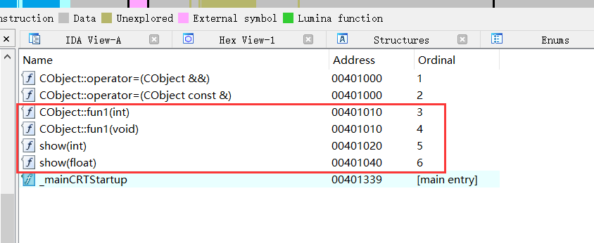
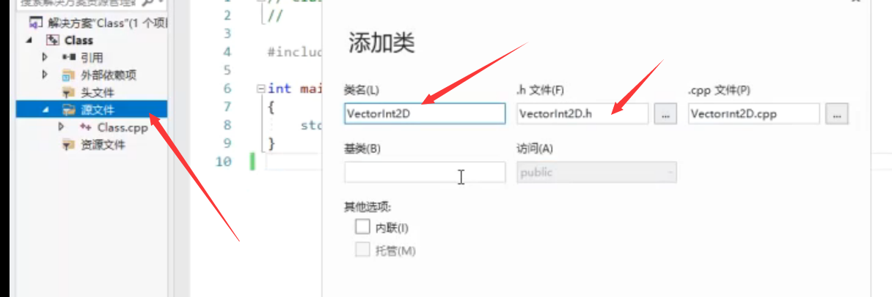
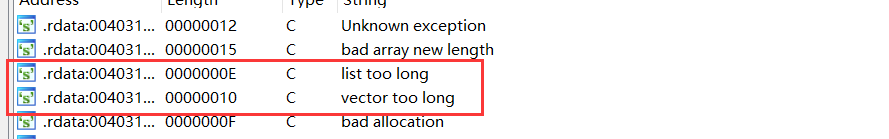
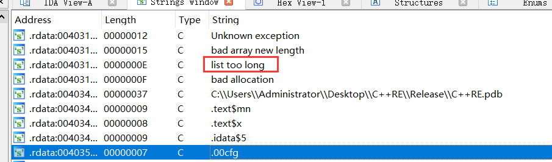
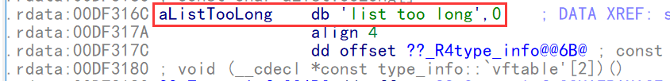

### 移动构造

解决对象浅拷贝析构时重复释放的问题

解决办法: 

1.   深拷贝 (但是浪费空间)
2.  引用计数
3.  移动构造,取代引用计数

当有移动构造函数,对象做函数参数,并且后面不再使用这个对象,就极有可能产生移动构造

```c++

#include <iostream>
using namespace std;


class CMyClass
{
public:
    CMyClass() {
        m_pData = new int;
    };
    //拷贝构造
    CMyClass(const CMyClass& obj) {
        m_pData = new int;
        *m_pData = *obj.m_pData;
    };
    //移动构造 (右值引用)
    CMyClass(CMyClass&& obj) {
        m_pData = obj.m_pData;
        obj.m_pData = nullptr;
    };
    ~CMyClass() {
        if (m_pData != nullptr)
        {
            delete m_pData;
            m_pData = nullptr;
        }
    };
private:
    int* m_pData;
};

void fun(CMyClass obj) {
}
int main(int argc)
{
    CMyClass obj1;
    //CMyClass obj2(obj1);  //拷贝构造 (会产生资源重复释放问题)
    CMyClass obj3(move(obj1));  //移动构造 = CMyClass obj3((CMyClass&&)obj1);
    fun(obj3);    //因此obj后面不会用到,此时产生移动构造 
    return 0;
}
```

```
push    ebp
mov     ebp, esp
sub     esp, 8
lea     ecx, [ebp+obj1] ; this
push    4               ; unsigned int
call    ?__autoclassinit2@CMyClass@@QAEXI@Z ; CMyClass::__autoclassinit2(uint)
lea     ecx, [ebp+obj1] ; this
call    ??0CMyClass@@QAE@XZ ; CMyClass::CMyClass(void)
push    4               ; unsigned int
lea     ecx, [ebp+obj3] ; this
call    ?__autoclassinit2@CMyClass@@QAEXI@Z ; CMyClass::__autoclassinit2(uint)
lea     eax, [ebp+obj1]     对象obj1的地址
push    eax             ; _Arg
call    ??$move@AAVCMyClass@@@std@@YA$$QAVCMyClass@@AAV1@@Z ; std::move<CMyClass &>(CMyClass &)
add     esp, 4
lea     ecx, [ebp+obj3] ; this
push    eax             ; obj
call    ??0CMyClass@@QAE@$$QAV0@@Z ; CMyClass::CMyClass(CMyClass &&)   拷贝构造
lea     ecx, [ebp+obj3] ; this
call    ??1CMyClass@@QAE@XZ ; CMyClass::~CMyClass(void)
lea     ecx, [ebp+obj1] ; this
call    ??1CMyClass@@QAE@XZ ; CMyClass::~CMyClass(void)
xor     eax, eax
mov     esp, ebp
pop     ebp
.text:00401010 ??0CMyClass@@QAE@$$QAV0@@Z proc near    ; CODE XREF: _main+32↓p
.text:00401010
.text:00401010 obj             = dword ptr  8
.text:00401010
.text:00401010 this = ecx
.text:00401010                 push    ebp
.text:00401011                 mov     ebp, esp
.text:00401013                 mov     edx, [ebp+obj]
.text:00401016                 mov     eax, [edx]
.text:00401018                 mov     [this], eax
.text:0040101A                 mov     eax, this
.text:0040101C                 mov     dword ptr [edx], 0     把传过来的对象的成员 置空   (区分依据)
.text:00401022                 pop     ebp
.text:00401023                 retn    4
.text:00401023 ??0CMyClass@@QAE@$$QAV0@@Z endp


```

 还原 

构造时是否把参数对象的成员置空,有的好就是移动构造,否则就可能是拷贝构造


 函数重载 

```c++

#include <iostream>
using namespace std;
#include <stdio.h>

void show(int n) {
    printf("%d\n", n);
};

void show(float n) {
    printf("%f\n", n);
};

int main(int argc)
{
    show(10);
    show(10.2f);
    return 0;
}
```

```
无法识别出重载,只能当做2个函数还原,再根据可读性判断是否重载
push    0Ah             ; n
call    ?show@@YAXH@Z   ; show(int)
mov     [esp+4+n], 41233333h ; n
call    ?show@@YAXM@Z   ; show(float)
add     esp, 4
xor     eax, eax
?show@@YAXH@Z proc near
push    ebp
mov     ebp, esp
push    [ebp+n]
push    offset _Format  ; "%d\n"
call    _printf
add     esp, 8
pop     ebp
retn
?show@@YAXH@Z endp
?show@@YAXM@Z proc near
push    ebp
mov     ebp, esp
movss   xmm0, [ebp+n]
sub     esp, 8
cvtps2pd xmm0, xmm0
movsd   [esp+8+var_8], xmm0
push    offset asc_402100 ; "%f\n"
call    _printf
add     esp, 0Ch
pop     ebp
retn
?show@@YAXM@Z endp
```

#### 还原

-   无还原依据，根据可读性还原，除非名称粉碎(不止pbd,还有导入导出也会产生符号)。

```c++
class __declspec(dllexport) CObject
{
public:
    static void fun1()
    {
        printf("fun1\r\n");
    }
    static void fun1(int)
    {
        printf("fun1\r\n");
    }
};


//exrern "C" {   如果加了  exrern 将无法重载,因为C没有名称粉碎,函数名不能同名,无法重载
    __declspec(dllexport) void show(int n) {
        printf("%d\n", n);
    };
    
    __declspec(dllexport) void show(float n) {
        printf("%f\n", n);
    };
//}

int main(int argc)
{
    show(10);
    show(10.2f);
    return 0;
}
```




### 运算符重载

​         运算符重载现在很少使用,在很多面向对象语言中都把它删除了,因为运算符重载唯一运用的比较多的场合就是数据结构,现在的数据结构基本都是由 stl 来实现,四年次除非自己实现数据结构,否则基本用不到

```c++

#include <iostream>
using namespace std;
#include <stdio.h>

class  CObject
{
public:
    void operator=(int n)  //重载=
    {
        m_pData = new int;
        *m_pData = n;
    }

private:
    int* m_pData;
};


int main(int argc)
{
    CObject obj;
    obj = 1;
    return 0;
}
```

```
push    ebp
mov     ebp, esp
push    ecx
push    1               ; n
lea     ecx, [ebp+obj]  ; this
call    ??4CObject@@QAEXH@Z ; CObject::operator=(int)
xor     eax, eax
mov     esp, ebp
pop     ebp
retn
无法看出来是运算符重载
??4CObject@@QAEXH@Z proc near
this = ecx
push    ebp
mov     ebp, esp
push    esi
push    4               ; size
mov     esi, this
call    ??2@YAPAXI@Z    ; operator new(uint)
mov     this, [ebp+n]
add     esp, 4
mov     [esi], eax
mov     [eax], this
pop     esi
pop     ebp
retn    4
??4CObject@@QAEXH@Z endp
```

#### 还原

-   无还原依据，根据可读性还原，除非名称粉碎(pbd,导入或者导出)。
-   还原是可以直接还原成 成员函数


### Lambda 表达式

为了设计发明的语法 

**Lambda    将函数实现方法当作参数传递**

**[函数对象参数] (操作符重载函数参数) mutable 或 exception 声明 -> 返回值类型 {函数体}**

返回值如果是不为空:   **[  ](参数) -> 返回值类型{ 函数体 }**

返回值如果是空 :    **[ ](参数) { 函数体 }**

```c++
void ShowNumber(int * szbuf , int nCount,void (* pfn)(int) )
{
   for(int i = 0;i< nCount;i++)){
       /*
       if( szbuf[ i ] % 2 == 0){
           cout << szbuf[ i ] <<  "是偶数" << endl;                        
       }else{
           cout << szbuf[ i ] <<  "不是偶数" << endl;      
       }
       */
       pfn(szbuf[i]);
   }
}
void ShowNumber1(int * szbuf , int nCount,int (* pfn)(int) )
{
   return   nCount;
}

void  fun1(int n){
    if( n % 2 == 0)
    {
       cout << n <<  ":1" << endl;                        
    }else{
       cout << n <<  ":2" << endl;      
    }
}

void  fun2(int n){
    if( n % 3 == 0)
    {
       cout << n <<  ":1" << endl;                        
    }else{
       cout << n <<  ":2" << endl;      
    }
}

int  szbuf[ ] = { 1,2,4,7,9,0,2,4,6,4,2};
//ShowNumber(szbuf, sizeof(szbuf)/sizeof(szbuf[0]));

//调用同一个函数,通过传入不同的函数地址地址实现不同功能,避免了重复修改代码
ShowNumber(szbuf, sizeof(szbuf)/sizeof(szbuf[0]),&fun1);
ShowNumber(szbuf, sizeof(szbuf)/sizeof(szbuf[0]),&fun2);

//将函数实现方法当作函数传参
ShowNumber(szbuf, sizeof(szbuf)/sizeof(szbuf[0]),
    [](int n) { if( n % 3 == 0){ cout << n <<  ":1" << endl; }else{ cout << n <<  ":2" << endl;}}
);

//无返回值  
auto fun3 = [](int n){ if( n % 2 == 0){cout << n <<  ":1" << endl;}else{cout << n <<  ":2" << endl; };
ShowNumber(szbuf, sizeof(szbuf)/sizeof(szbuf[0]),fun3});

//有返回值
auto fun4 = [](int n)->int{ if( n % 2 == 0){ return 1;}else{return 2;};
ShowNumber1(szbuf, sizeof(szbuf)/sizeof(szbuf[0]),fun3});

int  n1 = 10;
int  n2 = 20;
//fun5 相当一个函数,正常无法使用其他函数的局部变量,但是 [=] 就可以,但是无法修改,但是用
//引用 [&] 就可以修改   [&,n1] 是引用除 n1 以外的变量
auto fun5 = [=](int n)->int{ if( n % 2 == 0){ return 0;}else{return n2;};
ShowNumber1(szbuf, sizeof(szbuf)/sizeof(szbuf[0]),fun3});

//上面的 fun3  fun4  fun5  在编译的时候当作函数处理

[](int n1,n2)->int{}
//局部变量
[=](int n1,n2)->int{}
//引用
[&](int n1,n2)->int{}

auto  fun = [=](int n)->int {
    if(n % 2 == 0){
         //打印f 方括号必须为 = 
        cout << n <<  f  << endl;
     }
     return n;
}
```

```c++
#include <iostream>

using namespace std;

//选择排序
//数组,数组类型,数组大小,比较函数的地址
void MySort(void *pAry, int nTypeSize, int nCount, int (*cmp)(void* p1, void* p2)) {
    char* tmp = (char*)malloc(nTypeSize);
    
for (int i = 0; i < nCount; i++) {
        int nMin = i;
        for (int j = i + 1; j < nCount; j++) {
          if (cmp((char*)pAry + j * nTypeSize, (char*)pAry + nMin * nTypeSize) < 0) {
            nMin = j;
          }
        }
    
        if (i != nMin) {
          //通过拷贝函数 交换值,提高通用性
          memcpy(tmp, (char*)pAry + i * nTypeSize, nTypeSize);
          memcpy((char*)pAry + i * nTypeSize, (char*)pAry + nMin * nTypeSize, nTypeSize);
          memcpy((char*)pAry + nMin * nTypeSize, tmp, nTypeSize);
        }
  }

  free(tmp);
}

//冒泡排序
void MySort2(void* pAry, int nTypeSize, int nCount, int (*cmp)(void* p1, void* p2)) {
    char* tmp = (char*)malloc(nTypeSize);

    for (int i = 0; i < nCount; i++) {
       int nMin = i;
       for (int j = 0; j < nCount-i-1; j++) {
          if (cmp((char*)pAry + j * nTypeSize, (char*)pAry + (j+1) * nTypeSize) < 0){
             memcpy(tmp, (char*)pAry + j * nTypeSize, nTypeSize);
             memcpy((char*)pAry + j * nTypeSize, (char*)pAry + (j+1) * nTypeSize, nTypeSize);
             memcpy((char*)pAry + (j+1) * nTypeSize, tmp, nTypeSize);          
          }

      }
  }

  free(tmp);
}


int main()
{
  int ary[] = { 10, 1, 9, 2, 3, 4, 5, 6, 7, 8};
  MySort(ary, sizeof(int), 10, [](void* p1, void* p2) {return *(int*)p1 - *(int*)p2;});
  for (auto e: ary) {
    cout << e << endl;
  }

  cout << endl;
  float ary2[] = { 10, 1, 9, 2, 3, 4, 5, 6, 7, 8 };
  MySort(ary2, sizeof(float), 10, [](void* p1, void* p2) -> int {return *(float*)p1 - *(float*)p2; });
  for (auto e : ary) {
    cout << e << endl;
  }

  cout << endl;
  const char* ary3[] = { "c", "b", "a"};
  MySort(ary3, sizeof(ary3[0]), 3, [](void* p1, void* p2) -> int {return strcmp(*(char**)p1, *(char**)p2); });
  for (auto e : ary3) {
    cout << e << endl;
  }
  return 0;
}


```

**[函数对象参数] :**

标识一个 Lambda 表达式的开始，这部分必须存在，不能省略。函数对象参数是传递给编译器自动生成的函数对象类的构造函数的。函数对象参数只能使用那些到定义 Lambda 为止时 Lambda 所在作用范围内可见的局部变量(包括 Lambda 所在类的 this)。函数对象参数有以下形式：

-   空。没有任何函数对象参数。
-   =。函数体内可以使用 Lambda 所在范围内所有可见的局部变量（包括 Lambda 所在类的 this），并且是值传递方式（相
-   当于编译器自动为我们按值传递了所有局部变量）。
-   &。函数体内可以使用 Lambda 所在范围内所有可见的局部变量（包括 Lambda 所在类的 this），并且是引用传递方式
-   （相当于是编译器自动为我们按引用传递了所有局部变量）。
-   this。函数体内可以使用 Lambda 所在类中的成员变量。
-   a。将 a 按值进行传递。按值进行传递时，函数体内不能修改传递进来的 a 的拷贝，因为默认情况下函数是 const 的，要
-   修改传递进来的拷贝，可以添加 mutable 修饰符。
-   &a。将 a 按引用进行传递。 
-   a，&b。将 a 按值传递，b 按引用进行传递。
-   =，&a，&b。除 a 和 b 按引用进行传递外，其他参数都按值进行传递。
-   &，a，b。除 a 和 b 按值进行传递外，其他参数都按引用进行传递。

**{函数体}**

标识函数的实现，这部分不能省略，但函数体可以为空。

[] (int x, int y) { return x + y; } // 隐式返回类型

[] (int& x) { ++x;  } // 没有 return 语句 -> Lambda 函数的返回类型是 'void'

[] () { ++global_x;  } // 没有参数，仅访问某个全局变量

[] { ++global_x; } // 与上一个相同，省略了 (操作符重载函数参数)

可以像下面这样显示指定返回类型：

[] (int x, int y) -> int { int z = x + y; return z; }

**抽象      设计思想**

抽象的东西必须要单一

**封装 (类)**

数据  + 数据的操作方法 

\1. 访问标号

\2. 成员函数

\3. class和struct的区别

\4. 内存结构

\5. thiscall

\6. 成员函数指针

\7. 声明和定义分开

当成员名和参数同名  要用 this->

类     数据成员    成员函数

类的语法

  增加了数据成员,成员函数的权限控制

  增加了对象指针的自动传递

  

访问权限控制关键字（访问标号）

默认是私有的；

public（共有）:类外可以直接访问；

private（私有）:类外不可以访问；

protected（保护）:暂时不讲，等继承再谈

作用范围：从标号的位置开始直到遇到下一个标号结束；


c实现类

c++实现类

.h文件

新建类

​    

```c++
/*
* 封装
* 类的语法:
*   数据成员和成员函数的权限控制
*   增加了对象指针的自动专递
* 

  class 和 struct 差不多,class 可以换成 struct
* class默认的权限私有(private)
* struct默认的权限共有(public)
*/

//定义一个对象
class VectorInt2D  //类
{
public:
  //定义功能
  //公有的成员函数
  void SetX(int x);  //成员函数
  void SetY(int y);
  void MoveTo(int x, int y);
  void Move(int xOffset, int yOffset);
  int  GetX();
  int  GetY();
  bool Equal(VectorInt2D* pObject2);

  //求距离
  int  Distance(VectorInt2D* pObject2);

private:
  void  test();    //私有的成员函数

 //数据成员
private:
  int  x; 
  int  y;
};
```

入口函数

```c++
#include <iostream>
#include "VectorInt2D.h"

using namespace std;

int main()
{

  VectorInt2D pos1;  //实例化对象,相当于创建一个结构体变量
  //用内存的越界访问可以 可以实现修改 pos1 中 x,y的值但是不推荐 破坏封装性
  //*(int*)&pos1 = 100;
  //*((int*)&pos1 + 1) = 200;  

  pos1.MoveTo(1, 1);  //调用成员函数 MoveTo(&pos1, 1, 1)
  printf("pos1 x=%d y=%d\n",pos1.GetX(), pos1.GetY());

  VectorInt2D pos2;
  pos2.MoveTo(11, 11);
  printf("pos2 x=%d y=%d\n", pos2.GetX(), pos2.GetY());

  printf("Distance=%d\n", pos1.Distance(&pos2));

  return 0;
}
```

方法函数

```c++
#include "VectorInt2D.h"
#include <math.h>
#include <stdio.h>

//对成员函数赋值  成员函数名与参数名一致,所以要用this 表示该类
// VectorInt2D:: 表示作用域
void VectorInt2D::SetX(int x)
{
  this->x = x;
}

void VectorInt2D::SetY(int y)
{
  this->y = x; 
}

//成员函数名与参数名一致,所以要用this 表示该类
void VectorInt2D::MoveTo(int x, int y)
{
  this->x = x;
  this->y = y;
}

//成员函数名与参数名不一致,所以this可省略
void VectorInt2D::Move(int xOffset, int yOffset)
{
  x += xOffset;  //this->x += xOffset
  y += yOffset;
}

//获取成员函数的值
int VectorInt2D::GetX()
{
  return x;
}

int VectorInt2D::GetY()
{
  return y;
}

bool VectorInt2D::Equal(VectorInt2D* pObject2)
{
  return (x == pObject2->x) && (y == pObject2->y);
}


int VectorInt2D::Distance(VectorInt2D* pObject2)
{
  return (int)sqrt(pow(x - pObject2->x, 2) + pow(y - pObject2->y, 2));
}
//测试函数
void VectorInt2D::test()
{
  printf("Object=%p x=%d y=%d\n", this, x, y);
}
```

c实现类

主函数

```c++
#include <stdio.h>
#include "VectorInt2D.h"

/*
* 抽象 设计思想
* 
* 
* 封装（类)
* 
* 坐标
*   数据表达
*   数据操作
*/

int main()
{
  VectorInt2D pos1;
  MoveTo(&pos1, 1, 1);
  //test(&pos1);
  //pos1.x = 1;
  //pos1.y = 1; //破坏封装性
  //Move(&pos1, 1, 0);
  printf("pos1 x=%d y=%d\n", GetX(&pos1), GetY(&pos1));

  VectorInt2D pos2;
  MoveTo(&pos2, 11, 11);
  //printf("pos2 x=%d y=%d\n", GetX(&pos2), GetY(&pos2));

  printf("Distance=%d\n", Distance(&pos1, &pos2));
  //test(&pos1);
  //printf("Hello C");
}
```

方法实现函数

```c++
#include "VectorInt2D.h"
#include <math.h>
#include <stdio.h>

void SetX(VectorInt2D* pObject, int x)
{
  pObject->x = x;
}

void SetY(VectorInt2D* pObject, int y)
{
  pObject->y = y;
}

void MoveTo(VectorInt2D* pObject, int x, int y)
{
#ifdef _DEBUG
  test(pObject);
#endif
  pObject->x = x;
  pObject->y = y;
#ifdef _DEBUG
  test(pObject);
#endif
}

void Move(VectorInt2D* pObject, int xOffset, int yOffset)
{
  pObject->x += xOffset;
  pObject->y += yOffset;
}

int GetX(VectorInt2D* pObject)
{
  return pObject->x;
}

int GetY(VectorInt2D* pObject)
{
  return pObject->y;
}

bool Equal(VectorInt2D* pObject1, VectorInt2D* pObject2)
{
  return (pObject1->x == pObject2->x) && (pObject1->y == pObject2->y);
}

int Distance(VectorInt2D* pObject1, VectorInt2D* pObject2)
{
  return (int)sqrt(pow(pObject1->x - pObject2->x, 2) + pow(pObject1->y - pObject2->y, 2));
}

void test(VectorInt2D* pObject1)
{
  printf("pObject1=%p x=%d y=%d\n", pObject1, GetX(pObject1), GetY(pObject1));
}
```

.h文件

```c++
#include <stdbool.h>

//向量d
//封装：数据+数据操作的方法

//定义数据
typedef struct _VectorInt2D {
  int x;
  int y;
}VectorInt2D;


//公开接口

//定义功能
void SetX(VectorInt2D *pObject, int x);
void SetY(VectorInt2D* pObject, int y);
void MoveTo(VectorInt2D* pObject, int x, int y);
void Move(VectorInt2D* pObject, int xOffset, int yOffset);
int GetX(VectorInt2D* pObject);
int GetY(VectorInt2D* pObject);
bool Equal(VectorInt2D* pObject1, VectorInt2D* pObject2);

//求距离
int  Distance(VectorInt2D* pObject1, VectorInt2D* pObject2);

//私有接口
static void  test(VectorInt2D* pObject1);

//旋转
// 
//镜像
//......


//struct Vector2D {
//  float x;
//  float y;
//};
//
//struct Vector3D {
//  float x;
//  float y;
//  float z;
//};
//
//
//struct VectorInt3D {
//  int x;
//  int y;
//  int z;
//};


```

```c++
#include <iostream>
using namespace std;
#include <stdio.h>

int main(int argc)
{
    auto cmp1 = []() { return 1 - 2; };
    int ret = cmp1();
    printf("ret:%d\n", ret);

    int n1 = 1;
    int n2 = 2;
    auto cmp2 = [=]() -> int { return n1 - n2; };
    ret = cmp2();
    printf("n1:%d n2:%d ret:%d\n", n1, n2, ret);

    auto cmp3 = [&](int p1, int p2) {
        n1 = 10;
        n2 = 20;
        return n1 - n2;
    };
    ret = cmp3(100, 200);
    printf("n1:%d n2:%d ret:%d\n", n1, n2, ret);
}
```

```
编译器会帮  Lambda  生成一个类成员函数   ,生成类的原因是因为可能把局部变量当参数传进去,这样在构造时就可以获得参数的值,在后面使用
push    ebp
mov     ebp, esp
sub     esp, 14h
lea     ecx, [ebp+var_1] ; this     ;参数this指针
call    _lambda_66d8325d70915f1682833d6849ad9c28___operator__
push    eax
push    offset _Format  ; "ret:%d\n"
call    _printf
add     esp, 8
mov     [ebp+n1], 1
lea     eax, [ebp+n2]
mov     [ebp+n2], 2
lea     ecx, [ebp+cmp3] ; this
push    eax             ; <n2>
lea     eax, [ebp+n1]
push    eax             ; <n1>
;调构造函数
call    _lambda_d2095d4eea97805724f897649dfa9864____lambda_d2095d4eea97805724f897649dfa9864_
call    _lambda_d2095d4eea97805724f897649dfa9864___operator__
push    eax
push    2
push    1
push    offset aN1DN2DRetD ; "n1:%d n2:%d ret:%d\n"
call    _printf
add     esp, 10h
lea     eax, [ebp+n2]
lea     ecx, [ebp+cmp3] ; this
push    eax             ; <n2>
lea     eax, [ebp+n1]
push    eax             ; <n1>
call    _lambda_f54d4d892429c063f3244b8ce76c5c76____lambda_f54d4d892429c063f3244b8ce76c5c76_
;参数在构造时不会传递,只有再调成员函数的时候才传递
push    0C8h            ; p2
push    64h ; 'd'       ; p1
call    _lambda_f54d4d892429c063f3244b8ce76c5c76___operator__
push    eax
push    [ebp+n2]
push    [ebp+n1]
push    offset aN1DN2DRetD ; "n1:%d n2:%d ret:%d\n"
call    _printf
add     esp, 10h
xor     eax, eax
mov     esp, ebp
pop     ebp
retn
_lambda_66d8325d70915f1682833d6849ad9c28___operator__ proc near
this = ecx
or      eax, 0FFFFFFFFh
retn
_lambda_66d8325d70915f1682833d6849ad9c28___operator__ endp
构造函数

_lambda_d2095d4eea97805724f897649dfa9864____lambda_d2095d4eea97805724f897649dfa9864_ proc near
this = ecx
push    ebp
mov     ebp, esp
mov     eax, [ebp+arg_0]
mov     eax, [eax]
mov     [this], eax
mov     eax, [ebp+arg_4]
mov     eax, [eax]
mov     [this+4], eax
mov     eax, this
pop     ebp
retn    8
_lambda_d2095d4eea97805724f897649dfa9864____lambda_d2095d4eea97805724f897649dfa9864_ endp
_lambda_d2095d4eea97805724f897649dfa9864___operator__ proc near
this = ecx
mov     eax, [this]
sub     eax, [this+4]
retn
_lambda_d2095d4eea97805724f897649dfa9864___operator__ endp
构造函数
_lambda_f54d4d892429c063f3244b8ce76c5c76____lambda_f54d4d892429c063f3244b8ce76c5c76_ proc near
this = ecx
push    ebp
mov     ebp, esp
mov     eax, [ebp+arg_0]
mov     [this], eax
mov     eax, [ebp+arg_4]
mov     [this+4], eax
mov     eax, this
pop     ebp
retn    8
_lambda_f54d4d892429c063f3244b8ce76c5c76____lambda_f54d4d892429c063f3244b8ce76c5c76_ endp
_lambda_f54d4d892429c063f3244b8ce76c5c76___operator__ proc near
this = ecx
mov     eax, [this]
mov     dword ptr [eax], 0Ah
mov     eax, [this+4]
mov     dword ptr [eax], 14h
mov     eax, [this]
mov     edx, [this+4]
mov     eax, [eax]
sub     eax, [edx]
retn    8
_lambda_f54d4d892429c063f3244b8ce76c5c76___operator__ endp
```

#### 还原

-   无还原依据，根据可读性还原，除非名称粉碎。
-   可以还原成类,  Lambda  表达式函数 就是成员函数
-   一个类里面只有一个构造和一个函数,没有继承和虚析构他大概率是lambda表达式,

### 模板

-   如果很多实现代码一致，类型一致可以考虑生成模板。        
-   如果是导出模板，有名称粉碎

```c++
template <class TYPE>
bool Equal(TYPE n1, TYPE n2)
{
    return n1 = n2;
}

int main()
{
    printf("%d", Equal<int>(1, 2));
    printf("%d", Equal<const char*>("1", "2"));
    return 0;
}

// Release
.text:00401060
.text:00401060                 call    sub_401090
.text:00401065                 movzx   eax, al
.text:00401068                 push    eax             ; ArgList
.text:00401069                 push    offset aD       ; "%d"
.text:0040106E                 call    printf
.text:00401073                 call    sub_401090
.text:00401078                 movzx   eax, al
.text:0040107B                 push    eax             ; ArgList
.text:0040107C                 push    offset aD       ; "%d"
.text:00401081                 call    printf

// 两个直接内联优化，无还原依据
.text:00401090 sub_401090      proc near               ; CODE XREF: _main↑p
.text:00401090                                         ; _main+13↑p ...
.text:00401090                 mov     al, 1
.text:00401092                 retn
.text:00401092 sub_401090      endp


// 类模板
template <class TYPE>
class CObject1
{
public:bool Equal(TYPE n1, TYPE n2)
{
	return n1 = n2;
}
};

int main()
{
    CObject1<int>obj1;
    CObject1<float>obj2;
    printf("%d", obj1.Equal(1, 2));
    printf("%d", obj2.Equal(1.0f, 2.1f));
    return 0;
}

// Release 生成两个类对象
.text:00401060                 sub     esp, 8
.text:00401063                 call    ?Equal@?$CObject1@H@@QAE_NHH@Z ; CObject1<int>::Equal(int,int)
.text:00401068                 movzx   eax, al
.text:0040106B                 push    eax             ; ArgList
.text:0040106C                 push    offset aD       ; "%d"
.text:00401071                 call    _printf
.text:00401076                 movss   xmm2, ds:__real@40066666
.text:0040107E                 add     esp, 8
.text:00401081                 call    ?Equal@?$CObject1@M@@QAE_NMM@Z ; CObject1<float>::Equal(float,float)
.text:00401086                 movzx   eax, al
.text:00401089                 push    eax             ; ArgList
.text:0040108A                 push    offset aD       ; "%d"
.text:0040108F                 call    _printf
```

### STL

​         stl 的优化现在是根据硬件的设计来完成优化的,他会计算cpu的缓冲大小,他在申请内存的时候会根据缓存的大小来控制,保证大部分节点都在缓冲当中,这样的话可以极大的提高遍历效率

​       写游戏一般会自己实现数据结构 ,因为 stl 为了保证通用性, 不同的cpu的缓存大小可能不一样,因此他会取一个折中值,而做游戏针对某个平台,他的cpu缓存大小数固定的,用stl就亏了,没办法完全利用 cpu缓存


1.  固定模板参数  : 可以制作sig文件

​              最典型的是  cin        cout   

​              链表无法导入(参数不固定),因此不存在动态库,只能静态库

2.  不固定模板参数

```c++
#include <iostream>
using namespace std;
#include <stdio.h>
#include <list>
#include <queue>


int main(int argc)
{
    list<int> list;
    list.push_back(1);
    list.pop_back();

    vector<int> vector;
    vector.push_back(1);
    cout << vector[0] << endl;   
    vector.pop_back();
}

```

每种数据在增加节点时 会有申请内存判断,如果内存不够会有各自固定的字符串提示



```
??$_Emplace@H@?$list@HV?$allocator@H@std@@@std@@QAEPAU?$_List_node@HPAX@1@QAU21@$$QAH@Z proc near


this = ecx
	push    ebp
	mov     ebp, esp
	sub     esp, 8
	push    esi
	mov     esi, this
	call    ?max_size@?$list@HV?$allocator@H@std@@@std@@QBEIXZ 
; std::list<int>::max_size(void)
	cmp     [esi+4], eax
	jz      short loc_4011A0
	push    [ebp+_Arg]      ; _Arg
	call    ??$_Voidify_iter@PAH@std@@YAPAXPAH@Z ; std::_Voidify_iter<int *>(int *)
	add     esp, 4
	mov     this, esi       ; this
	push    eax             ; <_Vals_0>
	call    ?_Getal@?$list@HV?$allocator@H@std@@@std@@AAEAAV?$allocator@U?$_List_node@HPAX@std@@@2@XZ ; std::list<int>::_Getal(void)
	push    eax             ; _Al_
	lea     this, [ebp+_Op] ; this
	call    ??$?0H@?$_List_node_emplace_op2@V?$allocator@U?$_List_node@HPAX@std@@@std@@@std@@QAE@AAV?$allocator@U?$_List_node@HPAX@std@@@1@$$QAH@Z ; std::_List_node_emplace_op2<std::allocator<std::_List_node<int,void *>>>::_List_node_emplace_op2<std::allocator<std::_List_node<int,void *>>>(std::allocator<std::_List_node<int,void *>> &,int &&)
	push    [ebp+_Where]    ; _Insert_before
	inc     dword ptr [esi+4]
	lea     this, [ebp+_Op] ; this
	call    ?_Transfer_before@?$_List_node_emplace_op2@V?$allocator@U?$_List_node@HPAX@std@@@std@@@std@@QAEPAU?$_List_node@HPAX@2@QAU32@@Z ; std::_List_node_emplace_op2<std::allocator<std::_List_node<int,void *>>>::_Transfer_before(std::_List_node<int,void *> * const)
	lea     this, [ebp+_Op] ; this
	mov     esi, eax
	call    ??1?$_List_node_emplace_op2@V?$allocator@U?$_List_node@HPAX@std@@@std@@@std@@QAE@XZ ; std::_List_node_emplace_op2<std::allocator<std::_List_node<int,void *>>>::~_List_node_emplace_op2<std::allocator<std::_List_node<int,void *>>>(void)
	mov     eax, esi
	pop     esi
	mov     esp, ebp
	pop     ebp
	retn    8
; ---------------------------------------------------------------------------

loc_4011A0:                             ; CODE XREF: std::list<int>::_Emplace<int>(std::_List_node<int,void *> * const,int &&)+11↑j
	push    offset aListTooLong ; "list too long"
	call    ?_Xlength_error@std@@YAXPBD@Z_0 ; std::_Xlength_error(char const *)
; ---------------------------------------------------------------------------
$LN5            db 6 dup(0CCh)
??$_Emplace@H@?$list@HV?$allocator@H@std@@@std@@QAEPAU?$_List_node@HPAX@1@QAU21@$$QAH@Z endp
```

#### 识别

只适用于微软编译器

##### 1. 内存结构 - 有成员的规律(前驱和后继是固定的,可以通过 OD 和 X64 调试看内存结构的前驱和后继)

##### 2. 代码特征

​            识别出其中一个 成员函数是 stl 的调用,就可以推测其他的成员函数,根据参数和功能就可以,因为 stl 成员函数的数量比较少,而且参数和功能基本固定

​           在增加节点时 会有申请内存判断,如果内存不够会有各自固定的字符串提示         



找到字符串可以判断该数据类型,然后一直查找参考引用(快捷键 x),可以找到 push_back 函数
